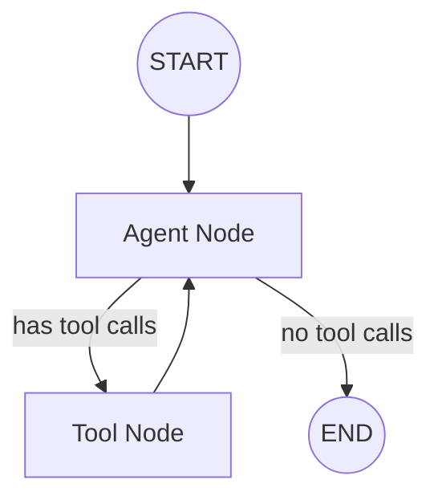
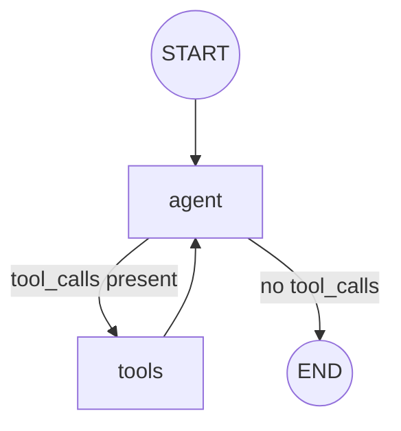

# Building Your First Agent

## Introduction

Now it's time to put everything together. In this lesson, we'll build a complete tool-calling agent using LangGraph—an AI that can reason about problems, use tools, and loop until it has an answer.

This is the culmination of everything we've learned: StateGraph, nodes, conditional edges, state management, and streaming.

### What We'll Cover

- The ReAct agent pattern
- Binding tools to LLMs
- Creating the agent loop
- Handling tool calls and responses
- Building a complete working agent

### Prerequisites

- All previous LangGraph lessons
- Understanding of LangChain tools
- OpenAI API key configured

---

## The ReAct Agent Pattern

ReAct (Reason + Act) agents follow a loop:



1. **Agent** receives messages, decides to use tools or respond
2. **Tools** execute the tool calls, return results
3. **Agent** sees results, continues reasoning or finishes

---

## Setting Up

First, let's set up our imports and LLM:

```python
from typing import Literal
from typing_extensions import TypedDict

from langchain_openai import ChatOpenAI
from langchain_core.messages import HumanMessage, AIMessage, ToolMessage
from langchain_core.tools import tool

from langgraph.graph import StateGraph, MessagesState, START, END
from langgraph.prebuilt import ToolNode


# Initialize LLM
llm = ChatOpenAI(model="gpt-4o-mini")
```

---

## Defining Tools

Create tools for your agent to use:

```python
@tool
def get_weather(location: str) -> str:
    """Get the current weather for a location.
    
    Args:
        location: The city and state, e.g. "San Francisco, CA"
    """
    # Simulated weather data
    weather_data = {
        "San Francisco, CA": "Foggy, 62°F",
        "New York, NY": "Sunny, 75°F",
        "London, UK": "Rainy, 55°F"
    }
    return weather_data.get(location, f"Weather data not available for {location}")


@tool  
def calculate(expression: str) -> str:
    """Evaluate a mathematical expression.
    
    Args:
        expression: A mathematical expression like "2 + 2" or "sqrt(16)"
    """
    import math
    
    # Safe evaluation with math functions
    allowed = {
        "sqrt": math.sqrt,
        "sin": math.sin,
        "cos": math.cos,
        "pi": math.pi,
        "abs": abs,
        "round": round
    }
    
    try:
        result = eval(expression, {"__builtins__": {}}, allowed)
        return str(result)
    except Exception as e:
        return f"Error: {e}"


@tool
def search(query: str) -> str:
    """Search for information on a topic.
    
    Args:
        query: The search query
    """
    # Simulated search results
    return f"Search results for '{query}': [Simulated search data]"


# Collect tools
tools = [get_weather, calculate, search]
```

---

## Binding Tools to the LLM

Tell the LLM about available tools:

```python
# Bind tools to the model
llm_with_tools = llm.bind_tools(tools)
```

When you call this LLM, it can now choose to use these tools.

---

## Creating the Agent Node

The agent node calls the LLM and returns its response:

```python
def agent(state: MessagesState) -> dict:
    """The agent node - calls the LLM."""
    messages = state["messages"]
    response = llm_with_tools.invoke(messages)
    return {"messages": [response]}
```

---

## Creating the Router

Decide whether to continue with tools or end:

```python
def should_continue(state: MessagesState) -> Literal["tools", "__end__"]:
    """Route based on whether the LLM wants to use tools."""
    messages = state["messages"]
    last_message = messages[-1]
    
    # If the LLM made tool calls, route to tools
    if last_message.tool_calls:
        return "tools"
    
    # Otherwise, we're done
    return END
```

---

## Building the Graph

Now assemble the complete agent:

```python
from langgraph.prebuilt import ToolNode


# Create tool node (executes tool calls)
tool_node = ToolNode(tools)

# Build the graph
graph = StateGraph(MessagesState)

# Add nodes
graph.add_node("agent", agent)
graph.add_node("tools", tool_node)

# Add edges
graph.add_edge(START, "agent")
graph.add_conditional_edges(
    "agent",
    should_continue,
    {
        "tools": "tools",
        END: END
    }
)
graph.add_edge("tools", "agent")  # After tools, go back to agent

# Compile
agent_app = graph.compile()
```

### Graph Visualization



---

## Running the Agent

Test your agent:

```python
# Simple query (no tools needed)
result = agent_app.invoke({
    "messages": [("user", "What is 2 + 2?")]
})
print(result["messages"][-1].content)

# Query that needs tools
result = agent_app.invoke({
    "messages": [("user", "What's the weather in San Francisco?")]
})
print(result["messages"][-1].content)

# Complex query (multiple tools)
result = agent_app.invoke({
    "messages": [("user", "What's the weather in NYC and what is sqrt(144)?")]
})
print(result["messages"][-1].content)
```

---

## Streaming the Agent

Watch the agent think in real-time:

```python
print("Agent thinking...\n")

for chunk in agent_app.stream(
    {"messages": [("user", "What's the weather in London and calculate 15 * 7?")]},
    stream_mode="updates"
):
    for node_name, updates in chunk.items():
        print(f"=== {node_name.upper()} ===")
        
        messages = updates.get("messages", [])
        for msg in messages:
            if hasattr(msg, "tool_calls") and msg.tool_calls:
                print(f"Tool calls: {[tc['name'] for tc in msg.tool_calls]}")
            elif hasattr(msg, "content") and msg.content:
                print(f"Response: {msg.content[:100]}...")
        print()
```

---

## Complete Agent Code

Here's the full implementation:

```python
from typing import Literal
from langchain_openai import ChatOpenAI
from langchain_core.tools import tool
from langgraph.graph import StateGraph, MessagesState, START, END
from langgraph.prebuilt import ToolNode


# === Tools ===

@tool
def get_weather(location: str) -> str:
    """Get the current weather for a location."""
    weather_data = {
        "San Francisco, CA": "Foggy, 62°F",
        "New York, NY": "Sunny, 75°F",
        "London, UK": "Rainy, 55°F"
    }
    return weather_data.get(location, f"Weather not available for {location}")


@tool
def calculate(expression: str) -> str:
    """Evaluate a mathematical expression."""
    try:
        return str(eval(expression))
    except Exception as e:
        return f"Error: {e}"


tools = [get_weather, calculate]


# === LLM ===

llm = ChatOpenAI(model="gpt-4o-mini")
llm_with_tools = llm.bind_tools(tools)


# === Nodes ===

def agent(state: MessagesState) -> dict:
    """Call the LLM with tools."""
    response = llm_with_tools.invoke(state["messages"])
    return {"messages": [response]}


def should_continue(state: MessagesState) -> Literal["tools", "__end__"]:
    """Route to tools or end."""
    last_message = state["messages"][-1]
    if last_message.tool_calls:
        return "tools"
    return END


# === Graph ===

graph = StateGraph(MessagesState)
graph.add_node("agent", agent)
graph.add_node("tools", ToolNode(tools))

graph.add_edge(START, "agent")
graph.add_conditional_edges("agent", should_continue, {"tools": "tools", END: END})
graph.add_edge("tools", "agent")

agent_app = graph.compile()


# === Run ===

if __name__ == "__main__":
    result = agent_app.invoke({
        "messages": [("user", "What's 25 * 4 and what's the weather in NYC?")]
    })
    print(result["messages"][-1].content)
```

---

## Adding Memory

Make your agent remember conversations:

```python
from langgraph.checkpoint.memory import MemorySaver


memory = MemorySaver()
agent_with_memory = graph.compile(checkpointer=memory)

config = {"configurable": {"thread_id": "session-1"}}

# First message
result1 = agent_with_memory.invoke(
    {"messages": [("user", "My name is Alice")]},
    config=config
)

# Second message - remembers the first
result2 = agent_with_memory.invoke(
    {"messages": [("user", "What's my name?")]},
    config=config
)

print(result2["messages"][-1].content)  # "Your name is Alice!"
```

---

## Custom State for Agents

Extend MessagesState for additional tracking:

```python
from typing import Annotated
import operator


class AgentState(MessagesState):
    """Extended state for tracking agent behavior."""
    tool_calls_made: Annotated[list[str], operator.add]
    iteration_count: int


def agent_with_tracking(state: AgentState) -> dict:
    """Agent that tracks its own behavior."""
    response = llm_with_tools.invoke(state["messages"])
    
    # Track tool calls
    tool_names = [tc["name"] for tc in response.tool_calls] if response.tool_calls else []
    
    return {
        "messages": [response],
        "tool_calls_made": tool_names,
        "iteration_count": state.get("iteration_count", 0) + 1
    }
```

---

## Prebuilt Agent

For simple cases, use the prebuilt agent:

```python
from langgraph.prebuilt import create_react_agent


# One-liner agent creation
simple_agent = create_react_agent(llm, tools)

result = simple_agent.invoke({
    "messages": [("user", "What's the weather in SF?")]
})
```

### When to Use Prebuilt vs Custom

| Scenario | Use |
|----------|-----|
| Simple tool-calling agent | `create_react_agent` |
| Custom state or logic | Build your own graph |
| Special routing rules | Build your own graph |
| Learning LangGraph | Build your own graph |

---

## Debugging Your Agent

### Print Message Flow

```python
def debug_agent(state: MessagesState) -> dict:
    """Agent with debug output."""
    print(f"Messages: {len(state['messages'])}")
    
    for msg in state["messages"]:
        print(f"  {msg.type}: {str(msg.content)[:50]}...")
    
    response = llm_with_tools.invoke(state["messages"])
    
    if response.tool_calls:
        print(f"Tool calls: {[tc['name'] for tc in response.tool_calls]}")
    
    return {"messages": [response]}
```

### Visualize the Graph

```python
# In Jupyter
from IPython.display import Image
Image(agent_app.get_graph().draw_mermaid_png())
```

---

## Best Practices

| Practice | Description |
|----------|-------------|
| Keep tools focused | One purpose per tool |
| Document tools well | LLM uses docstrings to understand |
| Handle tool errors | Return error messages, don't crash |
| Set recursion limits | Prevent infinite loops |
| Use streaming for UX | Show progress to users |

---

## Common Pitfalls

| ❌ Mistake | ✅ Solution |
|-----------|-------------|
| Tools without docstrings | Always document tool purpose and args |
| No recursion limit | Set `recursion_limit` in config |
| Ignoring tool errors | Wrap tool logic in try/except |
| Not testing tools | Test tools independently first |
| Complex tools | Break into smaller, focused tools |

---

## Hands-on Exercise

### Your Task

Build a research assistant agent that can:
1. Search for information
2. Summarize findings
3. Answer follow-up questions

### Requirements

1. Create `search` and `summarize` tools
2. Build agent with MessagesState
3. Add memory for conversation continuity
4. Test with multi-turn conversation

### Expected Behavior

```python
# Turn 1
agent.invoke({"messages": [("user", "Search for LangGraph basics")]})
# Agent uses search tool, returns results

# Turn 2  
agent.invoke({"messages": [("user", "Summarize what you found")]})
# Agent uses summarize tool, returns summary

# Turn 3
agent.invoke({"messages": [("user", "What was the main topic?")]})
# Agent remembers and answers from context
```

<details>
<summary>💡 Hints (click to expand)</summary>

1. Use `@tool` decorator for each tool
2. Tools should return strings
3. Use `MemorySaver` for conversation memory
4. Pass consistent `thread_id` in config
5. The LLM decides which tools to use

</details>

<details>
<summary>✅ Solution (click to expand)</summary>

```python
from typing import Literal
from langchain_openai import ChatOpenAI
from langchain_core.tools import tool
from langgraph.graph import StateGraph, MessagesState, START, END
from langgraph.prebuilt import ToolNode
from langgraph.checkpoint.memory import MemorySaver


# === Tools ===

@tool
def search(query: str) -> str:
    """Search for information on a topic.
    
    Args:
        query: The search query
    """
    # Simulated search
    results = {
        "langgraph": "LangGraph is a library for building stateful agents with LLMs.",
        "react agents": "ReAct agents combine reasoning and acting in a loop.",
        "default": f"Search results for '{query}': Found relevant information."
    }
    
    for key, value in results.items():
        if key.lower() in query.lower():
            return value
    return results["default"]


@tool
def summarize(text: str) -> str:
    """Summarize a piece of text.
    
    Args:
        text: The text to summarize
    """
    # Simple summary simulation
    word_count = len(text.split())
    return f"Summary ({word_count} words): {text[:100]}... [Key points extracted]"


tools = [search, summarize]


# === LLM ===

llm = ChatOpenAI(model="gpt-4o-mini")
llm_with_tools = llm.bind_tools(tools)


# === Nodes ===

def agent(state: MessagesState) -> dict:
    response = llm_with_tools.invoke(state["messages"])
    return {"messages": [response]}


def should_continue(state: MessagesState) -> Literal["tools", "__end__"]:
    if state["messages"][-1].tool_calls:
        return "tools"
    return END


# === Graph ===

graph = StateGraph(MessagesState)
graph.add_node("agent", agent)
graph.add_node("tools", ToolNode(tools))

graph.add_edge(START, "agent")
graph.add_conditional_edges("agent", should_continue, {"tools": "tools", END: END})
graph.add_edge("tools", "agent")

# Compile with memory
memory = MemorySaver()
research_agent = graph.compile(checkpointer=memory)


# === Test ===

config = {"configurable": {"thread_id": "research-session"}}

# Turn 1: Search
print("=== Turn 1 ===")
result1 = research_agent.invoke(
    {"messages": [("user", "Search for LangGraph basics")]},
    config=config
)
print(result1["messages"][-1].content)

# Turn 2: Summarize
print("\n=== Turn 2 ===")
result2 = research_agent.invoke(
    {"messages": [("user", "Summarize what you found")]},
    config=config
)
print(result2["messages"][-1].content)

# Turn 3: Follow-up
print("\n=== Turn 3 ===")
result3 = research_agent.invoke(
    {"messages": [("user", "What was the main topic we discussed?")]},
    config=config
)
print(result3["messages"][-1].content)
```

</details>

---

## Summary

✅ ReAct agents loop between reasoning (LLM) and acting (tools)

✅ Bind tools to LLMs with `llm.bind_tools(tools)`

✅ Use conditional edges to route based on tool calls

✅ `ToolNode` automatically executes tool calls

✅ Add memory with checkpointers for conversations

✅ Use `create_react_agent` for simple cases

**Congratulations!** You've learned the fundamentals of LangGraph. From here, explore:
- Multi-agent systems
- Human-in-the-loop workflows
- Subgraphs and complex architectures

---

## Further Reading

- [LangGraph Quickstart](https://docs.langchain.com/oss/python/langgraph/quickstart)
- [Prebuilt ReAct Agent](https://docs.langchain.com/oss/python/langgraph/prebuilt/react)
- [Tool Calling Guide](https://docs.langchain.com/oss/python/langgraph/how-tos/tool-calling)
- [Multi-Agent Systems](https://docs.langchain.com/oss/python/langgraph/concepts/multi-agent)

---

<!-- 
Sources Consulted:
- LangGraph Quickstart: https://docs.langchain.com/oss/python/langgraph/quickstart
- LangGraph Overview: https://docs.langchain.com/oss/python/langgraph/overview
- LangGraph Graph API: https://docs.langchain.com/oss/python/langgraph/graph-api
-->
