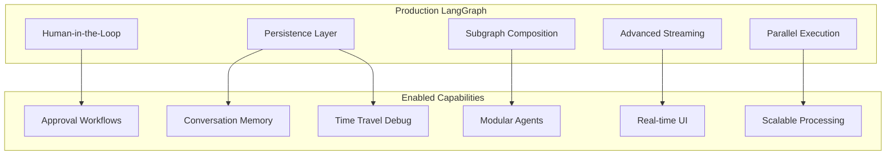
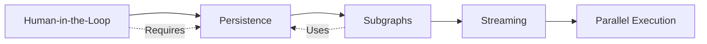

# LangGraph Advanced Patterns

## Module Overview

Building on the fundamentals, this module covers advanced LangGraph patterns essential for production-ready AI agents. You'll learn how to pause execution for human approval, persist state across sessions, compose modular subgraphs, and implement sophisticated streaming for real-time applications.

These patterns distinguish production agents from prototypes—enabling true human-in-the-loop workflows, fault-tolerant execution, and scalable architectures.

---

## Module Roadmap

| Lesson | Topic | Key Concepts |
|--------|-------|--------------|
| 01 | [Human-in-the-Loop](./01-human-in-the-loop.md) | `interrupt()`, `Command`, approve/reject, review patterns |
| 02 | [Persistence & Checkpointing](./02-persistence-checkpointing.md) | Checkpointers, threads, time travel, state recovery |
| 03 | [Subgraphs & Composition](./03-subgraphs-composition.md) | Nested graphs, state transforms, modular design |
| 04 | [Advanced Streaming](./04-advanced-streaming.md) | Stream modes, SSE, real-time UI, token streaming |
| 05 | [Parallel Execution](./05-parallel-execution.md) | Send, map-reduce, fan-out, tool nodes |

---

## Core Architecture



---

## Prerequisites

Before starting this module, ensure you understand:

- ✅ StateGraph creation and compilation
- ✅ Node functions and edge types
- ✅ State management with reducers
- ✅ Basic execution with `invoke()` and `stream()`
- ✅ Building tool-calling agents

If any of these are unfamiliar, review the [LangGraph Fundamentals](../13-langgraph-fundamentals/00-langgraph-fundamentals-overview.md) module first.

---

## Key Terminology

| Term | Definition |
|------|------------|
| **interrupt()** | Function that pauses graph execution, waiting for external input |
| **Command** | Object used to resume execution with data after an interrupt |
| **Checkpointer** | Component that persists graph state for recovery and memory |
| **Thread** | Unique identifier for a conversation/execution session |
| **Checkpoint** | Snapshot of graph state at a specific execution step |
| **Subgraph** | A compiled graph used as a node within a parent graph |
| **Send** | Mechanism for dispatching parallel work to nodes |
| **Durability Mode** | Controls how frequently state is persisted (sync, async, exit) |

---

## Why These Patterns Matter

### Human-in-the-Loop

Real-world agents need human oversight:
- Approve high-stakes actions before execution
- Review and edit AI-generated content
- Validate tool calls before they run

### Persistence

Production systems must be:
- **Resumable** — Continue conversations after interruption
- **Recoverable** — Resume from failures without data loss
- **Auditable** — Track execution history for debugging

### Subgraphs

Complex agents require:
- **Modularity** — Reusable components across projects
- **Team scaling** — Different teams own different subgraphs
- **Maintainability** — Smaller, focused graphs are easier to debug

### Streaming

User experience demands:
- **Real-time feedback** — Show progress as work happens
- **Token streaming** — Display LLM responses as they generate
- **Event tracking** — Monitor execution for debugging

---

## Quick Start Example

Here's a preview of what you'll build—an approval workflow with persistence:

```python
from langgraph.graph import StateGraph, START, END
from langgraph.types import interrupt, Command
from langgraph.checkpoint.memory import MemorySaver
from typing import Literal
from typing_extensions import TypedDict


class ApprovalState(TypedDict):
    request: str
    approved: bool
    reviewer_notes: str


def request_approval(state: ApprovalState) -> Command[Literal["process"]]:
    """Pause for human approval."""
    response = interrupt({
        "question": f"Approve this request: {state['request']}?",
        "options": ["approve", "reject"]
    })
    
    return Command(
        update={
            "approved": response["decision"] == "approve",
            "reviewer_notes": response.get("notes", "")
        },
        goto="process"
    )


def process_request(state: ApprovalState) -> dict:
    """Process based on approval status."""
    if state["approved"]:
        return {"request": f"✅ APPROVED: {state['request']}"}
    return {"request": f"❌ REJECTED: {state['request']}"}


# Build graph
graph = StateGraph(ApprovalState)
graph.add_node("get_approval", request_approval)
graph.add_node("process", process_request)
graph.add_edge(START, "get_approval")
graph.add_edge("process", END)

# Compile with persistence
memory = MemorySaver()
app = graph.compile(checkpointer=memory)

# Start execution (will pause at interrupt)
config = {"configurable": {"thread_id": "approval-1"}}
result = app.invoke(
    {"request": "Deploy to production", "approved": False, "reviewer_notes": ""},
    config=config
)

# Resume with approval
from langgraph.types import Command
result = app.invoke(
    Command(resume={"decision": "approve", "notes": "Looks good!"}),
    config=config
)

print(result["request"])  # "✅ APPROVED: Deploy to production"
```

---

## Installation

Advanced features require the base LangGraph package:

```bash
pip install langgraph langchain-openai
```

For production persistence:

```bash
# SQLite (local development)
pip install langgraph-checkpoint-sqlite

# PostgreSQL (production)
pip install langgraph-checkpoint-postgres
```

---

## Learning Path



1. **Start with Human-in-the-Loop** — Learn how `interrupt()` and `Command` work
2. **Add Persistence** — Enable checkpointing (required for interrupts)
3. **Compose with Subgraphs** — Build modular, reusable components
4. **Implement Streaming** — Add real-time feedback to applications
5. **Scale with Parallelism** — Handle concurrent operations efficiently

---

**Next:** [Human-in-the-Loop →](./01-human-in-the-loop.md)
