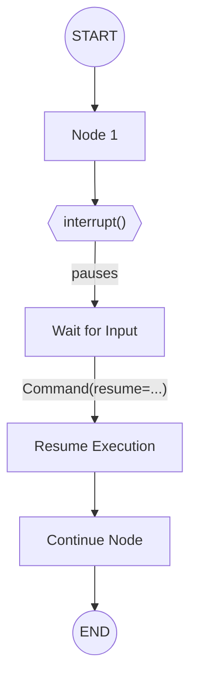

# Human-in-the-Loop

## Introduction

Real-world AI agents need human oversight. Whether approving high-stakes actions, reviewing generated content, or validating tool calls, the ability to pause execution and wait for human input is essential.

LangGraph's `interrupt()` function enables true human-in-the-loop (HITL) workflows—pausing execution at any point and resuming with external input.

### What We'll Cover

- The `interrupt()` function and how it works
- Resuming with `Command`
- Approve/reject patterns
- Review and edit workflows
- Validating human input
- Interrupts in tool functions

### Prerequisites

- LangGraph fundamentals (StateGraph, nodes, edges)
- Understanding of checkpointers (required for interrupts)
- Basic graph execution patterns

---

## How Interrupts Work



When `interrupt()` is called:

1. **Graph pauses** at the exact point of the call
2. **State is saved** via the checkpointer
3. **Payload returns** to the caller under `__interrupt__`
4. **Graph waits** indefinitely for resume
5. **Resume value** becomes the return value of `interrupt()`

---

## Basic Interrupt Pattern

```python
from langgraph.graph import StateGraph, START, END
from langgraph.types import interrupt
from langgraph.checkpoint.memory import MemorySaver
from typing_extensions import TypedDict


class State(TypedDict):
    question: str
    answer: str


def ask_human(state: State) -> dict:
    """Pause and ask for human input."""
    # interrupt() pauses execution here
    response = interrupt(f"Please answer: {state['question']}")
    
    # When resumed, response contains the human's input
    return {"answer": response}


# Build graph
graph = StateGraph(State)
graph.add_node("ask", ask_human)
graph.add_edge(START, "ask")
graph.add_edge("ask", END)

# Compile with checkpointer (REQUIRED for interrupts)
memory = MemorySaver()
app = graph.compile(checkpointer=memory)
```

### Running the Interrupted Graph

```python
# Thread ID identifies this conversation
config = {"configurable": {"thread_id": "q1"}}

# Start execution - will pause at interrupt
result = app.invoke(
    {"question": "What is your name?", "answer": ""},
    config=config
)

# Check what was interrupted
print(result["__interrupt__"])
# [Interrupt(value="Please answer: What is your name?")]

# Resume with human's response
from langgraph.types import Command

result = app.invoke(
    Command(resume="Alice"),
    config=config
)

print(result["answer"])  # "Alice"
```

---

## Requirements for Interrupts

| Requirement | Why |
|-------------|-----|
| **Checkpointer** | Saves state so execution can resume |
| **Thread ID** | Identifies which conversation to resume |
| **JSON-serializable payload** | Interrupt value must be serializable |

```python
# Always compile with a checkpointer
app = graph.compile(checkpointer=MemorySaver())

# Always use a thread_id in config
config = {"configurable": {"thread_id": "unique-id"}}
```

> **Warning:** Without a checkpointer, `interrupt()` will raise an error!

---

## Approve or Reject Pattern

The most common HITL pattern—pausing before critical actions:

```python
from typing import Literal
from langgraph.types import interrupt, Command
from typing_extensions import TypedDict


class ApprovalState(TypedDict):
    action: str
    approved: bool
    reason: str


def approval_node(state: ApprovalState) -> Command[Literal["execute", "cancel"]]:
    """Pause for approval before executing action."""
    response = interrupt({
        "question": f"Approve action: {state['action']}?",
        "options": ["approve", "reject"]
    })
    
    if response["decision"] == "approve":
        return Command(
            update={"approved": True, "reason": response.get("notes", "")},
            goto="execute"
        )
    else:
        return Command(
            update={"approved": False, "reason": response.get("notes", "")},
            goto="cancel"
        )


def execute_action(state: ApprovalState) -> dict:
    return {"action": f"✅ Executed: {state['action']}"}


def cancel_action(state: ApprovalState) -> dict:
    return {"action": f"❌ Cancelled: {state['action']}"}


# Build graph
graph = StateGraph(ApprovalState)
graph.add_node("get_approval", approval_node)
graph.add_node("execute", execute_action)
graph.add_node("cancel", cancel_action)

graph.add_edge(START, "get_approval")
graph.add_edge("execute", END)
graph.add_edge("cancel", END)

memory = MemorySaver()
app = graph.compile(checkpointer=memory)
```

### Approving

```python
config = {"configurable": {"thread_id": "action-1"}}

# Start - pauses for approval
app.invoke({"action": "Delete database", "approved": False, "reason": ""}, config)

# Approve
result = app.invoke(
    Command(resume={"decision": "approve", "notes": "Backup confirmed"}),
    config
)
print(result["action"])  # "✅ Executed: Delete database"
```

### Rejecting

```python
# Reject
result = app.invoke(
    Command(resume={"decision": "reject", "notes": "Too risky"}),
    config
)
print(result["action"])  # "❌ Cancelled: Delete database"
```

---

## Review and Edit Pattern

Let humans review and modify state before continuing:

```python
from langgraph.types import interrupt


def review_node(state: State) -> dict:
    """Pause for human review and editing."""
    edited = interrupt({
        "instruction": "Review and edit this content",
        "current_content": state["generated_text"]
    })
    
    return {"generated_text": edited}
```

### Usage

```python
config = {"configurable": {"thread_id": "doc-1"}}

# Generate content and pause for review
result = app.invoke({"generated_text": "Draft content..."}, config)

# Human reviews, edits, and submits
result = app.invoke(
    Command(resume="Edited and improved content..."),
    config
)
```

---

## Validating Human Input

Use a loop to keep asking until valid input is provided:

```python
from langgraph.types import interrupt


def get_valid_age(state: State) -> dict:
    """Keep asking until valid age is provided."""
    prompt = "What is your age?"
    
    while True:
        answer = interrupt(prompt)
        
        # Validate
        if isinstance(answer, int) and answer > 0 and answer < 150:
            break
        
        # Invalid - ask again with better prompt
        prompt = f"'{answer}' is not valid. Please enter a number between 1-150."
    
    return {"age": answer}
```

Each resume continues the loop until validation passes.

---

## Interrupts in Tools

Place interrupts directly inside tool functions for automatic approval:

```python
from langchain_core.tools import tool
from langgraph.types import interrupt


@tool
def send_email(to: str, subject: str, body: str) -> str:
    """Send an email to a recipient."""
    
    # Pause for approval before sending
    response = interrupt({
        "action": "send_email",
        "to": to,
        "subject": subject,
        "body": body,
        "message": "Approve sending this email?"
    })
    
    if response.get("action") == "approve":
        # Allow human to edit before sending
        final_to = response.get("to", to)
        final_subject = response.get("subject", subject)
        final_body = response.get("body", body)
        
        # Actually send email here...
        return f"Email sent to {final_to} with subject '{final_subject}'"
    
    return "Email cancelled by user"
```

The tool pauses whenever called, allowing approval or editing.

---

## Static Breakpoints

For debugging, use compile-time breakpoints:

```python
# Pause BEFORE specific nodes
app = graph.compile(
    checkpointer=memory,
    interrupt_before=["critical_node"]
)

# Pause AFTER specific nodes  
app = graph.compile(
    checkpointer=memory,
    interrupt_after=["generate_node"]
)

# Both
app = graph.compile(
    checkpointer=memory,
    interrupt_before=["review"],
    interrupt_after=["generate"]
)
```

Resume by invoking with `None`:

```python
# Run until breakpoint
app.invoke(input, config)

# Resume from breakpoint
app.invoke(None, config)
```

> **Note:** For production HITL, use dynamic `interrupt()` calls. Static breakpoints are mainly for debugging.

---

## Rules of Interrupts

### ❌ Don't Wrap in try/except

Interrupts work by throwing a special exception:

```python
# ❌ BAD - catches the interrupt exception
def bad_node(state):
    try:
        response = interrupt("Question?")
    except Exception as e:
        print(e)  # This catches the interrupt!

# ✅ GOOD - separate interrupt from error-prone code
def good_node(state):
    response = interrupt("Question?")
    try:
        risky_operation()
    except Exception as e:
        handle_error(e)
```

### ❌ Don't Reorder Interrupt Calls

LangGraph matches resume values by index:

```python
# ❌ BAD - conditional interrupts change order
def bad_node(state):
    name = interrupt("Name?")
    if state.get("need_age"):
        age = interrupt("Age?")  # Index changes!
    city = interrupt("City?")

# ✅ GOOD - consistent order every time
def good_node(state):
    name = interrupt("Name?")
    age = interrupt("Age?")
    city = interrupt("City?")
```

### ✅ Use Idempotent Operations

Code before `interrupt()` runs again on resume:

```python
# ❌ BAD - creates duplicate records
def bad_node(state):
    db.create_log_entry("action")  # Runs twice!
    response = interrupt("Approve?")

# ✅ GOOD - idempotent operation
def good_node(state):
    db.upsert_log(id=state["log_id"], status="pending")
    response = interrupt("Approve?")
```

---

## Complete Example: Document Approval

```python
from langgraph.graph import StateGraph, START, END
from langgraph.types import interrupt, Command
from langgraph.checkpoint.memory import MemorySaver
from typing import Literal
from typing_extensions import TypedDict


class DocumentState(TypedDict):
    content: str
    status: str
    reviewer_feedback: str
    version: int


def generate_draft(state: DocumentState) -> dict:
    """Generate initial document draft."""
    draft = f"Draft v{state['version']}: Auto-generated content for review."
    return {"content": draft, "status": "pending_review"}


def review_document(state: DocumentState) -> Command[Literal["revise", "publish"]]:
    """Pause for human review."""
    response = interrupt({
        "action": "review_document",
        "content": state["content"],
        "options": ["approve", "request_changes"]
    })
    
    if response["decision"] == "approve":
        return Command(
            update={"status": "approved", "reviewer_feedback": "LGTM"},
            goto="publish"
        )
    else:
        return Command(
            update={
                "status": "needs_revision",
                "reviewer_feedback": response.get("feedback", ""),
                "version": state["version"] + 1
            },
            goto="revise"
        )


def revise_document(state: DocumentState) -> dict:
    """Revise based on feedback."""
    revised = f"Draft v{state['version']}: Revised based on: {state['reviewer_feedback']}"
    return {"content": revised, "status": "pending_review"}


def publish_document(state: DocumentState) -> dict:
    """Publish the approved document."""
    return {"status": "published"}


# Build graph with loop
graph = StateGraph(DocumentState)

graph.add_node("generate", generate_draft)
graph.add_node("review", review_document)
graph.add_node("revise", revise_document)
graph.add_node("publish", publish_document)

graph.add_edge(START, "generate")
graph.add_edge("generate", "review")
graph.add_edge("revise", "review")  # Loop back for re-review
graph.add_edge("publish", END)

memory = MemorySaver()
app = graph.compile(checkpointer=memory)


# Usage
config = {"configurable": {"thread_id": "doc-123"}}

# Start - generates draft and pauses for review
result = app.invoke({
    "content": "",
    "status": "",
    "reviewer_feedback": "",
    "version": 1
}, config)

# Request changes
result = app.invoke(
    Command(resume={"decision": "request_changes", "feedback": "Add more detail"}),
    config
)

# Now approve the revision
result = app.invoke(
    Command(resume={"decision": "approve"}),
    config
)

print(result["status"])  # "published"
```

---

## Best Practices

| Practice | Description |
|----------|-------------|
| Use meaningful interrupt payloads | Include context for the human reviewer |
| Keep interrupt values simple | Strings, dicts, lists—JSON-serializable |
| Place side effects after interrupt | Avoid re-running operations on resume |
| Use consistent thread IDs | Same ID resumes same conversation |
| Handle both approve and reject | Always provide both paths |

---

## Common Pitfalls

| ❌ Mistake | ✅ Solution |
|-----------|-------------|
| Missing checkpointer | Always compile with checkpointer |
| Catching interrupt exception | Don't wrap in bare try/except |
| Non-idempotent pre-interrupt code | Use upserts, check before create |
| Complex interrupt payloads | Keep to JSON-serializable types |
| Conditional interrupt order | Keep interrupt calls in fixed order |

---

## Hands-on Exercise

### Your Task

Build a content moderation workflow:
1. Content is submitted
2. Moderator reviews and can approve, edit, or reject
3. If edited, show the edit for confirmation
4. Track review history

### Requirements

1. State: `content`, `status`, `edit_history`
2. Use `interrupt()` for moderation decisions
3. Support approve, edit, and reject actions
4. Maintain history of changes

### Expected Flow

```python
# Submit content
app.invoke({"content": "User submitted content"}, config)

# Moderator chooses to edit
app.invoke(Command(resume={
    "action": "edit",
    "new_content": "Cleaned up content"
}), config)

# Confirm edit
app.invoke(Command(resume={"action": "approve"}), config)

# Final state shows approved content with history
```

<details>
<summary>💡 Hints (click to expand)</summary>

1. Use `Annotated[list, operator.add]` for edit_history
2. Return `Command` with `goto` for routing
3. Check `response["action"]` to determine next step
4. Each edit appends to history

</details>

<details>
<summary>✅ Solution (click to expand)</summary>

```python
from typing import Annotated, Literal
from typing_extensions import TypedDict
from langgraph.graph import StateGraph, START, END
from langgraph.types import interrupt, Command
from langgraph.checkpoint.memory import MemorySaver
import operator


class ModerationState(TypedDict):
    content: str
    status: str
    edit_history: Annotated[list[str], operator.add]


def moderate_content(state: ModerationState) -> Command[Literal["confirm", "finalize"]]:
    """Review content and decide action."""
    response = interrupt({
        "action": "moderate",
        "content": state["content"],
        "options": ["approve", "edit", "reject"]
    })
    
    action = response.get("action", "reject")
    
    if action == "approve":
        return Command(
            update={
                "status": "approved",
                "edit_history": ["Approved as-is"]
            },
            goto="finalize"
        )
    elif action == "edit":
        new_content = response.get("new_content", state["content"])
        return Command(
            update={
                "content": new_content,
                "status": "edited",
                "edit_history": [f"Edited: {new_content[:50]}..."]
            },
            goto="confirm"
        )
    else:
        return Command(
            update={
                "status": "rejected",
                "edit_history": [f"Rejected: {response.get('reason', 'No reason')}"]
            },
            goto="finalize"
        )


def confirm_edit(state: ModerationState) -> Command[Literal["moderate", "finalize"]]:
    """Confirm the edited content."""
    response = interrupt({
        "action": "confirm_edit",
        "content": state["content"],
        "options": ["approve", "edit_again"]
    })
    
    if response.get("action") == "approve":
        return Command(
            update={
                "status": "approved",
                "edit_history": ["Edit confirmed"]
            },
            goto="finalize"
        )
    else:
        return Command(goto="moderate")


def finalize(state: ModerationState) -> dict:
    """Finalize the moderation."""
    return {"status": f"Final: {state['status']}"}


# Build graph
graph = StateGraph(ModerationState)

graph.add_node("moderate", moderate_content)
graph.add_node("confirm", confirm_edit)
graph.add_node("finalize", finalize)

graph.add_edge(START, "moderate")
graph.add_edge("finalize", END)

memory = MemorySaver()
app = graph.compile(checkpointer=memory)


# Test
config = {"configurable": {"thread_id": "mod-1"}}

# Submit
app.invoke({
    "content": "User content to moderate",
    "status": "",
    "edit_history": []
}, config)

# Edit
app.invoke(Command(resume={
    "action": "edit",
    "new_content": "Cleaned content"
}), config)

# Approve edit
result = app.invoke(Command(resume={"action": "approve"}), config)

print(f"Status: {result['status']}")
print(f"History: {result['edit_history']}")
```

</details>

---

## Summary

✅ `interrupt()` pauses execution and returns a value to the caller

✅ `Command(resume=...)` resumes execution with human input

✅ Checkpointers are required—they save state for resumption

✅ Thread IDs identify which conversation to resume

✅ Keep interrupt payloads JSON-serializable

✅ Code before interrupt runs again on resume—use idempotent operations

**Next:** [Persistence & Checkpointing →](./02-persistence-checkpointing.md)

---

## Further Reading

- [LangGraph Interrupts Documentation](https://docs.langchain.com/oss/python/langgraph/interrupts)
- [Human-in-the-Loop Patterns](https://docs.langchain.com/oss/python/langgraph/interrupts#common-patterns)
- [LangGraph Persistence](https://docs.langchain.com/oss/python/langgraph/persistence)

---

<!-- 
Sources Consulted:
- LangGraph Interrupts: https://docs.langchain.com/oss/python/langgraph/interrupts
- LangGraph Persistence: https://docs.langchain.com/oss/python/langgraph/persistence
-->
