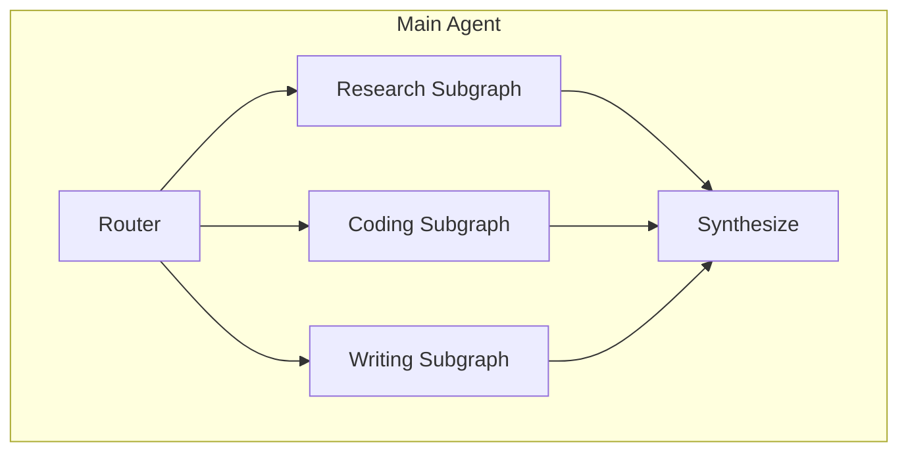
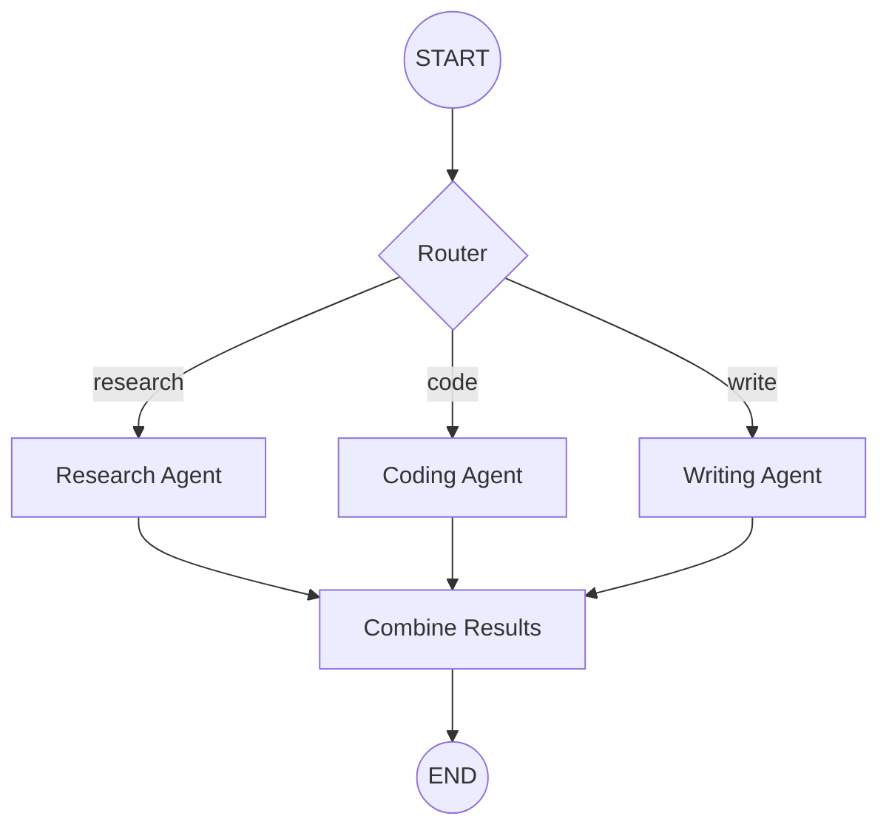
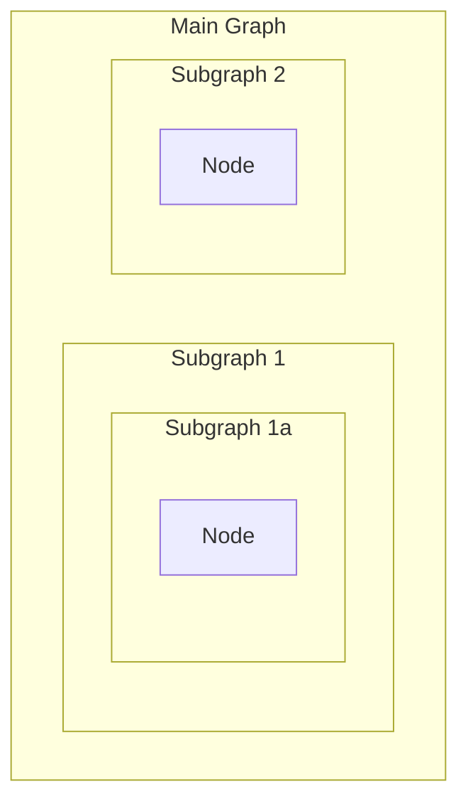

# Subgraphs & Composition

## Introduction

As AI applications grow complex, modular design becomes essential. LangGraph subgraphs let you compose smaller, focused graphs into larger systems—enabling code reuse, team collaboration, and maintainable architectures.

In this lesson, we'll explore how to create reusable subgraphs, embed them in parent graphs, and handle state transformations between different schemas.

### What We'll Cover

- Why use subgraphs
- Creating reusable subgraphs
- Adding subgraphs as nodes
- Invoking subgraphs from nodes
- State transformation patterns
- Persistence with subgraphs
- Streaming from subgraphs

### Prerequisites

- StateGraph fundamentals
- State schema design
- Understanding of graph compilation

---

## Why Use Subgraphs



Subgraphs enable:

| Benefit | Description |
|---------|-------------|
| **Modularity** | Break complex agents into manageable pieces |
| **Reusability** | Use the same subgraph in multiple parent graphs |
| **Team Scaling** | Different teams own different subgraphs |
| **Testing** | Test subgraphs independently |
| **Maintenance** | Smaller graphs are easier to debug |

---

## Two Approaches to Subgraphs

| Approach | When to Use |
|----------|-------------|
| **Add as Node** | Subgraph shares state keys with parent |
| **Invoke from Node** | Subgraph has completely different state schema |

---

## Approach 1: Add as Node (Shared State)

When parent and subgraph share state keys, add the compiled subgraph directly as a node:

```python
from langgraph.graph import StateGraph, START, END
from typing_extensions import TypedDict


# Shared state schema
class SharedState(TypedDict):
    query: str
    result: str


# Subgraph
def subgraph_process(state: SharedState) -> dict:
    return {"result": f"Processed: {state['query']}"}


subgraph_builder = StateGraph(SharedState)
subgraph_builder.add_node("process", subgraph_process)
subgraph_builder.add_edge(START, "process")
subgraph_builder.add_edge("process", END)

subgraph = subgraph_builder.compile()


# Parent graph - add subgraph directly as node
def prepare(state: SharedState) -> dict:
    return {"query": state["query"].upper()}


parent_builder = StateGraph(SharedState)
parent_builder.add_node("prepare", prepare)
parent_builder.add_node("subgraph", subgraph)  # Add compiled subgraph!
parent_builder.add_edge(START, "prepare")
parent_builder.add_edge("prepare", "subgraph")
parent_builder.add_edge("subgraph", END)

parent_app = parent_builder.compile()

# Run
result = parent_app.invoke({"query": "hello", "result": ""})
print(result["result"])  # "Processed: HELLO"
```

### How It Works

1. Subgraph is compiled separately
2. Compiled subgraph is passed to `add_node()`
3. Parent and subgraph share state keys—updates flow automatically
4. No state transformation needed

---

## Approach 2: Invoke from Node (Different State)

When subgraph has a completely different state schema, invoke it from within a node:

```python
from langgraph.graph import StateGraph, START, END
from typing_extensions import TypedDict


# Parent state
class ParentState(TypedDict):
    user_query: str
    final_answer: str


# Subgraph state (completely different!)
class ResearchState(TypedDict):
    topic: str
    findings: list[str]


# Subgraph
def search_web(state: ResearchState) -> dict:
    return {"findings": [f"Web result for: {state['topic']}"]}


def search_docs(state: ResearchState) -> dict:
    findings = state.get("findings", [])
    findings.append(f"Doc result for: {state['topic']}")
    return {"findings": findings}


research_builder = StateGraph(ResearchState)
research_builder.add_node("web", search_web)
research_builder.add_node("docs", search_docs)
research_builder.add_edge(START, "web")
research_builder.add_edge("web", "docs")
research_builder.add_edge("docs", END)

research_subgraph = research_builder.compile()


# Parent graph - invoke subgraph from node
def call_research(state: ParentState) -> dict:
    """Transform state, call subgraph, transform back."""
    
    # Transform: ParentState -> ResearchState
    subgraph_input = {
        "topic": state["user_query"],
        "findings": []
    }
    
    # Invoke subgraph
    subgraph_output = research_subgraph.invoke(subgraph_input)
    
    # Transform: ResearchState -> ParentState update
    findings = subgraph_output["findings"]
    return {"final_answer": " | ".join(findings)}


parent_builder = StateGraph(ParentState)
parent_builder.add_node("research", call_research)
parent_builder.add_edge(START, "research")
parent_builder.add_edge("research", END)

parent_app = parent_builder.compile()

# Run
result = parent_app.invoke({"user_query": "LangGraph", "final_answer": ""})
print(result["final_answer"])
# "Web result for: LangGraph | Doc result for: LangGraph"
```

### When to Use This Pattern

- Multi-agent systems with private message histories
- Subgraphs from different teams/projects
- Complete state isolation needed
- Complex transformations between schemas

---

## State Transformation Functions

For cleaner code, extract transformations:

```python
def parent_to_subgraph(parent_state: ParentState) -> ResearchState:
    """Transform parent state to subgraph state."""
    return {
        "topic": parent_state["user_query"],
        "findings": []
    }


def subgraph_to_parent(subgraph_state: ResearchState) -> dict:
    """Transform subgraph output to parent state update."""
    return {
        "final_answer": " | ".join(subgraph_state["findings"])
    }


def call_research(state: ParentState) -> dict:
    subgraph_input = parent_to_subgraph(state)
    subgraph_output = research_subgraph.invoke(subgraph_input)
    return subgraph_to_parent(subgraph_output)
```

---

## Multi-Agent with Subgraphs



### Shared Messages Pattern

Agents often share a `messages` key for communication:

```python
from langgraph.graph import StateGraph, MessagesState, START, END


# Research agent subgraph
def research_agent(state: MessagesState) -> dict:
    # Process messages, do research
    return {"messages": [AIMessage(content="Research findings...")]}


research_builder = StateGraph(MessagesState)
research_builder.add_node("research", research_agent)
research_builder.add_edge(START, "research")
research_builder.add_edge("research", END)

research_graph = research_builder.compile()


# Coding agent subgraph
def coding_agent(state: MessagesState) -> dict:
    return {"messages": [AIMessage(content="Code solution...")]}


coding_builder = StateGraph(MessagesState)
coding_builder.add_node("code", coding_agent)
coding_builder.add_edge(START, "code")
coding_builder.add_edge("code", END)

coding_graph = coding_builder.compile()


# Main orchestrator
class OrchestratorState(MessagesState):
    next_agent: str


def router(state: OrchestratorState) -> dict:
    # Determine which agent to call based on messages
    last_message = state["messages"][-1].content.lower()
    if "research" in last_message:
        return {"next_agent": "research"}
    return {"next_agent": "code"}


def route_to_agent(state: OrchestratorState) -> str:
    return state["next_agent"]


main_builder = StateGraph(OrchestratorState)
main_builder.add_node("router", router)
main_builder.add_node("research", research_graph)  # Subgraph as node
main_builder.add_node("code", coding_graph)        # Subgraph as node

main_builder.add_edge(START, "router")
main_builder.add_conditional_edges(
    "router",
    route_to_agent,
    {"research": "research", "code": "code"}
)
main_builder.add_edge("research", END)
main_builder.add_edge("code", END)

orchestrator = main_builder.compile()
```

---

## Private Message Histories

Each agent can maintain its own message history:

```python
class AgentState(MessagesState):
    """Each agent has its own messages."""
    pass


class OrchestratorState(TypedDict):
    """Orchestrator only sees summaries."""
    task: str
    agent_summaries: dict[str, str]


def call_research_agent(state: OrchestratorState) -> dict:
    """Call research agent with private message history."""
    
    # Research agent has its own messages
    agent_result = research_graph.invoke({
        "messages": [HumanMessage(content=state["task"])]
    })
    
    # Only return summary to orchestrator
    summary = agent_result["messages"][-1].content[:100]
    
    return {
        "agent_summaries": {
            **state.get("agent_summaries", {}),
            "research": summary
        }
    }
```

---

## Persistence with Subgraphs

Only provide checkpointer to the **parent graph**:

```python
from langgraph.checkpoint.memory import MemorySaver

# Subgraph - no checkpointer
subgraph = subgraph_builder.compile()

# Parent - with checkpointer
memory = MemorySaver()
parent_app = parent_builder.compile(checkpointer=memory)
```

LangGraph automatically propagates the checkpointer to subgraphs.

### Independent Subgraph Memory

If a subgraph needs its own memory (separate from parent):

```python
# Compile subgraph with checkpointer=True
subgraph = subgraph_builder.compile(checkpointer=True)
```

---

## Viewing Subgraph State

When paused inside a subgraph:

```python
# Get state including subgraph details
state = parent_app.get_state(config, subgraphs=True)

# Examine subgraph state
print(state.tasks)  # Shows subgraph tasks and their state
```

> **Note:** Subgraph state is only accessible when the subgraph is interrupted.

---

## Streaming from Subgraphs

Include subgraph outputs in streaming:

```python
for chunk in parent_app.stream(
    {"query": "Hello"},
    stream_mode="updates",
    subgraphs=True  # Include subgraph events!
):
    print(chunk)
```

### Output Structure

```python
# Without subgraphs=True
{"prepare": {"query": "HELLO"}}
{"subgraph": {"result": "Processed: HELLO"}}

# With subgraphs=True - includes nested details
((), {"prepare": {"query": "HELLO"}})
(("subgraph",), {"process": {"result": "Processed: HELLO"}})
```

---

## Nested Subgraphs

Subgraphs can contain subgraphs:



```python
# Level 3: Deepest subgraph
inner_builder = StateGraph(State)
inner_builder.add_node("inner", inner_node)
inner_builder.add_edge(START, "inner")
inner_builder.add_edge("inner", END)
inner_graph = inner_builder.compile()

# Level 2: Middle subgraph
middle_builder = StateGraph(State)
middle_builder.add_node("middle", middle_node)
middle_builder.add_node("inner", inner_graph)  # Nested!
middle_builder.add_edge(START, "middle")
middle_builder.add_edge("middle", "inner")
middle_builder.add_edge("inner", END)
middle_graph = middle_builder.compile()

# Level 1: Outer graph
outer_builder = StateGraph(State)
outer_builder.add_node("outer", outer_node)
outer_builder.add_node("middle", middle_graph)  # Nested!
outer_builder.add_edge(START, "outer")
outer_builder.add_edge("outer", "middle")
outer_builder.add_edge("middle", END)
outer_app = outer_builder.compile()
```

---

## Complete Example: Modular Assistant

```python
from langgraph.graph import StateGraph, MessagesState, START, END
from langchain_openai import ChatOpenAI
from langchain_core.messages import AIMessage, HumanMessage


llm = ChatOpenAI(model="gpt-4o-mini")


# ============ Research Subgraph ============

def research_node(state: MessagesState) -> dict:
    """Research agent."""
    messages = state["messages"]
    response = llm.invoke([
        {"role": "system", "content": "You are a research assistant. Find relevant information."},
        *messages
    ])
    return {"messages": [response]}


research_builder = StateGraph(MessagesState)
research_builder.add_node("research", research_node)
research_builder.add_edge(START, "research")
research_builder.add_edge("research", END)
research_agent = research_builder.compile()


# ============ Writing Subgraph ============

def writing_node(state: MessagesState) -> dict:
    """Writing agent."""
    messages = state["messages"]
    response = llm.invoke([
        {"role": "system", "content": "You are a writing assistant. Create polished content."},
        *messages
    ])
    return {"messages": [response]}


writing_builder = StateGraph(MessagesState)
writing_builder.add_node("write", writing_node)
writing_builder.add_edge(START, "write")
writing_builder.add_edge("write", END)
writing_agent = writing_builder.compile()


# ============ Main Assistant ============

class AssistantState(MessagesState):
    task_type: str


def classify_task(state: AssistantState) -> dict:
    """Classify what type of task this is."""
    last_message = state["messages"][-1].content.lower()
    
    if any(word in last_message for word in ["research", "find", "search", "learn"]):
        return {"task_type": "research"}
    elif any(word in last_message for word in ["write", "create", "draft", "compose"]):
        return {"task_type": "writing"}
    else:
        return {"task_type": "general"}


def route_task(state: AssistantState) -> str:
    return state["task_type"]


def general_response(state: AssistantState) -> dict:
    """Handle general queries."""
    response = llm.invoke(state["messages"])
    return {"messages": [response]}


# Build main graph
main_builder = StateGraph(AssistantState)

main_builder.add_node("classify", classify_task)
main_builder.add_node("research", research_agent)  # Subgraph
main_builder.add_node("writing", writing_agent)    # Subgraph
main_builder.add_node("general", general_response)

main_builder.add_edge(START, "classify")
main_builder.add_conditional_edges(
    "classify",
    route_task,
    {
        "research": "research",
        "writing": "writing",
        "general": "general"
    }
)
main_builder.add_edge("research", END)
main_builder.add_edge("writing", END)
main_builder.add_edge("general", END)

# Compile with persistence
from langgraph.checkpoint.memory import MemorySaver
memory = MemorySaver()
assistant = main_builder.compile(checkpointer=memory)


# Usage
config = {"configurable": {"thread_id": "user-1"}}

result = assistant.invoke({
    "messages": [HumanMessage(content="Research the history of Python")],
    "task_type": ""
}, config)

print(result["messages"][-1].content)
```

---

## Best Practices

| Practice | Description |
|----------|-------------|
| Keep subgraphs focused | Single responsibility per subgraph |
| Use shared state when possible | Simpler than manual transforms |
| Document state interfaces | Clear contracts between graphs |
| Test subgraphs independently | Easier debugging |
| Only checkpointer on parent | Propagates automatically |

---

## Common Pitfalls

| ❌ Mistake | ✅ Solution |
|-----------|-------------|
| Forgetting to compile subgraph | Always `.compile()` before adding |
| State schema mismatch | Use transforms for different schemas |
| Checkpointer on subgraph | Only add to parent graph |
| Complex nested subgraphs | Keep nesting shallow (2-3 levels max) |
| Not streaming subgraphs | Use `subgraphs=True` in stream |

---

## Hands-on Exercise

### Your Task

Build a content creation pipeline with subgraphs:
1. Research subgraph: Gathers information
2. Writing subgraph: Creates content
3. Main graph: Orchestrates the flow

### Requirements

1. Research subgraph with `topic` and `findings` state
2. Writing subgraph with `context` and `draft` state
3. Main graph calls research, then writing
4. Transform state between each subgraph

### Expected Flow

```python
result = pipeline.invoke({"topic": "AI agents"})
print(result["final_content"])
# "Based on research about AI agents: [well-written content]"
```

<details>
<summary>💡 Hints (click to expand)</summary>

1. Define separate TypedDict for each subgraph
2. Use "invoke from node" pattern for different schemas
3. Research output becomes writing input
4. Each subgraph has its own START → node → END flow

</details>

<details>
<summary>✅ Solution (click to expand)</summary>

```python
from langgraph.graph import StateGraph, START, END
from typing_extensions import TypedDict


# ============ Research Subgraph ============

class ResearchState(TypedDict):
    topic: str
    findings: str


def do_research(state: ResearchState) -> dict:
    findings = f"Key findings about {state['topic']}: AI agents can reason, use tools, and learn."
    return {"findings": findings}


research_builder = StateGraph(ResearchState)
research_builder.add_node("research", do_research)
research_builder.add_edge(START, "research")
research_builder.add_edge("research", END)
research_subgraph = research_builder.compile()


# ============ Writing Subgraph ============

class WritingState(TypedDict):
    context: str
    draft: str


def write_content(state: WritingState) -> dict:
    draft = f"Based on the research:\n\n{state['context']}\n\nThis demonstrates the power of modern AI."
    return {"draft": draft}


writing_builder = StateGraph(WritingState)
writing_builder.add_node("write", write_content)
writing_builder.add_edge(START, "write")
writing_builder.add_edge("write", END)
writing_subgraph = writing_builder.compile()


# ============ Main Pipeline ============

class PipelineState(TypedDict):
    topic: str
    research_findings: str
    final_content: str


def call_research(state: PipelineState) -> dict:
    """Call research subgraph with state transformation."""
    # Transform to research state
    research_input = {"topic": state["topic"], "findings": ""}
    
    # Invoke subgraph
    research_output = research_subgraph.invoke(research_input)
    
    # Transform back
    return {"research_findings": research_output["findings"]}


def call_writing(state: PipelineState) -> dict:
    """Call writing subgraph with state transformation."""
    # Transform to writing state
    writing_input = {"context": state["research_findings"], "draft": ""}
    
    # Invoke subgraph
    writing_output = writing_subgraph.invoke(writing_input)
    
    # Transform back
    return {"final_content": writing_output["draft"]}


# Build main pipeline
pipeline_builder = StateGraph(PipelineState)

pipeline_builder.add_node("research", call_research)
pipeline_builder.add_node("write", call_writing)

pipeline_builder.add_edge(START, "research")
pipeline_builder.add_edge("research", "write")
pipeline_builder.add_edge("write", END)

pipeline = pipeline_builder.compile()


# Test
result = pipeline.invoke({
    "topic": "AI agents",
    "research_findings": "",
    "final_content": ""
})

print(f"Topic: {result['topic']}")
print(f"Research: {result['research_findings']}")
print(f"Final: {result['final_content']}")
```

</details>

---

## Summary

✅ Subgraphs enable modular, reusable graph components

✅ Add as node when subgraph shares state keys with parent

✅ Invoke from node when schemas are completely different

✅ State transformations bridge different schemas

✅ Only add checkpointer to parent graph

✅ Use `subgraphs=True` for streaming subgraph events

**Next:** [Advanced Streaming →](./04-advanced-streaming.md)

---

## Further Reading

- [LangGraph Subgraphs](https://docs.langchain.com/oss/python/langgraph/use-subgraphs)
- [Multi-Agent Systems](https://docs.langchain.com/oss/python/langchain/multi-agent)
- [State Schema Design](https://docs.langchain.com/oss/python/langgraph/graph-api#state)

---

<!-- 
Sources Consulted:
- LangGraph Subgraphs: https://docs.langchain.com/oss/python/langgraph/use-subgraphs
- LangGraph Graph API: https://docs.langchain.com/oss/python/langgraph/graph-api
-->
