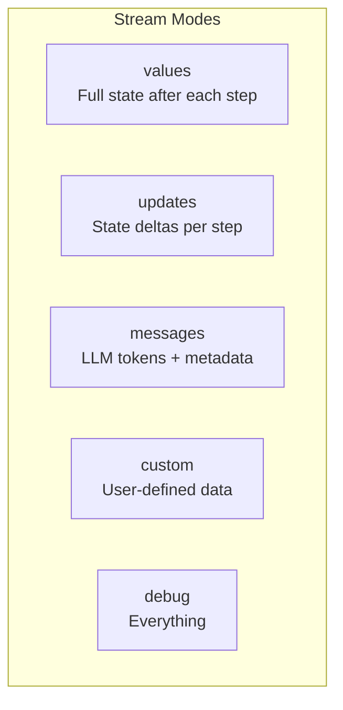

# Advanced Streaming

## Introduction

Real-time feedback transforms user experience. When users see tokens appearing as the AI generates them, the application feels responsive and alive—even when the LLM takes several seconds to complete.

LangGraph provides a powerful streaming system that goes beyond simple token streaming. We'll explore all stream modes, custom data streaming, and patterns for building real-time interfaces.

### What We'll Cover

- Stream modes: values, updates, messages, custom, debug
- Token streaming from LLMs
- Custom data streaming from nodes
- Filtering by node and LLM tags
- Streaming from subgraphs
- Building real-time UI patterns

### Prerequisites

- StateGraph fundamentals
- LangChain chat model basics
- Understanding of async/await

---

## Stream Modes Overview



| Mode | What It Streams | When to Use |
|------|-----------------|-------------|
| `values` | Full state after each step | Simple apps, debugging |
| `updates` | Only changed state keys | Efficient state tracking |
| `messages` | LLM tokens with metadata | Real-time chat UI |
| `custom` | User-defined data | Progress bars, status updates |
| `debug` | Maximum information | Development, debugging |

---

## Basic Streaming

### Values Mode

Streams the **complete state** after each node:

```python
from langgraph.graph import StateGraph, START, END
from typing_extensions import TypedDict


class State(TypedDict):
    topic: str
    joke: str


def refine_topic(state: State) -> dict:
    return {"topic": state["topic"] + " and cats"}


def generate_joke(state: State) -> dict:
    return {"joke": f"This is a joke about {state['topic']}"}


graph = (
    StateGraph(State)
    .add_node(refine_topic)
    .add_node(generate_joke)
    .add_edge(START, "refine_topic")
    .add_edge("refine_topic", "generate_joke")
    .add_edge("generate_joke", END)
    .compile()
)

# Stream full state after each step
for chunk in graph.stream({"topic": "ice cream"}, stream_mode="values"):
    print(chunk)
```

**Output:**
```python
{"topic": "ice cream", "joke": ""}
{"topic": "ice cream and cats", "joke": ""}
{"topic": "ice cream and cats", "joke": "This is a joke about ice cream and cats"}
```

### Updates Mode

Streams **only the changes** from each node:

```python
for chunk in graph.stream({"topic": "ice cream"}, stream_mode="updates"):
    print(chunk)
```

**Output:**
```python
{"refine_topic": {"topic": "ice cream and cats"}}
{"generate_joke": {"joke": "This is a joke about ice cream and cats"}}
```

> **Note:** `updates` mode includes the node name, making it easy to track which node produced each update.

---

## Streaming LLM Tokens

The `messages` mode streams tokens from any LLM call in your graph:

```python
from dataclasses import dataclass
from langchain.chat_models import init_chat_model
from langgraph.graph import StateGraph, START, END


@dataclass
class MyState:
    topic: str
    joke: str = ""


model = init_chat_model(model="gpt-4o-mini")


def call_model(state: MyState) -> dict:
    """Generate a joke using LLM."""
    response = model.invoke([
        {"role": "user", "content": f"Generate a short joke about {state.topic}"}
    ])
    return {"joke": response.content}


graph = (
    StateGraph(MyState)
    .add_node(call_model)
    .add_edge(START, "call_model")
    .compile()
)

# Stream tokens as they arrive
for message_chunk, metadata in graph.stream(
    {"topic": "ice cream"},
    stream_mode="messages"
):
    if message_chunk.content:
        print(message_chunk.content, end="|", flush=True)
```

**Output:**
```
Why|did|the|ice|cream|truck|break|down|?|Because|of|the|rocky|road|!|
```

### Metadata Contents

The `metadata` dictionary includes:

| Key | Description |
|-----|-------------|
| `langgraph_node` | Name of the node where LLM was called |
| `tags` | Tags associated with the LLM |
| `run_id` | Unique identifier for this invocation |

---

## Filtering Token Streams

### Filter by Node

Only stream tokens from specific nodes:

```python
for msg, metadata in graph.stream(inputs, stream_mode="messages"):
    # Only show tokens from the "writer" node
    if msg.content and metadata["langgraph_node"] == "writer":
        print(msg.content, end="", flush=True)
```

### Filter by LLM Tags

Tag your LLMs to filter by purpose:

```python
from langchain.chat_models import init_chat_model

# Tag models for filtering
joke_model = init_chat_model(model="gpt-4o-mini", tags=["joke"])
poem_model = init_chat_model(model="gpt-4o-mini", tags=["poem"])


def generate_joke(state: State) -> dict:
    response = joke_model.invoke(...)
    return {"joke": response.content}


def generate_poem(state: State) -> dict:
    response = poem_model.invoke(...)
    return {"poem": response.content}


# Stream only joke tokens
for msg, metadata in graph.stream(inputs, stream_mode="messages"):
    if msg.content and "joke" in metadata.get("tags", []):
        print(msg.content, end="", flush=True)
```

---

## Custom Data Streaming

Send arbitrary data from inside nodes using `get_stream_writer`:

```python
from typing_extensions import TypedDict
from langgraph.config import get_stream_writer
from langgraph.graph import StateGraph, START, END


class State(TypedDict):
    query: str
    result: str


def process_data(state: State) -> dict:
    writer = get_stream_writer()
    
    # Stream progress updates
    writer({"progress": "Starting processing..."})
    
    # Simulate work
    for i in range(5):
        writer({"progress": f"Step {i + 1}/5 complete"})
    
    writer({"progress": "Done!"})
    
    return {"result": "Processing complete"}


graph = (
    StateGraph(State)
    .add_node(process_data)
    .add_edge(START, "process_data")
    .compile()
)

# Receive custom data
for chunk in graph.stream({"query": "test"}, stream_mode="custom"):
    print(chunk)
```

**Output:**
```python
{"progress": "Starting processing..."}
{"progress": "Step 1/5 complete"}
{"progress": "Step 2/5 complete"}
{"progress": "Step 3/5 complete"}
{"progress": "Step 4/5 complete"}
{"progress": "Step 5/5 complete"}
{"progress": "Done!"}
```

### Custom Streaming from Tools

```python
from langchain_core.tools import tool
from langgraph.config import get_stream_writer


@tool
def search_documents(query: str) -> str:
    """Search documents for relevant information."""
    writer = get_stream_writer()
    
    # Stream search progress
    writer({"status": "Searching...", "query": query})
    
    # Simulate searching
    results = [f"Result 1 for {query}", f"Result 2 for {query}"]
    
    for i, result in enumerate(results):
        writer({"status": f"Found result {i + 1}", "preview": result[:50]})
    
    writer({"status": "Search complete", "total": len(results)})
    
    return "\n".join(results)
```

---

## Multiple Stream Modes

Combine modes to get different types of data:

```python
for mode, chunk in graph.stream(
    inputs,
    stream_mode=["updates", "custom", "messages"]
):
    if mode == "updates":
        print(f"State update: {chunk}")
    elif mode == "custom":
        print(f"Custom data: {chunk}")
    elif mode == "messages":
        msg, metadata = chunk
        if msg.content:
            print(f"Token: {msg.content}")
```

---

## Streaming from Subgraphs

Include nested graph outputs with `subgraphs=True`:

```python
for chunk in graph.stream(
    {"query": "Hello"},
    stream_mode="updates",
    subgraphs=True  # Include subgraph events
):
    print(chunk)
```

### Output Structure

Without `subgraphs=True`:
```python
{"prepare": {"query": "HELLO"}}
{"subgraph": {"result": "Processed: HELLO"}}
```

With `subgraphs=True` (includes path):
```python
((), {"prepare": {"query": "HELLO"}})
(("subgraph:abc123",), {"inner_node": {"result": "Processed: HELLO"}})
```

The tuple prefix shows the path to nested subgraphs.

---

## Using Any LLM (Non-LangChain)

Stream from any LLM API using custom streaming:

```python
from langgraph.config import get_stream_writer


def call_custom_llm(state: State) -> dict:
    """Call any LLM with custom streaming."""
    writer = get_stream_writer()
    
    # Your custom LLM client
    import openai
    client = openai.OpenAI()
    
    full_response = ""
    stream = client.chat.completions.create(
        model="gpt-4o-mini",
        messages=[{"role": "user", "content": state["query"]}],
        stream=True
    )
    
    for chunk in stream:
        if chunk.choices[0].delta.content:
            token = chunk.choices[0].delta.content
            # Stream token via custom mode
            writer({"token": token})
            full_response += token
    
    return {"response": full_response}


# Receive tokens
for chunk in graph.stream(inputs, stream_mode="custom"):
    if "token" in chunk:
        print(chunk["token"], end="", flush=True)
```

---

## Async Streaming

For async applications, use `astream`:

```python
async def stream_response():
    async for chunk in graph.astream(
        {"topic": "AI agents"},
        stream_mode="messages"
    ):
        msg, metadata = chunk
        if msg.content:
            yield msg.content


# Example: FastAPI streaming endpoint
from fastapi import FastAPI
from fastapi.responses import StreamingResponse

app = FastAPI()

@app.get("/stream")
async def stream_endpoint():
    async def generate():
        async for chunk in graph.astream(
            {"topic": "AI agents"},
            stream_mode="messages"
        ):
            msg, metadata = chunk
            if msg.content:
                yield f"data: {msg.content}\n\n"
    
    return StreamingResponse(
        generate(),
        media_type="text/event-stream"
    )
```

> **Warning:** For Python < 3.11 with async, you must explicitly pass `RunnableConfig` to LLM calls.

---

## Debug Mode

Maximum information for development:

```python
for chunk in graph.stream(
    {"topic": "ice cream"},
    stream_mode="debug"
):
    print(f"Type: {chunk.get('type')}")
    print(f"Node: {chunk.get('payload', {}).get('node_name', 'N/A')}")
    print(f"Data: {chunk}")
    print("---")
```

Debug mode includes:
- Node entry/exit events
- State before/after each node
- Timing information
- Error details

---

## Complete Example: Real-Time Chat

```python
from dataclasses import dataclass, field
from langchain.chat_models import init_chat_model
from langchain_core.messages import HumanMessage, AIMessage
from langgraph.graph import StateGraph, START, END
from langgraph.config import get_stream_writer


@dataclass
class ChatState:
    messages: list = field(default_factory=list)
    status: str = ""


model = init_chat_model(model="gpt-4o-mini", tags=["assistant"])


def process_message(state: ChatState) -> dict:
    """Process user message with streaming status."""
    writer = get_stream_writer()
    
    # Status update
    writer({"status": "thinking"})
    
    # Get response (tokens stream via messages mode)
    response = model.invoke(state.messages)
    
    # Status update
    writer({"status": "complete"})
    
    return {"messages": [response]}


graph = (
    StateGraph(ChatState)
    .add_node(process_message)
    .add_edge(START, "process_message")
    .compile()
)


def chat(user_input: str, history: list):
    """Stream chat response with status and tokens."""
    messages = history + [HumanMessage(content=user_input)]
    
    full_response = ""
    status = "idle"
    
    # Stream both custom (status) and messages (tokens)
    for mode, chunk in graph.stream(
        {"messages": messages, "status": ""},
        stream_mode=["custom", "messages"]
    ):
        if mode == "custom":
            status = chunk.get("status", status)
            print(f"\n[Status: {status}]")
        
        elif mode == "messages":
            msg, metadata = chunk
            if msg.content and "assistant" in metadata.get("tags", []):
                print(msg.content, end="", flush=True)
                full_response += msg.content
    
    return full_response


# Usage
history = []
while True:
    user_input = input("\n\nYou: ")
    if user_input.lower() == "quit":
        break
    
    response = chat(user_input, history)
    history.extend([
        HumanMessage(content=user_input),
        AIMessage(content=response)
    ])
```

---

## Best Practices

| Practice | Description |
|----------|-------------|
| Use `updates` for efficiency | Less data than `values` mode |
| Filter tokens by node/tag | Avoid streaming internal LLM calls |
| Combine modes strategically | `["messages", "custom"]` for chat + status |
| Stream custom progress | Keep users informed during long operations |
| Handle empty content | Check `if msg.content` before processing |

---

## Common Pitfalls

| ❌ Mistake | ✅ Solution |
|-----------|-------------|
| Not flushing output | Use `flush=True` in print statements |
| Missing async config in Python < 3.11 | Pass `RunnableConfig` explicitly |
| Streaming from wrong nodes | Filter by `langgraph_node` in metadata |
| Blocking UI with sync calls | Use `astream` for async applications |
| Not handling stream errors | Wrap in try/except for resilience |

---

## Hands-on Exercise

### Your Task

Build a streaming research assistant that:
1. Shows status updates (searching, analyzing, writing)
2. Streams the final response tokens
3. Displays progress percentage

### Requirements

1. Use `custom` mode for status/progress
2. Use `messages` mode for LLM tokens
3. Combine both modes in the stream
4. Update progress in increments

### Expected Output

```
[Status: searching] 33%
[Status: analyzing] 66%
[Status: writing] 100%
AI response tokens streaming here...
```

<details>
<summary>💡 Hints (click to expand)</summary>

1. Use `get_stream_writer()` for custom data
2. Include progress percentage in custom data
3. Use `stream_mode=["custom", "messages"]`
4. Filter messages by tags or node name

</details>

<details>
<summary>✅ Solution (click to expand)</summary>

```python
from dataclasses import dataclass
from langchain.chat_models import init_chat_model
from langgraph.graph import StateGraph, START, END
from langgraph.config import get_stream_writer


@dataclass
class ResearchState:
    query: str
    research: str = ""
    response: str = ""


model = init_chat_model(model="gpt-4o-mini", tags=["writer"])


def search_phase(state: ResearchState) -> dict:
    """Simulate searching."""
    writer = get_stream_writer()
    writer({"status": "searching", "progress": 33})
    
    # Simulate search
    import time
    time.sleep(0.5)
    
    return {"research": f"Research findings for: {state.query}"}


def analyze_phase(state: ResearchState) -> dict:
    """Simulate analysis."""
    writer = get_stream_writer()
    writer({"status": "analyzing", "progress": 66})
    
    import time
    time.sleep(0.5)
    
    return {}


def write_phase(state: ResearchState) -> dict:
    """Generate response with LLM."""
    writer = get_stream_writer()
    writer({"status": "writing", "progress": 100})
    
    response = model.invoke([
        {"role": "system", "content": "You are a research assistant."},
        {"role": "user", "content": f"Based on this research: {state.research}\n\nWrite a brief summary."}
    ])
    
    return {"response": response.content}


graph = (
    StateGraph(ResearchState)
    .add_node(search_phase)
    .add_node(analyze_phase)
    .add_node(write_phase)
    .add_edge(START, "search_phase")
    .add_edge("search_phase", "analyze_phase")
    .add_edge("analyze_phase", "write_phase")
    .add_edge("write_phase", END)
    .compile()
)


def run_research(query: str):
    """Run research with streaming output."""
    print(f"\nResearching: {query}\n")
    
    for mode, chunk in graph.stream(
        {"query": query},
        stream_mode=["custom", "messages"]
    ):
        if mode == "custom":
            status = chunk.get("status", "")
            progress = chunk.get("progress", 0)
            print(f"[Status: {status}] {progress}%")
        
        elif mode == "messages":
            msg, metadata = chunk
            if msg.content and "writer" in metadata.get("tags", []):
                print(msg.content, end="", flush=True)
    
    print("\n\nDone!")


# Test
run_research("AI agents in 2025")
```

</details>

---

## Summary

✅ Five stream modes: values, updates, messages, custom, debug

✅ Token streaming with `messages` mode and metadata filtering

✅ Custom data streaming with `get_stream_writer()`

✅ Combine multiple modes for rich real-time feedback

✅ Use `subgraphs=True` to stream from nested graphs

✅ Async streaming with `astream` for web applications

**Next:** [Parallel Execution →](./05-parallel-execution.md)

---

## Further Reading

- [LangGraph Streaming](https://docs.langchain.com/oss/python/langgraph/streaming)
- [FastAPI Streaming](https://fastapi.tiangolo.com/advanced/streaming/)
- [Server-Sent Events](https://developer.mozilla.org/en-US/docs/Web/API/Server-sent_events)

---

<!-- 
Sources Consulted:
- LangGraph Streaming: https://docs.langchain.com/oss/python/langgraph/streaming
- LangGraph Custom Streaming: https://docs.langchain.com/oss/python/langgraph/streaming#stream-custom-data
-->
