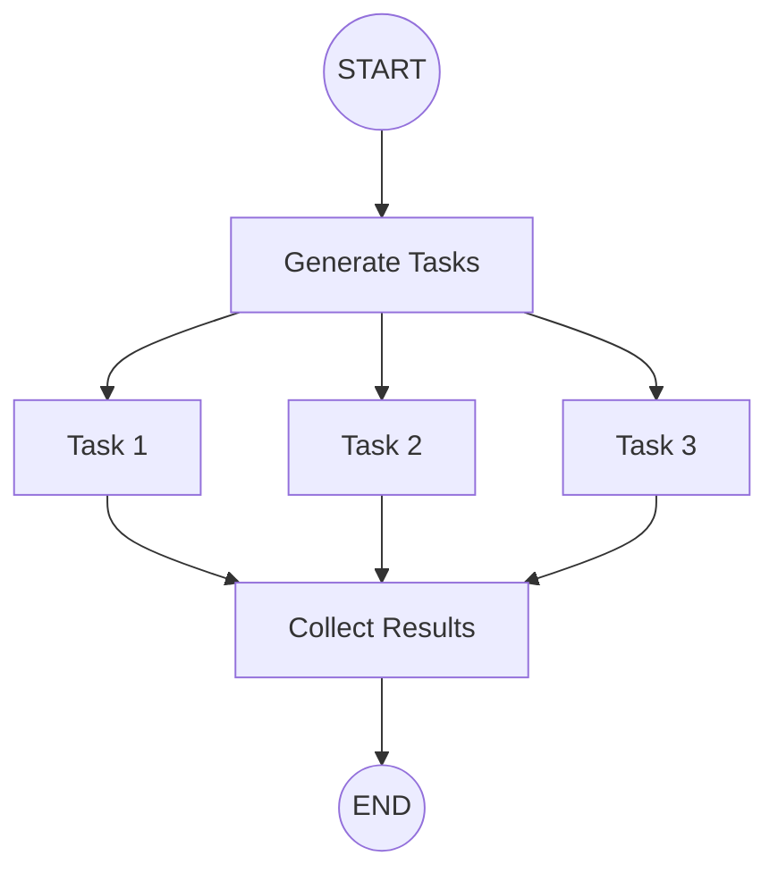
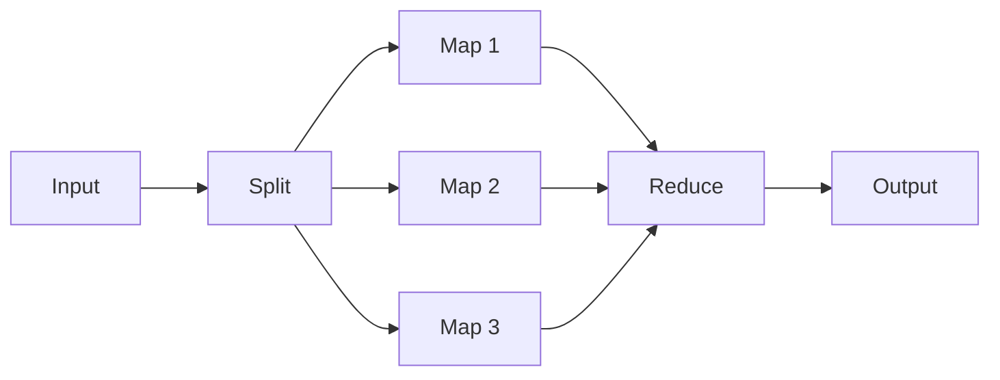
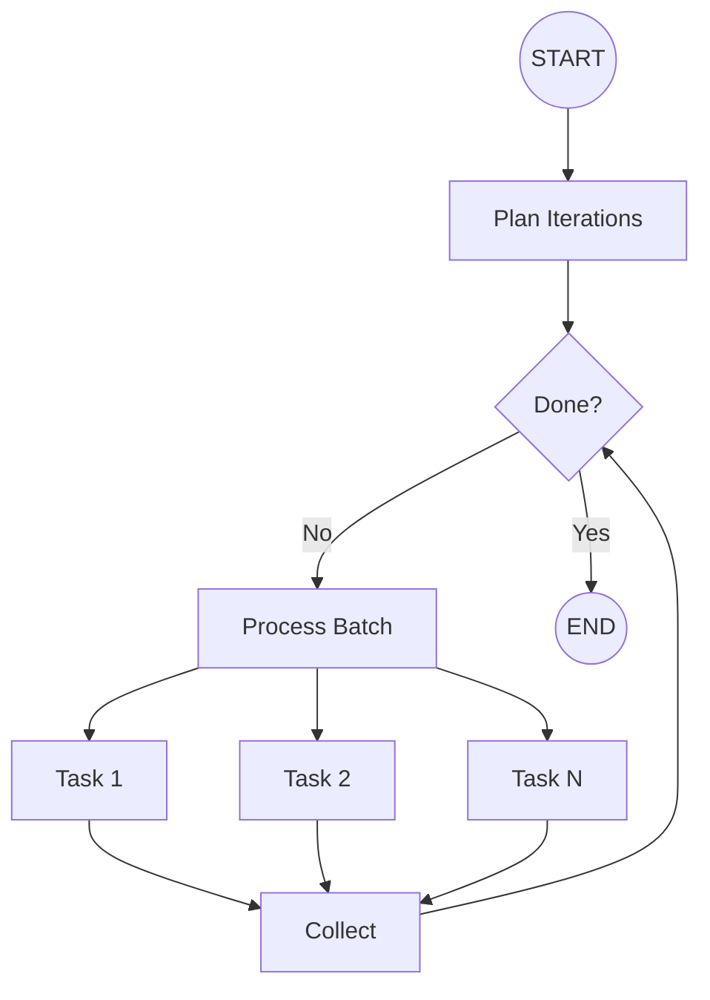

# Parallel Execution & Fan-Out Patterns

## Introduction

Many AI workflows benefit from parallel processing—researching multiple topics simultaneously, evaluating documents in parallel, or calling multiple LLMs for consensus. LangGraph provides powerful primitives for parallel execution through the `Send` API.

In this lesson, we'll explore how to implement map-reduce patterns, parallel processing, and dynamic fan-out workflows.

### What We'll Cover

- How super-steps enable parallelism
- The `Send` API for dynamic fan-out
- Map-reduce patterns
- Parallel tool execution
- Loops with exit conditions
- Collecting parallel results

### Prerequisites

- StateGraph fundamentals
- Conditional edges
- Reducer functions

---

## Understanding Parallelism in LangGraph



### Super-Steps

LangGraph executes in **super-steps**:

1. All nodes scheduled for the current step run in **parallel**
2. Their outputs are collected
3. Next step begins with nodes scheduled from previous step

> **Note:** Nodes with multiple outgoing edges naturally run their targets in parallel.

---

## Parallel Execution with Edges

The simplest way to run nodes in parallel—multiple edges from one node:

```python
from langgraph.graph import StateGraph, START, END
from typing import Annotated
from typing_extensions import TypedDict
from operator import add


class State(TypedDict):
    input: str
    results: Annotated[list[str], add]  # Reducer to combine results


def generate(state: State) -> dict:
    return {}


def task_a(state: State) -> dict:
    return {"results": [f"Result A for: {state['input']}"]}


def task_b(state: State) -> dict:
    return {"results": [f"Result B for: {state['input']}"]}


def task_c(state: State) -> dict:
    return {"results": [f"Result C for: {state['input']}"]}


def collect(state: State) -> dict:
    return {"results": [f"Collected {len(state['results'])} results"]}


builder = StateGraph(State)

builder.add_node("generate", generate)
builder.add_node("task_a", task_a)
builder.add_node("task_b", task_b)
builder.add_node("task_c", task_c)
builder.add_node("collect", collect)

# Single source, multiple targets = parallel execution!
builder.add_edge(START, "generate")
builder.add_edge("generate", "task_a")
builder.add_edge("generate", "task_b")
builder.add_edge("generate", "task_c")

# All parallel tasks must finish before collect
builder.add_edge("task_a", "collect")
builder.add_edge("task_b", "collect")
builder.add_edge("task_c", "collect")
builder.add_edge("collect", END)

graph = builder.compile()

result = graph.invoke({"input": "LangGraph", "results": []})
print(result["results"])
# ["Result A for: LangGraph", "Result B for: LangGraph", "Result C for: LangGraph", "Collected 3 results"]
```

### Key Points

- Use `Annotated[list, add]` to combine results from parallel nodes
- All edges from a node to multiple targets execute in parallel
- LangGraph waits for all parallel nodes to complete before next step

---

## The Send API

When the number of parallel tasks is **dynamic** (unknown at graph definition time), use `Send`:

```python
from langgraph.graph import StateGraph, START, END
from langgraph.types import Send
from typing import Annotated
from typing_extensions import TypedDict
from operator import add


class OverallState(TypedDict):
    topics: list[str]
    research: Annotated[list[str], add]


class ResearchState(TypedDict):
    topic: str


def identify_topics(state: OverallState) -> dict:
    """Generate a list of topics to research."""
    # In real app, LLM would generate this
    return {"topics": ["AI agents", "RAG", "Fine-tuning"]}


def continue_to_research(state: OverallState) -> list[Send]:
    """Dynamically create research tasks for each topic."""
    return [
        Send("research_topic", {"topic": topic})
        for topic in state["topics"]
    ]


def research_topic(state: ResearchState) -> dict:
    """Research a single topic."""
    return {"research": [f"Findings for {state['topic']}: [research results]"]}


def synthesize(state: OverallState) -> dict:
    """Combine all research."""
    return {"research": [f"Synthesized {len(state['research'])} topics"]}


builder = StateGraph(OverallState)

builder.add_node("identify", identify_topics)
builder.add_node("research_topic", research_topic)
builder.add_node("synthesize", synthesize)

builder.add_edge(START, "identify")
# Conditional edge that returns Send objects
builder.add_conditional_edges("identify", continue_to_research, ["research_topic"])
builder.add_edge("research_topic", "synthesize")
builder.add_edge("synthesize", END)

graph = builder.compile()

result = graph.invoke({"topics": [], "research": []})
print(result["research"])
```

**Output:**
```python
[
    "Findings for AI agents: [research results]",
    "Findings for RAG: [research results]",
    "Findings for Fine-tuning: [research results]",
    "Synthesized 3 topics"
]
```

### Send Explained

```python
Send(node_name, state)
```

| Parameter | Description |
|-----------|-------------|
| `node_name` | Target node to execute |
| `state` | State to pass to that node (can differ from main state!) |

> **Note:** Send allows different state schemas for parallel tasks!

---

## Map-Reduce Pattern

Classic map-reduce: split work, process in parallel, combine results.



### Complete Map-Reduce Example

```python
from langgraph.graph import StateGraph, START, END
from langgraph.types import Send
from typing import Annotated
from typing_extensions import TypedDict
from operator import add


# Overall state
class MapReduceState(TypedDict):
    documents: list[str]
    summaries: Annotated[list[str], add]
    final_summary: str


# Individual task state
class DocumentState(TypedDict):
    document: str


def split_documents(state: MapReduceState) -> dict:
    """Split work - this node just passes through."""
    return {}


def route_documents(state: MapReduceState) -> list[Send]:
    """Create parallel summarization tasks."""
    return [
        Send("summarize_doc", {"document": doc})
        for doc in state["documents"]
    ]


def summarize_doc(state: DocumentState) -> dict:
    """Map: Summarize single document."""
    doc = state["document"]
    summary = f"Summary of '{doc[:30]}...'" if len(doc) > 30 else f"Summary of '{doc}'"
    return {"summaries": [summary]}


def combine_summaries(state: MapReduceState) -> dict:
    """Reduce: Combine all summaries."""
    all_summaries = "\n".join(state["summaries"])
    final = f"Combined {len(state['summaries'])} summaries:\n{all_summaries}"
    return {"final_summary": final}


builder = StateGraph(MapReduceState)

builder.add_node("split", split_documents)
builder.add_node("summarize_doc", summarize_doc)
builder.add_node("combine", combine_summaries)

builder.add_edge(START, "split")
builder.add_conditional_edges("split", route_documents, ["summarize_doc"])
builder.add_edge("summarize_doc", "combine")
builder.add_edge("combine", END)

graph = builder.compile()

# Test with documents
result = graph.invoke({
    "documents": [
        "Document 1: AI agents are autonomous systems...",
        "Document 2: RAG combines retrieval with generation...",
        "Document 3: Fine-tuning adapts pre-trained models..."
    ],
    "summaries": [],
    "final_summary": ""
})

print(result["final_summary"])
```

---

## Parallel LLM Calls

Run multiple LLM calls in parallel for faster execution:

```python
from langgraph.graph import StateGraph, START, END
from langgraph.types import Send
from langchain_openai import ChatOpenAI
from typing import Annotated
from typing_extensions import TypedDict
from operator import add


class EvalState(TypedDict):
    question: str
    perspectives: list[str]
    answers: Annotated[list[str], add]
    consensus: str


class PerspectiveState(TypedDict):
    question: str
    perspective: str


llm = ChatOpenAI(model="gpt-4o-mini")


def setup_perspectives(state: EvalState) -> dict:
    return {
        "perspectives": ["technical", "business", "user experience"]
    }


def fan_out_perspectives(state: EvalState) -> list[Send]:
    """Create parallel evaluation tasks."""
    return [
        Send("evaluate", {
            "question": state["question"],
            "perspective": perspective
        })
        for perspective in state["perspectives"]
    ]


def evaluate(state: PerspectiveState) -> dict:
    """Evaluate from one perspective."""
    response = llm.invoke([
        {"role": "system", "content": f"You are an expert providing the {state['perspective']} perspective."},
        {"role": "user", "content": state["question"]}
    ])
    return {"answers": [f"[{state['perspective']}]: {response.content}"]}


def build_consensus(state: EvalState) -> dict:
    """Combine perspectives into consensus."""
    all_perspectives = "\n\n".join(state["answers"])
    response = llm.invoke([
        {"role": "system", "content": "Synthesize the following perspectives into a balanced consensus."},
        {"role": "user", "content": all_perspectives}
    ])
    return {"consensus": response.content}


builder = StateGraph(EvalState)

builder.add_node("setup", setup_perspectives)
builder.add_node("evaluate", evaluate)
builder.add_node("consensus", build_consensus)

builder.add_edge(START, "setup")
builder.add_conditional_edges("setup", fan_out_perspectives, ["evaluate"])
builder.add_edge("evaluate", "consensus")
builder.add_edge("consensus", END)

graph = builder.compile()
```

---

## Conditional Parallel Execution

Only spawn parallel tasks conditionally:

```python
def route_based_on_complexity(state: State) -> list[Send] | str:
    """Decide whether to fan out or go direct."""
    if len(state["items"]) > 5:
        # Complex: fan out to parallel processing
        return [Send("process_item", {"item": item}) for item in state["items"]]
    else:
        # Simple: process all in one node
        return "process_all"


builder.add_conditional_edges(
    "analyze",
    route_based_on_complexity,
    ["process_item", "process_all"]  # Declare all possible destinations
)
```

---

## Loops with Parallel Tasks

Combine iteration with parallel execution:



```python
from langgraph.graph import StateGraph, START, END
from langgraph.types import Send
from typing import Annotated
from typing_extensions import TypedDict
from operator import add


class IterativeState(TypedDict):
    remaining_items: list[str]
    processed: Annotated[list[str], add]
    batch_size: int
    iteration: int


class ItemState(TypedDict):
    item: str


def check_completion(state: IterativeState) -> str:
    """Check if we're done."""
    if not state["remaining_items"]:
        return "done"
    return "continue"


def prepare_batch(state: IterativeState) -> dict:
    """Prepare next batch."""
    return {"iteration": state.get("iteration", 0) + 1}


def fan_out_batch(state: IterativeState) -> list[Send]:
    """Fan out current batch."""
    batch = state["remaining_items"][:state["batch_size"]]
    return [Send("process_item", {"item": item}) for item in batch]


def process_item(state: ItemState) -> dict:
    """Process single item."""
    return {"processed": [f"Processed: {state['item']}"]}


def update_remaining(state: IterativeState) -> dict:
    """Remove processed items from remaining."""
    batch_size = state["batch_size"]
    return {"remaining_items": state["remaining_items"][batch_size:]}


builder = StateGraph(IterativeState)

builder.add_node("check", lambda s: {})  # Just for routing
builder.add_node("prepare", prepare_batch)
builder.add_node("process_item", process_item)
builder.add_node("update", update_remaining)

builder.add_edge(START, "check")
builder.add_conditional_edges(
    "check",
    check_completion,
    {"continue": "prepare", "done": END}
)
builder.add_conditional_edges("prepare", fan_out_batch, ["process_item"])
builder.add_edge("process_item", "update")
builder.add_edge("update", "check")

graph = builder.compile()

result = graph.invoke({
    "remaining_items": ["A", "B", "C", "D", "E"],
    "processed": [],
    "batch_size": 2,
    "iteration": 0
})

print(f"Processed {len(result['processed'])} items in {result['iteration']} iterations")
```

---

## Collecting Results

Use reducer functions to aggregate parallel outputs:

```python
from operator import add
from typing import Annotated


# Simple list append
class State(TypedDict):
    results: Annotated[list[str], add]


# Custom reducer for dict merging
def merge_dicts(a: dict, b: dict) -> dict:
    return {**a, **b}


class DictState(TypedDict):
    findings: Annotated[dict, merge_dicts]


# Counter reducer
def sum_values(a: int, b: int) -> int:
    return a + b


class CounterState(TypedDict):
    total: Annotated[int, sum_values]
```

---

## Error Handling in Parallel Execution

Handle failures gracefully:

```python
def safe_process(state: ItemState) -> dict:
    """Process with error handling."""
    try:
        result = risky_operation(state["item"])
        return {"results": [{"status": "success", "data": result}]}
    except Exception as e:
        return {"results": [{"status": "error", "item": state["item"], "error": str(e)}]}


def filter_results(state: State) -> dict:
    """Separate successes from failures."""
    successes = [r for r in state["results"] if r["status"] == "success"]
    failures = [r for r in state["results"] if r["status"] == "error"]
    
    return {
        "successful": [r["data"] for r in successes],
        "failed": [r["item"] for r in failures]
    }
```

---

## Complete Example: Parallel Research Agent

```python
from langgraph.graph import StateGraph, START, END
from langgraph.types import Send
from langchain_openai import ChatOpenAI
from typing import Annotated
from typing_extensions import TypedDict
from operator import add


class ResearchState(TypedDict):
    query: str
    sources: list[str]
    findings: Annotated[list[dict], add]
    synthesis: str


class SourceState(TypedDict):
    query: str
    source: str


llm = ChatOpenAI(model="gpt-4o-mini")


def identify_sources(state: ResearchState) -> dict:
    """Identify sources to research."""
    response = llm.invoke([
        {"role": "system", "content": "List 3 types of sources to research this topic. Return just the source types, one per line."},
        {"role": "user", "content": state["query"]}
    ])
    sources = [s.strip() for s in response.content.strip().split("\n") if s.strip()]
    return {"sources": sources[:3]}


def fan_out_research(state: ResearchState) -> list[Send]:
    """Create parallel research tasks."""
    return [
        Send("research_source", {"query": state["query"], "source": source})
        for source in state["sources"]
    ]


def research_source(state: SourceState) -> dict:
    """Research from one source type."""
    response = llm.invoke([
        {"role": "system", "content": f"You are researching from {state['source']}. Provide key findings."},
        {"role": "user", "content": state["query"]}
    ])
    return {
        "findings": [{
            "source": state["source"],
            "content": response.content
        }]
    }


def synthesize(state: ResearchState) -> dict:
    """Combine all findings."""
    findings_text = "\n\n".join([
        f"### {f['source']}\n{f['content']}"
        for f in state["findings"]
    ])
    
    response = llm.invoke([
        {"role": "system", "content": "Synthesize the following research findings into a coherent summary."},
        {"role": "user", "content": findings_text}
    ])
    
    return {"synthesis": response.content}


builder = StateGraph(ResearchState)

builder.add_node("identify", identify_sources)
builder.add_node("research_source", research_source)
builder.add_node("synthesize", synthesize)

builder.add_edge(START, "identify")
builder.add_conditional_edges("identify", fan_out_research, ["research_source"])
builder.add_edge("research_source", "synthesize")
builder.add_edge("synthesize", END)

graph = builder.compile()


# Usage
result = graph.invoke({
    "query": "What are the latest trends in AI agents?",
    "sources": [],
    "findings": [],
    "synthesis": ""
})

print(f"Researched {len(result['findings'])} sources")
print(f"\nSynthesis:\n{result['synthesis']}")
```

---

## Best Practices

| Practice | Description |
|----------|-------------|
| Use reducers | Always define reducers for parallel output keys |
| Limit parallelism | Don't spawn thousands of parallel tasks |
| Handle errors | Wrap parallel tasks in try/except |
| Type your states | Use TypedDict for both overall and task states |
| Batch large lists | Process in chunks rather than all at once |

---

## Common Pitfalls

| ❌ Mistake | ✅ Solution |
|-----------|-------------|
| Missing reducer for parallel outputs | Use `Annotated[list, add]` or custom reducer |
| Not declaring Send destinations | Include all possible nodes in edge declaration |
| Infinite parallel loops | Always have exit condition checked |
| Same state for different tasks | Use separate state schema for parallel tasks |
| Not awaiting parallel completion | LangGraph handles this automatically |

---

## Hands-on Exercise

### Your Task

Build a parallel document analyzer that:
1. Takes a list of documents
2. Analyzes each in parallel for sentiment, keywords, and summary
3. Combines results into a final report

### Requirements

1. Use `Send` for dynamic parallel tasks
2. Each document gets analyzed separately
3. Use reducer to combine results
4. Generate final report from all analyses

### Expected Flow

```python
result = graph.invoke({
    "documents": ["Doc 1 content...", "Doc 2 content...", "Doc 3 content..."],
    "analyses": [],
    "report": ""
})
print(result["report"])
# "Analyzed 3 documents. Overall sentiment: positive..."
```

<details>
<summary>💡 Hints (click to expand)</summary>

1. Create separate state for document analysis
2. Use `Annotated[list[dict], add]` for analyses
3. Fan out with `Send("analyze_doc", {"content": doc})`
4. Combine in final node

</details>

<details>
<summary>✅ Solution (click to expand)</summary>

```python
from langgraph.graph import StateGraph, START, END
from langgraph.types import Send
from typing import Annotated
from typing_extensions import TypedDict
from operator import add


class AnalyzerState(TypedDict):
    documents: list[str]
    analyses: Annotated[list[dict], add]
    report: str


class DocumentInput(TypedDict):
    content: str
    index: int


def setup(state: AnalyzerState) -> dict:
    return {}


def fan_out_analysis(state: AnalyzerState) -> list[Send]:
    """Create parallel analysis tasks."""
    return [
        Send("analyze_doc", {"content": doc, "index": i})
        for i, doc in enumerate(state["documents"])
    ]


def analyze_doc(state: DocumentInput) -> dict:
    """Analyze a single document."""
    content = state["content"]
    
    # Simple analysis (in real app, use LLM)
    word_count = len(content.split())
    sentiment = "positive" if "good" in content.lower() else "neutral"
    keywords = content.split()[:3]
    
    return {
        "analyses": [{
            "index": state["index"],
            "word_count": word_count,
            "sentiment": sentiment,
            "keywords": keywords,
            "summary": content[:50] + "..."
        }]
    }


def generate_report(state: AnalyzerState) -> dict:
    """Generate final report."""
    analyses = sorted(state["analyses"], key=lambda x: x["index"])
    
    total_words = sum(a["word_count"] for a in analyses)
    sentiments = [a["sentiment"] for a in analyses]
    overall_sentiment = max(set(sentiments), key=sentiments.count)
    
    report = f"""# Document Analysis Report

## Overview
- Documents analyzed: {len(analyses)}
- Total words: {total_words}
- Overall sentiment: {overall_sentiment}

## Document Summaries
"""
    
    for a in analyses:
        report += f"\n### Document {a['index'] + 1}\n"
        report += f"- Words: {a['word_count']}\n"
        report += f"- Sentiment: {a['sentiment']}\n"
        report += f"- Keywords: {', '.join(a['keywords'])}\n"
        report += f"- Summary: {a['summary']}\n"
    
    return {"report": report}


builder = StateGraph(AnalyzerState)

builder.add_node("setup", setup)
builder.add_node("analyze_doc", analyze_doc)
builder.add_node("report", generate_report)

builder.add_edge(START, "setup")
builder.add_conditional_edges("setup", fan_out_analysis, ["analyze_doc"])
builder.add_edge("analyze_doc", "report")
builder.add_edge("report", END)

graph = builder.compile()


# Test
result = graph.invoke({
    "documents": [
        "This is a good document about AI and machine learning.",
        "Another document discussing data science and analytics.",
        "A third document about web development and APIs."
    ],
    "analyses": [],
    "report": ""
})

print(result["report"])
```

</details>

---

## Summary

✅ LangGraph executes nodes in parallel within super-steps

✅ Multiple edges from one node create static parallel execution

✅ `Send` enables dynamic fan-out with unknown task counts

✅ Use different state schemas for parallel tasks

✅ Reducer functions combine parallel outputs

✅ Map-reduce patterns split work, process in parallel, combine results

**Previous:** [← Advanced Streaming](./04-advanced-streaming.md) | **Back to:** [Overview →](./00-langgraph-advanced-overview.md)

---

## Further Reading

- [LangGraph Send API](https://docs.langchain.com/oss/python/langgraph/graph-api#send)
- [Map-Reduce Patterns](https://docs.langchain.com/oss/python/langgraph/graph-api#map-reduce-and-the-send-api)
- [Reducer Functions](https://docs.langchain.com/oss/python/langgraph/graph-api#reducers)

---

<!-- 
Sources Consulted:
- LangGraph Graph API: https://docs.langchain.com/oss/python/langgraph/graph-api
- LangGraph Send: https://docs.langchain.com/oss/python/langgraph/graph-api#send
-->
