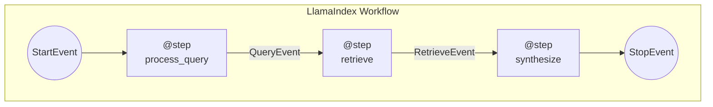
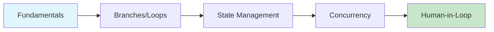

# LlamaIndex Workflows

## Module Overview

LlamaIndex Workflows represent a paradigm shift from DAG-based pipelines to **event-driven orchestration**. Released in 2024, Workflows provide a flexible, Python-native approach to building complex AI applications with support for branching, loops, parallel execution, and human-in-the-loop patterns.

This module covers everything you need to build production-ready workflow-based AI applications.



---

## Why Workflows?

| Feature | Query Pipelines (Old) | Workflows (New) |
|---------|----------------------|-----------------|
| Control Flow | DAG only | Arbitrary (loops, branches) |
| Execution Model | Synchronous | Async-first |
| Human-in-loop | Limited | Native support |
| State Management | Basic | Rich Context object |
| Debugging | Moderate | Excellent with visualization |
| Deployment | Manual | Built-in server support |

---

## Prerequisites

Before starting this module, ensure you have:

- ✅ Completed LlamaIndex fundamentals (Lessons 8-11)
- ✅ Understanding of Python async/await
- ✅ Familiarity with Pydantic models
- ✅ Basic understanding of event-driven patterns

---

## Module Structure

| Lesson | Topic | Description |
|--------|-------|-------------|
| 01 | [Workflow Fundamentals](./01-workflow-fundamentals.md) | Workflow class, @step decorator, Events |
| 02 | [Branches & Loops](./02-branches-and-loops.md) | Conditional routing, iterative refinement |
| 03 | [Managing State](./03-managing-state.md) | Context object, typed state, persistence |
| 04 | [Concurrent Execution](./04-concurrent-execution.md) | Parallel steps, send_event, collect_events |
| 05 | [Human-in-the-Loop](./05-human-in-the-loop.md) | Interactive workflows, InputRequiredEvent |

---

## Core Concepts at a Glance

### Key Components

| Component | Purpose |
|-----------|---------|
| `Workflow` | Base class for workflow definitions |
| `@step` | Decorator marking async processing functions |
| `Event` | Pydantic model carrying data between steps |
| `StartEvent` | Special event for workflow entry |
| `StopEvent` | Special event for workflow termination |
| `Context` | Shared state across steps |

### Basic Pattern

```python
from llama_index.core.workflow import Workflow, step, Event, StartEvent, StopEvent
from llama_index.llms.openai import OpenAI


class ProcessEvent(Event):
    """Custom event carrying data between steps."""
    data: str


class MyWorkflow(Workflow):
    llm = OpenAI(model="gpt-4o-mini")

    @step
    async def start(self, ev: StartEvent) -> ProcessEvent:
        """Entry point - receives StartEvent."""
        return ProcessEvent(data=ev.query)

    @step
    async def process(self, ev: ProcessEvent) -> StopEvent:
        """Process and return final result."""
        response = await self.llm.acomplete(ev.data)
        return StopEvent(result=str(response))


# Run the workflow
async def main():
    workflow = MyWorkflow(timeout=60, verbose=True)
    result = await workflow.run(query="Explain AI agents")
    print(result)
```

---

## Installation

```bash
# Workflows included in llama-index-core
pip install llama-index

# Or standalone
pip install llama-index-workflows

# For OpenAI LLM
pip install llama-index-llms-openai
```

---

## Quick Reference

### Event Types

| Event | Import | Purpose |
|-------|--------|---------|
| `Event` | `llama_index.core.workflow` | Base class for custom events |
| `StartEvent` | `llama_index.core.workflow` | Workflow entry point |
| `StopEvent` | `llama_index.core.workflow` | Workflow termination |
| `InputRequiredEvent` | `llama_index.core.workflow` | Request human input |
| `HumanResponseEvent` | `llama_index.core.workflow` | Human input response |

### Step Decorator Options

```python
@step  # Basic step
@step(num_workers=4)  # Concurrent workers
@step(retry_policy=...)  # Retry on failure
```

### Running Workflows

```python
# Simple run
result = await workflow.run(query="Hello")

# With streaming
handler = workflow.run()
async for event in handler.stream_events():
    print(event)
result = await handler

# With context persistence
ctx = Context(workflow)
result = await workflow.run(ctx=ctx)
```

---

## Learning Path



**Recommended Order:**
1. Start with **Workflow Fundamentals** to understand the core pattern
2. Learn **Branches & Loops** for complex control flow
3. Master **State Management** for data sharing
4. Explore **Concurrent Execution** for parallel processing
5. Implement **Human-in-the-Loop** for interactive applications

---

## What You'll Build

By the end of this module, you'll be able to create:

- 📄 RAG workflows with retrieval and synthesis
- 🔄 Self-refining answer generators with quality loops
- 🌐 Parallel search aggregators
- 👤 Interactive content approval systems
- 🚀 Production-ready deployed workflow servers

---

**Next:** [Workflow Fundamentals →](./01-workflow-fundamentals.md)

---

## Further Reading

- [LlamaIndex Workflows Documentation](https://developers.llamaindex.ai/python/llamaagents/workflows/)
- [Workflow Examples](https://developers.llamaindex.ai/python/examples/workflow/)
- [Workflows API Reference](https://developers.llamaindex.ai/python/workflows-api-reference/)

---

<!-- 
Sources Consulted:
- LlamaIndex Workflows: https://developers.llamaindex.ai/python/llamaagents/workflows/
- LlamaIndex Framework: https://developers.llamaindex.ai/python/framework/
-->
