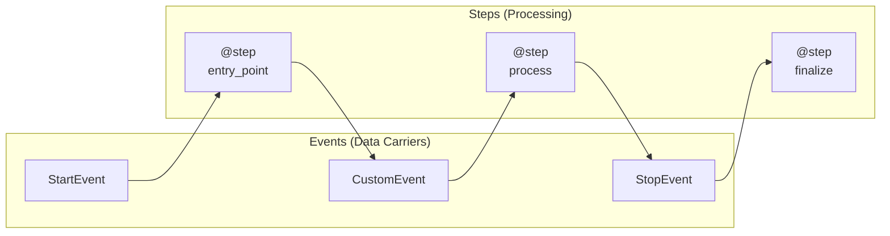

# Workflow Fundamentals

## Introduction

LlamaIndex Workflows provide an event-driven approach to orchestrating AI applications. Unlike DAG-based pipelines where you define edges between nodes, workflows use **Events** to trigger **Steps**—making complex control flow natural and Python-native.

In this lesson, we'll build our first workflows from scratch, understanding each component along the way.

### What We'll Cover

- The Workflow class and @step decorator
- Events as data carriers
- StartEvent and StopEvent
- Running async workflows
- Building a basic RAG workflow

### Prerequisites

- Python async/await understanding
- Basic Pydantic model knowledge
- LlamaIndex core concepts

---

## The Workflow Pattern



| Component | Role |
|-----------|------|
| **Workflow** | Container class for steps |
| **@step** | Decorator marking processing functions |
| **Event** | Pydantic model carrying data |
| **StartEvent** | Entry point, receives run() arguments |
| **StopEvent** | Exit point, returns final result |

---

## Your First Workflow

Let's build a simple joke generator workflow:

```python
from llama_index.core.workflow import Workflow, step, Event, StartEvent, StopEvent
from llama_index.llms.openai import OpenAI


class JokeEvent(Event):
    """Event carrying the generated joke."""
    joke: str


class JokeFlow(Workflow):
    """A workflow that generates and critiques jokes."""
    
    llm = OpenAI(model="gpt-4o-mini")

    @step
    async def generate_joke(self, ev: StartEvent) -> JokeEvent:
        """Generate a joke about the given topic."""
        topic = ev.topic
        prompt = f"Write your best joke about {topic}."
        response = await self.llm.acomplete(prompt)
        return JokeEvent(joke=str(response))

    @step
    async def critique_joke(self, ev: JokeEvent) -> StopEvent:
        """Analyze and critique the joke."""
        prompt = f"Give a brief analysis of this joke: {ev.joke}"
        response = await self.llm.acomplete(prompt)
        return StopEvent(result=str(response))


# Run the workflow
async def main():
    workflow = JokeFlow(timeout=60, verbose=False)
    result = await workflow.run(topic="pirates")
    print(result)


if __name__ == "__main__":
    import asyncio
    asyncio.run(main())
```

**Output:**
```
This joke uses the classic play on words technique...
```

---

## Understanding Events

Events are **Pydantic models** that carry data between steps:

```python
from llama_index.core.workflow import Event


class QueryEvent(Event):
    """Event carrying a user query."""
    query: str
    temperature: float = 0.7


class RetrievalEvent(Event):
    """Event carrying retrieved documents."""
    query: str
    documents: list[str]
    scores: list[float]


class SynthesisEvent(Event):
    """Event ready for answer synthesis."""
    query: str
    context: str
```

### Event Best Practices

| Practice | Description |
|----------|-------------|
| Clear names | Use descriptive names ending in `Event` |
| Type hints | Always type your fields |
| Defaults | Provide defaults for optional fields |
| Documentation | Add docstrings explaining purpose |

---

## StartEvent: Entry Point

`StartEvent` is special—it receives keyword arguments from `workflow.run()`:

```python
# When you call:
result = await workflow.run(query="What is AI?", max_tokens=100)

# StartEvent receives these as attributes:
@step
async def handle_start(self, ev: StartEvent) -> NextEvent:
    query = ev.query        # "What is AI?"
    max_tokens = ev.max_tokens  # 100
    
    # Safe access for optional args
    temperature = ev.get("temperature", default=0.7)
    
    return NextEvent(query=query)
```

### Typed StartEvent

For better type safety, subclass `StartEvent`:

```python
from llama_index.core.workflow import StartEvent


class MyStartEvent(StartEvent):
    """Typed entry event for my workflow."""
    query: str
    max_results: int = 10
    include_sources: bool = True


class TypedWorkflow(Workflow):
    @step
    async def start(self, ev: MyStartEvent) -> ProcessEvent:
        # Now you get IDE autocomplete!
        query = ev.query
        max_results = ev.max_results
        return ProcessEvent(query=query)
```

---

## StopEvent: Exit Point

`StopEvent` terminates the workflow and returns its `result`:

```python
from llama_index.core.workflow import StopEvent


@step
async def finalize(self, ev: SynthesisEvent) -> StopEvent:
    """Final step returning the result."""
    
    # Simple result
    return StopEvent(result="Answer text here")
    
    # Or complex result
    return StopEvent(result={
        "answer": ev.answer,
        "sources": ev.sources,
        "confidence": 0.95
    })
```

### Typed StopEvent

```python
from llama_index.core.workflow import StopEvent


class MyStopEvent(StopEvent):
    """Typed result event."""
    answer: str
    sources: list[str]
    confidence: float
```

---

## The @step Decorator

The `@step` decorator marks async methods as workflow steps:

```python
from llama_index.core.workflow import step


class MyWorkflow(Workflow):
    
    @step
    async def basic_step(self, ev: InputEvent) -> OutputEvent:
        """A basic step."""
        return OutputEvent(data=ev.data)
    
    @step(num_workers=4)
    async def concurrent_step(self, ev: TaskEvent) -> ResultEvent:
        """Step that can run 4 instances concurrently."""
        return ResultEvent(result=process(ev.task))
```

### How Steps Connect

LangGraph infers connections from **type hints**:

```python
@step
async def step_a(self, ev: StartEvent) -> MiddleEvent:
    # Input: StartEvent → Output: MiddleEvent
    return MiddleEvent(data="processed")

@step
async def step_b(self, ev: MiddleEvent) -> StopEvent:
    # Input: MiddleEvent → Output: StopEvent
    # Automatically connected because step_a outputs MiddleEvent!
    return StopEvent(result=ev.data)
```

> **Note:** No explicit edge definitions needed—the framework infers the flow from event types.

---

## Instance Attributes

Share resources across steps using instance attributes:

```python
from llama_index.core.workflow import Workflow, step, StartEvent, StopEvent
from llama_index.llms.openai import OpenAI
from llama_index.core import VectorStoreIndex


class RAGWorkflow(Workflow):
    """Workflow with shared resources."""
    
    def __init__(self, index: VectorStoreIndex, **kwargs):
        super().__init__(**kwargs)
        self.index = index
        self.llm = OpenAI(model="gpt-4o-mini")
        self.cache = {}
    
    @step
    async def retrieve(self, ev: StartEvent) -> RetrieveEvent:
        # Access instance attributes
        retriever = self.index.as_retriever(similarity_top_k=5)
        nodes = await retriever.aretrieve(ev.query)
        return RetrieveEvent(query=ev.query, nodes=nodes)
    
    @step
    async def synthesize(self, ev: RetrieveEvent) -> StopEvent:
        # Check cache
        if ev.query in self.cache:
            return StopEvent(result=self.cache[ev.query])
        
        context = "\n".join([n.text for n in ev.nodes])
        prompt = f"Context: {context}\n\nQuestion: {ev.query}"
        response = await self.llm.acomplete(prompt)
        
        # Update cache
        self.cache[ev.query] = str(response)
        
        return StopEvent(result=str(response))
```

---

## Running Workflows

### Basic Execution

```python
import asyncio


async def main():
    workflow = MyWorkflow(timeout=60, verbose=True)
    result = await workflow.run(query="What is AI?")
    print(result)


if __name__ == "__main__":
    asyncio.run(main())
```

### Workflow Parameters

| Parameter | Default | Description |
|-----------|---------|-------------|
| `timeout` | 60 | Maximum execution time in seconds |
| `verbose` | False | Enable detailed logging |

### From Synchronous Code

```python
import asyncio
from my_workflow import MyWorkflow


def run_workflow_sync(query: str) -> str:
    """Run workflow from synchronous context."""
    async def _run():
        workflow = MyWorkflow(timeout=60)
        return await workflow.run(query=query)
    
    return asyncio.run(_run())


# Usage
result = run_workflow_sync("Explain machine learning")
```

---

## Complete Example: RAG Workflow

```python
from llama_index.core.workflow import Workflow, step, Event, StartEvent, StopEvent
from llama_index.core import VectorStoreIndex, SimpleDirectoryReader, Settings
from llama_index.llms.openai import OpenAI
from llama_index.embeddings.openai import OpenAIEmbedding


class RetrieveEvent(Event):
    """Event carrying retrieved nodes."""
    query: str
    nodes: list


class RAGWorkflow(Workflow):
    """Complete RAG workflow with retrieval and synthesis."""
    
    def __init__(self, index: VectorStoreIndex, **kwargs):
        super().__init__(**kwargs)
        self.index = index
        self.llm = Settings.llm or OpenAI(model="gpt-4o-mini")
    
    @step
    async def retrieve(self, ev: StartEvent) -> RetrieveEvent:
        """Retrieve relevant documents."""
        query = ev.query
        retriever = self.index.as_retriever(similarity_top_k=5)
        nodes = await retriever.aretrieve(query)
        
        print(f"Retrieved {len(nodes)} documents")
        
        return RetrieveEvent(query=query, nodes=nodes)
    
    @step
    async def synthesize(self, ev: RetrieveEvent) -> StopEvent:
        """Synthesize answer from retrieved context."""
        context = "\n\n".join([node.text for node in ev.nodes])
        
        prompt = f"""Based on the following context, answer the question.

Context:
{context}

Question: {ev.query}

Answer:"""
        
        response = await self.llm.acomplete(prompt)
        
        return StopEvent(result={
            "answer": str(response),
            "sources": [node.metadata.get("file_name", "unknown") for node in ev.nodes],
            "num_sources": len(ev.nodes)
        })


async def main():
    # Setup
    Settings.llm = OpenAI(model="gpt-4o-mini")
    Settings.embed_model = OpenAIEmbedding(model="text-embedding-3-small")
    
    # Load documents and create index
    documents = SimpleDirectoryReader("./data").load_data()
    index = VectorStoreIndex.from_documents(documents)
    
    # Create and run workflow
    workflow = RAGWorkflow(index=index, timeout=60, verbose=True)
    result = await workflow.run(query="What is the main topic?")
    
    print(f"Answer: {result['answer']}")
    print(f"Sources: {result['sources']}")


if __name__ == "__main__":
    import asyncio
    asyncio.run(main())
```

---

## Visualizing Workflows

LlamaIndex can generate workflow diagrams:

```python
from llama_index.utils.workflow import draw_all_possible_flows


# Generate visualization
draw_all_possible_flows(
    MyWorkflow,
    filename="workflow_diagram.html"
)
```

This creates an interactive HTML visualization of your workflow!

---

## Best Practices

| Practice | Description |
|----------|-------------|
| Async all the way | Use `await` for I/O operations |
| Type your events | Clear type hints enable auto-routing |
| Single responsibility | Each step does one thing |
| Meaningful names | `retrieve`, `synthesize` not `step1`, `step2` |
| Handle errors | Use try/except in steps |
| Set timeouts | Always specify reasonable timeouts |

---

## Common Pitfalls

| ❌ Mistake | ✅ Solution |
|-----------|-------------|
| Missing `await` on async calls | Always `await` LLM and retriever calls |
| Forgetting `super().__init__()` | Call parent init with `**kwargs` |
| Non-async step methods | All steps must be `async def` |
| Missing type hints | Always type input and output events |
| Blocking I/O in steps | Use async versions of operations |

---

## Hands-on Exercise

### Your Task

Build a two-step summarization workflow that:
1. Extracts key points from text
2. Creates a final summary from key points

### Requirements

1. Custom `KeyPointsEvent` with list of points
2. Two steps: `extract_points` and `summarize`
3. Use an LLM for both steps
4. Return the final summary

### Expected Usage

```python
workflow = SummarizerWorkflow(timeout=60)
result = await workflow.run(text="Long article text here...")
print(result)  # "Summary: This article discusses..."
```

<details>
<summary>💡 Hints (click to expand)</summary>

1. Define `KeyPointsEvent(Event)` with `points: list[str]`
2. First step extracts 3-5 key points
3. Second step combines points into summary
4. Use `self.llm.acomplete()` for LLM calls

</details>

<details>
<summary>✅ Solution (click to expand)</summary>

```python
from llama_index.core.workflow import Workflow, step, Event, StartEvent, StopEvent
from llama_index.llms.openai import OpenAI


class KeyPointsEvent(Event):
    """Event carrying extracted key points."""
    text: str
    points: list[str]


class SummarizerWorkflow(Workflow):
    """Workflow that extracts key points then summarizes."""
    
    llm = OpenAI(model="gpt-4o-mini")
    
    @step
    async def extract_points(self, ev: StartEvent) -> KeyPointsEvent:
        """Extract key points from text."""
        prompt = f"""Extract 3-5 key points from this text. 
Return each point on a new line.

Text: {ev.text}

Key points:"""
        
        response = await self.llm.acomplete(prompt)
        points = [p.strip() for p in str(response).split("\n") if p.strip()]
        
        return KeyPointsEvent(text=ev.text, points=points)
    
    @step
    async def summarize(self, ev: KeyPointsEvent) -> StopEvent:
        """Create summary from key points."""
        points_text = "\n".join(f"- {p}" for p in ev.points)
        
        prompt = f"""Create a concise summary based on these key points:

{points_text}

Summary:"""
        
        response = await self.llm.acomplete(prompt)
        
        return StopEvent(result=str(response))


async def main():
    workflow = SummarizerWorkflow(timeout=60)
    
    text = """
    Artificial intelligence has transformed many industries. 
    Machine learning enables computers to learn from data. 
    Deep learning uses neural networks with many layers.
    Natural language processing helps computers understand text.
    AI applications include chatbots, recommendation systems, and autonomous vehicles.
    """
    
    result = await workflow.run(text=text)
    print(f"Summary: {result}")


if __name__ == "__main__":
    import asyncio
    asyncio.run(main())
```

</details>

---

## Summary

✅ Workflows are event-driven, step-based orchestration systems

✅ `@step` decorator marks async processing functions

✅ Events are Pydantic models carrying data between steps

✅ `StartEvent` receives `workflow.run()` arguments

✅ `StopEvent` terminates and returns results

✅ Type hints automatically connect steps

**Next:** [Branches & Loops →](./02-branches-and-loops.md)

---

## Further Reading

- [LlamaIndex Workflows Introduction](https://developers.llamaindex.ai/python/llamaagents/workflows/)
- [Workflow Examples](https://developers.llamaindex.ai/python/examples/workflow/)
- [RAG Workflow Example](https://developers.llamaindex.ai/python/examples/workflow/rag/)

---

<!-- 
Sources Consulted:
- LlamaIndex Workflows: https://developers.llamaindex.ai/python/llamaagents/workflows/
- Workflow API: https://developers.llamaindex.ai/python/workflows-api-reference/
-->
