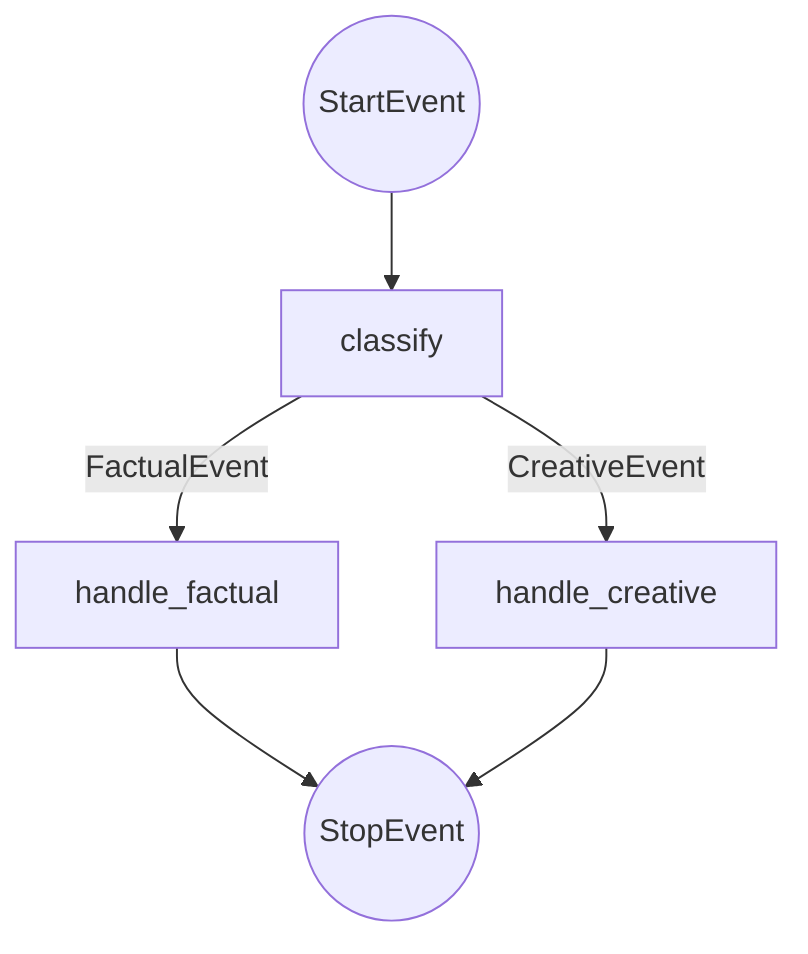
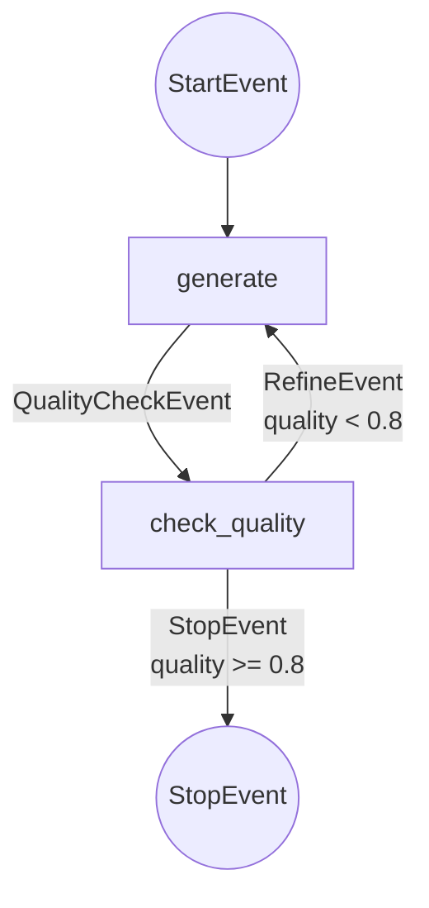
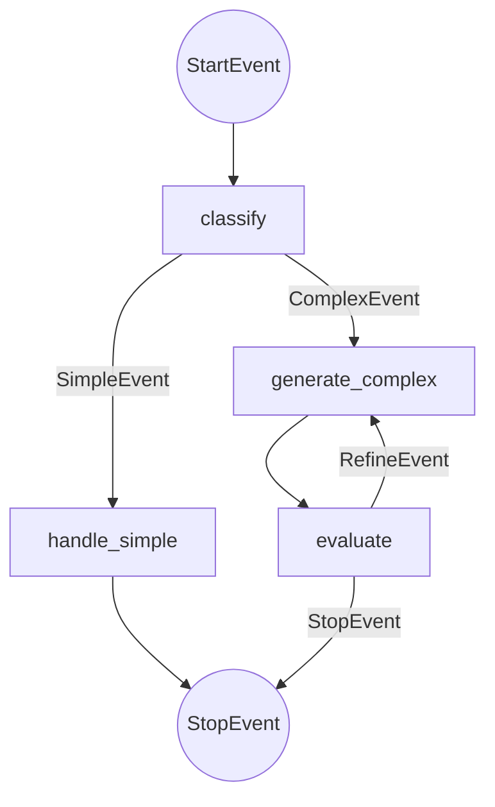

# Branches & Loops

## Introduction

Real-world AI applications often require complex control flow—classifying queries to route them appropriately, refining answers until quality thresholds are met, or retrying failed operations. LlamaIndex Workflows make these patterns natural through **union return types** and **conditional event emission**.

In this lesson, we'll master branching and looping patterns that give your workflows sophisticated decision-making capabilities.

### What We'll Cover

- Conditional branching with union types
- Looping for iterative refinement
- Multi-path workflows
- Combining branches and loops
- Quality-based exit conditions

### Prerequisites

- Workflow fundamentals (Lesson 01)
- Understanding of Python union types
- Async/await proficiency

---

## Branching Patterns



Branches allow different processing paths based on conditions.

---

## Basic Branching

Use **union return types** to indicate multiple possible outputs:

```python
from llama_index.core.workflow import Workflow, step, Event, StartEvent, StopEvent


class FactualEvent(Event):
    """Route to factual processing."""
    query: str


class CreativeEvent(Event):
    """Route to creative processing."""
    query: str


class BranchingWorkflow(Workflow):
    
    @step
    async def classify(self, ev: StartEvent) -> FactualEvent | CreativeEvent:
        """Classify query and route to appropriate handler."""
        query = ev.query.lower()
        
        # Simple keyword-based classification
        factual_keywords = ["what is", "explain", "define", "how does"]
        
        if any(kw in query for kw in factual_keywords):
            return FactualEvent(query=ev.query)
        else:
            return CreativeEvent(query=ev.query)
    
    @step
    async def handle_factual(self, ev: FactualEvent) -> StopEvent:
        """Handle factual queries with precise answers."""
        # Use RAG or knowledge lookup
        response = f"Factual answer for: {ev.query}"
        return StopEvent(result={"type": "factual", "answer": response})
    
    @step
    async def handle_creative(self, ev: CreativeEvent) -> StopEvent:
        """Handle creative queries with generation."""
        # Use LLM generation
        response = f"Creative response for: {ev.query}"
        return StopEvent(result={"type": "creative", "answer": response})
```

### Key Insight

The union type `FactualEvent | CreativeEvent` tells the framework this step can output either event type. The framework automatically routes to the correct handler based on which event is actually returned.

---

## Multi-Branch Workflows

Handle more than two branches:

```python
from llama_index.core.workflow import Workflow, step, Event, StartEvent, StopEvent


class CodeEvent(Event):
    query: str

class MathEvent(Event):
    query: str

class GeneralEvent(Event):
    query: str

class ResearchEvent(Event):
    query: str


class MultiRouterWorkflow(Workflow):
    
    @step
    async def route(self, ev: StartEvent) -> CodeEvent | MathEvent | GeneralEvent | ResearchEvent:
        """Route to specialized handlers."""
        query = ev.query.lower()
        
        if any(kw in query for kw in ["code", "python", "function", "class"]):
            return CodeEvent(query=ev.query)
        elif any(kw in query for kw in ["calculate", "math", "equation", "solve"]):
            return MathEvent(query=ev.query)
        elif any(kw in query for kw in ["research", "papers", "study", "findings"]):
            return ResearchEvent(query=ev.query)
        else:
            return GeneralEvent(query=ev.query)
    
    @step
    async def handle_code(self, ev: CodeEvent) -> StopEvent:
        return StopEvent(result=f"Code solution: {ev.query}")
    
    @step
    async def handle_math(self, ev: MathEvent) -> StopEvent:
        return StopEvent(result=f"Math answer: {ev.query}")
    
    @step
    async def handle_general(self, ev: GeneralEvent) -> StopEvent:
        return StopEvent(result=f"General response: {ev.query}")
    
    @step
    async def handle_research(self, ev: ResearchEvent) -> StopEvent:
        return StopEvent(result=f"Research findings: {ev.query}")
```

---

## Looping Patterns



Loops allow iterative refinement until conditions are met.

---

## Basic Loop

Return to a previous step by emitting its input event:

```python
from llama_index.core.workflow import Workflow, step, Event, StartEvent, StopEvent
from llama_index.llms.openai import OpenAI
import random


class LoopEvent(Event):
    """Event for looping."""
    num_loops: int


class LoopingWorkflow(Workflow):
    
    @step
    async def start(self, ev: StartEvent) -> LoopEvent:
        """Initialize the loop."""
        num_loops = random.randint(1, 5)
        print(f"Will loop {num_loops} times")
        return LoopEvent(num_loops=num_loops)
    
    @step
    async def loop_step(self, ev: LoopEvent) -> LoopEvent | StopEvent:
        """Loop until counter reaches zero."""
        print(f"Loop iteration, remaining: {ev.num_loops}")
        
        if ev.num_loops <= 0:
            return StopEvent(result="Done looping!")
        
        # Continue looping
        return LoopEvent(num_loops=ev.num_loops - 1)


async def main():
    workflow = LoopingWorkflow(timeout=60)
    result = await workflow.run()
    print(result)


# Output:
# Will loop 3 times
# Loop iteration, remaining: 3
# Loop iteration, remaining: 2
# Loop iteration, remaining: 1
# Loop iteration, remaining: 0
# Done looping!
```

---

## Refinement Loop

Common pattern: generate → evaluate → refine until quality threshold:

```python
from llama_index.core.workflow import Workflow, step, Event, StartEvent, StopEvent
from llama_index.llms.openai import OpenAI


class GenerateEvent(Event):
    """Event to generate content."""
    query: str
    iteration: int = 0
    previous_answer: str = ""


class EvaluateEvent(Event):
    """Event carrying generated content for evaluation."""
    query: str
    answer: str
    iteration: int


class RefineEvent(Event):
    """Event requesting refinement."""
    query: str
    answer: str
    feedback: str
    iteration: int


class RefinementWorkflow(Workflow):
    """Workflow that refines answers until quality threshold."""
    
    llm = OpenAI(model="gpt-4o-mini")
    max_iterations = 3
    quality_threshold = 0.8
    
    @step
    async def generate(self, ev: StartEvent | RefineEvent) -> EvaluateEvent:
        """Generate or refine an answer."""
        
        if isinstance(ev, StartEvent):
            # Initial generation
            prompt = f"Answer this question: {ev.query}"
            iteration = 0
        else:
            # Refinement based on feedback
            prompt = f"""Improve this answer based on feedback.

Original answer: {ev.answer}
Feedback: {ev.feedback}

Improved answer:"""
            iteration = ev.iteration
        
        response = await self.llm.acomplete(prompt)
        
        return EvaluateEvent(
            query=ev.query,
            answer=str(response),
            iteration=iteration + 1
        )
    
    @step
    async def evaluate(self, ev: EvaluateEvent) -> RefineEvent | StopEvent:
        """Evaluate quality and decide whether to refine."""
        
        # Simple quality evaluation (in real app, use LLM or metrics)
        quality_prompt = f"""Rate this answer from 0 to 1 for quality.
Question: {ev.query}
Answer: {ev.answer}

Return only a number between 0 and 1:"""
        
        quality_response = await self.llm.acomplete(quality_prompt)
        
        try:
            quality = float(str(quality_response).strip())
        except ValueError:
            quality = 0.5
        
        print(f"Iteration {ev.iteration}: Quality = {quality:.2f}")
        
        # Exit conditions
        if quality >= self.quality_threshold:
            return StopEvent(result={
                "answer": ev.answer,
                "iterations": ev.iteration,
                "final_quality": quality
            })
        
        if ev.iteration >= self.max_iterations:
            return StopEvent(result={
                "answer": ev.answer,
                "iterations": ev.iteration,
                "final_quality": quality,
                "note": "Max iterations reached"
            })
        
        # Generate feedback and refine
        feedback_prompt = f"""What could be improved in this answer?
Question: {ev.query}
Answer: {ev.answer}

Feedback:"""
        
        feedback = await self.llm.acomplete(feedback_prompt)
        
        return RefineEvent(
            query=ev.query,
            answer=ev.answer,
            feedback=str(feedback),
            iteration=ev.iteration
        )


async def main():
    workflow = RefinementWorkflow(timeout=120)
    result = await workflow.run(query="Explain quantum computing in simple terms")
    
    print(f"\nFinal Answer:\n{result['answer']}")
    print(f"Iterations: {result['iterations']}")


if __name__ == "__main__":
    import asyncio
    asyncio.run(main())
```

---

## Accepting Multiple Event Types

A step can accept multiple event types using union input types:

```python
@step
async def process(self, ev: StartEvent | RetryEvent | RefineEvent) -> OutputEvent:
    """Handle multiple input event types."""
    
    if isinstance(ev, StartEvent):
        # Initial processing
        data = ev.query
    elif isinstance(ev, RetryEvent):
        # Retry with same data
        data = ev.original_query
    else:  # RefineEvent
        # Refine existing output
        data = f"Improve: {ev.previous_output}"
    
    return OutputEvent(result=process_data(data))
```

---

## Combining Branches and Loops

Real workflows often combine both patterns:



```python
from llama_index.core.workflow import Workflow, step, Event, StartEvent, StopEvent
from llama_index.llms.openai import OpenAI


class SimpleQueryEvent(Event):
    query: str


class ComplexQueryEvent(Event):
    query: str


class GeneratedEvent(Event):
    query: str
    answer: str
    iteration: int


class RefineEvent(Event):
    query: str
    answer: str
    iteration: int


class HybridWorkflow(Workflow):
    """Workflow with both branching and looping."""
    
    llm = OpenAI(model="gpt-4o-mini")
    
    @step
    async def classify(self, ev: StartEvent) -> SimpleQueryEvent | ComplexQueryEvent:
        """Route based on query complexity."""
        query = ev.query
        
        # Simple heuristic: long queries are complex
        if len(query.split()) > 10:
            return ComplexQueryEvent(query=query)
        return SimpleQueryEvent(query=query)
    
    @step
    async def handle_simple(self, ev: SimpleQueryEvent) -> StopEvent:
        """Quick response for simple queries."""
        response = await self.llm.acomplete(ev.query)
        return StopEvent(result={"type": "simple", "answer": str(response)})
    
    @step
    async def generate_complex(self, ev: ComplexQueryEvent | RefineEvent) -> GeneratedEvent:
        """Generate or refine complex answers."""
        
        if isinstance(ev, ComplexQueryEvent):
            prompt = f"Provide a detailed answer: {ev.query}"
            iteration = 0
        else:
            prompt = f"Improve this answer: {ev.answer}"
            iteration = ev.iteration
        
        response = await self.llm.acomplete(prompt)
        
        return GeneratedEvent(
            query=ev.query,
            answer=str(response),
            iteration=iteration + 1
        )
    
    @step
    async def evaluate_complex(self, ev: GeneratedEvent) -> RefineEvent | StopEvent:
        """Evaluate and optionally refine."""
        
        # Exit if good enough or max iterations
        if ev.iteration >= 2 or len(ev.answer) > 500:
            return StopEvent(result={
                "type": "complex",
                "answer": ev.answer,
                "iterations": ev.iteration
            })
        
        # Otherwise refine
        return RefineEvent(
            query=ev.query,
            answer=ev.answer,
            iteration=ev.iteration
        )
```

---

## Best Practices

| Practice | Description |
|----------|-------------|
| Clear exit conditions | Always have a way to exit loops |
| Max iterations | Prevent infinite loops with counters |
| Descriptive events | Event names should indicate purpose |
| Type unions | Use `|` for multiple paths |
| Single responsibility | Each step handles one concern |

---

## Common Pitfalls

| ❌ Mistake | ✅ Solution |
|-----------|-------------|
| Infinite loops | Add max iteration counter |
| Missing exit condition | Always have `StopEvent` path |
| Unclear routing | Use descriptive event names |
| Complex conditions | Break into multiple steps |
| Forgetting isinstance | Always check event type in union handlers |

---

## Hands-on Exercise

### Your Task

Build a code review workflow that:
1. Classifies code as "simple" or "complex"
2. For simple code: single review pass
3. For complex code: iterative review until 3 issues or less

### Requirements

1. `SimpleCodeEvent` and `ComplexCodeEvent` for routing
2. `ReviewEvent` with issues list
3. Loop for complex code until quality met
4. Max 3 refinement iterations

### Expected Flow

```python
result = await workflow.run(code="def hello(): print('hi')")
# Simple path → direct review

result = await workflow.run(code="class ComplexClass: ...")
# Complex path → iterative review loop
```

<details>
<summary>💡 Hints (click to expand)</summary>

1. Use line count or complexity heuristics for classification
2. `ReviewEvent` should track `issues: list[str]` and `iteration: int`
3. Exit loop when `len(issues) <= 3` or `iteration >= 3`
4. Use union return type for evaluate step

</details>

<details>
<summary>✅ Solution (click to expand)</summary>

```python
from llama_index.core.workflow import Workflow, step, Event, StartEvent, StopEvent
from llama_index.llms.openai import OpenAI


class SimpleCodeEvent(Event):
    code: str


class ComplexCodeEvent(Event):
    code: str


class ReviewEvent(Event):
    code: str
    issues: list[str]
    iteration: int


class RefineCodeEvent(Event):
    code: str
    issues: list[str]
    iteration: int


class CodeReviewWorkflow(Workflow):
    llm = OpenAI(model="gpt-4o-mini")
    
    @step
    async def classify(self, ev: StartEvent) -> SimpleCodeEvent | ComplexCodeEvent:
        """Classify code complexity."""
        code = ev.code
        lines = code.count('\n') + 1
        
        if lines > 20 or 'class' in code:
            return ComplexCodeEvent(code=code)
        return SimpleCodeEvent(code=code)
    
    @step
    async def review_simple(self, ev: SimpleCodeEvent) -> StopEvent:
        """Single-pass review for simple code."""
        prompt = f"Review this code briefly:\n{ev.code}"
        response = await self.llm.acomplete(prompt)
        
        return StopEvent(result={
            "type": "simple",
            "review": str(response),
            "iterations": 1
        })
    
    @step
    async def review_complex(self, ev: ComplexCodeEvent | RefineCodeEvent) -> ReviewEvent:
        """Review complex code."""
        if isinstance(ev, ComplexCodeEvent):
            code = ev.code
            iteration = 0
        else:
            code = ev.code
            iteration = ev.iteration
        
        prompt = f"""List issues in this code (one per line):
{code}

Issues:"""
        response = await self.llm.acomplete(prompt)
        issues = [i.strip() for i in str(response).split('\n') if i.strip()]
        
        return ReviewEvent(
            code=code,
            issues=issues,
            iteration=iteration + 1
        )
    
    @step
    async def evaluate_review(self, ev: ReviewEvent) -> RefineCodeEvent | StopEvent:
        """Evaluate if more refinement needed."""
        
        # Exit conditions
        if len(ev.issues) <= 3 or ev.iteration >= 3:
            return StopEvent(result={
                "type": "complex",
                "issues": ev.issues,
                "iterations": ev.iteration
            })
        
        # Need more refinement
        return RefineCodeEvent(
            code=ev.code,
            issues=ev.issues,
            iteration=ev.iteration
        )


async def main():
    workflow = CodeReviewWorkflow(timeout=60)
    
    # Simple code
    simple_result = await workflow.run(code="def greet(): print('hello')")
    print(f"Simple: {simple_result}")
    
    # Complex code
    complex_code = """
class DataProcessor:
    def __init__(self, config):
        self.config = config
        self.data = []
    
    def process(self, items):
        for item in items:
            if item.valid:
                self.data.append(self.transform(item))
        return self.data
    
    def transform(self, item):
        return item.value * self.config.multiplier
"""
    complex_result = await workflow.run(code=complex_code)
    print(f"Complex: {complex_result}")


if __name__ == "__main__":
    import asyncio
    asyncio.run(main())
```

</details>

---

## Summary

✅ Union return types enable branching to multiple paths

✅ Return the triggering event type to create loops

✅ Always include exit conditions (max iterations, quality threshold)

✅ Use `isinstance()` to handle multiple input event types

✅ Combine branches and loops for sophisticated control flow

**Next:** [Managing State →](./03-managing-state.md)

---

## Further Reading

- [Branches and Loops](https://developers.llamaindex.ai/python/llamaagents/workflows/branches_and_loops/)
- [Corrective RAG Example](https://developers.llamaindex.ai/python/examples/workflow/corrective_rag_pack/)
- [Reflection Workflow](https://developers.llamaindex.ai/python/examples/workflow/reflection/)

---

<!-- 
Sources Consulted:
- LlamaIndex Branches and Loops: https://developers.llamaindex.ai/python/llamaagents/workflows/branches_and_loops/
- Workflow Examples: https://developers.llamaindex.ai/python/examples/workflow/
-->
