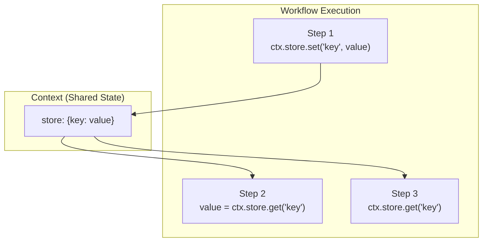

# Managing State

## Introduction

Complex workflows need to share data across steps—tracking metadata, accumulating results, or maintaining context throughout execution. LlamaIndex Workflows provide the `Context` object for exactly this purpose.

In this lesson, we'll explore how to manage state effectively, from simple key-value storage to typed Pydantic state models.

### What We'll Cover

- The Context object basics
- Storing and retrieving data
- Typed state with Pydantic models
- Locking state for concurrent access
- Persisting context across workflow runs

### Prerequisites

- Workflow fundamentals (Lesson 01)
- Branches and loops (Lesson 02)
- Pydantic model basics

---

## The Context Object



The `Context` object is passed to steps and provides:

| Feature | Description |
|---------|-------------|
| `store.get(key)` | Retrieve stored values |
| `store.set(key, value)` | Store values |
| `collect_events()` | Gather parallel events |
| `send_event()` | Emit events for parallel execution |

---

## Basic State Management

Add `ctx: Context` as a parameter to access state:

```python
from llama_index.core.workflow import Workflow, Context, step, StartEvent, StopEvent


class StatefulWorkflow(Workflow):
    
    @step
    async def step_one(self, ctx: Context, ev: StartEvent) -> ProcessEvent:
        """Store data in context."""
        # Store values
        await ctx.store.set("user_query", ev.query)
        await ctx.store.set("start_time", time.time())
        await ctx.store.set("step_count", 0)
        
        return ProcessEvent(data=ev.query)
    
    @step
    async def step_two(self, ctx: Context, ev: ProcessEvent) -> StopEvent:
        """Retrieve and update context data."""
        # Retrieve values
        start_time = await ctx.store.get("start_time")
        step_count = await ctx.store.get("step_count", default=0)
        
        # Update
        await ctx.store.set("step_count", step_count + 1)
        
        # Calculate elapsed time
        elapsed = time.time() - start_time
        
        return StopEvent(result={
            "data": ev.data,
            "elapsed_seconds": elapsed,
            "steps_executed": step_count + 1
        })
```

### Store Methods

| Method | Description |
|--------|-------------|
| `await ctx.store.get(key)` | Get value (raises if missing) |
| `await ctx.store.get(key, default=...)` | Get with default |
| `await ctx.store.set(key, value)` | Set value |

---

## Tracking Workflow Metadata

Common use case: track execution metadata across steps:

```python
from llama_index.core.workflow import Workflow, Context, step, Event, StartEvent, StopEvent
import time


class MetadataEvent(Event):
    query: str


class ProcessedEvent(Event):
    result: str


class MetadataTrackingWorkflow(Workflow):
    """Workflow that tracks execution metadata."""
    
    @step
    async def initialize(self, ctx: Context, ev: StartEvent) -> MetadataEvent:
        """Initialize metadata tracking."""
        await ctx.store.set("metadata", {
            "start_time": time.time(),
            "steps_executed": [],
            "token_count": 0
        })
        
        return MetadataEvent(query=ev.query)
    
    @step
    async def process(self, ctx: Context, ev: MetadataEvent) -> ProcessedEvent:
        """Process and update metadata."""
        metadata = await ctx.store.get("metadata")
        
        # Update metadata
        metadata["steps_executed"].append("process")
        metadata["token_count"] += len(ev.query.split())
        
        await ctx.store.set("metadata", metadata)
        
        result = f"Processed: {ev.query}"
        return ProcessedEvent(result=result)
    
    @step
    async def finalize(self, ctx: Context, ev: ProcessedEvent) -> StopEvent:
        """Finalize and return with metadata."""
        metadata = await ctx.store.get("metadata")
        
        metadata["steps_executed"].append("finalize")
        metadata["end_time"] = time.time()
        metadata["total_time"] = metadata["end_time"] - metadata["start_time"]
        
        return StopEvent(result={
            "output": ev.result,
            "metadata": metadata
        })
```

---

## Typed State with Pydantic

For type safety and validation, use Pydantic models:

```python
from pydantic import BaseModel, Field
from llama_index.core.workflow import Workflow, Context, step, StartEvent, StopEvent


class WorkflowState(BaseModel):
    """Typed state model for workflow."""
    count: int = Field(default=0)
    results: list[str] = Field(default_factory=list)
    total_tokens: int = Field(default=0)
    is_complete: bool = Field(default=False)


class TypedStateWorkflow(Workflow):
    """Workflow with typed Pydantic state."""
    
    @step
    async def process(
        self,
        ctx: Context[WorkflowState],  # Typed context!
        ev: StartEvent
    ) -> StopEvent:
        """Process with typed state access."""
        
        # Atomic state update with locking
        async with ctx.store.edit_state() as state:
            state.count += 1
            state.results.append(f"Processed: {ev.query}")
            state.total_tokens += len(ev.query.split())
            state.is_complete = True
        
        return StopEvent(result={
            "count": state.count,
            "results": state.results
        })
```

### Benefits of Typed State

| Benefit | Description |
|---------|-------------|
| **IDE autocomplete** | Access state fields with autocomplete |
| **Type validation** | Pydantic validates types at runtime |
| **Default values** | Automatic initialization |
| **Serialization** | Built-in JSON serialization |

---

## Locking State for Concurrent Access

When multiple steps run concurrently, use locking to prevent race conditions:

```python
from llama_index.core.workflow import Workflow, Context, step, Event, StartEvent, StopEvent


class CounterWorkflow(Workflow):
    
    @step
    async def increment(self, ctx: Context, ev: IncrementEvent) -> StopEvent:
        """Safely increment counter with locking."""
        
        # Lock prevents concurrent access
        async with ctx.store.edit_state() as state:
            if "count" not in state:
                state["count"] = 0
            state["count"] += 1
            current = state["count"]
        
        return StopEvent(result={"count": current})
```

### Without Locking (Dangerous)

```python
# ❌ Race condition possible!
count = await ctx.store.get("count", default=0)
await ctx.store.set("count", count + 1)  # Another step might update between get/set!
```

### With Locking (Safe)

```python
# ✅ Atomic update
async with ctx.store.edit_state() as state:
    if "count" not in state:
        state["count"] = 0
    state["count"] += 1
```

---

## Persisting Context Across Runs

Maintain state between workflow executions:

```python
from llama_index.core.workflow import Workflow, Context, step, StartEvent, StopEvent


class PersistentWorkflow(Workflow):
    
    @step
    async def process(self, ctx: Context, ev: StartEvent) -> StopEvent:
        """Access persistent state from previous runs."""
        
        # Get history from previous runs
        history = await ctx.store.get("history", default=[])
        
        # Add current interaction
        history.append({
            "query": ev.query,
            "timestamp": time.time()
        })
        
        await ctx.store.set("history", history)
        
        return StopEvent(result={
            "response": f"Processed: {ev.query}",
            "total_interactions": len(history)
        })


async def main():
    workflow = PersistentWorkflow(timeout=60)
    
    # Create a context to persist
    ctx = Context(workflow)
    
    # First run
    handler = workflow.run(ctx=ctx, query="Hello")
    result1 = await handler
    print(f"Run 1: {result1}")  # total_interactions: 1
    
    # Second run with same context
    handler = workflow.run(ctx=ctx, query="How are you?")
    result2 = await handler
    print(f"Run 2: {result2}")  # total_interactions: 2
    
    # Third run
    handler = workflow.run(ctx=ctx, query="Goodbye")
    result3 = await handler
    print(f"Run 3: {result3}")  # total_interactions: 3
```

### Serializing Context

Save and restore context for long-term persistence:

```python
# Save context to dict
ctx_dict = ctx.to_dict()

# Store in database, file, etc.
import json
with open("context.json", "w") as f:
    json.dump(ctx_dict, f)

# Later: restore context
with open("context.json", "r") as f:
    ctx_dict = json.load(f)

restored_ctx = Context.from_dict(workflow, ctx_dict)

# Continue workflow with restored context
handler = workflow.run(ctx=restored_ctx, query="Continuing...")
```

---

## Accumulating Results

Build up results across iterations:

```python
from llama_index.core.workflow import Workflow, Context, step, Event, StartEvent, StopEvent


class ItemEvent(Event):
    item: str
    index: int


class AccumulatorWorkflow(Workflow):
    """Workflow that accumulates results."""
    
    @step
    async def start(self, ctx: Context, ev: StartEvent) -> list[ItemEvent]:
        """Initialize accumulator and emit items."""
        await ctx.store.set("results", [])
        
        items = ev.items
        return [ItemEvent(item=item, index=i) for i, item in enumerate(items)]
    
    @step(num_workers=4)
    async def process_item(self, ctx: Context, ev: ItemEvent) -> ProcessedItemEvent:
        """Process single item and accumulate."""
        result = f"Processed: {ev.item}"
        
        # Safely add to results
        async with ctx.store.edit_state() as state:
            if "results" not in state:
                state["results"] = []
            state["results"].append({
                "index": ev.index,
                "original": ev.item,
                "processed": result
            })
        
        return ProcessedItemEvent(index=ev.index)
    
    @step
    async def finalize(self, ctx: Context, ev: FinalizeEvent) -> StopEvent:
        """Return accumulated results."""
        results = await ctx.store.get("results")
        
        # Sort by original index
        results.sort(key=lambda x: x["index"])
        
        return StopEvent(result=results)
```

---

## State Patterns Summary

| Pattern | When to Use |
|---------|-------------|
| Simple key-value | Basic data sharing |
| Typed Pydantic | Complex state, need validation |
| Locking | Concurrent step access |
| Context persistence | Multi-run workflows |
| Accumulation | Gathering parallel results |

---

## Complete Example: Conversation Workflow

```python
from pydantic import BaseModel, Field
from llama_index.core.workflow import Workflow, Context, step, Event, StartEvent, StopEvent
from llama_index.llms.openai import OpenAI
from datetime import datetime


class ConversationState(BaseModel):
    """State for conversation tracking."""
    messages: list[dict] = Field(default_factory=list)
    turn_count: int = Field(default=0)
    started_at: str = Field(default="")


class UserMessageEvent(Event):
    content: str


class AssistantMessageEvent(Event):
    content: str


class ConversationWorkflow(Workflow):
    """Stateful conversation workflow."""
    
    llm = OpenAI(model="gpt-4o-mini")
    
    @step
    async def handle_user_message(
        self,
        ctx: Context[ConversationState],
        ev: StartEvent
    ) -> UserMessageEvent:
        """Process user input and update state."""
        
        async with ctx.store.edit_state() as state:
            # Initialize on first message
            if not state.started_at:
                state.started_at = datetime.now().isoformat()
            
            # Add user message
            state.messages.append({
                "role": "user",
                "content": ev.message
            })
            state.turn_count += 1
        
        return UserMessageEvent(content=ev.message)
    
    @step
    async def generate_response(
        self,
        ctx: Context[ConversationState],
        ev: UserMessageEvent
    ) -> AssistantMessageEvent:
        """Generate LLM response using conversation history."""
        
        # Get full conversation history
        async with ctx.store.edit_state() as state:
            messages = state.messages.copy()
        
        # Generate response with context
        response = await self.llm.achat(messages)
        
        return AssistantMessageEvent(content=str(response))
    
    @step
    async def store_response(
        self,
        ctx: Context[ConversationState],
        ev: AssistantMessageEvent
    ) -> StopEvent:
        """Store assistant response and return."""
        
        async with ctx.store.edit_state() as state:
            state.messages.append({
                "role": "assistant",
                "content": ev.content
            })
        
        # Get current state for response
        async with ctx.store.edit_state() as state:
            return StopEvent(result={
                "response": ev.content,
                "turn_count": state.turn_count,
                "message_count": len(state.messages)
            })


async def main():
    workflow = ConversationWorkflow(timeout=60)
    ctx = Context(workflow)
    
    # Multi-turn conversation
    messages = [
        "Hello! What's your name?",
        "Can you tell me about Python?",
        "What about async programming?"
    ]
    
    for message in messages:
        handler = workflow.run(ctx=ctx, message=message)
        result = await handler
        print(f"User: {message}")
        print(f"Assistant: {result['response']}")
        print(f"(Turn {result['turn_count']}, {result['message_count']} messages)")
        print()


if __name__ == "__main__":
    import asyncio
    asyncio.run(main())
```

---

## Best Practices

| Practice | Description |
|----------|-------------|
| Use typed state | Pydantic models prevent errors |
| Lock concurrent access | Prevent race conditions |
| Initialize defaults | Always provide default values |
| Keep state minimal | Only store what's needed |
| Clear sensitive data | Remove secrets after use |

---

## Common Pitfalls

| ❌ Mistake | ✅ Solution |
|-----------|-------------|
| Forgetting `await` | All store methods are async |
| Race conditions | Use `edit_state()` for atomic updates |
| Missing defaults | Use `get(key, default=...)` |
| Complex nested state | Flatten or use Pydantic models |
| Not persisting context | Save `ctx.to_dict()` between runs |

---

## Hands-on Exercise

### Your Task

Build a quiz workflow that:
1. Tracks questions asked and answers given
2. Accumulates score across questions
3. Persists state between runs for multi-session quizzes

### Requirements

1. Typed `QuizState` with questions, answers, score
2. Track current question index
3. Validate answers and update score
4. Support resuming from previous session

### Expected Usage

```python
# Session 1
result = await workflow.run(ctx=ctx, action="answer", answer="Paris")
# Score: 1/1

# Session 2 (same ctx)
result = await workflow.run(ctx=ctx, action="answer", answer="Berlin")
# Score: 2/2
```

<details>
<summary>💡 Hints (click to expand)</summary>

1. Use Pydantic model with `questions: list[dict]`, `score: int`, `current_index: int`
2. Check answer against correct answer in state
3. Increment score for correct answers
4. Pass same `ctx` across runs

</details>

<details>
<summary>✅ Solution (click to expand)</summary>

```python
from pydantic import BaseModel, Field
from llama_index.core.workflow import Workflow, Context, step, StartEvent, StopEvent


class QuizState(BaseModel):
    questions: list[dict] = Field(default_factory=lambda: [
        {"q": "Capital of France?", "a": "Paris"},
        {"q": "Capital of Germany?", "a": "Berlin"},
        {"q": "Capital of Japan?", "a": "Tokyo"}
    ])
    current_index: int = Field(default=0)
    score: int = Field(default=0)
    answers_given: list[dict] = Field(default_factory=list)


class QuizWorkflow(Workflow):
    
    @step
    async def handle_action(
        self,
        ctx: Context[QuizState],
        ev: StartEvent
    ) -> StopEvent:
        """Handle quiz actions."""
        
        action = ev.action
        
        async with ctx.store.edit_state() as state:
            if action == "start":
                # Reset quiz
                state.current_index = 0
                state.score = 0
                state.answers_given = []
                
                return StopEvent(result={
                    "action": "question",
                    "question": state.questions[0]["q"],
                    "question_number": 1,
                    "total_questions": len(state.questions)
                })
            
            elif action == "answer":
                answer = ev.answer
                current_q = state.questions[state.current_index]
                
                is_correct = answer.lower() == current_q["a"].lower()
                
                if is_correct:
                    state.score += 1
                
                state.answers_given.append({
                    "question": current_q["q"],
                    "given": answer,
                    "correct": current_q["a"],
                    "is_correct": is_correct
                })
                
                state.current_index += 1
                
                # Check if quiz complete
                if state.current_index >= len(state.questions):
                    return StopEvent(result={
                        "action": "complete",
                        "score": state.score,
                        "total": len(state.questions),
                        "percentage": (state.score / len(state.questions)) * 100
                    })
                
                # Next question
                return StopEvent(result={
                    "action": "question",
                    "feedback": "Correct!" if is_correct else f"Wrong! Answer: {current_q['a']}",
                    "question": state.questions[state.current_index]["q"],
                    "question_number": state.current_index + 1,
                    "current_score": state.score
                })
            
            elif action == "status":
                return StopEvent(result={
                    "action": "status",
                    "current_index": state.current_index,
                    "score": state.score,
                    "total": len(state.questions)
                })


async def main():
    workflow = QuizWorkflow(timeout=60)
    ctx = Context(workflow)
    
    # Start quiz
    result = await workflow.run(ctx=ctx, action="start")
    print(f"Q1: {result['question']}")
    
    # Answer questions
    result = await workflow.run(ctx=ctx, action="answer", answer="Paris")
    print(f"Feedback: {result.get('feedback', '')}")
    print(f"Q2: {result['question']}")
    
    result = await workflow.run(ctx=ctx, action="answer", answer="Berlin")
    print(f"Feedback: {result.get('feedback', '')}")
    print(f"Q3: {result['question']}")
    
    result = await workflow.run(ctx=ctx, action="answer", answer="Tokyo")
    print(f"Quiz Complete! Score: {result['score']}/{result['total']}")


if __name__ == "__main__":
    import asyncio
    asyncio.run(main())
```

</details>

---

## Summary

✅ `Context` provides shared state across workflow steps

✅ Use `ctx.store.get()` and `ctx.store.set()` for basic storage

✅ Pydantic models enable typed, validated state

✅ `edit_state()` provides atomic updates with locking

✅ Pass `ctx` to `workflow.run()` for cross-run persistence

✅ Serialize with `ctx.to_dict()` for long-term storage

**Next:** [Concurrent Execution →](./04-concurrent-execution.md)

---

## Further Reading

- [Managing State](https://developers.llamaindex.ai/python/llamaagents/workflows/managing_state/)
- [Context API Reference](https://developers.llamaindex.ai/python/workflows-api-reference/context/)
- [Workflow Cookbook](https://developers.llamaindex.ai/python/examples/workflow/workflows_cookbook/)

---

<!-- 
Sources Consulted:
- LlamaIndex Managing State: https://developers.llamaindex.ai/python/llamaagents/workflows/managing_state/
- Context API: https://developers.llamaindex.ai/python/workflows-api-reference/context/
-->
