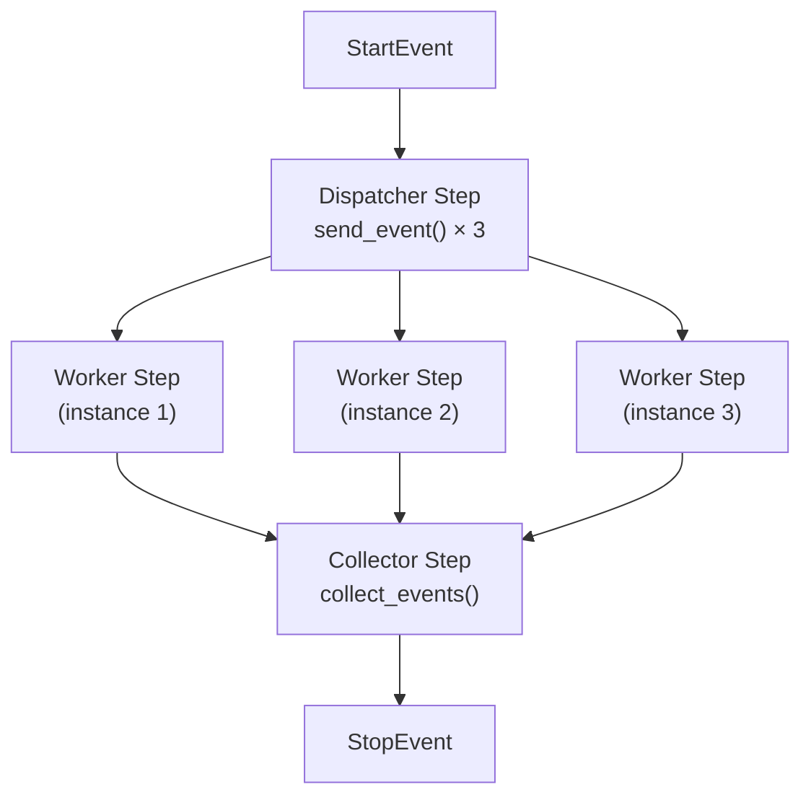

# Concurrent Execution

## Introduction

Real-world AI workflows often need to process multiple items in parallel—analyzing documents, querying multiple APIs, or processing user requests concurrently. LlamaIndex Workflows provide powerful primitives for parallel execution.

In this lesson, we'll master concurrent execution patterns using `send_event()`, `collect_events()`, and worker pools.

### What We'll Cover

- Emitting multiple events with `send_event()`
- Collecting parallel results with `collect_events()`
- Concurrent step workers with `num_workers`
- Fan-out/fan-in patterns
- Error handling in parallel workflows

### Prerequisites

- Workflow fundamentals (Lesson 01)
- Managing state (Lesson 03)
- Python async/await basics

---

## Concurrent Execution Flow



---

## Emitting Multiple Events

Use `ctx.send_event()` to emit multiple events for parallel processing:

```python
from llama_index.core.workflow import Workflow, Context, step, Event, StartEvent, StopEvent


class ItemEvent(Event):
    item: str
    index: int


class ProcessedEvent(Event):
    result: str
    index: int


class ParallelWorkflow(Workflow):
    
    @step
    async def dispatch(self, ctx: Context, ev: StartEvent) -> None:
        """Emit multiple events for parallel processing."""
        items = ev.items  # e.g., ["doc1", "doc2", "doc3"]
        
        # Store count for collection
        await ctx.store.set("total_items", len(items))
        
        # Emit events for each item
        for i, item in enumerate(items):
            ctx.send_event(ItemEvent(item=item, index=i))
        
        # Return None - we've dispatched events via send_event()
        return None
```

> **Note:** `send_event()` is synchronous (no `await`). It queues events immediately.

---

## Concurrent Workers

Use `num_workers` to process events concurrently:

```python
class ParallelWorkflow(Workflow):
    
    @step
    async def dispatch(self, ctx: Context, ev: StartEvent) -> None:
        """Dispatch items for parallel processing."""
        items = ev.items
        await ctx.store.set("total_items", len(items))
        
        for i, item in enumerate(items):
            ctx.send_event(ItemEvent(item=item, index=i))
    
    @step(num_workers=4)  # Up to 4 concurrent instances
    async def process_item(self, ctx: Context, ev: ItemEvent) -> ProcessedEvent:
        """Process single item - runs in parallel."""
        # Simulate async work
        await asyncio.sleep(0.5)
        
        result = f"Processed: {ev.item}"
        return ProcessedEvent(result=result, index=ev.index)
```

### How `num_workers` Works

| Setting | Behavior |
|---------|----------|
| `num_workers=1` | Sequential processing (default) |
| `num_workers=4` | Up to 4 concurrent step instances |
| `num_workers=10` | Up to 10 concurrent step instances |

---

## Collecting Parallel Results

Use `ctx.collect_events()` to wait for multiple events:

```python
class ParallelWorkflow(Workflow):
    
    @step
    async def dispatch(self, ctx: Context, ev: StartEvent) -> None:
        items = ev.items
        await ctx.store.set("total_items", len(items))
        
        for i, item in enumerate(items):
            ctx.send_event(ItemEvent(item=item, index=i))
    
    @step(num_workers=4)
    async def process_item(self, ctx: Context, ev: ItemEvent) -> ProcessedEvent:
        await asyncio.sleep(0.5)
        return ProcessedEvent(result=f"Processed: {ev.item}", index=ev.index)
    
    @step
    async def collect_results(
        self,
        ctx: Context,
        ev: ProcessedEvent
    ) -> StopEvent | None:
        """Collect all results before proceeding."""
        
        total = await ctx.store.get("total_items")
        
        # Wait for all ProcessedEvents
        results = ctx.collect_events(ev, [ProcessedEvent] * total)
        
        if results is None:
            # Not all events received yet
            return None
        
        # All events collected!
        sorted_results = sorted(results, key=lambda x: x.index)
        
        return StopEvent(result=[r.result for r in sorted_results])
```

### How `collect_events()` Works

```python
# Wait for exactly 3 ProcessedEvents
results = ctx.collect_events(ev, [ProcessedEvent] * 3)

# Returns None until all 3 are received
# Then returns list of all 3 events
```

| Return Value | Meaning |
|--------------|---------|
| `None` | Still waiting for more events |
| `List[Event]` | All expected events received |

---

## Complete Fan-Out/Fan-In Pattern

```python
from llama_index.core.workflow import Workflow, Context, step, Event, StartEvent, StopEvent
import asyncio


class DocumentEvent(Event):
    doc_id: str
    content: str


class AnalyzedEvent(Event):
    doc_id: str
    summary: str
    word_count: int


class DocumentAnalysisWorkflow(Workflow):
    """Analyze multiple documents in parallel."""
    
    @step
    async def fan_out(self, ctx: Context, ev: StartEvent) -> None:
        """Dispatch documents for parallel analysis."""
        documents = ev.documents  # List of {id, content}
        
        await ctx.store.set("doc_count", len(documents))
        
        for doc in documents:
            ctx.send_event(DocumentEvent(
                doc_id=doc["id"],
                content=doc["content"]
            ))
    
    @step(num_workers=5)
    async def analyze_document(
        self,
        ctx: Context,
        ev: DocumentEvent
    ) -> AnalyzedEvent:
        """Analyze single document."""
        # Simulate LLM call
        await asyncio.sleep(0.3)
        
        summary = f"Summary of {ev.doc_id}: {ev.content[:50]}..."
        word_count = len(ev.content.split())
        
        return AnalyzedEvent(
            doc_id=ev.doc_id,
            summary=summary,
            word_count=word_count
        )
    
    @step
    async def fan_in(
        self,
        ctx: Context,
        ev: AnalyzedEvent
    ) -> StopEvent | None:
        """Collect all analysis results."""
        
        doc_count = await ctx.store.get("doc_count")
        results = ctx.collect_events(ev, [AnalyzedEvent] * doc_count)
        
        if results is None:
            return None
        
        # Aggregate results
        total_words = sum(r.word_count for r in results)
        
        return StopEvent(result={
            "documents_analyzed": len(results),
            "total_words": total_words,
            "summaries": {r.doc_id: r.summary for r in results}
        })


async def main():
    workflow = DocumentAnalysisWorkflow(timeout=60)
    
    documents = [
        {"id": "doc1", "content": "First document with some content about AI."},
        {"id": "doc2", "content": "Second document discussing machine learning."},
        {"id": "doc3", "content": "Third document about neural networks."},
        {"id": "doc4", "content": "Fourth document explaining transformers."},
    ]
    
    result = await workflow.run(documents=documents)
    print(f"Analyzed {result['documents_analyzed']} documents")
    print(f"Total words: {result['total_words']}")
```

---

## Parallel API Calls

Common pattern: query multiple LLMs or APIs concurrently:

```python
from llama_index.core.workflow import Workflow, Context, step, Event, StartEvent, StopEvent
from llama_index.llms.openai import OpenAI


class QueryEvent(Event):
    query: str
    model: str


class ResponseEvent(Event):
    model: str
    response: str


class MultiModelWorkflow(Workflow):
    """Query multiple models in parallel."""
    
    models = {
        "gpt-4o-mini": OpenAI(model="gpt-4o-mini"),
        "gpt-4o": OpenAI(model="gpt-4o"),
    }
    
    @step
    async def dispatch_queries(self, ctx: Context, ev: StartEvent) -> None:
        """Send query to all models."""
        query = ev.query
        model_names = list(self.models.keys())
        
        await ctx.store.set("model_count", len(model_names))
        
        for model in model_names:
            ctx.send_event(QueryEvent(query=query, model=model))
    
    @step(num_workers=3)
    async def query_model(self, ctx: Context, ev: QueryEvent) -> ResponseEvent:
        """Query single model."""
        llm = self.models[ev.model]
        response = await llm.acomplete(ev.query)
        
        return ResponseEvent(model=ev.model, response=str(response))
    
    @step
    async def collect_responses(
        self,
        ctx: Context,
        ev: ResponseEvent
    ) -> StopEvent | None:
        """Collect all model responses."""
        
        model_count = await ctx.store.get("model_count")
        results = ctx.collect_events(ev, [ResponseEvent] * model_count)
        
        if results is None:
            return None
        
        return StopEvent(result={
            r.model: r.response for r in results
        })
```

---

## Handling Mixed Event Types

Collect different event types together:

```python
class SuccessEvent(Event):
    result: str


class ErrorEvent(Event):
    error: str


class MixedResultsWorkflow(Workflow):
    
    @step
    async def process(self, ctx: Context, ev: ItemEvent) -> SuccessEvent | ErrorEvent:
        """Process with possible failure."""
        try:
            result = await some_operation(ev.item)
            return SuccessEvent(result=result)
        except Exception as e:
            return ErrorEvent(error=str(e))
    
    @step
    async def collect(
        self,
        ctx: Context,
        ev: SuccessEvent | ErrorEvent
    ) -> StopEvent | None:
        """Collect mixed results."""
        
        total = await ctx.store.get("total_items")
        
        # Collect any of these event types
        results = ctx.collect_events(ev, [SuccessEvent, ErrorEvent] * total)
        
        if results is None:
            return None
        
        successes = [r for r in results if isinstance(r, SuccessEvent)]
        errors = [r for r in results if isinstance(r, ErrorEvent)]
        
        return StopEvent(result={
            "successes": len(successes),
            "errors": len(errors),
            "results": [s.result for s in successes]
        })
```

---

## Error Handling in Parallel Steps

Handle failures gracefully in concurrent workflows:

```python
from llama_index.core.workflow import Workflow, Context, step, Event, StartEvent, StopEvent


class TaskEvent(Event):
    task_id: str


class TaskResultEvent(Event):
    task_id: str
    success: bool
    result: str | None = None
    error: str | None = None


class RobustParallelWorkflow(Workflow):
    
    @step(num_workers=4)
    async def process_task(self, ctx: Context, ev: TaskEvent) -> TaskResultEvent:
        """Process with error handling."""
        try:
            result = await self.do_work(ev.task_id)
            return TaskResultEvent(
                task_id=ev.task_id,
                success=True,
                result=result
            )
        except Exception as e:
            return TaskResultEvent(
                task_id=ev.task_id,
                success=False,
                error=str(e)
            )
    
    @step
    async def aggregate(
        self,
        ctx: Context,
        ev: TaskResultEvent
    ) -> StopEvent | None:
        """Aggregate results with error reporting."""
        
        total = await ctx.store.get("total_tasks")
        results = ctx.collect_events(ev, [TaskResultEvent] * total)
        
        if results is None:
            return None
        
        succeeded = [r for r in results if r.success]
        failed = [r for r in results if not r.success]
        
        return StopEvent(result={
            "completed": len(succeeded),
            "failed": len(failed),
            "results": [r.result for r in succeeded],
            "errors": [{"task": r.task_id, "error": r.error} for r in failed]
        })
```

---

## Parallel Processing with State Accumulation

Safely accumulate results from parallel workers:

```python
class ParallelAccumulatorWorkflow(Workflow):
    
    @step(num_workers=4)
    async def process_item(self, ctx: Context, ev: ItemEvent) -> ProcessedEvent:
        """Process and accumulate safely."""
        result = await self.analyze(ev.item)
        
        # Thread-safe accumulation
        async with ctx.store.edit_state() as state:
            if "results" not in state:
                state["results"] = []
            state["results"].append({
                "index": ev.index,
                "result": result
            })
        
        return ProcessedEvent(index=ev.index)
```

---

## Best Practices

| Practice | Description |
|----------|-------------|
| Store count first | Always store item count before dispatching |
| Use edit_state() | Lock state when accumulating from workers |
| Limit workers | Match `num_workers` to actual parallelism benefit |
| Handle errors | Return error events instead of raising |
| Order results | Track indices to restore order after collection |

---

## Common Pitfalls

| ❌ Mistake | ✅ Solution |
|-----------|-------------|
| Forgetting to store count | Store item count before `send_event()` |
| Wrong collect count | Match `[EventType] * n` to dispatched events |
| Race conditions in state | Use `edit_state()` for concurrent access |
| Not handling errors | Catch exceptions in parallel steps |
| Returning from dispatcher | Use `return None` after `send_event()` |

---

## Performance Considerations

| Factor | Guidance |
|--------|----------|
| `num_workers` | Start with 4-8, benchmark for your use case |
| I/O-bound work | Higher worker count helps |
| CPU-bound work | Limited benefit from many workers |
| LLM API calls | Match to rate limits |
| Memory | Each worker may hold state |

---

## Hands-on Exercise

### Your Task

Build a parallel web scraper workflow that:
1. Accepts a list of URLs
2. Fetches each URL concurrently (simulate with sleep)
3. Collects and aggregates results
4. Reports successes and failures

### Requirements

1. Dispatch URL events with `send_event()`
2. Process with `num_workers=5`
3. Handle failures gracefully
4. Return aggregated statistics

### Expected Result

```python
result = await workflow.run(urls=["url1", "url2", "url3", "url4", "url5"])
# {
#     "fetched": 4,
#     "failed": 1,
#     "results": [...],
#     "errors": [...]
# }
```

<details>
<summary>💡 Hints (click to expand)</summary>

1. Create `URLEvent` with url field
2. Create `FetchResultEvent` with success, content, error fields
3. Use try/except in worker step
4. `collect_events()` waits for all results

</details>

<details>
<summary>✅ Solution (click to expand)</summary>

```python
from llama_index.core.workflow import Workflow, Context, step, Event, StartEvent, StopEvent
import asyncio
import random


class URLEvent(Event):
    url: str
    index: int


class FetchResultEvent(Event):
    url: str
    index: int
    success: bool
    content: str | None = None
    error: str | None = None


class WebScraperWorkflow(Workflow):
    
    @step
    async def dispatch_urls(self, ctx: Context, ev: StartEvent) -> None:
        """Dispatch URLs for parallel fetching."""
        urls = ev.urls
        
        await ctx.store.set("url_count", len(urls))
        
        for i, url in enumerate(urls):
            ctx.send_event(URLEvent(url=url, index=i))
    
    @step(num_workers=5)
    async def fetch_url(self, ctx: Context, ev: URLEvent) -> FetchResultEvent:
        """Fetch single URL with error handling."""
        try:
            # Simulate network request
            await asyncio.sleep(random.uniform(0.1, 0.5))
            
            # Simulate occasional failures
            if random.random() < 0.2:
                raise ConnectionError(f"Failed to connect to {ev.url}")
            
            content = f"Content from {ev.url}"
            
            return FetchResultEvent(
                url=ev.url,
                index=ev.index,
                success=True,
                content=content
            )
        except Exception as e:
            return FetchResultEvent(
                url=ev.url,
                index=ev.index,
                success=False,
                error=str(e)
            )
    
    @step
    async def collect_results(
        self,
        ctx: Context,
        ev: FetchResultEvent
    ) -> StopEvent | None:
        """Collect all fetch results."""
        
        url_count = await ctx.store.get("url_count")
        results = ctx.collect_events(ev, [FetchResultEvent] * url_count)
        
        if results is None:
            return None
        
        # Sort by index
        sorted_results = sorted(results, key=lambda x: x.index)
        
        successes = [r for r in sorted_results if r.success]
        failures = [r for r in sorted_results if not r.success]
        
        return StopEvent(result={
            "fetched": len(successes),
            "failed": len(failures),
            "results": [{"url": r.url, "content": r.content} for r in successes],
            "errors": [{"url": r.url, "error": r.error} for r in failures]
        })


async def main():
    workflow = WebScraperWorkflow(timeout=60)
    
    urls = [
        "https://example.com/page1",
        "https://example.com/page2",
        "https://example.com/page3",
        "https://example.com/page4",
        "https://example.com/page5",
    ]
    
    result = await workflow.run(urls=urls)
    
    print(f"Successfully fetched: {result['fetched']}")
    print(f"Failed: {result['failed']}")
    
    for r in result["results"]:
        print(f"  ✓ {r['url']}")
    
    for e in result["errors"]:
        print(f"  ✗ {e['url']}: {e['error']}")


if __name__ == "__main__":
    asyncio.run(main())
```

</details>

---

## Summary

✅ Use `ctx.send_event()` to emit multiple events for parallel processing

✅ Configure `@step(num_workers=N)` for concurrent step execution

✅ Use `ctx.collect_events(ev, [Type] * n)` to wait for n events

✅ Always store item count before dispatching

✅ Handle errors gracefully in parallel workers

✅ Use `edit_state()` for thread-safe state accumulation

**Next:** [Human-in-the-Loop →](./05-human-in-the-loop.md)

---

## Further Reading

- [Concurrent Execution](https://developers.llamaindex.ai/python/llamaagents/workflows/concurrent_execution/)
- [Workflow Cookbook](https://developers.llamaindex.ai/python/examples/workflow/workflows_cookbook/)
- [Parallel RAG Workflow](https://developers.llamaindex.ai/python/examples/workflow/parallel_rag/)

---

<!-- 
Sources Consulted:
- LlamaIndex Concurrent Execution: https://developers.llamaindex.ai/python/llamaagents/workflows/concurrent_execution/
- Workflow API Reference: https://developers.llamaindex.ai/python/workflows-api-reference/
-->
