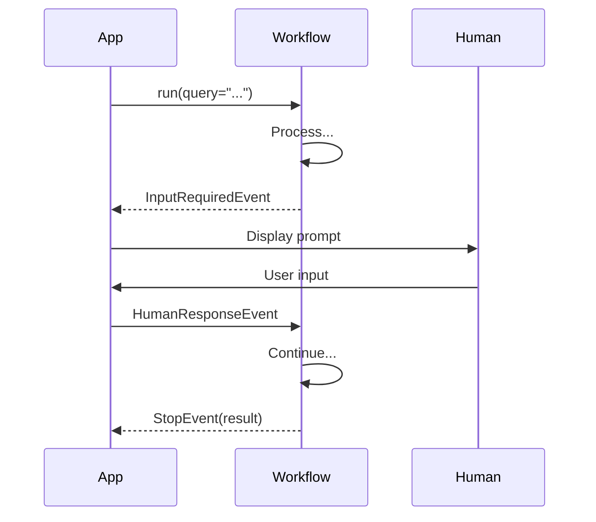
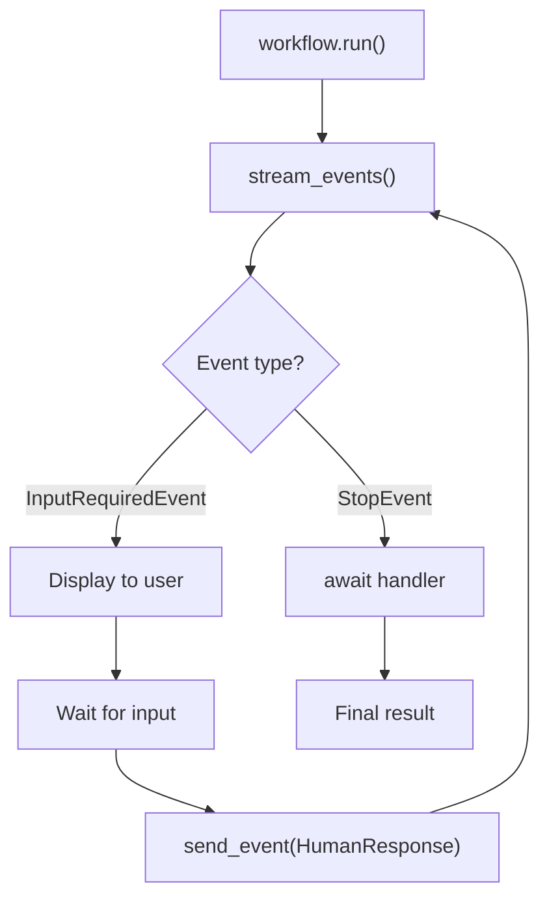

# Human-in-the-Loop

## Introduction

Many AI workflows need human intervention—reviewing generated content, approving actions, or providing additional input. LlamaIndex Workflows provide elegant primitives for pausing execution and waiting for human responses.

In this lesson, we'll master human-in-the-loop patterns using `InputRequiredEvent`, `HumanResponseEvent`, and event streaming.

### What We'll Cover

- Pausing workflows for human input
- Event streaming with `stream_events()`
- Resuming workflows with human responses
- Context serialization for long-running workflows
- Alternative `wait_for_event()` pattern

### Prerequisites

- Workflow fundamentals (Lesson 01)
- Managing state (Lesson 03)
- Python async iterators basics

---

## Human-in-the-Loop Flow



---

## Built-in Events

LlamaIndex provides pre-built events for human interaction:

```python
from llama_index.core.workflow import (
    InputRequiredEvent,
    HumanResponseEvent
)
```

| Event | Purpose |
|-------|---------|
| `InputRequiredEvent(prefix="...")` | Signal need for human input |
| `HumanResponseEvent(response="...")` | Provide human response |

---

## Basic Human-in-the-Loop Pattern

```python
from llama_index.core.workflow import (
    Workflow,
    Context,
    step,
    Event,
    StartEvent,
    StopEvent,
    InputRequiredEvent,
    HumanResponseEvent,
)


class GeneratedEvent(Event):
    draft: str


class ApprovalWorkflow(Workflow):
    """Workflow that pauses for human approval."""
    
    @step
    async def generate_draft(
        self,
        ctx: Context,
        ev: StartEvent
    ) -> GeneratedEvent:
        """Generate initial draft."""
        draft = f"Generated content for: {ev.topic}"
        return GeneratedEvent(draft=draft)
    
    @step
    async def request_approval(
        self,
        ctx: Context,
        ev: GeneratedEvent
    ) -> InputRequiredEvent:
        """Request human approval."""
        # Store draft for later
        await ctx.store.set("draft", ev.draft)
        
        # Pause workflow and request input
        return InputRequiredEvent(
            prefix=f"Please review this draft:\n{ev.draft}\n\nApprove? (yes/no): "
        )
    
    @step
    async def handle_response(
        self,
        ctx: Context,
        ev: HumanResponseEvent
    ) -> StopEvent:
        """Process human response."""
        draft = await ctx.store.get("draft")
        
        if ev.response.lower() == "yes":
            return StopEvent(result={
                "status": "approved",
                "content": draft
            })
        else:
            return StopEvent(result={
                "status": "rejected",
                "content": None
            })
```

---

## Streaming Events

Use `stream_events()` to receive events as they're emitted:

```python
async def run_with_streaming():
    workflow = ApprovalWorkflow(timeout=300)
    
    # Start workflow
    handler = workflow.run(topic="AI safety")
    
    # Stream events
    async for event in handler.stream_events():
        if isinstance(event, InputRequiredEvent):
            # Display prompt to user
            print(event.prefix)
            
            # Get human input
            user_input = input()  # Or from UI, etc.
            
            # Send response back
            handler.ctx.send_event(
                HumanResponseEvent(response=user_input)
            )
    
    # Get final result
    result = await handler
    print(f"Result: {result}")
```

### Stream Events Flow



---

## Multiple Human Interactions

Workflows can pause multiple times:

```python
from llama_index.core.workflow import (
    Workflow, Context, step, Event, StartEvent, StopEvent,
    InputRequiredEvent, HumanResponseEvent
)


class DraftEvent(Event):
    content: str
    version: int


class ReviewNeededEvent(Event):
    content: str
    version: int


class IterativeReviewWorkflow(Workflow):
    """Workflow with multiple review cycles."""
    
    max_revisions = 3
    
    @step
    async def generate(
        self,
        ctx: Context,
        ev: StartEvent | ReviewNeededEvent
    ) -> DraftEvent:
        """Generate or revise content."""
        
        if isinstance(ev, StartEvent):
            content = f"Initial draft about {ev.topic}"
            version = 1
        else:
            content = f"Revised (v{ev.version + 1}): {ev.content}"
            version = ev.version + 1
        
        return DraftEvent(content=content, version=version)
    
    @step
    async def request_review(
        self,
        ctx: Context,
        ev: DraftEvent
    ) -> InputRequiredEvent:
        """Request human review."""
        await ctx.store.set("current_draft", ev.content)
        await ctx.store.set("current_version", ev.version)
        
        return InputRequiredEvent(
            prefix=f"Version {ev.version}:\n{ev.content}\n\n"
                   f"Enter 'approve', 'revise', or feedback: "
        )
    
    @step
    async def handle_feedback(
        self,
        ctx: Context,
        ev: HumanResponseEvent
    ) -> StopEvent | ReviewNeededEvent:
        """Process feedback and continue or finish."""
        
        content = await ctx.store.get("current_draft")
        version = await ctx.store.get("current_version")
        
        response = ev.response.lower().strip()
        
        if response == "approve":
            return StopEvent(result={
                "status": "approved",
                "content": content,
                "version": version
            })
        
        if version >= self.max_revisions:
            return StopEvent(result={
                "status": "max_revisions_reached",
                "content": content,
                "version": version
            })
        
        # Continue revision loop
        return ReviewNeededEvent(content=content, version=version)
```

---

## Context Serialization

For long-running workflows (hours or days), serialize context:

```python
import json


async def long_running_workflow():
    workflow = ApprovalWorkflow(timeout=86400)  # 24 hours
    ctx = Context(workflow)
    
    # Start workflow
    handler = workflow.run(ctx=ctx, topic="Important decision")
    
    # Process until input needed
    async for event in handler.stream_events():
        if isinstance(event, InputRequiredEvent):
            # Serialize context
            ctx_data = ctx.to_dict()
            
            # Store in database/file
            with open("workflow_state.json", "w") as f:
                json.dump({
                    "context": ctx_data,
                    "prompt": event.prefix
                }, f)
            
            print("Workflow paused. State saved.")
            return  # Exit application


async def resume_workflow():
    workflow = ApprovalWorkflow(timeout=86400)
    
    # Load saved state
    with open("workflow_state.json", "r") as f:
        saved = json.load(f)
    
    # Restore context
    ctx = Context.from_dict(workflow, saved["context"])
    
    # Get human response
    print(saved["prompt"])
    response = input()
    
    # Resume by sending response
    ctx.send_event(HumanResponseEvent(response=response))
    
    # Continue workflow
    handler = workflow.run(ctx=ctx)
    result = await handler
    
    print(f"Result: {result}")
```

---

## Alternative: `wait_for_event()`

For simpler cases, use inline waiting:

```python
from llama_index.core.workflow import Workflow, Context, step, StartEvent, StopEvent


class SimpleApprovalWorkflow(Workflow):
    
    @step
    async def process_with_approval(
        self,
        ctx: Context,
        ev: StartEvent
    ) -> StopEvent:
        """Process with inline human approval."""
        
        # Generate content
        content = f"Generated for: {ev.topic}"
        
        # Wait for approval inline
        response = await ctx.wait_for_event(
            HumanResponseEvent,
            prompt=f"Approve this? {content}\n(yes/no): "
        )
        
        if response.response.lower() == "yes":
            return StopEvent(result={"approved": True, "content": content})
        else:
            return StopEvent(result={"approved": False})
```

> **Warning:** `wait_for_event()` replays all code before the waiter when resuming. Use with caution for expensive operations.

---

## Complete Example: Document Approval Workflow

```python
from llama_index.core.workflow import (
    Workflow, Context, step, Event, StartEvent, StopEvent,
    InputRequiredEvent, HumanResponseEvent
)
from llama_index.llms.openai import OpenAI


class DocumentEvent(Event):
    content: str


class ReviewRequestEvent(Event):
    content: str
    review_type: str  # "content" or "final"


class DocumentApprovalWorkflow(Workflow):
    """Complete document approval workflow with multiple review stages."""
    
    llm = OpenAI(model="gpt-4o-mini")
    
    @step
    async def generate_document(
        self,
        ctx: Context,
        ev: StartEvent
    ) -> DocumentEvent:
        """Generate initial document."""
        
        response = await self.llm.acomplete(
            f"Write a short document about: {ev.topic}"
        )
        
        return DocumentEvent(content=str(response))
    
    @step
    async def content_review(
        self,
        ctx: Context,
        ev: DocumentEvent
    ) -> InputRequiredEvent:
        """Request content review."""
        
        await ctx.store.set("document", ev.content)
        await ctx.store.set("review_stage", "content")
        
        return InputRequiredEvent(
            prefix=f"=== CONTENT REVIEW ===\n\n"
                   f"{ev.content}\n\n"
                   f"Is the content accurate? (approve/revise/reject): "
        )
    
    @step
    async def handle_review(
        self,
        ctx: Context,
        ev: HumanResponseEvent
    ) -> InputRequiredEvent | DocumentEvent | StopEvent:
        """Handle review response."""
        
        document = await ctx.store.get("document")
        stage = await ctx.store.get("review_stage")
        response = ev.response.lower().strip()
        
        if response == "reject":
            return StopEvent(result={
                "status": "rejected",
                "stage": stage
            })
        
        if stage == "content":
            if response == "approve":
                # Move to final review
                await ctx.store.set("review_stage", "final")
                
                return InputRequiredEvent(
                    prefix=f"=== FINAL REVIEW ===\n\n"
                           f"{document}\n\n"
                           f"Final approval? (approve/reject): "
                )
            else:
                # Revise content
                return DocumentEvent(content=f"[REVISED] {document}")
        
        elif stage == "final":
            if response == "approve":
                return StopEvent(result={
                    "status": "approved",
                    "document": document
                })
            else:
                return StopEvent(result={
                    "status": "rejected",
                    "stage": "final"
                })


async def main():
    workflow = DocumentApprovalWorkflow(timeout=300)
    
    handler = workflow.run(topic="AI ethics principles")
    
    async for event in handler.stream_events():
        if isinstance(event, InputRequiredEvent):
            print(event.prefix)
            response = input("> ")
            handler.ctx.send_event(HumanResponseEvent(response=response))
    
    result = await handler
    print(f"\n=== RESULT ===")
    print(f"Status: {result['status']}")
    if result['status'] == 'approved':
        print(f"Document: {result['document']}")


if __name__ == "__main__":
    import asyncio
    asyncio.run(main())
```

---

## Integration Patterns

### Web Application Integration

```python
from fastapi import FastAPI, WebSocket


app = FastAPI()
active_workflows = {}


@app.post("/start-workflow")
async def start_workflow(topic: str):
    workflow = ApprovalWorkflow(timeout=3600)
    ctx = Context(workflow)
    
    handler = workflow.run(ctx=ctx, topic=topic)
    
    # Store for later
    workflow_id = str(uuid.uuid4())
    active_workflows[workflow_id] = {
        "handler": handler,
        "ctx": ctx
    }
    
    # Get first event
    async for event in handler.stream_events():
        if isinstance(event, InputRequiredEvent):
            return {
                "workflow_id": workflow_id,
                "prompt": event.prefix
            }
    
    return {"workflow_id": workflow_id, "complete": True}


@app.post("/respond/{workflow_id}")
async def respond(workflow_id: str, response: str):
    data = active_workflows[workflow_id]
    
    # Send response
    data["ctx"].send_event(HumanResponseEvent(response=response))
    
    # Continue processing
    async for event in data["handler"].stream_events():
        if isinstance(event, InputRequiredEvent):
            return {"prompt": event.prefix}
    
    result = await data["handler"]
    del active_workflows[workflow_id]
    
    return {"complete": True, "result": result}
```

---

## Best Practices

| Practice | Description |
|----------|-------------|
| Clear prompts | Make `prefix` messages informative |
| Store state before pause | Save context before InputRequiredEvent |
| Timeout appropriately | Set long timeouts for human workflows |
| Serialize for persistence | Use `to_dict()` for long waits |
| Validate responses | Check human input before proceeding |

---

## Common Pitfalls

| ❌ Mistake | ✅ Solution |
|-----------|-------------|
| Short timeout | Set timeout to match expected wait time |
| Forgetting to send response | Always send `HumanResponseEvent` |
| Not streaming events | Use `stream_events()` to catch pauses |
| Losing state on restart | Serialize context before stopping |
| Blocking on input() | Use async UI integration in production |

---

## Hands-on Exercise

### Your Task

Build a code review workflow that:
1. Generates code based on a description
2. Presents code for human review
3. Allows approve, reject, or revision feedback
4. Limits to 3 revision attempts

### Requirements

1. Use `InputRequiredEvent` for review prompts
2. Handle approve/reject/revise responses
3. Track revision count in context
4. Return final status and code

### Expected Interaction

```
Generated code:
def greet(name):
    return f"Hello, {name}!"

Review (approve/revise/reject): revise

Revised code (v2):
def greet(name: str) -> str:
    return f"Hello, {name}!"

Review (approve/revise/reject): approve

Result: approved, version 2
```

<details>
<summary>💡 Hints (click to expand)</summary>

1. Track `revision_count` in context state
2. Check revision limit in feedback handler
3. Return `GenerateEvent` for revision, `StopEvent` for approve/reject
4. Include version number in prompts

</details>

<details>
<summary>✅ Solution (click to expand)</summary>

```python
from llama_index.core.workflow import (
    Workflow, Context, step, Event, StartEvent, StopEvent,
    InputRequiredEvent, HumanResponseEvent
)


class CodeEvent(Event):
    code: str
    version: int


class ReviseEvent(Event):
    feedback: str
    current_code: str
    version: int


class CodeReviewWorkflow(Workflow):
    max_revisions = 3
    
    @step
    async def generate(
        self,
        ctx: Context,
        ev: StartEvent | ReviseEvent
    ) -> CodeEvent:
        """Generate or revise code."""
        
        if isinstance(ev, StartEvent):
            # Initial generation
            code = f'''def process_{ev.task}(data):
    """Process {ev.task}."""
    result = data
    return result'''
            version = 1
        else:
            # Revision based on feedback
            code = f'''# Revised based on: {ev.feedback}
{ev.current_code}
    # Added improvements'''
            version = ev.version + 1
        
        await ctx.store.set("current_code", code)
        await ctx.store.set("version", version)
        
        return CodeEvent(code=code, version=version)
    
    @step
    async def request_review(
        self,
        ctx: Context,
        ev: CodeEvent
    ) -> InputRequiredEvent:
        """Request code review."""
        
        return InputRequiredEvent(
            prefix=f"\n{'='*40}\n"
                   f"CODE REVIEW (Version {ev.version})\n"
                   f"{'='*40}\n\n"
                   f"{ev.code}\n\n"
                   f"Enter 'approve', 'reject', or revision feedback: "
        )
    
    @step
    async def handle_feedback(
        self,
        ctx: Context,
        ev: HumanResponseEvent
    ) -> StopEvent | ReviseEvent:
        """Process review feedback."""
        
        code = await ctx.store.get("current_code")
        version = await ctx.store.get("version")
        response = ev.response.strip()
        
        if response.lower() == "approve":
            return StopEvent(result={
                "status": "approved",
                "code": code,
                "version": version
            })
        
        if response.lower() == "reject":
            return StopEvent(result={
                "status": "rejected",
                "version": version
            })
        
        # Revision requested
        if version >= self.max_revisions:
            return StopEvent(result={
                "status": "max_revisions",
                "code": code,
                "version": version,
                "message": f"Maximum {self.max_revisions} revisions reached"
            })
        
        return ReviseEvent(
            feedback=response,
            current_code=code,
            version=version
        )


async def main():
    workflow = CodeReviewWorkflow(timeout=300)
    
    handler = workflow.run(task="data")
    
    async for event in handler.stream_events():
        if isinstance(event, InputRequiredEvent):
            print(event.prefix)
            response = input("> ")
            handler.ctx.send_event(HumanResponseEvent(response=response))
    
    result = await handler
    
    print(f"\n{'='*40}")
    print(f"FINAL RESULT: {result['status']}")
    print(f"Version: {result['version']}")
    if result['status'] == 'approved':
        print(f"\nApproved Code:\n{result['code']}")


if __name__ == "__main__":
    import asyncio
    asyncio.run(main())
```

</details>

---

## Summary

✅ `InputRequiredEvent` pauses workflows for human input

✅ `HumanResponseEvent` provides the human response

✅ Use `stream_events()` to catch and handle pause events

✅ Serialize context with `to_dict()` for long-running workflows

✅ `wait_for_event()` provides simpler inline waiting

✅ Set appropriate timeouts for human interaction workflows

**Next:** [← Back to LlamaIndex Workflows Overview](./00-llamaindex-workflows-overview.md)

---

## Further Reading

- [Human in the Loop](https://developers.llamaindex.ai/python/llamaagents/workflows/human_in_the_loop/)
- [Streaming Events](https://developers.llamaindex.ai/python/llamaagents/workflows/streaming_events/)
- [Workflow Cookbook](https://developers.llamaindex.ai/python/examples/workflow/workflows_cookbook/)

---

<!-- 
Sources Consulted:
- LlamaIndex Human in the Loop: https://developers.llamaindex.ai/python/llamaagents/workflows/human_in_the_loop/
- Streaming Events: https://developers.llamaindex.ai/python/llamaagents/workflows/streaming_events/
-->
