# Production & Observability

## Module Overview

Deploying LLM applications to production requires robust observability, error handling, and operational tooling that goes far beyond traditional software monitoring. LLMs are non-deterministic—the same prompt can produce different responses—making debugging and monitoring more challenging.

This module covers the production ecosystems of LangChain (LangSmith) and LlamaIndex (LlamaCloud), framework-agnostic observability with OpenTelemetry, and essential patterns for building reliable, cost-effective AI systems.

### Why Production Observability Matters


---

## Learning Objectives

By the end of this module, you will be able to:

| Objective | Skills Gained |
|-----------|---------------|
| **LangSmith Tracing** | Set up automatic tracing, use `@traceable`, add metadata |
| **LangSmith Evaluation** | Create datasets, build evaluators, run experiments |
| **LlamaCloud Services** | Use LlamaParse for documents, LlamaExtract for structured data |
| **OpenTelemetry** | Implement vendor-neutral observability with spans and metrics |
| **Error Handling** | Build retry logic, fallbacks, and graceful degradation |
| **Cost Optimization** | Track tokens, implement caching, use semantic cache |
| **Security** | Validate inputs, sanitize outputs, implement audit logging |

---

## Prerequisites

Before starting this module, you should be comfortable with:

- LangChain/LangGraph fundamentals (Unit 8, Lessons 1-14)
- LlamaIndex basics (Unit 8, Lessons 8-15)
- Python async/await patterns
- Basic understanding of observability concepts

---

## Module Structure

| Lesson | Topic | Key Concepts |
|--------|-------|--------------|
| [01](./01-langsmith-tracing.md) | LangSmith Tracing | Environment setup, `@traceable`, metadata, projects |
| [02](./02-langsmith-evaluation.md) | LangSmith Evaluation | Datasets, evaluators, experiments, offline vs online |
| [03](./03-llamacloud-ecosystem.md) | LlamaCloud Ecosystem | LlamaParse, LlamaExtract, managed indices |
| [04](./04-opentelemetry-integration.md) | OpenTelemetry Integration | Spans, attributes, metrics, exporters |
| [05](./05-error-handling-resilience.md) | Error Handling & Resilience | Retry patterns, fallbacks, degradation |
| [06](./06-cost-optimization.md) | Cost Optimization | Token tracking, caching, semantic cache |
| [07](./07-security-best-practices.md) | Security Best Practices | Input validation, output sanitization, audit logs |

---

## Production Stack Comparison

| Feature | LangSmith | LlamaCloud | OpenTelemetry |
|---------|-----------|------------|---------------|
| **Primary Use** | LangChain/LangGraph apps | LlamaIndex apps | Any framework |
| **Tracing** | ✅ Built-in | ✅ Via instrumentation | ✅ Manual spans |
| **Evaluation** | ✅ Full suite | ⚠️ Limited | ❌ Not included |
| **Document Processing** | ❌ Not included | ✅ LlamaParse | ❌ Not included |
| **Managed RAG** | ❌ Not included | ✅ Cloud Index | ❌ Not included |
| **Vendor Lock-in** | High | High | None |
| **Self-hosted Option** | Enterprise | ❌ | ✅ |

---

## Quick Start Pattern

Here's the minimal production setup for a LangChain application:

```python
import os
from langsmith import traceable
from langchain_openai import ChatOpenAI
from tenacity import retry, stop_after_attempt, wait_exponential

# 1. Environment setup for tracing
os.environ["LANGSMITH_TRACING"] = "true"
os.environ["LANGSMITH_API_KEY"] = "your-key"
os.environ["LANGSMITH_PROJECT"] = "my-production-app"

# 2. Initialize LLM
llm = ChatOpenAI(model="gpt-4o-mini")

# 3. Add retry logic
@retry(
    stop=stop_after_attempt(3),
    wait=wait_exponential(multiplier=1, min=4, max=60)
)
@traceable(run_type="chain")
async def production_query(query: str) -> str:
    """Production-ready query with tracing and retry."""
    response = await llm.ainvoke(query)
    return response.content


# 4. Usage
async def main():
    result = await production_query("What is AI?")
    print(result)
```

---

## Key Packages

```bash
# LangSmith (tracing & evaluation)
pip install langsmith langchain-openai

# LlamaCloud (document processing)
pip install llama-cloud llama-index

# OpenTelemetry (framework-agnostic)
pip install opentelemetry-api opentelemetry-sdk opentelemetry-exporter-otlp

# Resilience
pip install tenacity

# Security
pip install pydantic-settings structlog
```

---

## Learning Path

```mermaid
flowchart TD
    Start["Start Here"]
    
    subgraph Foundation["Foundation"]
        L1["01: LangSmith Tracing"]
        L2["02: LangSmith Evaluation"]
    end
    
    subgraph Ecosystem["Ecosystem"]
        L3["03: LlamaCloud"]
        L4["04: OpenTelemetry"]
    end
    
    subgraph Production["Production Hardening"]
        L5["05: Error Handling"]
        L6["06: Cost Optimization"]
        L7["07: Security"]
    end
    
    Complete["Production Ready! 🚀"]
    
    Start --> L1
    L1 --> L2
    L2 --> L3
    L3 --> L4
    L4 --> L5
    L5 --> L6
    L6 --> L7
    L7 --> Complete
```



---

## What You'll Build

By completing this module, you'll have the skills to:

1. **Debug production issues** with comprehensive tracing
2. **Measure quality** with offline and online evaluations
3. **Process documents** at scale with LlamaParse
4. **Monitor any framework** with OpenTelemetry
5. **Handle failures gracefully** with retry and fallback patterns
6. **Optimize costs** with intelligent caching
7. **Secure your application** with validation and audit logging

---

**Let's begin:** [LangSmith Tracing →](./01-langsmith-tracing.md)

---

## Further Reading

- [LangSmith Documentation](https://docs.langchain.com/langsmith/)
- [LlamaCloud Documentation](https://developers.llamaindex.ai/python/cloud/)
- [OpenTelemetry Python](https://opentelemetry.io/docs/languages/python/)
- [Tenacity Documentation](https://tenacity.readthedocs.io/)

---

*This is the final lesson of Unit 8: LangChain & LlamaIndex Mastery*

*Estimated module study time: 5-7 hours*
