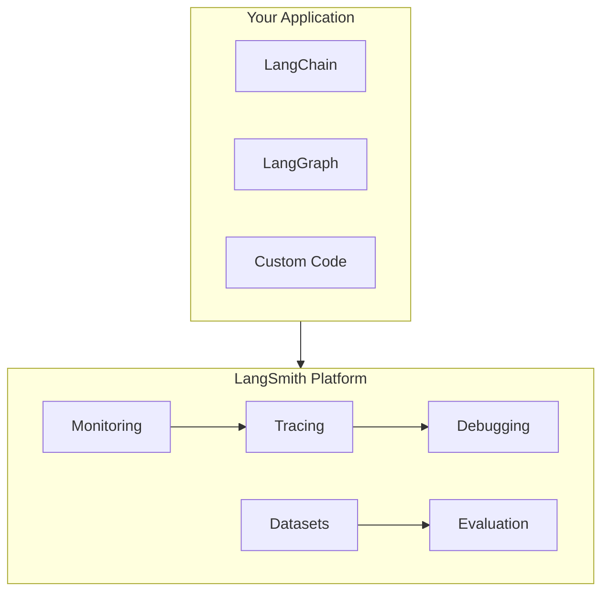
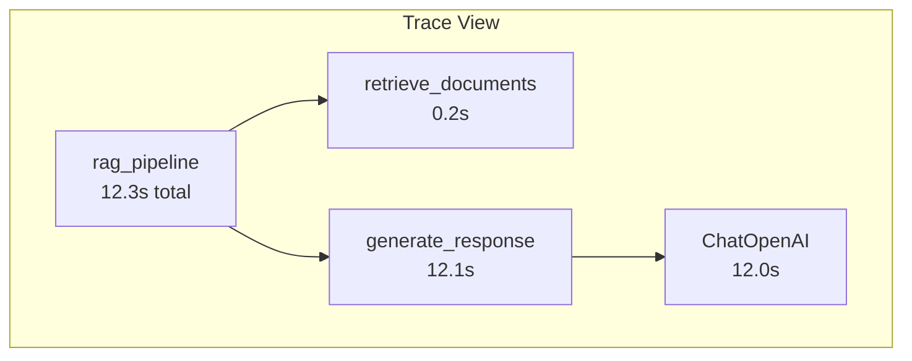

# LangSmith Tracing

## Introduction

LLMs are non-deterministic—the same prompt can produce different responses. This makes debugging and monitoring significantly more challenging than traditional software. LangSmith addresses this by providing end-to-end visibility into how your application handles each request.

In this lesson, we'll set up LangSmith tracing for LangChain and LangGraph applications, enabling you to inspect, debug, and understand every step of your AI pipeline.

### What We'll Cover

- Setting up LangSmith environment
- Automatic tracing with environment variables
- The `@traceable` decorator
- Wrapping OpenAI clients
- Adding metadata and tags
- Tracing LangGraph agents

### Prerequisites

- LangSmith account ([smith.langchain.com](https://smith.langchain.com))
- LangChain/LangGraph fundamentals (Lessons 1-14)
- OpenAI API key

---

## What is LangSmith?

LangSmith is LangChain's platform for LLM application observability:



| Feature | Description |
|---------|-------------|
| **Tracing** | Visualize every step of agent execution |
| **Evaluation** | Test and benchmark LLM applications |
| **Monitoring** | Track production performance |
| **Debugging** | Understand failures and edge cases |
| **Datasets** | Manage test cases and examples |

---

## Setting Up LangSmith

### 1. Get Your API Key

1. Sign up at [smith.langchain.com](https://smith.langchain.com)
2. Navigate to Settings → API Keys
3. Create a new API key

### 2. Install Dependencies

```bash
pip install langsmith langchain langchain-openai
```

### 3. Set Environment Variables

```bash
export LANGSMITH_TRACING=true
export LANGSMITH_API_KEY="your-langsmith-api-key"
export LANGSMITH_PROJECT="my-production-app"
export OPENAI_API_KEY="your-openai-api-key"
```

> **Note:** Set `LANGSMITH_PROJECT` to organize traces by project. If not set, traces go to a default project.

---

## Automatic Tracing

Once environment variables are set, LangChain/LangGraph code is traced automatically:

```python
import os

# Enable tracing
os.environ["LANGSMITH_TRACING"] = "true"
os.environ["LANGSMITH_API_KEY"] = "your-key"
os.environ["LANGSMITH_PROJECT"] = "my-app"

from langchain_openai import ChatOpenAI

# This call is automatically traced!
llm = ChatOpenAI(model="gpt-4o-mini")
response = llm.invoke("What is the capital of France?")
print(response.content)
```

**Output:**
```
Paris is the capital of France.
```

View this trace in the LangSmith UI under your project.

---

## Wrapping OpenAI Clients

For direct OpenAI SDK usage, wrap the client:

```python
from openai import OpenAI
from langsmith.wrappers import wrap_openai

# Wrap the client for automatic tracing
client = wrap_openai(OpenAI())

# All calls are now traced
response = client.chat.completions.create(
    model="gpt-4o-mini",
    messages=[
        {"role": "system", "content": "You are a helpful assistant."},
        {"role": "user", "content": "What is AI?"}
    ]
)

print(response.choices[0].message.content)
```

---

## The @traceable Decorator

Use `@traceable` to trace custom functions:

```python
from langsmith import traceable
from langchain_openai import ChatOpenAI


@traceable(run_type="chain")
def retrieve_documents(query: str) -> list[str]:
    """Retrieve relevant documents."""
    # Simulated retrieval
    return [
        "AI is artificial intelligence.",
        "Machine learning is a subset of AI."
    ]


@traceable(run_type="chain")
def generate_response(query: str, context: list[str]) -> str:
    """Generate response using retrieved context."""
    llm = ChatOpenAI(model="gpt-4o-mini")
    
    system_prompt = f"Answer using this context:\n{chr(10).join(context)}"
    
    response = llm.invoke([
        {"role": "system", "content": system_prompt},
        {"role": "user", "content": query}
    ])
    
    return response.content


@traceable(run_type="chain")
def rag_pipeline(query: str) -> str:
    """Complete RAG pipeline - traced as parent."""
    docs = retrieve_documents(query)
    response = generate_response(query, docs)
    return response


# Run the pipeline
result = rag_pipeline("What is machine learning?")
print(result)
```

### Run Types

| Run Type | Use Case |
|----------|----------|
| `chain` | General pipeline/chain operations |
| `llm` | LLM calls |
| `retriever` | Document retrieval |
| `tool` | Tool/function calls |
| `embedding` | Embedding operations |

---

## Adding Metadata and Tags

Enrich traces with contextual information:

```python
from langsmith import traceable, trace


@traceable(
    run_type="chain",
    tags=["production", "rag"],
    metadata={"version": "1.0", "model": "gpt-4o-mini"}
)
def production_query(query: str, user_id: str) -> str:
    """Query with static metadata."""
    llm = ChatOpenAI(model="gpt-4o-mini")
    return llm.invoke(query).content


# Or add dynamic metadata with trace context
def query_with_context(query: str, user_id: str, session_id: str) -> str:
    """Query with dynamic metadata."""
    with trace("user-query", project_name="my-app") as t:
        # Add dynamic metadata
        t.metadata = {
            "user_id": user_id,
            "session_id": session_id,
            "timestamp": "2025-02-04T10:00:00Z"
        }
        
        llm = ChatOpenAI(model="gpt-4o-mini")
        response = llm.invoke(query)
        
        return response.content
```

---

## Tracing LangGraph Agents

LangGraph agents are automatically traced, but you can add custom tracing:

```python
from typing import TypedDict, Annotated
from langgraph.graph import StateGraph, START, END
from langchain_openai import ChatOpenAI
from langsmith import traceable


class AgentState(TypedDict):
    messages: list
    result: str


@traceable(run_type="chain")
def analyze_query(query: str) -> dict:
    """Custom traced function for query analysis."""
    return {
        "intent": "question",
        "entities": ["AI", "machine learning"],
        "complexity": "simple"
    }


def agent_node(state: AgentState) -> AgentState:
    """Agent node - automatically traced by LangGraph."""
    llm = ChatOpenAI(model="gpt-4o-mini")
    
    # Call custom traced function
    analysis = analyze_query(state["messages"][-1]["content"])
    
    response = llm.invoke(state["messages"])
    
    return {
        "messages": state["messages"] + [{"role": "assistant", "content": response.content}],
        "result": response.content
    }


# Build graph
workflow = StateGraph(AgentState)
workflow.add_node("agent", agent_node)
workflow.add_edge(START, "agent")
workflow.add_edge("agent", END)

app = workflow.compile()

# Run - fully traced
result = app.invoke({
    "messages": [{"role": "user", "content": "Explain neural networks"}],
    "result": ""
})
```

---

## Viewing Traces in LangSmith

Navigate to your project in the LangSmith UI:



Each trace shows:

| Element | Information |
|---------|-------------|
| **Inputs** | What was passed to the function |
| **Outputs** | What was returned |
| **Duration** | Time taken |
| **Tokens** | Token usage (for LLM calls) |
| **Errors** | Exception details if failed |
| **Metadata** | Custom tags and metadata |

---

## Production Tracing Patterns

### Tracing Async Functions

```python
from langsmith import traceable


@traceable(run_type="chain")
async def async_query(query: str) -> str:
    """Async functions are traced the same way."""
    llm = ChatOpenAI(model="gpt-4o-mini")
    response = await llm.ainvoke(query)
    return response.content
```

### Conditional Tracing

```python
import os
from langsmith import traceable

# Only trace in production
if os.getenv("ENVIRONMENT") == "production":
    os.environ["LANGSMITH_TRACING"] = "true"


@traceable(run_type="chain")
def my_function():
    # Traced only when LANGSMITH_TRACING=true
    pass
```

### Error Tracing

```python
from langsmith import traceable


@traceable(run_type="chain")
def risky_operation(data: str) -> str:
    """Errors are automatically captured in traces."""
    if not data:
        raise ValueError("Data cannot be empty")
    
    # Process...
    return f"Processed: {data}"


# The error will appear in LangSmith with full stack trace
try:
    result = risky_operation("")
except ValueError:
    pass  # Error is still logged to LangSmith
```

---

## Best Practices

| Practice | Description |
|----------|-------------|
| Use meaningful names | Name traced functions descriptively |
| Add metadata | Include user_id, session_id, version |
| Organize by project | Use LANGSMITH_PROJECT for separation |
| Trace boundaries | Trace at logical pipeline boundaries |
| Don't over-trace | Avoid tracing trivial operations |

---

## Common Pitfalls

| ❌ Mistake | ✅ Solution |
|-----------|-------------|
| Missing env vars | Verify LANGSMITH_TRACING=true |
| Wrong API key | Check key in LangSmith settings |
| No traces appearing | Ensure code actually runs (not just imported) |
| Tracing disabled | Check for code that sets LANGSMITH_TRACING=false |
| Missing project | Set LANGSMITH_PROJECT explicitly |

---

## Hands-on Exercise

### Your Task

Build a traced RAG application that:
1. Retrieves documents (simulated)
2. Generates a response with an LLM
3. Logs metadata including user_id and query hash

### Requirements

1. Use `@traceable` on all functions
2. Add metadata with user_id and query_hash
3. Include error handling
4. View traces in LangSmith UI

<details>
<summary>💡 Hints (click to expand)</summary>

1. Use `hashlib.md5(query.encode()).hexdigest()` for query hash
2. Wrap the pipeline in a try/except
3. Add tags like `["rag", "production"]`

</details>

<details>
<summary>✅ Solution (click to expand)</summary>

```python
import os
import hashlib
from langsmith import traceable
from langchain_openai import ChatOpenAI

# Setup
os.environ["LANGSMITH_TRACING"] = "true"
os.environ["LANGSMITH_PROJECT"] = "rag-exercise"


@traceable(run_type="retriever", tags=["rag"])
def retrieve(query: str) -> list[str]:
    """Retrieve relevant documents."""
    return [
        "Python is a programming language.",
        "AI uses algorithms to make decisions."
    ]


@traceable(run_type="llm", tags=["rag"])
def generate(query: str, context: list[str]) -> str:
    """Generate response from context."""
    llm = ChatOpenAI(model="gpt-4o-mini")
    
    prompt = f"""Answer based on this context:
{chr(10).join(context)}

Question: {query}"""
    
    response = llm.invoke(prompt)
    return response.content


@traceable(
    run_type="chain",
    tags=["rag", "production"],
)
def rag_with_metadata(query: str, user_id: str) -> dict:
    """RAG pipeline with full metadata."""
    query_hash = hashlib.md5(query.encode()).hexdigest()
    
    try:
        docs = retrieve(query)
        response = generate(query, docs)
        
        return {
            "success": True,
            "response": response,
            "metadata": {
                "user_id": user_id,
                "query_hash": query_hash,
                "doc_count": len(docs)
            }
        }
    except Exception as e:
        return {
            "success": False,
            "error": str(e),
            "metadata": {
                "user_id": user_id,
                "query_hash": query_hash
            }
        }


# Run
result = rag_with_metadata(
    query="What is Python?",
    user_id="user-123"
)

print(f"Success: {result['success']}")
print(f"Response: {result.get('response', result.get('error'))}")
```

</details>

---

## Summary

✅ Set `LANGSMITH_TRACING=true` and `LANGSMITH_API_KEY` for automatic tracing

✅ Use `wrap_openai()` for direct OpenAI SDK calls

✅ Decorate functions with `@traceable(run_type="...")` for custom tracing

✅ Add metadata and tags for better organization and debugging

✅ LangGraph agents are automatically traced

✅ View traces in the LangSmith UI for debugging and optimization

**Next:** [LangSmith Evaluation →](./02-langsmith-evaluation.md)

---

## Further Reading

- [LangSmith Tracing Quickstart](https://docs.langchain.com/langsmith/observability-quickstart)
- [Tracing with LangGraph](https://docs.langchain.com/langsmith/trace-with-langgraph)
- [LangSmith Observability Concepts](https://docs.langchain.com/langsmith/observability-concepts)

---

<!-- 
Sources Consulted:
- LangSmith Tracing Quickstart: https://docs.langchain.com/langsmith/observability-quickstart
- LangSmith Observability: https://docs.langchain.com/langsmith/observability
-->
