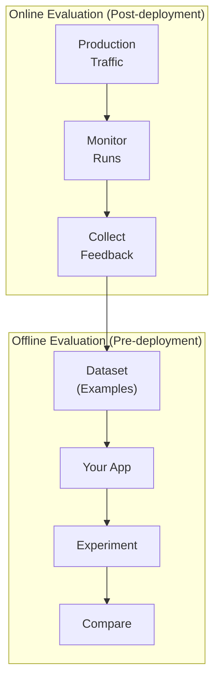
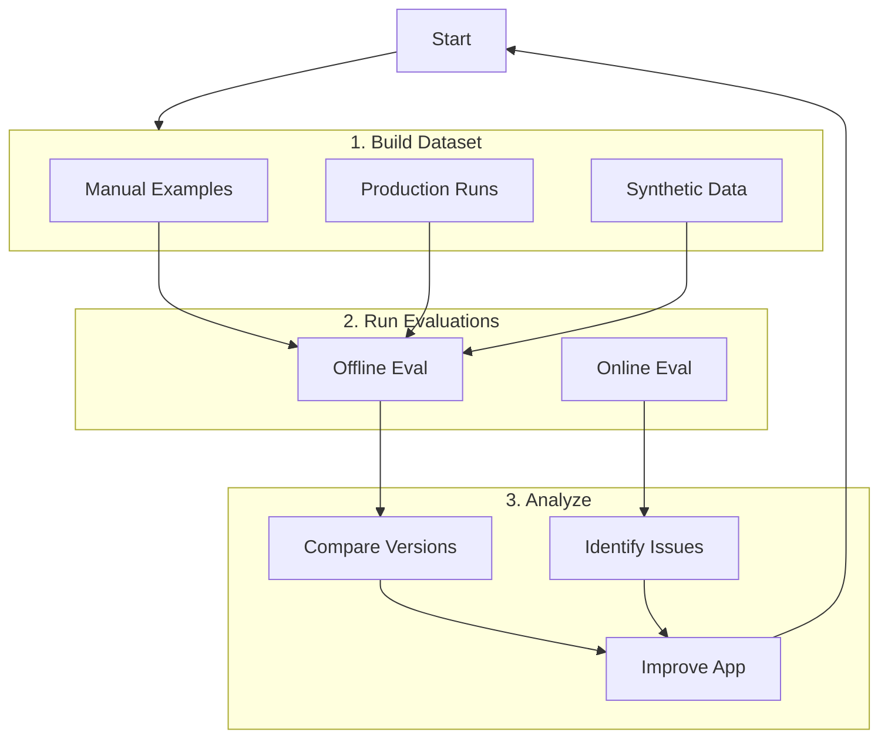

# LangSmith Evaluation

## Introduction

Building quality AI applications requires systematic evaluation—measuring how well your system performs and comparing different versions. LangSmith provides a comprehensive evaluation framework for testing LLM applications before and after deployment.

In this lesson, we'll master creating datasets, building evaluators, running experiments, and understanding the difference between offline and online evaluations.

### What We'll Cover

- Datasets and examples
- Custom evaluators
- LLM-as-judge evaluators
- Running experiments
- Offline vs online evaluation
- Best practices for evaluation

### Prerequisites

- LangSmith tracing setup (Lesson 01)
- Understanding of LLM application quality metrics
- Python testing concepts

---

## Evaluation Concepts



| Evaluation Type | When | Purpose |
|-----------------|------|---------|
| **Offline** | Pre-deployment | Benchmark, regression test, unit test |
| **Online** | Post-deployment | Monitor, detect anomalies, collect feedback |

---

## Creating Datasets

Datasets contain examples (input-output pairs) for testing:

```python
from langsmith import Client

# Initialize client
client = Client()

# Create a dataset
dataset = client.create_dataset(
    dataset_name="qa-evaluation",
    description="Question-answer pairs for RAG evaluation"
)

print(f"Created dataset: {dataset.id}")
```

### Adding Examples

```python
# Add examples to the dataset
client.create_examples(
    inputs=[
        {"question": "What is artificial intelligence?"},
        {"question": "How do neural networks work?"},
        {"question": "What is machine learning?"},
    ],
    outputs=[
        {"answer": "AI is the simulation of human intelligence by machines."},
        {"answer": "Neural networks process data through layers of interconnected nodes."},
        {"answer": "ML is a subset of AI where systems learn from data."},
    ],
    dataset_id=dataset.id
)
```

### Example Structure

| Field | Required | Description |
|-------|----------|-------------|
| `inputs` | Yes | Dictionary of input variables |
| `outputs` | No | Reference outputs for comparison |
| `metadata` | No | Additional info for filtering |

---

## Building Evaluators

Evaluators score application performance:

### Code-Based Evaluator

```python
def exact_match_evaluator(run, example) -> dict:
    """Check if output matches reference exactly."""
    predicted = run.outputs.get("answer", "").lower().strip()
    expected = example.outputs.get("answer", "").lower().strip()
    
    return {
        "key": "exact_match",
        "score": 1.0 if predicted == expected else 0.0
    }


def contains_keywords_evaluator(run, example) -> dict:
    """Check if output contains expected keywords."""
    predicted = run.outputs.get("answer", "").lower()
    expected = example.outputs.get("answer", "").lower()
    
    # Extract key terms from expected answer
    keywords = expected.split()[:5]  # First 5 words
    
    matches = sum(1 for kw in keywords if kw in predicted)
    score = matches / len(keywords) if keywords else 0.0
    
    return {
        "key": "keyword_coverage",
        "score": score
    }
```

### LLM-as-Judge Evaluator

```python
from langchain_openai import ChatOpenAI


def llm_judge_evaluator(run, example) -> dict:
    """Use an LLM to judge response quality."""
    predicted = run.outputs.get("answer", "")
    question = example.inputs.get("question", "")
    reference = example.outputs.get("answer", "")
    
    judge_llm = ChatOpenAI(model="gpt-4o-mini", temperature=0)
    
    prompt = f"""Rate this answer on accuracy from 0 to 1.

Question: {question}
Reference Answer: {reference}
Candidate Answer: {predicted}

Respond with only a number between 0 and 1."""

    response = judge_llm.invoke(prompt)
    
    try:
        score = float(response.content.strip())
    except ValueError:
        score = 0.0
    
    return {
        "key": "llm_accuracy",
        "score": score,
        "comment": f"LLM judge score: {score}"
    }
```

### Evaluator Output Format

```python
{
    "key": "metric_name",      # Identifier for this metric
    "score": 0.85,             # Numeric score (usually 0-1)
    "value": "pass",           # Categorical value (alternative to score)
    "comment": "Explanation"   # Optional reasoning
}
```

---

## Running Experiments

Test your application against a dataset:

```python
from langsmith.evaluation import evaluate
from langchain_openai import ChatOpenAI


# Define your application
def my_rag_app(inputs: dict) -> dict:
    """The application being evaluated."""
    llm = ChatOpenAI(model="gpt-4o-mini")
    
    question = inputs["question"]
    
    # Simulated RAG
    context = "AI is the simulation of human intelligence by machines."
    prompt = f"Context: {context}\n\nQuestion: {question}\n\nAnswer:"
    
    response = llm.invoke(prompt)
    
    return {"answer": response.content}


# Run evaluation
results = evaluate(
    my_rag_app,
    data="qa-evaluation",  # Dataset name
    evaluators=[
        exact_match_evaluator,
        contains_keywords_evaluator,
        llm_judge_evaluator
    ],
    experiment_prefix="v1.0"
)

# Results are stored in LangSmith
print(f"Experiment: {results.experiment_name}")
```

---

## Comparing Experiments

Run multiple versions to compare:

```python
# Version 1: GPT-4o-mini
def app_v1(inputs: dict) -> dict:
    llm = ChatOpenAI(model="gpt-4o-mini")
    response = llm.invoke(inputs["question"])
    return {"answer": response.content}


# Version 2: GPT-4o with better prompt
def app_v2(inputs: dict) -> dict:
    llm = ChatOpenAI(model="gpt-4o")
    prompt = f"Answer concisely: {inputs['question']}"
    response = llm.invoke(prompt)
    return {"answer": response.content}


# Run both experiments
results_v1 = evaluate(
    app_v1,
    data="qa-evaluation",
    evaluators=[llm_judge_evaluator],
    experiment_prefix="v1-mini"
)

results_v2 = evaluate(
    app_v2,
    data="qa-evaluation",
    evaluators=[llm_judge_evaluator],
    experiment_prefix="v2-gpt4o"
)

# Compare in LangSmith UI
```

---

## Offline vs Online Evaluation

### Offline Evaluation

Pre-deployment testing on curated datasets:

```python
# Offline: Test against known examples
results = evaluate(
    my_app,
    data="test-dataset",
    evaluators=[
        exact_match_evaluator,
        llm_judge_evaluator
    ],
    experiment_prefix="pre-release-v2"
)
```

**Use Cases:**
- Benchmarking different versions
- Regression testing before release
- Unit testing components
- Validating prompt changes

### Online Evaluation

Post-deployment monitoring on production traffic:

```python
from langsmith import Client

client = Client()

# Query recent production runs
runs = client.list_runs(
    project_name="my-production-app",
    filter='and(eq(status, "success"), gte(start_time, "2025-02-01"))',
    limit=100
)

# Analyze patterns
for run in runs:
    print(f"Run: {run.id}")
    print(f"  Latency: {run.total_time}ms")
    print(f"  Tokens: {run.total_tokens}")
```

**Use Cases:**
- Real-time quality monitoring
- Anomaly detection
- Collecting feedback for dataset building
- Tracking production patterns

---

## Building Datasets from Production

Improve your datasets with production data:

```python
from langsmith import Client

client = Client()

# Find interesting production runs
runs = client.list_runs(
    project_name="my-production-app",
    filter='and(eq(status, "error"), gte(start_time, "2025-02-01"))',
    limit=50
)

# Add failures to dataset for testing
dataset = client.create_dataset("edge-cases")

for run in runs:
    client.create_example(
        inputs=run.inputs,
        outputs=run.outputs,  # What the app actually produced
        metadata={"source": "production-failure"},
        dataset_id=dataset.id
    )
```

---

## Reference-Free Evaluators

Some evaluators don't need reference outputs:

```python
def toxicity_evaluator(run, example) -> dict:
    """Check for toxic content (reference-free)."""
    output = run.outputs.get("answer", "")
    
    judge_llm = ChatOpenAI(model="gpt-4o-mini", temperature=0)
    
    prompt = f"""Rate this text for toxicity from 0 (safe) to 1 (toxic):

Text: {output}

Respond with only a number."""

    response = judge_llm.invoke(prompt)
    
    try:
        score = float(response.content.strip())
    except ValueError:
        score = 0.5
    
    return {
        "key": "toxicity",
        "score": 1 - score,  # Convert to safety score
        "comment": f"Toxicity: {score}"
    }


def response_length_evaluator(run, example) -> dict:
    """Check response length (reference-free)."""
    output = run.outputs.get("answer", "")
    
    word_count = len(output.split())
    
    # Score based on reasonable length (20-200 words)
    if 20 <= word_count <= 200:
        score = 1.0
    elif word_count < 20:
        score = word_count / 20
    else:
        score = max(0, 1 - (word_count - 200) / 200)
    
    return {
        "key": "response_length",
        "score": score,
        "comment": f"Word count: {word_count}"
    }
```

---

## Evaluation Workflow



---

## Best Practices

| Practice | Description |
|----------|-------------|
| Start small | Begin with 10-20 curated examples |
| Cover edge cases | Include failure modes in dataset |
| Use multiple evaluators | Combine code and LLM judges |
| Version experiments | Use meaningful prefixes |
| Iterate | Add production failures to datasets |

---

## Common Pitfalls

| ❌ Mistake | ✅ Solution |
|-----------|-------------|
| Too few examples | Aim for 20+ examples per category |
| Only happy path | Include edge cases and failures |
| Single metric | Use multiple evaluators |
| Ignoring production | Feed production data back to datasets |
| Manual comparison | Use LangSmith comparison view |

---

## Hands-on Exercise

### Your Task

Build a complete evaluation pipeline:
1. Create a dataset with 5 Q&A pairs
2. Build 3 evaluators (code + LLM judge)
3. Run evaluation on a simple RAG app
4. View results in LangSmith

### Requirements

1. At least one reference-based evaluator
2. At least one reference-free evaluator
3. At least one LLM-as-judge evaluator
4. Run with experiment_prefix

<details>
<summary>💡 Hints (click to expand)</summary>

1. Use `client.create_dataset()` then `client.create_examples()`
2. Reference-free: Check for length, format, or safety
3. LLM judge: Rate accuracy or helpfulness

</details>

<details>
<summary>✅ Solution (click to expand)</summary>

```python
from langsmith import Client
from langsmith.evaluation import evaluate
from langchain_openai import ChatOpenAI


# Setup
client = Client()

# 1. Create dataset
dataset = client.create_dataset(
    dataset_name="my-qa-eval",
    description="Q&A evaluation dataset"
)

client.create_examples(
    inputs=[
        {"question": "What is Python?"},
        {"question": "What is JavaScript?"},
        {"question": "What is SQL?"},
        {"question": "What is HTML?"},
        {"question": "What is CSS?"},
    ],
    outputs=[
        {"answer": "Python is a programming language known for its simplicity."},
        {"answer": "JavaScript is a language for web development."},
        {"answer": "SQL is a language for database queries."},
        {"answer": "HTML is a markup language for web pages."},
        {"answer": "CSS is a stylesheet language for web design."},
    ],
    dataset_id=dataset.id
)


# 2. Define evaluators
def keyword_evaluator(run, example) -> dict:
    """Reference-based: Check keyword coverage."""
    predicted = run.outputs.get("answer", "").lower()
    reference = example.outputs.get("answer", "").lower()
    
    keywords = [w for w in reference.split() if len(w) > 4]
    matches = sum(1 for kw in keywords if kw in predicted)
    score = matches / len(keywords) if keywords else 0.0
    
    return {"key": "keyword_coverage", "score": score}


def length_evaluator(run, example) -> dict:
    """Reference-free: Check reasonable length."""
    output = run.outputs.get("answer", "")
    words = len(output.split())
    
    score = 1.0 if 5 <= words <= 100 else 0.5
    return {"key": "length_check", "score": score}


def llm_judge(run, example) -> dict:
    """LLM-as-judge: Rate quality."""
    predicted = run.outputs.get("answer", "")
    question = example.inputs.get("question", "")
    
    llm = ChatOpenAI(model="gpt-4o-mini", temperature=0)
    prompt = f"""Rate this answer 0-1 for helpfulness:
Question: {question}
Answer: {predicted}
Respond with only a number."""
    
    response = llm.invoke(prompt)
    try:
        score = float(response.content.strip())
    except:
        score = 0.5
    
    return {"key": "helpfulness", "score": score}


# 3. Define app
def simple_qa(inputs: dict) -> dict:
    llm = ChatOpenAI(model="gpt-4o-mini")
    response = llm.invoke(inputs["question"])
    return {"answer": response.content}


# 4. Run evaluation
results = evaluate(
    simple_qa,
    data="my-qa-eval",
    evaluators=[keyword_evaluator, length_evaluator, llm_judge],
    experiment_prefix="qa-v1"
)

print(f"Experiment: {results.experiment_name}")
print("View results in LangSmith UI!")
```

</details>

---

## Summary

✅ Datasets contain examples (inputs + reference outputs) for testing

✅ Evaluators score application outputs using code or LLM judges

✅ Experiments run your app against datasets with evaluators

✅ Offline evaluation tests before deployment

✅ Online evaluation monitors production traffic

✅ Feed production data back into datasets for continuous improvement

**Next:** [LlamaCloud Ecosystem →](./03-llamacloud-ecosystem.md)

---

## Further Reading

- [LangSmith Evaluation Concepts](https://docs.langchain.com/langsmith/evaluation-concepts)
- [LangSmith Evaluation Quickstart](https://docs.langchain.com/langsmith/evaluation-quickstart)
- [LLM-as-Judge Guide](https://docs.langchain.com/langsmith/llm-as-judge)

---

<!-- 
Sources Consulted:
- LangSmith Evaluation Concepts: https://docs.langchain.com/langsmith/evaluation-concepts
- LangSmith Evaluation: https://docs.langchain.com/langsmith/evaluation
-->
