# LlamaCloud Ecosystem

## Introduction

LlamaCloud is LlamaIndex's hosted service for document processing and search, designed to handle complex documents that traditional tools struggle with. From financial reports to research papers, LlamaCloud transforms messy files into LLM-ready structured data.

In this lesson, we'll explore the LlamaCloud ecosystem: LlamaParse for document parsing, LlamaExtract for structured extraction, and managed indices for serverless RAG.

### What We'll Cover

- LlamaParse for document processing
- LlamaExtract for schema-based extraction
- LlamaCloud managed indices
- Document classification and splitting
- Best practices for production document pipelines

### Prerequisites

- LlamaCloud account ([cloud.llamaindex.ai](https://cloud.llamaindex.ai))
- LlamaIndex fundamentals (Lessons 8-15)
- Understanding of document processing needs

---

## LlamaCloud Components


| Component | Purpose | Output |
|-----------|---------|--------|
| **LlamaParse** | Document parsing | Markdown, text, JSON |
| **LlamaExtract** | Structured extraction | Typed Pydantic objects |
| **Cloud Index** | Managed RAG | Query responses |
| **LlamaClassify** | Document categorization | Labels |

---

## Getting Started

### 1. Get Your API Key

1. Sign up at [cloud.llamaindex.ai](https://cloud.llamaindex.ai)
2. Navigate to API Keys
3. Create a new key

### 2. Install Dependencies

```bash
pip install llama-cloud llama-index
```

### 3. Set Environment Variables

```bash
export LLAMA_CLOUD_API_KEY="your-api-key"
```

---

## LlamaParse

LlamaParse transforms complex documents into LLM-ready formats with high fidelity:

### Basic Usage

```python
from llama_cloud import LlamaParse

# Initialize parser
parser = LlamaParse(
    api_key="your-api-key",  # Or use LLAMA_CLOUD_API_KEY env var
    result_type="markdown"    # "markdown", "text", or "json"
)

# Parse a single document
documents = parser.load_data("financial_report.pdf")

for doc in documents:
    print(doc.text[:500])  # First 500 chars
    print(f"Metadata: {doc.metadata}")
```

### Parsing Tiers

| Tier | Best For | Features |
|------|----------|----------|
| **Cost Effective** | Text-heavy documents | Fast, economical |
| **Agentic** | Documents with images/diagrams | Better visual handling |
| **Agentic Plus** | Complex layouts, tables | Maximum fidelity |
| **Fast** | Spatial text only | Quickest processing |

### Custom Parsing Instructions

```python
from llama_cloud import LlamaParse

parser = LlamaParse(
    api_key="your-api-key",
    result_type="markdown",
    parsing_instruction="""
    Extract all tables and preserve their structure.
    Include figure captions.
    Convert mathematical equations to LaTeX.
    """
)

documents = parser.load_data("research_paper.pdf")
```

### Batch Processing

```python
from llama_cloud import LlamaParse

parser = LlamaParse(
    api_key="your-api-key",
    result_type="markdown"
)

# Process multiple files
files = [
    "report_q1.pdf",
    "report_q2.pdf",
    "presentation.pptx",
    "spreadsheet.xlsx"
]

documents = parser.load_data(files)

print(f"Parsed {len(documents)} documents")

for doc in documents:
    print(f"- {doc.metadata.get('file_name')}: {len(doc.text)} chars")
```

### Supported File Types

| Category | Extensions |
|----------|------------|
| Documents | PDF, DOCX, DOC, TXT, RTF |
| Presentations | PPTX, PPT |
| Spreadsheets | XLSX, XLS, CSV |
| Images | JPEG, PNG, TIFF, BMP |
| Web | HTML, EPUB |
| Code | XML, Markdown |

---

## LlamaExtract

Extract structured data from documents using Pydantic schemas:

### Define Schema

```python
from pydantic import BaseModel, Field
from typing import List


class LineItem(BaseModel):
    description: str
    quantity: int
    unit_price: float
    total: float


class InvoiceData(BaseModel):
    """Schema for invoice extraction."""
    invoice_number: str = Field(description="Invoice ID or number")
    date: str = Field(description="Invoice date")
    vendor_name: str = Field(description="Name of the vendor")
    total_amount: float = Field(description="Total invoice amount")
    line_items: List[LineItem] = Field(description="List of items")
```

### Extract Data

```python
from llama_cloud import LlamaExtract

extractor = LlamaExtract(api_key="your-api-key")

# Extract using schema
results = extractor.extract(
    documents=["invoice.pdf"],
    schema=InvoiceData
)

# Access typed results
invoice = results[0]

print(f"Invoice: {invoice.invoice_number}")
print(f"Vendor: {invoice.vendor_name}")
print(f"Total: ${invoice.total_amount}")

for item in invoice.line_items:
    print(f"  - {item.description}: {item.quantity} x ${item.unit_price}")
```

### Complex Schemas

```python
from pydantic import BaseModel, Field
from typing import List, Optional


class Author(BaseModel):
    name: str
    affiliation: Optional[str] = None


class Citation(BaseModel):
    title: str
    authors: List[str]
    year: int


class ResearchPaper(BaseModel):
    """Schema for research paper extraction."""
    title: str = Field(description="Paper title")
    authors: List[Author] = Field(description="Paper authors")
    abstract: str = Field(description="Paper abstract")
    keywords: List[str] = Field(description="Paper keywords")
    citations: List[Citation] = Field(description="Referenced papers")
    methodology: str = Field(description="Research methodology")
    findings: str = Field(description="Key findings")


# Extract
extractor = LlamaExtract(api_key="your-api-key")
papers = extractor.extract(
    documents=["paper.pdf"],
    schema=ResearchPaper
)
```

---

## LlamaCloud Managed Index

Serverless RAG without infrastructure management:

### Create Index

```python
from llama_cloud import LlamaCloudIndex

# Create a managed index
index = LlamaCloudIndex.create(
    name="production-knowledge-base",
    api_key="your-api-key",
    embedding_model="text-embedding-3-small",
    chunk_size=512
)

print(f"Created index: {index.name}")
```

### Add Documents

```python
from llama_cloud import LlamaParse, LlamaCloudIndex

# Parse documents
parser = LlamaParse(api_key="your-api-key", result_type="markdown")
documents = parser.load_data([
    "docs/guide.pdf",
    "docs/faq.pdf",
    "docs/api_reference.pdf"
])

# Get existing index
index = LlamaCloudIndex(
    name="production-knowledge-base",
    api_key="your-api-key"
)

# Add documents to index
index.add_documents(documents)

print(f"Added {len(documents)} documents to index")
```

### Query Index

```python
from llama_cloud import LlamaCloudIndex

# Connect to index
index = LlamaCloudIndex(
    name="production-knowledge-base",
    api_key="your-api-key"
)

# Query
response = index.query("How do I authenticate API requests?")

print(f"Answer: {response}")
```

### Index Features

| Feature | Description |
|---------|-------------|
| **Auto-scaling** | Handles traffic spikes automatically |
| **Managed embeddings** | No infrastructure to maintain |
| **Incremental updates** | Add documents without reindexing |
| **Version control** | Track document versions |

---

## LlamaClassify

Automatically categorize documents:

```python
from llama_cloud import LlamaClassify

classifier = LlamaClassify(api_key="your-api-key")

# Define classification rules
rules = [
    {"label": "invoice", "description": "Financial invoices and bills"},
    {"label": "contract", "description": "Legal contracts and agreements"},
    {"label": "report", "description": "Business reports and analysis"},
    {"label": "correspondence", "description": "Emails and letters"},
]

# Classify documents
results = classifier.classify(
    documents=["document1.pdf", "document2.pdf"],
    rules=rules
)

for doc, label in results:
    print(f"{doc}: {label}")
```

---

## Production Pipeline

Combine components for a complete document pipeline:

```python
from llama_cloud import LlamaParse, LlamaExtract, LlamaCloudIndex
from pydantic import BaseModel, Field
from typing import List
import os


class DocumentMetadata(BaseModel):
    title: str
    author: str
    date: str
    summary: str


async def document_pipeline(file_path: str):
    """Complete document processing pipeline."""
    
    api_key = os.getenv("LLAMA_CLOUD_API_KEY")
    
    # Step 1: Parse document
    parser = LlamaParse(
        api_key=api_key,
        result_type="markdown",
        parsing_instruction="Preserve table structure and extract figures."
    )
    
    documents = parser.load_data(file_path)
    print(f"Parsed: {len(documents)} document(s)")
    
    # Step 2: Extract metadata
    extractor = LlamaExtract(api_key=api_key)
    metadata = extractor.extract(
        documents=[file_path],
        schema=DocumentMetadata
    )
    
    print(f"Extracted metadata: {metadata[0].title}")
    
    # Step 3: Add to index
    index = LlamaCloudIndex(
        name="production-index",
        api_key=api_key
    )
    
    # Enrich documents with extracted metadata
    for doc, meta in zip(documents, metadata):
        doc.metadata.update(meta.dict())
    
    index.add_documents(documents)
    print(f"Indexed document: {metadata[0].title}")
    
    return {
        "parsed_docs": len(documents),
        "metadata": metadata[0].dict(),
        "indexed": True
    }
```

---

## LlamaParse vs Traditional Parsing

```mermaid
flowchart LR
    subgraph Traditional["Traditional OCR/PDF"]
        OCR["OCR Text"]
        Lost["❌ Lost Structure"]
        Tables["❌ Broken Tables"]
    end
    
    subgraph LlamaParse["LlamaParse"]
        AI["AI Parsing"]
        Structure["✅ Preserved Structure"]
        CleanTables["✅ Clean Tables"]
        Images["✅ Image Extraction"]
    end
    
    PDF["Complex PDF"] --> Traditional
    PDF --> LlamaParse
```



| Feature | Traditional | LlamaParse |
|---------|-------------|------------|
| Table extraction | Poor | Excellent |
| Layout preservation | None | Full |
| Image handling | Basic | Multimodal |
| Custom instructions | No | Yes |
| Output format | Text only | Markdown/JSON |

---

## Best Practices

| Practice | Description |
|----------|-------------|
| Choose right tier | Match tier to document complexity |
| Use custom instructions | Guide parsing for your use case |
| Batch similar docs | Process related files together |
| Define clear schemas | Be specific in Pydantic models |
| Monitor usage | Track API credits |

---

## Common Pitfalls

| ❌ Mistake | ✅ Solution |
|-----------|-------------|
| Wrong tier selection | Start with Agentic, upgrade if needed |
| No parsing instructions | Add context for better results |
| Overly complex schemas | Start simple, iterate |
| Ignoring metadata | Use parsed metadata for filtering |
| Not handling errors | Implement retry for transient failures |

---

## Hands-on Exercise

### Your Task

Build a document processing pipeline that:
1. Parses a PDF with LlamaParse
2. Extracts metadata using a schema
3. Adds to a managed index
4. Queries the indexed content

### Requirements

1. Define a Pydantic schema for metadata
2. Use custom parsing instructions
3. Handle errors gracefully
4. Query the indexed document

<details>
<summary>💡 Hints (click to expand)</summary>

1. Start with a simple schema (title, author, summary)
2. Use `result_type="markdown"` for clean output
3. Wrap API calls in try/except

</details>

<details>
<summary>✅ Solution (click to expand)</summary>

```python
from llama_cloud import LlamaParse, LlamaExtract, LlamaCloudIndex
from pydantic import BaseModel, Field
import os


class DocMetadata(BaseModel):
    title: str = Field(description="Document title")
    author: str = Field(description="Document author")
    summary: str = Field(description="Brief summary (2-3 sentences)")


def process_and_query(file_path: str, query: str):
    """Process document and query it."""
    
    api_key = os.getenv("LLAMA_CLOUD_API_KEY")
    
    try:
        # 1. Parse
        parser = LlamaParse(
            api_key=api_key,
            result_type="markdown",
            parsing_instruction="Extract title, author, and key points."
        )
        
        documents = parser.load_data(file_path)
        print(f"✓ Parsed {len(documents)} document(s)")
        
        # 2. Extract metadata
        extractor = LlamaExtract(api_key=api_key)
        metadata = extractor.extract(
            documents=[file_path],
            schema=DocMetadata
        )
        
        print(f"✓ Extracted: {metadata[0].title}")
        print(f"  Author: {metadata[0].author}")
        print(f"  Summary: {metadata[0].summary[:100]}...")
        
        # 3. Index
        index = LlamaCloudIndex.create(
            name="exercise-index",
            api_key=api_key,
            embedding_model="text-embedding-3-small",
            chunk_size=512
        )
        
        index.add_documents(documents)
        print(f"✓ Indexed document")
        
        # 4. Query
        response = index.query(query)
        print(f"\nQuery: {query}")
        print(f"Response: {response}")
        
        return {
            "success": True,
            "metadata": metadata[0].dict(),
            "response": str(response)
        }
        
    except Exception as e:
        print(f"✗ Error: {e}")
        return {
            "success": False,
            "error": str(e)
        }


# Usage (with a real PDF file)
# result = process_and_query("sample.pdf", "What is the main topic?")
```

</details>

---

## Summary

✅ LlamaParse transforms complex documents into LLM-ready markdown

✅ Multiple tiers (Cost Effective, Agentic, Agentic Plus) for different needs

✅ LlamaExtract provides schema-based structured extraction

✅ LlamaCloud Index offers serverless managed RAG

✅ LlamaClassify auto-categorizes documents

✅ Combine components for production document pipelines

**Next:** [OpenTelemetry Integration →](./04-opentelemetry-integration.md)

---

## Further Reading

- [LlamaCloud Documentation](https://developers.llamaindex.ai/python/cloud/)
- [LlamaParse Getting Started](https://developers.llamaindex.ai/python/cloud/llamaparse/getting_started)
- [LlamaExtract Guide](https://developers.llamaindex.ai/python/cloud/llamaextract/getting_started)

---

<!-- 
Sources Consulted:
- LlamaCloud: https://developers.llamaindex.ai/python/cloud/
- LlamaParse: https://developers.llamaindex.ai/python/cloud/llamaparse/
-->
