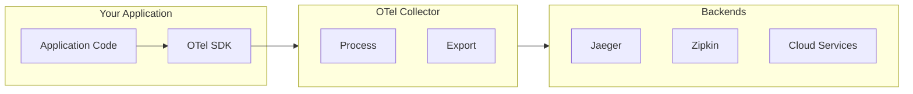
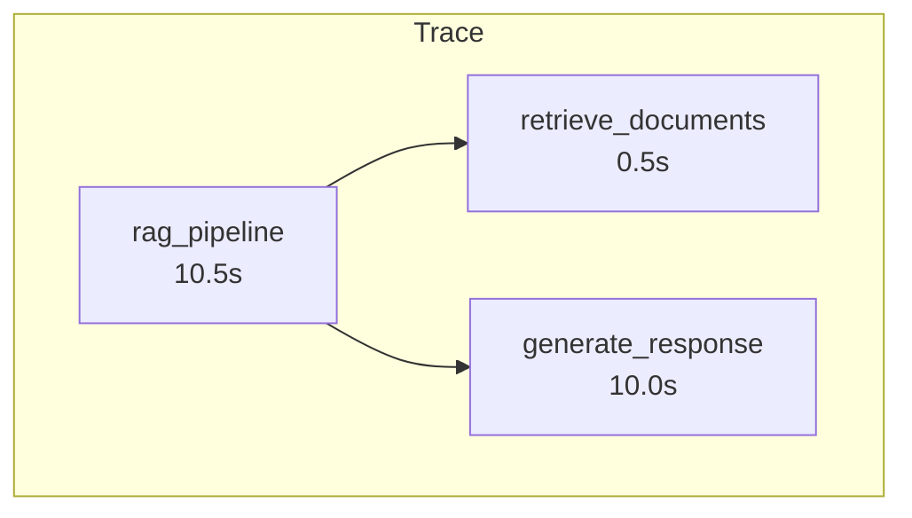

# OpenTelemetry Integration

## Introduction

While LangSmith and LlamaCloud provide excellent observability for their respective frameworks, many production systems need vendor-neutral observability that works across multiple frameworks and services. OpenTelemetry (OTel) is the industry standard for this.

In this lesson, we'll implement framework-agnostic observability using OpenTelemetry, enabling you to trace LLM applications alongside traditional services in a unified view.

### What We'll Cover

- OpenTelemetry fundamentals
- Setting up tracers and spans
- Adding attributes and events
- Instrumenting LLM calls
- Exporting to backends
- Metrics collection

### Prerequisites

- Basic understanding of observability (traces, spans, metrics)
- Python async/await patterns
- Access to an OTel-compatible backend (Jaeger, Zipkin, or cloud service)

---

## What is OpenTelemetry?

OpenTelemetry is a vendor-neutral observability framework for generating, collecting, and exporting telemetry data:



| Signal | Description |
|--------|-------------|
| **Traces** | Request flow across services |
| **Metrics** | Numerical measurements over time |
| **Logs** | Structured log records |

---

## Installation

```bash
# Core packages
pip install opentelemetry-api opentelemetry-sdk

# Exporters
pip install opentelemetry-exporter-otlp
pip install opentelemetry-exporter-jaeger  # For Jaeger

# Instrumentation helpers
pip install opentelemetry-semantic-conventions
```

---

## Setting Up a Tracer

### Basic Setup

```python
from opentelemetry import trace
from opentelemetry.sdk.trace import TracerProvider
from opentelemetry.sdk.trace.export import (
    BatchSpanProcessor,
    ConsoleSpanExporter
)

# Create provider
provider = TracerProvider()

# Add processor with exporter
processor = BatchSpanProcessor(ConsoleSpanExporter())
provider.add_span_processor(processor)

# Set as global provider
trace.set_tracer_provider(provider)

# Get a tracer
tracer = trace.get_tracer("my-llm-app")
```

### OTLP Exporter (Production)

```python
from opentelemetry import trace
from opentelemetry.sdk.trace import TracerProvider
from opentelemetry.sdk.trace.export import BatchSpanProcessor
from opentelemetry.exporter.otlp.proto.grpc.trace_exporter import OTLPSpanExporter

# Create provider
provider = TracerProvider()

# Configure OTLP exporter
exporter = OTLPSpanExporter(
    endpoint="http://otel-collector:4317",  # gRPC endpoint
    insecure=True  # Use False with TLS in production
)

processor = BatchSpanProcessor(exporter)
provider.add_span_processor(processor)

trace.set_tracer_provider(provider)
tracer = trace.get_tracer("my-llm-app")
```

---

## Creating Spans

### Basic Span

```python
from opentelemetry import trace

tracer = trace.get_tracer("my-llm-app")


def process_query(query: str) -> str:
    """Process a query with tracing."""
    with tracer.start_as_current_span("process_query") as span:
        # Your processing logic
        result = f"Processed: {query}"
        return result
```

### Nested Spans

```python
def rag_pipeline(query: str) -> str:
    """RAG pipeline with nested spans."""
    with tracer.start_as_current_span("rag_pipeline") as parent:
        
        # Retrieval span
        with tracer.start_as_current_span("retrieve_documents") as retrieval:
            docs = retrieve(query)
            retrieval.set_attribute("doc_count", len(docs))
        
        # Generation span
        with tracer.start_as_current_span("generate_response") as generation:
            response = generate(query, docs)
            generation.set_attribute("response_length", len(response))
        
        return response
```

### Span Visualization



---

## Adding Attributes

Attributes provide context about operations:

```python
from opentelemetry import trace

tracer = trace.get_tracer("my-llm-app")


async def llm_call(prompt: str, model: str = "gpt-4o-mini") -> str:
    """LLM call with detailed attributes."""
    with tracer.start_as_current_span("llm_call") as span:
        # Add attributes before the call
        span.set_attribute("llm.model", model)
        span.set_attribute("llm.prompt_length", len(prompt))
        span.set_attribute("llm.prompt_tokens_estimate", len(prompt) // 4)
        
        # Make the call
        import time
        start = time.time()
        response = await call_llm(prompt, model)
        duration = time.time() - start
        
        # Add attributes after the call
        span.set_attribute("llm.response_length", len(response))
        span.set_attribute("llm.duration_ms", duration * 1000)
        span.set_attribute("llm.success", True)
        
        return response
```

### Semantic Conventions

Use standard attribute names for consistency:

```python
from opentelemetry.semconv.trace import SpanAttributes

with tracer.start_as_current_span("http_request") as span:
    span.set_attribute(SpanAttributes.HTTP_METHOD, "POST")
    span.set_attribute(SpanAttributes.HTTP_URL, "https://api.openai.com/v1/chat/completions")
    span.set_attribute(SpanAttributes.HTTP_STATUS_CODE, 200)
```

### LLM-Specific Attributes

```python
# Common LLM attributes (custom convention)
LLM_ATTRIBUTES = {
    "llm.model": "Model name (e.g., gpt-4o)",
    "llm.provider": "Provider (e.g., openai, anthropic)",
    "llm.prompt_tokens": "Input token count",
    "llm.completion_tokens": "Output token count",
    "llm.total_tokens": "Total tokens used",
    "llm.temperature": "Temperature setting",
    "llm.max_tokens": "Max tokens setting",
}
```

---

## Adding Events

Events mark points in time within a span:

```python
with tracer.start_as_current_span("rag_pipeline") as span:
    span.add_event("Starting retrieval")
    docs = retrieve(query)
    
    span.add_event("Retrieval complete", {
        "doc_count": len(docs)
    })
    
    span.add_event("Starting generation")
    response = generate(query, docs)
    
    span.add_event("Generation complete", {
        "response_length": len(response)
    })
```

---

## Error Handling

Properly record errors in spans:

```python
from opentelemetry.trace import Status, StatusCode

with tracer.start_as_current_span("risky_operation") as span:
    try:
        result = do_something_risky()
        span.set_status(Status(StatusCode.OK))
        
    except Exception as e:
        # Record the exception
        span.record_exception(e)
        span.set_status(Status(StatusCode.ERROR, str(e)))
        raise
```

---

## Instrumenting LLM Calls

Complete example with OpenAI:

```python
from opentelemetry import trace
from opentelemetry.trace import Status, StatusCode
from openai import AsyncOpenAI
import time

tracer = trace.get_tracer("llm-service")


async def traced_llm_call(
    messages: list,
    model: str = "gpt-4o-mini",
    temperature: float = 0.7
) -> str:
    """OpenAI call with full OpenTelemetry instrumentation."""
    
    with tracer.start_as_current_span("openai_chat_completion") as span:
        # Pre-call attributes
        span.set_attribute("llm.provider", "openai")
        span.set_attribute("llm.model", model)
        span.set_attribute("llm.temperature", temperature)
        span.set_attribute("llm.message_count", len(messages))
        
        # Estimate input tokens
        prompt_text = " ".join(m.get("content", "") for m in messages)
        span.set_attribute("llm.prompt_length", len(prompt_text))
        
        span.add_event("Sending request to OpenAI")
        
        start_time = time.time()
        
        try:
            client = AsyncOpenAI()
            response = await client.chat.completions.create(
                model=model,
                messages=messages,
                temperature=temperature
            )
            
            duration = time.time() - start_time
            
            # Post-call attributes
            content = response.choices[0].message.content
            usage = response.usage
            
            span.set_attribute("llm.response_length", len(content))
            span.set_attribute("llm.prompt_tokens", usage.prompt_tokens)
            span.set_attribute("llm.completion_tokens", usage.completion_tokens)
            span.set_attribute("llm.total_tokens", usage.total_tokens)
            span.set_attribute("llm.duration_ms", duration * 1000)
            span.set_attribute("llm.finish_reason", response.choices[0].finish_reason)
            
            span.add_event("Response received", {
                "tokens": usage.total_tokens,
                "duration_ms": duration * 1000
            })
            
            span.set_status(Status(StatusCode.OK))
            return content
            
        except Exception as e:
            span.record_exception(e)
            span.set_status(Status(StatusCode.ERROR, str(e)))
            span.add_event("Request failed", {"error": str(e)})
            raise
```

---

## Decorator Pattern

Create a reusable decorator for tracing:

```python
from functools import wraps
from opentelemetry import trace
from opentelemetry.trace import Status, StatusCode

tracer = trace.get_tracer("my-app")


def traced(span_name: str = None, attributes: dict = None):
    """Decorator for tracing functions."""
    def decorator(func):
        @wraps(func)
        async def async_wrapper(*args, **kwargs):
            name = span_name or func.__name__
            
            with tracer.start_as_current_span(name) as span:
                if attributes:
                    for key, value in attributes.items():
                        span.set_attribute(key, value)
                
                try:
                    result = await func(*args, **kwargs)
                    span.set_status(Status(StatusCode.OK))
                    return result
                except Exception as e:
                    span.record_exception(e)
                    span.set_status(Status(StatusCode.ERROR, str(e)))
                    raise
        
        @wraps(func)
        def sync_wrapper(*args, **kwargs):
            name = span_name or func.__name__
            
            with tracer.start_as_current_span(name) as span:
                if attributes:
                    for key, value in attributes.items():
                        span.set_attribute(key, value)
                
                try:
                    result = func(*args, **kwargs)
                    span.set_status(Status(StatusCode.OK))
                    return result
                except Exception as e:
                    span.record_exception(e)
                    span.set_status(Status(StatusCode.ERROR, str(e)))
                    raise
        
        import asyncio
        if asyncio.iscoroutinefunction(func):
            return async_wrapper
        return sync_wrapper
    
    return decorator


# Usage
@traced("process_document", {"component": "parser"})
async def process_document(doc: str) -> str:
    # Processing logic
    return f"Processed: {doc}"
```

---

## Metrics Collection

Track numerical measurements:

```python
from opentelemetry import metrics
from opentelemetry.sdk.metrics import MeterProvider
from opentelemetry.sdk.metrics.export import (
    ConsoleMetricExporter,
    PeriodicExportingMetricReader
)

# Setup meter provider
reader = PeriodicExportingMetricReader(ConsoleMetricExporter())
provider = MeterProvider(metric_readers=[reader])
metrics.set_meter_provider(provider)

# Get meter
meter = metrics.get_meter("llm-metrics")

# Create instruments
token_counter = meter.create_counter(
    "llm.tokens.total",
    unit="tokens",
    description="Total tokens consumed"
)

latency_histogram = meter.create_histogram(
    "llm.request.duration",
    unit="ms",
    description="LLM request latency"
)

active_requests = meter.create_up_down_counter(
    "llm.requests.active",
    unit="requests",
    description="Currently active LLM requests"
)


# Usage
async def tracked_llm_call(prompt: str, model: str):
    active_requests.add(1, {"model": model})
    
    start = time.time()
    try:
        response = await call_llm(prompt, model)
        
        duration = (time.time() - start) * 1000
        latency_histogram.record(duration, {"model": model})
        
        # Assume we get token count from response
        token_counter.add(response.usage.total_tokens, {"model": model})
        
        return response.content
    finally:
        active_requests.add(-1, {"model": model})
```

---

## LlamaIndex Instrumentation

Add OTel instrumentation to LlamaIndex:

```python
from opentelemetry import trace
from llama_index.core.instrumentation import get_dispatcher

tracer = trace.get_tracer("llamaindex")


class OTelSpanHandler:
    """OpenTelemetry span handler for LlamaIndex."""
    
    def __init__(self, tracer):
        self.tracer = tracer
        self.spans = {}
    
    def span_enter(self, id_, bound_args, instance, parent_id):
        """Called when entering a span."""
        span_name = f"llamaindex.{type(instance).__name__}"
        span = self.tracer.start_span(span_name)
        self.spans[id_] = span
        return span
    
    def span_exit(self, id_, bound_args, instance, result, span):
        """Called when exiting a span."""
        if span:
            span.end()
        if id_ in self.spans:
            del self.spans[id_]


# Register handler
dispatcher = get_dispatcher()
dispatcher.add_span_handler(OTelSpanHandler(tracer))
```

---

## Complete Setup Example

```python
import os
from opentelemetry import trace, metrics
from opentelemetry.sdk.trace import TracerProvider
from opentelemetry.sdk.trace.export import BatchSpanProcessor
from opentelemetry.sdk.metrics import MeterProvider
from opentelemetry.sdk.metrics.export import PeriodicExportingMetricReader
from opentelemetry.exporter.otlp.proto.grpc.trace_exporter import OTLPSpanExporter
from opentelemetry.exporter.otlp.proto.grpc.metric_exporter import OTLPMetricExporter


def setup_observability():
    """Configure OpenTelemetry for production."""
    
    endpoint = os.getenv("OTEL_EXPORTER_OTLP_ENDPOINT", "http://localhost:4317")
    
    # Traces
    trace_provider = TracerProvider()
    trace_exporter = OTLPSpanExporter(endpoint=endpoint, insecure=True)
    trace_provider.add_span_processor(BatchSpanProcessor(trace_exporter))
    trace.set_tracer_provider(trace_provider)
    
    # Metrics
    metric_reader = PeriodicExportingMetricReader(
        OTLPMetricExporter(endpoint=endpoint, insecure=True),
        export_interval_millis=30000  # Export every 30s
    )
    metric_provider = MeterProvider(metric_readers=[metric_reader])
    metrics.set_meter_provider(metric_provider)
    
    return trace.get_tracer("my-llm-app"), metrics.get_meter("my-llm-app")


# Initialize
tracer, meter = setup_observability()
```

---

## Best Practices

| Practice | Description |
|----------|-------------|
| Use semantic conventions | Consistent attribute names |
| Batch exports | Reduce overhead with batching |
| Sample in production | Don't trace every request |
| Add context | Include request_id, user_id |
| Handle errors | Always record exceptions |

---

## Common Pitfalls

| ❌ Mistake | ✅ Solution |
|-----------|-------------|
| Missing span.end() | Use context manager (`with`) |
| Too many attributes | Focus on useful ones |
| Blocking exports | Use batch processors |
| No error handling | Always record exceptions |
| Missing provider setup | Call set_tracer_provider early |

---

## Summary

✅ OpenTelemetry provides vendor-neutral observability

✅ Use `tracer.start_as_current_span()` for tracing

✅ Add attributes for context (model, tokens, duration)

✅ Record exceptions with `span.record_exception()`

✅ Use metrics for numerical measurements

✅ Export to any OTel-compatible backend

**Next:** [Error Handling & Resilience →](./05-error-handling-resilience.md)

---

## Further Reading

- [OpenTelemetry Python](https://opentelemetry.io/docs/languages/python/)
- [OpenTelemetry Instrumentation](https://opentelemetry.io/docs/languages/python/instrumentation/)
- [OTel Semantic Conventions](https://opentelemetry.io/docs/specs/semconv/)

---

<!-- 
Sources Consulted:
- OpenTelemetry Python: https://opentelemetry.io/docs/languages/python/
- OpenTelemetry Instrumentation: https://opentelemetry.io/docs/languages/python/instrumentation/
-->
