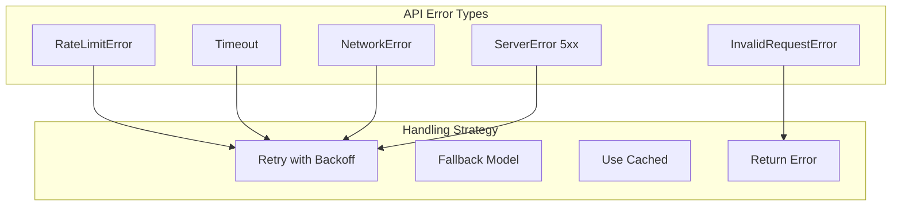
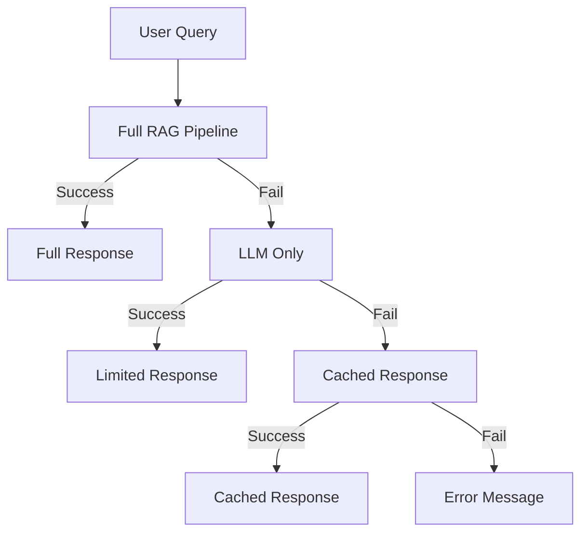

# Error Handling & Resilience

## Introduction

LLM APIs are inherently unreliable—rate limits, timeouts, and transient failures are common. Production applications must handle these gracefully to maintain user experience and system stability.

In this lesson, we'll implement robust error handling patterns using tenacity for retries, fallback strategies, and graceful degradation techniques.

### What We'll Cover

- Retry patterns with tenacity
- Exponential backoff strategies
- Fallback to alternative models
- Graceful degradation
- Circuit breaker pattern

### Prerequisites

- Python exception handling
- Async/await fundamentals
- Understanding of API rate limits

---

## Common LLM API Errors



| Error Type | Retryable | Strategy |
|------------|-----------|----------|
| Rate Limit (429) | ✅ Yes | Exponential backoff |
| Timeout | ✅ Yes | Retry with longer timeout |
| Server Error (5xx) | ✅ Yes | Immediate retry |
| Network Error | ✅ Yes | Retry with backoff |
| Invalid Request (400) | ❌ No | Fix request, don't retry |
| Authentication (401) | ❌ No | Check credentials |

---

## Tenacity Basics

Install tenacity:

```bash
pip install tenacity
```

### Simple Retry

```python
from tenacity import retry, stop_after_attempt, wait_fixed

@retry(stop=stop_after_attempt(3), wait=wait_fixed(2))
def call_api():
    """Retry up to 3 times, waiting 2 seconds between attempts."""
    response = make_request()
    return response
```

### Exponential Backoff

```python
from tenacity import (
    retry,
    stop_after_attempt,
    wait_exponential,
    retry_if_exception_type
)
from openai import RateLimitError, APIConnectionError

@retry(
    stop=stop_after_attempt(5),
    wait=wait_exponential(multiplier=1, min=4, max=60),
    retry=retry_if_exception_type((RateLimitError, APIConnectionError))
)
async def resilient_llm_call(prompt: str) -> str:
    """LLM call with exponential backoff."""
    client = AsyncOpenAI()
    response = await client.chat.completions.create(
        model="gpt-4o-mini",
        messages=[{"role": "user", "content": prompt}]
    )
    return response.choices[0].message.content
```

**Backoff timing:**

| Attempt | Wait Time |
|---------|-----------|
| 1 | 4 seconds |
| 2 | 8 seconds |
| 3 | 16 seconds |
| 4 | 32 seconds |
| 5 | 60 seconds (capped) |

---

## Advanced Retry Configuration

### Retry on Specific Exceptions

```python
from tenacity import retry, retry_if_exception_type
from openai import RateLimitError, APIConnectionError, APITimeoutError

RETRYABLE_ERRORS = (
    RateLimitError,
    APIConnectionError,
    APITimeoutError,
)

@retry(
    retry=retry_if_exception_type(RETRYABLE_ERRORS),
    stop=stop_after_attempt(3),
    wait=wait_exponential(multiplier=1, min=2, max=30)
)
async def call_with_retry(prompt: str):
    # API call here
    pass
```

### Custom Retry Condition

```python
from tenacity import retry, retry_if_result

def is_empty_response(result):
    """Check if response is empty or invalid."""
    return not result or len(result.strip()) == 0

@retry(
    retry=retry_if_result(is_empty_response),
    stop=stop_after_attempt(3)
)
async def get_non_empty_response(prompt: str) -> str:
    response = await call_llm(prompt)
    return response
```

### Combined Conditions

```python
from tenacity import (
    retry,
    retry_if_exception_type,
    retry_if_result,
    stop_after_attempt,
    stop_after_delay,
    wait_exponential
)

@retry(
    # Retry on exceptions OR empty results
    retry=(
        retry_if_exception_type(RETRYABLE_ERRORS) |
        retry_if_result(is_empty_response)
    ),
    # Stop after 3 attempts OR 60 seconds total
    stop=(
        stop_after_attempt(3) |
        stop_after_delay(60)
    ),
    wait=wait_exponential(multiplier=1, min=2, max=30)
)
async def robust_call(prompt: str) -> str:
    return await call_llm(prompt)
```

---

## Before/After Retry Callbacks

### Logging Retries

```python
from tenacity import (
    retry,
    before_sleep_log,
    after_log,
    stop_after_attempt,
    wait_exponential
)
import logging

logging.basicConfig(level=logging.INFO)
logger = logging.getLogger(__name__)

@retry(
    stop=stop_after_attempt(3),
    wait=wait_exponential(multiplier=1, min=2, max=30),
    before_sleep=before_sleep_log(logger, logging.WARNING),
    after=after_log(logger, logging.INFO)
)
async def logged_call(prompt: str) -> str:
    return await call_llm(prompt)
```

### Custom Callbacks

```python
from tenacity import retry, before_sleep, after

def log_retry(retry_state):
    """Log retry attempt details."""
    print(f"Retry {retry_state.attempt_number}: {retry_state.outcome.exception()}")

def track_metrics(retry_state):
    """Track retry metrics."""
    metrics.increment("llm.retries", tags={
        "attempt": retry_state.attempt_number
    })

@retry(
    stop=stop_after_attempt(3),
    wait=wait_exponential(multiplier=1, min=2, max=30),
    before_sleep=log_retry,
    after=track_metrics
)
async def tracked_call(prompt: str) -> str:
    return await call_llm(prompt)
```

---

## Fallback Strategies

### Simple Fallback

```python
from openai import AsyncOpenAI, RateLimitError

async def call_with_fallback(prompt: str) -> str:
    """Try primary model, fall back to secondary."""
    client = AsyncOpenAI()
    
    try:
        # Try primary model
        response = await client.chat.completions.create(
            model="gpt-4o",
            messages=[{"role": "user", "content": prompt}]
        )
        return response.choices[0].message.content
        
    except RateLimitError:
        # Fall back to secondary model
        response = await client.chat.completions.create(
            model="gpt-4o-mini",
            messages=[{"role": "user", "content": prompt}]
        )
        return response.choices[0].message.content
```

### Multi-Provider Fallback

```python
from openai import AsyncOpenAI
from anthropic import AsyncAnthropic


class ResilientLLM:
    """LLM client with multi-provider fallback."""
    
    def __init__(self):
        self.openai = AsyncOpenAI()
        self.anthropic = AsyncAnthropic()
    
    async def complete(self, prompt: str) -> str:
        """Try providers in order until success."""
        
        # Try OpenAI first
        try:
            response = await self.openai.chat.completions.create(
                model="gpt-4o-mini",
                messages=[{"role": "user", "content": prompt}]
            )
            return response.choices[0].message.content
        except Exception as e:
            print(f"OpenAI failed: {e}")
        
        # Fall back to Anthropic
        try:
            response = await self.anthropic.messages.create(
                model="claude-3-haiku-20240307",
                max_tokens=1024,
                messages=[{"role": "user", "content": prompt}]
            )
            return response.content[0].text
        except Exception as e:
            print(f"Anthropic failed: {e}")
        
        raise Exception("All providers failed")


# Usage
llm = ResilientLLM()
result = await llm.complete("Hello, world!")
```

---

## Fallback Chain Pattern

```python
from dataclasses import dataclass
from typing import Callable, List, Any


@dataclass
class FallbackOption:
    """A fallback option with provider and config."""
    name: str
    call_fn: Callable
    priority: int = 0


class FallbackChain:
    """Execute fallback chain until success."""
    
    def __init__(self, options: List[FallbackOption]):
        self.options = sorted(options, key=lambda x: x.priority)
    
    async def execute(self, *args, **kwargs) -> Any:
        """Try each option in priority order."""
        errors = []
        
        for option in self.options:
            try:
                result = await option.call_fn(*args, **kwargs)
                return result
            except Exception as e:
                errors.append((option.name, e))
                continue
        
        raise Exception(f"All fallbacks failed: {errors}")


# Usage
async def openai_call(prompt):
    # OpenAI implementation
    pass

async def anthropic_call(prompt):
    # Anthropic implementation
    pass

async def local_model_call(prompt):
    # Local model implementation
    pass

chain = FallbackChain([
    FallbackOption("openai", openai_call, priority=1),
    FallbackOption("anthropic", anthropic_call, priority=2),
    FallbackOption("local", local_model_call, priority=3),
])

result = await chain.execute("Hello!")
```

---

## Graceful Degradation

### Reduced Functionality

```python
async def smart_response(query: str, context: dict) -> dict:
    """Provide best possible response based on available services."""
    
    result = {
        "query": query,
        "response": None,
        "quality": "none",
        "degraded": False
    }
    
    # Try full RAG pipeline
    try:
        docs = await retrieve_documents(query)
        response = await generate_with_context(query, docs)
        result["response"] = response
        result["quality"] = "full"
        return result
    except Exception:
        result["degraded"] = True
    
    # Fall back to LLM without context
    try:
        response = await generate_without_context(query)
        result["response"] = response
        result["quality"] = "limited"
        return result
    except Exception:
        pass
    
    # Fall back to cached/canned response
    try:
        response = get_cached_response(query)
        result["response"] = response
        result["quality"] = "cached"
        return result
    except Exception:
        pass
    
    # Final fallback
    result["response"] = "I'm experiencing issues. Please try again later."
    result["quality"] = "error"
    return result
```

### Degradation Visualization



---

## Circuit Breaker Pattern

Prevent cascading failures:

```python
import time
from dataclasses import dataclass
from enum import Enum


class CircuitState(Enum):
    CLOSED = "closed"      # Normal operation
    OPEN = "open"          # Failing, reject requests
    HALF_OPEN = "half_open"  # Testing if recovered


@dataclass
class CircuitBreaker:
    """Simple circuit breaker implementation."""
    
    failure_threshold: int = 5
    recovery_timeout: float = 30.0
    
    def __post_init__(self):
        self.state = CircuitState.CLOSED
        self.failure_count = 0
        self.last_failure_time = 0
    
    def can_execute(self) -> bool:
        """Check if execution is allowed."""
        if self.state == CircuitState.CLOSED:
            return True
        
        if self.state == CircuitState.OPEN:
            # Check if recovery timeout has passed
            if time.time() - self.last_failure_time > self.recovery_timeout:
                self.state = CircuitState.HALF_OPEN
                return True
            return False
        
        # HALF_OPEN: allow one test request
        return True
    
    def record_success(self):
        """Record successful execution."""
        self.failure_count = 0
        self.state = CircuitState.CLOSED
    
    def record_failure(self):
        """Record failed execution."""
        self.failure_count += 1
        self.last_failure_time = time.time()
        
        if self.failure_count >= self.failure_threshold:
            self.state = CircuitState.OPEN


# Usage
circuit = CircuitBreaker(failure_threshold=3, recovery_timeout=60)


async def protected_call(prompt: str) -> str:
    """Call with circuit breaker protection."""
    if not circuit.can_execute():
        raise Exception("Circuit breaker open")
    
    try:
        result = await call_llm(prompt)
        circuit.record_success()
        return result
    except Exception as e:
        circuit.record_failure()
        raise
```

---

## Complete Resilient Client

```python
from tenacity import (
    retry,
    stop_after_attempt,
    wait_exponential,
    retry_if_exception_type,
    before_sleep_log
)
from openai import AsyncOpenAI, RateLimitError, APIConnectionError
import logging

logger = logging.getLogger(__name__)


class ResilientLLMClient:
    """Production-ready LLM client with full resilience."""
    
    def __init__(self):
        self.openai = AsyncOpenAI()
        self.circuit = CircuitBreaker(
            failure_threshold=5,
            recovery_timeout=60
        )
        self.cache = {}
    
    @retry(
        stop=stop_after_attempt(3),
        wait=wait_exponential(multiplier=1, min=2, max=30),
        retry=retry_if_exception_type((RateLimitError, APIConnectionError)),
        before_sleep=before_sleep_log(logger, logging.WARNING)
    )
    async def _call_openai(self, prompt: str, model: str) -> str:
        """Internal OpenAI call with retry."""
        response = await self.openai.chat.completions.create(
            model=model,
            messages=[{"role": "user", "content": prompt}]
        )
        return response.choices[0].message.content
    
    async def complete(
        self,
        prompt: str,
        model: str = "gpt-4o-mini",
        use_cache: bool = True
    ) -> dict:
        """Complete with full resilience stack."""
        
        # Check cache
        cache_key = f"{model}:{hash(prompt)}"
        if use_cache and cache_key in self.cache:
            return {
                "content": self.cache[cache_key],
                "source": "cache",
                "model": model
            }
        
        # Check circuit breaker
        if not self.circuit.can_execute():
            # Return cached or error
            if cache_key in self.cache:
                return {
                    "content": self.cache[cache_key],
                    "source": "cache_fallback",
                    "model": model
                }
            raise Exception("Service unavailable")
        
        try:
            # Primary call
            content = await self._call_openai(prompt, model)
            self.circuit.record_success()
            
            # Update cache
            self.cache[cache_key] = content
            
            return {
                "content": content,
                "source": "api",
                "model": model
            }
            
        except Exception as e:
            self.circuit.record_failure()
            
            # Try fallback model
            if model != "gpt-4o-mini":
                try:
                    content = await self._call_openai(prompt, "gpt-4o-mini")
                    return {
                        "content": content,
                        "source": "fallback",
                        "model": "gpt-4o-mini"
                    }
                except Exception:
                    pass
            
            raise


# Usage
client = ResilientLLMClient()
result = await client.complete("Hello, world!")
print(f"Response from {result['source']}: {result['content']}")
```

---

## Best Practices

| Practice | Description |
|----------|-------------|
| Use exponential backoff | Reduces load on stressed services |
| Set maximum retries | Prevent infinite retry loops |
| Log retry attempts | Enable debugging and monitoring |
| Implement fallbacks | Multiple paths to success |
| Use circuit breakers | Prevent cascade failures |
| Cache aggressively | Reduce API dependency |

---

## Common Pitfalls

| ❌ Mistake | ✅ Solution |
|-----------|-------------|
| Retrying non-retryable errors | Check error type before retry |
| Fixed wait times | Use exponential backoff |
| No maximum retry limit | Always set stop condition |
| Ignoring circuit breaker state | Check before each call |
| No fallback options | Always have a backup plan |

---

## Hands-on Exercise

Build a resilient Q&A service that:

1. Retries with exponential backoff
2. Falls back to simpler model on failure
3. Returns cached response if all else fails

### Requirements

1. Implement retry decorator with 3 attempts
2. Add fallback from GPT-4o to GPT-4o-mini
3. Cache successful responses
4. Return graceful error message as last resort

<details>
<summary>💡 Hints</summary>

- Use `@retry` with `wait_exponential`
- Create a simple in-memory cache dict
- Chain try/except blocks for fallbacks
- Include a final fallback message

</details>

<details>
<summary>✅ Solution</summary>

```python
from tenacity import (
    retry,
    stop_after_attempt,
    wait_exponential,
    retry_if_exception_type
)
from openai import AsyncOpenAI, RateLimitError, APIConnectionError
import hashlib


class ResilientQA:
    """Resilient Q&A service with retry and fallback."""
    
    def __init__(self):
        self.client = AsyncOpenAI()
        self.cache = {}
    
    def _cache_key(self, question: str) -> str:
        return hashlib.md5(question.encode()).hexdigest()
    
    @retry(
        stop=stop_after_attempt(3),
        wait=wait_exponential(multiplier=1, min=2, max=30),
        retry=retry_if_exception_type((RateLimitError, APIConnectionError))
    )
    async def _call_model(self, question: str, model: str) -> str:
        """Call model with retry."""
        response = await self.client.chat.completions.create(
            model=model,
            messages=[{"role": "user", "content": question}]
        )
        return response.choices[0].message.content
    
    async def answer(self, question: str) -> dict:
        """Answer with full resilience stack."""
        cache_key = self._cache_key(question)
        
        # Check cache first
        if cache_key in self.cache:
            return {
                "answer": self.cache[cache_key],
                "source": "cache"
            }
        
        # Try primary model
        try:
            answer = await self._call_model(question, "gpt-4o")
            self.cache[cache_key] = answer
            return {"answer": answer, "source": "gpt-4o"}
        except Exception:
            pass
        
        # Fallback to simpler model
        try:
            answer = await self._call_model(question, "gpt-4o-mini")
            self.cache[cache_key] = answer
            return {"answer": answer, "source": "gpt-4o-mini"}
        except Exception:
            pass
        
        # Final fallback
        return {
            "answer": "I'm unable to answer right now. Please try again later.",
            "source": "fallback"
        }


# Test
async def main():
    qa = ResilientQA()
    result = await qa.answer("What is Python?")
    print(f"[{result['source']}] {result['answer']}")

import asyncio
asyncio.run(main())
```

</details>

---

## Summary

✅ Use tenacity for retry with exponential backoff

✅ Only retry transient, retryable errors

✅ Implement fallback chains for resilience

✅ Apply graceful degradation for availability

✅ Use circuit breakers to prevent cascades

✅ Always have a final fallback response

**Next:** [Cost Optimization →](./06-cost-optimization.md)

---

## Further Reading

- [Tenacity Documentation](https://tenacity.readthedocs.io/)
- [Circuit Breaker Pattern](https://martinfowler.com/bliki/CircuitBreaker.html)
- [Resilience Engineering](https://aws.amazon.com/builders-library/)

---

<!-- 
Sources Consulted:
- Tenacity: https://tenacity.readthedocs.io/en/latest/
- Circuit Breaker Pattern: https://martinfowler.com/bliki/CircuitBreaker.html
-->
