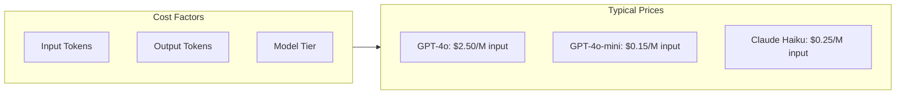
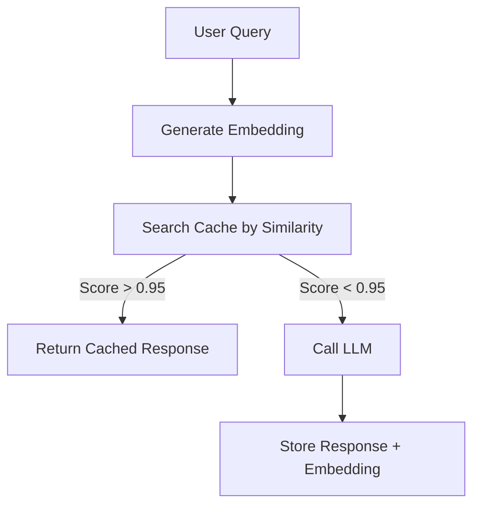

# Cost Optimization

## Introduction

LLM API costs can escalate quickly in production. A single GPT-4o call costs ~$0.01, but at 100,000 daily requests, that's $1,000/day. Strategic optimization can reduce costs by 50-90% without sacrificing quality.

In this lesson, we'll implement token tracking, caching strategies, and cost-aware model selection to keep your LLM applications economically sustainable.

### What We'll Cover

- Token usage tracking
- Cost calculation and monitoring
- Exact-match caching
- Semantic caching
- Cost-aware model selection
- Prompt optimization

### Prerequisites

- Understanding of LLM pricing models
- Redis basics (for caching)
- Python async patterns

---

## Understanding LLM Costs



| Model | Input (per 1M) | Output (per 1M) |
|-------|----------------|-----------------|
| GPT-4o | $2.50 | $10.00 |
| GPT-4o-mini | $0.15 | $0.60 |
| Claude 3.5 Sonnet | $3.00 | $15.00 |
| Claude 3 Haiku | $0.25 | $1.25 |

---

## Token Usage Tracking

### LangChain Callback

```python
from langchain_openai import ChatOpenAI
from langchain_community.callbacks import get_openai_callback


async def track_costs():
    """Track token usage and costs."""
    llm = ChatOpenAI(model="gpt-4o-mini")
    
    with get_openai_callback() as cb:
        response1 = await llm.ainvoke("What is Python?")
        response2 = await llm.ainvoke("What is JavaScript?")
    
    print(f"Total tokens: {cb.total_tokens}")
    print(f"Prompt tokens: {cb.prompt_tokens}")
    print(f"Completion tokens: {cb.completion_tokens}")
    print(f"Total cost: ${cb.total_cost:.6f}")
```

**Output:**
```
Total tokens: 342
Prompt tokens: 24
Completion tokens: 318
Total cost: $0.000194
```

### Manual Token Counting

```python
import tiktoken


def count_tokens(text: str, model: str = "gpt-4o") -> int:
    """Count tokens for a given text."""
    encoding = tiktoken.encoding_for_model(model)
    return len(encoding.encode(text))


def estimate_cost(
    prompt: str,
    completion: str,
    model: str = "gpt-4o"
) -> float:
    """Estimate cost for a request."""
    # Prices per 1M tokens
    PRICES = {
        "gpt-4o": {"input": 2.50, "output": 10.00},
        "gpt-4o-mini": {"input": 0.15, "output": 0.60},
    }
    
    input_tokens = count_tokens(prompt, model)
    output_tokens = count_tokens(completion, model)
    
    prices = PRICES.get(model, PRICES["gpt-4o"])
    
    input_cost = (input_tokens / 1_000_000) * prices["input"]
    output_cost = (output_tokens / 1_000_000) * prices["output"]
    
    return input_cost + output_cost


# Usage
prompt = "Explain machine learning in simple terms."
completion = "Machine learning is a type of AI..."
cost = estimate_cost(prompt, completion, "gpt-4o-mini")
print(f"Estimated cost: ${cost:.6f}")
```

---

## Cost Tracking Service

```python
from dataclasses import dataclass, field
from datetime import datetime
from typing import Dict
import json


@dataclass
class UsageRecord:
    """Single usage record."""
    timestamp: datetime
    model: str
    prompt_tokens: int
    completion_tokens: int
    cost: float


@dataclass
class CostTracker:
    """Track and aggregate LLM costs."""
    
    records: list = field(default_factory=list)
    
    def record(
        self,
        model: str,
        prompt_tokens: int,
        completion_tokens: int,
        cost: float
    ):
        """Record a usage event."""
        self.records.append(UsageRecord(
            timestamp=datetime.now(),
            model=model,
            prompt_tokens=prompt_tokens,
            completion_tokens=completion_tokens,
            cost=cost
        ))
    
    def total_cost(self) -> float:
        """Get total cost."""
        return sum(r.cost for r in self.records)
    
    def cost_by_model(self) -> Dict[str, float]:
        """Get cost breakdown by model."""
        costs = {}
        for record in self.records:
            costs[record.model] = costs.get(record.model, 0) + record.cost
        return costs
    
    def tokens_by_model(self) -> Dict[str, Dict[str, int]]:
        """Get token breakdown by model."""
        tokens = {}
        for record in self.records:
            if record.model not in tokens:
                tokens[record.model] = {"prompt": 0, "completion": 0}
            tokens[record.model]["prompt"] += record.prompt_tokens
            tokens[record.model]["completion"] += record.completion_tokens
        return tokens
    
    def summary(self) -> str:
        """Get cost summary."""
        return json.dumps({
            "total_cost": f"${self.total_cost():.4f}",
            "by_model": {k: f"${v:.4f}" for k, v in self.cost_by_model().items()},
            "total_requests": len(self.records)
        }, indent=2)


# Usage
tracker = CostTracker()
tracker.record("gpt-4o-mini", 100, 200, 0.00013)
tracker.record("gpt-4o", 100, 200, 0.00225)
print(tracker.summary())
```

---

## Exact-Match Caching

Cache identical requests:

```python
from langchain_community.cache import RedisCache
from langchain_core.globals import set_llm_cache
import redis


def setup_redis_cache():
    """Configure Redis cache for LangChain."""
    redis_client = redis.Redis(
        host="localhost",
        port=6379,
        db=0
    )
    
    set_llm_cache(RedisCache(redis_client))


# After setup, identical calls are cached
setup_redis_cache()

llm = ChatOpenAI(model="gpt-4o-mini")

# First call - hits API
response1 = llm.invoke("What is Python?")  # ~200ms

# Second call - hits cache
response2 = llm.invoke("What is Python?")  # ~1ms
```

### Manual Caching

```python
import hashlib
import json
from typing import Optional
import redis


class LLMCache:
    """Simple LLM response cache."""
    
    def __init__(self, redis_url: str = "redis://localhost:6379"):
        self.redis = redis.from_url(redis_url)
        self.ttl = 3600  # 1 hour
    
    def _key(self, prompt: str, model: str) -> str:
        """Generate cache key."""
        content = f"{model}:{prompt}"
        return f"llm:{hashlib.sha256(content.encode()).hexdigest()}"
    
    def get(self, prompt: str, model: str) -> Optional[str]:
        """Get cached response."""
        key = self._key(prompt, model)
        cached = self.redis.get(key)
        return cached.decode() if cached else None
    
    def set(self, prompt: str, model: str, response: str):
        """Cache a response."""
        key = self._key(prompt, model)
        self.redis.setex(key, self.ttl, response)
    
    def stats(self) -> dict:
        """Get cache statistics."""
        info = self.redis.info()
        return {
            "hits": info.get("keyspace_hits", 0),
            "misses": info.get("keyspace_misses", 0),
            "keys": self.redis.dbsize()
        }


# Usage
cache = LLMCache()

prompt = "What is Python?"
model = "gpt-4o-mini"

# Check cache first
cached = cache.get(prompt, model)
if cached:
    response = cached
else:
    response = await call_llm(prompt, model)
    cache.set(prompt, model, response)
```

---

## Semantic Caching

Cache similar (not identical) queries:



### With LangChain

```python
from langchain_community.cache import RedisSemanticCache
from langchain_openai import OpenAIEmbeddings
from langchain_core.globals import set_llm_cache


def setup_semantic_cache():
    """Configure semantic cache."""
    set_llm_cache(RedisSemanticCache(
        redis_url="redis://localhost:6379",
        embedding=OpenAIEmbeddings(),
        score_threshold=0.95  # Similarity threshold
    ))


setup_semantic_cache()

llm = ChatOpenAI(model="gpt-4o-mini")

# First query - API call
response1 = llm.invoke("What is Python programming?")

# Similar query - cache hit!
response2 = llm.invoke("Tell me about Python programming")

# Different query - API call
response3 = llm.invoke("What is JavaScript?")
```

### Custom Semantic Cache

```python
from openai import OpenAI
import numpy as np
from typing import Optional, Tuple
import json


class SemanticCache:
    """Semantic similarity cache using embeddings."""
    
    def __init__(
        self,
        redis_url: str = "redis://localhost:6379",
        threshold: float = 0.95
    ):
        self.redis = redis.from_url(redis_url)
        self.client = OpenAI()
        self.threshold = threshold
        self.index_key = "semantic_cache:index"
    
    def _embed(self, text: str) -> list:
        """Generate embedding for text."""
        response = self.client.embeddings.create(
            model="text-embedding-3-small",
            input=text
        )
        return response.data[0].embedding
    
    def _similarity(self, a: list, b: list) -> float:
        """Compute cosine similarity."""
        a = np.array(a)
        b = np.array(b)
        return np.dot(a, b) / (np.linalg.norm(a) * np.linalg.norm(b))
    
    def get(self, prompt: str) -> Optional[Tuple[str, float]]:
        """Find semantically similar cached response."""
        query_embedding = self._embed(prompt)
        
        # Get all cached entries
        keys = self.redis.smembers(self.index_key)
        
        best_match = None
        best_score = 0
        
        for key in keys:
            data = self.redis.hgetall(key)
            if not data:
                continue
            
            cached_embedding = json.loads(data[b"embedding"])
            score = self._similarity(query_embedding, cached_embedding)
            
            if score > best_score and score >= self.threshold:
                best_score = score
                best_match = data[b"response"].decode()
        
        if best_match:
            return best_match, best_score
        return None
    
    def set(self, prompt: str, response: str):
        """Cache response with embedding."""
        embedding = self._embed(prompt)
        
        key = f"semantic_cache:{hash(prompt)}"
        self.redis.hset(key, mapping={
            "prompt": prompt,
            "response": response,
            "embedding": json.dumps(embedding)
        })
        self.redis.sadd(self.index_key, key)
        self.redis.expire(key, 3600)


# Usage
cache = SemanticCache(threshold=0.92)

# Cache a response
cache.set("What is machine learning?", "Machine learning is...")

# Query with similar phrasing
result = cache.get("Explain ML to me")
if result:
    response, score = result
    print(f"Cache hit (score: {score:.2f}): {response}")
```

---

## Cost-Aware Model Selection

Choose models based on task complexity:

```python
from enum import Enum
from dataclasses import dataclass


class TaskComplexity(Enum):
    SIMPLE = "simple"
    MEDIUM = "medium"
    COMPLEX = "complex"


@dataclass
class ModelConfig:
    name: str
    cost_per_1k_input: float
    cost_per_1k_output: float
    max_tokens: int


MODELS = {
    TaskComplexity.SIMPLE: ModelConfig(
        name="gpt-4o-mini",
        cost_per_1k_input=0.00015,
        cost_per_1k_output=0.0006,
        max_tokens=128000
    ),
    TaskComplexity.MEDIUM: ModelConfig(
        name="gpt-4o-mini",  # Use mini with better prompting
        cost_per_1k_input=0.00015,
        cost_per_1k_output=0.0006,
        max_tokens=128000
    ),
    TaskComplexity.COMPLEX: ModelConfig(
        name="gpt-4o",
        cost_per_1k_input=0.0025,
        cost_per_1k_output=0.01,
        max_tokens=128000
    ),
}


def classify_task(prompt: str) -> TaskComplexity:
    """Classify task complexity based on prompt."""
    # Simple heuristics
    complex_indicators = [
        "analyze", "compare", "evaluate", "synthesize",
        "code review", "debug", "architecture"
    ]
    
    medium_indicators = [
        "explain", "summarize", "describe", "list",
        "write code", "translate"
    ]
    
    prompt_lower = prompt.lower()
    
    if any(ind in prompt_lower for ind in complex_indicators):
        return TaskComplexity.COMPLEX
    elif any(ind in prompt_lower for ind in medium_indicators):
        return TaskComplexity.MEDIUM
    else:
        return TaskComplexity.SIMPLE


async def smart_complete(prompt: str) -> dict:
    """Complete with cost-appropriate model."""
    complexity = classify_task(prompt)
    model_config = MODELS[complexity]
    
    response = await call_llm(prompt, model_config.name)
    
    return {
        "response": response,
        "model": model_config.name,
        "complexity": complexity.value
    }


# Usage
result = await smart_complete("What is 2+2?")  # Uses mini
result = await smart_complete("Analyze this codebase for security issues")  # Uses 4o
```

---

## Prompt Optimization

Reduce token usage through prompt engineering:

```python
def optimize_prompt(prompt: str) -> str:
    """Optimize prompt for fewer tokens."""
    # Remove redundant whitespace
    prompt = " ".join(prompt.split())
    
    # Use abbreviations for common instructions
    replacements = {
        "Please provide": "Give",
        "Could you please": "",
        "I would like you to": "",
        "Please note that": "Note:",
        "In addition to that": "Also,",
    }
    
    for old, new in replacements.items():
        prompt = prompt.replace(old, new)
    
    return prompt.strip()


# Token-efficient system prompts
EFFICIENT_SYSTEM_PROMPTS = {
    "concise": "Be concise. No preamble.",
    "json": "Output valid JSON only.",
    "code": "Code only. No explanations.",
}
```

### Batch Processing

```python
async def batch_process(
    prompts: list[str],
    batch_size: int = 5
) -> list[str]:
    """Process prompts in batches to reduce overhead."""
    results = []
    
    for i in range(0, len(prompts), batch_size):
        batch = prompts[i:i + batch_size]
        
        # Combine prompts
        combined = "\n---\n".join(
            f"[{j+1}] {p}" for j, p in enumerate(batch)
        )
        
        system = (
            "Answer each numbered question. "
            "Format: [1] Answer 1\n[2] Answer 2\n..."
        )
        
        response = await call_llm(combined, system_prompt=system)
        
        # Parse responses
        for line in response.split("\n"):
            if line.strip().startswith("["):
                results.append(line.split("]", 1)[1].strip())
    
    return results
```

---

## Cost Monitoring Dashboard

```python
from datetime import datetime, timedelta
from collections import defaultdict


class CostDashboard:
    """Simple cost monitoring dashboard."""
    
    def __init__(self, tracker: CostTracker):
        self.tracker = tracker
    
    def daily_report(self) -> dict:
        """Generate daily cost report."""
        today = datetime.now().date()
        
        daily_costs = defaultdict(float)
        daily_tokens = defaultdict(int)
        
        for record in self.tracker.records:
            if record.timestamp.date() == today:
                daily_costs[record.model] += record.cost
                daily_tokens[record.model] += (
                    record.prompt_tokens + record.completion_tokens
                )
        
        return {
            "date": str(today),
            "total_cost": sum(daily_costs.values()),
            "by_model": dict(daily_costs),
            "tokens_by_model": dict(daily_tokens),
            "request_count": len([
                r for r in self.tracker.records 
                if r.timestamp.date() == today
            ])
        }
    
    def set_alert(
        self,
        daily_limit: float,
        callback: callable
    ):
        """Set daily cost alert."""
        report = self.daily_report()
        if report["total_cost"] > daily_limit:
            callback(report)


# Usage
dashboard = CostDashboard(tracker)

def alert_callback(report):
    print(f"⚠️ Daily cost exceeded: ${report['total_cost']:.2f}")

dashboard.set_alert(daily_limit=10.0, callback=alert_callback)
```

---

## Best Practices

| Practice | Savings Potential |
|----------|-------------------|
| Exact-match caching | 30-50% |
| Semantic caching | 40-60% |
| Model selection | 50-80% |
| Prompt optimization | 10-20% |
| Batch processing | 20-30% |

---

## Common Pitfalls

| ❌ Mistake | ✅ Solution |
|-----------|-------------|
| No cost tracking | Implement from day 1 |
| Always using GPT-4o | Match model to task |
| No caching | Cache common queries |
| Long system prompts | Keep system prompts minimal |
| Individual API calls | Batch when possible |

---

## Hands-on Exercise

Build a cost-aware Q&A service:

1. Track token usage per request
2. Implement exact-match caching
3. Select model based on query complexity
4. Generate daily cost report

### Requirements

1. Create `CostAwareQA` class
2. Cache identical questions
3. Use `gpt-4o-mini` for simple, `gpt-4o` for complex
4. Track and report daily costs

<details>
<summary>💡 Hints</summary>

- Use dict for in-memory cache
- Classify by keywords in prompt
- Store costs in a list
- Calculate totals on demand

</details>

<details>
<summary>✅ Solution</summary>

```python
from openai import AsyncOpenAI
from dataclasses import dataclass
from datetime import datetime
import hashlib


@dataclass
class CostRecord:
    timestamp: datetime
    model: str
    tokens: int
    cost: float


class CostAwareQA:
    """Q&A service with cost optimization."""
    
    PRICES = {
        "gpt-4o": {"input": 0.0025, "output": 0.01},
        "gpt-4o-mini": {"input": 0.00015, "output": 0.0006}
    }
    
    COMPLEX_KEYWORDS = ["analyze", "compare", "evaluate", "debug", "review"]
    
    def __init__(self):
        self.client = AsyncOpenAI()
        self.cache = {}
        self.records = []
    
    def _cache_key(self, question: str) -> str:
        return hashlib.md5(question.lower().encode()).hexdigest()
    
    def _select_model(self, question: str) -> str:
        if any(kw in question.lower() for kw in self.COMPLEX_KEYWORDS):
            return "gpt-4o"
        return "gpt-4o-mini"
    
    def _calculate_cost(self, model: str, prompt_tokens: int, completion_tokens: int) -> float:
        prices = self.PRICES[model]
        return (prompt_tokens / 1000 * prices["input"] + 
                completion_tokens / 1000 * prices["output"])
    
    async def ask(self, question: str) -> dict:
        """Answer with cost optimization."""
        cache_key = self._cache_key(question)
        
        # Check cache
        if cache_key in self.cache:
            return {
                "answer": self.cache[cache_key],
                "model": "cached",
                "cost": 0.0,
                "cached": True
            }
        
        # Select model and call
        model = self._select_model(question)
        
        response = await self.client.chat.completions.create(
            model=model,
            messages=[{"role": "user", "content": question}]
        )
        
        answer = response.choices[0].message.content
        usage = response.usage
        cost = self._calculate_cost(
            model,
            usage.prompt_tokens,
            usage.completion_tokens
        )
        
        # Cache and record
        self.cache[cache_key] = answer
        self.records.append(CostRecord(
            timestamp=datetime.now(),
            model=model,
            tokens=usage.total_tokens,
            cost=cost
        ))
        
        return {
            "answer": answer,
            "model": model,
            "cost": cost,
            "cached": False
        }
    
    def daily_report(self) -> dict:
        today = datetime.now().date()
        today_records = [r for r in self.records if r.timestamp.date() == today]
        
        return {
            "date": str(today),
            "total_cost": sum(r.cost for r in today_records),
            "total_tokens": sum(r.tokens for r in today_records),
            "request_count": len(today_records),
            "cache_size": len(self.cache)
        }


# Test
async def main():
    qa = CostAwareQA()
    
    # Simple question - uses mini
    result = await qa.ask("What is Python?")
    print(f"Model: {result['model']}, Cost: ${result['cost']:.6f}")
    
    # Complex question - uses 4o
    result = await qa.ask("Analyze the pros and cons of microservices")
    print(f"Model: {result['model']}, Cost: ${result['cost']:.6f}")
    
    # Cached question
    result = await qa.ask("What is Python?")
    print(f"Model: {result['model']}, Cached: {result['cached']}")
    
    # Daily report
    print(qa.daily_report())

import asyncio
asyncio.run(main())
```

</details>

---

## Summary

✅ Track token usage from the start

✅ Implement exact-match caching for repeated queries

✅ Use semantic caching for similar queries

✅ Match model complexity to task complexity

✅ Optimize prompts to reduce tokens

✅ Monitor and alert on cost thresholds

**Next:** [Security Best Practices →](./07-security-best-practices.md)

---

## Further Reading

- [OpenAI Pricing](https://openai.com/pricing)
- [LangChain Caching](https://python.langchain.com/docs/modules/model_io/caching)
- [Tiktoken](https://github.com/openai/tiktoken)

---

<!-- 
Sources Consulted:
- LangChain Caching: https://python.langchain.com/docs/how_to/chat_model_caching/
- OpenAI Pricing: https://openai.com/pricing
- Tiktoken: https://github.com/openai/tiktoken
-->
