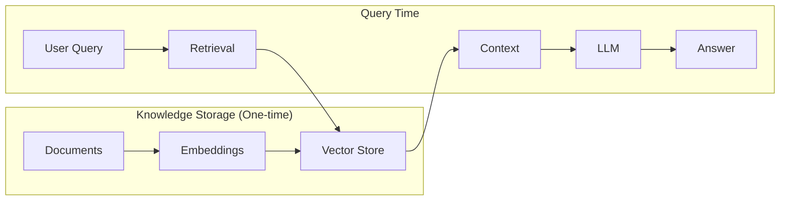

# 9.1 RAG Architecture Overview

## Overview

Retrieval-Augmented Generation (RAG) is the foundational architecture pattern for building AI applications that answer questions using your own data. Instead of relying solely on what an LLM learned during training, RAG retrieves relevant information from your documents and provides it as context — enabling accurate, grounded responses about your specific domain.

> **🤖 AI Context:** RAG has become the dominant pattern for enterprise AI adoption. Over 70% of production AI applications use RAG because it solves the fundamental problem of LLMs: they don't know about your private, proprietary, or recent data. Understanding RAG architecture is essential for any AI engineer.

### Why RAG Architecture Matters

| Benefit | Description |
|---------|-------------|
| **Grounded Responses** | Answers are based on your actual documents, not hallucinated |
| **Current Information** | Access data updated after the model's training cutoff |
| **Source Attribution** | Link responses back to specific documents for verification |
| **Cost Efficiency** | Cheaper than fine-tuning for most knowledge-based use cases |
| **Domain Expertise** | Enable LLMs to answer questions about your specific domain |
| **Compliance Ready** | Provide audit trails and source verification for regulated industries |

### What We'll Cover

This lesson provides a comprehensive introduction to RAG architecture and its core concepts:

| Sub-topic | Description |
|-----------|-------------|
| [RAG Concept and Motivation](./01-rag-concept-motivation.md) | The retrieval + generation paradigm, LLM limitations, and academic origins |
| [Architecture Components](./02-architecture-components.md) | Ingestion, retrieval, and generation pipelines with component interactions |
| [Data Flow in RAG Systems](./03-data-flow-rag-systems.md) | Document-to-embedding and query-to-response flows |
| [RAG vs. Fine-tuning](./04-rag-vs-finetuning.md) | When to use each approach, cost comparison, and hybrid strategies |
| [When to Use RAG](./05-when-to-use-rag.md) | Decision framework for RAG adoption and use case patterns |

### Prerequisites

Before starting this lesson, you should have:

- ✅ Understanding of embeddings and vector search (Unit 7)
- ✅ Experience with AI API integration (Unit 4)
- ✅ Basic prompt engineering knowledge (Unit 6)
- ✅ Familiarity with context windows and token limits (Unit 3)
- ✅ Python programming skills (Unit 2)

### Learning Objectives

By the end of this lesson, you will be able to:

1. **Explain the RAG paradigm** — Understand how retrieval augments generation to overcome LLM limitations
2. **Identify RAG components** — Recognize the ingestion, retrieval, and generation pipelines
3. **Trace data flow** — Follow documents from source to response through the RAG system
4. **Compare RAG with fine-tuning** — Make informed decisions about which approach fits your use case
5. **Evaluate RAG suitability** — Apply a decision framework to determine when RAG is appropriate

---

## Quick Start: A Minimal RAG System

Before diving deep into architecture, let's see RAG in action. This example shows the core pattern in under 20 lines:

```python
from openai import OpenAI

client = OpenAI()

# Step 1: Create a vector store (one-time setup)
vector_store = client.vector_stores.create(name="My Knowledge Base")

# Step 2: Upload documents (ingestion)
client.vector_stores.files.upload_and_poll(
    vector_store_id=vector_store.id,
    file=open("company_policies.pdf", "rb")
)

# Step 3: Search for relevant content (retrieval)
user_query = "What is our vacation policy?"
results = client.vector_stores.search(
    vector_store_id=vector_store.id,
    query=user_query,
    max_num_results=5
)

# Step 4: Generate grounded response (generation)
context = "\n".join([r.content[0].text for r in results.data])

response = client.chat.completions.create(
    model="gpt-4.1",
    messages=[
        {"role": "developer", "content": "Answer based only on the provided context. Cite sources."},
        {"role": "user", "content": f"Context:\n{context}\n\nQuestion: {user_query}"}
    ]
)

print(response.choices[0].message.content)
```

**Output:**
```
Based on the company policies document, employees receive 20 days of paid 
vacation annually, accrued at 1.67 days per month. Unused vacation days 
can be carried over up to a maximum of 5 days into the next year.
[Source: company_policies.pdf, Section 4.2]
```

This simple example demonstrates the three core phases of RAG:

1. **Ingestion** — Documents are chunked, embedded, and stored
2. **Retrieval** — User query finds relevant document chunks
3. **Generation** — LLM synthesizes a response using retrieved context

> **Note:** The rest of this lesson explores each phase in detail, starting with why RAG exists and how it evolved.

---

## The RAG Revolution

RAG represents a fundamental shift in how we build AI applications. Before RAG, developers faced a painful choice:

| Approach | Limitation |
|----------|------------|
| **Prompt Engineering Only** | LLM doesn't know your data |
| **Fine-tuning** | Expensive, slow updates, still hallucinates |
| **Long Context Windows** | Cost scales with every query, limited to ~500 pages |

RAG solves these problems by separating **knowledge storage** from **knowledge application**:



The brilliance of RAG is that you pay the embedding cost once during ingestion, then reuse that indexed knowledge for millions of queries. This is dramatically more efficient than including all your documents in every prompt.

---

## Key Terminology

Before exploring the sub-topics, familiarize yourself with these essential terms:

| Term | Definition |
|------|------------|
| **Corpus** | Your complete collection of source documents |
| **Chunk** | A segment of a document, typically 200-800 tokens |
| **Embedding** | A vector representation of text that captures semantic meaning |
| **Vector Store** | A database optimized for similarity search over embeddings |
| **Retrieval** | Finding the most relevant chunks for a given query |
| **Context Window** | The maximum tokens an LLM can process in one request |
| **Grounding** | Basing LLM responses on retrieved factual content |
| **Hallucination** | When an LLM generates plausible but incorrect information |

---

## Summary

This lesson introduces RAG architecture — the dominant pattern for building AI applications that answer questions about your data.

✅ RAG combines retrieval and generation to overcome LLM knowledge limitations
✅ The three core phases are ingestion, retrieval, and generation
✅ RAG is more cost-effective than fine-tuning for most knowledge-based applications
✅ Understanding architecture components is essential for building effective RAG systems
✅ This pattern powers 70%+ of enterprise AI deployments

**Next:** [RAG Concept and Motivation](./01-rag-concept-motivation.md)

---

## Further Reading

- [OpenAI Retrieval Guide](https://platform.openai.com/docs/guides/retrieval) - Official documentation for OpenAI's RAG implementation
- [Anthropic Contextual Retrieval](https://www.anthropic.com/news/contextual-retrieval) - Advanced techniques for improving retrieval accuracy
- [Lewis et al. RAG Paper](https://arxiv.org/abs/2005.11401) - The original academic paper introducing RAG (NeurIPS 2020)
- [LlamaIndex RAG Concepts](https://developers.llamaindex.ai/python/framework/understanding/rag) - Framework-specific RAG implementation guide

<!--
Sources Consulted:
- OpenAI Retrieval Guide: https://platform.openai.com/docs/guides/retrieval
- Anthropic Contextual Retrieval: https://www.anthropic.com/news/contextual-retrieval
- LlamaIndex Concepts: https://developers.llamaindex.ai/python/framework/getting_started/concepts/
- Lewis et al. RAG Paper: https://arxiv.org/abs/2005.11401
- OpenAI Accuracy Optimization: https://platform.openai.com/docs/guides/optimizing-llm-accuracy
-->
