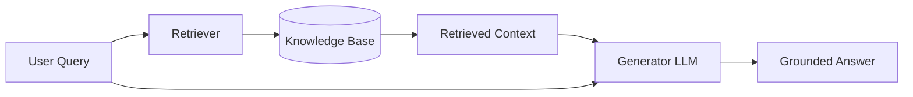

# RAG Concept and Motivation

## Introduction

Retrieval-Augmented Generation (RAG) solves a fundamental problem with Large Language Models: they only know what they learned during training. When you ask an LLM about your company's vacation policy, yesterday's stock prices, or internal documentation, it can only guess — often confidently and incorrectly.

RAG bridges this gap by retrieving relevant information from your knowledge base and providing it as context. The LLM then generates responses grounded in actual facts rather than parametric memory alone.

### What We'll Cover

- The retrieval + generation paradigm
- Core LLM limitations that RAG addresses
- Dynamic knowledge access patterns
- Academic origins and evolution of RAG
- Why RAG became the dominant enterprise AI pattern

### Prerequisites

- Understanding of how LLMs generate text (Unit 3)
- Familiarity with context windows and prompts (Unit 6)
- Basic knowledge of embeddings (Unit 7)

---

## The Retrieval + Generation Paradigm

RAG combines two distinct AI capabilities into a unified workflow:

| Component | Function | Technology |
|-----------|----------|------------|
| **Retrieval** | Find relevant information | Embeddings, vector search, BM25 |
| **Generation** | Synthesize coherent responses | Large Language Models |



### How It Works

1. **Query Processing** — The user's question is converted into a search query
2. **Retrieval** — Relevant documents or chunks are fetched from the knowledge base
3. **Context Assembly** — Retrieved content is formatted and added to the prompt
4. **Generation** — The LLM generates a response using both the query and context
5. **Response Delivery** — The grounded answer is returned to the user

### The Key Insight

Traditional LLMs have a fixed "parametric memory" — knowledge baked into billions of parameters during training. RAG adds "non-parametric memory" — external knowledge that can be updated without retraining:

```python
# Without RAG: LLM relies only on training data
response = llm.generate("What is our Q4 revenue target?")
# Result: "I don't have access to your company's financial information."

# With RAG: LLM uses retrieved context
context = retrieve("Q4 revenue target")  # Gets: "Q4 2025 target: $50M"
response = llm.generate(f"Context: {context}\n\nWhat is our Q4 revenue target?")
# Result: "Your Q4 2025 revenue target is $50 million."
```

---

## Overcoming LLM Limitations

RAG directly addresses five critical limitations of standalone LLMs:

### 1. Knowledge Cutoff

LLMs are frozen in time. A model trained in January 2025 knows nothing about events after that date.

| LLM Alone | With RAG |
|-----------|----------|
| "I don't have information after my training cutoff" | Retrieves current documents, provides up-to-date answers |
| Can't answer about recent events | Accesses real-time or frequently updated knowledge bases |

**Example:**
```python
# Knowledge cutoff problem
query = "What were Apple's Q1 2026 earnings?"

# Without RAG
llm_response = "I don't have data for 2026 as it's after my training cutoff."

# With RAG (retrieves recent SEC filing)
context = retrieve(query)  # Gets latest earnings report
rag_response = "Apple reported $123.9B revenue in Q1 2026, up 8% YoY."
```

### 2. No Private Data Access

LLMs weren't trained on your internal documents, proprietary data, or company knowledge.

| Data Type | Examples |
|-----------|----------|
| **Internal Documentation** | HR policies, product specs, runbooks |
| **Customer Data** | Support tickets, account details, order history |
| **Proprietary Knowledge** | Trade secrets, internal research, business logic |
| **Domain Expertise** | Legal precedents, medical guidelines, technical standards |

> **🔑 Key Point:** 70%+ of enterprise AI value comes from applying LLMs to private data. RAG is the primary pattern that makes this possible.

### 3. Hallucination

LLMs generate plausible-sounding but factually incorrect information, especially on topics outside their training data.

```python
# Hallucination example (without RAG)
query = "What is the maximum allowed expense report amount without manager approval?"

# LLM might confidently state:
hallucinated_response = "The maximum amount is $500."  # Made up!

# With RAG (retrieves actual policy)
context = retrieve("expense report approval limits")
# Gets: "Expenses under $250 require no approval. $250-$1000 requires manager approval."
grounded_response = "Expenses under $250 don't require approval. Above that needs manager sign-off."
```

RAG reduces hallucination by:
- **Grounding** responses in retrieved facts
- **Constraining** the LLM to use provided context
- **Enabling** source verification

### 4. No Source Attribution

When an LLM answers from memory, it can't point to where it learned the information.

| Without RAG | With RAG |
|-------------|----------|
| "According to best practices..." (vague) | "According to HR Policy v2.3, Section 4.1..." (specific) |
| No way to verify claims | Direct links to source documents |
| Trust issues in regulated industries | Audit trail for compliance |

**Example with citations:**
```python
def generate_with_citations(query, retrieved_docs):
    context = format_docs_with_ids(retrieved_docs)
    
    response = client.chat.completions.create(
        model="gpt-4.1",
        messages=[
            {
                "role": "developer",
                "content": """Answer the question using only the provided context.
                Cite sources using [doc_id] format inline."""
            },
            {"role": "user", "content": f"Context:\n{context}\n\nQuestion: {query}"}
        ]
    )
    return response.choices[0].message.content

# Output: "Employees receive 20 days of PTO annually [doc_1], with unused days
# carrying over up to 5 days maximum [doc_1, doc_3]."
```

### 5. Expensive to Update

Fine-tuning an LLM to learn new information is slow, expensive, and risks degrading existing capabilities.

| Update Method | Time | Cost | Risk |
|---------------|------|------|------|
| **Fine-tuning** | Hours to days | $100-$10,000+ | Catastrophic forgetting |
| **RAG Index Update** | Minutes | ~$0.10 per 1K documents | None |

---

## Dynamic Knowledge Access

RAG enables patterns impossible with static LLM knowledge:

### Real-Time Information

```python
# Combine RAG with live data sources
def answer_with_live_data(query):
    # Check if query needs real-time data
    if needs_real_time(query):
        context = fetch_live_data(query)  # API, database, web search
    else:
        context = retrieve_from_index(query)  # Vector store
    
    return generate_response(query, context)

# "What's our current inventory of SKU-12345?"
# Retrieves live database count, not stale indexed data
```

### Multi-Source Retrieval

```python
# Route queries to appropriate knowledge sources
def multi_source_retrieve(query):
    sources = []
    
    if is_hr_question(query):
        sources.append(retrieve_from("hr_policies"))
    
    if is_technical_question(query):
        sources.append(retrieve_from("documentation"))
    
    if needs_recent_data(query):
        sources.append(retrieve_from("recent_updates"))
    
    return merge_and_deduplicate(sources)
```

### Personalized Context

```python
# Include user-specific information
def personalized_rag(query, user_id):
    # General knowledge
    general_context = retrieve(query)
    
    # User-specific context
    user_context = retrieve_user_data(query, user_id)
    
    return generate_response(
        query,
        context=general_context + user_context,
        system_prompt=f"The user is {get_user_profile(user_id)}"
    )
```

---

## Academic Origins: The Lewis et al. Paper

RAG was formally introduced in the 2020 paper "Retrieval-Augmented Generation for Knowledge-Intensive NLP Tasks" by Patrick Lewis et al. at Facebook AI Research (now Meta AI).

### Key Contributions

> "We explore a general-purpose fine-tuning recipe for retrieval-augmented generation (RAG) — models which combine pre-trained parametric and non-parametric memory for language generation."
> — Lewis et al., NeurIPS 2020

| Innovation | Description |
|------------|-------------|
| **Parametric + Non-Parametric** | Combined fixed model weights with external retrieval |
| **End-to-End Training** | Jointly optimized retriever and generator |
| **Knowledge-Intensive Tasks** | Focused on QA, fact verification, and knowledge-grounded generation |
| **Dense Retrieval** | Used DPR (Dense Passage Retrieval) instead of sparse methods |

### Two RAG Formulations

The original paper proposed two variants:

```
RAG-Sequence: Same retrieved documents for entire generation
RAG-Token: Can use different documents for each token (more flexible)
```

**RAG-Sequence** (most common in practice):
```
p(y|x) = Σ p(z|x) × p(y|x,z)
         documents z
```

Where:
- `x` = input query
- `z` = retrieved documents
- `y` = generated output

### Evolution Since 2020

The RAG landscape has evolved dramatically:

| Era | Approach | Examples |
|-----|----------|----------|
| **2020** | Research prototype | Original RAG paper |
| **2021-2022** | Framework adoption | LangChain, LlamaIndex early versions |
| **2023** | Production patterns | Vector databases, managed services |
| **2024** | Advanced techniques | Contextual retrieval, agentic RAG, reranking |
| **2025** | Managed RAG | OpenAI Vector Stores, AWS Bedrock KB, Azure AI Search |

---

## Why RAG Dominates Enterprise AI

RAG became the go-to pattern for several practical reasons:

### 1. Lower Barrier to Entry

```python
# Basic RAG in ~10 lines with OpenAI
from openai import OpenAI
client = OpenAI()

# Create and populate vector store
vs = client.vector_stores.create(name="docs")
client.vector_stores.files.upload_and_poll(
    vector_store_id=vs.id,
    file=open("knowledge.pdf", "rb")
)

# Query with RAG
results = client.vector_stores.search(vector_store_id=vs.id, query="...")
```

### 2. Immediate Time-to-Value

| Approach | Time to First Working Demo |
|----------|---------------------------|
| Fine-tuning | Days to weeks |
| Custom model training | Weeks to months |
| RAG | Hours to days |

### 3. Compliance-Friendly

- **Audit trails** — Know exactly what documents informed each response
- **Access control** — Filter retrieval based on user permissions
- **Data residency** — Keep sensitive data in controlled environments
- **Explainability** — Show sources alongside answers

### 4. Cost Efficiency

For a knowledge base of 10,000 documents:

| Method | One-Time Cost | Per-Query Cost |
|--------|--------------|----------------|
| **Long Context (every query)** | $0 | ~$5.00 |
| **Fine-tuning** | $500-$5,000 | ~$0.02 |
| **RAG** | ~$10 (embedding) | ~$0.05 |

RAG wins when you have many queries against a knowledge base that changes occasionally.

---

## Common Misconceptions

| Misconception | Reality |
|---------------|---------|
| "RAG replaces the LLM" | RAG augments the LLM; you still need a strong generator |
| "RAG eliminates hallucination" | Reduces but doesn't eliminate; LLM can still misinterpret context |
| "RAG is just search + prompt" | Production RAG involves chunking, reranking, context assembly, and more |
| "Bigger context window = no need for RAG" | Cost prohibitive at scale; RAG is still more efficient |

---

## Hands-on Exercise

### Your Task

Demonstrate the difference between a grounded RAG response and an ungrounded LLM response.

### Requirements

1. Create a simple text file with fictional company information
2. Ask the same question with and without RAG
3. Compare the responses for accuracy and source attribution

### Setup

```python
# Create test data
company_info = """
ACME Corp Employee Handbook (v3.2)

Section 4.1 - Paid Time Off
Full-time employees receive 25 days of PTO annually.
PTO accrues at 2.083 days per month.
Maximum carryover: 10 days into the following year.
PTO requests require 2 weeks advance notice for 3+ consecutive days.

Section 4.2 - Sick Leave  
Employees receive 10 sick days annually.
Sick leave does not carry over.
Doctor's note required for 3+ consecutive sick days.
"""

with open("handbook.txt", "w") as f:
    f.write(company_info)
```

### Expected Result

Without RAG:
```
"I don't have specific information about ACME Corp's PTO policy..."
(or hallucinated generic answer)
```

With RAG:
```
"According to the ACME Corp Employee Handbook v3.2, Section 4.1,
full-time employees receive 25 days of PTO annually, accruing at
2.083 days per month. You can carry over up to 10 days into the
next year. For requests of 3 or more consecutive days, you'll
need to provide 2 weeks advance notice."
```

<details>
<summary>💡 Hints</summary>

- Use OpenAI's vector stores API for simple RAG implementation
- Compare responses from the same model with and without context
- Pay attention to confidence and specificity in each response

</details>

<details>
<summary>✅ Solution</summary>

```python
from openai import OpenAI

client = OpenAI()

question = "How many PTO days do employees get and can they carry over unused days?"

# Without RAG - direct LLM query
no_rag_response = client.chat.completions.create(
    model="gpt-4.1",
    messages=[
        {"role": "user", "content": f"At ACME Corp: {question}"}
    ]
)
print("Without RAG:")
print(no_rag_response.choices[0].message.content)
print("\n" + "="*50 + "\n")

# With RAG - retrieve then generate
with open("handbook.txt", "r") as f:
    context = f.read()

rag_response = client.chat.completions.create(
    model="gpt-4.1",
    messages=[
        {
            "role": "developer",
            "content": "Answer based only on the provided context. Cite the relevant section."
        },
        {
            "role": "user", 
            "content": f"Context:\n{context}\n\nQuestion: {question}"
        }
    ]
)
print("With RAG:")
print(rag_response.choices[0].message.content)
```

</details>

---

## Summary

RAG is the paradigm shift that makes LLMs useful for real-world applications with private, current, and domain-specific data.

✅ **Retrieval + Generation** combines search with language models for grounded responses
✅ **Overcomes LLM limitations** including knowledge cutoff, private data access, and hallucination
✅ **Dynamic knowledge access** enables real-time, multi-source, and personalized information retrieval
✅ **Academic foundations** trace back to Lewis et al. (2020) with significant evolution since
✅ **Enterprise dominance** stems from lower costs, faster deployment, and compliance benefits

**Next:** [Architecture Components](./02-architecture-components.md)

---

## Further Reading

- [Lewis et al. RAG Paper (2020)](https://arxiv.org/abs/2005.11401) - The foundational academic paper
- [OpenAI Retrieval Guide](https://platform.openai.com/docs/guides/retrieval) - Production RAG with OpenAI
- [Anthropic Contextual Retrieval](https://www.anthropic.com/news/contextual-retrieval) - Advanced retrieval techniques
- [OpenAI Accuracy Optimization](https://platform.openai.com/docs/guides/optimizing-llm-accuracy) - When to use RAG vs other approaches

<!--
Sources Consulted:
- Lewis et al. RAG Paper: https://arxiv.org/abs/2005.11401
- OpenAI Retrieval Guide: https://platform.openai.com/docs/guides/retrieval
- OpenAI Accuracy Optimization: https://platform.openai.com/docs/guides/optimizing-llm-accuracy
- Anthropic Contextual Retrieval: https://www.anthropic.com/news/contextual-retrieval
- LlamaIndex Concepts: https://developers.llamaindex.ai/python/framework/getting_started/concepts/
-->
