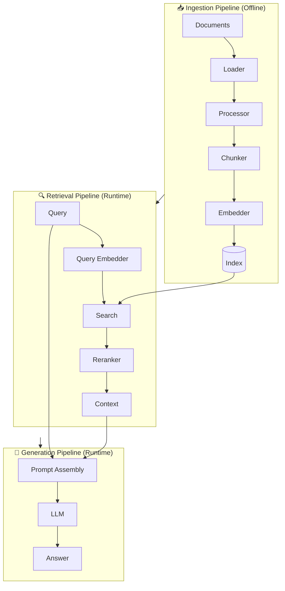
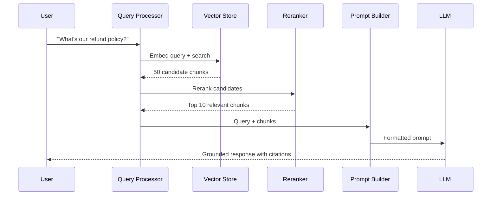

# Architecture Components

## Introduction

A RAG system consists of three interconnected pipelines: **ingestion**, **retrieval**, and **generation**. Each pipeline has distinct components that work together to transform raw documents into grounded AI responses. Understanding these components is essential for building, debugging, and optimizing RAG applications.

This section breaks down each pipeline, examines the key components, and shows how they interact in a production system.

### What We'll Cover

- Ingestion pipeline: from documents to indexed vectors
- Retrieval pipeline: from query to relevant context
- Generation pipeline: from context to grounded response
- Component interactions and data dependencies
- Common tools and services for each component

### Prerequisites

- Understanding of embeddings and vector similarity (Unit 7)
- Familiarity with LLM API calls (Unit 4)
- Basic knowledge of databases and indexing concepts

---

## The Three Pipelines

RAG architecture divides into three distinct but connected pipelines:



| Pipeline | When It Runs | Purpose |
|----------|--------------|---------|
| **Ingestion** | Offline (batch or scheduled) | Prepare and index documents |
| **Retrieval** | Runtime (per query) | Find relevant context |
| **Generation** | Runtime (per query) | Produce grounded responses |

---

## Ingestion Pipeline

The ingestion pipeline transforms raw documents into searchable vectors. This is typically run offline or on a schedule.

### Component 1: Document Loaders

Document loaders extract content from various source formats:

```python
# Example: Loading different document types
from langchain_community.document_loaders import (
    PyPDFLoader,
    UnstructuredHTMLLoader,
    TextLoader,
    Docx2txtLoader
)

# PDF documents
pdf_loader = PyPDFLoader("report.pdf")
pdf_docs = pdf_loader.load()

# HTML pages
html_loader = UnstructuredHTMLLoader("page.html")
html_docs = html_loader.load()

# Plain text
text_loader = TextLoader("readme.txt")
text_docs = text_loader.load()

# Word documents
docx_loader = Docx2txtLoader("proposal.docx")
docx_docs = docx_loader.load()
```

| Source Type | Challenges | Common Tools |
|-------------|------------|--------------|
| **PDF** | Layout, tables, scanned images | PyPDF, LlamaParse, Unstructured |
| **HTML** | Boilerplate, navigation, ads | BeautifulSoup, Unstructured |
| **Office Docs** | Formatting, embedded objects | python-docx, openpyxl |
| **Databases** | Schema mapping, relationships | SQLAlchemy, direct connectors |
| **APIs** | Rate limits, pagination | Custom integrations |

### Component 2: Document Processors

Processors clean and normalize extracted content:

```python
def process_document(doc):
    text = doc.page_content
    
    # Remove excessive whitespace
    text = " ".join(text.split())
    
    # Remove boilerplate (headers, footers)
    text = remove_boilerplate(text)
    
    # Normalize special characters
    text = normalize_unicode(text)
    
    # Extract and attach metadata
    metadata = {
        "source": doc.metadata.get("source"),
        "page": doc.metadata.get("page"),
        "created_date": extract_date(doc),
        "document_type": classify_document(doc)
    }
    
    return Document(page_content=text, metadata=metadata)
```

**Key processing tasks:**
- ✅ Whitespace normalization
- ✅ Boilerplate removal (headers, footers, navigation)
- ✅ Character encoding normalization
- ✅ Language detection
- ✅ Metadata extraction and enrichment

### Component 3: Text Chunkers

Chunkers split documents into retrieval units. Chunk size significantly impacts retrieval quality.

```python
from langchain.text_splitter import RecursiveCharacterTextSplitter

# Standard recursive splitting
splitter = RecursiveCharacterTextSplitter(
    chunk_size=800,       # Target size in characters
    chunk_overlap=200,    # Overlap between chunks
    separators=["\n\n", "\n", ". ", " ", ""]
)

chunks = splitter.split_documents(documents)
```

| Strategy | Best For | Trade-offs |
|----------|----------|------------|
| **Fixed Size** | Uniform documents | May break mid-sentence |
| **Recursive** | General purpose | Good balance of coherence |
| **Semantic** | Quality-critical | Higher cost, slower |
| **Document-Aware** | Structured content | Preserves sections, headers |

**OpenAI default chunking:**
```python
# OpenAI Vector Stores use:
# - max_chunk_size_tokens: 800 (default)
# - chunk_overlap_tokens: 400 (default)

client.vector_stores.files.create(
    vector_store_id="vs_123",
    file_id="file_456",
    chunking_strategy={
        "type": "static",
        "max_chunk_size_tokens": 1000,
        "chunk_overlap_tokens": 200
    }
)
```

### Component 4: Embedding Models

Embedding models convert text chunks into dense vectors:

```python
from openai import OpenAI

client = OpenAI()

def embed_chunks(chunks: list[str]) -> list[list[float]]:
    """Embed multiple text chunks efficiently."""
    response = client.embeddings.create(
        model="text-embedding-3-small",
        input=chunks
    )
    return [item.embedding for item in response.data]

# Embed in batches for efficiency
batch_size = 100
all_embeddings = []
for i in range(0, len(chunks), batch_size):
    batch = chunks[i:i+batch_size]
    embeddings = embed_chunks([c.page_content for c in batch])
    all_embeddings.extend(embeddings)
```

| Model | Dimensions | Cost (per 1M tokens) | Quality |
|-------|------------|---------------------|---------|
| `text-embedding-3-small` | 1536 | $0.02 | Good |
| `text-embedding-3-large` | 3072 | $0.13 | Better |
| Voyage AI `voyage-3` | 1024 | $0.06 | Excellent |
| Cohere `embed-v4` | 1024 | $0.10 | Excellent |

### Component 5: Vector Index

The vector index stores embeddings for fast similarity search:

```python
# OpenAI Managed Vector Store
vector_store = client.vector_stores.create(name="knowledge_base")

# Add files with automatic chunking and embedding
client.vector_stores.files.upload_and_poll(
    vector_store_id=vector_store.id,
    file=open("document.pdf", "rb"),
    attributes={"department": "engineering", "year": 2025}
)
```

**Popular vector databases:**

| Database | Type | Key Features |
|----------|------|--------------|
| **OpenAI Vector Stores** | Managed | Zero config, built-in chunking |
| **Pinecone** | Managed | Serverless, metadata filtering |
| **Weaviate** | Self-hosted/Cloud | Hybrid search, modules |
| **Chroma** | Self-hosted | Simple, Python-native |
| **Qdrant** | Self-hosted/Cloud | Rich filtering, sparse vectors |
| **pgvector** | PostgreSQL extension | SQL integration |

---

## Retrieval Pipeline

The retrieval pipeline runs at query time to find relevant context.

### Component 1: Query Processor

Transform user queries for optimal retrieval:

```python
def process_query(user_query: str) -> str:
    """Prepare query for retrieval."""
    
    # Option 1: Use query as-is
    search_query = user_query
    
    # Option 2: Query rewriting (OpenAI)
    results = client.vector_stores.search(
        vector_store_id=vs_id,
        query=user_query,
        rewrite_query=True  # Automatic optimization
    )
    
    # Option 3: HyDE (Hypothetical Document Embedding)
    hypothetical_answer = llm.generate(
        f"Write a paragraph that would answer: {user_query}"
    )
    search_query = hypothetical_answer
    
    return search_query
```

| Technique | When to Use | Cost |
|-----------|-------------|------|
| **Direct Query** | Simple, clear queries | Free |
| **Query Rewriting** | Conversational queries | Minimal |
| **HyDE** | Complex, abstract queries | 1 LLM call |
| **Multi-Query** | Ambiguous queries | Multiple searches |

### Component 2: Vector Search

Find semantically similar chunks:

```python
# Basic similarity search
results = client.vector_stores.search(
    vector_store_id=vector_store.id,
    query="What is the refund policy?",
    max_num_results=10
)

# With filtering
results = client.vector_stores.search(
    vector_store_id=vector_store.id,
    query="What is the refund policy?",
    max_num_results=10,
    filters={
        "type": "eq",
        "key": "department",
        "value": "customer_service"
    }
)

# With ranking options
results = client.vector_stores.search(
    vector_store_id=vector_store.id,
    query="What is the refund policy?",
    ranking_options={
        "ranker": "default-2024-08-21",
        "score_threshold": 0.7
    }
)
```

**Search modes:**

| Mode | Method | Best For |
|------|--------|----------|
| **Semantic** | Vector similarity | Meaning-based queries |
| **Keyword (BM25)** | Term frequency | Exact matches, codes, names |
| **Hybrid** | Both combined | Production systems |

### Component 3: Reranker (Optional but Recommended)

Rerankers refine initial results for higher precision:

```python
import cohere

co = cohere.Client(api_key="...")

def rerank_results(query: str, documents: list[str], top_n: int = 5):
    """Rerank documents for higher relevance."""
    response = co.rerank(
        model="rerank-v3.5",
        query=query,
        documents=documents,
        top_n=top_n,
        return_documents=True
    )
    
    return [
        {
            "text": result.document.text,
            "score": result.relevance_score
        }
        for result in response.results
    ]

# Typical flow: retrieve 50-100, rerank to top 10-20
initial_results = vector_search(query, k=100)
reranked = rerank_results(query, initial_results, top_n=10)
```

> **🔑 Key Insight:** Anthropic's research shows reranking improves retrieval accuracy by 67% when combined with contextual embeddings.

### Component 4: Context Assembler

Prepare retrieved content for the LLM:

```python
def assemble_context(results: list, max_tokens: int = 4000) -> str:
    """Assemble retrieved chunks into LLM context."""
    context_parts = []
    current_tokens = 0
    
    for result in results:
        chunk_text = result.content[0].text
        chunk_tokens = count_tokens(chunk_text)
        
        if current_tokens + chunk_tokens > max_tokens:
            break
        
        # Format with source info
        formatted = f"[Source: {result.filename}]\n{chunk_text}"
        context_parts.append(formatted)
        current_tokens += chunk_tokens
    
    return "\n\n---\n\n".join(context_parts)
```

---

## Generation Pipeline

The generation pipeline produces grounded responses using retrieved context.

### Component 1: Prompt Builder

Construct effective prompts with context:

```python
def build_rag_prompt(query: str, context: str) -> list[dict]:
    """Build messages for RAG generation."""
    return [
        {
            "role": "developer",
            "content": """You are a helpful assistant that answers questions 
based on the provided context. Follow these rules:
1. Only use information from the provided context
2. If the context doesn't contain the answer, say so
3. Cite sources using [Source: filename] format
4. Be concise but complete"""
        },
        {
            "role": "user",
            "content": f"""Context:
{context}

---

Question: {query}

Answer based only on the context above:"""
        }
    ]
```

### Component 2: LLM Generator

Generate the final response:

```python
def generate_response(messages: list[dict], stream: bool = False):
    """Generate grounded response from LLM."""
    
    if stream:
        # Streaming for better UX
        response = client.chat.completions.create(
            model="gpt-4.1",
            messages=messages,
            stream=True
        )
        for chunk in response:
            if chunk.choices[0].delta.content:
                yield chunk.choices[0].delta.content
    else:
        # Standard response
        response = client.chat.completions.create(
            model="gpt-4.1",
            messages=messages
        )
        return response.choices[0].message.content
```

### Component 3: Response Post-Processor

Validate and enhance responses:

```python
def post_process_response(response: str, sources: list) -> dict:
    """Post-process RAG response."""
    
    # Extract citations
    citations = extract_citations(response)
    
    # Validate citations against actual sources
    valid_citations = validate_citations(citations, sources)
    
    # Add source links
    enhanced_response = add_source_links(response, sources)
    
    return {
        "answer": enhanced_response,
        "citations": valid_citations,
        "sources": sources,
        "confidence": calculate_confidence(response, sources)
    }
```

---

## Component Interactions

Understanding how components interact is crucial for debugging:



### Data Dependencies

| Component | Inputs | Outputs |
|-----------|--------|---------|
| **Loader** | File path/URL | Raw document |
| **Processor** | Raw document | Clean text + metadata |
| **Chunker** | Clean text | Text chunks |
| **Embedder** | Text chunks | Vectors |
| **Index** | Vectors + metadata | Searchable index |
| **Query Processor** | User query | Search query |
| **Vector Search** | Search query | Candidate chunks |
| **Reranker** | Query + candidates | Ranked chunks |
| **Prompt Builder** | Query + context | LLM messages |
| **Generator** | LLM messages | Response text |

---

## Common Tools by Component

| Component | Open Source | Managed Services |
|-----------|-------------|------------------|
| **Loaders** | LangChain, LlamaIndex, Unstructured | LlamaParse, Azure Document Intelligence |
| **Chunkers** | LangChain splitters, LlamaIndex node parsers | OpenAI auto-chunking |
| **Embedders** | Sentence Transformers, Hugging Face | OpenAI, Voyage, Cohere |
| **Vector DB** | Chroma, Qdrant, Weaviate, pgvector | Pinecone, OpenAI Vector Stores |
| **Rerankers** | FlashRank, cross-encoders | Cohere, Voyage |
| **LLMs** | Llama, Mistral | OpenAI, Anthropic, Google |

---

## Best Practices

| Component | Best Practice | Why |
|-----------|---------------|-----|
| **Chunking** | 400-800 tokens with 20% overlap | Balance context and precision |
| **Embedding** | Match query and document models | Consistent semantic space |
| **Retrieval** | Fetch 50-100, rerank to 10-20 | Precision with coverage |
| **Context** | Stay under 50% of context window | Leave room for generation |
| **Generation** | Explicit grounding instructions | Reduce hallucination |

---

## Common Pitfalls

| ❌ Mistake | ✅ Solution |
|-----------|-------------|
| Chunks too large (>1000 tokens) | Keep under 800 tokens for precision |
| No overlap between chunks | Use 20-25% overlap for context continuity |
| Ignoring metadata | Include source, date, category for filtering |
| Returning too few results | Retrieve more, then rerank |
| No reranking step | Add reranker for 67% improvement |
| Stuffing entire context window | Prioritize quality over quantity |

---

## Summary

RAG systems consist of three pipelines with specialized components:

✅ **Ingestion Pipeline** transforms documents → chunks → embeddings → index
✅ **Retrieval Pipeline** converts queries → search → rerank → context
✅ **Generation Pipeline** combines context + query → prompt → LLM → response
✅ **Component selection** depends on use case, scale, and accuracy requirements
✅ **Reranking** provides significant accuracy improvements (+67%)

**Next:** [Data Flow in RAG Systems](./03-data-flow-rag-systems.md)

---

## Further Reading

- [OpenAI Vector Stores Documentation](https://platform.openai.com/docs/guides/retrieval) - Managed RAG components
- [LangChain Document Loaders](https://python.langchain.com/docs/integrations/document_loaders/) - Extensive loader library
- [Cohere Rerank](https://docs.cohere.com/docs/rerank-2) - Production reranking
- [Anthropic Contextual Retrieval](https://www.anthropic.com/news/contextual-retrieval) - Advanced chunking strategies

<!--
Sources Consulted:
- OpenAI Retrieval Guide: https://platform.openai.com/docs/guides/retrieval
- Anthropic Contextual Retrieval: https://www.anthropic.com/news/contextual-retrieval
- LangChain Documentation: https://python.langchain.com/docs/
- Cohere Rerank: https://docs.cohere.com/docs/rerank-2
-->
