# Data Flow in RAG Systems

## Introduction

Understanding how data flows through a RAG system is essential for building, debugging, and optimizing your application. Data transforms at each stage — from raw documents to embeddings during ingestion, and from user queries to grounded responses at runtime.

This section traces both flows in detail, examines feedback loops for continuous improvement, and addresses critical data freshness considerations.

### What We'll Cover

- Document-to-embedding flow (ingestion path)
- Query-to-response flow (runtime path)
- Feedback loops for quality improvement
- Data freshness and update strategies
- Debugging data flow issues

### Prerequisites

- Understanding of RAG components (previous section)
- Familiarity with embeddings and vector similarity
- Basic knowledge of async/streaming patterns

---

## Document-to-Embedding Flow

The ingestion path transforms raw documents into searchable vectors. This typically runs as a batch process, separate from user queries.

### Complete Ingestion Flow

```mermaid
flowchart TD
    subgraph Sources["📁 Data Sources"]
        PDF[PDF Files]
        HTML[Web Pages]
        DB[(Databases)]
        API[APIs]
    end
    
    subgraph Loading["📥 Loading Stage"]
        L[Document Loader]
        RAW[Raw Content]
    end
    
    subgraph Processing["⚙️ Processing Stage"]
        CLEAN[Text Cleaner]
        META[Metadata Extractor]
        PROCESSED[Processed Document]
    end
    
    subgraph Chunking["✂️ Chunking Stage"]
        SPLIT[Text Splitter]
        CHUNKS[Document Chunks]
    end
    
    subgraph Embedding["🔢 Embedding Stage"]
        EMB[Embedding Model]
        VECTORS[Vector Embeddings]
    end
    
    subgraph Storage["💾 Storage Stage"]
        IDX[(Vector Index)]
        STORE[(Metadata Store)]
    end
    
    PDF --> L
    HTML --> L
    DB --> L
    API --> L
    L --> RAW
    RAW --> CLEAN
    RAW --> META
    CLEAN --> PROCESSED
    META --> PROCESSED
    PROCESSED --> SPLIT
    SPLIT --> CHUNKS
    CHUNKS --> EMB
    EMB --> VECTORS
    VECTORS --> IDX
    CHUNKS --> STORE
    META --> STORE
```



### Stage 1: Loading

Raw content extraction from various sources:

```python
from pathlib import Path

def load_documents(source_path: str) -> list[dict]:
    """Load documents from various sources."""
    documents = []
    path = Path(source_path)
    
    for file in path.glob("**/*"):
        if file.suffix == ".pdf":
            content = load_pdf(file)
        elif file.suffix == ".html":
            content = load_html(file)
        elif file.suffix == ".txt":
            content = load_text(file)
        else:
            continue
        
        documents.append({
            "content": content,
            "source": str(file),
            "loaded_at": datetime.now().isoformat(),
            "file_type": file.suffix
        })
    
    return documents
```

**Data at this stage:**
```json
{
  "content": "Raw text content from document...",
  "source": "/docs/policies/hr-handbook.pdf",
  "loaded_at": "2025-02-05T10:30:00",
  "file_type": ".pdf"
}
```

### Stage 2: Processing

Clean and normalize content, extract metadata:

```python
def process_document(doc: dict) -> dict:
    """Clean content and enrich metadata."""
    
    # Clean the content
    cleaned_content = clean_text(doc["content"])
    
    # Extract additional metadata
    metadata = {
        **doc,  # Keep original metadata
        "word_count": len(cleaned_content.split()),
        "language": detect_language(cleaned_content),
        "title": extract_title(cleaned_content),
        "created_date": extract_date(doc["source"]),
        "checksum": compute_hash(cleaned_content)
    }
    
    return {
        "content": cleaned_content,
        "metadata": metadata
    }
```

**Data transformation:**
```
Before: "  Multiple   spaces\n\n\n and weird   formatting  "
After:  "Multiple spaces and weird formatting"

Metadata added: word_count, language, title, checksum
```

### Stage 3: Chunking

Split documents into retrieval units:

```python
def chunk_document(doc: dict, chunk_size: int = 800, overlap: int = 200) -> list[dict]:
    """Split document into overlapping chunks."""
    content = doc["content"]
    chunks = []
    
    start = 0
    chunk_index = 0
    
    while start < len(content):
        end = start + chunk_size
        chunk_text = content[start:end]
        
        # Find natural break point
        if end < len(content):
            last_period = chunk_text.rfind(". ")
            if last_period > chunk_size * 0.5:
                end = start + last_period + 1
                chunk_text = content[start:end]
        
        chunks.append({
            "text": chunk_text,
            "metadata": {
                **doc["metadata"],
                "chunk_index": chunk_index,
                "start_char": start,
                "end_char": end
            }
        })
        
        start = end - overlap
        chunk_index += 1
    
    return chunks
```

**Chunking example:**
```
Original document: 3000 characters

Chunk 0: chars 0-800    (metadata: chunk_index=0)
Chunk 1: chars 600-1400 (metadata: chunk_index=1, overlap with 0)
Chunk 2: chars 1200-2000 (metadata: chunk_index=2, overlap with 1)
Chunk 3: chars 1800-2600 (metadata: chunk_index=3, overlap with 2)
Chunk 4: chars 2400-3000 (metadata: chunk_index=4, overlap with 3)
```

### Stage 4: Embedding

Convert text to vectors:

```python
from openai import OpenAI

client = OpenAI()

def embed_chunks(chunks: list[dict], batch_size: int = 100) -> list[dict]:
    """Generate embeddings for all chunks."""
    
    for i in range(0, len(chunks), batch_size):
        batch = chunks[i:i + batch_size]
        texts = [c["text"] for c in batch]
        
        # Call embedding API
        response = client.embeddings.create(
            model="text-embedding-3-small",
            input=texts
        )
        
        # Attach embeddings to chunks
        for j, embedding_data in enumerate(response.data):
            chunks[i + j]["embedding"] = embedding_data.embedding
    
    return chunks
```

**Data at this stage:**
```python
{
    "text": "Employees receive 25 days of PTO annually...",
    "metadata": {
        "source": "hr-handbook.pdf",
        "chunk_index": 3,
        "title": "HR Handbook"
    },
    "embedding": [0.0234, -0.0891, 0.0456, ...]  # 1536 dimensions
}
```

### Stage 5: Indexing

Store in vector database:

```python
def index_chunks(chunks: list[dict], index_name: str):
    """Store chunks in vector database."""
    
    # Prepare for bulk insert
    records = [
        {
            "id": f"{c['metadata']['source']}_{c['metadata']['chunk_index']}",
            "values": c["embedding"],
            "metadata": {
                "text": c["text"],
                **c["metadata"]
            }
        }
        for c in chunks
    ]
    
    # Upsert to vector store
    vector_store.upsert(records)
    
    print(f"Indexed {len(records)} chunks to {index_name}")
```

---

## Query-to-Response Flow

The runtime path processes user queries and generates grounded responses.

### Complete Query Flow


### Stage 1: Query Processing

```python
def process_query(user_input: str) -> dict:
    """Process and enhance user query."""
    
    # Clean input
    cleaned = user_input.strip()
    
    # Detect query type
    query_type = classify_query(cleaned)  # factual, comparison, how-to, etc.
    
    # Optional: Rewrite for better retrieval
    if query_type == "conversational":
        rewritten = rewrite_query(cleaned)
    else:
        rewritten = cleaned
    
    return {
        "original": user_input,
        "cleaned": cleaned,
        "search_query": rewritten,
        "query_type": query_type
    }
```

### Stage 2: Query Embedding

```python
def embed_query(query_text: str) -> list[float]:
    """Embed the search query."""
    response = client.embeddings.create(
        model="text-embedding-3-small",  # Same model as documents!
        input=query_text
    )
    return response.data[0].embedding
```

> **⚠️ Warning:** Always use the same embedding model for queries and documents. Mixing models produces incompatible vector spaces.

### Stage 3: Vector Search

```python
def search_vectors(
    query_embedding: list[float],
    filters: dict = None,
    top_k: int = 50
) -> list[dict]:
    """Search vector store for similar chunks."""
    
    results = client.vector_stores.search(
        vector_store_id=VECTOR_STORE_ID,
        query=query_embedding,
        max_num_results=top_k,
        filters=filters
    )
    
    return [
        {
            "text": r.content[0].text,
            "score": r.score,
            "metadata": {
                "file_id": r.file_id,
                "filename": r.filename
            }
        }
        for r in results.data
    ]
```

### Stage 4: Reranking

```python
import cohere

co = cohere.Client()

def rerank_results(query: str, candidates: list[dict], top_n: int = 10) -> list[dict]:
    """Rerank candidates for relevance."""
    
    response = co.rerank(
        model="rerank-v3.5",
        query=query,
        documents=[c["text"] for c in candidates],
        top_n=top_n,
        return_documents=True
    )
    
    reranked = []
    for r in response.results:
        original = candidates[r.index]
        reranked.append({
            **original,
            "rerank_score": r.relevance_score
        })
    
    return reranked
```

### Stage 5: Context Assembly

```python
def assemble_context(chunks: list[dict], max_tokens: int = 4000) -> str:
    """Assemble chunks into LLM context."""
    
    context_parts = []
    token_count = 0
    
    for chunk in chunks:
        chunk_tokens = count_tokens(chunk["text"])
        
        if token_count + chunk_tokens > max_tokens:
            break
        
        # Format with source attribution
        formatted = f"""<source file="{chunk['metadata']['filename']}">
{chunk['text']}
</source>"""
        
        context_parts.append(formatted)
        token_count += chunk_tokens
    
    return "\n\n".join(context_parts)
```

### Stage 6: Generation

```python
def generate_response(query: str, context: str) -> str:
    """Generate grounded response from LLM."""
    
    messages = [
        {
            "role": "developer",
            "content": """Answer the user's question based only on the provided sources.
If the sources don't contain the answer, say "I don't have information about that."
Cite sources using [filename] format."""
        },
        {
            "role": "user",
            "content": f"""Sources:
{context}

Question: {query}"""
        }
    ]
    
    response = client.chat.completions.create(
        model="gpt-4.1",
        messages=messages
    )
    
    return response.choices[0].message.content
```

### Stage 7: Post-Processing

```python
def post_process(response: str, sources: list[dict]) -> dict:
    """Validate and enhance response."""
    
    # Extract citations from response
    citations = extract_citations(response)
    
    # Validate each citation exists in sources
    valid_sources = [s for s in sources if s["filename"] in citations]
    
    # Build final response object
    return {
        "answer": response,
        "sources": valid_sources,
        "citations": citations,
        "confidence": calculate_confidence(response, sources)
    }
```

---

## Feedback Loops

Production RAG systems improve through feedback loops:

```mermaid
flowchart TD
    subgraph Runtime["Query Flow"]
        Q[Query] --> R[Retrieve]
        R --> G[Generate]
        G --> A[Answer]
    end
    
    subgraph Feedback["Feedback Collection"]
        A --> U[User Feedback]
        U --> |👍/👎| FB[(Feedback Store)]
        A --> I[Implicit Signals]
        I --> |clicks, time| FB
    end
    
    subgraph Analysis["Analysis & Improvement"]
        FB --> AN[Analyze Failures]
        AN --> |Low retrieval| RT[Tune Retrieval]
        AN --> |Wrong answers| PT[Tune Prompts]
        AN --> |Missing info| DI[Add Documents]
    end
    
    RT --> R
    PT --> G
    DI --> IDX[(Index)]
    IDX --> R
```



### Explicit Feedback

```python
def record_feedback(query_id: str, feedback: dict):
    """Record user feedback on response quality."""
    
    feedback_record = {
        "query_id": query_id,
        "timestamp": datetime.now().isoformat(),
        "rating": feedback.get("rating"),  # 1-5 or thumbs up/down
        "comment": feedback.get("comment"),
        "was_helpful": feedback.get("was_helpful"),
        "missing_info": feedback.get("missing_info"),
        "incorrect_info": feedback.get("incorrect_info")
    }
    
    feedback_store.insert(feedback_record)
```

### Implicit Signals

```python
def track_implicit_feedback(query_id: str, events: list[dict]):
    """Track implicit quality signals."""
    
    signals = {
        "query_id": query_id,
        "time_to_first_action": events[0]["timestamp"] - query_timestamp,
        "clicked_sources": [e for e in events if e["type"] == "source_click"],
        "reformulated_query": any(e["type"] == "new_query" for e in events),
        "session_continued": len(events) > 1,
        "escalated_to_human": any(e["type"] == "escalation" for e in events)
    }
    
    analytics_store.insert(signals)
```

### Analyzing Feedback

```python
def analyze_feedback_patterns():
    """Identify improvement opportunities from feedback."""
    
    # Find low-rated queries
    poor_queries = feedback_store.query(
        "SELECT * FROM feedback WHERE rating < 3"
    )
    
    for query in poor_queries:
        # Analyze retrieval quality
        retrieved = get_retrieved_chunks(query["query_id"])
        relevance_scores = [c["score"] for c in retrieved]
        
        if max(relevance_scores) < 0.7:
            print(f"Retrieval issue: {query['original_query']}")
            # Suggests: better chunking, more documents, query rewriting
        
        elif query.get("incorrect_info"):
            print(f"Generation issue: {query['original_query']}")
            # Suggests: prompt tuning, stronger grounding instructions
        
        elif query.get("missing_info"):
            print(f"Coverage gap: {query['original_query']}")
            # Suggests: add missing documents to knowledge base
```

---

## Data Freshness Considerations

RAG systems must handle data that changes over time:

### Update Strategies

| Strategy | Use Case | Implementation |
|----------|----------|----------------|
| **Full Reindex** | Small corpus, major changes | Delete all, re-ingest |
| **Incremental** | Large corpus, frequent updates | Update changed docs only |
| **Scheduled Sync** | External data sources | Periodic full or diff sync |
| **Real-time** | Critical freshness | Stream updates as they occur |

### Change Detection

```python
def detect_changes(source_path: str) -> dict:
    """Detect which documents have changed since last sync."""
    
    current_files = scan_directory(source_path)
    indexed_files = get_indexed_files()
    
    changes = {
        "new": [],
        "modified": [],
        "deleted": []
    }
    
    for file in current_files:
        checksum = compute_hash(file)
        
        if file not in indexed_files:
            changes["new"].append(file)
        elif checksum != indexed_files[file]["checksum"]:
            changes["modified"].append(file)
    
    for file in indexed_files:
        if file not in current_files:
            changes["deleted"].append(file)
    
    return changes
```

### Incremental Update

```python
def incremental_update(changes: dict):
    """Apply incremental updates to index."""
    
    # Process new documents
    for file in changes["new"]:
        doc = load_document(file)
        chunks = process_and_chunk(doc)
        embeddings = embed_chunks(chunks)
        index_chunks(embeddings)
    
    # Re-process modified documents
    for file in changes["modified"]:
        # Delete old chunks
        delete_chunks_for_file(file)
        # Re-ingest
        doc = load_document(file)
        chunks = process_and_chunk(doc)
        embeddings = embed_chunks(chunks)
        index_chunks(embeddings)
    
    # Remove deleted documents
    for file in changes["deleted"]:
        delete_chunks_for_file(file)
```

### Freshness Metadata

```python
# Include freshness info in retrieval
def search_with_freshness(query: str, max_age_days: int = None):
    """Search with optional freshness filter."""
    
    filters = {}
    
    if max_age_days:
        cutoff = datetime.now() - timedelta(days=max_age_days)
        filters = {
            "type": "gte",
            "key": "indexed_at",
            "value": cutoff.isoformat()
        }
    
    return client.vector_stores.search(
        vector_store_id=VECTOR_STORE_ID,
        query=query,
        filters=filters
    )
```

---

## Debugging Data Flow

Common issues and how to diagnose them:

### Issue: Poor Retrieval Quality

```python
def debug_retrieval(query: str):
    """Debug retrieval issues."""
    
    # 1. Check query embedding
    query_embedding = embed_query(query)
    print(f"Query embedding norm: {np.linalg.norm(query_embedding)}")
    
    # 2. Get raw retrieval results
    results = search_vectors(query_embedding, top_k=20)
    
    # 3. Analyze scores
    scores = [r["score"] for r in results]
    print(f"Score range: {min(scores):.3f} - {max(scores):.3f}")
    print(f"Score mean: {np.mean(scores):.3f}")
    
    # 4. Display top results
    for i, r in enumerate(results[:5]):
        print(f"\n{i+1}. Score: {r['score']:.3f}")
        print(f"   Source: {r['metadata']['filename']}")
        print(f"   Text: {r['text'][:200]}...")
```

### Issue: Context Too Large

```python
def debug_context_size(chunks: list[dict]):
    """Debug context assembly issues."""
    
    total_tokens = sum(count_tokens(c["text"]) for c in chunks)
    print(f"Total tokens from {len(chunks)} chunks: {total_tokens}")
    
    # Token distribution
    for i, c in enumerate(chunks):
        tokens = count_tokens(c["text"])
        print(f"Chunk {i}: {tokens} tokens (score: {c.get('score', 'N/A')})")
```

### Issue: Hallucinated Citations

```python
def debug_citations(response: str, sources: list[dict]):
    """Debug citation accuracy."""
    
    cited = extract_citations(response)
    available = {s["filename"] for s in sources}
    
    valid = cited & available
    hallucinated = cited - available
    uncited = available - cited
    
    print(f"Valid citations: {valid}")
    print(f"Hallucinated citations: {hallucinated}")  # Problem!
    print(f"Available but not cited: {uncited}")
```

---

## Summary

Data flows through RAG systems in two distinct paths:

✅ **Ingestion flow** transforms documents → chunks → embeddings → index (offline)
✅ **Query flow** processes query → retrieval → reranking → context → generation (runtime)
✅ **Feedback loops** enable continuous improvement through explicit and implicit signals
✅ **Data freshness** requires update strategies matching your domain requirements
✅ **Debugging tools** help identify issues at each stage of the flow

**Next:** [RAG vs. Fine-tuning](./04-rag-vs-finetuning.md)

---

## Further Reading

- [LlamaIndex Data Connectors](https://docs.llamaindex.ai/en/stable/module_guides/loading/) - Comprehensive loader library
- [OpenAI Embeddings Best Practices](https://platform.openai.com/docs/guides/embeddings) - Embedding optimization
- [Vector Database Comparison](https://thenewstack.io/comparing-vector-databases/) - Choosing the right vector store

<!--
Sources Consulted:
- OpenAI Retrieval Guide: https://platform.openai.com/docs/guides/retrieval
- LlamaIndex Documentation: https://docs.llamaindex.ai/
- Anthropic Contextual Retrieval: https://www.anthropic.com/news/contextual-retrieval
-->
