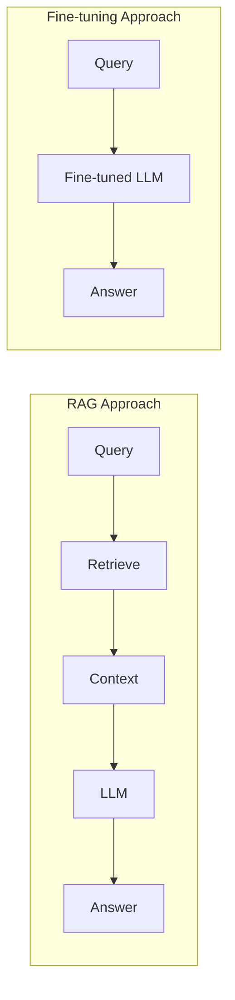
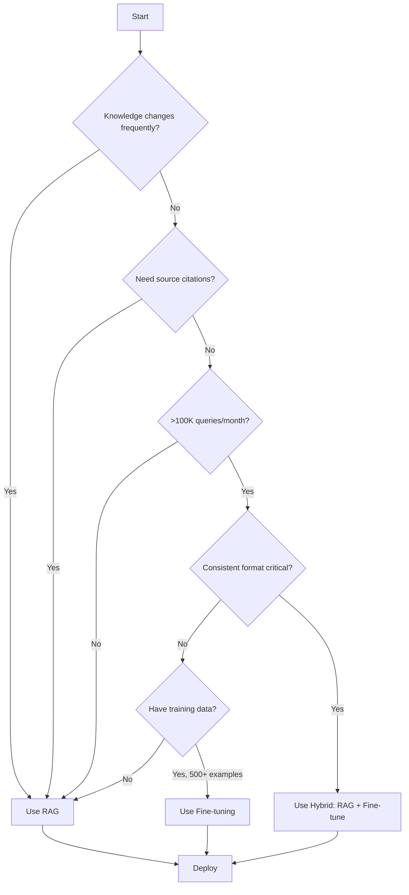

# RAG vs. Fine-tuning

## Introduction

When building AI applications that need specialized knowledge, developers face a critical decision: use RAG to provide knowledge at query time, or fine-tune the model to bake knowledge into its weights. Each approach has distinct trade-offs in cost, latency, accuracy, and maintenance.

This section provides a comprehensive comparison to help you make the right choice for your use case — and shows when combining both approaches yields the best results.

### What We'll Cover

- Cost comparison across setup and runtime
- Update frequency and maintenance requirements
- Accuracy characteristics and failure modes
- Decision framework: when to use each approach
- Hybrid strategies combining RAG and fine-tuning

### Prerequisites

- Understanding of RAG architecture (previous sections)
- Basic knowledge of model fine-tuning concepts
- Familiarity with token-based pricing models

---

## The Core Trade-off

RAG and fine-tuning solve the same problem differently:

| Aspect | RAG | Fine-tuning |
|--------|-----|-------------|
| **Knowledge Location** | External (retrieved at runtime) | Internal (in model weights) |
| **Update Method** | Update documents | Retrain model |
| **Query Cost** | Retrieval + longer context | Shorter context, no retrieval |
| **Setup Cost** | Embedding + indexing | Training compute |
| **Best For** | Dynamic, factual knowledge | Consistent behavior, style |



---

## Cost Comparison

### Setup Costs

| Cost Type | RAG | Fine-tuning |
|-----------|-----|-------------|
| **Documents (10K pages)** | ~$10 embedding | N/A |
| **Training Data Prep** | Minimal | 50-500 hours manual |
| **Compute** | None | $100-$10,000+ |
| **Infrastructure** | Vector DB ($50-500/mo) | Model hosting |
| **Time to Deploy** | Hours to days | Days to weeks |

**RAG setup calculation:**
```python
# Cost to embed 10,000 documents (~1M tokens average)
documents = 10_000
avg_tokens_per_doc = 1_000
total_tokens = documents * avg_tokens_per_doc  # 10M tokens

# Using text-embedding-3-small at $0.02/1M tokens
embedding_cost = (total_tokens / 1_000_000) * 0.02
print(f"Embedding cost: ${embedding_cost:.2f}")  # $0.20

# Vector storage (1GB at $0.10/day)
monthly_storage = 0.10 * 30
print(f"Monthly storage: ${monthly_storage:.2f}")  # $3.00
```

**Fine-tuning setup calculation:**
```python
# OpenAI fine-tuning costs
training_tokens = 1_000_000  # 1M training tokens
cost_per_1m = 8.00  # GPT-4.1 training cost

training_cost = (training_tokens / 1_000_000) * cost_per_1m
print(f"Training cost: ${training_cost:.2f}")  # $8.00

# Plus: 50-500 hours of data preparation
# At $50/hour = $2,500-$25,000 labor cost
```

### Per-Query Costs

| Query Type | RAG | Fine-tuning |
|------------|-----|-------------|
| **Retrieval** | $0.001-0.01 | $0 |
| **Context Tokens** | ~4K tokens | ~500 tokens |
| **LLM Cost (GPT-4.1)** | $0.08-0.20 | $0.01-0.05 |
| **Total per Query** | $0.08-0.21 | $0.01-0.05 |

**Cost comparison at scale:**

```python
def compare_costs(queries_per_month: int):
    """Compare monthly costs for RAG vs fine-tuning."""
    
    # RAG costs
    rag_per_query = 0.15  # Average with retrieval + context
    rag_monthly_infra = 100  # Vector DB
    rag_total = (queries_per_month * rag_per_query) + rag_monthly_infra
    
    # Fine-tuning costs
    ft_per_query = 0.03  # Shorter prompts
    ft_monthly_infra = 0  # Using OpenAI hosted
    ft_total = (queries_per_month * ft_per_query) + ft_monthly_infra
    
    return {
        "rag_total": rag_total,
        "ft_total": ft_total,
        "rag_wins": rag_total < ft_total
    }

# Break-even analysis
for queries in [1000, 10000, 100000, 1000000]:
    result = compare_costs(queries)
    print(f"{queries:>7} queries/mo: RAG ${result['rag_total']:>8,.0f} | FT ${result['ft_total']:>8,.0f}")
```

**Output:**
```
   1000 queries/mo: RAG $     250 | FT $      30  ← Fine-tuning wins
  10000 queries/mo: RAG $   1,600 | FT $     300  ← Fine-tuning wins
 100000 queries/mo: RAG $  15,100 | FT $   3,000  ← Fine-tuning wins
1000000 queries/mo: RAG $ 150,100 | FT $  30,000  ← Fine-tuning wins
```

> **🔑 Key Insight:** Fine-tuning has lower per-query costs but higher upfront costs. The break-even depends on query volume and update frequency.

---

## Update Frequency

How quickly can you incorporate new information?

### RAG: Minutes to Hours

```python
def update_knowledge_base(new_document_path: str):
    """Update RAG knowledge base with new document."""
    
    # 1. Load new document (seconds)
    doc = load_document(new_document_path)
    
    # 2. Process and chunk (seconds)
    chunks = process_and_chunk(doc)
    
    # 3. Generate embeddings (seconds to minutes)
    embeddings = embed_chunks(chunks)
    
    # 4. Index (seconds)
    index_chunks(embeddings)
    
    # Total time: 1-60 minutes depending on document size
    print("Knowledge base updated!")
```

### Fine-tuning: Days to Weeks

```python
def update_fine_tuned_model(new_examples: list[dict]):
    """Update fine-tuned model with new knowledge."""
    
    # 1. Prepare training data (hours to days)
    training_data = format_for_training(new_examples)
    validate_training_data(training_data)
    
    # 2. Run fine-tuning job (hours)
    job = client.fine_tuning.jobs.create(
        training_file=upload_training_file(training_data),
        model="gpt-4.1"
    )
    
    # 3. Wait for completion (1-24 hours)
    while job.status != "succeeded":
        time.sleep(300)
        job = client.fine_tuning.jobs.retrieve(job.id)
    
    # 4. Validate new model (hours)
    run_evaluation_suite(job.fine_tuned_model)
    
    # 5. Deploy to production
    update_production_model(job.fine_tuned_model)
    
    # Total time: 1-7 days
```

### Update Frequency Comparison

| Scenario | RAG | Fine-tuning |
|----------|-----|-------------|
| **Daily updates** | ✅ Easy | ❌ Impractical |
| **Weekly updates** | ✅ Easy | ⚠️ Expensive |
| **Monthly updates** | ✅ Easy | ✅ Feasible |
| **Quarterly updates** | ✅ Easy | ✅ Feasible |
| **Static knowledge** | ✅ Works | ✅ Optimal |

---

## Accuracy Characteristics

Each approach has different accuracy profiles and failure modes:

### RAG Accuracy

| Strength | Weakness |
|----------|----------|
| Factually grounded in sources | Retrieval failures cause wrong answers |
| Can cite sources | Context window limits |
| No hallucination of facts not in corpus | May miss relevant context |
| Easy to verify correctness | Requires high-quality retrieval |

**RAG failure modes:**
```python
# Failure 1: Retrieval returns wrong documents
query = "What's our refund policy for software?"
retrieved = ["Hardware refund policy...", "Software licensing..."]
# Wrong context → wrong answer

# Failure 2: Relevant info exists but wasn't retrieved
query = "What's the CEO's email?"
retrieved = []  # Info exists in org chart, but not matched
# No context → "I don't have that information"

# Failure 3: Context too long, key info lost
query = "What's the deadline for Q4 reports?"
retrieved = [10 long documents, deadline buried in chunk 8]
# Answer based on first chunks, misses deadline
```

### Fine-tuning Accuracy

| Strength | Weakness |
|----------|----------|
| Consistent behavior and style | Can still hallucinate |
| Lower latency (no retrieval) | Hard to update |
| Works for behavioral patterns | May not cite sources |
| Better for structured outputs | Knowledge frozen at training time |

**Fine-tuning failure modes:**
```python
# Failure 1: Catastrophic forgetting
# After fine-tuning on customer service, model forgets general knowledge

# Failure 2: Hallucination with confidence
query = "What's our Q4 2025 revenue?"
response = "Revenue was $50M"  # Confident but invented

# Failure 3: Overfitting to training examples
query = "Hi, how can I help?"
response = "Hello! I see you're asking about returns..."  # Always assumes returns
```

### Accuracy by Task Type

| Task | RAG Accuracy | Fine-tuning Accuracy |
|------|--------------|---------------------|
| **Factual Q&A** | ⭐⭐⭐⭐⭐ | ⭐⭐⭐ |
| **Following format** | ⭐⭐⭐ | ⭐⭐⭐⭐⭐ |
| **Consistent tone** | ⭐⭐⭐ | ⭐⭐⭐⭐⭐ |
| **Recent information** | ⭐⭐⭐⭐⭐ | ⭐ |
| **Source citation** | ⭐⭐⭐⭐⭐ | ⭐ |
| **Complex reasoning** | ⭐⭐⭐⭐ | ⭐⭐⭐⭐ |

---

## When to Use Each

### Use RAG When:

✅ **Knowledge changes frequently**
- Product catalogs, pricing, inventory
- News, events, market data
- Documentation that's regularly updated

✅ **You need source attribution**
- Legal, medical, financial applications
- Compliance requirements
- Audit trails needed

✅ **Private/proprietary data**
- Internal knowledge bases
- Customer-specific information
- Confidential documents

✅ **Quick deployment needed**
- Proof of concept in days
- No ML expertise required
- Iterative improvement possible

✅ **Large knowledge base**
- Thousands of documents
- Would exceed fine-tuning limits
- Need selective retrieval

### Use Fine-tuning When:

✅ **Consistent behavior required**
- Specific tone of voice
- Strict output formats
- Predictable responses

✅ **Low latency critical**
- Real-time applications
- High-volume inference
- No retrieval delay acceptable

✅ **Static, well-defined knowledge**
- Domain terminology
- Classification categories
- Stable procedures

✅ **Cost optimization at scale**
- Millions of queries per month
- Shorter prompts reduce costs
- Amortize training over queries

✅ **Teaching complex patterns**
- Multi-step reasoning
- Domain-specific logic
- Task decomposition

---

## Hybrid Approaches

The best production systems often combine both:

### Pattern 1: Fine-tuned Generator with RAG

```python
def hybrid_rag_with_finetuned_model(query: str):
    """Use fine-tuned model for generation, RAG for knowledge."""
    
    # Retrieve context (RAG)
    context = retrieve_relevant_chunks(query)
    
    # Generate with fine-tuned model
    response = fine_tuned_client.chat.completions.create(
        model="ft:gpt-4.1:my-org:custom-model",  # Fine-tuned!
        messages=[
            {"role": "system", "content": SYSTEM_PROMPT},
            {"role": "user", "content": f"Context:\n{context}\n\nQuery: {query}"}
        ]
    )
    
    return response.choices[0].message.content
```

**Benefits:**
- RAG provides current, factual knowledge
- Fine-tuned model ensures consistent style and format
- Best of both worlds

### Pattern 2: RAG with Fine-tuned Retrieval

```python
def rag_with_finetuned_query_rewriter(query: str):
    """Fine-tune model to improve query rewriting for retrieval."""
    
    # Fine-tuned model rewrites query for better retrieval
    rewritten = query_rewriter_model.generate(
        f"Rewrite for search: {query}"
    )
    
    # Standard RAG from here
    context = retrieve_relevant_chunks(rewritten)
    response = generate_response(query, context)
    
    return response
```

### Pattern 3: Router Pattern

```python
def router_hybrid(query: str):
    """Route queries to RAG or fine-tuned model based on type."""
    
    # Classify query type
    query_type = classify_query(query)
    
    if query_type == "factual":
        # Use RAG for factual questions
        return rag_pipeline(query)
    
    elif query_type == "procedural":
        # Use fine-tuned model for how-to
        return fine_tuned_pipeline(query)
    
    elif query_type == "creative":
        # Use base model for creative tasks
        return base_model_pipeline(query)
```

### Pattern 4: Cascading Fallback

```python
def cascading_hybrid(query: str):
    """Try fine-tuned first, fall back to RAG if uncertain."""
    
    # Try fine-tuned model first
    ft_response = fine_tuned_model.generate(query)
    confidence = extract_confidence(ft_response)
    
    if confidence > 0.8:
        return ft_response
    
    # Low confidence: augment with RAG
    context = retrieve_relevant_chunks(query)
    rag_response = generate_with_context(query, context)
    
    return rag_response
```

---

## Decision Framework

Use this framework to choose your approach:



### Quick Decision Table

| Your Situation | Recommendation |
|----------------|----------------|
| Startup, need to move fast | RAG |
| Enterprise compliance requirements | RAG |
| Customer support chatbot | Hybrid |
| Document Q&A | RAG |
| Code generation with style | Fine-tuning |
| Real-time trading assistant | Fine-tuning |
| Internal knowledge base | RAG |
| High-volume, stable use case | Fine-tuning |

---

## Best Practices

### For RAG

| Practice | Why |
|----------|-----|
| Invest in retrieval quality | Poor retrieval = poor answers |
| Use reranking | 67% accuracy improvement |
| Monitor retrieval metrics | Catch issues before users do |
| Keep chunks focused | Better precision |

### For Fine-tuning

| Practice | Why |
|----------|-----|
| Start with 50+ diverse examples | Quality over quantity |
| Include edge cases | Prevent overfitting |
| Use held-out test set | Detect regression |
| Version your models | Enable rollback |

### For Hybrid

| Practice | Why |
|----------|-----|
| Define clear routing logic | Avoid confusion |
| Monitor both paths | Different failure modes |
| A/B test approaches | Data-driven decisions |
| Document the architecture | Team understanding |

---

## Common Pitfalls

| ❌ Mistake | ✅ Solution |
|-----------|-------------|
| Choosing fine-tuning for dynamic data | Use RAG for frequently changing knowledge |
| Using RAG when format consistency is critical | Fine-tune for consistent outputs |
| Ignoring update costs | Factor in maintenance, not just initial setup |
| Over-engineering for low volume | Start with RAG, optimize later |
| No evaluation framework | Build evals before choosing approach |

---

## Summary

RAG and fine-tuning are complementary tools for different problems:

✅ **RAG excels** at dynamic knowledge, source attribution, and fast deployment
✅ **Fine-tuning excels** at consistent behavior, low latency, and cost at scale
✅ **Hybrid approaches** combine strengths for production systems
✅ **Decision framework** based on update frequency, volume, and accuracy needs
✅ **Start simple** with RAG, add fine-tuning when data supports it

**Next:** [When to Use RAG](./05-when-to-use-rag.md)

---

## Further Reading

- [OpenAI Fine-tuning Guide](https://platform.openai.com/docs/guides/fine-tuning) - Official fine-tuning documentation
- [OpenAI Accuracy Optimization](https://platform.openai.com/docs/guides/optimizing-llm-accuracy) - When to use each approach
- [Anthropic Prompt Caching](https://docs.anthropic.com/en/docs/build-with-claude/prompt-caching) - Cost optimization for RAG
- [LangChain Optimization Guide](https://python.langchain.com/docs/concepts/) - Framework patterns

<!--
Sources Consulted:
- OpenAI Accuracy Optimization: https://platform.openai.com/docs/guides/optimizing-llm-accuracy
- OpenAI Fine-tuning Guide: https://platform.openai.com/docs/guides/fine-tuning
- OpenAI Retrieval Guide: https://platform.openai.com/docs/guides/retrieval
- Anthropic Contextual Retrieval: https://www.anthropic.com/news/contextual-retrieval
-->
