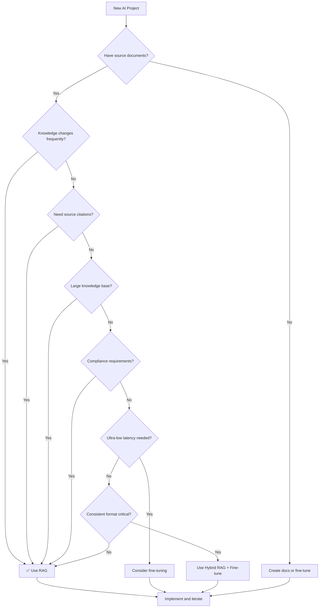

# When to Use RAG

## Introduction

RAG is not the right solution for every AI application. While it's become the dominant pattern for enterprise AI, understanding when RAG provides clear advantages — and when alternatives might be better — is crucial for making sound architectural decisions.

This section provides a practical decision framework for RAG adoption, covering the primary use cases where RAG shines and the situations where you should consider other approaches.

### What We'll Cover

- Primary indicators for RAG adoption
- Private and proprietary data scenarios
- Frequently changing information requirements
- Source attribution and compliance needs
- Limited training data situations
- When NOT to use RAG

### Prerequisites

- Understanding of RAG architecture (previous sections)
- Familiarity with RAG vs fine-tuning trade-offs
- Knowledge of your application requirements

---

## The RAG Decision Framework

Before evaluating specific scenarios, use this quick checklist:

### Strong Indicators for RAG

| Indicator | Weight |
|-----------|--------|
| ✅ Need to answer questions about private/proprietary data | High |
| ✅ Information changes weekly or more frequently | High |
| ✅ Must cite sources or provide audit trail | High |
| ✅ Knowledge base is too large for context window | High |
| ✅ Need to launch quickly (days, not weeks) | Medium |
| ✅ Want to test and iterate on knowledge without retraining | Medium |
| ✅ Users may ask questions about specific documents | Medium |

### Indicators Against RAG

| Indicator | Weight |
|-----------|--------|
| ❌ Static knowledge that rarely changes | Medium |
| ❌ Behavior/style consistency more important than facts | Medium |
| ❌ Ultra-low latency requirements (<100ms) | High |
| ❌ Very high query volume with simple, repetitive queries | Medium |
| ❌ No access to document sources | High |

---

## Use Case 1: Private and Proprietary Data

**This is the #1 reason organizations adopt RAG.**

LLMs are trained on public internet data. They know nothing about:
- Your company's internal documents
- Customer-specific information
- Proprietary research and data
- Internal processes and procedures

### Examples

| Domain | Private Data | RAG Application |
|--------|--------------|-----------------|
| **HR** | Employee handbook, policies, benefits | "What's our parental leave policy?" |
| **Legal** | Contracts, case files, precedents | "Find clauses about liability in vendor contracts" |
| **Engineering** | Internal docs, runbooks, architecture | "How do I deploy to the staging environment?" |
| **Sales** | Product specs, pricing, proposals | "What's our enterprise tier pricing?" |
| **Customer Support** | Account history, tickets, preferences | "Show me this customer's past interactions" |

### Implementation Pattern

```python
def private_data_rag(query: str, user_id: str):
    """RAG over private organizational data with access control."""
    
    # Get user's access permissions
    user_permissions = get_user_permissions(user_id)
    
    # Filter retrieval by access level
    filters = {
        "type": "in",
        "key": "access_level",
        "value": user_permissions
    }
    
    # Retrieve from private knowledge base
    results = client.vector_stores.search(
        vector_store_id=PRIVATE_KB_ID,
        query=query,
        filters=filters,
        max_num_results=10
    )
    
    # Generate grounded response
    context = format_results(results)
    response = generate_with_sources(query, context)
    
    return response
```

### Key Considerations

| Consideration | Implementation |
|---------------|----------------|
| **Access Control** | Filter retrieval based on user permissions |
| **Data Classification** | Tag documents with sensitivity levels |
| **Audit Logging** | Track who accessed what information |
| **Data Residency** | Keep data in compliant regions |

> **🔒 Security Note:** RAG allows you to keep sensitive data in your infrastructure while still leveraging powerful LLMs. The LLM never sees documents that aren't retrieved for a specific query.

---

## Use Case 2: Frequently Changing Information

**RAG excels when knowledge evolves faster than you can retrain models.**

### Update Frequency Guide

| Update Frequency | RAG Fit | Example |
|------------------|---------|---------|
| Real-time | ⭐⭐⭐⭐⭐ | Stock prices, inventory levels |
| Daily | ⭐⭐⭐⭐⭐ | News, support tickets |
| Weekly | ⭐⭐⭐⭐⭐ | Product catalogs, docs |
| Monthly | ⭐⭐⭐⭐ | Policies, procedures |
| Quarterly | ⭐⭐⭐ | Consider both RAG and fine-tuning |
| Annually | ⭐⭐ | Fine-tuning may be more efficient |
| Never | ⭐ | Fine-tuning likely better |

### Examples

| Scenario | Why RAG |
|----------|---------|
| **E-commerce product catalog** | Products added/removed daily |
| **Legal research** | New case law and regulations |
| **IT support knowledge base** | New issues and solutions constantly |
| **Financial analysis** | Market data changes continuously |
| **News-based applications** | Information evolves by the hour |

### Implementation Pattern

```python
import schedule
import time

def scheduled_knowledge_update():
    """Keep RAG knowledge base current with automated updates."""
    
    # Detect changes since last sync
    changes = detect_document_changes(
        source="s3://company-docs/",
        since=last_sync_time
    )
    
    if changes["new"] or changes["modified"]:
        # Process new and modified documents
        for doc_path in changes["new"] + changes["modified"]:
            doc = load_document(doc_path)
            chunks = process_and_chunk(doc)
            embeddings = embed_chunks(chunks)
            upsert_to_index(embeddings, doc_path)
    
    if changes["deleted"]:
        # Remove deleted documents
        for doc_path in changes["deleted"]:
            delete_from_index(doc_path)
    
    log_sync_completion(changes)

# Run every hour
schedule.every(1).hours.do(scheduled_knowledge_update)

while True:
    schedule.run_pending()
    time.sleep(60)
```

### Real-Time Integration

For truly real-time data, combine RAG with live queries:

```python
def hybrid_realtime_rag(query: str):
    """Combine static RAG with real-time data sources."""
    
    # Static knowledge from RAG
    static_context = retrieve_from_index(query)
    
    # Real-time data from APIs
    if needs_live_data(query):
        live_data = fetch_live_data(query)
        combined_context = f"{static_context}\n\nLive Data:\n{live_data}"
    else:
        combined_context = static_context
    
    return generate_response(query, combined_context)
```

---

## Use Case 3: Source Attribution and Citations

**RAG is essential when users need to verify information or you need audit trails.**

### Compliance-Driven Industries

| Industry | Requirement | RAG Benefit |
|----------|-------------|-------------|
| **Healthcare** | HIPAA, clinical decisions | Cite medical guidelines |
| **Finance** | SEC regulations, fiduciary duty | Link to source documents |
| **Legal** | Evidence standards | Reference case law |
| **Government** | FOIA, transparency | Audit trail required |
| **Education** | Academic integrity | Source all claims |

### Citation Implementation

```python
def generate_with_citations(query: str, results: list[dict]) -> dict:
    """Generate response with inline citations."""
    
    # Format context with source IDs
    context_parts = []
    sources = {}
    
    for i, result in enumerate(results):
        source_id = f"[{i+1}]"
        sources[source_id] = {
            "filename": result["filename"],
            "url": result.get("url"),
            "page": result.get("page"),
            "relevance_score": result["score"]
        }
        context_parts.append(f"{source_id} {result['text']}")
    
    context = "\n\n".join(context_parts)
    
    # Prompt for inline citations
    response = client.chat.completions.create(
        model="gpt-4.1",
        messages=[
            {
                "role": "developer",
                "content": """Answer using only the provided sources.
Use inline citations like [1], [2] to reference sources.
If you cannot answer from the sources, say so."""
            },
            {
                "role": "user",
                "content": f"Sources:\n{context}\n\nQuestion: {query}"
            }
        ]
    )
    
    return {
        "answer": response.choices[0].message.content,
        "sources": sources
    }
```

**Example output:**
```json
{
  "answer": "According to company policy, employees receive 25 days of PTO annually [1], which accrues at approximately 2.08 days per month [1]. Unused PTO can be carried over, up to a maximum of 10 days [2].",
  "sources": {
    "[1]": {
      "filename": "hr-handbook-2025.pdf",
      "page": 23,
      "relevance_score": 0.92
    },
    "[2]": {
      "filename": "pto-policy-update.pdf",
      "page": 1,
      "relevance_score": 0.87
    }
  }
}
```

### Audit Trail

```python
def log_rag_interaction(query_id: str, query: str, results: list, response: str):
    """Create audit log for compliance."""
    
    audit_record = {
        "query_id": query_id,
        "timestamp": datetime.now().isoformat(),
        "user_id": get_current_user_id(),
        "query": query,
        "retrieved_documents": [
            {
                "doc_id": r["id"],
                "filename": r["filename"],
                "score": r["score"],
                "chunk_text": r["text"][:500]  # First 500 chars
            }
            for r in results
        ],
        "generated_response": response,
        "model_used": "gpt-4.1",
        "citations_extracted": extract_citations(response)
    }
    
    audit_store.insert(audit_record)
    return audit_record["query_id"]
```

---

## Use Case 4: Large Knowledge Bases

**When your knowledge exceeds what fits in a context window, RAG is the solution.**

### Context Window Limits

| Model | Context Window | Approximate Pages |
|-------|----------------|-------------------|
| GPT-4.1 | 128K tokens | ~250 pages |
| Claude claude-sonnet-4-20250514 | 200K tokens | ~400 pages |
| Gemini 3.0 | 1M tokens | ~2000 pages |

Even with large context windows, RAG is often better:

| Approach | Pros | Cons |
|----------|------|------|
| **Long Context** | Simple, no retrieval | Expensive per query, slow |
| **RAG** | Efficient, scalable | Retrieval complexity |

### Scale Considerations

```python
# Long context cost for 500-page knowledge base
pages = 500
tokens_per_page = 500
total_tokens = pages * tokens_per_page  # 250,000 tokens

# Cost per query with GPT-4.1
input_cost_per_1m = 2.00
cost_per_query = (total_tokens / 1_000_000) * input_cost_per_1m
print(f"Long context cost per query: ${cost_per_query:.2f}")  # $0.50

# RAG cost for same query
retrieval_cost = 0.01  # Embedding + search
context_tokens = 4000  # Retrieved chunks only
rag_llm_cost = (context_tokens / 1_000_000) * input_cost_per_1m
rag_total = retrieval_cost + rag_llm_cost
print(f"RAG cost per query: ${rag_total:.3f}")  # $0.018

# At 10,000 queries/month:
print(f"Long context monthly: ${cost_per_query * 10000:.0f}")  # $5,000
print(f"RAG monthly: ${rag_total * 10000:.0f}")  # $180
```

---

## Use Case 5: Compliance Requirements

**Regulated industries often mandate RAG-like architectures.**

### Regulatory Drivers

| Regulation | Requirement | RAG Solution |
|------------|-------------|--------------|
| **GDPR** | Right to explanation | Source attribution |
| **HIPAA** | Minimum necessary access | Filtered retrieval |
| **SOX** | Audit trails | Logged interactions |
| **FINRA** | Recordkeeping | Query/response history |
| **CCPA** | Data access rights | User-scoped retrieval |

### Compliance Implementation

```python
class ComplianceRAG:
    """RAG system with built-in compliance features."""
    
    def __init__(self, config: dict):
        self.audit_logger = AuditLogger(config["audit_store"])
        self.access_controller = AccessController(config["access_rules"])
        self.data_classifier = DataClassifier()
    
    def query(self, query: str, user: User) -> dict:
        """Execute compliant RAG query."""
        
        # 1. Check user authorization
        if not self.access_controller.can_query(user):
            raise UnauthorizedError("User not authorized to query")
        
        # 2. Filter by user's data access level
        allowed_sources = self.access_controller.get_allowed_sources(user)
        
        # 3. Retrieve with access control
        results = self.retrieve(query, source_filter=allowed_sources)
        
        # 4. Check data classification
        for result in results:
            classification = self.data_classifier.classify(result)
            if not self.access_controller.can_access(user, classification):
                results.remove(result)
        
        # 5. Generate response
        response = self.generate(query, results)
        
        # 6. Log for compliance
        self.audit_logger.log(
            user=user,
            query=query,
            results=results,
            response=response
        )
        
        return {
            "answer": response,
            "sources": results,
            "audit_id": self.audit_logger.last_id
        }
```

---

## When NOT to Use RAG

RAG isn't always the right choice. Consider alternatives when:

### 1. Pure Behavioral/Style Requirements

If you need consistent output format or tone, fine-tuning is often better:

```python
# Fine-tuning is better for:
# - Specific response templates
# - Brand voice consistency
# - Structured output formats

# Example: You want all responses in a specific format
desired_format = """
Summary: [one sentence]
Details: [bullet points]
Recommendation: [actionable advice]
"""
# Fine-tune on examples following this format
```

### 2. Ultra-Low Latency

RAG adds retrieval latency. If you need <100ms responses:

| Component | Typical Latency |
|-----------|-----------------|
| Query embedding | 50-100ms |
| Vector search | 20-100ms |
| Reranking | 100-200ms |
| LLM generation | 500-2000ms |
| **Total RAG** | 700-2500ms |
| **Fine-tuned only** | 500-1500ms |

### 3. Small, Static Knowledge

If your knowledge fits in a prompt and rarely changes:

```python
# For small, static knowledge, just include it in the prompt
STATIC_KNOWLEDGE = """
Our return policy:
- 30 days for full refund
- 60 days for store credit
- Original packaging required
"""

def simple_qa(query: str):
    return client.chat.completions.create(
        model="gpt-4.1-mini",  # Cheaper model is fine
        messages=[
            {"role": "system", "content": f"Use this information:\n{STATIC_KNOWLEDGE}"},
            {"role": "user", "content": query}
        ]
    )
```

### 4. No Source Documents Available

RAG requires source documents. If you only have:
- Tacit knowledge from experts
- Unwritten procedures
- Abstract patterns

Consider:
- Creating documentation first, then RAG
- Fine-tuning on examples
- Prompt engineering alone

---

## Decision Flowchart



---

## Hands-on Exercise

### Your Task

Evaluate a hypothetical use case and decide whether RAG is appropriate.

### Scenario

A hospital wants to build an AI assistant that:
1. Answers questions about hospital policies and procedures
2. Provides drug interaction warnings based on patient medications
3. Helps doctors find relevant clinical guidelines
4. Must comply with HIPAA regulations
5. Information updates monthly

### Questions to Answer

1. Is RAG appropriate for this use case? Why or why not?
2. Which of the five indicators apply?
3. What compliance considerations are critical?
4. Would you recommend any hybrid approach?

<details>
<summary>💡 Hints</summary>

- Consider each requirement separately
- Think about source attribution needs
- Consider access control requirements
- Think about update frequency for each type of information

</details>

<details>
<summary>✅ Analysis</summary>

**Is RAG appropriate?** ✅ Yes, strongly recommended

**Indicators that apply:**
1. ✅ **Private data** — Hospital policies, patient medications, internal guidelines
2. ✅ **Source attribution** — Critical for clinical decisions ("Per guideline X...")
3. ✅ **Compliance** — HIPAA requires audit trails and access control
4. ✅ **Changing information** — Monthly updates, drug databases change frequently
5. ✅ **Large knowledge base** — Clinical guidelines, drug databases, policies

**Compliance considerations:**
- Role-based access (doctors vs nurses vs admin)
- Patient data must be retrieved only for authorized users
- Audit logging of all queries and responses
- Drug interaction data must be current
- Sources must be cited for clinical decisions

**Recommended approach:**
- RAG with strict access control
- Separate indexes for different data types
- Real-time sync for drug interaction database
- Monthly sync for policies and guidelines
- Full audit logging for HIPAA compliance

</details>

---

## Summary

RAG is the right choice when you need to work with private, changing, or citable information:

✅ **Private data** — LLMs don't know your internal information
✅ **Changing information** — Update knowledge in minutes, not days
✅ **Source attribution** — Essential for trust and compliance
✅ **Large knowledge bases** — More efficient than long context
✅ **Compliance requirements** — Audit trails and access control built-in

**Not ideal for:** Pure behavioral tasks, ultra-low latency, tiny static knowledge bases.

**Up Next:** Continue to [Lesson 2: Document Ingestion Pipeline](../02-document-ingestion-pipeline/00-document-ingestion-pipeline.md) to learn how to build the ingestion component of your RAG system.

---

## Further Reading

- [OpenAI RAG Best Practices](https://platform.openai.com/docs/guides/retrieval) - Production patterns
- [HIPAA AI Compliance](https://www.hhs.gov/hipaa/for-professionals/security/guidance/index.html) - Healthcare requirements
- [Enterprise RAG Patterns](https://docs.llamaindex.ai/en/stable/understanding/rag/) - LlamaIndex guide
- [When to Fine-tune](https://platform.openai.com/docs/guides/fine-tuning/when-to-use-fine-tuning) - OpenAI guidance

<!--
Sources Consulted:
- OpenAI Retrieval Guide: https://platform.openai.com/docs/guides/retrieval
- OpenAI Accuracy Optimization: https://platform.openai.com/docs/guides/optimizing-llm-accuracy
- Anthropic Contextual Retrieval: https://www.anthropic.com/news/contextual-retrieval
- LlamaIndex Documentation: https://docs.llamaindex.ai/
-->
