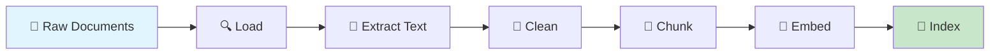
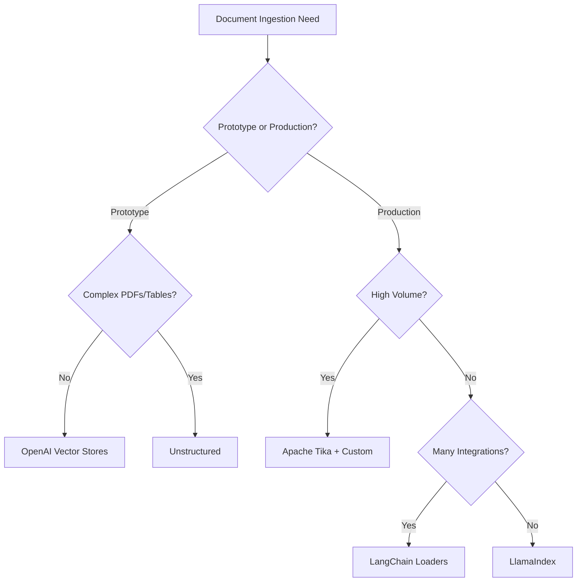

# Document Ingestion Pipeline

## Introduction

The ingestion pipeline is the foundation of every RAG system. Before you can retrieve relevant information, you must first transform raw documents — PDFs, web pages, emails, spreadsheets — into searchable vector representations. This process involves loading, extracting, cleaning, and indexing your data.

A well-designed ingestion pipeline determines your RAG system's accuracy, freshness, and scalability. Poor ingestion leads to poor retrieval, which cascades into poor generation.

### What We'll Cover

- Document source types and their unique challenges
- Loading strategies for files, APIs, databases, and streams
- Text extraction from complex layouts
- Metadata extraction and enrichment
- Cleaning and preprocessing for quality
- Scheduling updates for freshness

### Prerequisites

- Understanding of RAG architecture (Lesson 1)
- Basic Python file handling
- Familiarity with common document formats

---

## Quick Start: Minimal Ingestion Pipeline

Before diving into details, here's a complete working ingestion pipeline in ~30 lines:

```python
from openai import OpenAI
import os

client = OpenAI()

# Step 1: Create a vector store
vector_store = client.vector_stores.create(name="My Documents")

# Step 2: Upload files with automatic parsing
files_to_upload = ["report.pdf", "manual.docx", "data.txt"]

for file_path in files_to_upload:
    with open(file_path, "rb") as f:
        # OpenAI handles: parsing, chunking, embedding, indexing
        result = client.vector_stores.files.upload_and_poll(
            vector_store_id=vector_store.id,
            file=f,
            chunking_strategy={
                "type": "static",
                "max_chunk_size_tokens": 800,
                "chunk_overlap_tokens": 400
            }
        )
        print(f"✅ Uploaded {file_path}: {result.status}")

# Step 3: Verify ingestion
files = client.vector_stores.files.list(vector_store_id=vector_store.id)
print(f"\n📚 Total files in vector store: {len(list(files))}")
```

**Output:**
```
✅ Uploaded report.pdf: completed
✅ Uploaded manual.docx: completed
✅ Uploaded data.txt: completed

📚 Total files in vector store: 3
```

> **Note:** OpenAI's managed vector stores handle parsing for common formats automatically. For custom requirements, you'll build your own pipeline using tools like Unstructured, LlamaIndex, or LangChain.

---

## The Ingestion Pipeline Stages

Every ingestion pipeline follows this general flow:



| Stage | Purpose | Key Considerations |
|-------|---------|-------------------|
| **Load** | Access documents from various sources | Connectors, authentication, rate limits |
| **Extract** | Get text content from raw formats | Format-specific parsers, OCR, layouts |
| **Clean** | Remove noise and normalize | Boilerplate, whitespace, encoding |
| **Chunk** | Split into retrievable units | Size, overlap, semantic boundaries |
| **Embed** | Convert to vector representations | Model selection, batching |
| **Index** | Store for efficient retrieval | Vector database, metadata |

---

## Key Terminology

| Term | Definition |
|------|------------|
| **Document Loader** | Component that reads files from a source and returns structured content |
| **Parser** | Extracts text and structure from specific file formats (PDF, DOCX, HTML) |
| **OCR** | Optical Character Recognition — extracting text from images/scans |
| **Metadata** | Structured information about a document (author, date, category) |
| **Boilerplate** | Repeated content (headers, footers, navigation) that adds noise |
| **Chunking Strategy** | Method for splitting documents into retrievable pieces |
| **Incremental Ingestion** | Processing only new or changed documents |
| **Connector** | Integration that pulls documents from external systems (S3, Notion, etc.) |

---

## Tool Comparison

| Tool | Best For | Supported Formats | Complexity |
|------|----------|-------------------|------------|
| **OpenAI Vector Stores** | Quick start, managed service | PDF, DOCX, TXT, MD, HTML | Low |
| **Unstructured** | Complex layouts, enterprise PDFs | 45+ formats, OCR, tables | Medium |
| **LlamaIndex** | Python-native, flexible pipelines | 20+ via LlamaHub | Medium |
| **LangChain** | Integration ecosystem | 100+ loaders | Medium |
| **Apache Tika** | Enterprise, high-volume | 1000+ formats | High |
| **Custom Python** | Specific requirements | Any with code | Variable |

### When to Use Each



---

## Lesson Structure

This lesson covers six essential topics:

| Section | Topic | You'll Learn |
|---------|-------|--------------|
| [01](./01-document-source-types.md) | Document Source Types | PDF, HTML, Office, email parsing |
| [02](./02-document-loading-strategies.md) | Loading Strategies | File system, URL, API, database access |
| [03](./03-text-extraction-challenges.md) | Text Extraction | OCR, layouts, tables, multi-column |
| [04](./04-metadata-extraction.md) | Metadata Extraction | Properties, dates, tags, custom fields |
| [05](./05-cleaning-preprocessing.md) | Cleaning & Preprocessing | Normalization, noise removal, quality |
| [06](./06-ingestion-scheduling-updates.md) | Scheduling & Updates | Bulk, incremental, change detection |

---

## Learning Objectives

By the end of this lesson, you will be able to:

1. ✅ Build ingestion pipelines for PDF, HTML, Office documents, and more
2. ✅ Load documents from file systems, URLs, APIs, and databases
3. ✅ Handle OCR, complex layouts, and extraction challenges
4. ✅ Extract and enrich document metadata for filtering
5. ✅ Clean and preprocess text for optimal retrieval quality
6. ✅ Design scheduling strategies for keeping knowledge current

---

## Hands-on Exercise Preview

Throughout this lesson, you'll build a complete ingestion pipeline that:

1. Loads documents from multiple sources (local files + web URLs)
2. Parses various formats (PDF, HTML, Markdown)
3. Extracts and enriches metadata
4. Cleans and normalizes content
5. Implements incremental updates

By the end, you'll have a production-ready ingestion system.

---

**Next:** [Document Source Types](./01-document-source-types.md) — Learn to parse PDFs, HTML, Office documents, and more.

---

## Further Reading

- [OpenAI Vector Stores API](https://platform.openai.com/docs/guides/retrieval) - Managed ingestion
- [Unstructured Documentation](https://docs.unstructured.io/) - Enterprise document parsing
- [LlamaIndex Loading Guide](https://docs.llamaindex.ai/en/stable/module_guides/loading/) - Flexible loaders
- [LangChain Document Loaders](https://python.langchain.com/docs/concepts/document_loaders/) - Integration ecosystem

<!--
Sources Consulted:
- OpenAI Retrieval Guide: https://platform.openai.com/docs/guides/retrieval
- LlamaIndex SimpleDirectoryReader: https://developers.llamaindex.ai/python/framework/module_guides/loading/simpledirectoryreader/
- Unstructured Overview: https://docs.unstructured.io/open-source/introduction/overview
- LangChain Integrations: https://python.langchain.com/docs/integrations/document_loaders/
-->
