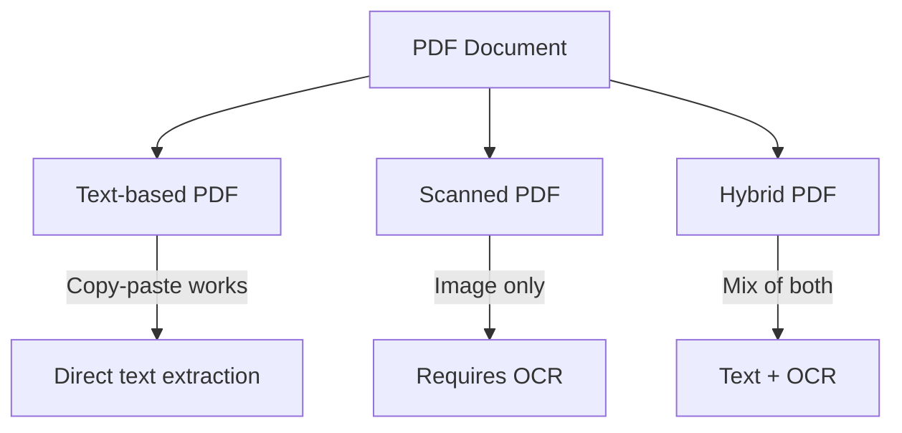

# Document Source Types

## Introduction

RAG systems must handle an enormous variety of document formats. PDFs from legal contracts, HTML from web pages, Word documents from business reports, spreadsheets with structured data, and email threads with conversation history — each format presents unique extraction challenges.

This section covers the major document types you'll encounter and the tools and techniques for extracting quality text from each.

### What We'll Cover

- PDF extraction: text-based, scanned, and hybrid PDFs
- HTML parsing: content extraction, boilerplate removal
- Plain text handling: encoding and normalization
- Office documents: DOCX, XLSX, PPTX processing
- Email and chat logs: threading and metadata

### Prerequisites

- Basic understanding of file formats
- Python fundamentals
- Familiarity with the ingestion pipeline concept

---

## Format Landscape

| Format | Complexity | Common Sources | Key Challenges |
|--------|------------|----------------|----------------|
| **PDF** | High | Reports, contracts, papers | Layout, scans, tables |
| **HTML** | Medium | Web pages, knowledge bases | Boilerplate, navigation |
| **Plain Text** | Low | Logs, transcripts, README | Encoding, structure |
| **DOCX** | Medium | Business docs, manuals | Styles, embedded objects |
| **XLSX** | Medium | Data, financial reports | Structure, formulas |
| **PPTX** | Medium | Presentations, slides | Slide order, speaker notes |
| **Email** | High | Correspondence, threads | Threading, attachments |
| **Markdown** | Low | Documentation, READMEs | Front matter, links |

---

## PDF Extraction

PDFs are the most common and challenging format in enterprise RAG systems.

### Types of PDFs



| PDF Type | Detection | Extraction Method |
|----------|-----------|-------------------|
| **Text-based** | Text is selectable | Direct extraction with PyMuPDF/pdfplumber |
| **Scanned** | Text not selectable | OCR required (Tesseract, Document AI) |
| **Hybrid** | Partial text | Combine direct + OCR |

### Basic PDF Extraction with PyMuPDF

```python
import fitz  # PyMuPDF

def extract_pdf_text(pdf_path: str) -> list[dict]:
    """Extract text from each page of a PDF."""
    doc = fitz.open(pdf_path)
    pages = []
    
    for page_num, page in enumerate(doc):
        text = page.get_text("text")  # Get plain text
        
        pages.append({
            "page_number": page_num + 1,
            "text": text,
            "char_count": len(text)
        })
    
    doc.close()
    return pages

# Usage
pages = extract_pdf_text("annual_report.pdf")
for page in pages[:2]:
    print(f"Page {page['page_number']}: {page['char_count']} chars")
    print(page['text'][:200])
    print("---")
```

**Output:**
```
Page 1: 2847 chars
ANNUAL REPORT 2024

To Our Shareholders,

We are pleased to present our annual report for the fiscal year ending December 31, 2024. This year marked significant milestones in our journey toward...
---
Page 2: 3102 chars
FINANCIAL HIGHLIGHTS

Revenue grew 23% year-over-year, reaching $4.2 billion. Operating margin improved to 18.5%, up from 15.2% in the prior year...
---
```

### Handling PDF Tables with pdfplumber

```python
import pdfplumber

def extract_tables(pdf_path: str) -> list[dict]:
    """Extract tables from a PDF."""
    tables_found = []
    
    with pdfplumber.open(pdf_path) as pdf:
        for page_num, page in enumerate(pdf.pages):
            tables = page.extract_tables()
            
            for table_idx, table in enumerate(tables):
                if table:
                    # Convert to list of dicts using first row as headers
                    headers = table[0]
                    rows = [dict(zip(headers, row)) for row in table[1:]]
                    
                    tables_found.append({
                        "page": page_num + 1,
                        "table_index": table_idx,
                        "headers": headers,
                        "rows": rows,
                        "row_count": len(rows)
                    })
    
    return tables_found

# Usage
tables = extract_tables("financial_data.pdf")
for table in tables:
    print(f"Table on page {table['page']}: {table['row_count']} rows")
    print(f"Columns: {table['headers']}")
```

### Using Unstructured for Complex PDFs

```python
from unstructured.partition.pdf import partition_pdf

def extract_with_unstructured(pdf_path: str) -> list[dict]:
    """Extract PDF with Unstructured for complex layouts."""
    elements = partition_pdf(
        filename=pdf_path,
        strategy="hi_res",  # Use vision model for layout
        infer_table_structure=True,
        extract_images_in_pdf=False
    )
    
    extracted = []
    for element in elements:
        extracted.append({
            "type": type(element).__name__,
            "text": str(element),
            "metadata": element.metadata.to_dict()
        })
    
    return extracted

# Usage
elements = extract_with_unstructured("complex_report.pdf")
for el in elements[:5]:
    print(f"[{el['type']}] {el['text'][:100]}...")
```

**Output:**
```
[Title] QUARTERLY FINANCIAL REPORT Q4 2024...
[NarrativeText] The company achieved record revenue of $4.2B in Q4...
[Table] Revenue | Q4 2024 | Q4 2023 | Change\nProduct | $2.1B | $1.7B | +24%...
[NarrativeText] Our strategic investments in AI infrastructure...
[ListItem] • Cloud services grew 45% year-over-year...
```

> **🔑 Key Insight:** Unstructured identifies document elements (titles, paragraphs, tables, lists) which improves chunking quality by respecting document structure.

---

## HTML Parsing

Web pages contain valuable content but also significant noise (navigation, ads, scripts).

### Basic HTML Extraction

```python
from bs4 import BeautifulSoup
import requests

def extract_html_content(url: str) -> dict:
    """Extract main content from a web page."""
    response = requests.get(url, timeout=30)
    soup = BeautifulSoup(response.content, 'html.parser')
    
    # Remove script and style elements
    for element in soup(['script', 'style', 'nav', 'header', 'footer', 'aside']):
        element.decompose()
    
    # Get title
    title = soup.find('title')
    title_text = title.get_text() if title else "Untitled"
    
    # Get main content (try common selectors)
    main_content = (
        soup.find('main') or 
        soup.find('article') or 
        soup.find('div', class_='content') or
        soup.find('body')
    )
    
    text = main_content.get_text(separator='\n', strip=True) if main_content else ""
    
    return {
        "url": url,
        "title": title_text,
        "text": text,
        "word_count": len(text.split())
    }

# Usage
content = extract_html_content("https://docs.example.com/guide")
print(f"Title: {content['title']}")
print(f"Words: {content['word_count']}")
```

### Intelligent Content Extraction with Trafilatura

```python
import trafilatura

def extract_article(url: str) -> dict:
    """Extract article content with Trafilatura (ML-based)."""
    downloaded = trafilatura.fetch_url(url)
    
    if downloaded:
        # Extract main content
        text = trafilatura.extract(
            downloaded,
            include_comments=False,
            include_tables=True,
            no_fallback=False
        )
        
        # Extract metadata
        metadata = trafilatura.extract_metadata(downloaded)
        
        return {
            "url": url,
            "title": metadata.title if metadata else None,
            "author": metadata.author if metadata else None,
            "date": metadata.date if metadata else None,
            "text": text or "",
            "word_count": len(text.split()) if text else 0
        }
    
    return {"url": url, "error": "Failed to fetch"}

# Usage
article = extract_article("https://blog.example.com/ai-trends-2025")
print(f"Title: {article['title']}")
print(f"Author: {article['author']}")
print(f"Date: {article['date']}")
print(f"Content preview: {article['text'][:200]}...")
```

### HTML Parsing Strategies Comparison

| Tool | Best For | Handles Boilerplate | Speed |
|------|----------|-------------------|-------|
| **BeautifulSoup** | Custom extraction, known structure | Manual | Fast |
| **Trafilatura** | Articles, blog posts | Automatic | Medium |
| **Newspaper3k** | News articles | Automatic | Medium |
| **Readability** | General web pages | Automatic | Fast |
| **Playwright/Selenium** | JavaScript-rendered content | Manual | Slow |

---

## Plain Text Handling

Plain text seems simple, but encoding issues and lack of structure create challenges.

### Encoding Detection and Normalization

```python
import chardet
import unicodedata

def load_text_file(file_path: str) -> dict:
    """Load text file with automatic encoding detection."""
    # Detect encoding
    with open(file_path, 'rb') as f:
        raw = f.read()
        detected = chardet.detect(raw)
    
    encoding = detected['encoding'] or 'utf-8'
    confidence = detected['confidence']
    
    # Decode with detected encoding
    text = raw.decode(encoding, errors='replace')
    
    # Normalize unicode (NFC form)
    text = unicodedata.normalize('NFC', text)
    
    return {
        "file_path": file_path,
        "encoding": encoding,
        "confidence": confidence,
        "text": text,
        "line_count": text.count('\n') + 1
    }

# Usage
result = load_text_file("legacy_document.txt")
print(f"Detected encoding: {result['encoding']} ({result['confidence']:.0%} confidence)")
print(f"Lines: {result['line_count']}")
```

### Structured Text Formats

```python
import json
import csv
import yaml
from io import StringIO

def parse_structured_text(content: str, format_type: str) -> list[dict]:
    """Parse structured text formats into documents."""
    
    if format_type == "json":
        data = json.loads(content)
        if isinstance(data, list):
            return data
        return [data]
    
    elif format_type == "jsonl":
        return [json.loads(line) for line in content.strip().split('\n') if line]
    
    elif format_type == "csv":
        reader = csv.DictReader(StringIO(content))
        return list(reader)
    
    elif format_type == "yaml":
        data = yaml.safe_load(content)
        if isinstance(data, list):
            return data
        return [data]
    
    else:
        raise ValueError(f"Unknown format: {format_type}")

# Usage
csv_content = """name,department,expertise
Alice Chen,Engineering,Machine Learning
Bob Smith,Research,NLP
Carol Jones,Product,AI Strategy"""

records = parse_structured_text(csv_content, "csv")
for record in records:
    print(f"{record['name']} - {record['expertise']}")
```

---

## Office Documents

Microsoft Office formats (DOCX, XLSX, PPTX) are ubiquitous in enterprise settings.

### DOCX Processing with python-docx

```python
from docx import Document as DocxDocument

def extract_docx(file_path: str) -> dict:
    """Extract text and structure from DOCX."""
    doc = DocxDocument(file_path)
    
    content = {
        "paragraphs": [],
        "tables": [],
        "headers": [],
        "metadata": {}
    }
    
    # Extract paragraphs with style info
    for para in doc.paragraphs:
        if para.text.strip():
            content["paragraphs"].append({
                "text": para.text,
                "style": para.style.name if para.style else "Normal"
            })
            
            # Track headers
            if para.style and "Heading" in para.style.name:
                content["headers"].append(para.text)
    
    # Extract tables
    for table_idx, table in enumerate(doc.tables):
        rows = []
        for row in table.rows:
            cells = [cell.text for cell in row.cells]
            rows.append(cells)
        content["tables"].append({
            "index": table_idx,
            "rows": rows
        })
    
    # Extract core properties
    props = doc.core_properties
    content["metadata"] = {
        "author": props.author,
        "created": str(props.created) if props.created else None,
        "modified": str(props.modified) if props.modified else None,
        "title": props.title
    }
    
    return content

# Usage
docx_content = extract_docx("product_spec.docx")
print(f"Paragraphs: {len(docx_content['paragraphs'])}")
print(f"Tables: {len(docx_content['tables'])}")
print(f"Headers: {docx_content['headers'][:5]}")
```

### XLSX Processing with openpyxl

```python
from openpyxl import load_workbook

def extract_xlsx(file_path: str) -> dict:
    """Extract data from Excel workbook."""
    wb = load_workbook(file_path, data_only=True)  # data_only gets values, not formulas
    
    sheets = {}
    
    for sheet_name in wb.sheetnames:
        sheet = wb[sheet_name]
        data = []
        
        # Get headers from first row
        headers = [cell.value for cell in sheet[1]]
        
        # Extract rows
        for row_idx, row in enumerate(sheet.iter_rows(min_row=2), start=2):
            row_data = {}
            for col_idx, cell in enumerate(row):
                if col_idx < len(headers) and headers[col_idx]:
                    row_data[headers[col_idx]] = cell.value
            if any(row_data.values()):  # Skip empty rows
                data.append(row_data)
        
        sheets[sheet_name] = {
            "headers": headers,
            "rows": data,
            "row_count": len(data)
        }
    
    wb.close()
    return sheets

# Usage
excel_data = extract_xlsx("sales_data.xlsx")
for sheet_name, sheet in excel_data.items():
    print(f"Sheet '{sheet_name}': {sheet['row_count']} rows")
    print(f"  Columns: {sheet['headers']}")
```

### PPTX Processing

```python
from pptx import Presentation

def extract_pptx(file_path: str) -> list[dict]:
    """Extract slides from PowerPoint."""
    prs = Presentation(file_path)
    slides = []
    
    for slide_num, slide in enumerate(prs.slides, start=1):
        slide_content = {
            "slide_number": slide_num,
            "title": "",
            "content": [],
            "notes": ""
        }
        
        # Extract shapes (text boxes, titles, etc.)
        for shape in slide.shapes:
            if hasattr(shape, "text"):
                text = shape.text.strip()
                if text:
                    # Check if it's the title
                    if shape.is_placeholder and shape.placeholder_format.type == 1:
                        slide_content["title"] = text
                    else:
                        slide_content["content"].append(text)
        
        # Extract speaker notes
        if slide.has_notes_slide:
            notes_slide = slide.notes_slide
            slide_content["notes"] = notes_slide.notes_text_frame.text
        
        slides.append(slide_content)
    
    return slides

# Usage
slides = extract_pptx("q4_presentation.pptx")
for slide in slides[:3]:
    print(f"Slide {slide['slide_number']}: {slide['title']}")
    if slide['notes']:
        print(f"  Notes: {slide['notes'][:100]}...")
```

---

## Email and Chat Logs

Email contains valuable organizational knowledge but requires special handling for threading and attachments.

### Email Parsing (EML/MSG)

```python
import email
from email import policy
from pathlib import Path

def parse_email(file_path: str) -> dict:
    """Parse an email file (.eml)."""
    with open(file_path, 'rb') as f:
        msg = email.message_from_binary_file(f, policy=policy.default)
    
    # Extract headers
    email_data = {
        "subject": msg["subject"],
        "from": msg["from"],
        "to": msg["to"],
        "date": msg["date"],
        "message_id": msg["message-id"],
        "in_reply_to": msg.get("in-reply-to"),
        "body": "",
        "attachments": []
    }
    
    # Extract body
    if msg.is_multipart():
        for part in msg.walk():
            content_type = part.get_content_type()
            if content_type == "text/plain":
                email_data["body"] = part.get_content()
                break
            elif content_type == "text/html" and not email_data["body"]:
                # Fallback to HTML if no plain text
                email_data["body"] = part.get_content()
    else:
        email_data["body"] = msg.get_content()
    
    # List attachments
    for part in msg.iter_attachments():
        email_data["attachments"].append({
            "filename": part.get_filename(),
            "content_type": part.get_content_type(),
            "size": len(part.get_content())
        })
    
    return email_data

# Usage
email_content = parse_email("customer_inquiry.eml")
print(f"Subject: {email_content['subject']}")
print(f"From: {email_content['from']}")
print(f"Attachments: {len(email_content['attachments'])}")
```

### Building Email Threads

```python
from collections import defaultdict

def build_email_threads(emails: list[dict]) -> dict:
    """Group emails into conversation threads."""
    threads = defaultdict(list)
    
    # Index by message ID
    by_id = {e.get("message_id"): e for e in emails if e.get("message_id")}
    
    for email in emails:
        # Find thread root
        current = email
        while current.get("in_reply_to") and current["in_reply_to"] in by_id:
            current = by_id[current["in_reply_to"]]
        
        thread_id = current.get("message_id", current.get("subject", "unknown"))
        threads[thread_id].append(email)
    
    # Sort each thread by date
    for thread_id in threads:
        threads[thread_id].sort(key=lambda e: e.get("date", ""))
    
    return dict(threads)

# Usage
# emails = [parse_email(f) for f in email_files]
# threads = build_email_threads(emails)
# print(f"Found {len(threads)} conversation threads")
```

---

## Using LlamaIndex for Multi-Format Loading

LlamaIndex provides a unified interface for loading many document types:

```python
from llama_index.core import SimpleDirectoryReader

def load_directory_with_llamaindex(directory_path: str) -> list:
    """Load multiple document types from a directory."""
    reader = SimpleDirectoryReader(
        input_dir=directory_path,
        recursive=True,
        required_exts=[".pdf", ".docx", ".txt", ".html", ".md"],
        exclude=["*.log", "*.tmp"],
        num_files_limit=100
    )
    
    documents = reader.load_data()
    
    print(f"Loaded {len(documents)} documents")
    for doc in documents[:5]:
        print(f"  - {doc.metadata.get('file_name', 'unknown')}: {len(doc.text)} chars")
    
    return documents

# Usage
docs = load_directory_with_llamaindex("./knowledge_base/")
```

---

## Format Support Summary

| Format | Best Tool | Complexity | Notes |
|--------|-----------|------------|-------|
| PDF (text) | PyMuPDF, pdfplumber | Low | Direct extraction |
| PDF (scanned) | Unstructured + OCR | High | Needs Tesseract/Cloud |
| PDF (tables) | pdfplumber, Unstructured | Medium | Table detection critical |
| HTML | Trafilatura, BeautifulSoup | Low-Medium | Handle JavaScript sites |
| Plain Text | chardet + Python | Low | Watch encoding |
| DOCX | python-docx | Low | Preserve styles |
| XLSX | openpyxl | Low | Handle formulas |
| PPTX | python-pptx | Low | Include speaker notes |
| Email | email library | Medium | Threading is key |

---

## Hands-on Exercise

### Your Task

Build a multi-format document loader that:
1. Accepts a directory path
2. Loads PDF, DOCX, and TXT files
3. Extracts text and metadata from each
4. Returns a standardized list of documents

### Requirements

```python
def load_documents(directory: str) -> list[dict]:
    """
    Load documents from directory.
    
    Returns:
        List of documents, each with:
        - file_path: str
        - file_type: str (pdf, docx, txt)
        - text: str
        - metadata: dict
        - char_count: int
    """
    pass
```

<details>
<summary>💡 Hints</summary>

- Use `pathlib.Path.glob()` to find files by extension
- Combine the extraction functions from this lesson
- Handle errors gracefully (some files may fail)
- Normalize metadata keys across formats

</details>

<details>
<summary>✅ Solution</summary>

```python
from pathlib import Path
import fitz  # PyMuPDF
from docx import Document as DocxDocument
import chardet

def load_documents(directory: str) -> list[dict]:
    """Load PDF, DOCX, and TXT files from directory."""
    dir_path = Path(directory)
    documents = []
    
    for file_path in dir_path.rglob("*"):
        if file_path.is_file():
            try:
                doc = None
                
                if file_path.suffix.lower() == ".pdf":
                    doc = load_pdf(file_path)
                elif file_path.suffix.lower() == ".docx":
                    doc = load_docx(file_path)
                elif file_path.suffix.lower() == ".txt":
                    doc = load_txt(file_path)
                
                if doc:
                    documents.append(doc)
                    
            except Exception as e:
                print(f"Error loading {file_path}: {e}")
    
    return documents

def load_pdf(file_path: Path) -> dict:
    doc = fitz.open(str(file_path))
    text = "\n".join(page.get_text() for page in doc)
    doc.close()
    return {
        "file_path": str(file_path),
        "file_type": "pdf",
        "text": text,
        "metadata": {"page_count": len(doc)},
        "char_count": len(text)
    }

def load_docx(file_path: Path) -> dict:
    doc = DocxDocument(str(file_path))
    text = "\n".join(p.text for p in doc.paragraphs)
    props = doc.core_properties
    return {
        "file_path": str(file_path),
        "file_type": "docx",
        "text": text,
        "metadata": {
            "author": props.author,
            "title": props.title
        },
        "char_count": len(text)
    }

def load_txt(file_path: Path) -> dict:
    with open(file_path, 'rb') as f:
        raw = f.read()
    encoding = chardet.detect(raw)['encoding'] or 'utf-8'
    text = raw.decode(encoding, errors='replace')
    return {
        "file_path": str(file_path),
        "file_type": "txt",
        "text": text,
        "metadata": {"encoding": encoding},
        "char_count": len(text)
    }

# Usage
docs = load_documents("./my_docs/")
print(f"Loaded {len(docs)} documents")
```

</details>

---

## Summary

Document source types present varying challenges for RAG ingestion:

✅ **PDFs** require different strategies for text-based, scanned, and hybrid documents
✅ **HTML** needs intelligent content extraction to remove boilerplate
✅ **Plain text** requires encoding detection and normalization
✅ **Office documents** preserve structure through style-aware parsing
✅ **Email** benefits from threading for conversation context

**Up Next:** [Document Loading Strategies](./02-document-loading-strategies.md) — Learn to load from file systems, URLs, APIs, and databases.

---

## Further Reading

- [PyMuPDF Documentation](https://pymupdf.readthedocs.io/) - Fast PDF processing
- [Unstructured Partitioning](https://docs.unstructured.io/open-source/core-functionality/partitioning) - Element-based extraction
- [Trafilatura](https://trafilatura.readthedocs.io/) - Web content extraction
- [python-docx](https://python-docx.readthedocs.io/) - Word document processing

<!--
Sources Consulted:
- LlamaIndex SimpleDirectoryReader: https://developers.llamaindex.ai/python/framework/module_guides/loading/simpledirectoryreader/
- Unstructured Overview: https://docs.unstructured.io/open-source/introduction/overview
- OpenAI Retrieval Guide: https://platform.openai.com/docs/guides/retrieval
-->
