# Document Loading Strategies

## Introduction

Documents live in many places: local file systems, cloud storage, web URLs, APIs, databases, and real-time streams. Each source requires different loading strategies, authentication methods, and error handling approaches.

This section covers how to build robust document loaders that can pull content from anywhere your organization stores knowledge.

### What We'll Cover

- File system loading: local and network storage
- URL crawling: web pages and sitemaps
- API-based ingestion: SaaS platforms (Notion, Confluence, etc.)
- Database extraction: SQL and NoSQL sources
- Real-time streams: webhooks and event-driven ingestion

### Prerequisites

- Understanding of document source types
- Basic Python I/O operations
- Familiarity with HTTP and APIs

---

## Loading Strategy Overview

```mermaid
flowchart TD
    subgraph Sources["Document Sources"]
        FS[📁 File System]
        CLOUD[☁️ Cloud Storage]
        WEB[🌐 Web URLs]
        API[🔌 APIs]
        DB[🗄️ Databases]
        STREAM[⚡ Streams]
    end
    
    subgraph Loader["Document Loader"]
        CONN[Connector]
        AUTH[Authentication]
        FETCH[Fetch Logic]
        RETRY[Retry/Error Handling]
    end
    
    subgraph Output["Standardized Output"]
        DOC[Document Objects]
    end
    
    FS --> CONN
    CLOUD --> CONN
    WEB --> CONN
    API --> CONN
    DB --> CONN
    STREAM --> CONN
    
    CONN --> AUTH
    AUTH --> FETCH
    FETCH --> RETRY
    RETRY --> DOC
```



| Source Type | Use Case | Latency | Update Frequency |
|-------------|----------|---------|------------------|
| **File System** | Internal docs, exports | Low | Batch |
| **Cloud Storage** | Shared documents | Low-Medium | Batch/Triggered |
| **Web URLs** | Public knowledge | Medium | Scheduled |
| **APIs** | SaaS platforms | Medium | Real-time/Webhook |
| **Databases** | Structured records | Low | Query-based |
| **Streams** | Live data | Very Low | Continuous |

---

## File System Loading

### Basic Directory Loading

```python
from pathlib import Path
from typing import Iterator
import hashlib

def load_from_directory(
    directory: str,
    extensions: list[str] = None,
    recursive: bool = True,
    exclude_patterns: list[str] = None
) -> Iterator[dict]:
    """
    Load documents from a local directory.
    
    Args:
        directory: Path to the directory
        extensions: List of extensions to include (e.g., ['.pdf', '.docx'])
        recursive: Whether to search subdirectories
        exclude_patterns: Glob patterns to exclude
    
    Yields:
        Document dictionaries with path, content, and metadata
    """
    dir_path = Path(directory)
    exclude_patterns = exclude_patterns or []
    
    # Choose glob method based on recursive flag
    glob_method = dir_path.rglob if recursive else dir_path.glob
    
    for file_path in glob_method("*"):
        # Skip directories
        if file_path.is_dir():
            continue
        
        # Check extension filter
        if extensions and file_path.suffix.lower() not in extensions:
            continue
        
        # Check exclusion patterns
        if any(file_path.match(pattern) for pattern in exclude_patterns):
            continue
        
        # Calculate file hash for deduplication
        file_hash = calculate_hash(file_path)
        
        yield {
            "source": "filesystem",
            "path": str(file_path),
            "filename": file_path.name,
            "extension": file_path.suffix,
            "size_bytes": file_path.stat().st_size,
            "modified": file_path.stat().st_mtime,
            "hash": file_hash
        }

def calculate_hash(file_path: Path) -> str:
    """Calculate MD5 hash of file for deduplication."""
    hasher = hashlib.md5()
    with open(file_path, 'rb') as f:
        for chunk in iter(lambda: f.read(8192), b''):
            hasher.update(chunk)
    return hasher.hexdigest()

# Usage
for doc in load_from_directory(
    "./knowledge_base",
    extensions=[".pdf", ".docx", ".md"],
    exclude_patterns=["**/archive/**", "**/.git/**"]
):
    print(f"Found: {doc['filename']} ({doc['size_bytes']} bytes)")
```

### Cloud Storage (S3)

```python
import boto3
from botocore.exceptions import ClientError

def load_from_s3(
    bucket: str,
    prefix: str = "",
    extensions: list[str] = None
) -> Iterator[dict]:
    """Load documents from AWS S3 bucket."""
    s3 = boto3.client('s3')
    paginator = s3.get_paginator('list_objects_v2')
    
    for page in paginator.paginate(Bucket=bucket, Prefix=prefix):
        for obj in page.get('Contents', []):
            key = obj['Key']
            
            # Skip folders
            if key.endswith('/'):
                continue
            
            # Check extension
            ext = Path(key).suffix.lower()
            if extensions and ext not in extensions:
                continue
            
            # Get object content
            try:
                response = s3.get_object(Bucket=bucket, Key=key)
                content = response['Body'].read()
                
                yield {
                    "source": "s3",
                    "bucket": bucket,
                    "key": key,
                    "filename": Path(key).name,
                    "extension": ext,
                    "size_bytes": obj['Size'],
                    "modified": obj['LastModified'].isoformat(),
                    "content": content,
                    "etag": obj['ETag']
                }
            except ClientError as e:
                print(f"Error loading s3://{bucket}/{key}: {e}")

# Usage
for doc in load_from_s3(
    bucket="company-docs",
    prefix="knowledge-base/",
    extensions=[".pdf", ".docx"]
):
    print(f"Loaded: s3://{doc['bucket']}/{doc['key']}")
```

### Google Cloud Storage

```python
from google.cloud import storage

def load_from_gcs(
    bucket_name: str,
    prefix: str = "",
    extensions: list[str] = None
) -> Iterator[dict]:
    """Load documents from Google Cloud Storage."""
    client = storage.Client()
    bucket = client.bucket(bucket_name)
    
    for blob in bucket.list_blobs(prefix=prefix):
        # Skip folders
        if blob.name.endswith('/'):
            continue
        
        ext = Path(blob.name).suffix.lower()
        if extensions and ext not in extensions:
            continue
        
        yield {
            "source": "gcs",
            "bucket": bucket_name,
            "path": blob.name,
            "filename": Path(blob.name).name,
            "extension": ext,
            "size_bytes": blob.size,
            "modified": blob.updated.isoformat(),
            "content": blob.download_as_bytes(),
            "md5_hash": blob.md5_hash
        }

# Usage
for doc in load_from_gcs(
    bucket_name="my-knowledge-base",
    prefix="docs/",
    extensions=[".pdf"]
):
    print(f"Loaded: gs://{doc['bucket']}/{doc['path']}")
```

---

## URL Crawling

### Single Page Loading

```python
import requests
from urllib.parse import urlparse
import time

def load_from_url(
    url: str,
    timeout: int = 30,
    headers: dict = None
) -> dict:
    """Load content from a single URL."""
    default_headers = {
        "User-Agent": "Mozilla/5.0 (compatible; RAGBot/1.0)"
    }
    headers = {**default_headers, **(headers or {})}
    
    response = requests.get(url, headers=headers, timeout=timeout)
    response.raise_for_status()
    
    parsed = urlparse(url)
    
    return {
        "source": "url",
        "url": url,
        "domain": parsed.netloc,
        "path": parsed.path,
        "status_code": response.status_code,
        "content_type": response.headers.get('Content-Type', ''),
        "content": response.content,
        "text": response.text if 'text' in response.headers.get('Content-Type', '') else None,
        "fetched_at": time.time()
    }

# Usage
page = load_from_url("https://docs.example.com/guide")
print(f"Fetched {page['url']}: {len(page['content'])} bytes")
```

### Sitemap Crawling

```python
import requests
import xml.etree.ElementTree as ET
from concurrent.futures import ThreadPoolExecutor, as_completed
from urllib.parse import urljoin

def crawl_sitemap(
    sitemap_url: str,
    max_pages: int = 100,
    rate_limit: float = 0.5
) -> list[dict]:
    """Crawl pages from an XML sitemap."""
    
    # Fetch sitemap
    response = requests.get(sitemap_url)
    response.raise_for_status()
    
    # Parse XML
    root = ET.fromstring(response.content)
    
    # Handle namespace
    ns = {'sm': 'http://www.sitemaps.org/schemas/sitemap/0.9'}
    
    # Extract URLs
    urls = []
    for loc in root.findall('.//sm:loc', ns):
        urls.append(loc.text)
        if len(urls) >= max_pages:
            break
    
    print(f"Found {len(urls)} URLs in sitemap")
    
    # Crawl with rate limiting
    results = []
    for i, url in enumerate(urls):
        try:
            page = load_from_url(url)
            results.append(page)
            print(f"[{i+1}/{len(urls)}] Crawled: {url}")
        except Exception as e:
            print(f"Error crawling {url}: {e}")
        
        time.sleep(rate_limit)  # Rate limit
    
    return results

# Usage
pages = crawl_sitemap(
    "https://docs.example.com/sitemap.xml",
    max_pages=50,
    rate_limit=1.0
)
print(f"Crawled {len(pages)} pages")
```

### Recursive Web Crawler

```python
from urllib.parse import urljoin, urlparse
from bs4 import BeautifulSoup
from collections import deque

def crawl_website(
    start_url: str,
    max_pages: int = 100,
    same_domain: bool = True,
    rate_limit: float = 1.0
) -> list[dict]:
    """Recursively crawl a website following links."""
    
    visited = set()
    to_visit = deque([start_url])
    results = []
    
    start_domain = urlparse(start_url).netloc
    
    while to_visit and len(results) < max_pages:
        url = to_visit.popleft()
        
        if url in visited:
            continue
        
        visited.add(url)
        
        try:
            # Fetch page
            page = load_from_url(url)
            results.append(page)
            
            # Extract links
            if page.get('text'):
                soup = BeautifulSoup(page['text'], 'html.parser')
                for link in soup.find_all('a', href=True):
                    href = link['href']
                    full_url = urljoin(url, href)
                    
                    # Filter by domain
                    if same_domain:
                        if urlparse(full_url).netloc != start_domain:
                            continue
                    
                    # Add to queue if not visited
                    if full_url not in visited:
                        to_visit.append(full_url)
            
            print(f"Crawled: {url} ({len(to_visit)} in queue)")
            time.sleep(rate_limit)
            
        except Exception as e:
            print(f"Error: {url} - {e}")
    
    return results

# Usage
pages = crawl_website(
    "https://docs.example.com/",
    max_pages=50,
    same_domain=True,
    rate_limit=1.0
)
```

---

## API-Based Ingestion

### Notion Integration

```python
import requests

class NotionLoader:
    """Load pages from Notion workspace."""
    
    def __init__(self, api_key: str):
        self.api_key = api_key
        self.base_url = "https://api.notion.com/v1"
        self.headers = {
            "Authorization": f"Bearer {api_key}",
            "Notion-Version": "2022-06-28",
            "Content-Type": "application/json"
        }
    
    def search_pages(self, query: str = "") -> list[dict]:
        """Search for pages in the workspace."""
        response = requests.post(
            f"{self.base_url}/search",
            headers=self.headers,
            json={"query": query, "filter": {"property": "object", "value": "page"}}
        )
        response.raise_for_status()
        return response.json().get("results", [])
    
    def get_page_content(self, page_id: str) -> dict:
        """Get content blocks from a page."""
        blocks = []
        cursor = None
        
        while True:
            params = {"page_size": 100}
            if cursor:
                params["start_cursor"] = cursor
            
            response = requests.get(
                f"{self.base_url}/blocks/{page_id}/children",
                headers=self.headers,
                params=params
            )
            response.raise_for_status()
            data = response.json()
            
            blocks.extend(data.get("results", []))
            
            if not data.get("has_more"):
                break
            cursor = data.get("next_cursor")
        
        return self._blocks_to_text(blocks)
    
    def _blocks_to_text(self, blocks: list) -> str:
        """Convert Notion blocks to plain text."""
        text_parts = []
        
        for block in blocks:
            block_type = block.get("type")
            content = block.get(block_type, {})
            
            if "rich_text" in content:
                text = "".join(
                    t.get("plain_text", "") 
                    for t in content["rich_text"]
                )
                text_parts.append(text)
        
        return "\n".join(text_parts)
    
    def load_all_pages(self) -> Iterator[dict]:
        """Load all pages from workspace."""
        pages = self.search_pages()
        
        for page in pages:
            page_id = page["id"]
            title = self._get_page_title(page)
            content = self.get_page_content(page_id)
            
            yield {
                "source": "notion",
                "page_id": page_id,
                "title": title,
                "text": content,
                "url": page.get("url"),
                "last_edited": page.get("last_edited_time")
            }
    
    def _get_page_title(self, page: dict) -> str:
        """Extract title from page object."""
        props = page.get("properties", {})
        for prop in props.values():
            if prop.get("type") == "title":
                titles = prop.get("title", [])
                return "".join(t.get("plain_text", "") for t in titles)
        return "Untitled"

# Usage
loader = NotionLoader(api_key="secret_xxx")
for page in loader.load_all_pages():
    print(f"Loaded: {page['title']}")
```

### Confluence Integration

```python
import requests
from requests.auth import HTTPBasicAuth

class ConfluenceLoader:
    """Load pages from Atlassian Confluence."""
    
    def __init__(self, base_url: str, email: str, api_token: str):
        self.base_url = base_url.rstrip('/')
        self.auth = HTTPBasicAuth(email, api_token)
    
    def get_spaces(self) -> list[dict]:
        """Get all accessible spaces."""
        response = requests.get(
            f"{self.base_url}/wiki/rest/api/space",
            auth=self.auth
        )
        response.raise_for_status()
        return response.json().get("results", [])
    
    def get_pages_in_space(self, space_key: str) -> list[dict]:
        """Get all pages in a space."""
        pages = []
        start = 0
        limit = 50
        
        while True:
            response = requests.get(
                f"{self.base_url}/wiki/rest/api/space/{space_key}/content/page",
                auth=self.auth,
                params={
                    "start": start,
                    "limit": limit,
                    "expand": "body.storage,version"
                }
            )
            response.raise_for_status()
            data = response.json()
            
            pages.extend(data.get("results", []))
            
            if len(data.get("results", [])) < limit:
                break
            start += limit
        
        return pages
    
    def load_page(self, page: dict) -> dict:
        """Convert Confluence page to document."""
        from bs4 import BeautifulSoup
        
        # Extract HTML content
        html_content = page.get("body", {}).get("storage", {}).get("value", "")
        
        # Convert to plain text
        soup = BeautifulSoup(html_content, 'html.parser')
        text = soup.get_text(separator='\n', strip=True)
        
        return {
            "source": "confluence",
            "page_id": page["id"],
            "title": page["title"],
            "text": text,
            "space_key": page.get("space", {}).get("key"),
            "version": page.get("version", {}).get("number"),
            "url": f"{self.base_url}/wiki{page.get('_links', {}).get('webui', '')}"
        }
    
    def load_all_pages(self, space_keys: list[str] = None) -> Iterator[dict]:
        """Load all pages from specified spaces."""
        if space_keys is None:
            space_keys = [s["key"] for s in self.get_spaces()]
        
        for space_key in space_keys:
            pages = self.get_pages_in_space(space_key)
            for page in pages:
                yield self.load_page(page)

# Usage
loader = ConfluenceLoader(
    base_url="https://yourcompany.atlassian.net",
    email="you@company.com",
    api_token="xxx"
)
for page in loader.load_all_pages(space_keys=["ENG", "DOCS"]):
    print(f"Loaded: {page['title']} from {page['space_key']}")
```

---

## Database Extraction

### SQL Database Loader

```python
import sqlite3
from typing import Callable

def load_from_sql(
    connection_string: str,
    query: str,
    text_column: str,
    metadata_columns: list[str] = None
) -> Iterator[dict]:
    """Load documents from SQL database."""
    import sqlite3  # Or use appropriate driver
    
    conn = sqlite3.connect(connection_string)
    conn.row_factory = sqlite3.Row
    cursor = conn.cursor()
    
    cursor.execute(query)
    
    for row in cursor:
        doc = {
            "source": "sql",
            "text": row[text_column],
            "metadata": {}
        }
        
        if metadata_columns:
            for col in metadata_columns:
                if col in row.keys():
                    doc["metadata"][col] = row[col]
        
        yield doc
    
    conn.close()

# Usage
for doc in load_from_sql(
    connection_string="knowledge.db",
    query="SELECT id, title, content, category, updated_at FROM articles WHERE status = 'published'",
    text_column="content",
    metadata_columns=["id", "title", "category", "updated_at"]
):
    print(f"Loaded article: {doc['metadata']['title']}")
```

### MongoDB Loader

```python
from pymongo import MongoClient

def load_from_mongodb(
    connection_string: str,
    database: str,
    collection: str,
    text_field: str,
    query: dict = None,
    metadata_fields: list[str] = None
) -> Iterator[dict]:
    """Load documents from MongoDB."""
    client = MongoClient(connection_string)
    db = client[database]
    coll = db[collection]
    
    query = query or {}
    
    for doc in coll.find(query):
        result = {
            "source": "mongodb",
            "collection": collection,
            "text": doc.get(text_field, ""),
            "metadata": {"_id": str(doc["_id"])}
        }
        
        if metadata_fields:
            for field in metadata_fields:
                if field in doc:
                    result["metadata"][field] = doc[field]
        
        yield result
    
    client.close()

# Usage
for doc in load_from_mongodb(
    connection_string="mongodb://localhost:27017",
    database="knowledge_base",
    collection="articles",
    text_field="content",
    query={"status": "published"},
    metadata_fields=["title", "author", "category"]
):
    print(f"Loaded: {doc['metadata']['title']}")
```

---

## Real-Time Streams

### Webhook Receiver

```python
from flask import Flask, request, jsonify
from queue import Queue
import threading

app = Flask(__name__)
document_queue = Queue()

@app.route('/webhook/documents', methods=['POST'])
def receive_document():
    """Receive documents via webhook."""
    data = request.json
    
    document = {
        "source": "webhook",
        "event_type": data.get("event_type"),
        "document_id": data.get("id"),
        "text": data.get("content"),
        "metadata": data.get("metadata", {}),
        "received_at": time.time()
    }
    
    # Add to processing queue
    document_queue.put(document)
    
    return jsonify({"status": "received", "queue_size": document_queue.qsize()})

def process_queue():
    """Background worker to process incoming documents."""
    while True:
        doc = document_queue.get()
        
        try:
            # Process document (embed, index, etc.)
            print(f"Processing: {doc['document_id']}")
            # index_document(doc)
        except Exception as e:
            print(f"Error processing {doc['document_id']}: {e}")
        finally:
            document_queue.task_done()

# Start background processor
processor_thread = threading.Thread(target=process_queue, daemon=True)
processor_thread.start()

# Run webhook server
# app.run(host='0.0.0.0', port=8080)
```

### Kafka Consumer

```python
from kafka import KafkaConsumer
import json

def consume_document_stream(
    bootstrap_servers: list[str],
    topic: str,
    group_id: str,
    process_func: Callable
):
    """Consume documents from Kafka topic."""
    consumer = KafkaConsumer(
        topic,
        bootstrap_servers=bootstrap_servers,
        group_id=group_id,
        value_deserializer=lambda m: json.loads(m.decode('utf-8')),
        auto_offset_reset='earliest',
        enable_auto_commit=True
    )
    
    print(f"Consuming from topic: {topic}")
    
    for message in consumer:
        doc = {
            "source": "kafka",
            "topic": topic,
            "partition": message.partition,
            "offset": message.offset,
            "timestamp": message.timestamp,
            **message.value
        }
        
        try:
            process_func(doc)
        except Exception as e:
            print(f"Error processing message: {e}")

# Usage
def process_document(doc):
    print(f"Processing: {doc.get('title', 'unknown')}")
    # index_document(doc)

# consume_document_stream(
#     bootstrap_servers=['localhost:9092'],
#     topic='documents',
#     group_id='rag-indexer',
#     process_func=process_document
# )
```

---

## Unified Document Loader

Combine multiple sources into a unified loading interface:

```python
from abc import ABC, abstractmethod
from typing import Iterator

class DocumentLoader(ABC):
    """Abstract base class for document loaders."""
    
    @abstractmethod
    def load(self) -> Iterator[dict]:
        """Load documents from source."""
        pass
    
    @property
    @abstractmethod
    def source_type(self) -> str:
        """Return the source type identifier."""
        pass

class FileSystemLoader(DocumentLoader):
    def __init__(self, directory: str, extensions: list[str] = None):
        self.directory = directory
        self.extensions = extensions
    
    @property
    def source_type(self) -> str:
        return "filesystem"
    
    def load(self) -> Iterator[dict]:
        return load_from_directory(self.directory, self.extensions)

class URLLoader(DocumentLoader):
    def __init__(self, urls: list[str]):
        self.urls = urls
    
    @property
    def source_type(self) -> str:
        return "url"
    
    def load(self) -> Iterator[dict]:
        for url in self.urls:
            try:
                yield load_from_url(url)
            except Exception as e:
                print(f"Error loading {url}: {e}")

class UnifiedLoader:
    """Unified interface for multiple document sources."""
    
    def __init__(self):
        self.loaders: list[DocumentLoader] = []
    
    def add_loader(self, loader: DocumentLoader):
        self.loaders.append(loader)
        return self
    
    def load_all(self) -> Iterator[dict]:
        """Load documents from all registered sources."""
        for loader in self.loaders:
            print(f"Loading from: {loader.source_type}")
            for doc in loader.load():
                doc["source_type"] = loader.source_type
                yield doc

# Usage
unified = UnifiedLoader()
unified.add_loader(FileSystemLoader("./docs", [".pdf", ".md"]))
unified.add_loader(URLLoader(["https://docs.example.com/guide"]))

for doc in unified.load_all():
    print(f"[{doc['source_type']}] {doc.get('filename', doc.get('url', 'unknown'))}")
```

---

## Loading Strategy Comparison

| Strategy | Best For | Pros | Cons |
|----------|----------|------|------|
| **File System** | Local documents, exports | Fast, reliable | Manual updates |
| **Cloud Storage** | Shared enterprise docs | Scalable, versioned | API costs |
| **URL Crawling** | Public documentation | Comprehensive | Rate limits, changes |
| **API Integration** | SaaS platforms | Real-time, structured | API limits, auth |
| **Database** | Structured records | Queryable, fast | Schema dependency |
| **Streams** | Live data, events | Real-time | Complexity |

---

## Hands-on Exercise

### Your Task

Build a multi-source document loader that can:
1. Load files from a local directory
2. Fetch pages from a list of URLs
3. Return standardized document objects

### Requirements

```python
def load_from_multiple_sources(
    directories: list[str] = None,
    urls: list[str] = None,
    extensions: list[str] = None
) -> list[dict]:
    """
    Load documents from multiple sources.
    
    Returns list of documents with:
    - source: str (filesystem or url)
    - path_or_url: str
    - content: bytes or str
    - metadata: dict
    """
    pass
```

<details>
<summary>💡 Hints</summary>

- Use the functions defined in this lesson
- Handle errors gracefully for each source
- Normalize the output format across sources
- Add rate limiting for URL fetching

</details>

<details>
<summary>✅ Solution</summary>

```python
import time
from pathlib import Path

def load_from_multiple_sources(
    directories: list[str] = None,
    urls: list[str] = None,
    extensions: list[str] = None,
    rate_limit: float = 1.0
) -> list[dict]:
    """Load documents from files and URLs."""
    documents = []
    
    # Load from directories
    if directories:
        for directory in directories:
            for doc_info in load_from_directory(directory, extensions):
                try:
                    # Read file content
                    with open(doc_info['path'], 'rb') as f:
                        content = f.read()
                    
                    documents.append({
                        "source": "filesystem",
                        "path_or_url": doc_info['path'],
                        "content": content,
                        "metadata": {
                            "filename": doc_info['filename'],
                            "extension": doc_info['extension'],
                            "size_bytes": doc_info['size_bytes'],
                            "hash": doc_info['hash']
                        }
                    })
                except Exception as e:
                    print(f"Error reading {doc_info['path']}: {e}")
    
    # Load from URLs
    if urls:
        for url in urls:
            try:
                page = load_from_url(url)
                
                documents.append({
                    "source": "url",
                    "path_or_url": url,
                    "content": page['content'],
                    "metadata": {
                        "domain": page['domain'],
                        "content_type": page['content_type'],
                        "status_code": page['status_code']
                    }
                })
                
                time.sleep(rate_limit)
            except Exception as e:
                print(f"Error fetching {url}: {e}")
    
    return documents

# Usage
docs = load_from_multiple_sources(
    directories=["./docs", "./manuals"],
    urls=["https://docs.example.com/guide"],
    extensions=[".pdf", ".md"]
)
print(f"Loaded {len(docs)} documents total")
```

</details>

---

## Summary

Document loading strategies vary based on source type and requirements:

✅ **File system** loading provides fast access to local and cloud storage
✅ **URL crawling** captures web content with rate limiting and respect for robots.txt
✅ **API integrations** connect to SaaS platforms like Notion and Confluence
✅ **Database extraction** pulls structured records from SQL and NoSQL stores
✅ **Real-time streams** enable continuous ingestion via webhooks and message queues

**Up Next:** [Text Extraction Challenges](./03-text-extraction-challenges.md) — Handle OCR, complex layouts, and multi-column documents.

---

## Further Reading

- [boto3 Documentation](https://boto3.amazonaws.com/v1/documentation/api/latest/index.html) - AWS S3 access
- [Notion API](https://developers.notion.com/) - Notion integration
- [Confluence REST API](https://developer.atlassian.com/cloud/confluence/rest/) - Atlassian integration
- [Apache Kafka Python](https://kafka-python.readthedocs.io/) - Stream processing

<!--
Sources Consulted:
- LlamaIndex SimpleDirectoryReader: https://developers.llamaindex.ai/python/framework/module_guides/loading/simpledirectoryreader/
- OpenAI Retrieval Guide: https://platform.openai.com/docs/guides/retrieval
- LangChain Integrations: https://python.langchain.com/docs/integrations/document_loaders/
-->
