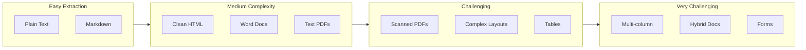
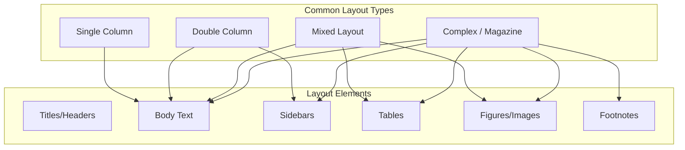
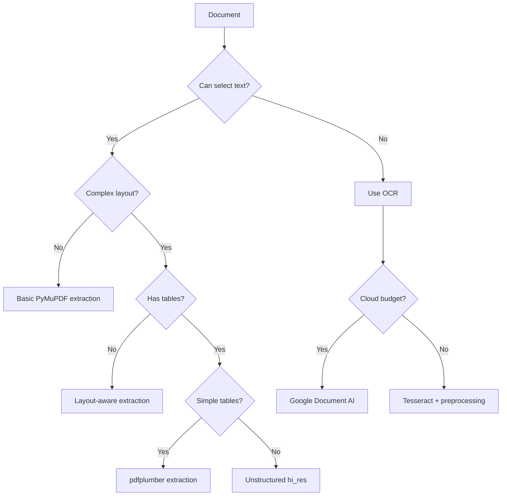

# Text Extraction Challenges

## Introduction

Getting text out of documents sounds simple — until you encounter scanned PDFs, multi-column layouts, tables that span pages, or headers that repeat on every page. Text extraction is where ingestion pipelines often fail, and poor extraction cascades into poor retrieval.

This section covers the common challenges in text extraction and proven techniques to handle them.

### What We'll Cover

- OCR for scanned and image-based documents
- Layout preservation and analysis
- Multi-column document handling
- Header and footer removal
- Table extraction strategies

### Prerequisites

- Understanding of document source types
- Basic familiarity with PDF structure
- Python fundamentals

---

## The Extraction Challenge Spectrum



| Challenge | Difficulty | Impact on RAG | Solution Approach |
|-----------|------------|---------------|-------------------|
| Scanned documents | High | Critical | OCR |
| Multi-column layouts | High | High | Layout analysis |
| Tables | High | High | Structure detection |
| Headers/footers | Medium | Medium | Pattern matching |
| Embedded images | Medium | Medium | OCR + captioning |
| Footnotes | Medium | Low | Heuristics |
| Watermarks | Low | Low | Filtering |

---

## OCR for Scanned Documents

### Detecting If OCR Is Needed

```python
import fitz  # PyMuPDF

def needs_ocr(pdf_path: str, text_threshold: float = 0.1) -> dict:
    """
    Determine if a PDF needs OCR.
    
    Args:
        pdf_path: Path to PDF file
        text_threshold: Minimum text-to-page ratio to consider extractable
    
    Returns:
        Analysis results with recommendation
    """
    doc = fitz.open(pdf_path)
    
    results = {
        "total_pages": len(doc),
        "pages_with_text": 0,
        "pages_needing_ocr": 0,
        "pages_analysis": []
    }
    
    for page_num, page in enumerate(doc):
        text = page.get_text("text")
        text_length = len(text.strip())
        
        # Check for images
        images = page.get_images()
        
        # Estimate page content
        page_area = page.rect.width * page.rect.height
        
        # Heuristic: if very little text but has images, likely needs OCR
        needs_page_ocr = text_length < 100 and len(images) > 0
        
        results["pages_analysis"].append({
            "page": page_num + 1,
            "text_chars": text_length,
            "image_count": len(images),
            "needs_ocr": needs_page_ocr
        })
        
        if needs_page_ocr:
            results["pages_needing_ocr"] += 1
        elif text_length > 100:
            results["pages_with_text"] += 1
    
    doc.close()
    
    # Recommendation
    ocr_ratio = results["pages_needing_ocr"] / results["total_pages"]
    
    if ocr_ratio > 0.5:
        results["recommendation"] = "full_ocr"
    elif ocr_ratio > 0:
        results["recommendation"] = "partial_ocr"
    else:
        results["recommendation"] = "no_ocr_needed"
    
    return results

# Usage
analysis = needs_ocr("document.pdf")
print(f"Recommendation: {analysis['recommendation']}")
print(f"Pages needing OCR: {analysis['pages_needing_ocr']}/{analysis['total_pages']}")
```

### Basic OCR with Tesseract

```python
import pytesseract
from PIL import Image
import fitz  # PyMuPDF
import io

def ocr_pdf_page(pdf_path: str, page_num: int, dpi: int = 300) -> str:
    """
    Perform OCR on a single PDF page.
    
    Args:
        pdf_path: Path to PDF
        page_num: 0-indexed page number
        dpi: Resolution for rendering (higher = better quality, slower)
    
    Returns:
        Extracted text from OCR
    """
    doc = fitz.open(pdf_path)
    page = doc[page_num]
    
    # Render page to image
    mat = fitz.Matrix(dpi / 72, dpi / 72)  # 72 is default DPI
    pix = page.get_pixmap(matrix=mat)
    
    # Convert to PIL Image
    img_data = pix.tobytes("png")
    image = Image.open(io.BytesIO(img_data))
    
    # Perform OCR
    text = pytesseract.image_to_string(
        image,
        lang='eng',
        config='--psm 1'  # Automatic page segmentation with OSD
    )
    
    doc.close()
    return text

def ocr_full_pdf(pdf_path: str, dpi: int = 300) -> list[dict]:
    """OCR all pages in a PDF."""
    doc = fitz.open(pdf_path)
    pages = []
    
    for page_num in range(len(doc)):
        text = ocr_pdf_page(pdf_path, page_num, dpi)
        pages.append({
            "page": page_num + 1,
            "text": text,
            "method": "tesseract_ocr"
        })
        print(f"OCR page {page_num + 1}/{len(doc)}")
    
    doc.close()
    return pages

# Usage
pages = ocr_full_pdf("scanned_document.pdf")
for page in pages:
    print(f"Page {page['page']}: {len(page['text'])} chars extracted")
```

### Cloud OCR with Google Document AI

```python
from google.cloud import documentai_v1 as documentai

def ocr_with_document_ai(
    project_id: str,
    location: str,
    processor_id: str,
    file_path: str
) -> dict:
    """
    Use Google Document AI for high-quality OCR.
    
    Note: Requires Google Cloud project with Document AI enabled.
    """
    client = documentai.DocumentProcessorServiceClient()
    
    # Read file
    with open(file_path, "rb") as f:
        content = f.read()
    
    # Create document
    raw_document = documentai.RawDocument(
        content=content,
        mime_type="application/pdf"
    )
    
    # Process
    name = f"projects/{project_id}/locations/{location}/processors/{processor_id}"
    request = documentai.ProcessRequest(name=name, raw_document=raw_document)
    result = client.process_document(request=request)
    
    document = result.document
    
    return {
        "text": document.text,
        "pages": [
            {
                "page_number": page.page_number,
                "width": page.dimension.width,
                "height": page.dimension.height,
                "detected_languages": [
                    {"code": lang.language_code, "confidence": lang.confidence}
                    for lang in page.detected_languages
                ]
            }
            for page in document.pages
        ],
        "entities": [
            {"type": entity.type_, "text": entity.mention_text}
            for entity in document.entities
        ]
    }

# Usage (requires GCP setup)
# result = ocr_with_document_ai(
#     project_id="my-project",
#     location="us",
#     processor_id="abc123",
#     file_path="scanned.pdf"
# )
```

### OCR Quality Optimization

| Technique | When to Use | Impact |
|-----------|-------------|--------|
| **Higher DPI** | Low resolution scans | Better accuracy, slower |
| **Image preprocessing** | Poor contrast, noise | Significant improvement |
| **Language hints** | Non-English documents | Required for accuracy |
| **Layout detection** | Multi-column docs | Preserves reading order |
| **Confidence filtering** | Post-processing | Removes garbage text |

```python
from PIL import Image, ImageFilter, ImageEnhance
import pytesseract

def preprocess_for_ocr(image: Image.Image) -> Image.Image:
    """Preprocess image to improve OCR accuracy."""
    
    # Convert to grayscale
    image = image.convert('L')
    
    # Enhance contrast
    enhancer = ImageEnhance.Contrast(image)
    image = enhancer.enhance(2.0)
    
    # Remove noise
    image = image.filter(ImageFilter.MedianFilter(size=3))
    
    # Binarize (black and white)
    threshold = 150
    image = image.point(lambda p: 255 if p > threshold else 0)
    
    return image

def ocr_with_preprocessing(image_path: str) -> dict:
    """OCR with preprocessing and confidence scores."""
    image = Image.open(image_path)
    
    # Preprocess
    processed = preprocess_for_ocr(image)
    
    # Get detailed OCR data
    data = pytesseract.image_to_data(
        processed,
        output_type=pytesseract.Output.DICT
    )
    
    # Filter by confidence
    words = []
    for i, word in enumerate(data['text']):
        conf = int(data['conf'][i])
        if conf > 60 and word.strip():  # Only high-confidence words
            words.append({
                "text": word,
                "confidence": conf,
                "x": data['left'][i],
                "y": data['top'][i]
            })
    
    return {
        "full_text": " ".join(w['text'] for w in words),
        "word_count": len(words),
        "avg_confidence": sum(w['confidence'] for w in words) / len(words) if words else 0,
        "words": words
    }
```

---

## Layout Preservation

### Understanding Document Layouts



### Layout Analysis with PyMuPDF

```python
import fitz

def analyze_layout(pdf_path: str, page_num: int = 0) -> dict:
    """
    Analyze the layout structure of a PDF page.
    
    Returns information about text blocks and their positions.
    """
    doc = fitz.open(pdf_path)
    page = doc[page_num]
    
    # Get text blocks with position info
    blocks = page.get_text("dict")["blocks"]
    
    layout = {
        "page_width": page.rect.width,
        "page_height": page.rect.height,
        "text_blocks": [],
        "image_blocks": [],
        "column_structure": None
    }
    
    text_blocks = []
    
    for block in blocks:
        if block["type"] == 0:  # Text block
            bbox = block["bbox"]
            block_info = {
                "x0": bbox[0],
                "y0": bbox[1],
                "x1": bbox[2],
                "y1": bbox[3],
                "width": bbox[2] - bbox[0],
                "height": bbox[3] - bbox[1],
                "text": "",
                "lines": []
            }
            
            # Extract text from lines
            for line in block.get("lines", []):
                line_text = ""
                for span in line.get("spans", []):
                    line_text += span.get("text", "")
                block_info["lines"].append(line_text)
                block_info["text"] += line_text + "\n"
            
            text_blocks.append(block_info)
        
        elif block["type"] == 1:  # Image block
            layout["image_blocks"].append({
                "bbox": block["bbox"],
                "width": block["width"],
                "height": block["height"]
            })
    
    layout["text_blocks"] = text_blocks
    
    # Detect column structure
    layout["column_structure"] = detect_columns(text_blocks, page.rect.width)
    
    doc.close()
    return layout

def detect_columns(text_blocks: list, page_width: float) -> dict:
    """Detect if page has multi-column layout."""
    if not text_blocks:
        return {"type": "unknown", "columns": 0}
    
    # Get x-positions of block centers
    centers = [(b["x0"] + b["x1"]) / 2 for b in text_blocks]
    
    # Simple heuristic: check for clustering
    left_margin = page_width * 0.1
    right_margin = page_width * 0.9
    center = page_width / 2
    
    left_blocks = sum(1 for c in centers if c < center - 50)
    right_blocks = sum(1 for c in centers if c > center + 50)
    
    if left_blocks > 3 and right_blocks > 3:
        return {"type": "two_column", "columns": 2}
    else:
        return {"type": "single_column", "columns": 1}

# Usage
layout = analyze_layout("research_paper.pdf", page_num=0)
print(f"Column structure: {layout['column_structure']}")
print(f"Text blocks: {len(layout['text_blocks'])}")
```

### Reading Order for Multi-Column

```python
def extract_with_reading_order(pdf_path: str) -> list[dict]:
    """
    Extract text respecting multi-column reading order.
    """
    doc = fitz.open(pdf_path)
    pages = []
    
    for page_num, page in enumerate(doc):
        layout = analyze_layout(pdf_path, page_num)
        
        if layout["column_structure"]["type"] == "two_column":
            # Sort blocks by column, then by y position
            text = extract_two_column(layout["text_blocks"], page.rect.width)
        else:
            # Single column: sort by y position
            sorted_blocks = sorted(layout["text_blocks"], key=lambda b: b["y0"])
            text = "\n\n".join(b["text"].strip() for b in sorted_blocks)
        
        pages.append({
            "page": page_num + 1,
            "text": text,
            "layout": layout["column_structure"]["type"]
        })
    
    doc.close()
    return pages

def extract_two_column(blocks: list, page_width: float) -> str:
    """Extract text from two-column layout in reading order."""
    center = page_width / 2
    
    # Split into left and right columns
    left_blocks = [b for b in blocks if (b["x0"] + b["x1"]) / 2 < center]
    right_blocks = [b for b in blocks if (b["x0"] + b["x1"]) / 2 >= center]
    
    # Sort each column by vertical position
    left_blocks.sort(key=lambda b: b["y0"])
    right_blocks.sort(key=lambda b: b["y0"])
    
    # Combine: left column first, then right column
    text_parts = []
    
    for block in left_blocks:
        text_parts.append(block["text"].strip())
    
    for block in right_blocks:
        text_parts.append(block["text"].strip())
    
    return "\n\n".join(text_parts)

# Usage
pages = extract_with_reading_order("academic_paper.pdf")
for page in pages:
    print(f"Page {page['page']} ({page['layout']}): {len(page['text'])} chars")
```

---

## Header and Footer Removal

Headers and footers repeat on every page, creating noise in retrieval. Detecting and removing them improves quality.

### Pattern-Based Detection

```python
from collections import Counter

def detect_headers_footers(pages: list[dict], threshold: float = 0.7) -> dict:
    """
    Detect repeating headers and footers across pages.
    
    Args:
        pages: List of page dicts with text_blocks
        threshold: Minimum fraction of pages where text must appear
    
    Returns:
        Detected headers and footers to remove
    """
    # Collect text from top and bottom of each page
    top_texts = []
    bottom_texts = []
    
    for page in pages:
        blocks = page.get("text_blocks", [])
        if not blocks:
            continue
        
        # Sort by y position
        sorted_blocks = sorted(blocks, key=lambda b: b["y0"])
        
        # Get top blocks (first 15% of page)
        page_height = page.get("page_height", 800)
        top_threshold = page_height * 0.15
        bottom_threshold = page_height * 0.85
        
        for block in sorted_blocks:
            text = block["text"].strip()
            if not text:
                continue
            
            if block["y0"] < top_threshold:
                top_texts.append(text[:100])  # First 100 chars
            elif block["y0"] > bottom_threshold:
                bottom_texts.append(text[:100])
    
    # Find repeating patterns
    def find_repeating(texts, min_occurrences):
        counter = Counter(texts)
        return [text for text, count in counter.items() 
                if count >= min_occurrences]
    
    min_occurrences = int(len(pages) * threshold)
    
    return {
        "headers": find_repeating(top_texts, min_occurrences),
        "footers": find_repeating(bottom_texts, min_occurrences)
    }

def remove_headers_footers(text: str, patterns: dict) -> str:
    """Remove detected headers and footers from text."""
    result = text
    
    for header in patterns.get("headers", []):
        result = result.replace(header, "")
    
    for footer in patterns.get("footers", []):
        result = result.replace(footer, "")
    
    return result.strip()

# Usage
# pages = analyze_all_pages("document.pdf")
# patterns = detect_headers_footers(pages)
# print(f"Headers to remove: {patterns['headers']}")
# print(f"Footers to remove: {patterns['footers']}")
```

### Position-Based Removal

```python
def extract_without_margins(
    pdf_path: str,
    top_margin: float = 0.1,
    bottom_margin: float = 0.1,
    left_margin: float = 0.05,
    right_margin: float = 0.05
) -> list[dict]:
    """
    Extract text excluding margin areas (headers, footers, page numbers).
    
    Margins are specified as fractions of page dimensions.
    """
    doc = fitz.open(pdf_path)
    pages = []
    
    for page_num, page in enumerate(doc):
        width = page.rect.width
        height = page.rect.height
        
        # Calculate content area
        content_rect = fitz.Rect(
            width * left_margin,
            height * top_margin,
            width * (1 - right_margin),
            height * (1 - bottom_margin)
        )
        
        # Extract text only from content area
        text = page.get_text("text", clip=content_rect)
        
        pages.append({
            "page": page_num + 1,
            "text": text.strip()
        })
    
    doc.close()
    return pages

# Usage
pages = extract_without_margins(
    "document.pdf",
    top_margin=0.12,  # Skip header area
    bottom_margin=0.08  # Skip footer area
)
```

---

## Table Extraction

Tables contain valuable structured data but are notoriously difficult to extract correctly.

### Table Detection

```python
import pdfplumber

def find_tables(pdf_path: str) -> list[dict]:
    """Detect tables in a PDF and extract their content."""
    tables_found = []
    
    with pdfplumber.open(pdf_path) as pdf:
        for page_num, page in enumerate(pdf.pages):
            # Find tables on this page
            tables = page.find_tables()
            
            for table_idx, table in enumerate(tables):
                # Get bounding box
                bbox = table.bbox
                
                # Extract table data
                data = table.extract()
                
                if data and len(data) > 1:  # Has header + data rows
                    # Use first row as headers
                    headers = data[0]
                    rows = data[1:]
                    
                    tables_found.append({
                        "page": page_num + 1,
                        "table_index": table_idx,
                        "bbox": bbox,
                        "headers": headers,
                        "rows": rows,
                        "row_count": len(rows),
                        "col_count": len(headers)
                    })
    
    return tables_found

# Usage
tables = find_tables("financial_report.pdf")
for table in tables:
    print(f"Page {table['page']}, Table {table['table_index']}")
    print(f"  Columns: {table['headers']}")
    print(f"  Rows: {table['row_count']}")
```

### Converting Tables to Text

For RAG, tables need to be converted to searchable text:

```python
def table_to_text(table: dict, format: str = "markdown") -> str:
    """
    Convert extracted table to text format.
    
    Args:
        table: Table dict with headers and rows
        format: Output format ('markdown', 'csv', 'natural')
    
    Returns:
        Text representation of table
    """
    headers = table["headers"]
    rows = table["rows"]
    
    if format == "markdown":
        # Create markdown table
        lines = []
        
        # Header row
        header_line = "| " + " | ".join(str(h or "") for h in headers) + " |"
        lines.append(header_line)
        
        # Separator
        separator = "| " + " | ".join("-" * max(3, len(str(h or ""))) for h in headers) + " |"
        lines.append(separator)
        
        # Data rows
        for row in rows:
            row_line = "| " + " | ".join(str(cell or "") for cell in row) + " |"
            lines.append(row_line)
        
        return "\n".join(lines)
    
    elif format == "csv":
        import csv
        from io import StringIO
        
        output = StringIO()
        writer = csv.writer(output)
        writer.writerow(headers)
        writer.writerows(rows)
        return output.getvalue()
    
    elif format == "natural":
        # Natural language description
        lines = [f"Table with {len(rows)} rows and {len(headers)} columns:"]
        lines.append(f"Columns: {', '.join(str(h) for h in headers if h)}")
        
        for i, row in enumerate(rows[:5]):  # First 5 rows
            row_desc = "; ".join(
                f"{headers[j]}: {cell}" 
                for j, cell in enumerate(row) 
                if j < len(headers) and cell
            )
            lines.append(f"Row {i+1}: {row_desc}")
        
        if len(rows) > 5:
            lines.append(f"... and {len(rows) - 5} more rows")
        
        return "\n".join(lines)
    
    return str(table)

# Usage
tables = find_tables("data_report.pdf")
for table in tables:
    text = table_to_text(table, format="markdown")
    print(text)
    print()
```

### Handling Complex Tables

```python
from unstructured.partition.pdf import partition_pdf

def extract_complex_tables(pdf_path: str) -> list[dict]:
    """
    Use Unstructured for complex table extraction.
    
    Handles:
    - Merged cells
    - Multi-line headers
    - Nested tables
    - Tables spanning pages
    """
    elements = partition_pdf(
        filename=pdf_path,
        strategy="hi_res",
        infer_table_structure=True
    )
    
    tables = []
    
    for element in elements:
        if element.category == "Table":
            tables.append({
                "text": str(element),
                "html": element.metadata.text_as_html if hasattr(element.metadata, 'text_as_html') else None,
                "page": element.metadata.page_number,
                "coordinates": element.metadata.coordinates if hasattr(element.metadata, 'coordinates') else None
            })
    
    return tables

# Usage
# tables = extract_complex_tables("complex_financial_report.pdf")
```

---

## Extraction Quality Metrics

Track extraction quality to identify problematic documents:

```python
def assess_extraction_quality(text: str, source_info: dict = None) -> dict:
    """
    Assess the quality of extracted text.
    
    Returns metrics that indicate potential extraction issues.
    """
    if not text:
        return {"quality_score": 0, "issues": ["empty_text"]}
    
    issues = []
    metrics = {}
    
    # Length metrics
    metrics["char_count"] = len(text)
    metrics["word_count"] = len(text.split())
    
    # Check for garbage characters
    garbage_chars = sum(1 for c in text if ord(c) > 65535 or c in '□▪▫●○')
    garbage_ratio = garbage_chars / len(text)
    metrics["garbage_ratio"] = garbage_ratio
    if garbage_ratio > 0.05:
        issues.append("high_garbage_chars")
    
    # Check for repetition (OCR artifacts)
    words = text.split()
    if words:
        unique_ratio = len(set(words)) / len(words)
        metrics["unique_word_ratio"] = unique_ratio
        if unique_ratio < 0.3:
            issues.append("excessive_repetition")
    
    # Check for very short lines (OCR of columns)
    lines = text.split('\n')
    short_lines = sum(1 for line in lines if len(line.strip()) < 20 and len(line.strip()) > 0)
    if lines:
        short_line_ratio = short_lines / len(lines)
        metrics["short_line_ratio"] = short_line_ratio
        if short_line_ratio > 0.5:
            issues.append("fragmented_text")
    
    # Calculate overall quality score
    score = 100
    score -= garbage_ratio * 100
    score -= len(issues) * 15
    
    metrics["quality_score"] = max(0, min(100, score))
    metrics["issues"] = issues
    
    return metrics

# Usage
text = extract_text_from_pdf("document.pdf")
quality = assess_extraction_quality(text)
print(f"Quality score: {quality['quality_score']:.0f}/100")
print(f"Issues: {quality['issues']}")
```

---

## Extraction Strategy Decision Tree



---

## Hands-on Exercise

### Your Task

Build a robust text extractor that:
1. Detects if OCR is needed
2. Applies appropriate extraction method
3. Removes headers/footers
4. Reports quality metrics

### Requirements

```python
def extract_text_robust(pdf_path: str) -> dict:
    """
    Robustly extract text from PDF.
    
    Returns:
        {
            "text": str,
            "method": str,
            "pages": int,
            "quality_score": float,
            "issues": list[str]
        }
    """
    pass
```

<details>
<summary>💡 Hints</summary>

- Use `needs_ocr()` to check extraction method
- Apply `extract_without_margins()` for cleaner output
- Run `assess_extraction_quality()` on results
- Handle errors gracefully

</details>

<details>
<summary>✅ Solution</summary>

```python
def extract_text_robust(pdf_path: str) -> dict:
    """Robustly extract text from PDF."""
    
    # Check if OCR is needed
    analysis = needs_ocr(pdf_path)
    
    pages_text = []
    method = "unknown"
    
    if analysis["recommendation"] == "no_ocr_needed":
        # Direct extraction with margin removal
        method = "pymupdf"
        pages = extract_without_margins(
            pdf_path,
            top_margin=0.1,
            bottom_margin=0.1
        )
        pages_text = [p["text"] for p in pages]
        
    elif analysis["recommendation"] == "full_ocr":
        # Full OCR
        method = "tesseract_ocr"
        pages = ocr_full_pdf(pdf_path, dpi=300)
        pages_text = [p["text"] for p in pages]
        
    else:  # partial_ocr
        # Hybrid: direct + OCR where needed
        method = "hybrid"
        doc = fitz.open(pdf_path)
        
        for i, page_analysis in enumerate(analysis["pages_analysis"]):
            if page_analysis["needs_ocr"]:
                text = ocr_pdf_page(pdf_path, i, dpi=300)
            else:
                text = doc[i].get_text("text")
            pages_text.append(text)
        
        doc.close()
    
    # Combine all pages
    full_text = "\n\n".join(pages_text)
    
    # Assess quality
    quality = assess_extraction_quality(full_text)
    
    return {
        "text": full_text,
        "method": method,
        "pages": len(pages_text),
        "quality_score": quality["quality_score"],
        "issues": quality["issues"]
    }

# Usage
result = extract_text_robust("mixed_document.pdf")
print(f"Extracted {len(result['text'])} chars using {result['method']}")
print(f"Quality: {result['quality_score']:.0f}/100")
if result['issues']:
    print(f"Issues: {result['issues']}")
```

</details>

---

## Summary

Text extraction is the critical first step in document ingestion:

✅ **OCR** enables extraction from scanned and image-based documents
✅ **Layout analysis** preserves reading order in multi-column documents
✅ **Header/footer removal** eliminates repetitive noise
✅ **Table extraction** captures structured data for RAG
✅ **Quality metrics** help identify problematic documents

**Up Next:** [Metadata Extraction](./04-metadata-extraction.md) — Enrich documents with structured information for filtering.

---

## Further Reading

- [Tesseract Documentation](https://tesseract-ocr.github.io/) - Open source OCR
- [Google Document AI](https://cloud.google.com/document-ai) - Cloud OCR
- [pdfplumber Documentation](https://github.com/jsvine/pdfplumber) - PDF extraction
- [Unstructured Partitioning](https://docs.unstructured.io/open-source/core-functionality/partitioning) - Layout analysis

<!--
Sources Consulted:
- Unstructured Documentation: https://docs.unstructured.io/open-source/introduction/overview
- LlamaIndex Loading: https://developers.llamaindex.ai/python/framework/module_guides/loading/simpledirectoryreader/
-->
