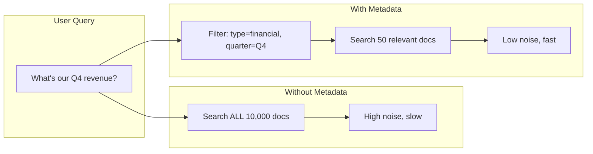
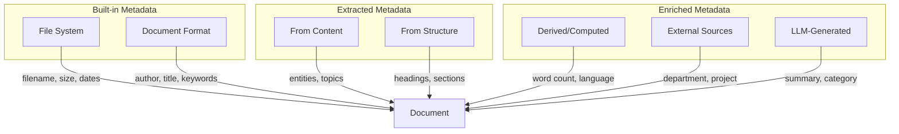

# Metadata Extraction

## Introduction

Metadata transforms raw documents into filterable, organized knowledge. While text content answers *what* a document says, metadata answers *when*, *who*, *where*, and *what kind* — enabling precise retrieval through attribute filtering.

Well-structured metadata is the difference between "search all 10,000 documents" and "search Q4 2024 financial reports from the Finance department."

### What We'll Cover

- Document properties: built-in file and format metadata
- Author, date, and version information
- Category and tag extraction
- Custom metadata enrichment
- Metadata schemas for RAG

### Prerequisites

- Understanding of document source types
- Familiarity with the ingestion pipeline
- Basic Python data structures

---

## Why Metadata Matters for RAG



### Metadata Benefits

| Benefit | Description | Example |
|---------|-------------|---------|
| **Filtering** | Narrow search scope before retrieval | Only search HR policies |
| **Relevance** | Boost recent or authoritative documents | Prefer 2024 over 2020 docs |
| **Attribution** | Cite sources accurately | Show author and date |
| **Access Control** | Filter by permission level | Only show public docs |
| **Freshness** | Identify stale content | Flag docs older than 1 year |

---

## Metadata Types

### Built-in vs. Extracted vs. Enriched



| Type | Source | Examples | Reliability |
|------|--------|----------|-------------|
| **Built-in** | File system, format headers | Filename, size, created date | High |
| **Extracted** | Document content | Title, author, headings | Medium |
| **Derived** | Computation | Word count, language, hash | High |
| **Enriched** | External systems | Department, project code | Medium |
| **LLM-Generated** | AI analysis | Summary, topics, sentiment | Variable |

---

## Extracting Built-in Metadata

### File System Metadata

```python
from pathlib import Path
from datetime import datetime
import hashlib
import mimetypes

def extract_file_metadata(file_path: str) -> dict:
    """Extract metadata from file system."""
    path = Path(file_path)
    stat = path.stat()
    
    return {
        # Identification
        "filename": path.name,
        "stem": path.stem,
        "extension": path.suffix.lower(),
        "full_path": str(path.absolute()),
        
        # Size
        "size_bytes": stat.st_size,
        "size_kb": round(stat.st_size / 1024, 2),
        "size_mb": round(stat.st_size / (1024 * 1024), 4),
        
        # Timestamps
        "created_at": datetime.fromtimestamp(stat.st_ctime).isoformat(),
        "modified_at": datetime.fromtimestamp(stat.st_mtime).isoformat(),
        "accessed_at": datetime.fromtimestamp(stat.st_atime).isoformat(),
        
        # Type detection
        "mime_type": mimetypes.guess_type(file_path)[0],
        
        # Content hash (for deduplication)
        "md5_hash": calculate_file_hash(file_path)
    }

def calculate_file_hash(file_path: str) -> str:
    """Calculate MD5 hash for file deduplication."""
    hasher = hashlib.md5()
    with open(file_path, 'rb') as f:
        for chunk in iter(lambda: f.read(8192), b''):
            hasher.update(chunk)
    return hasher.hexdigest()

# Usage
metadata = extract_file_metadata("reports/q4_summary.pdf")
print(f"File: {metadata['filename']}")
print(f"Size: {metadata['size_kb']} KB")
print(f"Modified: {metadata['modified_at']}")
print(f"Hash: {metadata['md5_hash'][:12]}...")
```

**Output:**
```
File: q4_summary.pdf
Size: 245.67 KB
Modified: 2024-12-15T14:32:08
Hash: 8f14e45fce...
```

### PDF Document Properties

```python
import fitz  # PyMuPDF

def extract_pdf_metadata(pdf_path: str) -> dict:
    """Extract metadata from PDF document properties."""
    doc = fitz.open(pdf_path)
    
    # Get document metadata
    meta = doc.metadata
    
    metadata = {
        # Standard PDF properties
        "title": meta.get("title", "").strip() or None,
        "author": meta.get("author", "").strip() or None,
        "subject": meta.get("subject", "").strip() or None,
        "keywords": parse_keywords(meta.get("keywords", "")),
        "creator": meta.get("creator", "").strip() or None,  # App that created it
        "producer": meta.get("producer", "").strip() or None,  # PDF library
        
        # Dates
        "creation_date": parse_pdf_date(meta.get("creationDate")),
        "modification_date": parse_pdf_date(meta.get("modDate")),
        
        # Document structure
        "page_count": len(doc),
        "has_toc": len(doc.get_toc()) > 0,
        "toc_entries": len(doc.get_toc()),
        
        # Security
        "is_encrypted": doc.is_encrypted,
        "is_pdf": doc.is_pdf,
        
        # Format
        "format": meta.get("format", "PDF"),
    }
    
    doc.close()
    return metadata

def parse_pdf_date(date_str: str) -> str | None:
    """Parse PDF date format (D:YYYYMMDDHHmmSS) to ISO format."""
    if not date_str or not date_str.startswith("D:"):
        return None
    
    try:
        # Remove 'D:' prefix
        date_part = date_str[2:16]  # YYYYMMDDHHmmSS
        dt = datetime.strptime(date_part, "%Y%m%d%H%M%S")
        return dt.isoformat()
    except:
        return date_str

def parse_keywords(keywords_str: str) -> list[str]:
    """Parse keyword string into list."""
    if not keywords_str:
        return []
    
    # Handle various separators
    for sep in [";", ",", "|"]:
        if sep in keywords_str:
            return [k.strip() for k in keywords_str.split(sep) if k.strip()]
    
    # Single keyword or space-separated
    return [k.strip() for k in keywords_str.split() if k.strip()]

# Usage
pdf_meta = extract_pdf_metadata("annual_report.pdf")
print(f"Title: {pdf_meta['title']}")
print(f"Author: {pdf_meta['author']}")
print(f"Pages: {pdf_meta['page_count']}")
print(f"Keywords: {pdf_meta['keywords']}")
```

### Office Document Properties

```python
from docx import Document as DocxDocument
from openpyxl import load_workbook
from pptx import Presentation

def extract_docx_metadata(file_path: str) -> dict:
    """Extract metadata from Word document."""
    doc = DocxDocument(file_path)
    props = doc.core_properties
    
    return {
        "title": props.title,
        "author": props.author,
        "subject": props.subject,
        "keywords": props.keywords,
        "category": props.category,
        "comments": props.comments,
        "created": props.created.isoformat() if props.created else None,
        "modified": props.modified.isoformat() if props.modified else None,
        "last_modified_by": props.last_modified_by,
        "revision": props.revision,
        "version": props.version,
        
        # Computed
        "paragraph_count": len(doc.paragraphs),
        "table_count": len(doc.tables),
    }

def extract_xlsx_metadata(file_path: str) -> dict:
    """Extract metadata from Excel workbook."""
    wb = load_workbook(file_path, read_only=True)
    props = wb.properties
    
    metadata = {
        "title": props.title,
        "author": props.creator,
        "subject": props.subject,
        "keywords": props.keywords,
        "category": props.category,
        "created": props.created.isoformat() if props.created else None,
        "modified": props.modified.isoformat() if props.modified else None,
        "last_modified_by": props.lastModifiedBy,
        
        # Workbook structure
        "sheet_names": wb.sheetnames,
        "sheet_count": len(wb.sheetnames),
    }
    
    wb.close()
    return metadata

def extract_pptx_metadata(file_path: str) -> dict:
    """Extract metadata from PowerPoint presentation."""
    prs = Presentation(file_path)
    props = prs.core_properties
    
    return {
        "title": props.title,
        "author": props.author,
        "subject": props.subject,
        "keywords": props.keywords,
        "category": props.category,
        "created": props.created.isoformat() if props.created else None,
        "modified": props.modified.isoformat() if props.modified else None,
        
        # Presentation structure
        "slide_count": len(prs.slides),
    }

# Unified extraction
def extract_office_metadata(file_path: str) -> dict:
    """Extract metadata from any Office document."""
    path = Path(file_path)
    ext = path.suffix.lower()
    
    extractors = {
        ".docx": extract_docx_metadata,
        ".xlsx": extract_xlsx_metadata,
        ".pptx": extract_pptx_metadata,
    }
    
    if ext in extractors:
        return extractors[ext](file_path)
    else:
        raise ValueError(f"Unsupported format: {ext}")
```

---

## Content-Based Metadata Extraction

### Extracting Title and Headings

```python
import re

def extract_document_structure(text: str) -> dict:
    """Extract structural metadata from document text."""
    lines = text.split('\n')
    
    structure = {
        "detected_title": None,
        "headings": [],
        "sections": [],
    }
    
    # Title detection heuristics
    for i, line in enumerate(lines[:10]):  # Check first 10 lines
        line = line.strip()
        if not line:
            continue
        
        # Title is often the first substantial line, short, maybe all caps
        if len(line) > 5 and len(line) < 100:
            if not structure["detected_title"]:
                structure["detected_title"] = line
            break
    
    # Heading detection (markdown style or numbered)
    heading_patterns = [
        (r'^#{1,6}\s+(.+)$', 'markdown'),  # Markdown headings
        (r'^(\d+\.)+\s+(.+)$', 'numbered'),  # 1.2.3 Style
        (r'^[A-Z][^.!?]*$', 'caps'),  # ALL CAPS lines (potential headers)
    ]
    
    for i, line in enumerate(lines):
        line = line.strip()
        
        for pattern, style in heading_patterns:
            match = re.match(pattern, line)
            if match:
                heading_text = match.group(1) if style == 'markdown' else line
                structure["headings"].append({
                    "text": heading_text,
                    "line": i,
                    "style": style
                })
                break
    
    return structure

# Usage
text = """
# Annual Report 2024

## Executive Summary
This report covers our performance in fiscal year 2024...

## Financial Highlights
Revenue grew 23% year-over-year...

### Q4 Performance
The fourth quarter showed strong momentum...
"""

structure = extract_document_structure(text)
print(f"Title: {structure['detected_title']}")
print(f"Headings found: {len(structure['headings'])}")
for h in structure['headings']:
    print(f"  - {h['text']} ({h['style']})")
```

### Entity Extraction

```python
import re
from datetime import datetime

def extract_entities(text: str) -> dict:
    """Extract named entities and key information from text."""
    
    entities = {
        "dates": [],
        "emails": [],
        "urls": [],
        "phone_numbers": [],
        "monetary_amounts": [],
        "percentages": [],
    }
    
    # Date patterns
    date_patterns = [
        r'\b\d{1,2}/\d{1,2}/\d{2,4}\b',  # MM/DD/YYYY
        r'\b\d{4}-\d{2}-\d{2}\b',  # YYYY-MM-DD
        r'\b(?:Jan|Feb|Mar|Apr|May|Jun|Jul|Aug|Sep|Oct|Nov|Dec)[a-z]* \d{1,2},? \d{4}\b',
        r'\b\d{1,2} (?:January|February|March|April|May|June|July|August|September|October|November|December) \d{4}\b',
    ]
    for pattern in date_patterns:
        entities["dates"].extend(re.findall(pattern, text, re.IGNORECASE))
    
    # Emails
    entities["emails"] = re.findall(
        r'\b[A-Za-z0-9._%+-]+@[A-Za-z0-9.-]+\.[A-Z|a-z]{2,}\b',
        text
    )
    
    # URLs
    entities["urls"] = re.findall(
        r'https?://[^\s<>"{}|\\^`\[\]]+',
        text
    )
    
    # Phone numbers
    entities["phone_numbers"] = re.findall(
        r'\b(?:\+1[-.\s]?)?\(?\d{3}\)?[-.\s]?\d{3}[-.\s]?\d{4}\b',
        text
    )
    
    # Money
    entities["monetary_amounts"] = re.findall(
        r'\$[\d,]+(?:\.\d{2})?(?:\s*(?:million|billion|M|B|k|K))?\b',
        text
    )
    
    # Percentages
    entities["percentages"] = re.findall(
        r'\b\d+(?:\.\d+)?%\b',
        text
    )
    
    # Deduplicate
    for key in entities:
        entities[key] = list(set(entities[key]))
    
    return entities

# Usage
text = """
Meeting scheduled for January 15, 2025. Contact sales@example.com or 
call (555) 123-4567. Our revenue reached $4.2 billion, up 23% from last year.
Visit https://company.com/report for details.
"""

entities = extract_entities(text)
print(f"Dates: {entities['dates']}")
print(f"Emails: {entities['emails']}")
print(f"Monetary: {entities['monetary_amounts']}")
```

---

## Derived Metadata

Compute useful metadata from document content:

```python
import re
from collections import Counter

def compute_derived_metadata(text: str) -> dict:
    """Compute metadata derived from document content."""
    
    words = text.split()
    sentences = re.split(r'[.!?]+', text)
    
    return {
        # Size metrics
        "char_count": len(text),
        "word_count": len(words),
        "sentence_count": len([s for s in sentences if s.strip()]),
        "paragraph_count": len([p for p in text.split('\n\n') if p.strip()]),
        
        # Complexity
        "avg_word_length": sum(len(w) for w in words) / len(words) if words else 0,
        "avg_sentence_length": len(words) / len(sentences) if sentences else 0,
        
        # Language detection (simple heuristic)
        "detected_language": detect_language_simple(text),
        
        # Content type hints
        "has_code": bool(re.search(r'```|def |function |class |import ', text)),
        "has_tables": bool(re.search(r'\|.*\|.*\|', text)),
        "has_lists": bool(re.search(r'^[\s]*[-*•]\s', text, re.MULTILINE)),
        
        # Top terms (excluding stopwords)
        "top_terms": extract_top_terms(text, n=10),
    }

def detect_language_simple(text: str) -> str:
    """Simple language detection based on common words."""
    text_lower = text.lower()
    
    # Common words by language
    indicators = {
        "en": ["the", "and", "is", "in", "to", "of", "for", "that", "with"],
        "es": ["el", "la", "de", "en", "y", "que", "es", "un", "los"],
        "fr": ["le", "la", "de", "et", "en", "est", "un", "une", "les"],
        "de": ["der", "die", "und", "in", "den", "ist", "von", "das", "zu"],
    }
    
    scores = {}
    for lang, words in indicators.items():
        score = sum(1 for w in words if f" {w} " in f" {text_lower} ")
        scores[lang] = score
    
    if max(scores.values()) > 3:
        return max(scores, key=scores.get)
    return "unknown"

def extract_top_terms(text: str, n: int = 10) -> list[str]:
    """Extract most frequent meaningful terms."""
    # Simple stopwords
    stopwords = {
        "the", "a", "an", "and", "or", "but", "in", "on", "at", "to", "for",
        "of", "with", "by", "from", "is", "are", "was", "were", "be", "been",
        "this", "that", "it", "as", "we", "you", "they", "their", "our"
    }
    
    # Tokenize and filter
    words = re.findall(r'\b[a-zA-Z]{3,}\b', text.lower())
    filtered = [w for w in words if w not in stopwords]
    
    # Count and return top N
    counter = Counter(filtered)
    return [word for word, count in counter.most_common(n)]

# Usage
text = """
Machine learning is transforming how we build software. Neural networks 
can learn patterns from data. Deep learning models achieve state-of-the-art 
results on many tasks including natural language processing.
"""

derived = compute_derived_metadata(text)
print(f"Words: {derived['word_count']}")
print(f"Language: {derived['detected_language']}")
print(f"Top terms: {derived['top_terms']}")
```

---

## LLM-Enhanced Metadata

Use LLMs to generate rich metadata:

```python
from openai import OpenAI
import json

client = OpenAI()

def generate_metadata_with_llm(text: str, filename: str = None) -> dict:
    """Use LLM to generate rich metadata."""
    
    prompt = f"""Analyze this document and extract metadata.

Document: {text[:4000]}  # Truncate for context limits

Return a JSON object with:
- title: The document's title or a generated one
- summary: 2-3 sentence summary
- category: One of [technical, business, legal, hr, marketing, research, other]
- topics: List of 3-5 main topics
- document_type: One of [report, memo, policy, manual, article, presentation, email, other]
- sentiment: One of [positive, negative, neutral, mixed]
- audience: Who is this document for?
- key_entities: Important people, companies, or products mentioned

Return only valid JSON."""

    response = client.chat.completions.create(
        model="gpt-4.1-mini",
        messages=[
            {"role": "system", "content": "You are a document analyst. Return only valid JSON."},
            {"role": "user", "content": prompt}
        ],
        response_format={"type": "json_object"}
    )
    
    try:
        return json.loads(response.choices[0].message.content)
    except json.JSONDecodeError:
        return {"error": "Failed to parse LLM response"}

# Usage
text = """
Q4 2024 Engineering Team Performance Review

This quarter saw significant improvements in our deployment velocity. 
The team shipped 47 features, a 35% increase from Q3. Key achievements 
include the migration to Kubernetes and launching the new API gateway.

Challenges included hiring delays and the unexpected database outage 
in November. We've implemented new monitoring to prevent future incidents.

Looking ahead to Q1 2025, priorities include completing the microservices 
refactoring and improving test coverage to 85%.
"""

llm_metadata = generate_metadata_with_llm(text)
print(f"Category: {llm_metadata.get('category')}")
print(f"Topics: {llm_metadata.get('topics')}")
print(f"Summary: {llm_metadata.get('summary')}")
```

---

## Metadata Schema Design

### Standard Schema for RAG

```python
from dataclasses import dataclass, asdict
from datetime import datetime
from typing import Optional
from enum import Enum

class DocumentCategory(str, Enum):
    TECHNICAL = "technical"
    BUSINESS = "business"
    LEGAL = "legal"
    HR = "hr"
    MARKETING = "marketing"
    RESEARCH = "research"
    OTHER = "other"

class AccessLevel(str, Enum):
    PUBLIC = "public"
    INTERNAL = "internal"
    CONFIDENTIAL = "confidential"
    RESTRICTED = "restricted"

@dataclass
class DocumentMetadata:
    """Standard metadata schema for RAG documents."""
    
    # Required identification
    doc_id: str
    source_path: str
    
    # File info
    filename: str
    file_type: str
    size_bytes: int
    content_hash: str
    
    # Temporal
    created_at: datetime
    modified_at: datetime
    ingested_at: datetime
    
    # Content
    title: Optional[str] = None
    author: Optional[str] = None
    summary: Optional[str] = None
    
    # Classification
    category: Optional[DocumentCategory] = None
    topics: Optional[list[str]] = None
    tags: Optional[list[str]] = None
    
    # Access control
    access_level: AccessLevel = AccessLevel.INTERNAL
    department: Optional[str] = None
    owner: Optional[str] = None
    
    # Quality
    language: str = "en"
    word_count: int = 0
    confidence_score: Optional[float] = None
    
    # Versioning
    version: Optional[str] = None
    is_latest: bool = True
    supersedes: Optional[str] = None  # doc_id of older version
    
    def to_dict(self) -> dict:
        """Convert to dictionary for storage."""
        data = asdict(self)
        # Convert enums to strings
        data['category'] = self.category.value if self.category else None
        data['access_level'] = self.access_level.value
        # Convert datetimes to ISO strings
        for key in ['created_at', 'modified_at', 'ingested_at']:
            if data[key]:
                data[key] = data[key].isoformat()
        return data
    
    def to_filter_attributes(self) -> dict:
        """Convert to format suitable for vector store filtering."""
        return {
            "category": self.category.value if self.category else "other",
            "access_level": self.access_level.value,
            "department": self.department or "general",
            "file_type": self.file_type,
            "language": self.language,
            "created_timestamp": int(self.created_at.timestamp()),
            "word_count": self.word_count,
        }

# Usage
metadata = DocumentMetadata(
    doc_id="doc_123",
    source_path="/docs/reports/q4_summary.pdf",
    filename="q4_summary.pdf",
    file_type="pdf",
    size_bytes=245000,
    content_hash="abc123",
    created_at=datetime(2024, 12, 15),
    modified_at=datetime(2024, 12, 15),
    ingested_at=datetime.now(),
    title="Q4 2024 Financial Summary",
    author="Finance Team",
    category=DocumentCategory.BUSINESS,
    topics=["revenue", "growth", "Q4"],
    department="Finance",
    word_count=2500
)

print(metadata.to_filter_attributes())
```

### Using Metadata with OpenAI Vector Stores

```python
from openai import OpenAI

client = OpenAI()

def upload_with_metadata(
    vector_store_id: str,
    file_path: str,
    metadata: DocumentMetadata
) -> dict:
    """Upload file with metadata attributes for filtering."""
    
    # Get filterable attributes
    attributes = metadata.to_filter_attributes()
    
    # Upload file
    with open(file_path, "rb") as f:
        result = client.vector_stores.files.upload_and_poll(
            vector_store_id=vector_store_id,
            file=f,
            attributes=attributes
        )
    
    return {
        "file_id": result.id,
        "status": result.status,
        "attributes": attributes
    }

def search_with_filters(
    vector_store_id: str,
    query: str,
    filters: dict
) -> list:
    """Search with metadata filters."""
    
    # Build filter
    filter_obj = None
    
    if filters:
        conditions = []
        for key, value in filters.items():
            if isinstance(value, list):
                conditions.append({"type": "in", "key": key, "value": value})
            else:
                conditions.append({"type": "eq", "key": key, "value": value})
        
        if len(conditions) == 1:
            filter_obj = conditions[0]
        else:
            filter_obj = {"type": "and", "filters": conditions}
    
    results = client.vector_stores.search(
        vector_store_id=vector_store_id,
        query=query,
        filters=filter_obj,
        max_num_results=10
    )
    
    return results.data

# Usage
# Upload with metadata
# result = upload_with_metadata(
#     vector_store_id="vs_123",
#     file_path="q4_report.pdf",
#     metadata=metadata
# )

# Search with filters
# results = search_with_filters(
#     vector_store_id="vs_123",
#     query="revenue growth",
#     filters={
#         "category": "business",
#         "department": "Finance"
#     }
# )
```

---

## Complete Metadata Pipeline

```python
from datetime import datetime
import uuid

def build_complete_metadata(
    file_path: str,
    text: str,
    use_llm: bool = True
) -> DocumentMetadata:
    """Build complete metadata from all sources."""
    
    # 1. File system metadata
    file_meta = extract_file_metadata(file_path)
    
    # 2. Format-specific metadata
    ext = file_meta['extension']
    format_meta = {}
    
    if ext == '.pdf':
        format_meta = extract_pdf_metadata(file_path)
    elif ext in ['.docx', '.xlsx', '.pptx']:
        format_meta = extract_office_metadata(file_path)
    
    # 3. Content-based extraction
    structure = extract_document_structure(text)
    entities = extract_entities(text)
    
    # 4. Derived metadata
    derived = compute_derived_metadata(text)
    
    # 5. LLM enrichment (optional)
    llm_meta = {}
    if use_llm:
        llm_meta = generate_metadata_with_llm(text, file_meta['filename'])
    
    # 6. Combine into standard schema
    metadata = DocumentMetadata(
        doc_id=str(uuid.uuid4()),
        source_path=file_meta['full_path'],
        filename=file_meta['filename'],
        file_type=ext.lstrip('.'),
        size_bytes=file_meta['size_bytes'],
        content_hash=file_meta['md5_hash'],
        created_at=datetime.fromisoformat(file_meta['created_at']),
        modified_at=datetime.fromisoformat(file_meta['modified_at']),
        ingested_at=datetime.now(),
        
        # Title: prefer format metadata, then extracted, then LLM
        title=(
            format_meta.get('title') or 
            structure.get('detected_title') or 
            llm_meta.get('title')
        ),
        
        author=format_meta.get('author'),
        summary=llm_meta.get('summary'),
        
        # Classification from LLM
        category=DocumentCategory(llm_meta.get('category', 'other')),
        topics=llm_meta.get('topics', []),
        
        # Derived
        language=derived['detected_language'],
        word_count=derived['word_count'],
    )
    
    return metadata

# Usage
with open("document.txt", "r") as f:
    text = f.read()

metadata = build_complete_metadata("document.txt", text, use_llm=True)
print(f"Title: {metadata.title}")
print(f"Category: {metadata.category}")
print(f"Topics: {metadata.topics}")
```

---

## Hands-on Exercise

### Your Task

Build a metadata extraction pipeline that:
1. Extracts file system and format metadata
2. Derives content-based metadata
3. Returns a standardized metadata dictionary

### Requirements

```python
def extract_all_metadata(file_path: str, text: str) -> dict:
    """
    Extract comprehensive metadata from document.
    
    Returns:
        {
            "file": {...},       # File system metadata
            "format": {...},     # Format-specific metadata
            "content": {...},    # Content-derived metadata
            "derived": {...}     # Computed metrics
        }
    """
    pass
```

<details>
<summary>💡 Hints</summary>

- Use the extraction functions from this lesson
- Handle different file types appropriately
- Gracefully handle missing or unavailable metadata
- Combine results into organized structure

</details>

<details>
<summary>✅ Solution</summary>

```python
def extract_all_metadata(file_path: str, text: str) -> dict:
    """Extract comprehensive metadata from document."""
    
    result = {
        "file": {},
        "format": {},
        "content": {},
        "derived": {}
    }
    
    # 1. File system metadata
    try:
        result["file"] = extract_file_metadata(file_path)
    except Exception as e:
        result["file"]["error"] = str(e)
    
    # 2. Format-specific metadata
    ext = Path(file_path).suffix.lower()
    try:
        if ext == '.pdf':
            result["format"] = extract_pdf_metadata(file_path)
        elif ext == '.docx':
            result["format"] = extract_docx_metadata(file_path)
        elif ext == '.xlsx':
            result["format"] = extract_xlsx_metadata(file_path)
        elif ext == '.pptx':
            result["format"] = extract_pptx_metadata(file_path)
        else:
            result["format"]["note"] = "No format-specific extraction"
    except Exception as e:
        result["format"]["error"] = str(e)
    
    # 3. Content-based extraction
    try:
        result["content"] = {
            "structure": extract_document_structure(text),
            "entities": extract_entities(text)
        }
    except Exception as e:
        result["content"]["error"] = str(e)
    
    # 4. Derived metadata
    try:
        result["derived"] = compute_derived_metadata(text)
    except Exception as e:
        result["derived"]["error"] = str(e)
    
    return result

# Usage
with open("sample.pdf", "rb") as f:
    # Extract text first...
    text = extract_pdf_text("sample.pdf")  # From previous lesson

metadata = extract_all_metadata("sample.pdf", text)
print(f"File: {metadata['file']['filename']}")
print(f"Author: {metadata['format'].get('author')}")
print(f"Words: {metadata['derived']['word_count']}")
print(f"Language: {metadata['derived']['detected_language']}")
```

</details>

---

## Summary

Metadata extraction enriches documents for precise retrieval:

✅ **File system metadata** provides timestamps, sizes, and hashes
✅ **Format metadata** extracts author, title, and document properties
✅ **Content-based extraction** captures structure, entities, and patterns
✅ **Derived metadata** computes word counts, language, and complexity
✅ **LLM enrichment** generates summaries, topics, and categories

**Up Next:** [Cleaning and Preprocessing](./05-cleaning-preprocessing.md) — Prepare text for optimal retrieval quality.

---

## Further Reading

- [OpenAI Vector Store Attributes](https://platform.openai.com/docs/guides/retrieval#attributes) - Filtering with metadata
- [python-docx Core Properties](https://python-docx.readthedocs.io/en/latest/api/document.html#coreproperties-objects) - Word metadata
- [PyMuPDF Metadata](https://pymupdf.readthedocs.io/en/latest/document.html#Document.metadata) - PDF properties

<!--
Sources Consulted:
- OpenAI Retrieval Guide: https://platform.openai.com/docs/guides/retrieval
- LlamaIndex SimpleDirectoryReader: https://developers.llamaindex.ai/python/framework/module_guides/loading/simpledirectoryreader/
-->
