# Cleaning and Preprocessing

## Introduction

Raw extracted text is rarely ready for embedding and retrieval. It contains noise — extra whitespace, special characters, boilerplate content, and encoding artifacts — that degrades retrieval quality. Cleaning and preprocessing transforms messy extracted text into clean, consistent content optimized for semantic search.

This section covers essential text cleaning techniques that improve RAG accuracy.

### What We'll Cover

- Whitespace normalization
- Special character handling
- Boilerplate and noise removal
- Language detection and filtering
- Text normalization techniques
- Quality validation

### Prerequisites

- Understanding of text extraction
- Basic regular expressions
- Python string manipulation

---

## Why Cleaning Matters

```mermaid
flowchart LR
    subgraph Raw["Raw Extracted Text"]
        R1["Multiple    spaces"]
        R2["Header\nHeader\nContent"]
        R3["Click here →"]
        R4["© 2024 Company"]
    end
    
    subgraph Clean["Cleaned Text"]
        C1["Single spaces"]
        C2["Content only"]
        C3["Actionable text"]
        C4["Substantive info"]
    end
    
    subgraph Impact["Impact on RAG"]
        I1["Better embeddings"]
        I2["Higher relevance"]
        I3["Cleaner citations"]
    end
    
    Raw --> |Preprocessing| Clean
    Clean --> Impact
```



### Common Quality Issues

| Issue | Example | Impact on RAG |
|-------|---------|---------------|
| Excess whitespace | `"word    word"` | Tokenization errors |
| Line break artifacts | `"sen-\ntence"` | Word splitting |
| Repeated headers | Every page has same header | Noise in results |
| Navigation text | "Click here", "Back to top" | Irrelevant matches |
| Special characters | `"™®©"`, unicode artifacts | Encoding issues |
| Boilerplate | Legal footers, disclaimers | Clutters results |
| OCR errors | `"rn"` instead of `"m"` | Wrong matches |

---

## Whitespace Normalization

### Basic Whitespace Cleaning

```python
import re

def normalize_whitespace(text: str) -> str:
    """
    Normalize all forms of whitespace.
    
    - Converts tabs, multiple spaces to single space
    - Normalizes line endings
    - Removes leading/trailing whitespace per line
    - Collapses multiple blank lines
    """
    # Replace tabs with spaces
    text = text.replace('\t', ' ')
    
    # Normalize line endings (Windows -> Unix)
    text = text.replace('\r\n', '\n').replace('\r', '\n')
    
    # Replace multiple spaces with single space
    text = re.sub(r' +', ' ', text)
    
    # Strip whitespace from each line
    lines = [line.strip() for line in text.split('\n')]
    
    # Collapse multiple blank lines to single blank line
    cleaned_lines = []
    prev_blank = False
    for line in lines:
        is_blank = len(line) == 0
        if not (is_blank and prev_blank):
            cleaned_lines.append(line)
        prev_blank = is_blank
    
    return '\n'.join(cleaned_lines).strip()

# Usage
messy = """
    This    has   multiple    spaces.
    
    
    
    And too many blank lines.
    
    
    Final paragraph.
"""

clean = normalize_whitespace(messy)
print(clean)
```

**Output:**
```
This has multiple spaces.

And too many blank lines.

Final paragraph.
```

### Fixing Line Break Artifacts

PDF extraction often breaks words incorrectly:

```python
def fix_line_breaks(text: str) -> str:
    """
    Fix common line break issues from PDF extraction.
    
    - Rejoins hyphenated words split across lines
    - Fixes mid-sentence line breaks
    """
    # Fix hyphenated line breaks (e.g., "docu-\nment" -> "document")
    text = re.sub(r'(\w+)-\n(\w+)', r'\1\2', text)
    
    # Fix line breaks in middle of sentences
    # If line ends with lowercase letter and next starts with lowercase
    text = re.sub(r'([a-z,])\n([a-z])', r'\1 \2', text)
    
    return text

# Usage
broken = """The docu-
ment contains impor-
tant infor-
mation about our com-
pany policies."""

fixed = fix_line_breaks(broken)
print(fixed)
```

**Output:**
```
The document contains important information about our company policies.
```

### Paragraph Detection

```python
def detect_paragraphs(text: str, min_gap: int = 1) -> list[str]:
    """
    Split text into paragraphs based on blank lines.
    
    Args:
        text: Input text
        min_gap: Minimum blank lines to consider a paragraph break
    
    Returns:
        List of paragraphs
    """
    # Split on multiple newlines
    pattern = r'\n{' + str(min_gap + 1) + r',}'
    raw_paragraphs = re.split(pattern, text)
    
    # Clean and filter
    paragraphs = []
    for para in raw_paragraphs:
        # Normalize internal whitespace
        cleaned = ' '.join(para.split())
        if cleaned:
            paragraphs.append(cleaned)
    
    return paragraphs

# Usage
text = """First paragraph with some content.

Second paragraph after a blank line.


Third paragraph after two blank lines.

Fourth paragraph."""

paragraphs = detect_paragraphs(text)
for i, para in enumerate(paragraphs):
    print(f"[{i+1}] {para[:50]}...")
```

---

## Special Character Handling

### Unicode Normalization

```python
import unicodedata

def normalize_unicode(text: str) -> str:
    """
    Normalize unicode characters for consistent handling.
    
    - Converts to NFC form (composed characters)
    - Replaces common unicode variants with ASCII
    """
    # Normalize to NFC (composed form)
    text = unicodedata.normalize('NFC', text)
    
    # Replace common unicode variants
    replacements = {
        # Quotes
        '"': '"', '"': '"',
        ''': "'", ''': "'",
        '«': '"', '»': '"',
        
        # Dashes
        '–': '-', '—': '-', '−': '-',
        
        # Spaces
        '\u00a0': ' ',  # Non-breaking space
        '\u2003': ' ',  # Em space
        '\u2002': ' ',  # En space
        '\u200b': '',   # Zero-width space
        
        # Bullets and symbols
        '•': '-',
        '·': '-',
        '…': '...',
        '™': '(TM)',
        '®': '(R)',
        '©': '(c)',
        
        # Math
        '×': 'x',
        '÷': '/',
        '≈': '~',
        '≠': '!=',
        '≤': '<=',
        '≥': '>=',
    }
    
    for old, new in replacements.items():
        text = text.replace(old, new)
    
    return text

# Usage
text = '"Smart quotes" and em—dashes • bullets © symbols'
normalized = normalize_unicode(text)
print(normalized)
# Output: "Smart quotes" and em-dashes - bullets (c) symbols
```

### Removing Control Characters

```python
def remove_control_characters(text: str) -> str:
    """Remove non-printable control characters."""
    # Keep newlines, tabs, and standard printable chars
    cleaned = []
    
    for char in text:
        if char in '\n\t':
            cleaned.append(char)
        elif unicodedata.category(char) not in ('Cc', 'Cf', 'Co'):
            # Cc = control, Cf = format, Co = private use
            cleaned.append(char)
    
    return ''.join(cleaned)

def clean_encoding_artifacts(text: str) -> str:
    """Fix common encoding issues."""
    
    # Common mojibake patterns (UTF-8 read as Latin-1)
    fixes = {
        '’': "'",
        '“': '"',
        'â€': '"',
        'â€"': '-',
        'â€"': '-',
        'â': 'a',
        'é': 'e',
        'è': 'e',
        'â': '',
        '€': '',
        '¢': '',
        '™': '',
    }
    
    for bad, good in fixes.items():
        text = text.replace(bad, good)
    
    return text

# Usage
text = "He said “hello†and left."
fixed = clean_encoding_artifacts(text)
print(fixed)  # He said "hello" and left.
```

---

## Boilerplate Removal

### Pattern-Based Boilerplate Detection

```python
def remove_boilerplate(text: str, patterns: list[str] = None) -> str:
    """
    Remove common boilerplate text.
    
    Args:
        text: Input text
        patterns: Additional regex patterns to remove
    
    Returns:
        Text with boilerplate removed
    """
    # Default boilerplate patterns
    default_patterns = [
        # Navigation
        r'(?i)click here',
        r'(?i)read more',
        r'(?i)back to top',
        r'(?i)skip to content',
        r'(?i)table of contents',
        
        # Legal/copyright
        r'©\s*\d{4}.*?(?:all rights reserved)?',
        r'(?i)copyright\s*©?\s*\d{4}',
        r'(?i)terms\s+(?:of\s+)?(?:use|service)',
        r'(?i)privacy\s+policy',
        
        # Contact prompts
        r'(?i)contact\s+us\s+(?:at|for)',
        r'(?i)subscribe\s+(?:to\s+)?(?:our\s+)?newsletter',
        r'(?i)follow\s+us\s+on',
        
        # Page elements
        r'Page\s+\d+\s+of\s+\d+',
        r'^\d+$',  # Standalone page numbers
        
        # Dates (often in headers/footers)
        r'(?:Printed|Generated)\s+on\s+\d{1,2}/\d{1,2}/\d{2,4}',
    ]
    
    all_patterns = default_patterns + (patterns or [])
    
    lines = text.split('\n')
    cleaned_lines = []
    
    for line in lines:
        # Check if line matches any boilerplate pattern
        is_boilerplate = False
        for pattern in all_patterns:
            if re.search(pattern, line.strip()):
                is_boilerplate = True
                break
        
        if not is_boilerplate:
            cleaned_lines.append(line)
    
    return '\n'.join(cleaned_lines)

# Usage
text = """
Page 1 of 5

Important document content here.

Click here to learn more.

© 2024 Company Inc. All Rights Reserved.

More actual content follows.

Page 2 of 5
"""

clean = remove_boilerplate(text)
print(clean)
```

### HTML Boilerplate Removal

```python
from bs4 import BeautifulSoup

def remove_html_boilerplate(html: str) -> str:
    """
    Remove common HTML boilerplate elements.
    """
    soup = BeautifulSoup(html, 'html.parser')
    
    # Remove common boilerplate elements
    boilerplate_selectors = [
        'header', 'footer', 'nav', 'aside',
        '.sidebar', '.navigation', '.menu',
        '.advertisement', '.ad', '.ads',
        '.cookie-banner', '.cookie-notice',
        '.social-share', '.share-buttons',
        '.comments', '.comment-section',
        '.related-posts', '.recommended',
        '#header', '#footer', '#sidebar',
        '[role="navigation"]', '[role="banner"]',
        '[role="contentinfo"]',
    ]
    
    for selector in boilerplate_selectors:
        for element in soup.select(selector):
            element.decompose()
    
    # Remove script and style
    for tag in ['script', 'style', 'noscript']:
        for element in soup.find_all(tag):
            element.decompose()
    
    # Get text
    text = soup.get_text(separator='\n', strip=True)
    
    return text

# Usage
html = """
<html>
<head><title>Article</title></head>
<body>
    <nav>Home | About | Contact</nav>
    <main>
        <article>
            <h1>Important Article</h1>
            <p>This is the actual content.</p>
        </article>
    </main>
    <aside class="sidebar">Related links...</aside>
    <footer>© 2024 Company</footer>
</body>
</html>
"""

clean = remove_html_boilerplate(html)
print(clean)
```

### Statistical Boilerplate Detection

For documents where boilerplate isn't clearly marked:

```python
from collections import Counter

def find_repeated_content(documents: list[str], threshold: float = 0.7) -> set[str]:
    """
    Find content that appears in many documents (likely boilerplate).
    
    Args:
        documents: List of document texts
        threshold: Fraction of docs where text must appear to be boilerplate
    
    Returns:
        Set of boilerplate strings to remove
    """
    # Split documents into lines
    line_counts = Counter()
    
    for doc in documents:
        # Get unique lines per document
        unique_lines = set(line.strip() for line in doc.split('\n') if line.strip())
        for line in unique_lines:
            line_counts[line] += 1
    
    # Find lines appearing in most documents
    min_occurrences = int(len(documents) * threshold)
    boilerplate = {
        line for line, count in line_counts.items()
        if count >= min_occurrences and len(line) > 10
    }
    
    return boilerplate

def remove_repeated_boilerplate(text: str, boilerplate: set[str]) -> str:
    """Remove identified boilerplate from text."""
    lines = text.split('\n')
    cleaned = [line for line in lines if line.strip() not in boilerplate]
    return '\n'.join(cleaned)

# Usage
# docs = [load_text(f) for f in document_files]
# boilerplate = find_repeated_content(docs)
# for doc in docs:
#     clean = remove_repeated_boilerplate(doc, boilerplate)
```

---

## Language Detection and Filtering

### Detecting Document Language

```python
def detect_language(text: str, min_confidence: float = 0.5) -> dict:
    """
    Detect the language of text.
    
    Returns language code and confidence.
    """
    # Simple word-frequency based detection
    text_lower = text.lower()
    words = set(text_lower.split())
    
    # Common words by language
    lang_words = {
        'en': {'the', 'and', 'is', 'in', 'to', 'of', 'for', 'that', 'with', 'on', 'it', 'this', 'be', 'are'},
        'es': {'el', 'la', 'de', 'en', 'y', 'que', 'es', 'un', 'los', 'por', 'se', 'con', 'para', 'una'},
        'fr': {'le', 'la', 'de', 'et', 'en', 'est', 'un', 'une', 'les', 'pour', 'que', 'qui', 'dans', 'ce'},
        'de': {'der', 'die', 'und', 'in', 'den', 'ist', 'von', 'das', 'zu', 'mit', 'nicht', 'auf', 'für', 'sich'},
        'pt': {'de', 'que', 'e', 'o', 'da', 'do', 'em', 'um', 'para', 'com', 'os', 'no', 'uma', 'se'},
    }
    
    scores = {}
    for lang, common_words in lang_words.items():
        overlap = len(words.intersection(common_words))
        scores[lang] = overlap / len(common_words)
    
    best_lang = max(scores, key=scores.get)
    confidence = scores[best_lang]
    
    return {
        'language': best_lang if confidence >= min_confidence else 'unknown',
        'confidence': confidence,
        'all_scores': scores
    }

# For production, use langdetect or lingua libraries
def detect_language_production(text: str) -> dict:
    """Production language detection with langdetect library."""
    try:
        from langdetect import detect, detect_langs
        
        lang = detect(text)
        probabilities = detect_langs(text)
        
        return {
            'language': lang,
            'confidence': probabilities[0].prob if probabilities else 0,
            'alternatives': [(l.lang, l.prob) for l in probabilities[:3]]
        }
    except:
        return {'language': 'unknown', 'confidence': 0}

# Usage
text = "This is an English document about machine learning."
result = detect_language(text)
print(f"Language: {result['language']} (confidence: {result['confidence']:.2f})")
```

### Filtering by Language

```python
def filter_by_language(
    documents: list[dict],
    allowed_languages: list[str] = ['en'],
    min_confidence: float = 0.6
) -> tuple[list[dict], list[dict]]:
    """
    Filter documents by detected language.
    
    Returns:
        Tuple of (accepted_docs, rejected_docs)
    """
    accepted = []
    rejected = []
    
    for doc in documents:
        text = doc.get('text', '')
        
        if len(text) < 50:
            # Too short for reliable detection, keep it
            accepted.append(doc)
            continue
        
        lang_result = detect_language(text)
        
        doc['detected_language'] = lang_result['language']
        doc['language_confidence'] = lang_result['confidence']
        
        if (lang_result['language'] in allowed_languages and 
            lang_result['confidence'] >= min_confidence):
            accepted.append(doc)
        else:
            rejected.append(doc)
    
    return accepted, rejected

# Usage
# docs = [{'text': '...'}, ...]
# english_docs, other_docs = filter_by_language(docs, ['en'])
```

---

## Complete Text Cleaning Pipeline

```python
from dataclasses import dataclass
from typing import Callable

@dataclass
class CleaningConfig:
    """Configuration for text cleaning pipeline."""
    normalize_whitespace: bool = True
    fix_line_breaks: bool = True
    normalize_unicode: bool = True
    remove_control_chars: bool = True
    remove_boilerplate: bool = True
    boilerplate_patterns: list[str] = None
    detect_language: bool = True
    allowed_languages: list[str] = None
    min_length: int = 50
    max_length: int = None

class TextCleaner:
    """Configurable text cleaning pipeline."""
    
    def __init__(self, config: CleaningConfig = None):
        self.config = config or CleaningConfig()
    
    def clean(self, text: str) -> dict:
        """
        Clean text according to configuration.
        
        Returns:
            {
                'text': cleaned text,
                'original_length': int,
                'cleaned_length': int,
                'language': str (if detected),
                'steps_applied': list of cleaning steps
            }
        """
        result = {
            'original_length': len(text),
            'steps_applied': []
        }
        
        cleaned = text
        
        # 1. Unicode normalization
        if self.config.normalize_unicode:
            cleaned = normalize_unicode(cleaned)
            result['steps_applied'].append('normalize_unicode')
        
        # 2. Remove control characters
        if self.config.remove_control_chars:
            cleaned = remove_control_characters(cleaned)
            result['steps_applied'].append('remove_control_chars')
        
        # 3. Fix line breaks
        if self.config.fix_line_breaks:
            cleaned = fix_line_breaks(cleaned)
            result['steps_applied'].append('fix_line_breaks')
        
        # 4. Normalize whitespace
        if self.config.normalize_whitespace:
            cleaned = normalize_whitespace(cleaned)
            result['steps_applied'].append('normalize_whitespace')
        
        # 5. Remove boilerplate
        if self.config.remove_boilerplate:
            cleaned = remove_boilerplate(
                cleaned, 
                self.config.boilerplate_patterns
            )
            result['steps_applied'].append('remove_boilerplate')
        
        # 6. Language detection
        if self.config.detect_language:
            lang_result = detect_language(cleaned)
            result['language'] = lang_result['language']
            result['language_confidence'] = lang_result['confidence']
        
        # 7. Length validation
        if self.config.min_length and len(cleaned) < self.config.min_length:
            result['warning'] = 'text_too_short'
        
        if self.config.max_length and len(cleaned) > self.config.max_length:
            cleaned = cleaned[:self.config.max_length]
            result['warning'] = 'text_truncated'
        
        result['text'] = cleaned
        result['cleaned_length'] = len(cleaned)
        result['reduction_pct'] = round(
            (1 - len(cleaned) / len(text)) * 100, 1
        ) if text else 0
        
        return result

# Usage
config = CleaningConfig(
    normalize_whitespace=True,
    fix_line_breaks=True,
    normalize_unicode=True,
    remove_boilerplate=True,
    detect_language=True
)

cleaner = TextCleaner(config)

raw_text = """
    This   is    messy  "text"   with prob-
lems.

   © 2024 Company Inc.   

Click here to learn more.

    Actual content   follows.
"""

result = cleaner.clean(raw_text)
print(f"Original: {result['original_length']} chars")
print(f"Cleaned: {result['cleaned_length']} chars")
print(f"Reduction: {result['reduction_pct']}%")
print(f"Language: {result.get('language')}")
print(f"\nCleaned text:\n{result['text']}")
```

---

## Quality Validation

### Post-Cleaning Quality Check

```python
def validate_cleaned_text(text: str) -> dict:
    """
    Validate quality of cleaned text.
    
    Returns quality metrics and potential issues.
    """
    issues = []
    
    # Length check
    word_count = len(text.split())
    if word_count < 10:
        issues.append("too_short")
    
    # Check for remaining garbage
    garbage_ratio = sum(1 for c in text if not c.isprintable() and c not in '\n\t') / len(text) if text else 0
    if garbage_ratio > 0.01:
        issues.append("garbage_characters")
    
    # Check for excessive repetition
    words = text.lower().split()
    if words:
        unique_ratio = len(set(words)) / len(words)
        if unique_ratio < 0.3:
            issues.append("excessive_repetition")
    
    # Check for balanced content (not just headers/bullets)
    lines = text.split('\n')
    short_lines = sum(1 for l in lines if len(l) < 30)
    if lines and short_lines / len(lines) > 0.8:
        issues.append("fragmented_content")
    
    # Check sentence structure
    sentences = [s.strip() for s in re.split(r'[.!?]+', text) if s.strip()]
    avg_sentence_len = sum(len(s.split()) for s in sentences) / len(sentences) if sentences else 0
    
    if avg_sentence_len < 3:
        issues.append("no_proper_sentences")
    
    return {
        'is_valid': len(issues) == 0,
        'issues': issues,
        'metrics': {
            'word_count': word_count,
            'sentence_count': len(sentences),
            'avg_sentence_length': round(avg_sentence_len, 1),
            'unique_word_ratio': round(unique_ratio, 2) if words else 0,
            'garbage_ratio': round(garbage_ratio, 4)
        }
    }

# Usage
text = "This is a well-formed paragraph with proper sentences. It contains meaningful content."
validation = validate_cleaned_text(text)
print(f"Valid: {validation['is_valid']}")
print(f"Metrics: {validation['metrics']}")
```

---

## Hands-on Exercise

### Your Task

Build a text cleaning function that:
1. Normalizes whitespace and unicode
2. Fixes line break issues
3. Removes boilerplate
4. Validates the result

### Requirements

```python
def clean_document_text(text: str) -> dict:
    """
    Clean document text for RAG ingestion.
    
    Returns:
        {
            'text': str,           # Cleaned text
            'is_valid': bool,      # Passes quality check
            'word_count': int,     # After cleaning
            'issues': list[str]    # Any quality issues
        }
    """
    pass
```

<details>
<summary>💡 Hints</summary>

- Apply cleaning steps in the right order
- Use the functions from this lesson
- Run validation at the end
- Handle edge cases (empty text, very short text)

</details>

<details>
<summary>✅ Solution</summary>

```python
def clean_document_text(text: str) -> dict:
    """Clean document text for RAG ingestion."""
    
    if not text or not text.strip():
        return {
            'text': '',
            'is_valid': False,
            'word_count': 0,
            'issues': ['empty_input']
        }
    
    # Apply cleaning steps
    cleaned = text
    
    # 1. Unicode normalization
    cleaned = normalize_unicode(cleaned)
    
    # 2. Remove control characters
    cleaned = remove_control_characters(cleaned)
    
    # 3. Fix line breaks
    cleaned = fix_line_breaks(cleaned)
    
    # 4. Normalize whitespace
    cleaned = normalize_whitespace(cleaned)
    
    # 5. Remove boilerplate
    cleaned = remove_boilerplate(cleaned)
    
    # 6. Final whitespace cleanup
    cleaned = cleaned.strip()
    
    # Validate
    validation = validate_cleaned_text(cleaned)
    
    return {
        'text': cleaned,
        'is_valid': validation['is_valid'],
        'word_count': validation['metrics']['word_count'],
        'issues': validation['issues']
    }

# Usage
raw = """
    Messy   document  with   problems.

  © 2024 Company   
  
  Click here for more.
  
  Actual con-
tent that matters and should be pre-
served properly.
"""

result = clean_document_text(raw)
print(f"Valid: {result['is_valid']}")
print(f"Words: {result['word_count']}")
print(f"Issues: {result['issues']}")
print(f"\nCleaned:\n{result['text']}")
```

</details>

---

## Summary

Text cleaning transforms raw extraction into quality content:

✅ **Whitespace normalization** eliminates spacing inconsistencies
✅ **Unicode handling** ensures consistent character representation
✅ **Line break fixes** repair extraction artifacts
✅ **Boilerplate removal** eliminates noise and repeated content
✅ **Language detection** enables filtering and routing
✅ **Quality validation** catches remaining issues

**Up Next:** [Ingestion Scheduling and Updates](./06-ingestion-scheduling-updates.md) — Keep your knowledge base current with automated updates.

---

## Further Reading

- [Unicode Normalization](https://unicode.org/reports/tr15/) - Official Unicode standard
- [langdetect Python Library](https://github.com/Mimino666/langdetect) - Language detection
- [Unstructured Cleaning](https://docs.unstructured.io/open-source/core-functionality/cleaning) - Document cleaning functions

<!--
Sources Consulted:
- Unstructured Documentation: https://docs.unstructured.io/open-source/introduction/overview
- Python unicodedata module: https://docs.python.org/3/library/unicodedata.html
-->
