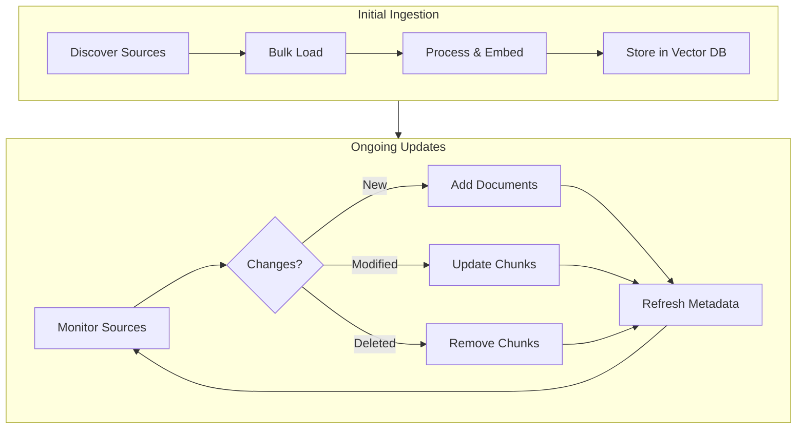

# Ingestion Scheduling and Updates

## Introduction

A RAG system is only as good as its data freshness. Documents change, new content arrives, and stale information leads to wrong answers. This section covers strategies for keeping your vector store synchronized with source documents — from initial bulk ingestion to continuous updates.

Building an automated ingestion pipeline ensures your RAG system always has current, accurate knowledge.

### What We'll Cover

- Initial bulk ingestion strategies
- Incremental update patterns
- Change detection methods
- Scheduled refresh strategies
- Handling deletes and updates
- Monitoring ingestion health

### Prerequisites

- Understanding of document ingestion pipeline
- Basic scheduling concepts (cron, task queues)
- Familiarity with checksums and file metadata

---

## Ingestion Lifecycle



### Update Strategies Comparison

| Strategy | Use Case | Complexity | Freshness |
|----------|----------|------------|-----------|
| Full rebuild | Small datasets (<10k docs) | Low | Stale between rebuilds |
| Scheduled incremental | Medium datasets, predictable changes | Medium | Minutes to hours |
| Event-driven | APIs, webhooks, real-time needs | High | Near real-time |
| Hybrid | Large datasets, mixed sources | High | Varies by source |

---

## Initial Bulk Ingestion

### Batch Processing for Large Collections

```python
import asyncio
from pathlib import Path
from dataclasses import dataclass
from typing import Iterator
import hashlib

@dataclass
class IngestionJob:
    """Represents a document to be ingested."""
    source_path: str
    source_type: str
    checksum: str = None
    
def calculate_checksum(file_path: Path) -> str:
    """Calculate MD5 checksum for change detection."""
    hasher = hashlib.md5()
    with open(file_path, 'rb') as f:
        for chunk in iter(lambda: f.read(8192), b''):
            hasher.update(chunk)
    return hasher.hexdigest()

def discover_documents(
    directory: Path,
    extensions: list[str] = None
) -> Iterator[IngestionJob]:
    """
    Discover documents for ingestion.
    
    Yields IngestionJob for each document found.
    """
    extensions = extensions or ['.pdf', '.docx', '.txt', '.md', '.html']
    
    for file_path in directory.rglob('*'):
        if file_path.suffix.lower() in extensions:
            yield IngestionJob(
                source_path=str(file_path),
                source_type=file_path.suffix.lower(),
                checksum=calculate_checksum(file_path)
            )

# Usage
# jobs = list(discover_documents(Path("./documents")))
# print(f"Found {len(jobs)} documents to ingest")
```

### Parallel Bulk Loading

```python
import asyncio
from concurrent.futures import ThreadPoolExecutor
from typing import Callable

class BulkIngester:
    """Process large document collections efficiently."""
    
    def __init__(
        self,
        processor: Callable,
        batch_size: int = 100,
        max_workers: int = 4
    ):
        self.processor = processor
        self.batch_size = batch_size
        self.max_workers = max_workers
        self.stats = {
            'processed': 0,
            'failed': 0,
            'skipped': 0
        }
    
    def process_batch(self, jobs: list[IngestionJob]) -> list[dict]:
        """Process a batch of documents."""
        results = []
        
        with ThreadPoolExecutor(max_workers=self.max_workers) as executor:
            futures = {
                executor.submit(self._process_single, job): job 
                for job in jobs
            }
            
            for future in futures:
                job = futures[future]
                try:
                    result = future.result()
                    results.append(result)
                    self.stats['processed'] += 1
                except Exception as e:
                    print(f"Failed to process {job.source_path}: {e}")
                    self.stats['failed'] += 1
        
        return results
    
    def _process_single(self, job: IngestionJob) -> dict:
        """Process a single document."""
        return self.processor(job)
    
    def run(self, jobs: list[IngestionJob]) -> None:
        """Run bulk ingestion with progress tracking."""
        total = len(jobs)
        
        for i in range(0, total, self.batch_size):
            batch = jobs[i:i + self.batch_size]
            self.process_batch(batch)
            
            progress = min(i + self.batch_size, total)
            print(f"Progress: {progress}/{total} ({progress/total*100:.1f}%)")
        
        print(f"\nIngestion complete:")
        print(f"  Processed: {self.stats['processed']}")
        print(f"  Failed: {self.stats['failed']}")
        print(f"  Skipped: {self.stats['skipped']}")

# Usage
def process_document(job: IngestionJob) -> dict:
    """Your document processing logic."""
    # Load, clean, chunk, embed...
    return {'path': job.source_path, 'status': 'success'}

# ingester = BulkIngester(process_document, batch_size=50, max_workers=4)
# ingester.run(jobs)
```

### State Tracking with SQLite

```python
import sqlite3
from datetime import datetime
from pathlib import Path

class IngestionStateDB:
    """Track ingestion state for incremental updates."""
    
    def __init__(self, db_path: str = "ingestion_state.db"):
        self.conn = sqlite3.connect(db_path)
        self._init_tables()
    
    def _init_tables(self):
        """Create tables for tracking ingestion state."""
        self.conn.executescript("""
            CREATE TABLE IF NOT EXISTS documents (
                source_path TEXT PRIMARY KEY,
                checksum TEXT NOT NULL,
                last_ingested TIMESTAMP,
                chunk_count INTEGER,
                status TEXT,
                error_message TEXT
            );
            
            CREATE TABLE IF NOT EXISTS ingestion_runs (
                run_id INTEGER PRIMARY KEY AUTOINCREMENT,
                started_at TIMESTAMP,
                completed_at TIMESTAMP,
                docs_added INTEGER DEFAULT 0,
                docs_updated INTEGER DEFAULT 0,
                docs_deleted INTEGER DEFAULT 0,
                status TEXT
            );
            
            CREATE INDEX IF NOT EXISTS idx_documents_checksum 
            ON documents(checksum);
        """)
        self.conn.commit()
    
    def get_document_state(self, source_path: str) -> dict | None:
        """Get current state of a document."""
        cursor = self.conn.execute(
            "SELECT * FROM documents WHERE source_path = ?",
            (source_path,)
        )
        row = cursor.fetchone()
        if row:
            return {
                'source_path': row[0],
                'checksum': row[1],
                'last_ingested': row[2],
                'chunk_count': row[3],
                'status': row[4]
            }
        return None
    
    def update_document_state(
        self,
        source_path: str,
        checksum: str,
        chunk_count: int,
        status: str = 'success',
        error_message: str = None
    ):
        """Update or insert document state."""
        self.conn.execute("""
            INSERT OR REPLACE INTO documents 
            (source_path, checksum, last_ingested, chunk_count, status, error_message)
            VALUES (?, ?, ?, ?, ?, ?)
        """, (source_path, checksum, datetime.now(), chunk_count, status, error_message))
        self.conn.commit()
    
    def get_known_documents(self) -> set[str]:
        """Get all known document paths."""
        cursor = self.conn.execute("SELECT source_path FROM documents")
        return {row[0] for row in cursor.fetchall()}
    
    def start_run(self) -> int:
        """Start a new ingestion run."""
        cursor = self.conn.execute(
            "INSERT INTO ingestion_runs (started_at, status) VALUES (?, 'running')",
            (datetime.now(),)
        )
        self.conn.commit()
        return cursor.lastrowid
    
    def complete_run(self, run_id: int, added: int, updated: int, deleted: int):
        """Complete an ingestion run."""
        self.conn.execute("""
            UPDATE ingestion_runs 
            SET completed_at = ?, docs_added = ?, docs_updated = ?, 
                docs_deleted = ?, status = 'completed'
            WHERE run_id = ?
        """, (datetime.now(), added, updated, deleted, run_id))
        self.conn.commit()
    
    def close(self):
        self.conn.close()
```

---

## Change Detection

### Checksum-Based Detection

```python
from enum import Enum

class ChangeType(Enum):
    NEW = "new"
    MODIFIED = "modified"
    DELETED = "deleted"
    UNCHANGED = "unchanged"

def detect_changes(
    current_jobs: list[IngestionJob],
    state_db: IngestionStateDB
) -> dict[str, list[IngestionJob]]:
    """
    Compare current files against stored state.
    
    Returns dict with 'new', 'modified', 'deleted', 'unchanged' lists.
    """
    changes = {
        'new': [],
        'modified': [],
        'deleted': [],
        'unchanged': []
    }
    
    current_paths = set()
    
    for job in current_jobs:
        current_paths.add(job.source_path)
        state = state_db.get_document_state(job.source_path)
        
        if state is None:
            # New document
            changes['new'].append(job)
        elif state['checksum'] != job.checksum:
            # Document modified
            changes['modified'].append(job)
        else:
            # Unchanged
            changes['unchanged'].append(job)
    
    # Find deleted documents
    known_paths = state_db.get_known_documents()
    deleted_paths = known_paths - current_paths
    
    for path in deleted_paths:
        changes['deleted'].append(IngestionJob(
            source_path=path,
            source_type=Path(path).suffix
        ))
    
    return changes

# Usage
# jobs = list(discover_documents(Path("./documents")))
# state_db = IngestionStateDB()
# changes = detect_changes(jobs, state_db)
# print(f"New: {len(changes['new'])}")
# print(f"Modified: {len(changes['modified'])}")
# print(f"Deleted: {len(changes['deleted'])}")
```

### Git-Based Change Detection

For version-controlled content:

```python
import subprocess
from datetime import datetime

def get_git_changes(
    repo_path: str,
    since: datetime = None,
    file_patterns: list[str] = None
) -> dict[str, list[str]]:
    """
    Get file changes from git history.
    
    Returns dict with 'added', 'modified', 'deleted' file paths.
    """
    changes = {'added': [], 'modified': [], 'deleted': []}
    
    # Build git command
    cmd = ['git', '-C', repo_path, 'diff', '--name-status']
    
    if since:
        # Get changes since a specific date
        since_str = since.strftime('%Y-%m-%d')
        cmd.extend(['--since', since_str, 'HEAD'])
    else:
        # Get uncommitted changes
        cmd.append('HEAD')
    
    if file_patterns:
        cmd.append('--')
        cmd.extend(file_patterns)
    
    try:
        result = subprocess.run(cmd, capture_output=True, text=True, check=True)
        
        for line in result.stdout.strip().split('\n'):
            if not line:
                continue
            
            status, file_path = line.split('\t', 1)
            
            if status == 'A':
                changes['added'].append(file_path)
            elif status == 'M':
                changes['modified'].append(file_path)
            elif status == 'D':
                changes['deleted'].append(file_path)
        
    except subprocess.CalledProcessError as e:
        print(f"Git command failed: {e}")
    
    return changes

# Usage
# changes = get_git_changes("./docs", file_patterns=["*.md", "*.rst"])
```

### API-Based Change Detection

For cloud sources like Notion or Confluence:

```python
from datetime import datetime, timedelta

def get_notion_changes(
    integration_token: str,
    database_id: str,
    since: datetime
) -> list[dict]:
    """
    Get recently changed Notion pages.
    """
    import requests
    
    headers = {
        "Authorization": f"Bearer {integration_token}",
        "Notion-Version": "2022-06-28",
        "Content-Type": "application/json"
    }
    
    # Query for recently edited pages
    response = requests.post(
        f"https://api.notion.com/v1/databases/{database_id}/query",
        headers=headers,
        json={
            "filter": {
                "timestamp": "last_edited_time",
                "last_edited_time": {
                    "after": since.isoformat()
                }
            },
            "sorts": [
                {
                    "timestamp": "last_edited_time",
                    "direction": "descending"
                }
            ]
        }
    )
    
    if response.status_code == 200:
        return response.json().get('results', [])
    
    return []

def sync_notion_changes(
    integration_token: str,
    database_id: str,
    state_db: IngestionStateDB,
    vector_store
):
    """Sync Notion changes to vector store."""
    # Get last sync time
    last_sync = state_db.get_last_sync_time('notion', database_id)
    since = last_sync or datetime.now() - timedelta(days=30)
    
    changed_pages = get_notion_changes(integration_token, database_id, since)
    
    for page in changed_pages:
        page_id = page['id']
        last_edited = page['last_edited_time']
        
        # Fetch full page content and re-ingest
        # ... process page ...
        
        state_db.update_sync_time('notion', database_id, page_id, last_edited)
```

---

## Incremental Update Pipeline

### Handling Additions

```python
def ingest_new_documents(
    new_jobs: list[IngestionJob],
    processor,
    vector_store,
    state_db: IngestionStateDB
) -> int:
    """
    Ingest new documents into vector store.
    
    Returns count of successfully ingested documents.
    """
    success_count = 0
    
    for job in new_jobs:
        try:
            # Process document
            result = processor(job)
            chunks = result['chunks']
            embeddings = result['embeddings']
            
            # Add to vector store
            chunk_ids = vector_store.add(
                documents=chunks,
                embeddings=embeddings,
                metadatas=[{
                    'source': job.source_path,
                    'checksum': job.checksum
                } for _ in chunks]
            )
            
            # Update state
            state_db.update_document_state(
                source_path=job.source_path,
                checksum=job.checksum,
                chunk_count=len(chunks),
                status='success'
            )
            
            success_count += 1
            
        except Exception as e:
            state_db.update_document_state(
                source_path=job.source_path,
                checksum=job.checksum,
                chunk_count=0,
                status='failed',
                error_message=str(e)
            )
    
    return success_count
```

### Handling Modifications

```python
def update_modified_documents(
    modified_jobs: list[IngestionJob],
    processor,
    vector_store,
    state_db: IngestionStateDB
) -> int:
    """
    Update modified documents in vector store.
    
    Strategy: Delete old chunks, add new chunks.
    """
    success_count = 0
    
    for job in modified_jobs:
        try:
            # Delete existing chunks for this document
            vector_store.delete(
                where={"source": job.source_path}
            )
            
            # Process updated document
            result = processor(job)
            chunks = result['chunks']
            embeddings = result['embeddings']
            
            # Add new chunks
            vector_store.add(
                documents=chunks,
                embeddings=embeddings,
                metadatas=[{
                    'source': job.source_path,
                    'checksum': job.checksum,
                    'updated_at': datetime.now().isoformat()
                } for _ in chunks]
            )
            
            # Update state
            state_db.update_document_state(
                source_path=job.source_path,
                checksum=job.checksum,
                chunk_count=len(chunks),
                status='success'
            )
            
            success_count += 1
            
        except Exception as e:
            state_db.update_document_state(
                source_path=job.source_path,
                checksum=job.checksum,
                chunk_count=0,
                status='failed',
                error_message=str(e)
            )
    
    return success_count
```

### Handling Deletions

```python
def remove_deleted_documents(
    deleted_jobs: list[IngestionJob],
    vector_store,
    state_db: IngestionStateDB
) -> int:
    """
    Remove deleted documents from vector store.
    """
    success_count = 0
    
    for job in deleted_jobs:
        try:
            # Delete chunks from vector store
            vector_store.delete(
                where={"source": job.source_path}
            )
            
            # Remove from state database
            state_db.conn.execute(
                "DELETE FROM documents WHERE source_path = ?",
                (job.source_path,)
            )
            state_db.conn.commit()
            
            success_count += 1
            
        except Exception as e:
            print(f"Failed to delete {job.source_path}: {e}")
    
    return success_count
```

---

## Complete Incremental Update Pipeline

```python
class IncrementalIngestionPipeline:
    """Full incremental ingestion pipeline with scheduling."""
    
    def __init__(
        self,
        source_dir: Path,
        processor,
        vector_store,
        state_db_path: str = "ingestion_state.db"
    ):
        self.source_dir = source_dir
        self.processor = processor
        self.vector_store = vector_store
        self.state_db = IngestionStateDB(state_db_path)
    
    def run_sync(self) -> dict:
        """
        Run a single sync cycle.
        
        Returns summary of changes processed.
        """
        # Start tracking this run
        run_id = self.state_db.start_run()
        
        try:
            # Discover current documents
            current_jobs = list(discover_documents(self.source_dir))
            
            # Detect changes
            changes = detect_changes(current_jobs, self.state_db)
            
            # Process changes
            added = ingest_new_documents(
                changes['new'],
                self.processor,
                self.vector_store,
                self.state_db
            )
            
            updated = update_modified_documents(
                changes['modified'],
                self.processor,
                self.vector_store,
                self.state_db
            )
            
            deleted = remove_deleted_documents(
                changes['deleted'],
                self.vector_store,
                self.state_db
            )
            
            # Complete the run
            self.state_db.complete_run(run_id, added, updated, deleted)
            
            return {
                'run_id': run_id,
                'added': added,
                'updated': updated,
                'deleted': deleted,
                'unchanged': len(changes['unchanged']),
                'status': 'success'
            }
            
        except Exception as e:
            return {
                'run_id': run_id,
                'status': 'failed',
                'error': str(e)
            }
    
    def get_stats(self) -> dict:
        """Get current ingestion statistics."""
        cursor = self.state_db.conn.execute("""
            SELECT 
                COUNT(*) as total_docs,
                SUM(chunk_count) as total_chunks,
                COUNT(CASE WHEN status = 'failed' THEN 1 END) as failed_docs,
                MAX(last_ingested) as last_ingestion
            FROM documents
        """)
        row = cursor.fetchone()
        
        return {
            'total_documents': row[0],
            'total_chunks': row[1] or 0,
            'failed_documents': row[2],
            'last_ingestion': row[3]
        }

# Usage
# pipeline = IncrementalIngestionPipeline(
#     source_dir=Path("./documents"),
#     processor=my_processor,
#     vector_store=my_vector_store
# )
# result = pipeline.run_sync()
# print(f"Added: {result['added']}, Updated: {result['updated']}")
```

---

## Scheduling Strategies

### Cron-Based Scheduling

```python
# Using APScheduler for Python scheduling
from apscheduler.schedulers.blocking import BlockingScheduler
from apscheduler.triggers.cron import CronTrigger

def setup_scheduled_ingestion(pipeline: IncrementalIngestionPipeline):
    """Set up scheduled ingestion with APScheduler."""
    scheduler = BlockingScheduler()
    
    # Run every hour
    scheduler.add_job(
        pipeline.run_sync,
        CronTrigger(minute=0),  # Every hour at :00
        id='hourly_sync',
        name='Hourly document sync'
    )
    
    # Full rebuild weekly (Sunday 2 AM)
    # scheduler.add_job(
    #     pipeline.full_rebuild,
    #     CronTrigger(day_of_week='sun', hour=2),
    #     id='weekly_rebuild'
    # )
    
    print("Scheduler started. Press Ctrl+C to exit.")
    scheduler.start()

# Alternative: Simple loop with sleep
import time

def run_continuous_sync(
    pipeline: IncrementalIngestionPipeline,
    interval_seconds: int = 3600
):
    """Run sync in a continuous loop."""
    while True:
        print(f"Starting sync at {datetime.now()}")
        result = pipeline.run_sync()
        print(f"Sync complete: {result}")
        
        time.sleep(interval_seconds)
```

### Event-Driven Ingestion

```python
from watchdog.observers import Observer
from watchdog.events import FileSystemEventHandler

class DocumentChangeHandler(FileSystemEventHandler):
    """Watch for file changes and trigger ingestion."""
    
    def __init__(self, pipeline: IncrementalIngestionPipeline):
        self.pipeline = pipeline
        self.pending_changes = set()
        self.debounce_seconds = 5
    
    def on_created(self, event):
        if not event.is_directory:
            self._queue_change(event.src_path, 'created')
    
    def on_modified(self, event):
        if not event.is_directory:
            self._queue_change(event.src_path, 'modified')
    
    def on_deleted(self, event):
        if not event.is_directory:
            self._queue_change(event.src_path, 'deleted')
    
    def _queue_change(self, path: str, change_type: str):
        """Queue change for processing (with debouncing)."""
        self.pending_changes.add((path, change_type))
        # In production, use debouncing to batch rapid changes

def watch_for_changes(
    directory: Path,
    pipeline: IncrementalIngestionPipeline
):
    """Watch directory for changes and trigger ingestion."""
    handler = DocumentChangeHandler(pipeline)
    observer = Observer()
    observer.schedule(handler, str(directory), recursive=True)
    observer.start()
    
    print(f"Watching {directory} for changes...")
    
    try:
        while True:
            time.sleep(1)
    except KeyboardInterrupt:
        observer.stop()
    
    observer.join()
```

### Webhook-Based Triggers

```python
from flask import Flask, request, jsonify

def create_ingestion_api(pipeline: IncrementalIngestionPipeline):
    """Create Flask API for triggering ingestion."""
    app = Flask(__name__)
    
    @app.route('/webhook/ingest', methods=['POST'])
    def trigger_ingestion():
        """Webhook endpoint for triggering sync."""
        data = request.json or {}
        
        # Optionally filter by source
        source = data.get('source')
        
        result = pipeline.run_sync()
        
        return jsonify({
            'status': 'completed',
            'result': result
        })
    
    @app.route('/status', methods=['GET'])
    def get_status():
        """Get current ingestion status."""
        stats = pipeline.get_stats()
        return jsonify(stats)
    
    @app.route('/ingest/document', methods=['POST'])
    def ingest_single():
        """Ingest a single document on demand."""
        data = request.json
        path = data.get('path')
        
        if not path:
            return jsonify({'error': 'path required'}), 400
        
        job = IngestionJob(
            source_path=path,
            source_type=Path(path).suffix,
            checksum=calculate_checksum(Path(path))
        )
        
        # Process single document
        result = ingest_new_documents(
            [job],
            pipeline.processor,
            pipeline.vector_store,
            pipeline.state_db
        )
        
        return jsonify({'ingested': result})
    
    return app

# Usage
# app = create_ingestion_api(pipeline)
# app.run(host='0.0.0.0', port=8080)
```

---

## Monitoring Ingestion Health

### Health Metrics

```python
from dataclasses import dataclass
from datetime import datetime, timedelta

@dataclass
class IngestionHealthMetrics:
    """Health metrics for ingestion pipeline."""
    last_successful_run: datetime
    last_run_duration_seconds: float
    documents_pending: int
    documents_failed: int
    avg_processing_time_ms: float
    queue_depth: int
    is_healthy: bool
    issues: list[str]

def check_ingestion_health(
    state_db: IngestionStateDB,
    max_age_hours: int = 24
) -> IngestionHealthMetrics:
    """Check health of ingestion pipeline."""
    issues = []
    
    # Get last run info
    cursor = state_db.conn.execute("""
        SELECT completed_at, 
               julianday(completed_at) - julianday(started_at) as duration_days,
               status
        FROM ingestion_runs 
        ORDER BY run_id DESC 
        LIMIT 1
    """)
    row = cursor.fetchone()
    
    last_run = None
    duration = 0
    
    if row:
        last_run = datetime.fromisoformat(row[0]) if row[0] else None
        duration = (row[1] or 0) * 24 * 3600  # Convert days to seconds
    
    # Check if last run is too old
    if last_run:
        age = datetime.now() - last_run
        if age > timedelta(hours=max_age_hours):
            issues.append(f"Last sync was {age.total_seconds()/3600:.1f} hours ago")
    else:
        issues.append("No successful runs found")
    
    # Count failed documents
    cursor = state_db.conn.execute("""
        SELECT COUNT(*) FROM documents WHERE status = 'failed'
    """)
    failed_count = cursor.fetchone()[0]
    
    if failed_count > 0:
        issues.append(f"{failed_count} documents failed to ingest")
    
    return IngestionHealthMetrics(
        last_successful_run=last_run,
        last_run_duration_seconds=duration,
        documents_pending=0,  # Would come from queue
        documents_failed=failed_count,
        avg_processing_time_ms=0,  # Would track separately
        queue_depth=0,
        is_healthy=len(issues) == 0,
        issues=issues
    )

# Usage
# health = check_ingestion_health(state_db)
# if not health.is_healthy:
#     send_alert(health.issues)
```

### Logging and Alerting

```python
import logging
from typing import Callable

def setup_ingestion_logging():
    """Configure logging for ingestion pipeline."""
    logger = logging.getLogger('ingestion')
    logger.setLevel(logging.INFO)
    
    # File handler for detailed logs
    file_handler = logging.FileHandler('ingestion.log')
    file_handler.setFormatter(logging.Formatter(
        '%(asctime)s - %(levelname)s - %(message)s'
    ))
    logger.addHandler(file_handler)
    
    # Console handler for important events
    console_handler = logging.StreamHandler()
    console_handler.setLevel(logging.WARNING)
    logger.addHandler(console_handler)
    
    return logger

def create_alert_callback(
    webhook_url: str = None,
    email: str = None
) -> Callable[[str], None]:
    """Create callback for sending alerts."""
    
    def send_alert(message: str):
        if webhook_url:
            import requests
            requests.post(webhook_url, json={'text': message})
        
        if email:
            # Send email alert
            pass
        
        print(f"ALERT: {message}")
    
    return send_alert
```

---

## Hands-on Exercise

### Your Task

Build an incremental sync function that:
1. Detects new, modified, and deleted documents
2. Processes changes appropriately
3. Tracks state for future runs
4. Returns a summary

### Requirements

```python
def incremental_sync(
    source_dir: Path,
    state_db_path: str = "state.db"
) -> dict:
    """
    Run incremental sync on a document directory.
    
    Returns:
        {
            'new': int,
            'modified': int,
            'deleted': int,
            'unchanged': int
        }
    """
    pass
```

<details>
<summary>💡 Hints</summary>

- Use checksum comparison for change detection
- Track document state between runs
- Handle each change type separately
- Return counts for monitoring

</details>

<details>
<summary>✅ Solution</summary>

```python
def incremental_sync(
    source_dir: Path,
    state_db_path: str = "state.db"
) -> dict:
    """Run incremental sync on a document directory."""
    
    # Initialize state tracking
    state_db = IngestionStateDB(state_db_path)
    
    # Discover current documents
    current_jobs = list(discover_documents(source_dir))
    
    # Detect changes
    changes = detect_changes(current_jobs, state_db)
    
    result = {
        'new': 0,
        'modified': 0,
        'deleted': 0,
        'unchanged': len(changes['unchanged'])
    }
    
    # Process new documents
    for job in changes['new']:
        state_db.update_document_state(
            source_path=job.source_path,
            checksum=job.checksum,
            chunk_count=0,  # Would be actual count
            status='success'
        )
        result['new'] += 1
    
    # Process modified documents
    for job in changes['modified']:
        state_db.update_document_state(
            source_path=job.source_path,
            checksum=job.checksum,
            chunk_count=0,
            status='success'
        )
        result['modified'] += 1
    
    # Process deleted documents
    for job in changes['deleted']:
        state_db.conn.execute(
            "DELETE FROM documents WHERE source_path = ?",
            (job.source_path,)
        )
        result['deleted'] += 1
    
    state_db.conn.commit()
    state_db.close()
    
    return result

# Usage
# result = incremental_sync(Path("./documents"))
# print(f"Sync complete: {result}")
```

</details>

---

## Summary

Keeping your RAG system current requires structured ingestion management:

✅ **Bulk ingestion** handles initial document loading efficiently
✅ **Change detection** identifies new, modified, and deleted content
✅ **State tracking** enables incremental updates
✅ **Scheduled syncs** keep data fresh automatically
✅ **Event-driven updates** provide near-real-time freshness
✅ **Health monitoring** catches issues before they affect users

**Up Next:** [Document Processing / Chunking Strategies](../03-document-processing-chunking/00-document-processing-chunking.md) — Split documents into optimal chunks for retrieval.

---

## Further Reading

- [APScheduler Documentation](https://apscheduler.readthedocs.io/) - Python job scheduling
- [Watchdog Library](https://python-watchdog.readthedocs.io/) - File system monitoring
- [Celery Task Queue](https://docs.celeryq.dev/) - Distributed task processing

<!--
Sources Consulted:
- OpenAI Vector Stores Guide: https://platform.openai.com/docs/guides/retrieval
- LlamaIndex Ingestion Pipeline: https://docs.llamaindex.ai/
-->
