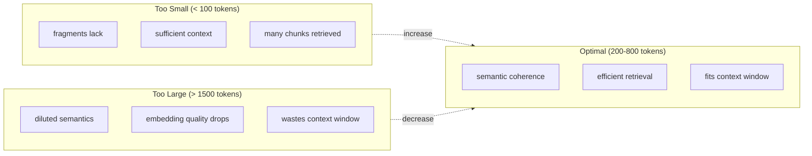
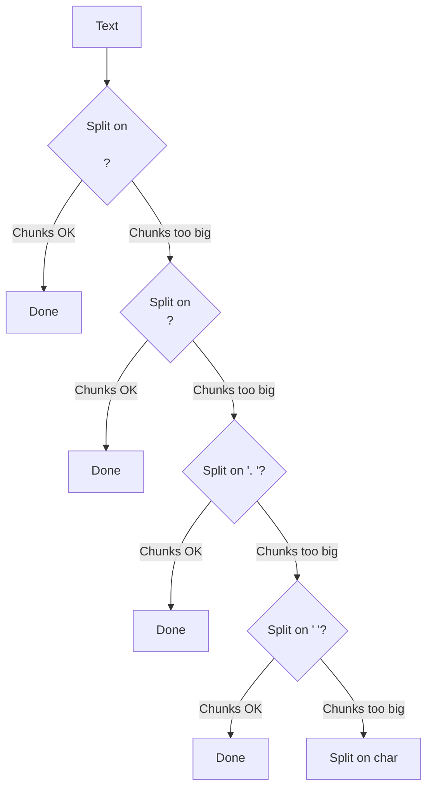
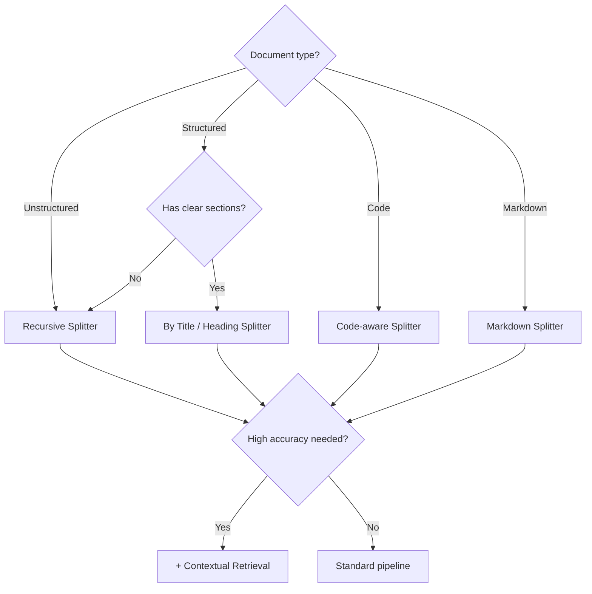

# Chunking Strategies

## Introduction

Chunking transforms long documents into retrieval-sized pieces. The strategy you choose directly impacts whether your RAG system finds the right content — and whether that content makes sense on its own.

This section covers the fundamental chunking approaches, from simple fixed-size splitting to intelligent recursive methods.

### What We'll Cover

- RAG-optimized chunk sizes
- Fixed-size chunking
- Recursive text splitting
- Token-based vs character-based
- Overlap strategies
- Choosing the right approach

### Prerequisites

- Understanding of tokenization
- Basic Python string manipulation

---

## Why Chunk Size Matters



### Chunk Size Guidelines

| Use Case | Recommended Size | Overlap | Rationale |
|----------|-----------------|---------|-----------|
| Q&A over documents | 400-600 tokens | 50-100 | Balance precision and context |
| Conversational RAG | 200-400 tokens | 50 | Shorter for quick retrieval |
| Technical docs | 600-800 tokens | 100-200 | Preserve code blocks |
| Legal/contracts | 800-1000 tokens | 200 | Maintain clause integrity |
| Research papers | 500-700 tokens | 100 | Section-aware chunking |

> **🤖 AI Context:** OpenAI's file search defaults to 800-token chunks with 400-token overlap. This 50% overlap is aggressive but helps maintain continuity.

---

## Fixed-Size Chunking

The simplest approach: split text at fixed intervals.

### Character-Based Splitting

```python
def fixed_size_chunks(text: str, chunk_size: int = 1000, overlap: int = 200) -> list[str]:
    """
    Split text into fixed-size character chunks.
    
    Args:
        text: Input text to chunk
        chunk_size: Maximum characters per chunk
        overlap: Characters to repeat between chunks
    
    Returns:
        List of text chunks
    """
    chunks = []
    start = 0
    
    while start < len(text):
        end = start + chunk_size
        chunk = text[start:end]
        chunks.append(chunk)
        start = end - overlap  # Step back by overlap amount
    
    return chunks

# Usage
text = "A" * 500 + " " + "B" * 500 + " " + "C" * 500  # 1502 chars
chunks = fixed_size_chunks(text, chunk_size=600, overlap=100)

for i, chunk in enumerate(chunks):
    print(f"Chunk {i+1}: {len(chunk)} chars, starts with: {chunk[:20]}...")
```

**Output:**
```
Chunk 1: 600 chars, starts with: AAAAAAAAAAAAAAAAAAAA...
Chunk 2: 600 chars, starts with: AAAAAAAAAAAAAAAAAAAA...
Chunk 3: 600 chars, starts with: BBBBBBBBBBBBBBBBBBBB...
Chunk 4: 402 chars, starts with: CCCCCCCCCCCCCCCCCCCC...
```

### Problems with Fixed-Size

| ❌ Problem | Impact |
|------------|--------|
| Breaks mid-word | "docu-" / "-ment" |
| Breaks mid-sentence | Incomplete thoughts |
| Ignores structure | Headers split from content |
| No semantic awareness | Topics split arbitrarily |

---

## Token-Based Chunking

Tokens align better with how LLMs process text.

```python
import tiktoken

def token_based_chunks(
    text: str, 
    chunk_size: int = 500, 
    overlap: int = 50,
    model: str = "gpt-4"
) -> list[str]:
    """
    Split text by token count rather than characters.
    """
    encoding = tiktoken.encoding_for_model(model)
    tokens = encoding.encode(text)
    
    chunks = []
    start = 0
    
    while start < len(tokens):
        end = start + chunk_size
        chunk_tokens = tokens[start:end]
        chunk_text = encoding.decode(chunk_tokens)
        chunks.append(chunk_text)
        start = end - overlap
    
    return chunks

# Usage
text = """
Machine learning models require large amounts of training data.
The quality of this data significantly impacts model performance.
Data preprocessing steps include cleaning, normalization, and augmentation.
"""

chunks = token_based_chunks(text, chunk_size=20, overlap=5)
for i, chunk in enumerate(chunks):
    print(f"Chunk {i+1}: {chunk}")
```

### Character vs Token Comparison

| Aspect | Character-Based | Token-Based |
|--------|-----------------|-------------|
| Speed | Faster | Slower (encoding overhead) |
| Accuracy | Less precise for LLMs | Matches LLM processing |
| Predictability | Exact lengths | Varies by content |
| Use case | Simple pipelines | Production RAG |

---

## Recursive Text Splitting

The most practical approach for real documents: try to split on natural boundaries, falling back to smaller separators.

### How Recursive Splitting Works



### Implementation

```python
class RecursiveTextSplitter:
    """Split text using hierarchical separators."""
    
    def __init__(
        self,
        chunk_size: int = 1000,
        chunk_overlap: int = 200,
        separators: list[str] = None
    ):
        self.chunk_size = chunk_size
        self.chunk_overlap = chunk_overlap
        self.separators = separators or ["\n\n", "\n", ". ", " ", ""]
    
    def split(self, text: str) -> list[str]:
        """Split text recursively on separators."""
        return self._split_text(text, self.separators)
    
    def _split_text(self, text: str, separators: list[str]) -> list[str]:
        """Recursive splitting with fallback separators."""
        final_chunks = []
        
        # Find best separator
        separator = separators[-1]  # Default to last (smallest)
        for sep in separators:
            if sep in text:
                separator = sep
                break
        
        # Split on chosen separator
        splits = text.split(separator) if separator else list(text)
        
        # Process splits
        current_chunk = []
        current_length = 0
        
        for split in splits:
            split_len = len(split)
            
            if current_length + split_len > self.chunk_size:
                # Current chunk is full
                if current_chunk:
                    chunk_text = separator.join(current_chunk)
                    
                    # If chunk is still too big, recurse with next separator
                    if len(chunk_text) > self.chunk_size and len(separators) > 1:
                        final_chunks.extend(
                            self._split_text(chunk_text, separators[1:])
                        )
                    else:
                        final_chunks.append(chunk_text)
                
                # Start new chunk (with overlap if possible)
                overlap_chunks = []
                overlap_len = 0
                for item in reversed(current_chunk):
                    if overlap_len + len(item) <= self.chunk_overlap:
                        overlap_chunks.insert(0, item)
                        overlap_len += len(item)
                    else:
                        break
                
                current_chunk = overlap_chunks + [split]
                current_length = overlap_len + split_len
            else:
                current_chunk.append(split)
                current_length += split_len
        
        # Don't forget the last chunk
        if current_chunk:
            final_chunks.append(separator.join(current_chunk))
        
        return final_chunks

# Usage
splitter = RecursiveTextSplitter(chunk_size=200, chunk_overlap=50)

document = """
# Introduction

This is the first paragraph about machine learning.
It contains important concepts.

# Methods

We used several approaches in our research.
The primary method was deep learning.

# Results

The results showed significant improvement.
Accuracy increased by 15% over baseline.
"""

chunks = splitter.split(document)
for i, chunk in enumerate(chunks):
    print(f"--- Chunk {i+1} ({len(chunk)} chars) ---")
    print(chunk)
```

---

## Using LangChain Text Splitters

LangChain provides production-ready splitters:

```python
from langchain.text_splitter import (
    RecursiveCharacterTextSplitter,
    CharacterTextSplitter,
    TokenTextSplitter
)

# Recursive (recommended for most cases)
recursive_splitter = RecursiveCharacterTextSplitter(
    chunk_size=1000,
    chunk_overlap=200,
    separators=["\n\n", "\n", ". ", " ", ""],
    length_function=len
)

# Character-based (simple)
char_splitter = CharacterTextSplitter(
    chunk_size=1000,
    chunk_overlap=200,
    separator="\n\n"
)

# Token-based (for precise token counting)
token_splitter = TokenTextSplitter(
    chunk_size=500,
    chunk_overlap=50,
    model_name="gpt-4"
)

# Usage
text = "Your document text here..."
chunks = recursive_splitter.split_text(text)
```

### Using LlamaIndex Node Parsers

```python
from llama_index.core import Document
from llama_index.core.node_parser import (
    SentenceSplitter,
    TokenTextSplitter,
    SemanticSplitterNodeParser
)
from llama_index.embeddings.openai import OpenAIEmbedding

# Sentence-aware splitting
sentence_parser = SentenceSplitter(
    chunk_size=1024,
    chunk_overlap=20
)

# Create document
doc = Document(text="Your document text here...")

# Parse into nodes
nodes = sentence_parser.get_nodes_from_documents([doc])

for node in nodes:
    print(f"Node ({len(node.text)} chars): {node.text[:50]}...")
```

---

## Overlap Strategies

Overlap helps maintain context across chunk boundaries.

### Calculating Effective Overlap

```python
def calculate_overlap_stats(
    chunks: list[str],
    overlap: int
) -> dict:
    """Calculate overlap effectiveness."""
    stats = {
        'total_chunks': len(chunks),
        'avg_chunk_size': sum(len(c) for c in chunks) / len(chunks),
        'overlap_ratio': overlap / (sum(len(c) for c in chunks) / len(chunks)),
        'total_overlap_chars': overlap * (len(chunks) - 1),
        'unique_content': sum(len(c) for c in chunks) - overlap * (len(chunks) - 1)
    }
    return stats

# Example
chunks = ["A" * 800, "A" * 200 + "B" * 600, "B" * 200 + "C" * 600]
overlap = 200

stats = calculate_overlap_stats(chunks, overlap)
print(f"Overlap ratio: {stats['overlap_ratio']:.1%}")
print(f"Unique content: {stats['unique_content']} chars")
```

### Overlap Guidelines

| Overlap % | Use Case | Trade-off |
|-----------|----------|-----------|
| 0% | Distinct, independent chunks | Risk losing boundary context |
| 10-20% | Standard documents | Good balance |
| 25-50% | Technical/legal content | Higher storage, better continuity |
| 50%+ | High-accuracy requirements | Significant redundancy |

> **Warning:** High overlap (50%) doubles your storage and embedding costs but may be worth it for critical applications.

---

## Choosing the Right Strategy



### Decision Table

| Document Type | Recommended Splitter | Chunk Size | Overlap |
|---------------|---------------------|------------|---------|
| General text | RecursiveCharacter | 800-1000 | 200 |
| Technical docs | RecursiveCharacter | 600-800 | 150 |
| Code files | CodeTextSplitter | 1000-1500 | 100 |
| Markdown | MarkdownTextSplitter | 800-1000 | 200 |
| HTML | HTMLHeaderTextSplitter | Varies | — |
| PDF (structured) | Unstructured by_title | 500-800 | 100 |

---

## Hands-on Exercise

### Your Task

Implement a chunking function that:
1. Uses recursive splitting with custom separators
2. Respects token limits (not just character limits)
3. Maintains overlap between chunks
4. Returns metadata about each chunk

### Requirements

```python
def smart_chunk(
    text: str,
    max_tokens: int = 500,
    overlap_tokens: int = 50,
    model: str = "gpt-4"
) -> list[dict]:
    """
    Smart chunking with token awareness.
    
    Returns:
        List of dicts with 'text', 'tokens', 'start_char', 'end_char'
    """
    pass
```

<details>
<summary>💡 Hints</summary>

- Use tiktoken for token counting
- Split on natural boundaries first
- Track character positions as you chunk
- Return rich metadata for debugging

</details>

<details>
<summary>✅ Solution</summary>

```python
import tiktoken

def smart_chunk(
    text: str,
    max_tokens: int = 500,
    overlap_tokens: int = 50,
    model: str = "gpt-4"
) -> list[dict]:
    """Smart chunking with token awareness."""
    
    encoding = tiktoken.encoding_for_model(model)
    separators = ["\n\n", "\n", ". ", " "]
    
    def count_tokens(s: str) -> int:
        return len(encoding.encode(s))
    
    def split_by_separators(s: str, seps: list[str]) -> list[str]:
        """Split using first effective separator."""
        for sep in seps:
            if sep in s:
                return [part + sep for part in s.split(sep) if part]
        return [s]  # No separator found
    
    # Initial split on paragraphs
    segments = split_by_separators(text, separators)
    
    chunks = []
    current_text = ""
    current_start = 0
    char_position = 0
    
    for segment in segments:
        segment_tokens = count_tokens(segment)
        current_tokens = count_tokens(current_text)
        
        if current_tokens + segment_tokens > max_tokens:
            # Save current chunk
            if current_text:
                chunks.append({
                    'text': current_text.strip(),
                    'tokens': count_tokens(current_text.strip()),
                    'start_char': current_start,
                    'end_char': char_position
                })
                
                # Calculate overlap
                overlap_text = ""
                words = current_text.split()
                for word in reversed(words):
                    test = word + " " + overlap_text
                    if count_tokens(test) <= overlap_tokens:
                        overlap_text = test
                    else:
                        break
                
                current_text = overlap_text + segment
                current_start = char_position - len(overlap_text.encode())
            else:
                current_text = segment
        else:
            current_text += segment
        
        char_position += len(segment)
    
    # Don't forget last chunk
    if current_text.strip():
        chunks.append({
            'text': current_text.strip(),
            'tokens': count_tokens(current_text.strip()),
            'start_char': current_start,
            'end_char': char_position
        })
    
    return chunks

# Test
text = """
Introduction to machine learning.

Machine learning is a subset of artificial intelligence.
It enables computers to learn from data.

Applications include image recognition and natural language processing.
These technologies are transforming many industries.
"""

chunks = smart_chunk(text, max_tokens=50, overlap_tokens=10)
for chunk in chunks:
    print(f"Tokens: {chunk['tokens']}, Chars: {chunk['start_char']}-{chunk['end_char']}")
    print(chunk['text'][:60] + "...")
    print("---")
```

</details>

---

## Summary

Chunking strategy fundamentally affects RAG retrieval quality:

✅ **Token-based** chunking aligns with LLM processing
✅ **Recursive splitting** respects natural document boundaries  
✅ **Overlap** maintains continuity across chunks
✅ **Document-aware** strategies preserve structure
✅ **Trade-offs** exist between chunk size, overlap, and accuracy

**Next:** [Handling Document Types](./02-handling-document-types.md) — Type-specific parsing strategies.

---

## Further Reading

- [LangChain Text Splitters](https://python.langchain.com/docs/concepts/text_splitters/) - Splitter concepts
- [LlamaIndex Node Parsers](https://developers.llamaindex.ai/python/framework/module_guides/loading/node_parsers/) - Parser modules
- [tiktoken](https://github.com/openai/tiktoken) - OpenAI's tokenizer library

<!--
Sources Consulted:
- LlamaIndex Node Parsers: https://developers.llamaindex.ai/python/framework/module_guides/loading/node_parsers/
- Unstructured Chunking: https://docs.unstructured.io/open-source/core-functionality/chunking
- OpenAI File Search defaults: https://platform.openai.com/docs/guides/retrieval
-->
