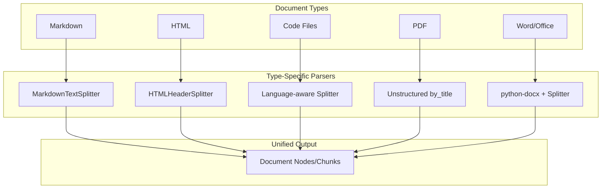

# Handling Document Types

## Introduction

Different document formats require different parsing strategies. A PDF with embedded tables needs different handling than a markdown file with code blocks. This section covers type-specific chunking that preserves the unique structure of each format.

Building format-aware chunking ensures every document type yields high-quality retrieval chunks.

### What We'll Cover

- Type-specific chunking strategies
- Markdown and HTML handling
- Code file chunking
- PDF structure preservation
- Unified output formats
- Quality validation

### Prerequisites

- Understanding of chunking strategies
- Familiarity with document parsing

---

## Document Type Overview



| Document Type | Key Challenges | Recommended Approach |
|---------------|----------------|---------------------|
| Markdown | Headers, code blocks, lists | Header-aware splitter |
| HTML | Nested structure, boilerplate | Extract main content + HTML splitter |
| Code | Syntax, functions, classes | Language-aware splitter |
| PDF | Layout, tables, images | Unstructured with by_title |
| Word/DOCX | Styles, sections, tables | Extract structure + recursive |
| Plain text | No structure | Recursive character splitter |

---

## Markdown Chunking

Markdown has rich structure that should be preserved in chunks.

### Header-Aware Splitting

```python
from langchain.text_splitter import MarkdownHeaderTextSplitter

# Define headers to split on
headers_to_split = [
    ("#", "header_1"),
    ("##", "header_2"),
    ("###", "header_3"),
]

markdown_splitter = MarkdownHeaderTextSplitter(
    headers_to_split_on=headers_to_split,
    strip_headers=False  # Keep headers in content
)

markdown_doc = """
# Introduction

This is the introduction section about machine learning.

## What is ML?

Machine learning is a subset of artificial intelligence that enables 
computers to learn from data without being explicitly programmed.

### Supervised Learning

In supervised learning, models learn from labeled examples.

### Unsupervised Learning

Unsupervised learning discovers patterns without labels.

## Applications

Machine learning powers many modern applications.
"""

splits = markdown_splitter.split_text(markdown_doc)

for split in splits:
    print(f"Content: {split.page_content[:50]}...")
    print(f"Metadata: {split.metadata}")
    print("---")
```

**Output:**
```
Content: # Introduction

This is the introduction secti...
Metadata: {'header_1': 'Introduction'}
---
Content: ## What is ML?

Machine learning is a subset of...
Metadata: {'header_1': 'Introduction', 'header_2': 'What is ML?'}
---
```

### Preserving Code Blocks

```python
import re

def chunk_markdown_preserve_code(
    markdown: str,
    chunk_size: int = 1000,
    overlap: int = 200
) -> list[dict]:
    """
    Chunk markdown while keeping code blocks intact.
    """
    # Pattern to match code blocks
    code_block_pattern = r'```[\s\S]*?```'
    
    # Find all code blocks with their positions
    code_blocks = []
    for match in re.finditer(code_block_pattern, markdown):
        code_blocks.append({
            'start': match.start(),
            'end': match.end(),
            'content': match.group()
        })
    
    # Split text around code blocks
    chunks = []
    current_pos = 0
    current_chunk = ""
    
    for block in code_blocks:
        # Text before code block
        text_before = markdown[current_pos:block['start']]
        
        # If adding text exceeds chunk size, save current and start new
        if len(current_chunk) + len(text_before) > chunk_size:
            if current_chunk:
                chunks.append({
                    'content': current_chunk,
                    'has_code': '```' in current_chunk
                })
            current_chunk = text_before
        else:
            current_chunk += text_before
        
        # Code blocks stay together
        code_content = block['content']
        
        if len(current_chunk) + len(code_content) > chunk_size:
            # Save current chunk
            if current_chunk:
                chunks.append({
                    'content': current_chunk,
                    'has_code': '```' in current_chunk
                })
            # Code block becomes its own chunk
            chunks.append({
                'content': code_content,
                'has_code': True
            })
            current_chunk = ""
        else:
            current_chunk += code_content
        
        current_pos = block['end']
    
    # Remaining text after last code block
    remaining = markdown[current_pos:]
    current_chunk += remaining
    
    if current_chunk:
        chunks.append({
            'content': current_chunk,
            'has_code': '```' in current_chunk
        })
    
    return chunks

# Usage
markdown = """
# API Guide

Here's how to call the API:

```python
import requests

response = requests.get('https://api.example.com/data')
data = response.json()
print(data)
```

The response will contain the data you requested.

## Error Handling

Always handle potential errors:

```python
try:
    response = requests.get(url)
    response.raise_for_status()
except requests.exceptions.RequestException as e:
    print(f"Error: {e}")
```
"""

chunks = chunk_markdown_preserve_code(markdown, chunk_size=300)
for i, chunk in enumerate(chunks):
    print(f"Chunk {i+1} (has_code: {chunk['has_code']}):")
    print(chunk['content'][:100] + "...")
    print("---")
```

---

## HTML Chunking

HTML requires extracting content from structure and handling nested elements.

### Header-Based HTML Splitting

```python
from langchain.text_splitter import HTMLHeaderTextSplitter

headers_to_split = [
    ("h1", "header_1"),
    ("h2", "header_2"),
    ("h3", "header_3"),
]

html_splitter = HTMLHeaderTextSplitter(headers_to_split_on=headers_to_split)

html_doc = """
<html>
<body>
    <h1>Main Title</h1>
    <p>Introduction paragraph with important context.</p>
    
    <h2>First Section</h2>
    <p>Content about the first topic.</p>
    <p>More details here.</p>
    
    <h2>Second Section</h2>
    <p>Content about the second topic.</p>
    
    <h3>Subsection</h3>
    <p>Detailed information in a subsection.</p>
</body>
</html>
"""

splits = html_splitter.split_text(html_doc)

for split in splits:
    print(f"Content: {split.page_content}")
    print(f"Metadata: {split.metadata}")
    print("---")
```

### Extracting Main Content

```python
from bs4 import BeautifulSoup

def extract_main_content(html: str) -> str:
    """
    Extract main content, removing navigation and boilerplate.
    """
    soup = BeautifulSoup(html, 'html.parser')
    
    # Remove non-content elements
    for element in soup.find_all(['nav', 'header', 'footer', 'aside', 'script', 'style']):
        element.decompose()
    
    # Try to find main content area
    main = soup.find('main') or soup.find('article') or soup.find(id='content')
    
    if main:
        return main.get_text(separator='\n', strip=True)
    
    # Fallback to body
    body = soup.find('body')
    if body:
        return body.get_text(separator='\n', strip=True)
    
    return soup.get_text(separator='\n', strip=True)

def chunk_html_smart(
    html: str,
    chunk_size: int = 1000,
    overlap: int = 200
) -> list[dict]:
    """
    Smart HTML chunking with structure preservation.
    """
    soup = BeautifulSoup(html, 'html.parser')
    
    chunks = []
    current_chunk = ""
    current_headers = {}
    
    # Process headings and content
    for element in soup.find_all(['h1', 'h2', 'h3', 'h4', 'p', 'li', 'pre', 'code']):
        tag = element.name
        text = element.get_text(strip=True)
        
        if not text:
            continue
        
        # Track heading hierarchy
        if tag.startswith('h') and len(tag) == 2:
            level = int(tag[1])
            current_headers[f'h{level}'] = text
            # Clear lower-level headers
            for i in range(level + 1, 5):
                current_headers.pop(f'h{i}', None)
        
        # Add to chunk
        if len(current_chunk) + len(text) > chunk_size:
            if current_chunk:
                chunks.append({
                    'content': current_chunk.strip(),
                    'headers': dict(current_headers)
                })
            current_chunk = text + "\n"
        else:
            current_chunk += text + "\n"
    
    if current_chunk:
        chunks.append({
            'content': current_chunk.strip(),
            'headers': dict(current_headers)
        })
    
    return chunks
```

---

## Code File Chunking

Code requires language-aware splitting that respects function and class boundaries.

### Language-Aware Splitting

```python
from langchain.text_splitter import (
    RecursiveCharacterTextSplitter,
    Language
)

# Get language-specific separators
python_splitter = RecursiveCharacterTextSplitter.from_language(
    language=Language.PYTHON,
    chunk_size=1000,
    chunk_overlap=100
)

js_splitter = RecursiveCharacterTextSplitter.from_language(
    language=Language.JS,
    chunk_size=1000,
    chunk_overlap=100
)

# Python code example
python_code = '''
import os
from dataclasses import dataclass

@dataclass
class User:
    """User data class."""
    name: str
    email: str
    
    def validate(self) -> bool:
        """Validate user data."""
        return "@" in self.email

def create_user(name: str, email: str) -> User:
    """Create a new user."""
    user = User(name=name, email=email)
    if not user.validate():
        raise ValueError("Invalid email")
    return user

def main():
    """Main entry point."""
    user = create_user("John", "john@example.com")
    print(f"Created user: {user.name}")

if __name__ == "__main__":
    main()
'''

chunks = python_splitter.split_text(python_code)
for i, chunk in enumerate(chunks):
    print(f"--- Chunk {i+1} ---")
    print(chunk[:200])
```

### Custom Code Splitter

```python
import ast
from typing import NamedTuple

class CodeChunk(NamedTuple):
    content: str
    type: str  # 'function', 'class', 'import', 'other'
    name: str
    start_line: int
    end_line: int

def chunk_python_by_structure(code: str) -> list[CodeChunk]:
    """
    Split Python code by structural elements (classes, functions).
    """
    chunks = []
    lines = code.split('\n')
    
    try:
        tree = ast.parse(code)
    except SyntaxError:
        # Fallback for invalid Python
        return [CodeChunk(code, 'other', 'code', 1, len(lines))]
    
    # Collect imports at the top
    import_lines = []
    for node in ast.walk(tree):
        if isinstance(node, (ast.Import, ast.ImportFrom)):
            import_lines.extend(range(node.lineno, getattr(node, 'end_lineno', node.lineno) + 1))
    
    if import_lines:
        import_start = min(import_lines)
        import_end = max(import_lines)
        chunks.append(CodeChunk(
            content='\n'.join(lines[import_start-1:import_end]),
            type='import',
            name='imports',
            start_line=import_start,
            end_line=import_end
        ))
    
    # Get top-level definitions
    for node in ast.iter_child_nodes(tree):
        if isinstance(node, ast.ClassDef):
            chunks.append(CodeChunk(
                content='\n'.join(lines[node.lineno-1:node.end_lineno]),
                type='class',
                name=node.name,
                start_line=node.lineno,
                end_line=node.end_lineno
            ))
        elif isinstance(node, ast.FunctionDef):
            chunks.append(CodeChunk(
                content='\n'.join(lines[node.lineno-1:node.end_lineno]),
                type='function',
                name=node.name,
                start_line=node.lineno,
                end_line=node.end_lineno
            ))
    
    return chunks

# Usage
chunks = chunk_python_by_structure(python_code)
for chunk in chunks:
    print(f"{chunk.type}: {chunk.name} (lines {chunk.start_line}-{chunk.end_line})")
    print(chunk.content[:100] + "...")
    print("---")
```

---

## PDF Structure-Aware Chunking

Using Unstructured's `by_title` strategy for PDFs:

```python
from unstructured.partition.pdf import partition_pdf
from unstructured.chunking.title import chunk_by_title

def chunk_pdf_by_structure(
    pdf_path: str,
    max_characters: int = 1000,
    combine_text_under_n_chars: int = 500
) -> list[dict]:
    """
    Chunk PDF respecting section boundaries.
    """
    # Partition the PDF
    elements = partition_pdf(
        filename=pdf_path,
        strategy="hi_res",  # Better structure detection
        infer_table_structure=True
    )
    
    # Chunk by title/section
    chunks = chunk_by_title(
        elements,
        max_characters=max_characters,
        combine_text_under_n_chars=combine_text_under_n_chars,
        multipage_sections=True  # Allow sections to span pages
    )
    
    result = []
    for chunk in chunks:
        result.append({
            'content': chunk.text,
            'type': type(chunk).__name__,
            'metadata': {
                'page_number': chunk.metadata.page_number,
                'section': getattr(chunk.metadata, 'section', None)
            }
        })
    
    return result

# Usage
# chunks = chunk_pdf_by_structure("document.pdf")
# for chunk in chunks:
#     print(f"[{chunk['type']}] {chunk['content'][:100]}...")
```

---

## Unified Output Format

Standardize chunk output across all document types:

```python
from dataclasses import dataclass, field
from typing import Any
from datetime import datetime
import hashlib

@dataclass
class DocumentChunk:
    """Unified chunk representation."""
    content: str
    chunk_id: str = field(default="")
    source_type: str = ""  # 'markdown', 'html', 'code', 'pdf', etc.
    source_path: str = ""
    
    # Position info
    start_char: int = 0
    end_char: int = 0
    chunk_index: int = 0
    total_chunks: int = 0
    
    # Structure info
    headers: dict = field(default_factory=dict)
    section: str = ""
    
    # Metadata
    metadata: dict = field(default_factory=dict)
    
    def __post_init__(self):
        if not self.chunk_id:
            # Generate deterministic ID from content
            self.chunk_id = hashlib.md5(
                f"{self.source_path}:{self.start_char}:{self.content[:100]}".encode()
            ).hexdigest()[:12]

class UnifiedChunker:
    """Unified chunking across document types."""
    
    def __init__(self, chunk_size: int = 1000, overlap: int = 200):
        self.chunk_size = chunk_size
        self.overlap = overlap
    
    def chunk(self, content: str, source_type: str, source_path: str = "") -> list[DocumentChunk]:
        """Route to appropriate chunker based on type."""
        if source_type == 'markdown':
            return self._chunk_markdown(content, source_path)
        elif source_type == 'html':
            return self._chunk_html(content, source_path)
        elif source_type == 'python':
            return self._chunk_python(content, source_path)
        else:
            return self._chunk_text(content, source_path, source_type)
    
    def _chunk_text(self, content: str, source_path: str, source_type: str) -> list[DocumentChunk]:
        """Default text chunking."""
        from langchain.text_splitter import RecursiveCharacterTextSplitter
        
        splitter = RecursiveCharacterTextSplitter(
            chunk_size=self.chunk_size,
            chunk_overlap=self.overlap
        )
        
        splits = splitter.split_text(content)
        
        chunks = []
        char_pos = 0
        for i, split in enumerate(splits):
            chunk = DocumentChunk(
                content=split,
                source_type=source_type,
                source_path=source_path,
                start_char=char_pos,
                end_char=char_pos + len(split),
                chunk_index=i,
                total_chunks=len(splits)
            )
            chunks.append(chunk)
            char_pos += len(split) - self.overlap
        
        return chunks
    
    def _chunk_markdown(self, content: str, source_path: str) -> list[DocumentChunk]:
        """Markdown-aware chunking."""
        # Implementation using MarkdownHeaderTextSplitter
        # ... (similar pattern)
        pass
    
    def _chunk_html(self, content: str, source_path: str) -> list[DocumentChunk]:
        """HTML-aware chunking."""
        # Implementation using HTMLHeaderTextSplitter
        # ... (similar pattern)
        pass
    
    def _chunk_python(self, content: str, source_path: str) -> list[DocumentChunk]:
        """Python code chunking."""
        # Implementation using Language.PYTHON splitter
        # ... (similar pattern)
        pass

# Usage
chunker = UnifiedChunker(chunk_size=800, overlap=150)
chunks = chunker.chunk(
    content="Your document content...",
    source_type="markdown",
    source_path="/docs/readme.md"
)

for chunk in chunks:
    print(f"ID: {chunk.chunk_id}")
    print(f"Type: {chunk.source_type}")
    print(f"Position: {chunk.chunk_index + 1}/{chunk.total_chunks}")
```

---

## Quality Validation

Verify chunks meet quality standards:

```python
from dataclasses import dataclass

@dataclass
class ChunkQualityReport:
    chunk_id: str
    is_valid: bool
    issues: list[str]
    metrics: dict

def validate_chunk(chunk: DocumentChunk) -> ChunkQualityReport:
    """Validate a single chunk."""
    issues = []
    
    # Length checks
    if len(chunk.content) < 50:
        issues.append("too_short")
    if len(chunk.content) > 5000:
        issues.append("too_long")
    
    # Content quality
    words = chunk.content.split()
    if len(words) < 10:
        issues.append("insufficient_words")
    
    # Check for incomplete sentences at boundaries
    if not chunk.content.rstrip().endswith(('.', '!', '?', ':', '"', "'", '`')):
        issues.append("incomplete_ending")
    
    # Check for orphaned content
    if chunk.content.strip().startswith(('and ', 'or ', 'but ', 'the ', 'a ')):
        issues.append("orphaned_start")
    
    # Calculate metrics
    unique_words = len(set(words))
    metrics = {
        'char_count': len(chunk.content),
        'word_count': len(words),
        'unique_word_ratio': unique_words / len(words) if words else 0,
        'avg_word_length': sum(len(w) for w in words) / len(words) if words else 0
    }
    
    return ChunkQualityReport(
        chunk_id=chunk.chunk_id,
        is_valid=len(issues) == 0,
        issues=issues,
        metrics=metrics
    )

def validate_chunk_set(chunks: list[DocumentChunk]) -> dict:
    """Validate entire chunk set."""
    reports = [validate_chunk(c) for c in chunks]
    
    valid_count = sum(1 for r in reports if r.is_valid)
    all_issues = {}
    for r in reports:
        for issue in r.issues:
            all_issues[issue] = all_issues.get(issue, 0) + 1
    
    return {
        'total_chunks': len(chunks),
        'valid_chunks': valid_count,
        'validity_rate': valid_count / len(chunks) if chunks else 0,
        'issue_counts': all_issues,
        'reports': reports
    }
```

---

## Hands-on Exercise

### Your Task

Create a multi-format chunker that:
1. Detects document type from extension or content
2. Uses appropriate chunking strategy
3. Returns unified DocumentChunk objects
4. Validates chunk quality

### Requirements

```python
def chunk_document(
    content: str,
    filename: str,
    chunk_size: int = 800
) -> list[DocumentChunk]:
    """
    Chunk any document type intelligently.
    
    Auto-detects type from filename and uses appropriate strategy.
    """
    pass
```

<details>
<summary>💡 Hints</summary>

- Use file extension to detect type
- Map extensions to chunking strategies
- Wrap results in DocumentChunk dataclass
- Add validation step

</details>

<details>
<summary>✅ Solution</summary>

```python
import os

def chunk_document(
    content: str,
    filename: str,
    chunk_size: int = 800
) -> list[DocumentChunk]:
    """Chunk any document type intelligently."""
    
    # Detect type from extension
    ext = os.path.splitext(filename)[1].lower()
    
    type_mapping = {
        '.md': 'markdown',
        '.markdown': 'markdown',
        '.html': 'html',
        '.htm': 'html',
        '.py': 'python',
        '.js': 'javascript',
        '.ts': 'typescript',
        '.txt': 'text',
        '.json': 'json',
    }
    
    source_type = type_mapping.get(ext, 'text')
    
    # Create chunker
    chunker = UnifiedChunker(chunk_size=chunk_size, overlap=int(chunk_size * 0.2))
    
    # Chunk content
    chunks = chunker.chunk(
        content=content,
        source_type=source_type,
        source_path=filename
    )
    
    # Validate and filter
    validation = validate_chunk_set(chunks)
    
    # Log quality report
    print(f"Chunked {filename}: {validation['total_chunks']} chunks, "
          f"{validation['validity_rate']:.1%} valid")
    
    if validation['issue_counts']:
        print(f"Issues: {validation['issue_counts']}")
    
    return chunks

# Usage
content = open("example.md").read()
chunks = chunk_document(content, "example.md", chunk_size=600)
```

</details>

---

## Summary

Type-aware chunking preserves document structure and meaning:

✅ **Markdown** chunking respects headers and code blocks
✅ **HTML** parsing extracts content from structure  
✅ **Code** splitting follows function/class boundaries
✅ **PDF** chunking uses title-based section detection
✅ **Unified output** enables consistent downstream processing
✅ **Validation** catches quality issues before indexing

**Next:** [Preserving Document Structure](./03-preserving-document-structure.md) — Maintain hierarchies and relationships.

---

## Further Reading

- [LangChain Text Splitters](https://python.langchain.com/docs/concepts/text_splitters/) - All splitter types
- [Unstructured Chunking](https://docs.unstructured.io/open-source/core-functionality/chunking) - Element-aware strategies
- [tree-sitter](https://tree-sitter.github.io/) - Language-agnostic code parsing

<!--
Sources Consulted:
- LangChain Text Splitters documentation
- Unstructured chunking: https://docs.unstructured.io/open-source/core-functionality/chunking
-->
