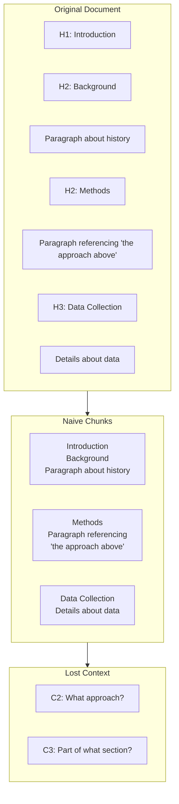

# Preserving Document Structure

## Introduction

Documents aren't just text — they're organized hierarchies of sections, subsections, lists, and cross-references. When chunking strips away this structure, retrieval suffers. A chunk that says "as mentioned above" becomes meaningless without context.

This section covers techniques for preserving document structure within and across chunks.

### What We'll Cover

- Heading hierarchy preservation
- Section relationship tracking
- List and table context
- Cross-reference handling
- Parent-child chunk relationships
- Structure metadata

### Prerequisites

- Understanding of chunking strategies
- Familiarity with document parsing

---

## The Structure Problem



### What Gets Lost

| Structure Element | What's Lost | Impact on Retrieval |
|-------------------|-------------|---------------------|
| Heading hierarchy | Section context | Can't answer "what section discusses X?" |
| Parent sections | Topic scope | Chunks lack thematic context |
| Cross-references | Relationship links | "See above" becomes meaningless |
| Lists | Item relationships | Orphaned list items |
| Tables | Row/column context | Isolated cell values |

---

## Heading Hierarchy Preservation

### Tracking Section Path

```python
from dataclasses import dataclass, field
from typing import Optional
import re

@dataclass
class SectionPath:
    """Track heading hierarchy."""
    levels: dict = field(default_factory=dict)  # {1: "Intro", 2: "Background"}
    
    def update(self, level: int, title: str):
        """Update section at given level, clearing deeper levels."""
        self.levels[level] = title
        # Clear deeper levels
        for l in list(self.levels.keys()):
            if l > level:
                del self.levels[l]
    
    def get_path(self) -> str:
        """Get full section path as string."""
        return " > ".join(
            self.levels[l] for l in sorted(self.levels.keys())
        )
    
    def get_context(self) -> str:
        """Generate context prefix for a chunk."""
        if not self.levels:
            return ""
        return f"[Section: {self.get_path()}] "

def chunk_with_hierarchy(
    text: str,
    chunk_size: int = 800,
    overlap: int = 150
) -> list[dict]:
    """
    Chunk text while preserving heading hierarchy.
    """
    # Regex patterns for markdown headings
    heading_pattern = r'^(#{1,6})\s+(.+)$'
    
    lines = text.split('\n')
    chunks = []
    current_chunk = ""
    section_path = SectionPath()
    chunk_start_section = ""
    
    for line in lines:
        # Check for heading
        heading_match = re.match(heading_pattern, line)
        
        if heading_match:
            level = len(heading_match.group(1))
            title = heading_match.group(2).strip()
            section_path.update(level, title)
            
            # Start new chunk at major headings (h1, h2)
            if level <= 2 and current_chunk:
                chunks.append({
                    'content': current_chunk.strip(),
                    'section_path': chunk_start_section,
                    'section_context': SectionPath(
                        levels=dict(section_path.levels)
                    ).get_context()
                })
                current_chunk = ""
            
            chunk_start_section = section_path.get_path()
        
        # Add line to current chunk
        current_chunk += line + "\n"
        
        # Check chunk size
        if len(current_chunk) > chunk_size:
            chunks.append({
                'content': current_chunk.strip(),
                'section_path': chunk_start_section,
                'section_context': section_path.get_context()
            })
            
            # Keep overlap
            overlap_text = current_chunk[-overlap:]
            current_chunk = overlap_text
    
    # Don't forget last chunk
    if current_chunk.strip():
        chunks.append({
            'content': current_chunk.strip(),
            'section_path': chunk_start_section,
            'section_context': section_path.get_context()
        })
    
    return chunks

# Usage
document = """
# Machine Learning Guide

Introduction to ML concepts.

## Supervised Learning

Supervised learning uses labeled data.

### Classification

Classification predicts discrete categories.

### Regression

Regression predicts continuous values.

## Unsupervised Learning

Unsupervised learning finds patterns without labels.

### Clustering

Clustering groups similar data points.
"""

chunks = chunk_with_hierarchy(document)
for chunk in chunks:
    print(f"Section: {chunk['section_path']}")
    print(f"Context: {chunk['section_context']}")
    print(f"Content: {chunk['content'][:100]}...")
    print("---")
```

**Output:**
```
Section: Machine Learning Guide
Context: [Section: Machine Learning Guide] 
Content: # Machine Learning Guide

Introduction to ML concepts....
---
Section: Machine Learning Guide > Supervised Learning
Context: [Section: Machine Learning Guide > Supervised Learning] 
Content: ## Supervised Learning

Supervised learning uses labeled data...
---
```

---

## Section Relationship Tracking

### Parent-Child Chunk Links

```python
from dataclasses import dataclass
from typing import Optional
import uuid

@dataclass
class StructuredChunk:
    """Chunk with structural relationships."""
    id: str
    content: str
    section_title: str
    section_level: int
    section_path: list[str]
    
    # Relationships
    parent_id: Optional[str] = None
    child_ids: list = None
    prev_sibling_id: Optional[str] = None
    next_sibling_id: Optional[str] = None
    
    # Context
    parent_summary: str = ""
    
    def __post_init__(self):
        if self.child_ids is None:
            self.child_ids = []

class StructureAwareChunker:
    """Chunk while maintaining structural relationships."""
    
    def __init__(self, chunk_size: int = 800):
        self.chunk_size = chunk_size
        self.chunks: list[StructuredChunk] = []
        self.section_stack: list[StructuredChunk] = []
    
    def process_document(self, sections: list[dict]) -> list[StructuredChunk]:
        """
        Process structured sections into related chunks.
        
        Args:
            sections: List of {'level': int, 'title': str, 'content': str}
        """
        prev_at_level = {}  # Track previous chunk at each level
        
        for section in sections:
            level = section['level']
            title = section['title']
            content = section['content']
            
            # Build section path
            while self.section_stack and self.section_stack[-1].section_level >= level:
                self.section_stack.pop()
            
            section_path = [s.section_title for s in self.section_stack] + [title]
            
            # Find parent
            parent = self.section_stack[-1] if self.section_stack else None
            
            # Create chunk
            chunk = StructuredChunk(
                id=str(uuid.uuid4())[:8],
                content=content,
                section_title=title,
                section_level=level,
                section_path=section_path,
                parent_id=parent.id if parent else None,
                parent_summary=parent.content[:100] if parent else ""
            )
            
            # Link to parent
            if parent:
                parent.child_ids.append(chunk.id)
            
            # Link siblings at same level
            if level in prev_at_level:
                prev_sibling = prev_at_level[level]
                prev_sibling.next_sibling_id = chunk.id
                chunk.prev_sibling_id = prev_sibling.id
            
            prev_at_level[level] = chunk
            
            # Clear lower level siblings (they're now children of previous section)
            for l in list(prev_at_level.keys()):
                if l > level:
                    del prev_at_level[l]
            
            self.chunks.append(chunk)
            self.section_stack.append(chunk)
        
        return self.chunks

# Usage
sections = [
    {'level': 1, 'title': 'Introduction', 'content': 'Welcome to the guide...'},
    {'level': 2, 'title': 'Getting Started', 'content': 'First steps...'},
    {'level': 3, 'title': 'Installation', 'content': 'Install using pip...'},
    {'level': 3, 'title': 'Configuration', 'content': 'Configure settings...'},
    {'level': 2, 'title': 'Advanced Topics', 'content': 'For advanced users...'},
]

chunker = StructureAwareChunker()
chunks = chunker.process_document(sections)

for chunk in chunks:
    print(f"[{chunk.id}] {' > '.join(chunk.section_path)}")
    print(f"  Parent: {chunk.parent_id}, Children: {chunk.child_ids}")
    print(f"  Siblings: prev={chunk.prev_sibling_id}, next={chunk.next_sibling_id}")
```

---

## List and Table Context

### Preserving List Structure

```python
def chunk_with_list_context(
    text: str,
    chunk_size: int = 800
) -> list[dict]:
    """
    Chunk while keeping lists together when possible.
    """
    # Pattern to detect list items
    list_item_pattern = r'^(\s*[-*+]|\s*\d+\.)\s+'
    
    lines = text.split('\n')
    chunks = []
    current_chunk = ""
    current_list = []
    in_list = False
    list_intro = ""
    
    for line in lines:
        is_list_item = bool(re.match(list_item_pattern, line))
        
        if is_list_item:
            if not in_list:
                # Starting a new list - save preceding text as intro
                in_list = True
                # Last non-empty line before list is likely the intro
                for prev_line in reversed(current_chunk.split('\n')):
                    if prev_line.strip():
                        list_intro = prev_line.strip()
                        break
            current_list.append(line)
        else:
            if in_list and current_list:
                # End of list - add with context
                list_content = '\n'.join(current_list)
                list_with_context = f"{list_intro}\n{list_content}" if list_intro else list_content
                
                if len(current_chunk) + len(list_with_context) > chunk_size:
                    # Save current chunk and start new
                    if current_chunk.strip():
                        chunks.append({
                            'content': current_chunk.strip(),
                            'has_list': False
                        })
                    chunks.append({
                        'content': list_with_context,
                        'has_list': True,
                        'list_intro': list_intro,
                        'list_items': len(current_list)
                    })
                    current_chunk = ""
                else:
                    current_chunk += list_with_context + "\n"
                
                current_list = []
                in_list = False
                list_intro = ""
            
            current_chunk += line + "\n"
    
    # Handle remaining content
    if current_list:
        list_content = '\n'.join(current_list)
        current_chunk += f"{list_intro}\n{list_content}" if list_intro else list_content
    
    if current_chunk.strip():
        chunks.append({
            'content': current_chunk.strip(),
            'has_list': bool(current_list)
        })
    
    return chunks

# Usage
text = """
Here are the key features:

- Fast processing
- Easy integration
- Scalable architecture
- Built-in caching

Each feature contributes to overall performance.

The installation steps are:

1. Download the package
2. Run the installer
3. Configure settings
4. Verify installation
"""

chunks = chunk_with_list_context(text, chunk_size=300)
for chunk in chunks:
    print(f"Has list: {chunk['has_list']}")
    print(chunk['content'])
    print("---")
```

### Table Row Context

```python
def chunk_table_with_context(
    table_markdown: str,
    max_rows_per_chunk: int = 10,
    include_header: bool = True
) -> list[dict]:
    """
    Chunk markdown tables while preserving header context.
    """
    lines = [l.strip() for l in table_markdown.strip().split('\n') if l.strip()]
    
    if len(lines) < 2:
        return [{'content': table_markdown, 'type': 'table', 'rows': 0}]
    
    # Extract header and separator
    header = lines[0]
    separator = lines[1] if '---' in lines[1] else None
    data_start = 2 if separator else 1
    data_rows = lines[data_start:]
    
    chunks = []
    for i in range(0, len(data_rows), max_rows_per_chunk):
        batch = data_rows[i:i + max_rows_per_chunk]
        
        if include_header:
            chunk_lines = [header]
            if separator:
                chunk_lines.append(separator)
            chunk_lines.extend(batch)
        else:
            chunk_lines = batch
        
        chunks.append({
            'content': '\n'.join(chunk_lines),
            'type': 'table',
            'rows': len(batch),
            'row_range': (i, i + len(batch)),
            'has_header': include_header
        })
    
    return chunks

# Usage
table = """
| Name | Age | City |
|------|-----|------|
| Alice | 30 | NYC |
| Bob | 25 | LA |
| Carol | 35 | Chicago |
| Dave | 28 | Miami |
| Eve | 32 | Seattle |
"""

chunks = chunk_table_with_context(table, max_rows_per_chunk=2)
for chunk in chunks:
    print(f"Rows {chunk['row_range'][0]}-{chunk['row_range'][1]}:")
    print(chunk['content'])
    print("---")
```

---

## Cross-Reference Handling

### Detecting and Resolving References

```python
import re

class ReferenceResolver:
    """Detect and resolve cross-references in documents."""
    
    # Common reference patterns
    PATTERNS = [
        (r'as mentioned (above|earlier|previously)', 'backward'),
        (r'see (above|earlier)', 'backward'),
        (r'(below|following|later)', 'forward'),
        (r'in section ["\']?([^"\']+)["\']?', 'section'),
        (r'see figure (\d+)', 'figure'),
        (r'as shown in (\w+)', 'reference'),
        (r'refers to (\w+)', 'reference'),
    ]
    
    def __init__(self, document_chunks: list[dict]):
        self.chunks = document_chunks
        self.section_index = self._build_section_index()
    
    def _build_section_index(self) -> dict:
        """Build index of section titles to chunk IDs."""
        index = {}
        for chunk in self.chunks:
            if 'section_title' in chunk:
                title = chunk['section_title'].lower()
                index[title] = chunk.get('id', id(chunk))
        return index
    
    def find_references(self, text: str) -> list[dict]:
        """Find all cross-references in text."""
        references = []
        
        for pattern, ref_type in self.PATTERNS:
            for match in re.finditer(pattern, text, re.IGNORECASE):
                references.append({
                    'match': match.group(0),
                    'type': ref_type,
                    'target': match.group(1) if match.groups() else None,
                    'position': match.start()
                })
        
        return references
    
    def resolve_reference(
        self, 
        reference: dict, 
        current_chunk_index: int
    ) -> dict:
        """Attempt to resolve a reference to a specific chunk."""
        ref_type = reference['type']
        
        if ref_type == 'backward':
            # Look in previous chunks
            for i in range(current_chunk_index - 1, -1, -1):
                return {
                    'resolved': True,
                    'target_chunk_index': i,
                    'target_chunk': self.chunks[i]
                }
        
        elif ref_type == 'forward':
            # Look in following chunks
            for i in range(current_chunk_index + 1, len(self.chunks)):
                return {
                    'resolved': True,
                    'target_chunk_index': i,
                    'target_chunk': self.chunks[i]
                }
        
        elif ref_type == 'section':
            target = reference['target'].lower()
            if target in self.section_index:
                return {
                    'resolved': True,
                    'target_section': target,
                    'target_chunk_id': self.section_index[target]
                }
        
        return {'resolved': False}
    
    def add_reference_context(self, chunk: dict, chunk_index: int) -> dict:
        """Add resolved reference context to a chunk."""
        references = self.find_references(chunk.get('content', ''))
        
        resolved_refs = []
        for ref in references:
            resolution = self.resolve_reference(ref, chunk_index)
            if resolution.get('resolved'):
                # Add brief context from referenced chunk
                target_chunk = resolution.get('target_chunk', {})
                context = target_chunk.get('content', '')[:150]
                resolved_refs.append({
                    'reference': ref['match'],
                    'context': context
                })
        
        chunk['resolved_references'] = resolved_refs
        return chunk

# Usage
chunks = [
    {'id': 1, 'section_title': 'Introduction', 'content': 'Welcome to the guide.'},
    {'id': 2, 'section_title': 'Methods', 'content': 'As mentioned above, we use ML.'},
    {'id': 3, 'section_title': 'Results', 'content': 'See section "Methods" for details.'},
]

resolver = ReferenceResolver(chunks)

for i, chunk in enumerate(chunks):
    refs = resolver.find_references(chunk['content'])
    if refs:
        print(f"Chunk {chunk['id']}: Found references: {refs}")
        enriched = resolver.add_reference_context(chunk, i)
        print(f"Resolved: {enriched.get('resolved_references', [])}")
```

---

## Prepending Section Context

Add section context to each chunk for better retrieval:

```python
def add_section_context_to_chunks(
    chunks: list[dict],
    max_context_length: int = 100
) -> list[dict]:
    """
    Prepend section context to each chunk's content.
    """
    for chunk in chunks:
        context_parts = []
        
        # Add section path
        if 'section_path' in chunk:
            path = chunk['section_path']
            if isinstance(path, list):
                path = ' > '.join(path)
            context_parts.append(f"Section: {path}")
        
        # Add parent summary if available
        if 'parent_summary' in chunk and chunk['parent_summary']:
            summary = chunk['parent_summary'][:max_context_length]
            context_parts.append(f"Parent context: {summary}")
        
        # Build context prefix
        if context_parts:
            context = ' | '.join(context_parts)
            chunk['contextualized_content'] = f"[{context}]\n\n{chunk['content']}"
        else:
            chunk['contextualized_content'] = chunk['content']
    
    return chunks

# Usage
chunks = [
    {
        'content': 'Install using pip install mypackage',
        'section_path': ['Getting Started', 'Installation'],
        'parent_summary': 'This section covers setting up the environment'
    }
]

enriched = add_section_context_to_chunks(chunks)
print(enriched[0]['contextualized_content'])
```

**Output:**
```
[Section: Getting Started > Installation | Parent context: This section covers setting up the environment]

Install using pip install mypackage
```

---

## Hands-on Exercise

### Your Task

Build a structure-preserving chunker that:
1. Tracks heading hierarchy
2. Links parent-child chunks
3. Preserves list context
4. Adds section context to each chunk

### Requirements

```python
def structure_aware_chunk(
    markdown: str,
    chunk_size: int = 800
) -> list[dict]:
    """
    Chunk markdown with full structure preservation.
    
    Returns chunks with:
        - content: str
        - section_path: list[str]
        - parent_content: str (first 100 chars)
        - has_list: bool
        - contextualized_content: str (with section prefix)
    """
    pass
```

<details>
<summary>💡 Hints</summary>

- Parse headings first to build structure
- Track current section at each level
- Detect lists to keep them together
- Add section context as prefix

</details>

<details>
<summary>✅ Solution</summary>

```python
def structure_aware_chunk(
    markdown: str,
    chunk_size: int = 800
) -> list[dict]:
    """Chunk markdown with full structure preservation."""
    
    heading_pattern = r'^(#{1,6})\s+(.+)$'
    list_pattern = r'^(\s*[-*+]|\s*\d+\.)\s+'
    
    lines = markdown.split('\n')
    chunks = []
    
    current_chunk = ""
    section_levels = {}  # {1: 'Title', 2: 'Subtitle'}
    parent_content = ""
    in_list = False
    list_items = []
    
    for line in lines:
        # Check for heading
        heading_match = re.match(heading_pattern, line)
        if heading_match:
            level = len(heading_match.group(1))
            title = heading_match.group(2).strip()
            
            # Update section hierarchy
            section_levels[level] = title
            for l in list(section_levels.keys()):
                if l > level:
                    del section_levels[l]
            
            # Save parent content
            if level == 2 and current_chunk:
                parent_content = current_chunk[:100]
            
            # Major sections start new chunk
            if level <= 2 and current_chunk.strip():
                section_path = [section_levels[l] for l in sorted(section_levels.keys()) if l < level]
                chunks.append({
                    'content': current_chunk.strip(),
                    'section_path': section_path,
                    'parent_content': parent_content,
                    'has_list': bool(list_items)
                })
                current_chunk = ""
                list_items = []
        
        # Check for list item
        is_list_item = bool(re.match(list_pattern, line))
        if is_list_item:
            in_list = True
            list_items.append(line)
        else:
            in_list = False
        
        # Add line
        current_chunk += line + "\n"
        
        # Check chunk size (but don't break in middle of list)
        if len(current_chunk) > chunk_size and not in_list:
            section_path = [section_levels[l] for l in sorted(section_levels.keys())]
            chunks.append({
                'content': current_chunk.strip(),
                'section_path': section_path,
                'parent_content': parent_content,
                'has_list': bool(list_items)
            })
            current_chunk = ""
            list_items = []
    
    # Last chunk
    if current_chunk.strip():
        section_path = [section_levels[l] for l in sorted(section_levels.keys())]
        chunks.append({
            'content': current_chunk.strip(),
            'section_path': section_path,
            'parent_content': parent_content,
            'has_list': bool(list_items)
        })
    
    # Add contextualized content
    for chunk in chunks:
        path_str = ' > '.join(chunk['section_path']) if chunk['section_path'] else 'Document'
        chunk['contextualized_content'] = f"[Section: {path_str}]\n\n{chunk['content']}"
    
    return chunks
```

</details>

---

## Summary

Preserving document structure dramatically improves retrieval quality:

✅ **Heading hierarchy** provides section context for each chunk
✅ **Parent-child links** enable navigation across related content
✅ **List preservation** keeps related items together
✅ **Cross-reference resolution** maintains document connections
✅ **Context prepending** enriches chunks with structural metadata

**Next:** [Table and Image Handling](./04-table-image-handling.md) — Convert rich content for RAG.

---

## Further Reading

- [Unstructured by_title Strategy](https://docs.unstructured.io/open-source/core-functionality/chunking) - Section-aware chunking
- [LlamaIndex Hierarchical Retrieval](https://docs.llamaindex.ai/) - Parent-child chunk strategies

<!--
Sources Consulted:
- Unstructured chunking strategies: https://docs.unstructured.io/open-source/core-functionality/chunking
- Anthropic Contextual Retrieval: https://www.anthropic.com/news/contextual-retrieval
-->
