# Table and Image Handling

## Introduction

Tables and images contain critical information that text extraction alone misses. A financial table with quarterly results, a system architecture diagram, or a chart showing trends — all require special handling to be useful in RAG systems.

This section covers converting tables, images, and charts into text that embedding models can process effectively.

### What We'll Cover

- Table to text conversion strategies
- Image description generation
- Chart and diagram data extraction
- Alt text usage and enhancement
- Multi-modal document processing
- Quality validation for rich content

### Prerequisites

- Understanding of document parsing
- Familiarity with vision models (helpful)
- Basic understanding of embeddings

---

## The Rich Content Challenge

```mermaid
flowchart TD
    subgraph RichContent["Rich Content"]
        T[Tables]
        I[Images]
        C[Charts]
        D[Diagrams]
    end
    
    subgraph Problem["The Problem"]
        P1["Embedding models<br/>only process text"]
        P2["Structure conveys<br/>meaning"]
        P3["Visual context<br/>is lost"]
    end
    
    subgraph Solutions["Solutions"]
        S1["Table → Markdown/Text"]
        S2["Image → Description"]
        S3["Chart → Data + Caption"]
        S4["Diagram → Structured text"]
    end
    
    RichContent --> Problem
    Problem --> Solutions
```



| Content Type | Information Lost | Conversion Strategy |
|--------------|------------------|---------------------|
| Tables | Row/column relationships | Markdown or structured text |
| Photos | Visual content | Vision model description |
| Charts | Data and trends | Extract data + describe pattern |
| Diagrams | Relationships, flow | Vision model + structured output |
| Screenshots | UI elements, text | OCR + context description |

---

## Table to Text Conversion

### Markdown Table Format

```python
def table_to_markdown(table_data: list[list[str]]) -> str:
    """
    Convert 2D table data to markdown format.
    
    Args:
        table_data: List of rows, first row is header
    
    Returns:
        Markdown table string
    """
    if not table_data or not table_data[0]:
        return ""
    
    header = table_data[0]
    rows = table_data[1:]
    
    # Calculate column widths
    col_widths = []
    for col_idx in range(len(header)):
        max_width = len(str(header[col_idx]))
        for row in rows:
            if col_idx < len(row):
                max_width = max(max_width, len(str(row[col_idx])))
        col_widths.append(max_width)
    
    # Build markdown
    lines = []
    
    # Header
    header_cells = [str(h).ljust(w) for h, w in zip(header, col_widths)]
    lines.append("| " + " | ".join(header_cells) + " |")
    
    # Separator
    separators = ["-" * w for w in col_widths]
    lines.append("| " + " | ".join(separators) + " |")
    
    # Data rows
    for row in rows:
        cells = []
        for col_idx, width in enumerate(col_widths):
            value = str(row[col_idx]) if col_idx < len(row) else ""
            cells.append(value.ljust(width))
        lines.append("| " + " | ".join(cells) + " |")
    
    return "\n".join(lines)

# Usage
data = [
    ["Quarter", "Revenue", "Growth"],
    ["Q1 2024", "$10.5M", "+5%"],
    ["Q2 2024", "$11.2M", "+7%"],
    ["Q3 2024", "$12.0M", "+7%"],
]

markdown = table_to_markdown(data)
print(markdown)
```

**Output:**
```
| Quarter | Revenue | Growth |
| ------- | ------- | ------ |
| Q1 2024 | $10.5M  | +5%    |
| Q2 2024 | $11.2M  | +7%    |
| Q3 2024 | $12.0M  | +7%    |
```

### Prose Conversion for Complex Tables

```python
def table_to_prose(
    table_data: list[list[str]],
    table_title: str = None,
    context: str = None
) -> str:
    """
    Convert table to natural language prose for embedding.
    """
    if not table_data or len(table_data) < 2:
        return ""
    
    header = table_data[0]
    rows = table_data[1:]
    
    parts = []
    
    # Add title context
    if table_title:
        parts.append(f"Table: {table_title}")
    if context:
        parts.append(f"Context: {context}")
    
    # Describe structure
    parts.append(f"This table has {len(rows)} rows and {len(header)} columns: {', '.join(header)}.")
    
    # Describe each row
    for row in rows:
        row_desc = []
        for col_name, value in zip(header, row):
            row_desc.append(f"{col_name}: {value}")
        parts.append("; ".join(row_desc) + ".")
    
    return "\n".join(parts)

# Usage
prose = table_to_prose(
    data,
    table_title="Quarterly Revenue",
    context="Financial performance for fiscal year 2024"
)
print(prose)
```

**Output:**
```
Table: Quarterly Revenue
Context: Financial performance for fiscal year 2024
This table has 3 rows and 3 columns: Quarter, Revenue, Growth.
Quarter: Q1 2024; Revenue: $10.5M; Growth: +5%.
Quarter: Q2 2024; Revenue: $11.2M; Growth: +7%.
Quarter: Q3 2024; Revenue: $12.0M; Growth: +7%.
```

### Semantic Table Description

```python
def table_to_semantic_text(
    table_data: list[list[str]],
    table_type: str = "general"
) -> str:
    """
    Generate semantic description based on table type.
    """
    header = table_data[0]
    rows = table_data[1:]
    
    if table_type == "comparison":
        # Comparison table: item vs attributes
        items = [row[0] for row in rows]
        desc = f"Comparison of {', '.join(items)} across {', '.join(header[1:])}. "
        
        for row in rows:
            item = row[0]
            attrs = [f"{h}: {v}" for h, v in zip(header[1:], row[1:])]
            desc += f"{item} has {', '.join(attrs)}. "
        
        return desc
    
    elif table_type == "timeseries":
        # Time series: changes over time
        desc = f"Time series data showing {', '.join(header[1:])} over {len(rows)} periods. "
        
        # Calculate trends
        for col_idx in range(1, len(header)):
            col_name = header[col_idx]
            values = [row[col_idx] for row in rows]
            desc += f"{col_name} ranges from {values[0]} to {values[-1]}. "
        
        return desc
    
    else:
        # General fallback
        return table_to_prose(table_data)

# Usage
print(table_to_semantic_text(data, table_type="timeseries"))
```

---

## Image Description Generation

### Using Vision Models

```python
import base64
from pathlib import Path
from openai import OpenAI

def describe_image(
    image_path: str,
    context: str = None,
    detail_level: str = "auto"
) -> str:
    """
    Generate description of image using vision model.
    
    Args:
        image_path: Path to image file
        context: Optional context about the document
        detail_level: "low", "high", or "auto"
    
    Returns:
        Text description of the image
    """
    client = OpenAI()
    
    # Encode image to base64
    with open(image_path, "rb") as f:
        image_data = base64.b64encode(f.read()).decode("utf-8")
    
    # Determine media type
    suffix = Path(image_path).suffix.lower()
    media_types = {
        ".png": "image/png",
        ".jpg": "image/jpeg",
        ".jpeg": "image/jpeg",
        ".gif": "image/gif",
        ".webp": "image/webp"
    }
    media_type = media_types.get(suffix, "image/png")
    
    # Build prompt
    system_prompt = """You are an expert at describing images for document retrieval.
Generate a detailed description that captures:
1. What the image shows (objects, people, text)
2. Key information conveyed
3. Relationships and structure
4. Any data or numbers visible

Be specific and factual. The description will be used for semantic search."""

    user_prompt = "Describe this image in detail for document retrieval purposes."
    if context:
        user_prompt += f"\n\nContext: This image appears in a document about {context}."
    
    response = client.chat.completions.create(
        model="gpt-4o",
        messages=[
            {"role": "system", "content": system_prompt},
            {
                "role": "user",
                "content": [
                    {"type": "text", "text": user_prompt},
                    {
                        "type": "image_url",
                        "image_url": {
                            "url": f"data:{media_type};base64,{image_data}",
                            "detail": detail_level
                        }
                    }
                ]
            }
        ],
        max_tokens=500
    )
    
    return response.choices[0].message.content

# Usage
# description = describe_image(
#     "architecture_diagram.png",
#     context="microservices system design"
# )
# print(description)
```

### Batch Image Processing

```python
from concurrent.futures import ThreadPoolExecutor
from dataclasses import dataclass

@dataclass
class ImageChunk:
    """Chunk representing an image with description."""
    image_path: str
    description: str
    alt_text: str
    page_number: int = None
    context: str = None

def process_document_images(
    image_paths: list[str],
    document_context: str = None,
    max_workers: int = 4
) -> list[ImageChunk]:
    """
    Process multiple images from a document.
    """
    results = []
    
    def process_single(path: str) -> ImageChunk:
        try:
            description = describe_image(path, context=document_context)
            return ImageChunk(
                image_path=path,
                description=description,
                alt_text=f"Image: {Path(path).stem}",
                context=document_context
            )
        except Exception as e:
            return ImageChunk(
                image_path=path,
                description=f"[Image could not be processed: {e}]",
                alt_text=f"Image: {Path(path).stem}",
                context=document_context
            )
    
    with ThreadPoolExecutor(max_workers=max_workers) as executor:
        results = list(executor.map(process_single, image_paths))
    
    return results
```

---

## Chart Data Extraction

### Describing Charts

```python
def describe_chart(
    image_path: str,
    chart_type_hint: str = None
) -> dict:
    """
    Extract data and insights from a chart image.
    
    Returns:
        {
            'description': str,
            'chart_type': str,
            'data_points': list,
            'insights': list
        }
    """
    client = OpenAI()
    
    with open(image_path, "rb") as f:
        image_data = base64.b64encode(f.read()).decode("utf-8")
    
    prompt = """Analyze this chart and provide:
1. Chart type (bar, line, pie, scatter, etc.)
2. Title and axis labels if visible
3. Key data points with their values
4. Main trends or insights
5. A prose description for search

Format your response as JSON with keys:
- chart_type: string
- title: string
- x_axis: string
- y_axis: string
- data_points: list of {label, value} objects
- insights: list of strings
- description: string (for embedding/search)"""

    if chart_type_hint:
        prompt += f"\n\nHint: This appears to be a {chart_type_hint}."
    
    response = client.chat.completions.create(
        model="gpt-4o",
        messages=[
            {
                "role": "user",
                "content": [
                    {"type": "text", "text": prompt},
                    {
                        "type": "image_url",
                        "image_url": {
                            "url": f"data:image/png;base64,{image_data}"
                        }
                    }
                ]
            }
        ],
        response_format={"type": "json_object"},
        max_tokens=800
    )
    
    import json
    return json.loads(response.choices[0].message.content)

# Usage
# chart_data = describe_chart("revenue_chart.png", chart_type_hint="bar chart")
# print(chart_data['description'])
```

### Structured Chart Output

```python
def chart_to_chunk(chart_analysis: dict, source_path: str) -> dict:
    """
    Convert chart analysis to a searchable chunk.
    """
    # Build comprehensive text for embedding
    parts = []
    
    if chart_analysis.get('title'):
        parts.append(f"Chart: {chart_analysis['title']}")
    
    parts.append(f"Type: {chart_analysis.get('chart_type', 'unknown')} chart")
    
    if chart_analysis.get('x_axis') or chart_analysis.get('y_axis'):
        parts.append(
            f"Axes: {chart_analysis.get('x_axis', 'N/A')} vs "
            f"{chart_analysis.get('y_axis', 'N/A')}"
        )
    
    # Add data points
    if chart_analysis.get('data_points'):
        data_text = ", ".join(
            f"{dp['label']}: {dp['value']}" 
            for dp in chart_analysis['data_points']
        )
        parts.append(f"Data: {data_text}")
    
    # Add insights
    if chart_analysis.get('insights'):
        parts.append("Key insights: " + "; ".join(chart_analysis['insights']))
    
    # Add full description
    if chart_analysis.get('description'):
        parts.append(chart_analysis['description'])
    
    return {
        'content': "\n".join(parts),
        'type': 'chart',
        'chart_type': chart_analysis.get('chart_type'),
        'source': source_path,
        'metadata': {
            'title': chart_analysis.get('title'),
            'data_points': chart_analysis.get('data_points', [])
        }
    }
```

---

## Alt Text Enhancement

### Improving Existing Alt Text

```python
def enhance_alt_text(
    original_alt: str,
    image_path: str = None,
    document_context: str = None
) -> str:
    """
    Enhance basic alt text with more detail.
    """
    # If we have the image, generate rich description
    if image_path:
        return describe_image(image_path, context=document_context)
    
    # Otherwise, expand the alt text
    client = OpenAI()
    
    prompt = f"""Expand this brief image alt text into a more detailed description
suitable for document retrieval:

Alt text: {original_alt}
Document context: {document_context or 'General document'}

Provide a 2-3 sentence description that would help someone find this image
through semantic search. Be specific about what the image likely shows."""

    response = client.chat.completions.create(
        model="gpt-4o-mini",
        messages=[{"role": "user", "content": prompt}],
        max_tokens=150
    )
    
    return response.choices[0].message.content

# Usage
original = "Company logo"
enhanced = enhance_alt_text(
    original, 
    document_context="Annual report for tech company"
)
print(f"Original: {original}")
print(f"Enhanced: {enhanced}")
```

### Extracting Alt Text from HTML

```python
from bs4 import BeautifulSoup

def extract_images_with_alt(html: str) -> list[dict]:
    """
    Extract all images with their alt text from HTML.
    """
    soup = BeautifulSoup(html, 'html.parser')
    images = []
    
    for img in soup.find_all('img'):
        src = img.get('src', '')
        alt = img.get('alt', '')
        title = img.get('title', '')
        
        # Get surrounding context
        parent = img.parent
        context = ""
        if parent:
            # Get text from parent, excluding the img
            context = parent.get_text(strip=True)[:200]
        
        images.append({
            'src': src,
            'alt': alt,
            'title': title,
            'context': context,
            'needs_enhancement': len(alt) < 20  # Flag brief alt text
        })
    
    return images

# Usage
html = '''
<article>
    <h1>Product Overview</h1>
    
    <p>Product X is designed for enterprise customers.</p>
    
</article>
'''

images = extract_images_with_alt(html)
for img in images:
    print(f"Alt: {img['alt']}")
    print(f"Needs enhancement: {img['needs_enhancement']}")
    print(f"Context: {img['context'][:50]}...")
    print("---")
```

---

## Multi-Modal Document Processing

### Complete Document Pipeline

```python
from dataclasses import dataclass
from typing import Literal

@dataclass
class MultiModalChunk:
    """Chunk that may contain text, table, or image."""
    content: str
    chunk_type: Literal['text', 'table', 'image', 'chart']
    source_path: str
    page_number: int = None
    original_element: dict = None  # Original table data or image path

class MultiModalChunker:
    """Process documents with mixed content types."""
    
    def __init__(self, chunk_size: int = 800):
        self.chunk_size = chunk_size
    
    def process_document(
        self, 
        elements: list[dict]
    ) -> list[MultiModalChunk]:
        """
        Process document elements of various types.
        
        Args:
            elements: List of {'type': str, 'content': ...}
        """
        chunks = []
        
        for element in elements:
            el_type = element.get('type')
            
            if el_type == 'text':
                # Regular text chunking
                text_chunks = self._chunk_text(element['content'])
                chunks.extend([
                    MultiModalChunk(
                        content=c,
                        chunk_type='text',
                        source_path=element.get('source', ''),
                        page_number=element.get('page')
                    )
                    for c in text_chunks
                ])
            
            elif el_type == 'table':
                # Convert table to text
                table_text = table_to_prose(
                    element['content'],
                    table_title=element.get('title'),
                    context=element.get('context')
                )
                chunks.append(MultiModalChunk(
                    content=table_text,
                    chunk_type='table',
                    source_path=element.get('source', ''),
                    page_number=element.get('page'),
                    original_element=element['content']
                ))
            
            elif el_type == 'image':
                # Describe image
                if element.get('image_path'):
                    description = describe_image(
                        element['image_path'],
                        context=element.get('context')
                    )
                else:
                    description = element.get('alt_text', 'Image without description')
                
                chunks.append(MultiModalChunk(
                    content=description,
                    chunk_type='image',
                    source_path=element.get('source', ''),
                    page_number=element.get('page'),
                    original_element={'path': element.get('image_path')}
                ))
            
            elif el_type == 'chart':
                # Analyze and describe chart
                if element.get('image_path'):
                    chart_data = describe_chart(element['image_path'])
                    chunk_data = chart_to_chunk(
                        chart_data, 
                        element.get('source', '')
                    )
                    chunks.append(MultiModalChunk(
                        content=chunk_data['content'],
                        chunk_type='chart',
                        source_path=element.get('source', ''),
                        page_number=element.get('page'),
                        original_element=chart_data
                    ))
        
        return chunks
    
    def _chunk_text(self, text: str) -> list[str]:
        """Simple text chunking."""
        from langchain.text_splitter import RecursiveCharacterTextSplitter
        splitter = RecursiveCharacterTextSplitter(
            chunk_size=self.chunk_size,
            chunk_overlap=100
        )
        return splitter.split_text(text)

# Usage
elements = [
    {
        'type': 'text',
        'content': 'Introduction to our quarterly report...',
        'source': 'report.pdf',
        'page': 1
    },
    {
        'type': 'table',
        'content': [
            ['Metric', 'Q1', 'Q2'],
            ['Revenue', '$10M', '$12M'],
            ['Users', '100K', '150K']
        ],
        'title': 'Key Metrics',
        'source': 'report.pdf',
        'page': 2
    },
    {
        'type': 'image',
        'image_path': 'figures/growth_chart.png',
        'context': 'User growth visualization',
        'source': 'report.pdf',
        'page': 3
    }
]

# chunker = MultiModalChunker()
# chunks = chunker.process_document(elements)
```

---

## Quality Validation

```python
def validate_rich_content_chunk(chunk: MultiModalChunk) -> dict:
    """Validate a multi-modal chunk."""
    issues = []
    
    if chunk.chunk_type == 'table':
        # Check table conversion quality
        if len(chunk.content) < 50:
            issues.append("table_too_brief")
        if 'N/A' in chunk.content or 'None' in chunk.content:
            issues.append("missing_values")
    
    elif chunk.chunk_type == 'image':
        # Check image description quality
        if len(chunk.content) < 30:
            issues.append("description_too_brief")
        if "could not" in chunk.content.lower():
            issues.append("processing_error")
        if chunk.content == chunk.original_element.get('path'):
            issues.append("no_description_generated")
    
    elif chunk.chunk_type == 'chart':
        # Check chart extraction quality
        if 'data' not in chunk.content.lower():
            issues.append("no_data_extracted")
    
    return {
        'chunk_type': chunk.chunk_type,
        'is_valid': len(issues) == 0,
        'issues': issues,
        'content_length': len(chunk.content)
    }
```

---

## Hands-on Exercise

### Your Task

Build a function that:
1. Takes a PDF with tables and images
2. Extracts and converts tables to prose
3. Generates descriptions for images
4. Returns unified chunks

### Requirements

```python
def process_rich_pdf(
    pdf_path: str,
    chunk_size: int = 800
) -> list[MultiModalChunk]:
    """
    Process PDF with tables and images.
    
    Returns unified chunks for all content types.
    """
    pass
```

<details>
<summary>💡 Hints</summary>

- Use Unstructured to partition the PDF
- Check element types (Table, Image, NarrativeText)
- Convert tables to prose format
- Use vision model for images

</details>

<details>
<summary>✅ Solution</summary>

```python
from unstructured.partition.pdf import partition_pdf

def process_rich_pdf(
    pdf_path: str,
    chunk_size: int = 800
) -> list[MultiModalChunk]:
    """Process PDF with tables and images."""
    
    # Partition PDF with high-res strategy for images/tables
    elements = partition_pdf(
        filename=pdf_path,
        strategy="hi_res",
        infer_table_structure=True,
        extract_images_in_pdf=True
    )
    
    # Convert to our element format
    processed_elements = []
    
    for el in elements:
        el_type = type(el).__name__
        
        if el_type == 'Table':
            # Extract table data
            table_data = []
            if hasattr(el, 'metadata') and hasattr(el.metadata, 'text_as_html'):
                # Parse HTML table
                from bs4 import BeautifulSoup
                soup = BeautifulSoup(el.metadata.text_as_html, 'html.parser')
                for row in soup.find_all('tr'):
                    cells = [td.get_text(strip=True) for td in row.find_all(['td', 'th'])]
                    if cells:
                        table_data.append(cells)
            
            if table_data:
                processed_elements.append({
                    'type': 'table',
                    'content': table_data,
                    'source': pdf_path,
                    'page': el.metadata.page_number if hasattr(el.metadata, 'page_number') else None
                })
        
        elif el_type == 'Image':
            processed_elements.append({
                'type': 'image',
                'image_path': el.metadata.image_path if hasattr(el.metadata, 'image_path') else None,
                'alt_text': el.text if hasattr(el, 'text') else '',
                'source': pdf_path,
                'page': el.metadata.page_number if hasattr(el.metadata, 'page_number') else None
            })
        
        else:
            # Regular text
            processed_elements.append({
                'type': 'text',
                'content': el.text,
                'source': pdf_path,
                'page': el.metadata.page_number if hasattr(el.metadata, 'page_number') else None
            })
    
    # Process with multi-modal chunker
    chunker = MultiModalChunker(chunk_size=chunk_size)
    return chunker.process_document(processed_elements)

# Usage
# chunks = process_rich_pdf("report.pdf")
# for chunk in chunks:
#     print(f"[{chunk.chunk_type}] {chunk.content[:100]}...")
```

</details>

---

## Summary

Rich content requires special handling for effective RAG:

✅ **Tables** convert to markdown or prose for embedding
✅ **Images** need vision model descriptions
✅ **Charts** require data extraction and trend description
✅ **Alt text** can be enhanced when insufficient
✅ **Unified output** enables consistent processing
✅ **Validation** catches conversion failures

**Next:** [Contextual Retrieval](./05-contextual-retrieval.md) — Anthropic's 67% improvement method.

---

## Further Reading

- [OpenAI Vision Guide](https://platform.openai.com/docs/guides/vision) - Image understanding
- [Unstructured Tables](https://docs.unstructured.io/) - Table extraction
- [Claude Vision](https://docs.anthropic.com/claude/docs/vision) - Anthropic vision capabilities

<!--
Sources Consulted:
- OpenAI Vision documentation: https://platform.openai.com/docs/guides/vision
- Unstructured documentation: https://docs.unstructured.io/
- Anthropic Contextual Retrieval: https://www.anthropic.com/news/contextual-retrieval
-->
