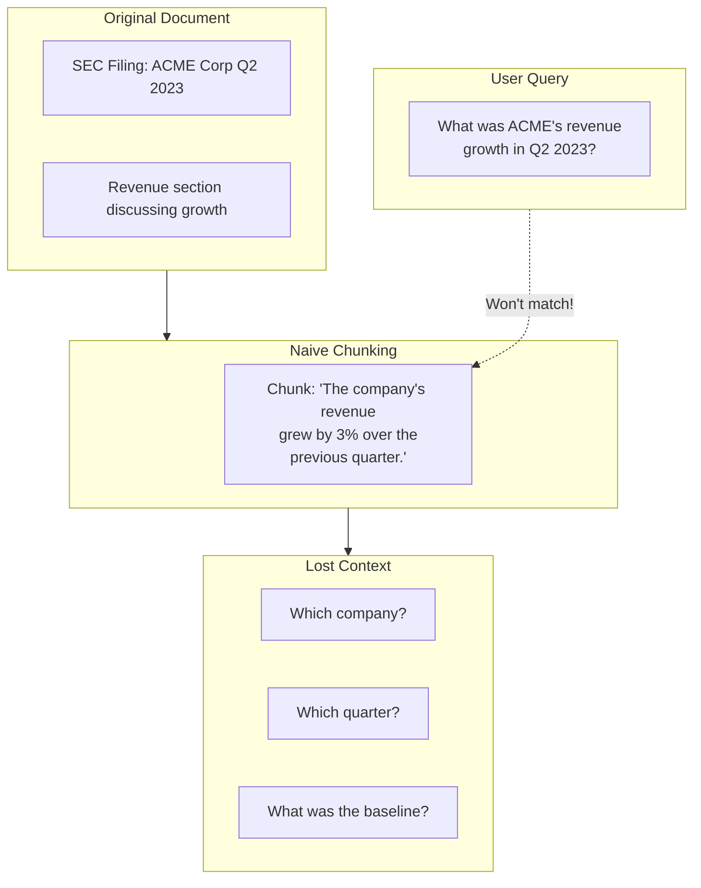
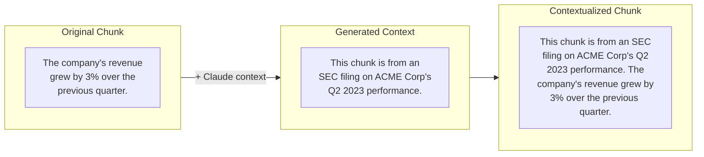

# Contextual Retrieval (Anthropic Method)

## Introduction

Traditional RAG chunks documents into fragments that lose their original context. A chunk saying "The company's revenue grew by 3%" becomes nearly useless when you can't tell which company or which time period it refers to.

Anthropic's Contextual Retrieval solves this by prepending explanatory context to each chunk before embedding. This simple technique reduces retrieval failures by up to **67%**.

### What We'll Cover

- The lost context problem
- Contextual Retrieval methodology
- Context generation prompts
- Combining with BM25
- Adding reranking
- Prompt caching for cost optimization
- Implementation patterns

### Prerequisites

- Understanding of RAG architecture
- Basic chunking knowledge
- Familiarity with embedding models

---

## The Lost Context Problem



### Why Context Gets Lost

| Document Element | Gets Lost When Chunking | Example |
|------------------|------------------------|---------|
| Document title | Chunk lacks source identity | "Q2 2023 Report" |
| Section headers | Topic scope disappears | "Revenue Analysis" |
| Entity names | Pronouns unresolved | "ACME Corp" → "the company" |
| Time references | Period unclear | "this quarter" |
| Relationships | Comparisons broken | "compared to last year" |

---

## Contextual Retrieval Solution

The solution is elegantly simple: **prepend context to each chunk before embedding**.



### The Transformation

**Before (naive chunk):**
```
The company's revenue grew by 3% over the previous quarter.
```

**After (contextualized chunk):**
```
This chunk is from an SEC filing on ACME corp's performance in Q2 2023; 
the previous quarter's revenue was $314 million. The company's revenue 
grew by 3% over the previous quarter.
```

Now when a user asks "What was ACME's revenue growth in Q2 2023?", the contextualized chunk will match.

---

## Context Generation

### The Claude Prompt

Anthropic recommends this prompt for context generation:

```python
CONTEXT_PROMPT = """
<document>
{document}
</document>

Here is the chunk we want to situate within the whole document:

<chunk>
{chunk}
</chunk>

Please give a short succinct context to situate this chunk within the overall 
document for the purposes of improving search retrieval of the chunk. 
Answer only with the succinct context and nothing else.
"""
```

### Implementation

```python
from anthropic import Anthropic

def generate_chunk_context(
    document: str,
    chunk: str,
    model: str = "claude-3-haiku-20240307"
) -> str:
    """
    Generate context for a chunk using Claude.
    
    Args:
        document: Full document text
        chunk: The chunk to contextualize
        model: Claude model to use (Haiku recommended for cost)
    
    Returns:
        Context string (typically 50-100 tokens)
    """
    client = Anthropic()
    
    prompt = f"""<document>
{document}
</document>

Here is the chunk we want to situate within the whole document:

<chunk>
{chunk}
</chunk>

Please give a short succinct context to situate this chunk within the overall 
document for the purposes of improving search retrieval of the chunk. 
Answer only with the succinct context and nothing else."""

    response = client.messages.create(
        model=model,
        max_tokens=150,
        messages=[
            {"role": "user", "content": prompt}
        ]
    )
    
    return response.content[0].text

def contextualize_chunk(
    document: str,
    chunk: str,
    model: str = "claude-3-haiku-20240307"
) -> str:
    """
    Create a contextualized chunk by prepending context.
    """
    context = generate_chunk_context(document, chunk, model)
    return f"{context}\n\n{chunk}"

# Usage
document = """
ACME Corporation Quarterly Report - Q2 2023

Executive Summary
ACME Corp continues to demonstrate strong growth in the enterprise software market.

Financial Highlights
The company's revenue grew by 3% over the previous quarter. Operating margins
improved to 15%, up from 12% in Q1. Customer retention remained strong at 95%.

Product Updates
The launch of ACME Cloud Pro in April contributed significantly to new customer
acquisition, with over 500 enterprise clients adopting the platform.
"""

chunk = "The company's revenue grew by 3% over the previous quarter."

contextualized = contextualize_chunk(document, chunk)
print(contextualized)
```

**Output:**
```
This chunk is from ACME Corporation's Q2 2023 quarterly report, specifically 
from the Financial Highlights section discussing revenue performance.

The company's revenue grew by 3% over the previous quarter.
```

---

## Processing Pipeline

### Full Document Processing

```python
from dataclasses import dataclass
from typing import Callable

@dataclass
class ContextualizedChunk:
    """Chunk with prepended context."""
    original: str
    context: str
    contextualized: str
    source_document: str
    chunk_index: int

class ContextualRetrieval:
    """Implement Anthropic's Contextual Retrieval."""
    
    def __init__(
        self,
        chunker: Callable[[str], list[str]],
        model: str = "claude-3-haiku-20240307"
    ):
        self.chunker = chunker
        self.model = model
        self.client = Anthropic()
    
    def process_document(
        self, 
        document: str,
        document_id: str = None
    ) -> list[ContextualizedChunk]:
        """
        Process a document with contextual retrieval.
        
        Args:
            document: Full document text
            document_id: Optional identifier
        
        Returns:
            List of contextualized chunks
        """
        # Chunk the document
        chunks = self.chunker(document)
        
        # Generate context for each chunk
        contextualized_chunks = []
        
        for i, chunk in enumerate(chunks):
            context = self._generate_context(document, chunk)
            
            contextualized_chunks.append(ContextualizedChunk(
                original=chunk,
                context=context,
                contextualized=f"{context}\n\n{chunk}",
                source_document=document_id or "unknown",
                chunk_index=i
            ))
        
        return contextualized_chunks
    
    def _generate_context(self, document: str, chunk: str) -> str:
        """Generate context for a single chunk."""
        prompt = f"""<document>
{document}
</document>

Here is the chunk we want to situate within the whole document:

<chunk>
{chunk}
</chunk>

Please give a short succinct context to situate this chunk within the overall 
document for the purposes of improving search retrieval of the chunk. 
Answer only with the succinct context and nothing else."""

        response = self.client.messages.create(
            model=self.model,
            max_tokens=150,
            messages=[{"role": "user", "content": prompt}]
        )
        
        return response.content[0].text

# Usage with LangChain chunker
from langchain.text_splitter import RecursiveCharacterTextSplitter

splitter = RecursiveCharacterTextSplitter(chunk_size=500, chunk_overlap=50)
cr = ContextualRetrieval(chunker=splitter.split_text)

# chunks = cr.process_document(document, document_id="acme-q2-2023")
```

---

## Using Prompt Caching

Anthropic's prompt caching makes contextual retrieval cost-effective by caching the document content:

```python
class CachedContextualRetrieval:
    """Contextual retrieval with prompt caching for cost efficiency."""
    
    def __init__(self, model: str = "claude-3-haiku-20240307"):
        self.model = model
        self.client = Anthropic()
    
    def process_document_cached(
        self,
        document: str,
        chunks: list[str]
    ) -> list[ContextualizedChunk]:
        """
        Process all chunks with cached document context.
        
        Uses prompt caching to avoid re-sending document for each chunk.
        """
        contextualized = []
        
        # First call caches the document
        for i, chunk in enumerate(chunks):
            response = self.client.messages.create(
                model=self.model,
                max_tokens=150,
                system=[
                    {
                        "type": "text",
                        "text": f"<document>\n{document}\n</document>",
                        "cache_control": {"type": "ephemeral"}  # Cache this
                    }
                ],
                messages=[
                    {
                        "role": "user",
                        "content": f"""Here is the chunk we want to situate within the whole document:

<chunk>
{chunk}
</chunk>

Please give a short succinct context to situate this chunk within the overall 
document for the purposes of improving search retrieval of the chunk. 
Answer only with the succinct context and nothing else."""
                    }
                ]
            )
            
            context = response.content[0].text
            
            contextualized.append(ContextualizedChunk(
                original=chunk,
                context=context,
                contextualized=f"{context}\n\n{chunk}",
                source_document="cached",
                chunk_index=i
            ))
        
        return contextualized
```

### Cost Analysis

| Scenario | Without Caching | With Caching |
|----------|-----------------|--------------|
| 10 chunks, 8K doc | 80K input tokens | 8K + 9×~1K = ~17K |
| Cost per 1M tokens | $0.25 (Haiku) | ~$0.06 effective |
| 100 chunks, 8K doc | 800K input tokens | 8K + 99×~1K = ~107K |

> **🤖 AI Context:** Prompt caching reduces costs by ~80% for document processing. The document is sent once and cached for subsequent chunk context generation.

---

## Combining with BM25 (Hybrid Search)

Contextual retrieval works even better when combined with BM25 lexical search:

```python
from rank_bm25 import BM25Okapi

class ContextualHybridSearch:
    """Combine contextual embeddings with BM25."""
    
    def __init__(self, embedding_model, alpha: float = 0.5):
        self.embedding_model = embedding_model
        self.alpha = alpha  # Weight for vector vs BM25
        self.chunks = []
        self.contextualized_texts = []
        self.bm25 = None
        self.embeddings = None
    
    def index_chunks(self, chunks: list[ContextualizedChunk]):
        """Index chunks for both vector and BM25 search."""
        self.chunks = chunks
        self.contextualized_texts = [c.contextualized for c in chunks]
        
        # Build BM25 index on contextualized text
        tokenized = [text.lower().split() for text in self.contextualized_texts]
        self.bm25 = BM25Okapi(tokenized)
        
        # Build embedding index
        self.embeddings = self.embedding_model.encode(self.contextualized_texts)
    
    def search(self, query: str, top_k: int = 10) -> list[tuple]:
        """
        Hybrid search combining vector and BM25.
        
        Returns:
            List of (chunk, combined_score) tuples
        """
        # Vector search
        query_embedding = self.embedding_model.encode([query])[0]
        vector_scores = np.dot(self.embeddings, query_embedding)
        
        # BM25 search
        tokenized_query = query.lower().split()
        bm25_scores = self.bm25.get_scores(tokenized_query)
        
        # Normalize scores
        vector_scores = (vector_scores - vector_scores.min()) / (vector_scores.max() - vector_scores.min() + 1e-8)
        bm25_scores = (bm25_scores - bm25_scores.min()) / (bm25_scores.max() - bm25_scores.min() + 1e-8)
        
        # Combine scores
        combined = self.alpha * vector_scores + (1 - self.alpha) * bm25_scores
        
        # Get top-k
        top_indices = np.argsort(combined)[::-1][:top_k]
        
        return [(self.chunks[i], combined[i]) for i in top_indices]
```

### Performance Improvements

Anthropic's research shows cumulative improvements:

| Method | Retrieval Failure Reduction |
|--------|----------------------------|
| Contextual Embeddings alone | **35%** (5.7% → 3.7%) |
| Contextual Embeddings + Contextual BM25 | **49%** (5.7% → 2.9%) |
| Above + Reranking | **67%** (5.7% → 1.9%) |

---

## Adding Reranking

```python
import cohere

class ContextualRerankedSearch:
    """Full contextual retrieval with reranking."""
    
    def __init__(
        self,
        embedding_model,
        cohere_api_key: str,
        initial_k: int = 150,
        final_k: int = 20
    ):
        self.embedding_model = embedding_model
        self.cohere_client = cohere.Client(cohere_api_key)
        self.initial_k = initial_k
        self.final_k = final_k
        self.hybrid_search = ContextualHybridSearch(embedding_model)
    
    def index_chunks(self, chunks: list[ContextualizedChunk]):
        """Index chunks for retrieval."""
        self.hybrid_search.index_chunks(chunks)
        self.chunks = chunks
    
    def search(self, query: str) -> list[ContextualizedChunk]:
        """
        Full search pipeline:
        1. Hybrid search (vector + BM25) for initial_k
        2. Rerank to final_k
        """
        # Get initial candidates
        initial_results = self.hybrid_search.search(query, top_k=self.initial_k)
        
        if not initial_results:
            return []
        
        # Prepare for reranking
        documents = [chunk.contextualized for chunk, score in initial_results]
        
        # Rerank with Cohere
        rerank_response = self.cohere_client.rerank(
            model="rerank-english-v3.0",
            query=query,
            documents=documents,
            top_n=self.final_k
        )
        
        # Get reranked chunks
        reranked = []
        for result in rerank_response.results:
            original_chunk = initial_results[result.index][0]
            reranked.append(original_chunk)
        
        return reranked

# Usage
# search = ContextualRerankedSearch(embedding_model, cohere_api_key)
# search.index_chunks(contextualized_chunks)
# results = search.search("What was ACME's revenue growth in Q2 2023?")
```

---

## Custom Context Prompts

For domain-specific applications, customize the context prompt:

```python
LEGAL_CONTEXT_PROMPT = """
<document>
{document}
</document>

<glossary>
- "Agreement" refers to the main contract
- "Parties" refers to the signatories
- "Effective Date" is when the contract becomes binding
</glossary>

<chunk>
{chunk}
</chunk>

Provide context that includes:
1. Which section/clause this is from
2. The parties or entities referenced
3. Key dates if mentioned
4. How this relates to the overall agreement

Answer only with the succinct context."""

TECHNICAL_CONTEXT_PROMPT = """
<document>
{document}
</document>

<chunk>
{chunk}
</chunk>

Provide context that includes:
1. What system/component this discusses
2. The version or configuration referenced
3. Prerequisites mentioned elsewhere in the doc
4. Related sections for complete understanding

Answer only with the succinct context."""

def get_domain_prompt(domain: str) -> str:
    """Get appropriate context prompt for domain."""
    prompts = {
        'legal': LEGAL_CONTEXT_PROMPT,
        'technical': TECHNICAL_CONTEXT_PROMPT,
        'default': CONTEXT_PROMPT
    }
    return prompts.get(domain, prompts['default'])
```

---

## Hands-on Exercise

### Your Task

Implement a complete contextual retrieval pipeline that:
1. Chunks a document
2. Generates context for each chunk
3. Creates both vector and BM25 indexes
4. Performs hybrid search

### Requirements

```python
def contextual_rag_pipeline(
    document: str,
    query: str,
    chunk_size: int = 500,
    top_k: int = 5
) -> list[str]:
    """
    Complete contextual retrieval pipeline.
    
    Returns top-k contextualized chunks for the query.
    """
    pass
```

<details>
<summary>💡 Hints</summary>

- Use RecursiveCharacterTextSplitter for chunking
- Generate context with Claude Haiku
- Build BM25 index on contextualized text
- Combine vector and BM25 scores

</details>

<details>
<summary>✅ Solution</summary>

```python
from langchain.text_splitter import RecursiveCharacterTextSplitter
from sentence_transformers import SentenceTransformer
from rank_bm25 import BM25Okapi
import numpy as np

def contextual_rag_pipeline(
    document: str,
    query: str,
    chunk_size: int = 500,
    top_k: int = 5
) -> list[str]:
    """Complete contextual retrieval pipeline."""
    
    # 1. Chunk the document
    splitter = RecursiveCharacterTextSplitter(
        chunk_size=chunk_size,
        chunk_overlap=50
    )
    chunks = splitter.split_text(document)
    
    # 2. Generate context for each chunk
    client = Anthropic()
    contextualized = []
    
    for chunk in chunks:
        response = client.messages.create(
            model="claude-3-haiku-20240307",
            max_tokens=150,
            messages=[{
                "role": "user",
                "content": f"""<document>
{document}
</document>

<chunk>
{chunk}
</chunk>

Please give a short succinct context to situate this chunk within the overall 
document for improving search retrieval. Answer only with the context."""
            }]
        )
        context = response.content[0].text
        contextualized.append(f"{context}\n\n{chunk}")
    
    # 3. Build indexes
    # BM25
    tokenized = [text.lower().split() for text in contextualized]
    bm25 = BM25Okapi(tokenized)
    
    # Vector
    model = SentenceTransformer('all-MiniLM-L6-v2')
    embeddings = model.encode(contextualized)
    query_embedding = model.encode([query])[0]
    
    # 4. Hybrid search
    vector_scores = np.dot(embeddings, query_embedding)
    bm25_scores = bm25.get_scores(query.lower().split())
    
    # Normalize
    vector_scores = (vector_scores - vector_scores.min()) / (vector_scores.max() - vector_scores.min() + 1e-8)
    bm25_scores = (bm25_scores - bm25_scores.min()) / (bm25_scores.max() - bm25_scores.min() + 1e-8)
    
    # Combine (0.5 weight each)
    combined = 0.5 * vector_scores + 0.5 * bm25_scores
    
    # Get top-k
    top_indices = np.argsort(combined)[::-1][:top_k]
    
    return [contextualized[i] for i in top_indices]

# Usage
# results = contextual_rag_pipeline(document, "What was the revenue growth?")
```

</details>

---

## Summary

Contextual Retrieval dramatically improves RAG accuracy:

✅ **Context prepending** solves the lost context problem
✅ **Claude Haiku** provides cost-effective context generation
✅ **Prompt caching** reduces costs by ~80%
✅ **Combining with BM25** adds 49% improvement
✅ **Adding reranking** achieves 67% total improvement
✅ **Custom prompts** optimize for specific domains

**Next:** [Late Chunking](./06-late-chunking.md) — Jina's conditional embedding approach.

---

## Further Reading

- [Anthropic Contextual Retrieval](https://www.anthropic.com/news/contextual-retrieval) - Original blog post
- [Contextual Retrieval Cookbook](https://github.com/anthropics/anthropic-cookbook) - Implementation guide
- [Prompt Caching](https://docs.anthropic.com/claude/docs/prompt-caching) - Cost optimization

<!--
Sources Consulted:
- Anthropic Contextual Retrieval: https://www.anthropic.com/news/contextual-retrieval
- Performance metrics from Anthropic research
- Prompt caching documentation: https://docs.anthropic.com/claude/docs/prompt-caching
-->
