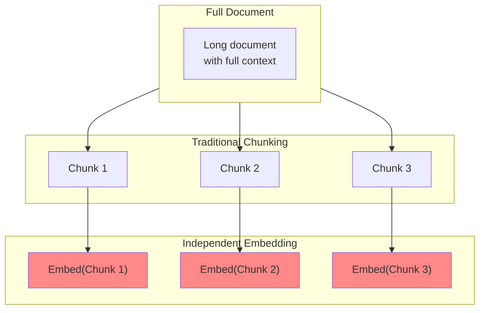
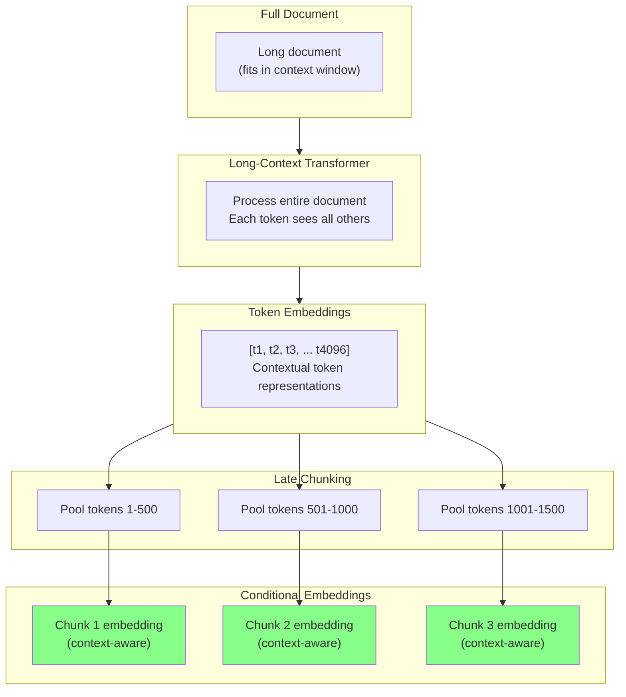
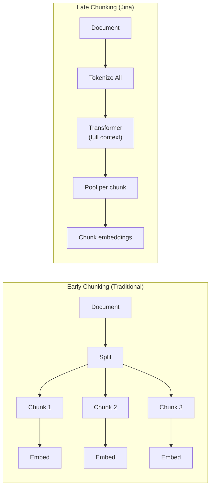

# Late Chunking (Jina Method)

## Introduction

Traditional embedding approaches process each chunk in isolation, losing the contextual relationships between chunks. Jina AI's Late Chunking solves this by first encoding the entire document through a long-context embedding model, then performing mean pooling on each chunk's token embeddings.

This produces **conditional embeddings** where each chunk's representation is informed by the full document context.

### What We'll Cover

- The problem with i.i.d. embeddings
- How late chunking works
- Long-context embedding models
- Implementation patterns
- Comparison with early chunking
- When to use late chunking

### Prerequisites

- Understanding of embeddings
- Knowledge of transformer architecture (basic)
- Familiarity with chunking concepts

---

## The Problem: Independent Embeddings

Standard RAG pipelines create **i.i.d. (independent and identically distributed)** embeddings:



### Why Independent Embeddings Fail

Consider this document:

```
Document: Machine Learning Tutorial

Chapter 1: Introduction
Machine learning is a subset of AI that enables systems to learn from data.

Chapter 2: Neural Networks
They consist of interconnected nodes that process information hierarchically.
```

When chunked and embedded independently:
- "They consist of interconnected nodes..." → **What is "they"?**
- The embedding model can't resolve the pronoun
- Retrieval suffers from ambiguity

| Problem | Independent Embedding | Late Chunking |
|---------|----------------------|---------------|
| Pronoun resolution | ❌ Lost | ✅ Preserved |
| Cross-chunk references | ❌ Missing | ✅ Encoded |
| Section context | ❌ Isolated | ✅ Connected |
| Topic continuity | ❌ Fragmented | ✅ Maintained |

---

## Late Chunking Solution

Late Chunking reverses the order: **embed first, chunk second**.



### The Key Insight

In a transformer model, each token's representation is **conditional** on all other tokens in the context window. By:

1. Encoding the full document through a long-context model
2. Getting rich, contextual token embeddings
3. Mean-pooling tokens within each chunk boundary

We get chunk embeddings that "know" about the surrounding content.

---

## How Late Chunking Works

### Step-by-Step Process

```python
import torch
from transformers import AutoModel, AutoTokenizer

def late_chunking_explained(document: str, chunk_boundaries: list[tuple[int, int]]):
    """
    Illustrate the late chunking process step by step.
    """
    
    # Step 1: Tokenize the ENTIRE document
    tokenizer = AutoTokenizer.from_pretrained('jinaai/jina-embeddings-v3')
    tokens = tokenizer(document, return_tensors='pt')
    
    print(f"Step 1: Document tokenized to {tokens['input_ids'].shape[1]} tokens")
    
    # Step 2: Pass through transformer (all tokens see each other)
    model = AutoModel.from_pretrained('jinaai/jina-embeddings-v3')
    with torch.no_grad():
        outputs = model(**tokens)
        token_embeddings = outputs.last_hidden_state  # [1, seq_len, hidden_dim]
    
    print(f"Step 2: Got {token_embeddings.shape[1]} contextual token embeddings")
    
    # Step 3: Pool tokens within each chunk boundary
    chunk_embeddings = []
    for start, end in chunk_boundaries:
        # Mean pool tokens in this range
        chunk_tokens = token_embeddings[0, start:end, :]
        chunk_embedding = chunk_tokens.mean(dim=0)
        chunk_embeddings.append(chunk_embedding)
    
    print(f"Step 3: Created {len(chunk_embeddings)} chunk embeddings via mean pooling")
    
    return chunk_embeddings
```

### Visual Comparison



---

## Implementation with Jina Embeddings

### Basic Implementation

```python
from transformers import AutoModel, AutoTokenizer
import torch
import numpy as np

class LateChunker:
    """Implement Jina's late chunking approach."""
    
    def __init__(self, model_name: str = "jinaai/jina-embeddings-v3"):
        self.tokenizer = AutoTokenizer.from_pretrained(model_name)
        self.model = AutoModel.from_pretrained(model_name, trust_remote_code=True)
        self.model.eval()
        
        # Max context length for the model
        self.max_length = 8192  # jina-embeddings-v3 supports 8K tokens
    
    def encode_document(
        self,
        document: str,
        chunk_texts: list[str]
    ) -> np.ndarray:
        """
        Create conditional embeddings for chunks using late chunking.
        
        Args:
            document: Full document text
            chunk_texts: List of chunk strings (must be in order)
        
        Returns:
            Array of shape (n_chunks, embedding_dim)
        """
        # Tokenize full document
        document_tokens = self.tokenizer(
            document,
            return_tensors='pt',
            max_length=self.max_length,
            truncation=True
        )
        
        # Find token spans for each chunk
        chunk_spans = self._find_chunk_spans(document, chunk_texts)
        
        # Get contextual token embeddings
        with torch.no_grad():
            outputs = self.model(**document_tokens)
            token_embeddings = outputs.last_hidden_state[0]  # [seq_len, hidden]
        
        # Mean pool within each chunk span
        chunk_embeddings = []
        for start, end in chunk_spans:
            if start < token_embeddings.shape[0] and end <= token_embeddings.shape[0]:
                chunk_emb = token_embeddings[start:end].mean(dim=0)
                chunk_embeddings.append(chunk_emb.numpy())
            else:
                # Handle out-of-bounds (truncated document)
                print(f"Warning: Chunk span ({start}, {end}) out of bounds")
        
        return np.array(chunk_embeddings)
    
    def _find_chunk_spans(
        self,
        document: str,
        chunk_texts: list[str]
    ) -> list[tuple[int, int]]:
        """Find token indices for each chunk in the document."""
        spans = []
        current_pos = 0
        
        for chunk in chunk_texts:
            # Find chunk start in document
            chunk_start = document.find(chunk, current_pos)
            if chunk_start == -1:
                raise ValueError(f"Chunk not found in document: {chunk[:50]}...")
            
            chunk_end = chunk_start + len(chunk)
            
            # Convert character positions to token positions
            prefix = document[:chunk_start]
            chunk_with_prefix = document[:chunk_end]
            
            prefix_tokens = len(self.tokenizer.encode(prefix, add_special_tokens=False))
            full_tokens = len(self.tokenizer.encode(chunk_with_prefix, add_special_tokens=False))
            
            # Account for special tokens (CLS, etc.)
            token_start = prefix_tokens + 1  # +1 for CLS token
            token_end = full_tokens + 1
            
            spans.append((token_start, token_end))
            current_pos = chunk_end
        
        return spans

# Usage
chunker = LateChunker()

document = """
Machine Learning Tutorial

Chapter 1: Introduction
Machine learning is a subset of artificial intelligence that enables 
systems to learn and improve from experience without being explicitly programmed.

Chapter 2: Neural Networks  
They consist of interconnected nodes organized in layers. Each node processes
information and passes it to the next layer. The network learns by adjusting
the strength of connections between nodes.

Chapter 3: Training
The learning process involves feeding data through the network and comparing
outputs to expected results. Errors are propagated backward to adjust weights.
"""

# Chunk the document (simple approach for illustration)
chunks = [
    "Machine learning is a subset of artificial intelligence that enables systems to learn and improve from experience without being explicitly programmed.",
    "They consist of interconnected nodes organized in layers. Each node processes information and passes it to the next layer.",
    "The network learns by adjusting the strength of connections between nodes.",
    "The learning process involves feeding data through the network and comparing outputs to expected results."
]

# Get conditional embeddings
# embeddings = chunker.encode_document(document, chunks)
# print(f"Created {len(embeddings)} conditional embeddings")
```

### Using Jina API

```python
import requests

def late_chunking_api(
    document: str,
    chunk_texts: list[str],
    api_key: str
) -> list[list[float]]:
    """
    Use Jina API for late chunking.
    
    Args:
        document: Full document text
        chunk_texts: Chunks to create embeddings for
        api_key: Jina API key
    
    Returns:
        List of embeddings
    """
    # Jina's API supports late chunking natively
    response = requests.post(
        "https://api.jina.ai/v1/embeddings",
        headers={
            "Authorization": f"Bearer {api_key}",
            "Content-Type": "application/json"
        },
        json={
            "model": "jina-embeddings-v3",
            "input": chunk_texts,
            "late_chunking": True,
            "late_chunking_document": document
        }
    )
    
    data = response.json()
    return [item["embedding"] for item in data["data"]]

# Usage
# embeddings = late_chunking_api(document, chunks, "your-api-key")
```

---

## Comparison: Early vs Late Chunking

### Practical Example

```python
from sentence_transformers import SentenceTransformer
import numpy as np

def compare_chunking_approaches(document: str, chunks: list[str], query: str):
    """
    Compare retrieval quality between early and late chunking.
    """
    model = SentenceTransformer('jinaai/jina-embeddings-v2-base-en')
    
    # Early chunking: embed chunks independently
    early_embeddings = model.encode(chunks)
    
    # Late chunking: would need full implementation
    # late_embeddings = late_chunk(document, chunks)
    
    # For demonstration, we'll show the difference in context
    print("Early Chunking Analysis:")
    for i, chunk in enumerate(chunks):
        # Each chunk is embedded without knowing other chunks exist
        print(f"  Chunk {i}: Embedded in isolation")
        if "they" in chunk.lower() or "it" in chunk.lower():
            print(f"    ⚠️ Contains unresolved pronoun")
    
    print("\nLate Chunking Analysis:")
    for i, chunk in enumerate(chunks):
        # Each chunk's embedding includes context from all other chunks
        print(f"  Chunk {i}: Embedded with full document context")
        if "they" in chunk.lower() or "it" in chunk.lower():
            print(f"    ✅ Pronoun resolved through context")

# Example
document = """
Python is a versatile programming language. It was created by Guido van Rossum 
in 1991. The language emphasizes code readability. Its syntax allows programmers 
to express concepts in fewer lines than languages like C++.
"""

chunks = [
    "Python is a versatile programming language.",
    "It was created by Guido van Rossum in 1991.",  # "It" = Python
    "The language emphasizes code readability.",     # "The language" = Python
    "Its syntax allows programmers to express concepts in fewer lines."  # "Its" = Python's
]

compare_chunking_approaches(document, chunks, "Who created Python?")
```

**Output:**
```
Early Chunking Analysis:
  Chunk 0: Embedded in isolation
  Chunk 1: Embedded in isolation
    ⚠️ Contains unresolved pronoun
  Chunk 2: Embedded in isolation
  Chunk 3: Embedded in isolation
    ⚠️ Contains unresolved pronoun

Late Chunking Analysis:
  Chunk 0: Embedded with full document context
  Chunk 1: Embedded with full document context
    ✅ Pronoun resolved through context
  Chunk 2: Embedded with full document context
  Chunk 3: Embedded with full document context
    ✅ Pronoun resolved through context
```

---

## Requirements for Late Chunking

### Long-Context Models

Late chunking requires embedding models with **long context windows**:

| Model | Context Length | Late Chunking Support |
|-------|---------------|----------------------|
| jina-embeddings-v3 | 8,192 tokens | ✅ Native |
| jina-embeddings-v2-base-en | 8,192 tokens | ✅ Supported |
| nomic-embed-text-v1.5 | 8,192 tokens | ✅ Supported |
| text-embedding-3-large | 8,191 tokens | ⚠️ Manual implementation |
| all-MiniLM-L6-v2 | 512 tokens | ❌ Too short |

> **⚠️ Warning:** Models with short context windows (< 2K tokens) can't benefit from late chunking as most documents exceed their capacity.

### When Late Chunking Helps

| Scenario | Benefit |
|----------|---------|
| Documents with pronouns/references | ✅ High |
| Technical documentation with cross-references | ✅ High |
| Narrative content | ✅ High |
| Structured data (tables) | ⚠️ Moderate |
| Independent Q&A pairs | ❌ Low |

---

## Full Pipeline Implementation

```python
from dataclasses import dataclass
from typing import Optional
import numpy as np

@dataclass
class LateChunk:
    """A chunk with conditional embedding."""
    text: str
    embedding: np.ndarray
    token_start: int
    token_end: int
    document_id: str

class LateChunkingPipeline:
    """Complete late chunking pipeline for RAG."""
    
    def __init__(
        self,
        model_name: str = "jinaai/jina-embeddings-v3",
        chunk_size: int = 500,
        chunk_overlap: int = 50
    ):
        from transformers import AutoModel, AutoTokenizer
        from langchain.text_splitter import RecursiveCharacterTextSplitter
        
        self.tokenizer = AutoTokenizer.from_pretrained(model_name)
        self.model = AutoModel.from_pretrained(model_name, trust_remote_code=True)
        self.model.eval()
        
        self.splitter = RecursiveCharacterTextSplitter(
            chunk_size=chunk_size,
            chunk_overlap=chunk_overlap
        )
        
        self.max_length = 8192
    
    def process_document(
        self,
        document: str,
        document_id: str = "doc"
    ) -> list[LateChunk]:
        """
        Process document with late chunking.
        
        Args:
            document: Full document text
            document_id: Identifier for the document
        
        Returns:
            List of LateChunk objects with conditional embeddings
        """
        import torch
        
        # 1. Chunk the document
        chunk_texts = self.splitter.split_text(document)
        
        # 2. Tokenize full document
        tokens = self.tokenizer(
            document,
            return_tensors='pt',
            max_length=self.max_length,
            truncation=True,
            return_offsets_mapping=True
        )
        
        # 3. Get token embeddings for full document
        with torch.no_grad():
            outputs = self.model(
                input_ids=tokens['input_ids'],
                attention_mask=tokens['attention_mask']
            )
            token_embeddings = outputs.last_hidden_state[0]
        
        # 4. Find chunk spans and pool
        chunks = []
        offset_mapping = tokens['offset_mapping'][0].tolist()
        
        for chunk_text in chunk_texts:
            # Find character span for chunk
            char_start = document.find(chunk_text)
            if char_start == -1:
                continue
            char_end = char_start + len(chunk_text)
            
            # Find token span
            token_start = None
            token_end = None
            
            for idx, (start, end) in enumerate(offset_mapping):
                if start <= char_start < end and token_start is None:
                    token_start = idx
                if start < char_end <= end:
                    token_end = idx + 1
                    break
            
            if token_start is None or token_end is None:
                continue
            
            # Mean pool tokens in span
            chunk_tokens = token_embeddings[token_start:token_end]
            embedding = chunk_tokens.mean(dim=0).numpy()
            
            chunks.append(LateChunk(
                text=chunk_text,
                embedding=embedding,
                token_start=token_start,
                token_end=token_end,
                document_id=document_id
            ))
        
        return chunks
    
    def similarity_search(
        self,
        query: str,
        chunks: list[LateChunk],
        top_k: int = 5
    ) -> list[tuple[LateChunk, float]]:
        """Search chunks by query similarity."""
        import torch
        
        # Encode query
        query_tokens = self.tokenizer(query, return_tensors='pt')
        with torch.no_grad():
            outputs = self.model(**query_tokens)
            query_embedding = outputs.last_hidden_state[0].mean(dim=0).numpy()
        
        # Calculate similarities
        similarities = []
        for chunk in chunks:
            sim = np.dot(query_embedding, chunk.embedding) / (
                np.linalg.norm(query_embedding) * np.linalg.norm(chunk.embedding)
            )
            similarities.append((chunk, sim))
        
        # Sort by similarity
        similarities.sort(key=lambda x: x[1], reverse=True)
        return similarities[:top_k]

# Usage
# pipeline = LateChunkingPipeline()
# chunks = pipeline.process_document(document, "ml-tutorial")
# results = pipeline.similarity_search("Who created Python?", chunks)
```

---

## Late Chunking vs Contextual Retrieval

| Aspect | Late Chunking (Jina) | Contextual Retrieval (Anthropic) |
|--------|---------------------|----------------------------------|
| Approach | Embed first, chunk second | Add context, then embed |
| LLM Required | ❌ No | ✅ Yes (for context generation) |
| Added Cost | None (same embedding calls) | ~$0.25/1M tokens (with caching) |
| Max Document Size | Model context (8K tokens) | Unlimited (process per chunk) |
| Speed | Fast (single forward pass) | Slower (LLM calls per chunk) |
| Implementation | Requires specific models | Works with any embedding model |
| Improvement | Variable | 35-67% documented |

### When to Use Each

**Use Late Chunking when:**
- Documents fit in the model's context window
- You want zero additional LLM costs
- Speed is critical
- Using Jina or compatible embedding models

**Use Contextual Retrieval when:**
- Documents are very long
- You need guaranteed improvement metrics
- Using any embedding model
- Cost is acceptable (~$1/10K documents)

**Use Both when:**
- Maximum retrieval quality is required
- Documents are critical business data
- Budget allows for combined approach

---

## Hands-on Exercise

### Your Task

Implement a late chunking system that:
1. Takes a document with pronoun references
2. Creates conditional embeddings
3. Demonstrates improved retrieval for pronoun-containing queries

### Sample Document

```python
document = """
OpenAI is an artificial intelligence research company. It was founded in 2015 
by Sam Altman, Elon Musk, and others. The company initially operated as a 
non-profit but later created a capped-profit subsidiary. 

GPT-4 is their most capable model. It can understand and generate text, 
analyze images, and solve complex problems. The model was trained on a 
large dataset of internet text and books.

ChatGPT is built on top of it. The application has over 100 million users 
and has revolutionized how people interact with AI. Its success led to 
significant investment from Microsoft.
"""

query = "What is the company that created ChatGPT?"
```

<details>
<summary>💡 Hints</summary>

- Chunk the document so pronouns are separated from their referents
- Create both early (independent) and late (conditional) embeddings
- Search for "the company" — only late chunking should retrieve correctly

</details>

<details>
<summary>✅ Solution</summary>

```python
from transformers import AutoModel, AutoTokenizer
import torch
import numpy as np

def compare_early_late_chunking(document: str, query: str):
    """Compare early vs late chunking on pronoun resolution."""
    
    # Manually create chunks that separate pronouns from referents
    chunks = [
        "OpenAI is an artificial intelligence research company.",
        "It was founded in 2015 by Sam Altman, Elon Musk, and others.",
        "The company initially operated as a non-profit but later created a capped-profit subsidiary.",
        "GPT-4 is their most capable model.",
        "It can understand and generate text, analyze images, and solve complex problems.",
        "ChatGPT is built on top of it.",
        "The application has over 100 million users."
    ]
    
    # Load model
    model_name = "jinaai/jina-embeddings-v2-base-en"
    tokenizer = AutoTokenizer.from_pretrained(model_name)
    model = AutoModel.from_pretrained(model_name, trust_remote_code=True)
    
    # === Early Chunking ===
    early_embeddings = []
    for chunk in chunks:
        tokens = tokenizer(chunk, return_tensors='pt')
        with torch.no_grad():
            output = model(**tokens)
            emb = output.last_hidden_state[0].mean(dim=0).numpy()
            early_embeddings.append(emb)
    
    # === Late Chunking ===
    # Tokenize full document
    full_tokens = tokenizer(document, return_tensors='pt')
    with torch.no_grad():
        full_output = model(**full_tokens)
        all_token_embs = full_output.last_hidden_state[0]
    
    # Find spans and pool
    late_embeddings = []
    current_pos = 0
    for chunk in chunks:
        start = document.find(chunk, current_pos)
        end = start + len(chunk)
        
        # Approximate token positions
        prefix_len = len(tokenizer.encode(document[:start], add_special_tokens=False))
        chunk_len = len(tokenizer.encode(chunk, add_special_tokens=False))
        
        token_start = prefix_len + 1
        token_end = token_start + chunk_len
        
        chunk_emb = all_token_embs[token_start:token_end].mean(dim=0).numpy()
        late_embeddings.append(chunk_emb)
        current_pos = end
    
    # === Compare retrieval ===
    query_tokens = tokenizer(query, return_tensors='pt')
    with torch.no_grad():
        query_emb = model(**query_tokens).last_hidden_state[0].mean(dim=0).numpy()
    
    print(f"Query: {query}\n")
    
    print("Early Chunking Results:")
    early_scores = [np.dot(query_emb, e) / (np.linalg.norm(query_emb) * np.linalg.norm(e)) for e in early_embeddings]
    early_ranked = sorted(zip(chunks, early_scores), key=lambda x: x[1], reverse=True)
    for chunk, score in early_ranked[:3]:
        print(f"  {score:.3f}: {chunk[:50]}...")
    
    print("\nLate Chunking Results:")
    late_scores = [np.dot(query_emb, e) / (np.linalg.norm(query_emb) * np.linalg.norm(e)) for e in late_embeddings]
    late_ranked = sorted(zip(chunks, late_scores), key=lambda x: x[1], reverse=True)
    for chunk, score in late_ranked[:3]:
        print(f"  {score:.3f}: {chunk[:50]}...")

# Run comparison
# compare_early_late_chunking(document, "What is the company that created ChatGPT?")
```

The late chunking approach should rank "OpenAI is an artificial intelligence research company" higher because the pronoun "it" in later chunks maintains connection to "OpenAI".

</details>

---

## Summary

Late Chunking offers a fundamentally different approach to RAG embeddings:

✅ **Conditional embeddings** preserve document-wide context
✅ **No additional LLM costs** — same embedding model, same calls
✅ **Pronoun resolution** handled naturally by transformer attention
✅ **Cross-chunk references** encoded in embeddings
✅ **Long-context models** (8K+ tokens) make this practical
✅ **Jina embeddings-v3** provides native support

**Next:** [Semantic Chunking with AI](./07-semantic-chunking-ai.md) — Using LLMs to detect chunk boundaries.

---

## Further Reading

- [Late Chunking: Contextual Chunk Embeddings Using Long-Context Embedding Models](https://jina.ai/news/late-chunking-in-long-context-embedding-models/) - Jina AI blog
- [Jina Embeddings v3](https://jina.ai/embeddings/) - Model documentation
- [Long-Context Embeddings](https://arxiv.org/abs/2310.04408) - Research paper

<!--
Sources Consulted:
- Jina Late Chunking: https://jina.ai/news/late-chunking-in-long-context-embedding-models/
- jina-embeddings-v3 documentation
- Transformer attention mechanism for context propagation
-->
