# Semantic Chunking with AI

## Introduction

Traditional chunking methods split documents at fixed character counts or simple boundaries like sentences. Semantic chunking uses AI to identify **natural topic boundaries**, creating chunks that represent coherent concepts rather than arbitrary text slices.

This produces higher-quality chunks that improve both retrieval accuracy and LLM generation quality.

### What We'll Cover

- Semantic vs syntactic boundaries
- Embedding-based semantic chunking
- LLM-based boundary detection
- Topic coherence analysis
- Cost vs quality tradeoffs
- Hybrid approaches

### Prerequisites

- Understanding of embeddings
- Familiarity with chunking concepts
- Basic knowledge of LLM prompting

---

## The Problem with Fixed-Size Chunking

Fixed-size chunking creates artificial breaks:


### Why This Matters for RAG

| Chunking Method | Retrieval Quality | Generation Quality |
|-----------------|-------------------|-------------------|
| Fixed-size | ⚠️ May retrieve partial concepts | ⚠️ Incomplete context |
| Sentence-based | ⚠️ Breaks multi-sentence ideas | ⚠️ Missing relationships |
| Semantic | ✅ Complete concepts retrieved | ✅ Full context provided |

---

## Embedding-Based Semantic Chunking

### Concept: Similarity Breakpoints

The idea: adjacent text that discusses the same topic will have similar embeddings. When similarity drops significantly, that's a natural topic break.

```mermaid
flowchart LR
    subgraph Sentences["Sequential Sentences"]
        S1["S1"] --> S2["S2"]
        S2 --> S3["S3"]
        S3 --> S4["S4"]
        S4 --> S5["S5"]
    end
    
    subgraph Similarity["Similarity Scores"]
        Sim1["0.92"] 
        Sim2["0.89"]
        Sim3["0.45 ⬇️"]
        Sim4["0.91"]
    end
    
    subgraph Chunks["Resulting Chunks"]
        C1["Chunk 1:<br/>S1 + S2 + S3"]
        C2["Chunk 2:<br/>S4 + S5"]
    end
    
    S1 -.-> Sim1
    S2 -.-> Sim2
    S3 -.-> Sim3
    S4 -.-> Sim4
```



### Implementation

```python
from sentence_transformers import SentenceTransformer
import numpy as np
from typing import Optional
import re

class SemanticChunker:
    """
    Chunk documents based on semantic similarity between sentences.
    
    Uses embedding similarity to detect topic boundaries.
    """
    
    def __init__(
        self,
        model_name: str = "all-MiniLM-L6-v2",
        similarity_threshold: float = 0.5,
        min_chunk_size: int = 100,
        max_chunk_size: int = 1500
    ):
        self.model = SentenceTransformer(model_name)
        self.similarity_threshold = similarity_threshold
        self.min_chunk_size = min_chunk_size
        self.max_chunk_size = max_chunk_size
    
    def chunk(self, text: str) -> list[str]:
        """
        Split text into semantic chunks.
        
        Args:
            text: Document text to chunk
        
        Returns:
            List of semantically coherent chunks
        """
        # Split into sentences
        sentences = self._split_sentences(text)
        
        if len(sentences) <= 1:
            return [text]
        
        # Embed all sentences
        embeddings = self.model.encode(sentences)
        
        # Calculate similarity between adjacent sentences
        similarities = []
        for i in range(len(embeddings) - 1):
            sim = self._cosine_similarity(embeddings[i], embeddings[i + 1])
            similarities.append(sim)
        
        # Find breakpoints where similarity drops
        breakpoints = self._find_breakpoints(similarities, sentences)
        
        # Create chunks
        chunks = self._create_chunks(sentences, breakpoints)
        
        return chunks
    
    def _split_sentences(self, text: str) -> list[str]:
        """Split text into sentences."""
        # Simple sentence splitting (use spacy or nltk for production)
        sentences = re.split(r'(?<=[.!?])\s+', text)
        return [s.strip() for s in sentences if s.strip()]
    
    def _cosine_similarity(self, a: np.ndarray, b: np.ndarray) -> float:
        """Calculate cosine similarity between two vectors."""
        return np.dot(a, b) / (np.linalg.norm(a) * np.linalg.norm(b))
    
    def _find_breakpoints(
        self,
        similarities: list[float],
        sentences: list[str]
    ) -> list[int]:
        """
        Find indices where chunks should break.
        
        Uses percentile-based thresholding for adaptive breakpoints.
        """
        if not similarities:
            return []
        
        # Use percentile-based threshold (bottom 20% of similarities)
        threshold = np.percentile(similarities, 20)
        threshold = max(threshold, self.similarity_threshold)
        
        breakpoints = []
        current_chunk_size = 0
        
        for i, sim in enumerate(similarities):
            current_chunk_size += len(sentences[i])
            
            # Break if similarity is low AND we've accumulated enough text
            should_break = (
                sim < threshold and 
                current_chunk_size >= self.min_chunk_size
            )
            
            # Force break if chunk is too large
            force_break = current_chunk_size >= self.max_chunk_size
            
            if should_break or force_break:
                breakpoints.append(i + 1)
                current_chunk_size = 0
        
        return breakpoints
    
    def _create_chunks(
        self,
        sentences: list[str],
        breakpoints: list[int]
    ) -> list[str]:
        """Create chunks from sentences and breakpoints."""
        chunks = []
        start = 0
        
        for bp in breakpoints:
            chunk = " ".join(sentences[start:bp])
            if chunk:
                chunks.append(chunk)
            start = bp
        
        # Add remaining sentences
        if start < len(sentences):
            chunk = " ".join(sentences[start:])
            if chunk:
                chunks.append(chunk)
        
        return chunks

# Usage
chunker = SemanticChunker(
    similarity_threshold=0.5,
    min_chunk_size=100,
    max_chunk_size=1000
)

document = """
Machine learning is a branch of artificial intelligence. It focuses on building 
systems that learn from data. These systems improve their performance over time 
without being explicitly programmed.

Neural networks are a key technology in machine learning. They are inspired by 
the structure of the human brain. Neural networks consist of layers of 
interconnected nodes. Each node processes information and passes it forward.

Training a neural network involves feeding it large amounts of data. The network 
adjusts its internal parameters to minimize prediction errors. This process is 
called backpropagation.
"""

chunks = chunker.chunk(document)
for i, chunk in enumerate(chunks):
    print(f"Chunk {i + 1} ({len(chunk)} chars):")
    print(f"  {chunk[:100]}...")
    print()
```

**Output:**
```
Chunk 1 (245 chars):
  Machine learning is a branch of artificial intelligence. It focuses on building systems that learn from data...

Chunk 2 (298 chars):
  Neural networks are a key technology in machine learning. They are inspired by the structure of the human brain...

Chunk 3 (234 chars):
  Training a neural network involves feeding it large amounts of data. The network adjusts its internal parameters...
```

---

## LLM-Based Boundary Detection

For higher accuracy, use an LLM to identify topic boundaries:

```python
from anthropic import Anthropic
import json

BOUNDARY_DETECTION_PROMPT = """
You are a document structure analyzer. Your task is to identify natural topic 
boundaries in the following text.

<text>
{text}
</text>

Analyze the text and identify where distinct topics begin and end. For each 
boundary, provide:
1. The sentence index (0-based) where a new topic begins
2. A brief label for the topic that follows

Return your analysis as JSON:
{{
    "boundaries": [
        {{"index": 0, "topic": "Introduction to the subject"}},
        {{"index": 5, "topic": "Technical implementation details"}},
        ...
    ]
}}

Only include boundaries where there's a clear topic shift. Minor transitions 
within the same topic should NOT create a new boundary.
"""

class LLMSemanticChunker:
    """Use an LLM to detect semantic boundaries."""
    
    def __init__(self, model: str = "claude-3-haiku-20240307"):
        self.client = Anthropic()
        self.model = model
    
    def chunk(self, text: str) -> list[dict]:
        """
        Chunk text using LLM boundary detection.
        
        Returns:
            List of dicts with 'text' and 'topic' keys
        """
        # Split into sentences for reference
        sentences = self._split_sentences(text)
        
        # Ask LLM to identify boundaries
        response = self.client.messages.create(
            model=self.model,
            max_tokens=1000,
            messages=[{
                "role": "user",
                "content": BOUNDARY_DETECTION_PROMPT.format(text=text)
            }]
        )
        
        # Parse response
        try:
            result = json.loads(response.content[0].text)
            boundaries = result.get("boundaries", [])
        except json.JSONDecodeError:
            # Fallback: return whole text as one chunk
            return [{"text": text, "topic": "document"}]
        
        # Create chunks from boundaries
        chunks = []
        for i, boundary in enumerate(boundaries):
            start_idx = boundary["index"]
            end_idx = (
                boundaries[i + 1]["index"] 
                if i + 1 < len(boundaries) 
                else len(sentences)
            )
            
            chunk_text = " ".join(sentences[start_idx:end_idx])
            chunks.append({
                "text": chunk_text,
                "topic": boundary["topic"]
            })
        
        return chunks
    
    def _split_sentences(self, text: str) -> list[str]:
        """Split text into sentences."""
        import re
        sentences = re.split(r'(?<=[.!?])\s+', text)
        return [s.strip() for s in sentences if s.strip()]

# Usage
# chunker = LLMSemanticChunker()
# chunks = chunker.chunk(document)
# for chunk in chunks:
#     print(f"Topic: {chunk['topic']}")
#     print(f"Text: {chunk['text'][:100]}...")
```

---

## Sliding Window with Topic Coherence

A more sophisticated approach: evaluate topic coherence within sliding windows.

```python
from dataclasses import dataclass

@dataclass
class SemanticWindow:
    """A window of text with coherence score."""
    sentences: list[str]
    start_idx: int
    end_idx: int
    coherence_score: float

class CoherenceBasedChunker:
    """
    Chunk based on topic coherence within windows.
    
    Uses a sliding window approach to find optimal boundaries.
    """
    
    def __init__(
        self,
        model_name: str = "all-MiniLM-L6-v2",
        window_size: int = 5,
        coherence_threshold: float = 0.7,
        min_chunk_sentences: int = 3
    ):
        self.model = SentenceTransformer(model_name)
        self.window_size = window_size
        self.coherence_threshold = coherence_threshold
        self.min_chunk_sentences = min_chunk_sentences
    
    def chunk(self, text: str) -> list[str]:
        """
        Split text based on window coherence.
        """
        sentences = self._split_sentences(text)
        
        if len(sentences) <= self.min_chunk_sentences:
            return [text]
        
        # Embed sentences
        embeddings = self.model.encode(sentences)
        
        # Calculate coherence for each position
        coherence_scores = self._calculate_coherence(embeddings)
        
        # Find optimal breakpoints
        breakpoints = self._find_optimal_breaks(coherence_scores, sentences)
        
        # Create chunks
        return self._create_chunks(sentences, breakpoints)
    
    def _calculate_coherence(self, embeddings: np.ndarray) -> list[float]:
        """
        Calculate coherence score at each position.
        
        Coherence = average similarity within the window centered at position.
        """
        n = len(embeddings)
        coherence = []
        
        for i in range(n):
            # Define window around position i
            start = max(0, i - self.window_size // 2)
            end = min(n, i + self.window_size // 2 + 1)
            window_embeddings = embeddings[start:end]
            
            # Calculate average pairwise similarity
            if len(window_embeddings) < 2:
                coherence.append(1.0)
                continue
            
            similarities = []
            for j in range(len(window_embeddings)):
                for k in range(j + 1, len(window_embeddings)):
                    sim = self._cosine_similarity(
                        window_embeddings[j], 
                        window_embeddings[k]
                    )
                    similarities.append(sim)
            
            coherence.append(np.mean(similarities))
        
        return coherence
    
    def _find_optimal_breaks(
        self,
        coherence: list[float],
        sentences: list[str]
    ) -> list[int]:
        """
        Find positions where coherence drops below threshold.
        """
        breakpoints = []
        sentences_since_break = 0
        
        for i, score in enumerate(coherence):
            sentences_since_break += 1
            
            # Low coherence indicates topic boundary
            is_boundary = score < self.coherence_threshold
            has_enough_sentences = sentences_since_break >= self.min_chunk_sentences
            
            if is_boundary and has_enough_sentences:
                breakpoints.append(i)
                sentences_since_break = 0
        
        return breakpoints
    
    def _cosine_similarity(self, a: np.ndarray, b: np.ndarray) -> float:
        return np.dot(a, b) / (np.linalg.norm(a) * np.linalg.norm(b))
    
    def _split_sentences(self, text: str) -> list[str]:
        import re
        sentences = re.split(r'(?<=[.!?])\s+', text)
        return [s.strip() for s in sentences if s.strip()]
    
    def _create_chunks(
        self,
        sentences: list[str],
        breakpoints: list[int]
    ) -> list[str]:
        chunks = []
        start = 0
        
        for bp in breakpoints:
            chunk = " ".join(sentences[start:bp])
            if chunk:
                chunks.append(chunk)
            start = bp
        
        if start < len(sentences):
            chunk = " ".join(sentences[start:])
            if chunk:
                chunks.append(chunk)
        
        return chunks

# Usage
# chunker = CoherenceBasedChunker(window_size=5, coherence_threshold=0.65)
# chunks = chunker.chunk(document)
```

---

## LangChain Semantic Chunker

LangChain provides a built-in semantic chunker:

```python
from langchain_experimental.text_splitter import SemanticChunker
from langchain_openai.embeddings import OpenAIEmbeddings

def langchain_semantic_chunking(text: str) -> list[str]:
    """
    Use LangChain's semantic chunker.
    
    Breakpoint types:
    - 'percentile': Break at Nth percentile of differences
    - 'standard_deviation': Break at X std devs above mean
    - 'interquartile': Break at outliers in IQR
    """
    embeddings = OpenAIEmbeddings()
    
    # Percentile-based breakpoints
    chunker = SemanticChunker(
        embeddings,
        breakpoint_threshold_type="percentile",
        breakpoint_threshold_amount=95  # Break at 95th percentile
    )
    
    chunks = chunker.split_text(text)
    return chunks

# With standard deviation
def semantic_chunking_stddev(text: str) -> list[str]:
    """Break at points with high dissimilarity (outliers)."""
    embeddings = OpenAIEmbeddings()
    
    chunker = SemanticChunker(
        embeddings,
        breakpoint_threshold_type="standard_deviation",
        breakpoint_threshold_amount=1.5  # 1.5 std devs
    )
    
    return chunker.split_text(text)

# Example
# chunks = langchain_semantic_chunking(document)
```

---

## Agentic Chunking

The most sophisticated approach: use an LLM as an agent to evaluate each piece of text and decide where it belongs:

```python
AGENTIC_CHUNK_PROMPT = """
You are a document organization agent. You receive chunks of text one at a time 
and must decide how to organize them.

Current chunks being built:
{current_chunks}

New sentence to process:
"{new_sentence}"

Decide:
1. ADD_TO_LAST - This sentence continues the topic of the last chunk
2. START_NEW - This sentence begins a new topic
3. ADD_TO_CHUNK_N - This belongs with chunk N (provide the index)

Respond with JSON:
{{"action": "ADD_TO_LAST" | "START_NEW" | "ADD_TO_CHUNK_N", "chunk_index": null | N, "reason": "brief explanation"}}
"""

class AgenticChunker:
    """
    Use LLM as agent to decide chunk boundaries.
    
    Most accurate but most expensive approach.
    """
    
    def __init__(self, model: str = "claude-3-haiku-20240307"):
        self.client = Anthropic()
        self.model = model
    
    def chunk(self, text: str) -> list[str]:
        """
        Process text sentence by sentence with LLM decisions.
        """
        sentences = self._split_sentences(text)
        chunks = []
        
        for sentence in sentences:
            if not chunks:
                chunks.append([sentence])
                continue
            
            # Format current chunks for context
            chunk_summary = self._format_chunks(chunks)
            
            # Ask LLM where this sentence belongs
            response = self.client.messages.create(
                model=self.model,
                max_tokens=200,
                messages=[{
                    "role": "user",
                    "content": AGENTIC_CHUNK_PROMPT.format(
                        current_chunks=chunk_summary,
                        new_sentence=sentence
                    )
                }]
            )
            
            # Parse decision
            try:
                decision = json.loads(response.content[0].text)
                action = decision.get("action", "ADD_TO_LAST")
            except:
                action = "ADD_TO_LAST"
            
            # Apply decision
            if action == "ADD_TO_LAST":
                chunks[-1].append(sentence)
            elif action == "START_NEW":
                chunks.append([sentence])
            elif action.startswith("ADD_TO_CHUNK"):
                idx = decision.get("chunk_index", len(chunks) - 1)
                if 0 <= idx < len(chunks):
                    chunks[idx].append(sentence)
                else:
                    chunks[-1].append(sentence)
        
        # Join sentences within each chunk
        return [" ".join(chunk) for chunk in chunks]
    
    def _format_chunks(self, chunks: list[list[str]]) -> str:
        """Format chunks for LLM context."""
        result = []
        for i, chunk in enumerate(chunks):
            preview = " ".join(chunk)[:200]
            result.append(f"Chunk {i}: {preview}...")
        return "\n".join(result)
    
    def _split_sentences(self, text: str) -> list[str]:
        import re
        sentences = re.split(r'(?<=[.!?])\s+', text)
        return [s.strip() for s in sentences if s.strip()]
```

---

## Cost-Quality Tradeoffs

| Method | Quality | Cost | Speed | Best For |
|--------|---------|------|-------|----------|
| Fixed-size | ⭐ | Free | ⚡⚡⚡ | Simple documents |
| Embedding similarity | ⭐⭐⭐ | Low | ⚡⚡ | General use |
| LangChain semantic | ⭐⭐⭐ | Low | ⚡⚡ | Quick integration |
| LLM boundary detection | ⭐⭐⭐⭐ | Medium | ⚡ | Important documents |
| Agentic chunking | ⭐⭐⭐⭐⭐ | High | 🐌 | Critical documents |

### Cost Estimates (per 10,000 documents)

| Method | Embedding Calls | LLM Calls | Estimated Cost |
|--------|-----------------|-----------|----------------|
| Fixed-size | 0 | 0 | $0 |
| Embedding similarity | ~100K | 0 | ~$1 |
| LLM boundary detection | 0 | 10K | ~$3 (Haiku) |
| Agentic | 0 | ~500K | ~$15 (Haiku) |

---

## Hybrid Approach: Best of Both

Combine embedding-based detection with LLM validation:

```python
class HybridSemanticChunker:
    """
    Combine embedding-based detection with LLM validation.
    
    1. Use embeddings to find candidate boundaries (fast)
    2. Use LLM to validate ambiguous boundaries (accurate)
    """
    
    def __init__(
        self,
        embedding_model: str = "all-MiniLM-L6-v2",
        llm_model: str = "claude-3-haiku-20240307",
        ambiguity_threshold: float = 0.1  # Validate boundaries in this range
    ):
        self.semantic_chunker = SemanticChunker(
            model_name=embedding_model,
            similarity_threshold=0.4  # Lower threshold, catch more
        )
        self.client = Anthropic()
        self.llm_model = llm_model
        self.ambiguity_threshold = ambiguity_threshold
    
    def chunk(self, text: str) -> list[str]:
        """Hybrid chunking with LLM validation."""
        # Get candidate chunks from embedding-based chunker
        sentences = self.semantic_chunker._split_sentences(text)
        embeddings = self.semantic_chunker.model.encode(sentences)
        
        # Calculate similarities
        similarities = []
        for i in range(len(embeddings) - 1):
            sim = self._cosine_similarity(embeddings[i], embeddings[i + 1])
            similarities.append((i + 1, sim))
        
        # Find ambiguous boundaries (similarity in middle range)
        ambiguous = [
            idx for idx, sim in similarities
            if 0.4 <= sim <= 0.4 + self.ambiguity_threshold
        ]
        
        # Validate ambiguous boundaries with LLM
        confirmed_breaks = self._validate_boundaries(
            sentences, ambiguous
        )
        
        # Add clear boundaries (low similarity)
        clear_breaks = [
            idx for idx, sim in similarities
            if sim < 0.4
        ]
        
        all_breaks = sorted(set(clear_breaks + confirmed_breaks))
        
        # Create chunks
        return self._create_chunks(sentences, all_breaks)
    
    def _validate_boundaries(
        self,
        sentences: list[str],
        candidate_indices: list[int]
    ) -> list[int]:
        """Use LLM to validate boundary candidates."""
        if not candidate_indices:
            return []
        
        confirmed = []
        
        for idx in candidate_indices:
            # Get context around the candidate boundary
            start = max(0, idx - 2)
            end = min(len(sentences), idx + 3)
            context = sentences[start:end]
            
            prompt = f"""
Does a clear topic change occur between sentence {idx - start} and {idx - start + 1}?

Sentences:
{chr(10).join(f'{i}. {s}' for i, s in enumerate(context))}

Answer YES if there's a topic change, NO if the topic continues.
Just respond with YES or NO.
"""
            
            response = self.client.messages.create(
                model=self.llm_model,
                max_tokens=10,
                messages=[{"role": "user", "content": prompt}]
            )
            
            if "YES" in response.content[0].text.upper():
                confirmed.append(idx)
        
        return confirmed
    
    def _cosine_similarity(self, a: np.ndarray, b: np.ndarray) -> float:
        return np.dot(a, b) / (np.linalg.norm(a) * np.linalg.norm(b))
    
    def _create_chunks(
        self,
        sentences: list[str],
        breakpoints: list[int]
    ) -> list[str]:
        chunks = []
        start = 0
        
        for bp in breakpoints:
            chunk = " ".join(sentences[start:bp])
            if chunk:
                chunks.append(chunk)
            start = bp
        
        if start < len(sentences):
            chunk = " ".join(sentences[start:])
            if chunk:
                chunks.append(chunk)
        
        return chunks
```

---

## Hands-on Exercise

### Your Task

Implement a semantic chunker that:
1. Uses embedding similarity to find boundaries
2. Respects minimum/maximum chunk size constraints
3. Returns chunks with coherence scores

### Requirements

```python
def semantic_chunk_with_scores(
    text: str,
    min_size: int = 100,
    max_size: int = 1000
) -> list[dict]:
    """
    Returns list of:
    {
        "text": "chunk text...",
        "coherence_score": 0.85,
        "sentences": 5
    }
    """
    pass
```

<details>
<summary>💡 Hints</summary>

- Coherence score = average similarity between sentences in chunk
- Track sentence count for each chunk
- Force breaks at max_size even if similarity is high

</details>

<details>
<summary>✅ Solution</summary>

```python
from sentence_transformers import SentenceTransformer
import numpy as np
import re

def semantic_chunk_with_scores(
    text: str,
    min_size: int = 100,
    max_size: int = 1000
) -> list[dict]:
    """Semantic chunking with coherence scores."""
    
    model = SentenceTransformer('all-MiniLM-L6-v2')
    
    # Split into sentences
    sentences = [s.strip() for s in re.split(r'(?<=[.!?])\s+', text) if s.strip()]
    
    if len(sentences) <= 1:
        return [{"text": text, "coherence_score": 1.0, "sentences": len(sentences)}]
    
    # Embed sentences
    embeddings = model.encode(sentences)
    
    # Calculate adjacent similarities
    similarities = []
    for i in range(len(embeddings) - 1):
        sim = np.dot(embeddings[i], embeddings[i + 1]) / (
            np.linalg.norm(embeddings[i]) * np.linalg.norm(embeddings[i + 1])
        )
        similarities.append(sim)
    
    # Find breakpoints
    threshold = np.percentile(similarities, 25)
    chunks = []
    current_chunk = [sentences[0]]
    current_embeddings = [embeddings[0]]
    current_size = len(sentences[0])
    
    for i, (sim, sent) in enumerate(zip(similarities, sentences[1:])):
        # Check if we should break
        should_break = (
            (sim < threshold and current_size >= min_size) or
            current_size + len(sent) > max_size
        )
        
        if should_break and current_chunk:
            # Calculate coherence for this chunk
            coherence = calculate_coherence(np.array(current_embeddings))
            chunks.append({
                "text": " ".join(current_chunk),
                "coherence_score": round(coherence, 3),
                "sentences": len(current_chunk)
            })
            current_chunk = [sent]
            current_embeddings = [embeddings[i + 1]]
            current_size = len(sent)
        else:
            current_chunk.append(sent)
            current_embeddings.append(embeddings[i + 1])
            current_size += len(sent)
    
    # Add final chunk
    if current_chunk:
        coherence = calculate_coherence(np.array(current_embeddings))
        chunks.append({
            "text": " ".join(current_chunk),
            "coherence_score": round(coherence, 3),
            "sentences": len(current_chunk)
        })
    
    return chunks

def calculate_coherence(embeddings: np.ndarray) -> float:
    """Average pairwise similarity."""
    if len(embeddings) < 2:
        return 1.0
    
    similarities = []
    for i in range(len(embeddings)):
        for j in range(i + 1, len(embeddings)):
            sim = np.dot(embeddings[i], embeddings[j]) / (
                np.linalg.norm(embeddings[i]) * np.linalg.norm(embeddings[j])
            )
            similarities.append(sim)
    
    return np.mean(similarities)

# Test
document = """
Machine learning is a branch of artificial intelligence. It enables systems 
to learn from data automatically. The goal is to improve performance without 
explicit programming.

Python is a popular programming language. It has simple syntax and extensive 
libraries. Many developers use Python for web development and data science.

Data visualization helps communicate insights. Charts and graphs make patterns 
visible. Tools like Matplotlib and Plotly are commonly used.
"""

chunks = semantic_chunk_with_scores(document)
for chunk in chunks:
    print(f"Coherence: {chunk['coherence_score']}, Sentences: {chunk['sentences']}")
    print(f"Text: {chunk['text'][:80]}...")
    print()
```

</details>

---

## Summary

Semantic chunking creates more coherent chunks for RAG:

✅ **Embedding-based** detection is fast and effective
✅ **LLM-based** detection is most accurate for complex documents
✅ **Sliding window coherence** finds natural topic boundaries
✅ **Hybrid approaches** balance cost and accuracy
✅ **Agentic chunking** provides maximum control
✅ **Choose method** based on document importance and budget

**Next:** [Back to Document Processing Overview](./00-document-processing.md)

---

## Further Reading

- [LangChain Semantic Chunker](https://python.langchain.com/docs/modules/data_connection/document_transformers/semantic-chunker) - Built-in implementation
- [Chunking Strategies for RAG](https://www.pinecone.io/learn/chunking-strategies/) - Comprehensive guide
- [Text Segmentation](https://en.wikipedia.org/wiki/Text_segmentation) - Academic background

<!--
Sources Consulted:
- LangChain SemanticChunker documentation
- Pinecone chunking strategies guide
- Sentence-transformers documentation
-->
