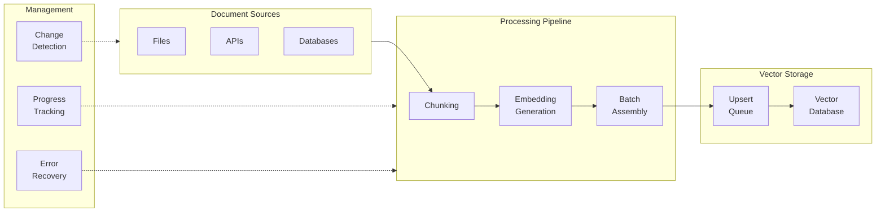

# Indexing Strategy

## Introduction

After processing documents into chunks, you need to **index** them—generate embeddings and store them in a vector database. At scale, this becomes a significant engineering challenge involving parallel processing, rate limiting, error recovery, and incremental updates.

A well-designed indexing strategy transforms a brittle batch job into a reliable, resumable pipeline that handles millions of documents.

### What We'll Cover in This Lesson

1. **Embedding generation at scale** — Parallel processing, rate management, error recovery
2. **Batch processing patterns** — Optimal batch sizes, queues, checkpointing
3. **Incremental updates** — Change detection, selective re-embedding
4. **Document updates and deletions** — Update strategies, soft vs hard delete
5. **Index organization** — Collections, namespaces, access control

### Prerequisites

- Understanding of embeddings (Unit 7)
- Familiarity with vector databases
- Basic async/threading knowledge

---

## Quick Start: Batch Indexing

Here's a production-ready pattern for indexing documents:

```python
from openai import OpenAI
from pinecone.grpc import PineconeGRPC as Pinecone
import itertools
from typing import Iterator

def chunks(iterable: list, batch_size: int = 100) -> Iterator:
    """Split iterable into batches."""
    it = iter(iterable)
    chunk = tuple(itertools.islice(it, batch_size))
    while chunk:
        yield chunk
        chunk = tuple(itertools.islice(it, batch_size))

def index_documents(
    documents: list[dict],
    index_name: str,
    namespace: str = "default",
    batch_size: int = 100
) -> dict:
    """
    Index documents with embeddings to Pinecone.
    
    Args:
        documents: List of {"id": str, "text": str, "metadata": dict}
        index_name: Pinecone index name
        namespace: Namespace for organization
        batch_size: Records per upsert batch
    
    Returns:
        Stats dict with counts
    """
    openai_client = OpenAI()
    pc = Pinecone()
    index = pc.Index(index_name)
    
    stats = {"processed": 0, "errors": 0}
    
    for batch in chunks(documents, batch_size):
        try:
            # 1. Generate embeddings for batch
            texts = [doc["text"] for doc in batch]
            response = openai_client.embeddings.create(
                model="text-embedding-3-small",
                input=texts
            )
            
            # 2. Prepare vectors for upsert
            vectors = []
            for doc, embedding_data in zip(batch, response.data):
                vectors.append({
                    "id": doc["id"],
                    "values": embedding_data.embedding,
                    "metadata": {
                        **doc.get("metadata", {}),
                        "text": doc["text"][:1000]  # Store text snippet
                    }
                })
            
            # 3. Upsert to vector database
            index.upsert(vectors=vectors, namespace=namespace)
            stats["processed"] += len(batch)
            
        except Exception as e:
            print(f"Batch error: {e}")
            stats["errors"] += len(batch)
    
    return stats

# Usage
documents = [
    {"id": "doc-1", "text": "Machine learning fundamentals...", "metadata": {"source": "ml-guide"}},
    {"id": "doc-2", "text": "Neural networks are...", "metadata": {"source": "ml-guide"}},
    # ... more documents
]

# stats = index_documents(documents, "my-rag-index", namespace="ml-docs")
```

---

## Indexing Pipeline Architecture



---

## Key Concepts

| Concept | Description | Why It Matters |
|---------|-------------|----------------|
| **Batch Size** | Records per API call | Balances throughput vs memory |
| **Rate Limiting** | Requests per minute cap | Prevents API throttling |
| **Checkpointing** | Saving progress state | Enables resume after failure |
| **Idempotency** | Same input = same result | Safe retries, no duplicates |
| **Namespace** | Logical partition in index | Multi-tenancy, organization |
| **Change Detection** | Identifying modified docs | Efficient incremental updates |

---

## Strategy Comparison

| Strategy | Use Case | Pros | Cons |
|----------|----------|------|------|
| **Full Reindex** | Initial load, schema changes | Simple, consistent | Slow, expensive |
| **Incremental** | Daily updates | Fast, cost-effective | Complex change detection |
| **Real-time** | User uploads | Immediate availability | Rate limiting challenges |
| **Queue-based** | High-volume ingestion | Scalable, resilient | Added infrastructure |

---

## Common Pitfalls

| ❌ Mistake | ✅ Solution |
|-----------|-------------|
| No rate limiting | Implement exponential backoff |
| No checkpointing | Save progress every N batches |
| Large batch memory | Stream documents, don't load all |
| Silent failures | Log errors with document IDs |
| No idempotent IDs | Use content hash + source as ID |

---

## Lesson Structure

This lesson contains the following sub-lessons:

| File | Topic | Key Concepts |
|------|-------|--------------|
| [01-embedding-generation-scale.md](./01-embedding-generation-scale.md) | Embedding at Scale | Parallel processing, rate limiting, async |
| [02-batch-processing-patterns.md](./02-batch-processing-patterns.md) | Batch Processing | Optimal sizes, queues, checkpointing |
| [03-incremental-updates.md](./03-incremental-updates.md) | Incremental Updates | Change detection, selective re-embedding |
| [04-document-updates-deletions.md](./04-document-updates-deletions.md) | Updates & Deletions | Soft/hard delete, cascade handling |
| [05-index-organization.md](./05-index-organization.md) | Index Organization | Namespaces, multitenancy, access control |

---

## Summary

Effective indexing strategy involves:

✅ **Batch processing** with optimal sizes (100-1000 records)
✅ **Rate limiting** with exponential backoff
✅ **Checkpointing** for resumable pipelines
✅ **Idempotent IDs** for safe retries
✅ **Namespace organization** for multi-tenancy
✅ **Change detection** for incremental updates

**Next:** [Embedding Generation at Scale](./01-embedding-generation-scale.md)

---

## Further Reading

- [Pinecone Upsert Documentation](https://docs.pinecone.io/guides/data/upsert-data) - Batch limits and parallel upsert
- [OpenAI Embeddings Guide](https://platform.openai.com/docs/guides/embeddings) - Embedding best practices
- [Qdrant Indexing](https://qdrant.tech/documentation/concepts/indexing/) - Index configuration options

<!--
Sources Consulted:
- Pinecone upsert documentation: https://docs.pinecone.io/guides/data/upsert-data
- OpenAI embeddings guide: https://platform.openai.com/docs/guides/embeddings
- Qdrant indexing concepts: https://qdrant.tech/documentation/concepts/indexing/
-->
