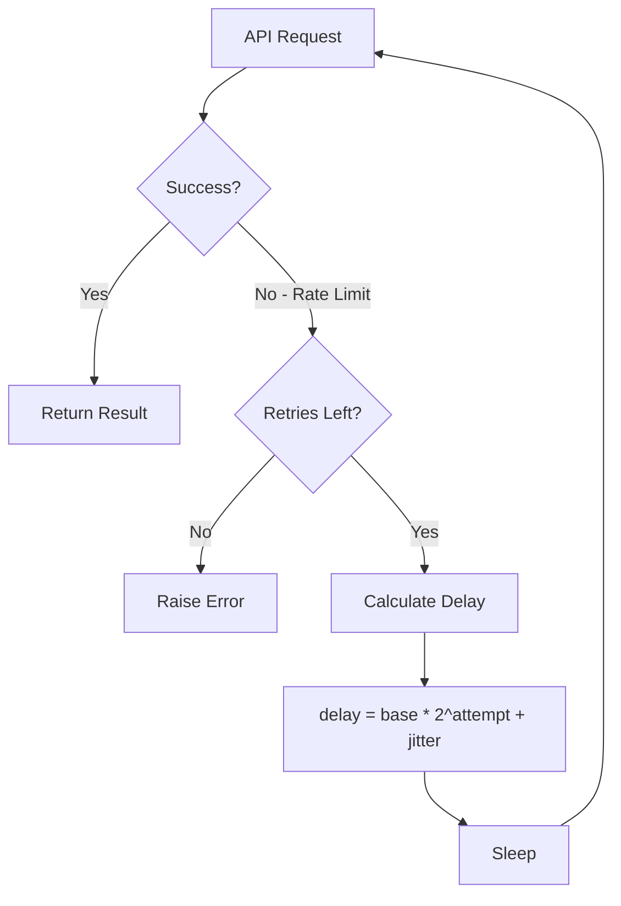

# Embedding Generation at Scale

## Introduction

Generating embeddings for thousands or millions of documents requires careful orchestration. API rate limits, network failures, and memory constraints can derail naive implementations. A production-ready embedding pipeline handles these challenges gracefully.

This lesson covers parallel processing, rate management, progress tracking, and error recovery patterns.

### What We'll Cover

- Single-threaded vs parallel embedding
- Rate limiting with exponential backoff
- Async embedding with asyncio
- Thread pool execution
- Progress tracking and logging
- Error recovery strategies

### Prerequisites

- Understanding of embeddings
- Basic Python async/await knowledge
- Familiarity with rate limiting concepts

---

## The Scale Challenge

Consider indexing 100,000 documents:

| Approach | Time (estimated) | Why |
|----------|------------------|-----|
| Sequential, one at a time | ~28 hours | 1 req/sec rate limit |
| Batched (100/request) | ~17 minutes | 1000 batches at 1/sec |
| Parallel batched (5 concurrent) | ~4 minutes | 5x throughput |
| Parallel with retry | ~5 minutes | Handles transient errors |

> **🤖 AI Context:** OpenAI's text-embedding-3-small processes up to 8,191 tokens per input. Batching multiple texts in one API call dramatically reduces total request count.

---

## Sequential Embedding (Baseline)

The simplest approach—good for understanding, bad for production:

```python
from openai import OpenAI
import time

def embed_sequential(texts: list[str], model: str = "text-embedding-3-small") -> list[list[float]]:
    """
    Embed texts one at a time. Slow but simple.
    
    Args:
        texts: List of text strings to embed
        model: Embedding model to use
    
    Returns:
        List of embedding vectors
    """
    client = OpenAI()
    embeddings = []
    
    for i, text in enumerate(texts):
        response = client.embeddings.create(
            model=model,
            input=text
        )
        embeddings.append(response.data[0].embedding)
        
        # Basic rate limiting
        if i % 100 == 0:
            print(f"Processed {i}/{len(texts)}")
    
    return embeddings

# Usage - SLOW for large datasets
# embeddings = embed_sequential(["text 1", "text 2", ...])
```

**Problems:**
- One API call per text
- No parallelism
- No error recovery
- No rate limit handling

---

## Batched Embedding

OpenAI's embeddings API accepts multiple texts in one request:

```python
from openai import OpenAI
from typing import Iterator
import itertools

def chunks(iterable: list, batch_size: int) -> Iterator:
    """Split iterable into batches."""
    it = iter(iterable)
    chunk = tuple(itertools.islice(it, batch_size))
    while chunk:
        yield chunk
        chunk = tuple(itertools.islice(it, batch_size))

def embed_batched(
    texts: list[str],
    model: str = "text-embedding-3-small",
    batch_size: int = 100
) -> list[list[float]]:
    """
    Embed texts in batches. Much faster than sequential.
    
    Args:
        texts: List of text strings
        model: Embedding model
        batch_size: Texts per API call (max ~2000 for OpenAI)
    
    Returns:
        List of embedding vectors in same order as input
    """
    client = OpenAI()
    all_embeddings = []
    
    for batch_idx, batch in enumerate(chunks(texts, batch_size)):
        response = client.embeddings.create(
            model=model,
            input=list(batch)
        )
        
        # Extract embeddings in order
        batch_embeddings = [item.embedding for item in response.data]
        all_embeddings.extend(batch_embeddings)
        
        print(f"Batch {batch_idx + 1}: {len(all_embeddings)}/{len(texts)} complete")
    
    return all_embeddings

# Usage - 100x faster than sequential
# embeddings = embed_batched(texts, batch_size=100)
```

---

## Rate Limiting with Exponential Backoff

API providers enforce rate limits. Handle `429 Too Many Requests` gracefully:

```python
import time
import random
from openai import OpenAI, RateLimitError, APIError

class RateLimitedEmbedder:
    """Embedding client with exponential backoff for rate limits."""
    
    def __init__(
        self,
        model: str = "text-embedding-3-small",
        max_retries: int = 5,
        base_delay: float = 1.0,
        max_delay: float = 60.0
    ):
        self.client = OpenAI()
        self.model = model
        self.max_retries = max_retries
        self.base_delay = base_delay
        self.max_delay = max_delay
    
    def embed(self, texts: list[str]) -> list[list[float]]:
        """
        Embed texts with automatic retry on rate limit.
        
        Uses exponential backoff with jitter.
        """
        for attempt in range(self.max_retries):
            try:
                response = self.client.embeddings.create(
                    model=self.model,
                    input=texts
                )
                return [item.embedding for item in response.data]
                
            except RateLimitError as e:
                if attempt == self.max_retries - 1:
                    raise  # Final attempt failed
                
                # Exponential backoff with jitter
                delay = min(
                    self.base_delay * (2 ** attempt) + random.uniform(0, 1),
                    self.max_delay
                )
                print(f"Rate limited. Retrying in {delay:.1f}s (attempt {attempt + 1})")
                time.sleep(delay)
                
            except APIError as e:
                if attempt == self.max_retries - 1:
                    raise
                    
                # Shorter delay for transient errors
                delay = self.base_delay * (attempt + 1)
                print(f"API error: {e}. Retrying in {delay:.1f}s")
                time.sleep(delay)
        
        raise RuntimeError("Max retries exceeded")

# Usage
embedder = RateLimitedEmbedder(max_retries=5)
# embeddings = embedder.embed(["text 1", "text 2"])
```

### Exponential Backoff Visualization



---

## Async Parallel Embedding

Use `asyncio` for concurrent requests with controlled parallelism:

```python
import asyncio
from openai import AsyncOpenAI
from typing import Callable
import itertools

class AsyncEmbedder:
    """Async embedding with controlled concurrency."""
    
    def __init__(
        self,
        model: str = "text-embedding-3-small",
        max_concurrent: int = 5,
        batch_size: int = 100
    ):
        self.client = AsyncOpenAI()
        self.model = model
        self.semaphore = asyncio.Semaphore(max_concurrent)
        self.batch_size = batch_size
    
    async def _embed_batch(
        self,
        batch: list[str],
        batch_idx: int
    ) -> tuple[int, list[list[float]]]:
        """Embed a single batch with semaphore control."""
        async with self.semaphore:
            response = await self.client.embeddings.create(
                model=self.model,
                input=batch
            )
            embeddings = [item.embedding for item in response.data]
            return batch_idx, embeddings
    
    async def embed_all(
        self,
        texts: list[str],
        progress_callback: Callable[[int, int], None] = None
    ) -> list[list[float]]:
        """
        Embed all texts with controlled parallelism.
        
        Args:
            texts: List of texts to embed
            progress_callback: Optional (completed, total) callback
        
        Returns:
            Embeddings in same order as input
        """
        # Split into batches
        batches = list(self._chunks(texts, self.batch_size))
        total_batches = len(batches)
        
        # Create tasks for all batches
        tasks = [
            self._embed_batch(list(batch), idx)
            for idx, batch in enumerate(batches)
        ]
        
        # Process with controlled concurrency
        results = {}
        completed = 0
        
        for coro in asyncio.as_completed(tasks):
            batch_idx, embeddings = await coro
            results[batch_idx] = embeddings
            completed += 1
            
            if progress_callback:
                progress_callback(completed, total_batches)
        
        # Reconstruct in order
        all_embeddings = []
        for i in range(total_batches):
            all_embeddings.extend(results[i])
        
        return all_embeddings
    
    def _chunks(self, iterable: list, size: int):
        """Split into chunks."""
        it = iter(iterable)
        chunk = tuple(itertools.islice(it, size))
        while chunk:
            yield chunk
            chunk = tuple(itertools.islice(it, size))

# Usage
async def main():
    embedder = AsyncEmbedder(max_concurrent=5, batch_size=100)
    
    texts = [f"Document {i} content..." for i in range(1000)]
    
    def on_progress(completed: int, total: int):
        print(f"Progress: {completed}/{total} batches")
    
    embeddings = await embedder.embed_all(texts, progress_callback=on_progress)
    print(f"Generated {len(embeddings)} embeddings")

# asyncio.run(main())
```

**Output:**
```
Progress: 1/10 batches
Progress: 2/10 batches
...
Progress: 10/10 batches
Generated 1000 embeddings
```

---

## Thread Pool Execution

For non-async code, use `ThreadPoolExecutor`:

```python
from concurrent.futures import ThreadPoolExecutor, as_completed
from openai import OpenAI
import itertools
from dataclasses import dataclass

@dataclass
class BatchResult:
    """Result of embedding a batch."""
    batch_idx: int
    embeddings: list[list[float]]
    error: str | None = None

class ThreadedEmbedder:
    """Threaded embedding with progress tracking."""
    
    def __init__(
        self,
        model: str = "text-embedding-3-small",
        max_workers: int = 5,
        batch_size: int = 100
    ):
        self.model = model
        self.max_workers = max_workers
        self.batch_size = batch_size
    
    def _embed_batch(self, batch: list[str], batch_idx: int) -> BatchResult:
        """Embed a single batch (runs in thread)."""
        client = OpenAI()  # Thread-safe: create per-thread
        
        try:
            response = client.embeddings.create(
                model=self.model,
                input=batch
            )
            embeddings = [item.embedding for item in response.data]
            return BatchResult(batch_idx=batch_idx, embeddings=embeddings)
            
        except Exception as e:
            return BatchResult(
                batch_idx=batch_idx,
                embeddings=[],
                error=str(e)
            )
    
    def embed_all(self, texts: list[str]) -> tuple[list[list[float]], list[str]]:
        """
        Embed all texts using thread pool.
        
        Returns:
            (embeddings, errors) tuple
        """
        batches = list(self._chunks(texts, self.batch_size))
        results = {}
        errors = []
        
        with ThreadPoolExecutor(max_workers=self.max_workers) as executor:
            # Submit all batches
            futures = {
                executor.submit(self._embed_batch, list(batch), idx): idx
                for idx, batch in enumerate(batches)
            }
            
            # Process as completed
            for future in as_completed(futures):
                result = future.result()
                
                if result.error:
                    errors.append(f"Batch {result.batch_idx}: {result.error}")
                else:
                    results[result.batch_idx] = result.embeddings
                
                print(f"Completed batch {result.batch_idx + 1}/{len(batches)}")
        
        # Reconstruct in order
        all_embeddings = []
        for i in range(len(batches)):
            if i in results:
                all_embeddings.extend(results[i])
            else:
                # Placeholder for failed batches
                all_embeddings.extend([[] for _ in batches[i]])
        
        return all_embeddings, errors
    
    def _chunks(self, iterable: list, size: int):
        it = iter(iterable)
        chunk = tuple(itertools.islice(it, size))
        while chunk:
            yield chunk
            chunk = tuple(itertools.islice(it, size))

# Usage
embedder = ThreadedEmbedder(max_workers=5, batch_size=100)
# embeddings, errors = embedder.embed_all(texts)
```

---

## Progress Tracking

For long-running jobs, track progress with `tqdm`:

```python
from tqdm import tqdm
from openai import OpenAI
import itertools

def embed_with_progress(
    texts: list[str],
    model: str = "text-embedding-3-small",
    batch_size: int = 100
) -> list[list[float]]:
    """Embed texts with progress bar."""
    client = OpenAI()
    all_embeddings = []
    
    batches = list(chunks(texts, batch_size))
    
    with tqdm(total=len(texts), desc="Embedding", unit="docs") as pbar:
        for batch in batches:
            response = client.embeddings.create(
                model=model,
                input=list(batch)
            )
            
            batch_embeddings = [item.embedding for item in response.data]
            all_embeddings.extend(batch_embeddings)
            
            pbar.update(len(batch))
    
    return all_embeddings

def chunks(iterable, size):
    it = iter(iterable)
    chunk = tuple(itertools.islice(it, size))
    while chunk:
        yield chunk
        chunk = tuple(itertools.islice(it, size))

# Usage
# embeddings = embed_with_progress(texts)
# Embedding: 100%|██████████| 10000/10000 [02:15<00:00, 73.8docs/s]
```

---

## Error Recovery

Handle partial failures gracefully:

```python
from dataclasses import dataclass, field
from typing import Optional
import json
from pathlib import Path

@dataclass
class EmbeddingJob:
    """Track embedding job state for recovery."""
    total_texts: int
    completed_ids: set = field(default_factory=set)
    failed_ids: dict = field(default_factory=dict)  # id -> error message
    embeddings: dict = field(default_factory=dict)  # id -> embedding
    
    def save(self, path: str):
        """Save job state to file."""
        state = {
            "total_texts": self.total_texts,
            "completed_ids": list(self.completed_ids),
            "failed_ids": self.failed_ids,
            # Don't save embeddings to state file (too large)
        }
        Path(path).write_text(json.dumps(state))
    
    @classmethod
    def load(cls, path: str) -> Optional["EmbeddingJob"]:
        """Load job state from file."""
        if not Path(path).exists():
            return None
        
        state = json.loads(Path(path).read_text())
        job = cls(total_texts=state["total_texts"])
        job.completed_ids = set(state["completed_ids"])
        job.failed_ids = state["failed_ids"]
        return job

class RecoverableEmbedder:
    """Embedder that can resume from failures."""
    
    def __init__(
        self,
        model: str = "text-embedding-3-small",
        checkpoint_path: str = "embedding_checkpoint.json",
        checkpoint_interval: int = 10
    ):
        self.client = OpenAI()
        self.model = model
        self.checkpoint_path = checkpoint_path
        self.checkpoint_interval = checkpoint_interval
    
    def embed_documents(
        self,
        documents: list[dict],  # [{"id": str, "text": str}, ...]
        batch_size: int = 100
    ) -> dict[str, list[float]]:
        """
        Embed documents with checkpoint recovery.
        
        Args:
            documents: List of {"id": str, "text": str}
            batch_size: Batch size for embedding
        
        Returns:
            Dict mapping document ID to embedding
        """
        # Try to resume from checkpoint
        job = EmbeddingJob.load(self.checkpoint_path)
        if job:
            print(f"Resuming from checkpoint: {len(job.completed_ids)} already done")
        else:
            job = EmbeddingJob(total_texts=len(documents))
        
        # Filter to unprocessed documents
        pending = [
            doc for doc in documents
            if doc["id"] not in job.completed_ids
        ]
        
        batches_processed = 0
        
        for batch in self._chunks(pending, batch_size):
            try:
                texts = [doc["text"] for doc in batch]
                response = self.client.embeddings.create(
                    model=self.model,
                    input=texts
                )
                
                for doc, emb_data in zip(batch, response.data):
                    job.embeddings[doc["id"]] = emb_data.embedding
                    job.completed_ids.add(doc["id"])
                
                batches_processed += 1
                
                # Checkpoint periodically
                if batches_processed % self.checkpoint_interval == 0:
                    job.save(self.checkpoint_path)
                    print(f"Checkpoint saved: {len(job.completed_ids)}/{job.total_texts}")
                    
            except Exception as e:
                # Record failures
                for doc in batch:
                    job.failed_ids[doc["id"]] = str(e)
                print(f"Batch failed: {e}")
        
        # Final save
        job.save(self.checkpoint_path)
        
        # Report
        print(f"Complete: {len(job.completed_ids)} succeeded, {len(job.failed_ids)} failed")
        
        return job.embeddings
    
    def _chunks(self, iterable, size):
        it = iter(iterable)
        chunk = tuple(itertools.islice(it, size))
        while chunk:
            yield chunk
            chunk = tuple(itertools.islice(it, size))

# Usage
embedder = RecoverableEmbedder(checkpoint_path="my_job.json")
documents = [{"id": f"doc-{i}", "text": f"Content {i}"} for i in range(1000)]
# embeddings = embedder.embed_documents(documents)
```

---

## Hands-on Exercise

### Your Task

Build an async embedder that:
1. Processes texts in parallel (max 5 concurrent)
2. Implements exponential backoff for rate limits
3. Tracks progress with a callback
4. Returns embeddings in the original order

### Requirements

```python
async def embed_parallel(
    texts: list[str],
    max_concurrent: int = 5,
    batch_size: int = 100,
    on_progress: Callable[[int, int], None] = None
) -> list[list[float]]:
    pass
```

<details>
<summary>💡 Hints</summary>

- Use `asyncio.Semaphore` to limit concurrency
- Use `asyncio.as_completed` for progress tracking
- Track batch index to reconstruct order
- Implement retry logic in the batch function

</details>

<details>
<summary>✅ Solution</summary>

```python
import asyncio
from openai import AsyncOpenAI, RateLimitError
from typing import Callable
import random

async def embed_parallel(
    texts: list[str],
    max_concurrent: int = 5,
    batch_size: int = 100,
    on_progress: Callable[[int, int], None] = None,
    max_retries: int = 3
) -> list[list[float]]:
    """Embed texts with parallel processing and retry."""
    
    client = AsyncOpenAI()
    semaphore = asyncio.Semaphore(max_concurrent)
    
    async def embed_batch_with_retry(
        batch: list[str],
        batch_idx: int
    ) -> tuple[int, list[list[float]]]:
        async with semaphore:
            for attempt in range(max_retries):
                try:
                    response = await client.embeddings.create(
                        model="text-embedding-3-small",
                        input=batch
                    )
                    return batch_idx, [d.embedding for d in response.data]
                    
                except RateLimitError:
                    if attempt < max_retries - 1:
                        delay = (2 ** attempt) + random.uniform(0, 1)
                        await asyncio.sleep(delay)
                    else:
                        raise
            
            raise RuntimeError("Max retries exceeded")
    
    # Create batches
    batches = [texts[i:i+batch_size] for i in range(0, len(texts), batch_size)]
    total = len(batches)
    
    # Create tasks
    tasks = [
        embed_batch_with_retry(batch, idx)
        for idx, batch in enumerate(batches)
    ]
    
    # Process with progress
    results = {}
    completed = 0
    
    for coro in asyncio.as_completed(tasks):
        batch_idx, embeddings = await coro
        results[batch_idx] = embeddings
        completed += 1
        
        if on_progress:
            on_progress(completed, total)
    
    # Reconstruct order
    all_embeddings = []
    for i in range(total):
        all_embeddings.extend(results[i])
    
    return all_embeddings

# Test
async def test():
    texts = [f"Text {i}" for i in range(500)]
    
    def progress(done, total):
        print(f"{done}/{total} batches")
    
    embeddings = await embed_parallel(
        texts,
        max_concurrent=5,
        batch_size=50,
        on_progress=progress
    )
    print(f"Got {len(embeddings)} embeddings")

# asyncio.run(test())
```

</details>

---

## Summary

Embedding at scale requires:

✅ **Batching** — Multiple texts per API call (100-2000)
✅ **Rate limiting** — Exponential backoff with jitter
✅ **Parallelism** — Async or threading with controlled concurrency
✅ **Progress tracking** — Callbacks or tqdm for visibility
✅ **Error recovery** — Checkpoints for resumable jobs
✅ **Ordered results** — Track indices to preserve input order

**Next:** [Batch Processing Patterns](./02-batch-processing-patterns.md)

---

## Further Reading

- [OpenAI Rate Limits](https://platform.openai.com/docs/guides/rate-limits) - Understanding API limits
- [Python asyncio](https://docs.python.org/3/library/asyncio.html) - Async programming guide
- [Tenacity Library](https://tenacity.readthedocs.io/) - Advanced retry patterns

<!--
Sources Consulted:
- OpenAI embeddings documentation: https://platform.openai.com/docs/guides/embeddings
- Python asyncio documentation
- Exponential backoff best practices
-->
