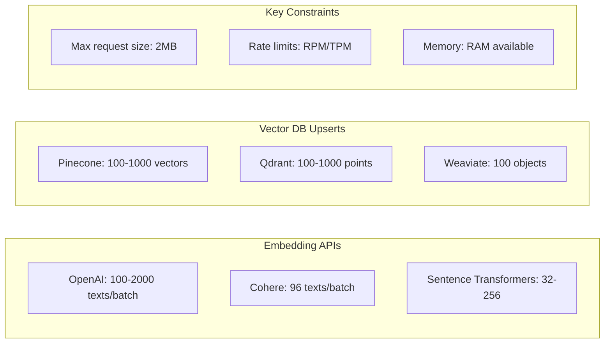
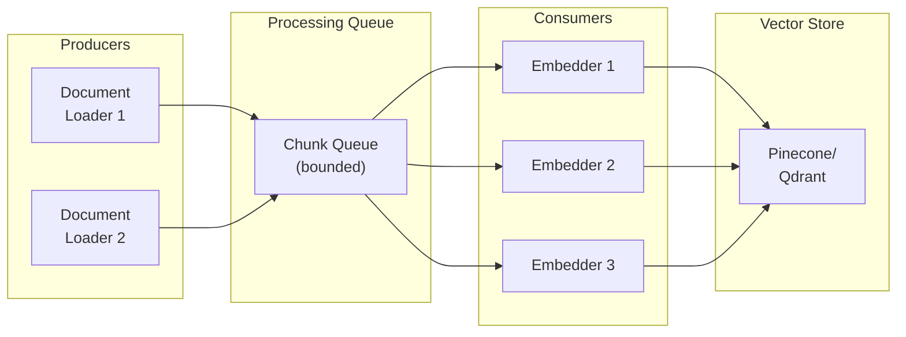

# Batch Processing Patterns

## Introduction

Efficient batch processing is the backbone of scalable indexing pipelines. The right batch sizes, queue patterns, and checkpointing strategies can mean the difference between a 10-minute job and a 10-hour one—or worse, a job that fails at 90% and has to restart from zero.

This lesson covers optimal batch sizing, queue-based processing, checkpoint/resume patterns, and resource management.

### What We'll Cover

- Optimal batch sizes for different APIs
- Queue-based processing patterns
- Checkpointing for resumable jobs
- Memory and resource management
- Producer-consumer pipelines

### Prerequisites

- Understanding of embedding generation
- Basic Python data structures
- Familiarity with async concepts

---

## Batch Size Fundamentals

Different APIs have different optimal batch sizes:



### Pinecone Batch Size Reference

From the official documentation:

| Vector Dimensions | Metadata Size | Max Batch Size |
|-------------------|---------------|----------------|
| 386 | 0 bytes | 1000 |
| 768 | 500 bytes | 559 |
| 1536 | 2000 bytes | 245 |

> **⚠️ Warning:** Exceeding the 2MB request limit causes failures. Calculate your payload size before setting batch sizes.

---

## Calculating Optimal Batch Size

```python
import sys
import json

def calculate_batch_size(
    embedding_dim: int,
    avg_metadata_bytes: int = 500,
    max_request_mb: float = 2.0,
    safety_margin: float = 0.8
) -> int:
    """
    Calculate optimal batch size for vector upserts.
    
    Args:
        embedding_dim: Dimension of embedding vectors
        avg_metadata_bytes: Average metadata size per record
        max_request_mb: Maximum request size in MB
        safety_margin: Safety factor (0.8 = 80% of max)
    
    Returns:
        Recommended batch size
    """
    max_bytes = max_request_mb * 1024 * 1024 * safety_margin
    
    # Estimate bytes per vector
    # Each float32 = 4 bytes, plus JSON overhead
    vector_bytes = embedding_dim * 4 * 1.5  # 1.5x for JSON encoding
    id_bytes = 50  # Average ID length
    overhead_bytes = 100  # JSON structure overhead
    
    bytes_per_record = vector_bytes + avg_metadata_bytes + id_bytes + overhead_bytes
    
    batch_size = int(max_bytes / bytes_per_record)
    
    # Cap at 1000 (Pinecone limit)
    return min(batch_size, 1000)

# Examples
print(f"768-dim, 500B metadata: {calculate_batch_size(768, 500)} records/batch")
print(f"1536-dim, 2KB metadata: {calculate_batch_size(1536, 2000)} records/batch")
print(f"3072-dim, 1KB metadata: {calculate_batch_size(3072, 1000)} records/batch")
```

**Output:**
```
768-dim, 500B metadata: 397 records/batch
1536-dim, 2KB metadata: 181 records/batch
3072-dim, 1KB metadata: 131 records/batch
```

---

## Queue-Based Processing

For high-volume ingestion, use a queue to decouple processing stages:



### Implementation with asyncio.Queue

```python
import asyncio
from dataclasses import dataclass
from typing import AsyncIterator
from openai import AsyncOpenAI

@dataclass
class ChunkBatch:
    """A batch of chunks ready for embedding."""
    batch_id: int
    chunks: list[dict]  # [{"id": str, "text": str, "metadata": dict}]

@dataclass  
class EmbeddedBatch:
    """A batch with embeddings ready for upsert."""
    batch_id: int
    vectors: list[dict]  # [{"id": str, "values": list, "metadata": dict}]

class QueuedPipeline:
    """Producer-consumer pipeline with queues."""
    
    def __init__(
        self,
        embedding_model: str = "text-embedding-3-small",
        batch_size: int = 100,
        max_queue_size: int = 10,
        num_embedders: int = 3
    ):
        self.embedding_model = embedding_model
        self.batch_size = batch_size
        self.max_queue_size = max_queue_size
        self.num_embedders = num_embedders
        
        self.chunk_queue: asyncio.Queue[ChunkBatch | None] = None
        self.embed_queue: asyncio.Queue[EmbeddedBatch | None] = None
    
    async def run(
        self,
        documents: AsyncIterator[dict],
        index
    ) -> dict:
        """
        Run the full pipeline.
        
        Args:
            documents: Async iterator of {"id", "text", "metadata"}
            index: Vector database index
        
        Returns:
            Stats dict
        """
        self.chunk_queue = asyncio.Queue(maxsize=self.max_queue_size)
        self.embed_queue = asyncio.Queue(maxsize=self.max_queue_size)
        
        stats = {"produced": 0, "embedded": 0, "upserted": 0}
        
        # Start all workers
        producer = asyncio.create_task(
            self._producer(documents, stats)
        )
        
        embedders = [
            asyncio.create_task(self._embedder(i, stats))
            for i in range(self.num_embedders)
        ]
        
        upserter = asyncio.create_task(
            self._upserter(index, stats)
        )
        
        # Wait for pipeline to complete
        await producer
        
        # Signal embedders to stop
        for _ in range(self.num_embedders):
            await self.chunk_queue.put(None)
        await asyncio.gather(*embedders)
        
        # Signal upserter to stop
        await self.embed_queue.put(None)
        await upserter
        
        return stats
    
    async def _producer(
        self,
        documents: AsyncIterator[dict],
        stats: dict
    ):
        """Batch documents and put on chunk queue."""
        batch = []
        batch_id = 0
        
        async for doc in documents:
            batch.append(doc)
            
            if len(batch) >= self.batch_size:
                await self.chunk_queue.put(ChunkBatch(batch_id, batch))
                stats["produced"] += len(batch)
                batch_id += 1
                batch = []
        
        # Final partial batch
        if batch:
            await self.chunk_queue.put(ChunkBatch(batch_id, batch))
            stats["produced"] += len(batch)
    
    async def _embedder(self, worker_id: int, stats: dict):
        """Consume chunks, generate embeddings, put on embed queue."""
        client = AsyncOpenAI()
        
        while True:
            batch = await self.chunk_queue.get()
            
            if batch is None:
                break
            
            texts = [chunk["text"] for chunk in batch.chunks]
            
            response = await client.embeddings.create(
                model=self.embedding_model,
                input=texts
            )
            
            vectors = []
            for chunk, emb_data in zip(batch.chunks, response.data):
                vectors.append({
                    "id": chunk["id"],
                    "values": emb_data.embedding,
                    "metadata": chunk.get("metadata", {})
                })
            
            await self.embed_queue.put(EmbeddedBatch(batch.batch_id, vectors))
            stats["embedded"] += len(vectors)
            
            print(f"Embedder {worker_id}: batch {batch.batch_id} complete")
    
    async def _upserter(self, index, stats: dict):
        """Consume embedded batches and upsert to vector store."""
        while True:
            batch = await self.embed_queue.get()
            
            if batch is None:
                break
            
            # Upsert to vector database
            index.upsert(vectors=batch.vectors)
            stats["upserted"] += len(batch.vectors)
            
            print(f"Upserter: batch {batch.batch_id} upserted")

# Usage
async def example():
    async def document_generator():
        for i in range(1000):
            yield {"id": f"doc-{i}", "text": f"Content {i}", "metadata": {"source": "test"}}
    
    pipeline = QueuedPipeline(batch_size=100, num_embedders=3)
    # stats = await pipeline.run(document_generator(), index)
```

---

## Checkpointing for Resumable Jobs

Save progress regularly to resume after failures:

```python
import json
from pathlib import Path
from dataclasses import dataclass, field, asdict
from datetime import datetime
from typing import Optional

@dataclass
class PipelineCheckpoint:
    """Checkpoint state for resumable pipeline."""
    job_id: str
    started_at: str
    last_updated: str
    total_documents: int
    processed_ids: list[str] = field(default_factory=list)
    failed_ids: dict[str, str] = field(default_factory=dict)  # id -> error
    last_batch_id: int = 0
    
    @property
    def completed_count(self) -> int:
        return len(self.processed_ids)
    
    @property
    def failed_count(self) -> int:
        return len(self.failed_ids)

class CheckpointManager:
    """Manage pipeline checkpoints for recovery."""
    
    def __init__(self, checkpoint_dir: str = "./checkpoints"):
        self.checkpoint_dir = Path(checkpoint_dir)
        self.checkpoint_dir.mkdir(exist_ok=True)
    
    def _checkpoint_path(self, job_id: str) -> Path:
        return self.checkpoint_dir / f"{job_id}.json"
    
    def create(self, job_id: str, total_documents: int) -> PipelineCheckpoint:
        """Create a new checkpoint."""
        now = datetime.utcnow().isoformat()
        checkpoint = PipelineCheckpoint(
            job_id=job_id,
            started_at=now,
            last_updated=now,
            total_documents=total_documents
        )
        self.save(checkpoint)
        return checkpoint
    
    def load(self, job_id: str) -> Optional[PipelineCheckpoint]:
        """Load existing checkpoint if it exists."""
        path = self._checkpoint_path(job_id)
        if not path.exists():
            return None
        
        data = json.loads(path.read_text())
        return PipelineCheckpoint(**data)
    
    def save(self, checkpoint: PipelineCheckpoint):
        """Save checkpoint to disk."""
        checkpoint.last_updated = datetime.utcnow().isoformat()
        path = self._checkpoint_path(checkpoint.job_id)
        path.write_text(json.dumps(asdict(checkpoint), indent=2))
    
    def mark_processed(
        self,
        checkpoint: PipelineCheckpoint,
        doc_ids: list[str],
        batch_id: int
    ):
        """Mark documents as processed."""
        checkpoint.processed_ids.extend(doc_ids)
        checkpoint.last_batch_id = batch_id
        self.save(checkpoint)
    
    def mark_failed(
        self,
        checkpoint: PipelineCheckpoint,
        doc_id: str,
        error: str
    ):
        """Mark a document as failed."""
        checkpoint.failed_ids[doc_id] = error
        self.save(checkpoint)
    
    def get_pending_ids(
        self,
        checkpoint: PipelineCheckpoint,
        all_ids: list[str]
    ) -> list[str]:
        """Get IDs that haven't been processed yet."""
        completed = set(checkpoint.processed_ids)
        failed = set(checkpoint.failed_ids.keys())
        return [id for id in all_ids if id not in completed and id not in failed]
    
    def complete(self, checkpoint: PipelineCheckpoint):
        """Mark job as complete and archive checkpoint."""
        archive_dir = self.checkpoint_dir / "completed"
        archive_dir.mkdir(exist_ok=True)
        
        # Move to completed
        src = self._checkpoint_path(checkpoint.job_id)
        dst = archive_dir / f"{checkpoint.job_id}_{datetime.utcnow().strftime('%Y%m%d_%H%M%S')}.json"
        src.rename(dst)

# Usage with pipeline
class ResumablePipeline:
    """Pipeline that can resume from checkpoints."""
    
    def __init__(self, job_id: str, checkpoint_interval: int = 5):
        self.job_id = job_id
        self.checkpoint_interval = checkpoint_interval
        self.checkpoint_manager = CheckpointManager()
    
    def process_documents(
        self,
        documents: list[dict],
        embedder,
        index
    ) -> dict:
        """
        Process documents with checkpointing.
        
        Resumes from last checkpoint if one exists.
        """
        # Load or create checkpoint
        checkpoint = self.checkpoint_manager.load(self.job_id)
        
        if checkpoint:
            print(f"Resuming job {self.job_id}: {checkpoint.completed_count}/{checkpoint.total_documents}")
            pending_ids = self.checkpoint_manager.get_pending_ids(
                checkpoint,
                [doc["id"] for doc in documents]
            )
            documents = [d for d in documents if d["id"] in pending_ids]
        else:
            checkpoint = self.checkpoint_manager.create(
                self.job_id,
                len(documents)
            )
            print(f"Starting new job {self.job_id}: {len(documents)} documents")
        
        # Process in batches
        batch_size = 100
        batches_since_checkpoint = 0
        
        for i in range(0, len(documents), batch_size):
            batch = documents[i:i + batch_size]
            batch_id = checkpoint.last_batch_id + 1
            
            try:
                # Generate embeddings
                embeddings = embedder.embed([d["text"] for d in batch])
                
                # Upsert to index
                vectors = [
                    {"id": d["id"], "values": emb, "metadata": d.get("metadata", {})}
                    for d, emb in zip(batch, embeddings)
                ]
                index.upsert(vectors=vectors)
                
                # Update checkpoint
                self.checkpoint_manager.mark_processed(
                    checkpoint,
                    [d["id"] for d in batch],
                    batch_id
                )
                
                batches_since_checkpoint += 1
                
            except Exception as e:
                for doc in batch:
                    self.checkpoint_manager.mark_failed(checkpoint, doc["id"], str(e))
                print(f"Batch {batch_id} failed: {e}")
        
        # Complete
        self.checkpoint_manager.complete(checkpoint)
        
        return {
            "processed": checkpoint.completed_count,
            "failed": checkpoint.failed_count
        }
```

---

## Memory-Efficient Streaming

For large datasets, stream documents instead of loading all into memory:

```python
from typing import Iterator, Generator
import ijson  # For streaming JSON parsing

def stream_documents_from_jsonl(file_path: str) -> Generator[dict, None, None]:
    """Stream documents from a JSONL file."""
    with open(file_path, 'r') as f:
        for line in f:
            if line.strip():
                yield json.loads(line)

def stream_documents_from_large_json(file_path: str) -> Generator[dict, None, None]:
    """Stream documents from a large JSON array using ijson."""
    with open(file_path, 'rb') as f:
        # Assuming structure: {"documents": [...]}
        for doc in ijson.items(f, 'documents.item'):
            yield doc

class StreamingBatcher:
    """Batch documents from a stream without loading all into memory."""
    
    def __init__(self, batch_size: int = 100):
        self.batch_size = batch_size
    
    def batch_stream(
        self,
        documents: Iterator[dict]
    ) -> Generator[list[dict], None, None]:
        """
        Yield batches from a document stream.
        
        Memory usage: O(batch_size) instead of O(total_documents)
        """
        batch = []
        
        for doc in documents:
            batch.append(doc)
            
            if len(batch) >= self.batch_size:
                yield batch
                batch = []
        
        if batch:
            yield batch

def process_large_file(
    file_path: str,
    embedder,
    index,
    batch_size: int = 100
) -> dict:
    """
    Process a large file with streaming.
    
    Memory-efficient: only one batch in memory at a time.
    """
    batcher = StreamingBatcher(batch_size)
    stats = {"processed": 0, "batches": 0}
    
    document_stream = stream_documents_from_jsonl(file_path)
    
    for batch in batcher.batch_stream(document_stream):
        # Process batch
        texts = [doc["text"] for doc in batch]
        embeddings = embedder.embed(texts)
        
        vectors = [
            {"id": doc["id"], "values": emb, "metadata": doc.get("metadata", {})}
            for doc, emb in zip(batch, embeddings)
        ]
        
        index.upsert(vectors=vectors)
        
        stats["processed"] += len(batch)
        stats["batches"] += 1
        
        if stats["batches"] % 10 == 0:
            print(f"Processed {stats['processed']} documents")
    
    return stats
```

---

## Resource Management

Control CPU, memory, and API usage:

```python
import psutil
import asyncio
from contextlib import asynccontextmanager

class ResourceManager:
    """Monitor and control resource usage."""
    
    def __init__(
        self,
        max_memory_percent: float = 80.0,
        max_concurrent_requests: int = 10,
        requests_per_minute: int = 100
    ):
        self.max_memory_percent = max_memory_percent
        self.semaphore = asyncio.Semaphore(max_concurrent_requests)
        self.rate_limiter = RateLimiter(requests_per_minute)
    
    def check_memory(self) -> bool:
        """Check if memory usage is within limits."""
        memory = psutil.virtual_memory()
        return memory.percent < self.max_memory_percent
    
    async def wait_for_memory(self):
        """Wait until memory is available."""
        while not self.check_memory():
            print(f"Memory at {psutil.virtual_memory().percent}%, waiting...")
            await asyncio.sleep(5)
    
    @asynccontextmanager
    async def acquire(self):
        """Acquire resources for a request."""
        await self.wait_for_memory()
        await self.rate_limiter.acquire()
        async with self.semaphore:
            yield

class RateLimiter:
    """Token bucket rate limiter."""
    
    def __init__(self, requests_per_minute: int):
        self.rate = requests_per_minute / 60.0  # requests per second
        self.tokens = requests_per_minute
        self.max_tokens = requests_per_minute
        self.last_update = asyncio.get_event_loop().time()
        self.lock = asyncio.Lock()
    
    async def acquire(self):
        """Wait for a token to become available."""
        async with self.lock:
            now = asyncio.get_event_loop().time()
            elapsed = now - self.last_update
            self.tokens = min(
                self.max_tokens,
                self.tokens + elapsed * self.rate
            )
            self.last_update = now
            
            if self.tokens < 1:
                wait_time = (1 - self.tokens) / self.rate
                await asyncio.sleep(wait_time)
                self.tokens = 0
            else:
                self.tokens -= 1

# Usage
async def managed_embedding(
    texts: list[str],
    resource_manager: ResourceManager,
    client
) -> list[list[float]]:
    """Embed with resource management."""
    async with resource_manager.acquire():
        response = await client.embeddings.create(
            model="text-embedding-3-small",
            input=texts
        )
        return [d.embedding for d in response.data]
```

---

## Hands-on Exercise

### Your Task

Build a checkpointed batch processor that:
1. Processes documents in batches
2. Saves checkpoint every N batches
3. Can resume from checkpoint
4. Tracks success/failure counts

### Requirements

```python
class BatchProcessor:
    def process(
        self,
        documents: list[dict],
        process_fn: Callable[[list[dict]], list[dict]],
        job_id: str
    ) -> dict:
        """
        Returns: {"processed": int, "failed": int, "resumed": bool}
        """
        pass
```

<details>
<summary>💡 Hints</summary>

- Use JSON file for checkpoint persistence
- Track processed IDs in a set
- Filter documents on resume
- Save checkpoint periodically

</details>

<details>
<summary>✅ Solution</summary>

```python
import json
from pathlib import Path
from typing import Callable

class BatchProcessor:
    def __init__(
        self,
        batch_size: int = 100,
        checkpoint_interval: int = 5,
        checkpoint_dir: str = "./checkpoints"
    ):
        self.batch_size = batch_size
        self.checkpoint_interval = checkpoint_interval
        self.checkpoint_dir = Path(checkpoint_dir)
        self.checkpoint_dir.mkdir(exist_ok=True)
    
    def _checkpoint_path(self, job_id: str) -> Path:
        return self.checkpoint_dir / f"{job_id}.json"
    
    def _load_checkpoint(self, job_id: str) -> dict:
        path = self._checkpoint_path(job_id)
        if path.exists():
            return json.loads(path.read_text())
        return {"processed_ids": [], "failed_ids": {}}
    
    def _save_checkpoint(self, job_id: str, state: dict):
        path = self._checkpoint_path(job_id)
        path.write_text(json.dumps(state, indent=2))
    
    def process(
        self,
        documents: list[dict],
        process_fn: Callable[[list[dict]], list[dict]],
        job_id: str
    ) -> dict:
        # Load checkpoint
        state = self._load_checkpoint(job_id)
        processed_set = set(state["processed_ids"])
        resumed = len(processed_set) > 0
        
        # Filter to pending
        pending = [d for d in documents if d["id"] not in processed_set]
        
        if resumed:
            print(f"Resuming: {len(processed_set)} done, {len(pending)} pending")
        
        batches_since_save = 0
        
        for i in range(0, len(pending), self.batch_size):
            batch = pending[i:i + self.batch_size]
            
            try:
                # Process batch
                results = process_fn(batch)
                
                # Track success
                for doc in batch:
                    state["processed_ids"].append(doc["id"])
                
                batches_since_save += 1
                
                # Checkpoint
                if batches_since_save >= self.checkpoint_interval:
                    self._save_checkpoint(job_id, state)
                    batches_since_save = 0
                    print(f"Checkpoint: {len(state['processed_ids'])} processed")
                    
            except Exception as e:
                for doc in batch:
                    state["failed_ids"][doc["id"]] = str(e)
        
        # Final save
        self._save_checkpoint(job_id, state)
        
        return {
            "processed": len(state["processed_ids"]),
            "failed": len(state["failed_ids"]),
            "resumed": resumed
        }

# Test
def mock_process(batch):
    return [{"id": d["id"], "result": "ok"} for d in batch]

processor = BatchProcessor(batch_size=10, checkpoint_interval=2)
docs = [{"id": f"doc-{i}", "text": f"Content {i}"} for i in range(100)]

# result = processor.process(docs, mock_process, "test-job")
# print(result)
```

</details>

---

## Summary

Batch processing patterns for reliable indexing:

✅ **Optimal batch sizes** — Calculate based on dimensions and metadata
✅ **Queue-based pipelines** — Decouple producers and consumers
✅ **Checkpointing** — Save progress for resume capability
✅ **Streaming** — Process large files without loading all into memory
✅ **Resource management** — Control memory, CPU, and API rate limits
✅ **Producer-consumer** — Scale each stage independently

**Next:** [Incremental Updates](./03-incremental-updates.md)

---

## Further Reading

- [Pinecone Batch Upsert](https://docs.pinecone.io/guides/data/upsert-data#upsert-in-batches) - Official batch limits
- [Python asyncio.Queue](https://docs.python.org/3/library/asyncio-queue.html) - Queue documentation
- [ijson](https://pypi.org/project/ijson/) - Streaming JSON parser

<!--
Sources Consulted:
- Pinecone upsert documentation: https://docs.pinecone.io/guides/data/upsert-data
- Batch size calculations from official limits
- Python asyncio patterns
-->
