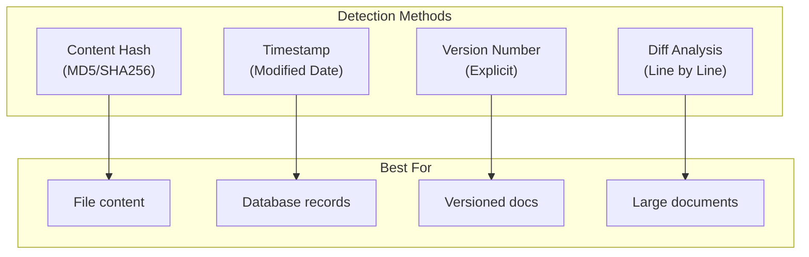

# Incremental Updates

## Introduction

Re-indexing your entire document corpus every time something changes is wasteful. A 1% change in documents shouldn't require regenerating 100% of embeddings. Incremental updates detect what changed and re-embed only the affected content.

This lesson covers change detection strategies, selective re-embedding, efficient diff processing, and version tracking.

### What We'll Cover

- Change detection methods (hashing, timestamps)
- Content fingerprinting
- Selective re-embedding strategies
- Diff processing for modified documents
- Version tracking patterns
- Sync state management

### Prerequisites

- Understanding of embedding generation
- Familiarity with hashing concepts
- Basic database knowledge

---

## The Cost of Full Reindexing

Consider a documentation site with 10,000 pages:

| Scenario | Approach | Embeddings Generated | Cost (OpenAI) |
|----------|----------|---------------------|---------------|
| Daily full reindex | All pages | 10,000/day | ~$1/day |
| Incremental (1% change) | Only changed | 100/day | ~$0.01/day |
| Incremental (0.1% change) | Only changed | 10/day | ~$0.001/day |

> **🤖 AI Context:** At scale, incremental updates can reduce embedding costs by 90-99% compared to full reindexing.

---

## Change Detection Strategies



### Comparison Table

| Method | Accuracy | Speed | Overhead | Best For |
|--------|----------|-------|----------|----------|
| **Content Hash** | ✅ Exact | Fast | Low | Files, static content |
| **Timestamp** | ⚠️ Approximate | Very fast | None | DB records, APIs |
| **Version Number** | ✅ Exact | Very fast | Requires tracking | CMS, wikis |
| **Diff Analysis** | ✅ Exact | Slow | High | Large documents |

---

## Content Hashing

The most reliable method—if the content hasn't changed, the hash is identical:

```python
import hashlib
from dataclasses import dataclass
from pathlib import Path

@dataclass
class DocumentFingerprint:
    """Content fingerprint for change detection."""
    doc_id: str
    content_hash: str
    chunk_count: int
    last_processed: str

def compute_content_hash(content: str) -> str:
    """Compute SHA256 hash of content."""
    return hashlib.sha256(content.encode('utf-8')).hexdigest()

def compute_file_hash(file_path: str) -> str:
    """Compute hash of file contents efficiently."""
    sha256 = hashlib.sha256()
    
    with open(file_path, 'rb') as f:
        # Read in chunks for large files
        for chunk in iter(lambda: f.read(8192), b''):
            sha256.update(chunk)
    
    return sha256.hexdigest()

class ContentHashTracker:
    """Track document hashes for change detection."""
    
    def __init__(self, storage_path: str = "content_hashes.json"):
        self.storage_path = Path(storage_path)
        self.hashes: dict[str, DocumentFingerprint] = {}
        self._load()
    
    def _load(self):
        """Load stored hashes."""
        if self.storage_path.exists():
            import json
            data = json.loads(self.storage_path.read_text())
            self.hashes = {
                k: DocumentFingerprint(**v)
                for k, v in data.items()
            }
    
    def _save(self):
        """Persist hashes to disk."""
        import json
        from dataclasses import asdict
        data = {k: asdict(v) for k, v in self.hashes.items()}
        self.storage_path.write_text(json.dumps(data, indent=2))
    
    def has_changed(self, doc_id: str, content: str) -> bool:
        """Check if document content has changed."""
        new_hash = compute_content_hash(content)
        
        if doc_id not in self.hashes:
            return True  # New document
        
        return self.hashes[doc_id].content_hash != new_hash
    
    def update(
        self,
        doc_id: str,
        content: str,
        chunk_count: int
    ):
        """Update stored hash for document."""
        from datetime import datetime
        
        self.hashes[doc_id] = DocumentFingerprint(
            doc_id=doc_id,
            content_hash=compute_content_hash(content),
            chunk_count=chunk_count,
            last_processed=datetime.utcnow().isoformat()
        )
        self._save()
    
    def get_changed_documents(
        self,
        documents: list[dict]
    ) -> tuple[list[dict], list[dict], list[str]]:
        """
        Categorize documents by change status.
        
        Returns:
            (new_docs, modified_docs, deleted_ids)
        """
        current_ids = {doc["id"] for doc in documents}
        stored_ids = set(self.hashes.keys())
        
        new_docs = []
        modified_docs = []
        
        for doc in documents:
            if doc["id"] not in stored_ids:
                new_docs.append(doc)
            elif self.has_changed(doc["id"], doc["content"]):
                modified_docs.append(doc)
        
        deleted_ids = list(stored_ids - current_ids)
        
        return new_docs, modified_docs, deleted_ids

# Usage
tracker = ContentHashTracker()

documents = [
    {"id": "doc-1", "content": "Machine learning basics..."},
    {"id": "doc-2", "content": "Neural networks are..."},
]

new, modified, deleted = tracker.get_changed_documents(documents)
print(f"New: {len(new)}, Modified: {len(modified)}, Deleted: {len(deleted)}")
```

---

## Timestamp-Based Detection

Faster than hashing but less precise—relies on accurate modification timestamps:

```python
from datetime import datetime
from dataclasses import dataclass

@dataclass
class SyncState:
    """Track last sync time for timestamp-based detection."""
    last_sync: datetime
    document_timestamps: dict[str, datetime]

class TimestampTracker:
    """Change detection using modification timestamps."""
    
    def __init__(self):
        self.last_sync: datetime | None = None
        self.doc_timestamps: dict[str, datetime] = {}
    
    def get_changed_since_sync(
        self,
        documents: list[dict]  # [{"id": str, "modified_at": datetime, ...}]
    ) -> list[dict]:
        """Get documents modified since last sync."""
        if self.last_sync is None:
            return documents  # First sync, all are "new"
        
        changed = []
        for doc in documents:
            modified_at = doc["modified_at"]
            
            # New or modified since last sync
            if doc["id"] not in self.doc_timestamps:
                changed.append(doc)
            elif modified_at > self.doc_timestamps[doc["id"]]:
                changed.append(doc)
        
        return changed
    
    def mark_synced(self, documents: list[dict]):
        """Update sync state after processing."""
        self.last_sync = datetime.utcnow()
        
        for doc in documents:
            self.doc_timestamps[doc["id"]] = doc["modified_at"]
    
    def get_deleted(
        self,
        current_ids: set[str]
    ) -> list[str]:
        """Get IDs that no longer exist."""
        return [
            doc_id for doc_id in self.doc_timestamps
            if doc_id not in current_ids
        ]

# Usage with database
def sync_from_database(db_connection, tracker: TimestampTracker, embedder, index):
    """Sync documents from database using timestamps."""
    
    # Get all documents with timestamps
    documents = db_connection.query("""
        SELECT id, content, updated_at as modified_at
        FROM documents
        ORDER BY updated_at DESC
    """)
    
    # Find changed documents
    changed = tracker.get_changed_since_sync(documents)
    print(f"Found {len(changed)} changed documents")
    
    if changed:
        # Process changed documents
        texts = [doc["content"] for doc in changed]
        embeddings = embedder.embed(texts)
        
        vectors = [
            {"id": doc["id"], "values": emb}
            for doc, emb in zip(changed, embeddings)
        ]
        
        index.upsert(vectors=vectors)
        tracker.mark_synced(changed)
    
    # Handle deletions
    current_ids = {doc["id"] for doc in documents}
    deleted = tracker.get_deleted(current_ids)
    
    if deleted:
        index.delete(ids=deleted)
        for doc_id in deleted:
            del tracker.doc_timestamps[doc_id]
    
    return {"processed": len(changed), "deleted": len(deleted)}
```

---

## Chunk-Level Change Detection

For large documents, detect changes at the chunk level to minimize re-embedding:

```python
from dataclasses import dataclass, field

@dataclass
class ChunkFingerprint:
    """Track individual chunk hashes."""
    chunk_id: str
    content_hash: str
    position: int  # Position in document

@dataclass
class DocumentChunkState:
    """Track all chunks for a document."""
    doc_id: str
    chunk_fingerprints: list[ChunkFingerprint] = field(default_factory=list)

class ChunkLevelTracker:
    """Detect changes at the chunk level."""
    
    def __init__(self):
        self.doc_states: dict[str, DocumentChunkState] = {}
    
    def analyze_document(
        self,
        doc_id: str,
        new_chunks: list[str]
    ) -> tuple[list[int], list[int], list[str]]:
        """
        Analyze which chunks changed.
        
        Returns:
            (new_positions, modified_positions, deleted_chunk_ids)
        """
        new_fingerprints = [
            ChunkFingerprint(
                chunk_id=f"{doc_id}#chunk-{i}",
                content_hash=compute_content_hash(chunk),
                position=i
            )
            for i, chunk in enumerate(new_chunks)
        ]
        
        if doc_id not in self.doc_states:
            # All chunks are new
            return list(range(len(new_chunks))), [], []
        
        old_state = self.doc_states[doc_id]
        old_hashes = {fp.position: fp for fp in old_state.chunk_fingerprints}
        
        new_positions = []
        modified_positions = []
        
        for fp in new_fingerprints:
            if fp.position not in old_hashes:
                new_positions.append(fp.position)
            elif fp.content_hash != old_hashes[fp.position].content_hash:
                modified_positions.append(fp.position)
        
        # Find deleted chunks (position no longer exists)
        deleted_chunk_ids = [
            fp.chunk_id for fp in old_state.chunk_fingerprints
            if fp.position >= len(new_chunks)
        ]
        
        return new_positions, modified_positions, deleted_chunk_ids
    
    def update_state(self, doc_id: str, chunks: list[str]):
        """Update stored chunk state."""
        fingerprints = [
            ChunkFingerprint(
                chunk_id=f"{doc_id}#chunk-{i}",
                content_hash=compute_content_hash(chunk),
                position=i
            )
            for i, chunk in enumerate(chunks)
        ]
        
        self.doc_states[doc_id] = DocumentChunkState(
            doc_id=doc_id,
            chunk_fingerprints=fingerprints
        )

def process_document_incrementally(
    doc_id: str,
    content: str,
    chunker,
    embedder,
    index,
    tracker: ChunkLevelTracker
):
    """
    Process document with chunk-level incremental updates.
    
    Only re-embeds chunks that actually changed.
    """
    # Chunk the document
    chunks = chunker.chunk(content)
    
    # Detect changes
    new_pos, modified_pos, deleted_ids = tracker.analyze_document(doc_id, chunks)
    
    changed_positions = new_pos + modified_pos
    
    if changed_positions:
        # Only embed changed chunks
        changed_chunks = [chunks[i] for i in changed_positions]
        embeddings = embedder.embed(changed_chunks)
        
        # Upsert changed chunks
        vectors = [
            {
                "id": f"{doc_id}#chunk-{pos}",
                "values": emb,
                "metadata": {"doc_id": doc_id, "position": pos}
            }
            for pos, emb in zip(changed_positions, embeddings)
        ]
        
        index.upsert(vectors=vectors)
    
    if deleted_ids:
        index.delete(ids=deleted_ids)
    
    # Update state
    tracker.update_state(doc_id, chunks)
    
    return {
        "new_chunks": len(new_pos),
        "modified_chunks": len(modified_pos),
        "deleted_chunks": len(deleted_ids),
        "unchanged_chunks": len(chunks) - len(changed_positions)
    }
```

---

## Version Tracking

For systems with explicit versioning (CMS, wikis):

```python
from dataclasses import dataclass
from typing import Optional

@dataclass
class DocumentVersion:
    """Versioned document tracking."""
    doc_id: str
    version: int
    content_hash: str
    indexed_at: str

class VersionTracker:
    """Track document versions for change detection."""
    
    def __init__(self):
        self.versions: dict[str, DocumentVersion] = {}
    
    def needs_update(
        self,
        doc_id: str,
        version: int,
        content_hash: Optional[str] = None
    ) -> bool:
        """
        Check if document needs re-indexing.
        
        Uses version number primarily, content hash as fallback.
        """
        if doc_id not in self.versions:
            return True
        
        stored = self.versions[doc_id]
        
        # Version increased
        if version > stored.version:
            return True
        
        # Same version but content changed (shouldn't happen, but safety check)
        if content_hash and content_hash != stored.content_hash:
            return True
        
        return False
    
    def record_indexed(
        self,
        doc_id: str,
        version: int,
        content_hash: str
    ):
        """Record that a document version was indexed."""
        from datetime import datetime
        
        self.versions[doc_id] = DocumentVersion(
            doc_id=doc_id,
            version=version,
            content_hash=content_hash,
            indexed_at=datetime.utcnow().isoformat()
        )

# Usage with a CMS
def sync_from_cms(cms_client, version_tracker, embedder, index):
    """Sync documents from CMS using version tracking."""
    
    # Get all documents with versions
    documents = cms_client.list_documents(include_version=True)
    
    to_update = []
    
    for doc in documents:
        if version_tracker.needs_update(doc["id"], doc["version"]):
            to_update.append(doc)
    
    print(f"Updating {len(to_update)}/{len(documents)} documents")
    
    for doc in to_update:
        # Fetch full content
        content = cms_client.get_document_content(doc["id"])
        content_hash = compute_content_hash(content)
        
        # Generate embedding
        embedding = embedder.embed([content])[0]
        
        # Upsert
        index.upsert(vectors=[{
            "id": doc["id"],
            "values": embedding,
            "metadata": {"version": doc["version"]}
        }])
        
        # Record
        version_tracker.record_indexed(doc["id"], doc["version"], content_hash)
    
    return {"updated": len(to_update)}
```

---

## Sync State Management

Maintain sync state across runs:

```python
import json
from pathlib import Path
from dataclasses import dataclass, asdict
from datetime import datetime
from typing import Optional

@dataclass
class SyncState:
    """Complete sync state for incremental updates."""
    sync_id: str
    source_name: str
    last_sync_at: Optional[str] = None
    document_hashes: dict = None  # doc_id -> content_hash
    document_versions: dict = None  # doc_id -> version
    total_indexed: int = 0
    
    def __post_init__(self):
        if self.document_hashes is None:
            self.document_hashes = {}
        if self.document_versions is None:
            self.document_versions = {}

class SyncStateManager:
    """Manage sync state persistence."""
    
    def __init__(self, state_dir: str = "./sync_state"):
        self.state_dir = Path(state_dir)
        self.state_dir.mkdir(exist_ok=True)
    
    def _state_path(self, sync_id: str) -> Path:
        return self.state_dir / f"{sync_id}.json"
    
    def load(self, sync_id: str, source_name: str) -> SyncState:
        """Load or create sync state."""
        path = self._state_path(sync_id)
        
        if path.exists():
            data = json.loads(path.read_text())
            return SyncState(**data)
        
        return SyncState(sync_id=sync_id, source_name=source_name)
    
    def save(self, state: SyncState):
        """Persist sync state."""
        state.last_sync_at = datetime.utcnow().isoformat()
        path = self._state_path(state.sync_id)
        path.write_text(json.dumps(asdict(state), indent=2))
    
    def get_changes(
        self,
        state: SyncState,
        documents: list[dict]
    ) -> dict:
        """
        Analyze documents for changes.
        
        Returns:
            {
                "new": [...],
                "modified": [...],
                "unchanged": [...],
                "deleted_ids": [...]
            }
        """
        current_ids = set()
        new_docs = []
        modified_docs = []
        unchanged_docs = []
        
        for doc in documents:
            doc_id = doc["id"]
            current_ids.add(doc_id)
            
            # Compute current hash
            content_hash = compute_content_hash(doc["content"])
            
            if doc_id not in state.document_hashes:
                new_docs.append(doc)
            elif state.document_hashes[doc_id] != content_hash:
                modified_docs.append(doc)
            else:
                unchanged_docs.append(doc)
        
        # Find deletions
        stored_ids = set(state.document_hashes.keys())
        deleted_ids = list(stored_ids - current_ids)
        
        return {
            "new": new_docs,
            "modified": modified_docs,
            "unchanged": unchanged_docs,
            "deleted_ids": deleted_ids
        }
    
    def update_after_sync(
        self,
        state: SyncState,
        processed_docs: list[dict],
        deleted_ids: list[str]
    ):
        """Update state after sync completes."""
        for doc in processed_docs:
            content_hash = compute_content_hash(doc["content"])
            state.document_hashes[doc["id"]] = content_hash
            state.total_indexed += 1
        
        for doc_id in deleted_ids:
            state.document_hashes.pop(doc_id, None)
        
        self.save(state)

# Full incremental sync example
def incremental_sync(
    source_name: str,
    documents: list[dict],
    embedder,
    index,
    state_manager: SyncStateManager
) -> dict:
    """
    Perform incremental sync with full state management.
    """
    sync_id = f"sync-{source_name}"
    state = state_manager.load(sync_id, source_name)
    
    # Analyze changes
    changes = state_manager.get_changes(state, documents)
    
    print(f"Changes: {len(changes['new'])} new, {len(changes['modified'])} modified, "
          f"{len(changes['deleted_ids'])} deleted, {len(changes['unchanged'])} unchanged")
    
    # Process new and modified
    to_process = changes["new"] + changes["modified"]
    
    if to_process:
        texts = [doc["content"] for doc in to_process]
        embeddings = embedder.embed(texts)
        
        vectors = [
            {"id": doc["id"], "values": emb, "metadata": doc.get("metadata", {})}
            for doc, emb in zip(to_process, embeddings)
        ]
        
        index.upsert(vectors=vectors)
    
    # Handle deletions
    if changes["deleted_ids"]:
        index.delete(ids=changes["deleted_ids"])
    
    # Update state
    state_manager.update_after_sync(state, to_process, changes["deleted_ids"])
    
    return {
        "new": len(changes["new"]),
        "modified": len(changes["modified"]),
        "deleted": len(changes["deleted_ids"]),
        "unchanged": len(changes["unchanged"])
    }
```

---

## Hands-on Exercise

### Your Task

Build a content-hash based incremental sync system that:
1. Detects new, modified, and deleted documents
2. Only processes changed documents
3. Persists state between runs
4. Reports sync statistics

### Requirements

```python
class IncrementalSyncer:
    def sync(
        self,
        documents: list[dict],  # [{"id": str, "content": str}]
        process_fn: Callable[[list[dict]], None]
    ) -> dict:
        """
        Returns: {"new": int, "modified": int, "deleted": int, "unchanged": int}
        """
        pass
```

<details>
<summary>💡 Hints</summary>

- Use SHA256 for content hashing
- Store hashes in a JSON file
- Compare current vs stored hashes
- Track IDs to detect deletions

</details>

<details>
<summary>✅ Solution</summary>

```python
import hashlib
import json
from pathlib import Path
from typing import Callable

class IncrementalSyncer:
    def __init__(self, state_file: str = "sync_state.json"):
        self.state_file = Path(state_file)
        self.hashes: dict[str, str] = {}
        self._load_state()
    
    def _load_state(self):
        if self.state_file.exists():
            self.hashes = json.loads(self.state_file.read_text())
    
    def _save_state(self):
        self.state_file.write_text(json.dumps(self.hashes, indent=2))
    
    def _hash_content(self, content: str) -> str:
        return hashlib.sha256(content.encode()).hexdigest()
    
    def sync(
        self,
        documents: list[dict],
        process_fn: Callable[[list[dict]], None]
    ) -> dict:
        current_ids = set()
        new_docs = []
        modified_docs = []
        unchanged = 0
        
        for doc in documents:
            doc_id = doc["id"]
            current_ids.add(doc_id)
            content_hash = self._hash_content(doc["content"])
            
            if doc_id not in self.hashes:
                new_docs.append(doc)
            elif self.hashes[doc_id] != content_hash:
                modified_docs.append(doc)
            else:
                unchanged += 1
        
        # Find deletions
        deleted_ids = [
            doc_id for doc_id in self.hashes
            if doc_id not in current_ids
        ]
        
        # Process changes
        to_process = new_docs + modified_docs
        if to_process:
            process_fn(to_process)
        
        # Update hashes
        for doc in to_process:
            self.hashes[doc["id"]] = self._hash_content(doc["content"])
        
        for doc_id in deleted_ids:
            del self.hashes[doc_id]
        
        self._save_state()
        
        return {
            "new": len(new_docs),
            "modified": len(modified_docs),
            "deleted": len(deleted_ids),
            "unchanged": unchanged
        }

# Test
def mock_process(docs):
    print(f"Processing {len(docs)} documents")

syncer = IncrementalSyncer()

# First sync
docs_v1 = [
    {"id": "1", "content": "Hello world"},
    {"id": "2", "content": "Goodbye world"},
]
result1 = syncer.sync(docs_v1, mock_process)
print(f"First sync: {result1}")

# Second sync with changes
docs_v2 = [
    {"id": "1", "content": "Hello world"},  # Unchanged
    {"id": "2", "content": "Goodbye universe"},  # Modified
    {"id": "3", "content": "New document"},  # New
]
result2 = syncer.sync(docs_v2, mock_process)
print(f"Second sync: {result2}")
```

</details>

---

## Summary

Incremental updates dramatically reduce indexing costs:

✅ **Content hashing** — Reliable change detection with SHA256
✅ **Timestamp tracking** — Fast detection for database records
✅ **Chunk-level detection** — Minimize re-embedding for large docs
✅ **Version tracking** — Perfect for versioned CMS content
✅ **State persistence** — Resume across runs
✅ **Deletion handling** — Keep index in sync with source

**Next:** [Document Updates and Deletions](./04-document-updates-deletions.md)

---

## Further Reading

- [Pinecone Update Operations](https://docs.pinecone.io/guides/manage-data/update-data) - Vector database updates
- [Content Addressable Storage](https://en.wikipedia.org/wiki/Content-addressable_storage) - Hash-based storage concepts
- [Incremental Computing](https://en.wikipedia.org/wiki/Incremental_computing) - Theory behind incremental updates

<!--
Sources Consulted:
- Content hashing best practices
- Pinecone update/delete documentation
- Incremental sync patterns from production systems
-->
