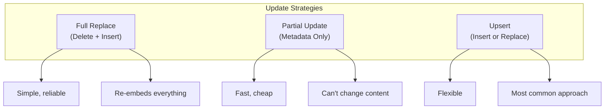
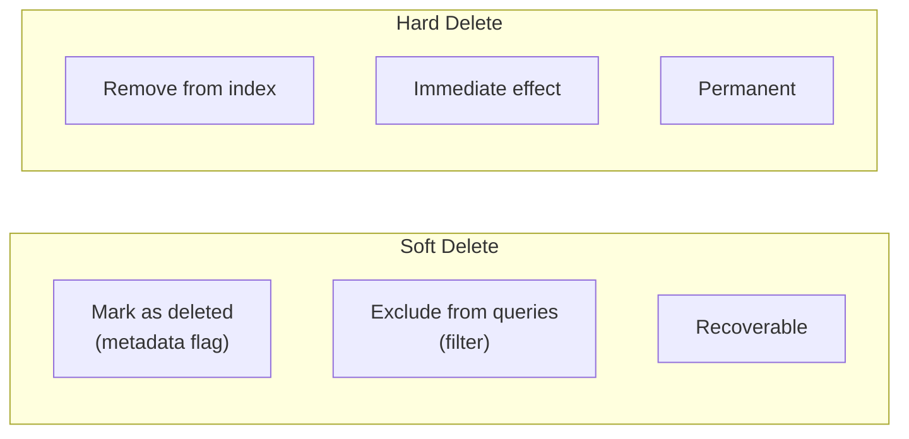

# Document Updates and Deletions

## Introduction

Documents change. Users edit content, fix errors, and update information. Some documents get deprecated and need removal. Your RAG system must handle these operations efficiently while maintaining index integrity.

This lesson covers update strategies, deletion patterns, cascade handling, and keeping your vector index in sync with source documents.

### What We'll Cover

- Update strategies (replace vs partial update)
- Pinecone update and delete operations
- Soft delete vs hard delete patterns
- Cascade deletions for chunked documents
- Orphan detection and cleanup
- Consistency guarantees

### Prerequisites

- Understanding of vector database operations
- Familiarity with document chunking
- Basic knowledge of incremental updates

---

## Update Strategies Overview



### Strategy Comparison

| Strategy | When to Use | Cost | Complexity |
|----------|-------------|------|------------|
| **Full Replace** | Content changed | High (re-embed) | Low |
| **Partial Update** | Metadata only changed | None | Low |
| **Upsert** | Unknown if exists | Medium | Low |
| **In-place Update** | Modify existing | Low | Medium |

---

## Pinecone Update Operations

### Update by ID (Single Record)

Update metadata or values for a specific vector:

```python
from pinecone import Pinecone

pc = Pinecone(api_key="your-api-key")
index = pc.Index("documents")

# Update values (embedding) and metadata
index.update(
    id="doc-123",
    values=[0.1, 0.2, 0.3, ...],  # New embedding
    set_metadata={"status": "reviewed", "updated_at": "2025-01-15"}
)

# Update metadata only (no re-embedding needed)
index.update(
    id="doc-123",
    set_metadata={"status": "approved"}
)
```

### Update by Metadata Filter (Bulk)

> **Warning:** Pinecone doesn't support bulk updates by filter. You must query first, then update each.

```python
def bulk_update_metadata(
    index,
    filter_dict: dict,
    new_metadata: dict,
    namespace: str = ""
):
    """
    Update metadata for all vectors matching filter.
    
    Note: Must query first, then update individually.
    """
    # Query to find matching IDs
    results = index.query(
        vector=[0.0] * 1536,  # Dummy vector
        filter=filter_dict,
        top_k=10000,
        include_metadata=True,
        namespace=namespace
    )
    
    updated_count = 0
    
    for match in results.matches:
        # Merge new metadata with existing
        merged = {**match.metadata, **new_metadata}
        
        index.update(
            id=match.id,
            set_metadata=merged,
            namespace=namespace
        )
        updated_count += 1
    
    return updated_count

# Usage: Mark all "draft" documents as "published"
count = bulk_update_metadata(
    index,
    filter_dict={"status": {"$eq": "draft"}},
    new_metadata={"status": "published", "published_at": "2025-01-15"}
)
print(f"Updated {count} documents")
```

---

## Upsert Pattern

The most common approach—insert if new, replace if exists:

```python
def upsert_document(
    doc_id: str,
    content: str,
    metadata: dict,
    embedder,
    index,
    namespace: str = ""
):
    """
    Upsert a single document.
    
    Creates new vector if ID doesn't exist,
    replaces existing vector if ID exists.
    """
    # Generate embedding
    embedding = embedder.embed([content])[0]
    
    # Upsert (insert or replace)
    index.upsert(
        vectors=[{
            "id": doc_id,
            "values": embedding,
            "metadata": metadata
        }],
        namespace=namespace
    )
    
    return {"id": doc_id, "status": "upserted"}

def batch_upsert_documents(
    documents: list[dict],
    embedder,
    index,
    batch_size: int = 100,
    namespace: str = ""
):
    """
    Batch upsert multiple documents.
    """
    from datetime import datetime
    
    texts = [doc["content"] for doc in documents]
    embeddings = embedder.embed(texts)
    
    vectors = []
    for doc, embedding in zip(documents, embeddings):
        vectors.append({
            "id": doc["id"],
            "values": embedding,
            "metadata": {
                **doc.get("metadata", {}),
                "updated_at": datetime.utcnow().isoformat()
            }
        })
    
    # Batch upsert
    for i in range(0, len(vectors), batch_size):
        batch = vectors[i:i + batch_size]
        index.upsert(vectors=batch, namespace=namespace)
    
    return {"upserted": len(vectors)}
```

---

## Deletion Patterns

### Delete by ID

```python
# Delete single vector
index.delete(ids=["doc-123"], namespace="")

# Delete multiple vectors (max 1000 per call)
index.delete(ids=["doc-1", "doc-2", "doc-3"], namespace="")

# Delete all vectors in namespace
index.delete(delete_all=True, namespace="user-123")
```

### Delete by Metadata Filter

```python
# Delete by filter (Pinecone Serverless/Starter)
index.delete(
    filter={"status": {"$eq": "deprecated"}},
    namespace=""
)

# Delete all documents from a source
index.delete(
    filter={"source": {"$eq": "old-system"}},
    namespace=""
)
```

---

## Soft Delete vs Hard Delete



### Soft Delete Implementation

```python
from dataclasses import dataclass
from datetime import datetime
from typing import Optional

@dataclass
class DeletionRecord:
    """Track soft-deleted documents."""
    doc_id: str
    deleted_at: str
    deleted_by: Optional[str] = None
    reason: Optional[str] = None

class SoftDeleteManager:
    """Manage soft deletions with metadata flags."""
    
    def __init__(self, index, namespace: str = ""):
        self.index = index
        self.namespace = namespace
    
    def soft_delete(
        self,
        doc_id: str,
        deleted_by: str = None,
        reason: str = None
    ):
        """
        Mark document as deleted without removing from index.
        """
        self.index.update(
            id=doc_id,
            set_metadata={
                "deleted": True,
                "deleted_at": datetime.utcnow().isoformat(),
                "deleted_by": deleted_by,
                "deletion_reason": reason
            },
            namespace=self.namespace
        )
        
        return DeletionRecord(
            doc_id=doc_id,
            deleted_at=datetime.utcnow().isoformat(),
            deleted_by=deleted_by,
            reason=reason
        )
    
    def restore(self, doc_id: str):
        """Restore a soft-deleted document."""
        self.index.update(
            id=doc_id,
            set_metadata={
                "deleted": False,
                "restored_at": datetime.utcnow().isoformat()
            },
            namespace=self.namespace
        )
    
    def hard_delete(self, doc_id: str):
        """Permanently remove document from index."""
        self.index.delete(ids=[doc_id], namespace=self.namespace)
    
    def purge_deleted(self, older_than_days: int = 30):
        """
        Permanently delete documents that were soft-deleted
        more than N days ago.
        """
        from datetime import timedelta
        
        cutoff = datetime.utcnow() - timedelta(days=older_than_days)
        
        # Find old soft-deleted documents
        results = self.index.query(
            vector=[0.0] * 1536,  # Dummy vector
            filter={
                "deleted": {"$eq": True},
                "deleted_at": {"$lt": cutoff.isoformat()}
            },
            top_k=10000,
            namespace=self.namespace
        )
        
        if results.matches:
            ids = [m.id for m in results.matches]
            self.index.delete(ids=ids, namespace=self.namespace)
            return len(ids)
        
        return 0

# Query excluding soft-deleted
def query_active_documents(
    index,
    query_embedding: list[float],
    top_k: int = 10,
    namespace: str = ""
):
    """Query only non-deleted documents."""
    return index.query(
        vector=query_embedding,
        top_k=top_k,
        filter={"deleted": {"$ne": True}},  # Exclude deleted
        include_metadata=True,
        namespace=namespace
    )
```

---

## Cascade Deletions

When a document is chunked into multiple vectors, deleting the source document must delete all chunks:

```python
from typing import Optional

class ChunkedDocumentManager:
    """
    Manage documents that are split into chunks.
    
    Chunk IDs follow pattern: {doc_id}#chunk-{n}
    """
    
    def __init__(self, index, namespace: str = ""):
        self.index = index
        self.namespace = namespace
    
    def delete_document(self, doc_id: str) -> int:
        """
        Delete a document and all its chunks.
        
        Returns number of vectors deleted.
        """
        # Find all chunks for this document
        results = self.index.query(
            vector=[0.0] * 1536,  # Dummy
            filter={"doc_id": {"$eq": doc_id}},
            top_k=10000,
            namespace=self.namespace
        )
        
        if not results.matches:
            return 0
        
        chunk_ids = [m.id for m in results.matches]
        
        # Delete in batches of 1000
        deleted = 0
        for i in range(0, len(chunk_ids), 1000):
            batch = chunk_ids[i:i + 1000]
            self.index.delete(ids=batch, namespace=self.namespace)
            deleted += len(batch)
        
        return deleted
    
    def delete_documents_by_filter(
        self,
        filter_dict: dict
    ) -> dict:
        """
        Delete all documents matching filter.
        
        Filter applies to document-level metadata.
        """
        # Find matching documents
        results = self.index.query(
            vector=[0.0] * 1536,
            filter=filter_dict,
            top_k=10000,
            namespace=self.namespace
        )
        
        if not results.matches:
            return {"documents": 0, "chunks": 0}
        
        # Get unique doc_ids
        doc_ids = set()
        for match in results.matches:
            if "doc_id" in match.metadata:
                doc_ids.add(match.metadata["doc_id"])
        
        # Delete each document's chunks
        total_chunks = 0
        for doc_id in doc_ids:
            total_chunks += self.delete_document(doc_id)
        
        return {"documents": len(doc_ids), "chunks": total_chunks}
    
    def update_document(
        self,
        doc_id: str,
        new_content: str,
        chunker,
        embedder,
        metadata: Optional[dict] = None
    ) -> dict:
        """
        Update document: delete old chunks, insert new ones.
        """
        # Delete old chunks
        deleted = self.delete_document(doc_id)
        
        # Chunk new content
        chunks = chunker.chunk(new_content)
        
        # Generate embeddings
        embeddings = embedder.embed(chunks)
        
        # Create new chunk vectors
        from datetime import datetime
        
        base_metadata = metadata or {}
        vectors = []
        
        for i, (chunk, embedding) in enumerate(zip(chunks, embeddings)):
            vectors.append({
                "id": f"{doc_id}#chunk-{i}",
                "values": embedding,
                "metadata": {
                    **base_metadata,
                    "doc_id": doc_id,
                    "chunk_index": i,
                    "chunk_text": chunk[:1000],  # Truncate for metadata
                    "updated_at": datetime.utcnow().isoformat()
                }
            })
        
        # Upsert new chunks
        self.index.upsert(vectors=vectors, namespace=self.namespace)
        
        return {
            "doc_id": doc_id,
            "chunks_deleted": deleted,
            "chunks_created": len(vectors)
        }
```

---

## Orphan Detection and Cleanup

Find and remove vectors that no longer correspond to source documents:

```python
class OrphanDetector:
    """Detect and clean up orphaned vectors."""
    
    def __init__(self, index, namespace: str = ""):
        self.index = index
        self.namespace = namespace
    
    def find_orphans(
        self,
        valid_doc_ids: set[str]
    ) -> list[str]:
        """
        Find vector IDs that don't belong to valid documents.
        
        Args:
            valid_doc_ids: Set of currently valid document IDs
            
        Returns:
            List of orphaned vector IDs
        """
        # Fetch all vectors (paginate if needed)
        all_vectors = self._fetch_all_vectors()
        
        orphans = []
        for vector in all_vectors:
            doc_id = vector.metadata.get("doc_id")
            
            if doc_id and doc_id not in valid_doc_ids:
                orphans.append(vector.id)
        
        return orphans
    
    def _fetch_all_vectors(self):
        """
        Fetch all vectors from index.
        
        Note: For large indexes, use pagination or sampling.
        """
        # Use a zero vector to get all results
        results = self.index.query(
            vector=[0.0] * 1536,
            top_k=10000,
            include_metadata=True,
            namespace=self.namespace
        )
        return results.matches
    
    def cleanup_orphans(
        self,
        valid_doc_ids: set[str],
        dry_run: bool = True
    ) -> dict:
        """
        Remove orphaned vectors.
        
        Args:
            valid_doc_ids: Set of currently valid document IDs
            dry_run: If True, only report orphans without deleting
            
        Returns:
            {"orphans_found": int, "deleted": int}
        """
        orphans = self.find_orphans(valid_doc_ids)
        
        result = {
            "orphans_found": len(orphans),
            "deleted": 0
        }
        
        if not dry_run and orphans:
            # Delete in batches
            for i in range(0, len(orphans), 1000):
                batch = orphans[i:i + 1000]
                self.index.delete(ids=batch, namespace=self.namespace)
                result["deleted"] += len(batch)
        
        return result

# Scheduled cleanup job
def run_orphan_cleanup(
    index,
    get_valid_docs_fn,  # Function to get valid doc IDs from source
    namespace: str = "",
    dry_run: bool = False
):
    """
    Run orphan cleanup as a scheduled job.
    """
    detector = OrphanDetector(index, namespace)
    
    # Get valid document IDs from source of truth
    valid_ids = get_valid_docs_fn()
    
    result = detector.cleanup_orphans(valid_ids, dry_run=dry_run)
    
    print(f"Orphan cleanup: Found {result['orphans_found']}, "
          f"Deleted {result['deleted']}")
    
    return result
```

---

## Consistency Patterns

Ensure index stays in sync with source:

```python
from dataclasses import dataclass
from datetime import datetime
from enum import Enum
from typing import Optional

class SyncStatus(Enum):
    SYNCED = "synced"
    PENDING = "pending"
    FAILED = "failed"

@dataclass
class DocumentSyncRecord:
    """Track sync status for each document."""
    doc_id: str
    source_version: str
    index_version: Optional[str]
    status: SyncStatus
    last_attempt: str
    error: Optional[str] = None

class ConsistencyManager:
    """Ensure source and index consistency."""
    
    def __init__(self, source, index, storage):
        self.source = source  # Source of truth (database, CMS, etc.)
        self.index = index
        self.storage = storage  # Where to store sync records
    
    def check_consistency(self) -> dict:
        """
        Compare source documents with index vectors.
        
        Returns discrepancies.
        """
        source_docs = self.source.list_all()
        
        missing_in_index = []
        outdated_in_index = []
        orphaned_in_index = []
        
        source_ids = set()
        
        for doc in source_docs:
            source_ids.add(doc["id"])
            
            # Check if exists in index
            vector = self.index.fetch(ids=[doc["id"]])
            
            if doc["id"] not in vector.vectors:
                missing_in_index.append(doc["id"])
            else:
                # Check if version matches
                indexed_version = vector.vectors[doc["id"]].metadata.get("version")
                if indexed_version != doc.get("version"):
                    outdated_in_index.append(doc["id"])
        
        # Check for orphans
        all_indexed = self._get_all_indexed_ids()
        for indexed_id in all_indexed:
            if indexed_id not in source_ids:
                orphaned_in_index.append(indexed_id)
        
        return {
            "missing": missing_in_index,
            "outdated": outdated_in_index,
            "orphaned": orphaned_in_index,
            "is_consistent": len(missing_in_index) + len(outdated_in_index) + len(orphaned_in_index) == 0
        }
    
    def repair(self, discrepancies: dict, embedder):
        """Repair consistency issues."""
        repaired = {"added": 0, "updated": 0, "deleted": 0}
        
        # Add missing documents
        for doc_id in discrepancies["missing"]:
            doc = self.source.get(doc_id)
            embedding = embedder.embed([doc["content"]])[0]
            
            self.index.upsert(vectors=[{
                "id": doc_id,
                "values": embedding,
                "metadata": doc.get("metadata", {})
            }])
            repaired["added"] += 1
        
        # Update outdated
        for doc_id in discrepancies["outdated"]:
            doc = self.source.get(doc_id)
            embedding = embedder.embed([doc["content"]])[0]
            
            self.index.update(
                id=doc_id,
                values=embedding,
                set_metadata=doc.get("metadata", {})
            )
            repaired["updated"] += 1
        
        # Remove orphans
        if discrepancies["orphaned"]:
            self.index.delete(ids=discrepancies["orphaned"])
            repaired["deleted"] = len(discrepancies["orphaned"])
        
        return repaired
    
    def _get_all_indexed_ids(self) -> set[str]:
        """Get all IDs from index."""
        results = self.index.query(
            vector=[0.0] * 1536,
            top_k=10000
        )
        return {m.id for m in results.matches}
```

---

## Hands-on Exercise

### Your Task

Build a `DocumentSyncManager` that:
1. Supports upsert, soft delete, and hard delete
2. Handles cascade deletion for chunked documents
3. Tracks deletion history
4. Supports restore from soft delete

### Requirements

```python
class DocumentSyncManager:
    def upsert(self, doc_id: str, chunks: list[str], metadata: dict) -> dict:
        """Upsert document chunks."""
        pass
    
    def soft_delete(self, doc_id: str, reason: str) -> dict:
        """Mark document as deleted."""
        pass
    
    def restore(self, doc_id: str) -> dict:
        """Restore soft-deleted document."""
        pass
    
    def hard_delete(self, doc_id: str) -> dict:
        """Permanently delete document."""
        pass
    
    def list_deleted(self) -> list[dict]:
        """List all soft-deleted documents."""
        pass
```

<details>
<summary>💡 Hints</summary>

- Track doc_id in chunk metadata for cascade delete
- Store deletion records in a separate structure
- Use metadata flags for soft delete
- Remember to delete all chunks when hard deleting

</details>

<details>
<summary>✅ Solution</summary>

```python
from datetime import datetime
from dataclasses import dataclass, asdict
from typing import Optional

@dataclass
class DeletionRecord:
    doc_id: str
    deleted_at: str
    reason: str
    chunk_count: int

class DocumentSyncManager:
    def __init__(self, index, embedder, namespace: str = ""):
        self.index = index
        self.embedder = embedder
        self.namespace = namespace
        self.deletion_history: dict[str, DeletionRecord] = {}
    
    def upsert(
        self,
        doc_id: str,
        chunks: list[str],
        metadata: dict
    ) -> dict:
        """Upsert document chunks."""
        # Delete old chunks first
        self._delete_chunks(doc_id)
        
        # Generate embeddings
        embeddings = self.embedder.embed(chunks)
        
        # Create vectors
        vectors = []
        for i, (chunk, emb) in enumerate(zip(chunks, embeddings)):
            vectors.append({
                "id": f"{doc_id}#chunk-{i}",
                "values": emb,
                "metadata": {
                    **metadata,
                    "doc_id": doc_id,
                    "chunk_index": i,
                    "deleted": False
                }
            })
        
        self.index.upsert(vectors=vectors, namespace=self.namespace)
        
        # Remove from deletion history if restoring
        self.deletion_history.pop(doc_id, None)
        
        return {"doc_id": doc_id, "chunks": len(chunks)}
    
    def soft_delete(self, doc_id: str, reason: str) -> dict:
        """Mark document as deleted."""
        # Find all chunks
        results = self.index.query(
            vector=[0.0] * 1536,
            filter={"doc_id": {"$eq": doc_id}},
            top_k=10000,
            namespace=self.namespace
        )
        
        if not results.matches:
            return {"error": "Document not found"}
        
        # Mark each chunk as deleted
        for match in results.matches:
            self.index.update(
                id=match.id,
                set_metadata={
                    "deleted": True,
                    "deleted_at": datetime.utcnow().isoformat(),
                    "deletion_reason": reason
                },
                namespace=self.namespace
            )
        
        # Record deletion
        self.deletion_history[doc_id] = DeletionRecord(
            doc_id=doc_id,
            deleted_at=datetime.utcnow().isoformat(),
            reason=reason,
            chunk_count=len(results.matches)
        )
        
        return {
            "doc_id": doc_id,
            "chunks_marked": len(results.matches)
        }
    
    def restore(self, doc_id: str) -> dict:
        """Restore soft-deleted document."""
        if doc_id not in self.deletion_history:
            return {"error": "Document not in deletion history"}
        
        # Find all chunks
        results = self.index.query(
            vector=[0.0] * 1536,
            filter={"doc_id": {"$eq": doc_id}},
            top_k=10000,
            namespace=self.namespace
        )
        
        # Restore each chunk
        for match in results.matches:
            self.index.update(
                id=match.id,
                set_metadata={
                    "deleted": False,
                    "restored_at": datetime.utcnow().isoformat()
                },
                namespace=self.namespace
            )
        
        del self.deletion_history[doc_id]
        
        return {
            "doc_id": doc_id,
            "chunks_restored": len(results.matches)
        }
    
    def hard_delete(self, doc_id: str) -> dict:
        """Permanently delete document."""
        deleted = self._delete_chunks(doc_id)
        self.deletion_history.pop(doc_id, None)
        
        return {"doc_id": doc_id, "chunks_deleted": deleted}
    
    def _delete_chunks(self, doc_id: str) -> int:
        """Delete all chunks for a document."""
        results = self.index.query(
            vector=[0.0] * 1536,
            filter={"doc_id": {"$eq": doc_id}},
            top_k=10000,
            namespace=self.namespace
        )
        
        if results.matches:
            ids = [m.id for m in results.matches]
            self.index.delete(ids=ids, namespace=self.namespace)
            return len(ids)
        return 0
    
    def list_deleted(self) -> list[dict]:
        """List all soft-deleted documents."""
        return [asdict(r) for r in self.deletion_history.values()]
```

</details>

---

## Summary

Effective update and deletion handling maintains index integrity:

✅ **Upsert pattern** — Insert or replace in one operation
✅ **Soft delete** — Recoverable with metadata flags
✅ **Hard delete** — Permanent removal from index
✅ **Cascade deletion** — Delete all chunks for a document
✅ **Orphan cleanup** — Remove stale vectors
✅ **Consistency checks** — Verify source and index match

**Next:** [Index Organization](./05-index-organization.md)

---

## Further Reading

- [Pinecone Update Data](https://docs.pinecone.io/guides/manage-data/update-data) - Official update documentation
- [Pinecone Delete Data](https://docs.pinecone.io/guides/manage-data/delete-data) - Official delete documentation
- [Event Sourcing Pattern](https://martinfowler.com/eaaDev/EventSourcing.html) - Related pattern for audit trails

<!--
Sources Consulted:
- Pinecone update/delete documentation: https://docs.pinecone.io/guides/manage-data/
- Soft delete patterns from production systems
- Cascade deletion patterns from chunked document architectures
-->
