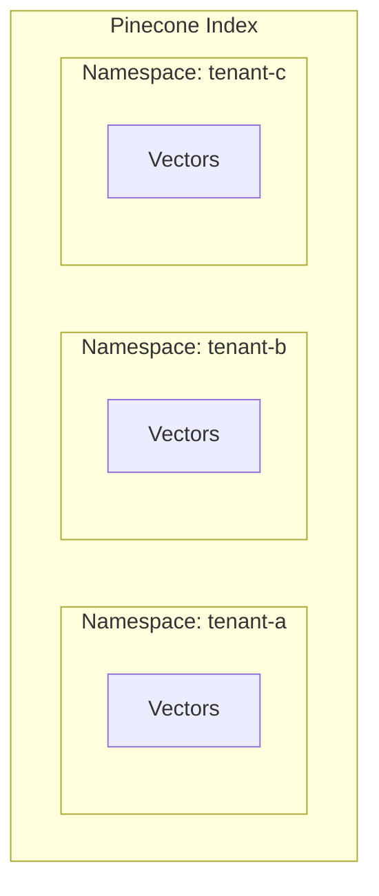

# Index Organization

## Introduction

As your RAG system scales, organizing vectors becomes critical. How do you keep different users' data separate? How do you query across multiple document sources efficiently? How do you implement access control?

This lesson covers namespaces, multitenancy patterns, collection strategies, and access control for vector indexes.

### What We'll Cover

- Namespace-based isolation
- Multitenancy patterns
- Collection vs namespace strategies
- Cross-source queries
- Access control patterns
- Metadata-based filtering

### Prerequisites

- Understanding of vector database operations
- Familiarity with multi-tenant applications
- Basic security concepts

---

## Namespace Fundamentals

Namespaces partition vectors within an index for logical separation:



### Key Properties

| Property | Behavior |
|----------|----------|
| **Isolation** | Queries only search within specified namespace |
| **Naming** | Any string (recommended: use tenant/user IDs) |
| **Limits** | Unlimited namespaces per index |
| **Default** | Empty string `""` if not specified |
| **Deletion** | Can delete all vectors in a namespace at once |

### Basic Namespace Operations

```python
from pinecone import Pinecone

pc = Pinecone(api_key="your-api-key")
index = pc.Index("documents")

# Upsert to specific namespace
index.upsert(
    vectors=[
        {"id": "doc-1", "values": [...], "metadata": {"title": "Guide"}}
    ],
    namespace="tenant-123"
)

# Query within namespace
results = index.query(
    vector=[...],
    top_k=10,
    namespace="tenant-123",
    include_metadata=True
)

# Delete all vectors in namespace
index.delete(delete_all=True, namespace="tenant-123")

# List all namespaces (via describe_index_stats)
stats = index.describe_index_stats()
for ns_name, ns_stats in stats.namespaces.items():
    print(f"{ns_name}: {ns_stats.vector_count} vectors")
```

---

## Multitenancy Patterns

### Pattern 1: One Namespace Per Tenant

The most common approach—each tenant's data in a separate namespace:

```python
class TenantNamespaceManager:
    """
    Manage tenant data using namespaces.
    
    Each tenant gets their own namespace for complete isolation.
    """
    
    def __init__(self, index):
        self.index = index
    
    def _namespace(self, tenant_id: str) -> str:
        """Generate namespace name for tenant."""
        return f"tenant-{tenant_id}"
    
    def index_document(
        self,
        tenant_id: str,
        doc_id: str,
        embedding: list[float],
        metadata: dict
    ):
        """Index document for specific tenant."""
        self.index.upsert(
            vectors=[{
                "id": doc_id,
                "values": embedding,
                "metadata": {**metadata, "tenant_id": tenant_id}
            }],
            namespace=self._namespace(tenant_id)
        )
    
    def query(
        self,
        tenant_id: str,
        query_embedding: list[float],
        top_k: int = 10,
        filter_dict: dict = None
    ):
        """Query documents for specific tenant."""
        return self.index.query(
            vector=query_embedding,
            top_k=top_k,
            filter=filter_dict,
            include_metadata=True,
            namespace=self._namespace(tenant_id)
        )
    
    def delete_tenant_data(self, tenant_id: str):
        """Delete all data for a tenant."""
        self.index.delete(
            delete_all=True,
            namespace=self._namespace(tenant_id)
        )
    
    def get_tenant_stats(self, tenant_id: str) -> dict:
        """Get vector count for tenant."""
        stats = self.index.describe_index_stats()
        ns = self._namespace(tenant_id)
        
        if ns in stats.namespaces:
            return {"vector_count": stats.namespaces[ns].vector_count}
        return {"vector_count": 0}

# Usage
manager = TenantNamespaceManager(index)

# Index document for tenant
manager.index_document(
    tenant_id="acme-corp",
    doc_id="doc-1",
    embedding=[...],
    metadata={"title": "Q1 Report"}
)

# Query for tenant
results = manager.query(
    tenant_id="acme-corp",
    query_embedding=[...],
    top_k=5
)
```

### Pattern 2: Metadata-Based Tenant Filtering

All tenants in one namespace, filtered by metadata:

```python
class MetadataMultitenancy:
    """
    Multitenancy using metadata filtering.
    
    All tenants share one namespace, isolation via filters.
    """
    
    def __init__(self, index, namespace: str = ""):
        self.index = index
        self.namespace = namespace
    
    def index_document(
        self,
        tenant_id: str,
        doc_id: str,
        embedding: list[float],
        metadata: dict
    ):
        """Index with tenant_id in metadata."""
        self.index.upsert(
            vectors=[{
                "id": f"{tenant_id}:{doc_id}",  # Prefix ID to avoid collisions
                "values": embedding,
                "metadata": {
                    **metadata,
                    "tenant_id": tenant_id  # Filter key
                }
            }],
            namespace=self.namespace
        )
    
    def query(
        self,
        tenant_id: str,
        query_embedding: list[float],
        top_k: int = 10,
        additional_filter: dict = None
    ):
        """Query with tenant filter."""
        filter_dict = {"tenant_id": {"$eq": tenant_id}}
        
        if additional_filter:
            filter_dict = {"$and": [filter_dict, additional_filter]}
        
        return self.index.query(
            vector=query_embedding,
            top_k=top_k,
            filter=filter_dict,
            include_metadata=True,
            namespace=self.namespace
        )
    
    def delete_tenant_data(self, tenant_id: str):
        """Delete all data for tenant using filter."""
        self.index.delete(
            filter={"tenant_id": {"$eq": tenant_id}},
            namespace=self.namespace
        )
```

### Pattern Comparison

| Aspect | Namespace Per Tenant | Metadata Filtering |
|--------|---------------------|-------------------|
| **Isolation** | ✅ Physical separation | ⚠️ Logical (filter-based) |
| **Cross-tenant queries** | ❌ Not possible | ✅ Possible (if needed) |
| **Deletion** | ✅ Fast (delete namespace) | ⚠️ Slower (filter delete) |
| **Stats** | ✅ Per-tenant stats | ❌ Aggregate only |
| **Overhead** | Low | None |
| **Best for** | B2B SaaS, compliance | B2C, shared data |

---

## Hierarchical Organization

For complex access patterns, combine namespaces with metadata:

```python
from dataclasses import dataclass
from typing import Optional

@dataclass
class DocumentLocation:
    """Hierarchical document location."""
    organization: str
    workspace: str
    folder: Optional[str] = None

class HierarchicalIndexManager:
    """
    Organize documents hierarchically.
    
    Structure: Organization > Workspace > Folder > Document
    Namespace per organization, metadata for finer granularity.
    """
    
    def __init__(self, index):
        self.index = index
    
    def _namespace(self, org: str) -> str:
        return f"org-{org}"
    
    def index_document(
        self,
        location: DocumentLocation,
        doc_id: str,
        embedding: list[float],
        content_metadata: dict
    ):
        """Index document with hierarchical metadata."""
        self.index.upsert(
            vectors=[{
                "id": f"{location.workspace}:{doc_id}",
                "values": embedding,
                "metadata": {
                    **content_metadata,
                    "organization": location.organization,
                    "workspace": location.workspace,
                    "folder": location.folder or "root"
                }
            }],
            namespace=self._namespace(location.organization)
        )
    
    def query_workspace(
        self,
        org: str,
        workspace: str,
        query_embedding: list[float],
        top_k: int = 10
    ):
        """Query within a specific workspace."""
        return self.index.query(
            vector=query_embedding,
            top_k=top_k,
            filter={"workspace": {"$eq": workspace}},
            include_metadata=True,
            namespace=self._namespace(org)
        )
    
    def query_folder(
        self,
        org: str,
        workspace: str,
        folder: str,
        query_embedding: list[float],
        top_k: int = 10
    ):
        """Query within a specific folder."""
        return self.index.query(
            vector=query_embedding,
            top_k=top_k,
            filter={
                "$and": [
                    {"workspace": {"$eq": workspace}},
                    {"folder": {"$eq": folder}}
                ]
            },
            include_metadata=True,
            namespace=self._namespace(org)
        )
    
    def query_organization(
        self,
        org: str,
        query_embedding: list[float],
        top_k: int = 10
    ):
        """Query across all workspaces in organization."""
        return self.index.query(
            vector=query_embedding,
            top_k=top_k,
            include_metadata=True,
            namespace=self._namespace(org)
        )
```

---

## Multi-Source Integration

Query across documents from different sources:

```python
from enum import Enum
from typing import Optional

class DocumentSource(Enum):
    """Supported document sources."""
    CONFLUENCE = "confluence"
    NOTION = "notion"
    GOOGLE_DRIVE = "gdrive"
    SHAREPOINT = "sharepoint"
    GITHUB = "github"
    UPLOADED = "uploaded"

class MultiSourceManager:
    """
    Manage documents from multiple sources.
    
    Each source type stored with source metadata for filtering.
    """
    
    def __init__(self, index, namespace: str = ""):
        self.index = index
        self.namespace = namespace
    
    def index_document(
        self,
        source: DocumentSource,
        source_id: str,  # ID from the source system
        doc_id: str,
        embedding: list[float],
        metadata: dict
    ):
        """Index document from a specific source."""
        self.index.upsert(
            vectors=[{
                "id": f"{source.value}:{doc_id}",
                "values": embedding,
                "metadata": {
                    **metadata,
                    "source": source.value,
                    "source_id": source_id  # For back-reference
                }
            }],
            namespace=self.namespace
        )
    
    def query_all_sources(
        self,
        query_embedding: list[float],
        top_k: int = 10
    ):
        """Query across all sources."""
        return self.index.query(
            vector=query_embedding,
            top_k=top_k,
            include_metadata=True,
            namespace=self.namespace
        )
    
    def query_sources(
        self,
        sources: list[DocumentSource],
        query_embedding: list[float],
        top_k: int = 10
    ):
        """Query specific sources only."""
        source_values = [s.value for s in sources]
        
        return self.index.query(
            vector=query_embedding,
            top_k=top_k,
            filter={"source": {"$in": source_values}},
            include_metadata=True,
            namespace=self.namespace
        )
    
    def delete_source(self, source: DocumentSource):
        """Delete all documents from a source."""
        self.index.delete(
            filter={"source": {"$eq": source.value}},
            namespace=self.namespace
        )
    
    def get_source_stats(self) -> dict:
        """Get document counts by source."""
        # Note: Pinecone doesn't support aggregation,
        # so we'd need to track this separately
        pass

# Usage
manager = MultiSourceManager(index)

# Index from Confluence
manager.index_document(
    source=DocumentSource.CONFLUENCE,
    source_id="12345",
    doc_id="conf-12345",
    embedding=[...],
    metadata={"title": "Architecture Guide", "space": "Engineering"}
)

# Query specific sources
results = manager.query_sources(
    sources=[DocumentSource.CONFLUENCE, DocumentSource.NOTION],
    query_embedding=[...],
    top_k=10
)
```

---

## Access Control Patterns

### Role-Based Access Control (RBAC)

```python
from dataclasses import dataclass
from typing import Optional

@dataclass
class User:
    """User with role-based permissions."""
    user_id: str
    roles: list[str]  # ["admin", "engineering", "marketing"]
    organization: str

class RBACIndexManager:
    """
    Access control using role metadata.
    
    Documents tagged with allowed roles.
    """
    
    def __init__(self, index):
        self.index = index
    
    def index_document(
        self,
        org: str,
        doc_id: str,
        embedding: list[float],
        metadata: dict,
        allowed_roles: list[str]  # Roles that can access this doc
    ):
        """Index document with role restrictions."""
        self.index.upsert(
            vectors=[{
                "id": doc_id,
                "values": embedding,
                "metadata": {
                    **metadata,
                    "allowed_roles": allowed_roles
                }
            }],
            namespace=f"org-{org}"
        )
    
    def query_for_user(
        self,
        user: User,
        query_embedding: list[float],
        top_k: int = 10
    ):
        """Query respecting user's role access."""
        # User can see docs where ANY of their roles is allowed
        role_filters = [
            {"allowed_roles": {"$in": [role]}}
            for role in user.roles
        ]
        
        return self.index.query(
            vector=query_embedding,
            top_k=top_k,
            filter={"$or": role_filters},
            include_metadata=True,
            namespace=f"org-{user.organization}"
        )

# Usage
manager = RBACIndexManager(index)

# Index engineering doc
manager.index_document(
    org="acme",
    doc_id="arch-guide",
    embedding=[...],
    metadata={"title": "Architecture Guide"},
    allowed_roles=["engineering", "admin"]
)

# Query as engineering user
user = User(user_id="u-1", roles=["engineering"], organization="acme")
results = manager.query_for_user(user, query_embedding=[...])
```

### Document-Level Permissions

```python
from dataclasses import dataclass

@dataclass
class DocumentPermissions:
    """Fine-grained document permissions."""
    owner_id: str
    shared_with_users: list[str] = None
    shared_with_groups: list[str] = None
    public: bool = False
    
    def __post_init__(self):
        self.shared_with_users = self.shared_with_users or []
        self.shared_with_groups = self.shared_with_groups or []

class DocumentPermissionManager:
    """
    Document-level access control.
    
    Each document has explicit permissions.
    """
    
    def __init__(self, index, namespace: str = ""):
        self.index = index
        self.namespace = namespace
    
    def index_document(
        self,
        doc_id: str,
        embedding: list[float],
        metadata: dict,
        permissions: DocumentPermissions
    ):
        """Index with permission metadata."""
        self.index.upsert(
            vectors=[{
                "id": doc_id,
                "values": embedding,
                "metadata": {
                    **metadata,
                    "owner_id": permissions.owner_id,
                    "shared_users": permissions.shared_with_users,
                    "shared_groups": permissions.shared_with_groups,
                    "public": permissions.public
                }
            }],
            namespace=self.namespace
        )
    
    def query_for_user(
        self,
        user_id: str,
        user_groups: list[str],
        query_embedding: list[float],
        top_k: int = 10
    ):
        """Query documents user can access."""
        # User can access if:
        # - They own it
        # - They're in shared_users
        # - Their group is in shared_groups
        # - Document is public
        
        access_conditions = [
            {"owner_id": {"$eq": user_id}},
            {"shared_users": {"$in": [user_id]}},
            {"public": {"$eq": True}}
        ]
        
        for group in user_groups:
            access_conditions.append(
                {"shared_groups": {"$in": [group]}}
            )
        
        return self.index.query(
            vector=query_embedding,
            top_k=top_k,
            filter={"$or": access_conditions},
            include_metadata=True,
            namespace=self.namespace
        )
    
    def share_document(
        self,
        doc_id: str,
        user_ids: list[str] = None,
        group_ids: list[str] = None
    ):
        """Share document with additional users/groups."""
        # Fetch current metadata
        result = self.index.fetch(ids=[doc_id], namespace=self.namespace)
        
        if doc_id not in result.vectors:
            raise ValueError(f"Document {doc_id} not found")
        
        current = result.vectors[doc_id].metadata
        
        # Merge permissions
        updated_users = list(set(current.get("shared_users", []) + (user_ids or [])))
        updated_groups = list(set(current.get("shared_groups", []) + (group_ids or [])))
        
        self.index.update(
            id=doc_id,
            set_metadata={
                "shared_users": updated_users,
                "shared_groups": updated_groups
            },
            namespace=self.namespace
        )
```

---

## Index Naming Conventions

Consistent naming improves maintainability:

```python
from dataclasses import dataclass
from enum import Enum

class Environment(Enum):
    DEV = "dev"
    STAGING = "staging"
    PROD = "prod"

@dataclass
class IndexConfig:
    """Standardized index naming."""
    project: str
    environment: Environment
    version: str = "v1"
    
    @property
    def index_name(self) -> str:
        """Generate index name."""
        return f"{self.project}-{self.environment.value}-{self.version}"
    
    def namespace(self, tenant_id: str) -> str:
        """Generate tenant namespace."""
        return f"tenant-{tenant_id}"

# Examples:
# - "docs-prod-v1" + namespace "tenant-acme"
# - "docs-staging-v1" + namespace "tenant-test"

class IndexNamingService:
    """Centralized index naming."""
    
    def __init__(self, project: str, environment: Environment):
        self.project = project
        self.env = environment
    
    def main_index(self) -> str:
        return f"{self.project}-{self.env.value}"
    
    def versioned_index(self, version: int) -> str:
        return f"{self.project}-{self.env.value}-v{version}"
    
    def tenant_namespace(self, tenant_id: str) -> str:
        return f"tenant-{tenant_id}"
    
    def user_namespace(self, user_id: str) -> str:
        return f"user-{user_id}"
    
    def source_namespace(self, tenant_id: str, source: str) -> str:
        return f"tenant-{tenant_id}-{source}"
```

---

## Hands-on Exercise

### Your Task

Build a `MultiTenantSearchService` that:
1. Isolates tenant data using namespaces
2. Supports cross-workspace queries with filtering
3. Implements role-based access control
4. Tracks per-tenant statistics

### Requirements

```python
class MultiTenantSearchService:
    def index(
        self,
        tenant_id: str,
        workspace: str,
        doc_id: str,
        embedding: list[float],
        metadata: dict,
        allowed_roles: list[str]
    ) -> dict:
        """Index document for tenant."""
        pass
    
    def search(
        self,
        tenant_id: str,
        user_roles: list[str],
        query_embedding: list[float],
        workspace: str = None,
        top_k: int = 10
    ) -> list[dict]:
        """Search with access control."""
        pass
    
    def get_tenant_stats(self, tenant_id: str) -> dict:
        """Get tenant statistics."""
        pass
    
    def delete_workspace(self, tenant_id: str, workspace: str) -> dict:
        """Delete all docs in workspace."""
        pass
```

<details>
<summary>💡 Hints</summary>

- Use namespace per tenant for isolation
- Store workspace and roles in metadata
- Filter by workspace if specified
- Use `$or` for role-based filtering
- Use `describe_index_stats` for counts

</details>

<details>
<summary>✅ Solution</summary>

```python
class MultiTenantSearchService:
    def __init__(self, index):
        self.index = index
    
    def _namespace(self, tenant_id: str) -> str:
        return f"tenant-{tenant_id}"
    
    def index(
        self,
        tenant_id: str,
        workspace: str,
        doc_id: str,
        embedding: list[float],
        metadata: dict,
        allowed_roles: list[str]
    ) -> dict:
        """Index document for tenant."""
        vector_id = f"{workspace}:{doc_id}"
        
        self.index.upsert(
            vectors=[{
                "id": vector_id,
                "values": embedding,
                "metadata": {
                    **metadata,
                    "workspace": workspace,
                    "allowed_roles": allowed_roles
                }
            }],
            namespace=self._namespace(tenant_id)
        )
        
        return {"id": vector_id, "indexed": True}
    
    def search(
        self,
        tenant_id: str,
        user_roles: list[str],
        query_embedding: list[float],
        workspace: str = None,
        top_k: int = 10
    ) -> list[dict]:
        """Search with access control."""
        # Role filter: user needs at least one matching role
        role_conditions = [
            {"allowed_roles": {"$in": [role]}}
            for role in user_roles
        ]
        role_filter = {"$or": role_conditions}
        
        # Combine with workspace filter if specified
        if workspace:
            filter_dict = {
                "$and": [
                    {"workspace": {"$eq": workspace}},
                    role_filter
                ]
            }
        else:
            filter_dict = role_filter
        
        results = self.index.query(
            vector=query_embedding,
            top_k=top_k,
            filter=filter_dict,
            include_metadata=True,
            namespace=self._namespace(tenant_id)
        )
        
        return [
            {
                "id": m.id,
                "score": m.score,
                "metadata": m.metadata
            }
            for m in results.matches
        ]
    
    def get_tenant_stats(self, tenant_id: str) -> dict:
        """Get tenant statistics."""
        stats = self.index.describe_index_stats()
        ns = self._namespace(tenant_id)
        
        if ns in stats.namespaces:
            return {
                "tenant_id": tenant_id,
                "vector_count": stats.namespaces[ns].vector_count
            }
        return {
            "tenant_id": tenant_id,
            "vector_count": 0
        }
    
    def delete_workspace(
        self,
        tenant_id: str,
        workspace: str
    ) -> dict:
        """Delete all docs in workspace."""
        # Find all docs in workspace
        results = self.index.query(
            vector=[0.0] * 1536,  # Dummy
            top_k=10000,
            filter={"workspace": {"$eq": workspace}},
            namespace=self._namespace(tenant_id)
        )
        
        if not results.matches:
            return {"deleted": 0}
        
        ids = [m.id for m in results.matches]
        self.index.delete(ids=ids, namespace=self._namespace(tenant_id))
        
        return {"deleted": len(ids)}

# Test
service = MultiTenantSearchService(index)

# Index for tenant
service.index(
    tenant_id="acme",
    workspace="engineering",
    doc_id="arch-doc",
    embedding=[...],
    metadata={"title": "Architecture"},
    allowed_roles=["engineer", "admin"]
)

# Search as engineer
results = service.search(
    tenant_id="acme",
    user_roles=["engineer"],
    query_embedding=[...],
    workspace="engineering"
)
```

</details>

---

## Summary

Effective index organization enables secure, scalable RAG:

✅ **Namespaces** — Logical isolation per tenant
✅ **Metadata filtering** — Fine-grained access control
✅ **Hierarchical structure** — Org > Workspace > Folder
✅ **Multi-source integration** — Query across document sources
✅ **RBAC patterns** — Role-based document access
✅ **Consistent naming** — Maintainable index structure

**Next:** [Retrieval Strategies](../05-retrieval-strategies/00-retrieval-strategies.md)

---

## Further Reading

- [Pinecone Namespaces](https://docs.pinecone.io/guides/indexes/understanding-namespaces) - Official namespace documentation
- [Pinecone Multitenancy](https://docs.pinecone.io/guides/multitenancy/overview) - Multitenancy patterns
- [Qdrant Multitenancy](https://qdrant.tech/documentation/guides/multiple-partitions/) - Alternative approach

<!--
Sources Consulted:
- Pinecone namespace documentation
- Pinecone multitenancy best practices: https://docs.pinecone.io/guides/multitenancy/
- Production multitenancy patterns from enterprise RAG systems
-->
