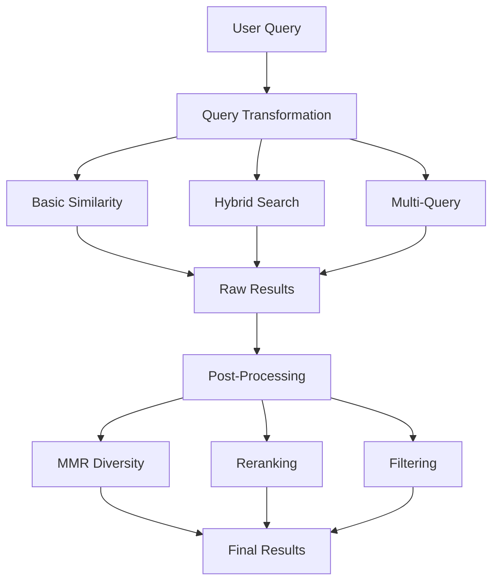
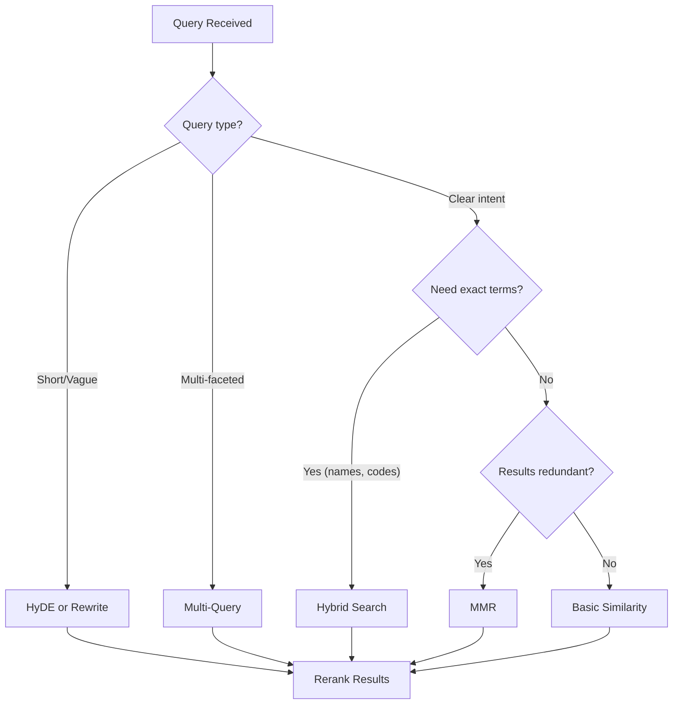

# Retrieval Strategies

## Introduction

Indexing documents is only half the battle. How you retrieve them determines whether your RAG system returns relevant, diverse, and accurate results. The right retrieval strategy can dramatically improve answer quality.

This lesson explores retrieval strategies from basic similarity search to advanced techniques like hybrid search, query transformation, and parent-child retrieval.

### What We'll Cover

- Basic similarity search fundamentals
- Maximum Marginal Relevance (MMR) for diversity
- Hybrid search combining keyword and semantic
- Query transformation techniques
- Advanced retrieval patterns

### Prerequisites

- Understanding of embeddings and vector search
- Familiarity with vector databases
- Basic RAG pipeline knowledge

---

## Quick Start

A basic retrieval implementation using OpenAI's vector store API:

```python
from openai import OpenAI

client = OpenAI()

# Search with similarity
results = client.vector_stores.search(
    vector_store_id="vs_abc123",
    query="What is the return policy?",
    max_num_results=10
)

# Process results
for result in results.data:
    print(f"Score: {result.score:.3f}")
    print(f"File: {result.filename}")
    for chunk in result.content:
        print(f"  {chunk.text[:100]}...")
```

---

## Retrieval Strategy Overview



---

## Strategy Comparison

| Strategy | Best For | Trade-offs |
|----------|----------|------------|
| **Basic Similarity** | Simple queries, fast response | May return redundant results |
| **MMR** | Diverse results needed | Slightly slower, tuning required |
| **Hybrid Search** | Mixed keyword/semantic needs | More complex, higher latency |
| **Query Rewriting** | Ambiguous queries | Extra LLM call |
| **HyDE** | Short or vague queries | Expensive (generates answer first) |
| **Multi-Query** | Complex, multi-faceted questions | Multiple searches needed |
| **Parent-Child** | Need both precision and context | Complex indexing |

---

## When to Use Each Strategy



---

## Key Concepts

| Concept | Description |
|---------|-------------|
| **Top-k** | Number of results to return |
| **Score Threshold** | Minimum similarity score to include |
| **Diversity** | Avoiding redundant/similar results |
| **Fusion** | Combining results from multiple searches |
| **Reranking** | Re-scoring results with a more accurate model |

---

## Lesson Structure

This lesson covers retrieval strategies in depth:

| File | Topics |
|------|--------|
| [Basic Similarity Search](./01-basic-similarity-search.md) | Top-k, thresholds, scoring |
| [Maximum Marginal Relevance](./02-maximum-marginal-relevance.md) | Diversity, lambda tuning |
| [Hybrid Search](./03-hybrid-search.md) | BM25 + vector, RRF, OpenAI weights |
| [Query Transformation](./04-query-transformation.md) | Rewriting, HyDE, multi-query |
| [Advanced Retrieval](./05-advanced-retrieval.md) | Parent-child, filtering, ranking |

---

## Summary

Effective retrieval requires matching strategy to query type:

✅ **Basic similarity** — Fast, simple, works for most queries
✅ **MMR** — When you need diverse, non-redundant results
✅ **Hybrid search** — When exact keyword matches matter
✅ **Query transformation** — For ambiguous or complex queries
✅ **Reranking** — Final quality improvement step

**Next:** [Basic Similarity Search](./01-basic-similarity-search.md)

---

## Further Reading

- [OpenAI Retrieval Guide](https://platform.openai.com/docs/guides/retrieval) - Official vector store search
- [Pinecone Hybrid Search](https://docs.pinecone.io/guides/search/hybrid-search) - Sparse + dense vectors
- [Cohere Reranking](https://docs.cohere.com/docs/reranking) - Cross-encoder reranking

<!--
Sources Consulted:
- OpenAI Retrieval API documentation
- Pinecone hybrid search guide
- Cohere reranking documentation
-->
