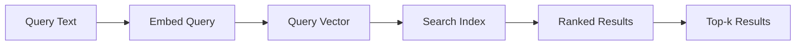

# Basic Similarity Search

## Introduction

Similarity search is the foundation of vector-based retrieval. You embed a query, find the most similar vectors in your index, and return the corresponding documents. Simple, fast, and effective for most use cases.

This lesson covers the fundamentals of similarity search, including top-k retrieval, score thresholds, and result scoring.

### What We'll Cover

- How similarity search works
- Top-k retrieval patterns
- Similarity score interpretation
- Score thresholds for quality control
- OpenAI vector store search API

### Prerequisites

- Understanding of vector embeddings
- Basic vector database knowledge
- Python programming

---

## How Similarity Search Works



The process:
1. **Embed the query** — Convert text to a vector
2. **Search the index** — Find vectors with highest similarity
3. **Rank results** — Order by similarity score
4. **Return top-k** — Return the most relevant results

---

## Similarity Metrics

| Metric | Formula | Range | Best For |
|--------|---------|-------|----------|
| **Cosine** | cos(θ) between vectors | -1 to 1 | Normalized embeddings |
| **Dot Product** | Sum of element products | Unbounded | When magnitude matters |
| **Euclidean** | Distance between points | 0 to ∞ | Spatial relationships |

> **🤖 AI Context:** Most embedding models (OpenAI, Cohere) produce normalized vectors, making cosine similarity the standard choice.

---

## Basic Search with OpenAI Vector Stores

```python
from openai import OpenAI

client = OpenAI()

def basic_search(
    vector_store_id: str,
    query: str,
    top_k: int = 10
) -> list[dict]:
    """
    Perform basic similarity search.
    
    Args:
        vector_store_id: ID of the vector store
        query: Search query text
        top_k: Number of results to return (max 50)
        
    Returns:
        List of search results with scores and content
    """
    results = client.vector_stores.search(
        vector_store_id=vector_store_id,
        query=query,
        max_num_results=top_k
    )
    
    return [
        {
            "file_id": r.file_id,
            "filename": r.filename,
            "score": r.score,
            "content": [c.text for c in r.content],
            "attributes": r.attributes
        }
        for r in results.data
    ]

# Usage
results = basic_search("vs_abc123", "What is the refund policy?")

for r in results:
    print(f"[{r['score']:.3f}] {r['filename']}")
    print(f"  {r['content'][0][:100]}...")
```

**Output:**
```
[0.92] customer_policies.txt
  Our refund policy allows returns within 30 days of purchase. Items must be...
[0.85] faq.txt
  Q: How do I get a refund? A: Contact our support team with your order number...
[0.78] terms.txt
  Refunds are processed within 5-7 business days after we receive the returned...
```

---

## Search with Pinecone

```python
from pinecone import Pinecone

pc = Pinecone(api_key="your-api-key")
index = pc.Index("documents")

def pinecone_search(
    query_embedding: list[float],
    top_k: int = 10,
    namespace: str = "",
    filter_dict: dict = None
) -> list[dict]:
    """
    Search Pinecone index for similar vectors.
    """
    results = index.query(
        vector=query_embedding,
        top_k=top_k,
        namespace=namespace,
        filter=filter_dict,
        include_metadata=True
    )
    
    return [
        {
            "id": match.id,
            "score": match.score,
            "metadata": match.metadata
        }
        for match in results.matches
    ]

# Generate query embedding
from openai import OpenAI
client = OpenAI()

query = "machine learning best practices"
response = client.embeddings.create(
    model="text-embedding-3-small",
    input=query
)
query_embedding = response.data[0].embedding

# Search
results = pinecone_search(query_embedding, top_k=5)
```

---

## Top-k Selection

Choosing the right `k` affects both quality and performance:

| k Value | Use Case | Trade-offs |
|---------|----------|------------|
| **3-5** | Quick answers, chat | Fast, may miss relevant docs |
| **10** | General search (default) | Good balance |
| **20-30** | Comprehensive retrieval | More context, higher latency |
| **50+** | Research, analysis | Exhaustive, expensive |

```python
def adaptive_top_k(
    query: str,
    base_k: int = 10,
    query_complexity_threshold: int = 50
) -> int:
    """
    Adapt top-k based on query complexity.
    
    Longer, more complex queries may need more results.
    """
    query_length = len(query.split())
    
    if query_length > query_complexity_threshold:
        return min(base_k * 2, 50)  # Double k for complex queries
    elif query_length < 5:
        return max(base_k // 2, 3)  # Halve k for simple queries
    
    return base_k

# Usage
k = adaptive_top_k("What are the key differences between supervised and unsupervised machine learning approaches?")
# Returns 20 (complex query)

k = adaptive_top_k("refund policy")
# Returns 5 (simple query)
```

---

## Score Interpretation

Understanding what similarity scores mean:

| Score Range | Interpretation | Action |
|-------------|----------------|--------|
| **0.90+** | Excellent match | High confidence |
| **0.80-0.90** | Good match | Include in results |
| **0.70-0.80** | Moderate match | May be relevant |
| **0.60-0.70** | Weak match | Consider filtering |
| **< 0.60** | Poor match | Likely irrelevant |

> **Note:** These ranges are approximate. Actual thresholds depend on your embedding model and domain.

```python
def categorize_results(
    results: list[dict],
    thresholds: dict = None
) -> dict:
    """
    Categorize results by confidence level.
    """
    if thresholds is None:
        thresholds = {
            "excellent": 0.90,
            "good": 0.80,
            "moderate": 0.70,
            "weak": 0.60
        }
    
    categorized = {
        "excellent": [],
        "good": [],
        "moderate": [],
        "weak": [],
        "poor": []
    }
    
    for result in results:
        score = result["score"]
        
        if score >= thresholds["excellent"]:
            categorized["excellent"].append(result)
        elif score >= thresholds["good"]:
            categorized["good"].append(result)
        elif score >= thresholds["moderate"]:
            categorized["moderate"].append(result)
        elif score >= thresholds["weak"]:
            categorized["weak"].append(result)
        else:
            categorized["poor"].append(result)
    
    return categorized

# Usage
results = basic_search("vs_abc123", "refund policy", top_k=20)
categorized = categorize_results(results)

print(f"Excellent: {len(categorized['excellent'])}")
print(f"Good: {len(categorized['good'])}")
print(f"Poor (filtered): {len(categorized['poor'])}")
```

---

## Score Thresholds

Filter results below a minimum score:

```python
def search_with_threshold(
    vector_store_id: str,
    query: str,
    score_threshold: float = 0.70,
    max_results: int = 10
) -> list[dict]:
    """
    Search with minimum score threshold.
    
    OpenAI supports this natively via ranking_options.
    """
    results = client.vector_stores.search(
        vector_store_id=vector_store_id,
        query=query,
        max_num_results=max_results,
        ranking_options={
            "ranker": "auto",
            "score_threshold": score_threshold
        }
    )
    
    return [
        {
            "file_id": r.file_id,
            "score": r.score,
            "content": [c.text for c in r.content]
        }
        for r in results.data
    ]

# Usage - only return results with score >= 0.75
results = search_with_threshold(
    "vs_abc123",
    "refund policy",
    score_threshold=0.75
)
```

### Manual Threshold Filtering

When the API doesn't support thresholds:

```python
def filter_by_threshold(
    results: list[dict],
    threshold: float
) -> list[dict]:
    """
    Filter results by minimum score threshold.
    """
    return [r for r in results if r["score"] >= threshold]

# Dynamic threshold based on result distribution
def dynamic_threshold(
    results: list[dict],
    percentile: float = 0.25
) -> float:
    """
    Calculate threshold based on score distribution.
    
    Returns score at given percentile (e.g., 25th percentile).
    """
    if not results:
        return 0.0
    
    scores = sorted([r["score"] for r in results])
    index = int(len(scores) * percentile)
    
    return scores[index]

# Usage
results = pinecone_search(query_embedding, top_k=20)
threshold = dynamic_threshold(results, percentile=0.3)
filtered = filter_by_threshold(results, threshold)
```

---

## Handling No Results

When search returns no or low-quality results:

```python
from dataclasses import dataclass
from typing import Optional

@dataclass
class SearchResult:
    """Search result with quality assessment."""
    results: list[dict]
    quality: str  # "good", "partial", "none"
    message: Optional[str] = None

def search_with_fallback(
    vector_store_id: str,
    query: str,
    min_threshold: float = 0.60,
    top_k: int = 10
) -> SearchResult:
    """
    Search with fallback handling for low-quality results.
    """
    results = basic_search(vector_store_id, query, top_k)
    
    if not results:
        return SearchResult(
            results=[],
            quality="none",
            message="No results found. Try rephrasing your query."
        )
    
    # Filter by threshold
    good_results = [r for r in results if r["score"] >= min_threshold]
    
    if not good_results:
        # Return best available with warning
        return SearchResult(
            results=results[:3],
            quality="partial",
            message="No high-confidence matches. These results may be less relevant."
        )
    
    return SearchResult(
        results=good_results,
        quality="good"
    )

# Usage
result = search_with_fallback("vs_abc123", "quantum computing applications")

if result.quality == "none":
    print(f"⚠️ {result.message}")
elif result.quality == "partial":
    print(f"⚠️ {result.message}")
    for r in result.results:
        print(f"  [{r['score']:.2f}] {r['content'][0][:50]}...")
else:
    for r in result.results:
        print(f"  [{r['score']:.2f}] {r['content'][0][:50]}...")
```

---

## Performance Optimization

Tips for faster similarity search:

```python
from functools import lru_cache
import hashlib

# 1. Cache query embeddings
@lru_cache(maxsize=1000)
def get_cached_embedding(query: str) -> tuple:
    """Cache embeddings for repeated queries."""
    response = client.embeddings.create(
        model="text-embedding-3-small",
        input=query
    )
    return tuple(response.data[0].embedding)

# 2. Batch multiple queries
def batch_search(
    index,
    queries: list[str],
    top_k: int = 10
) -> list[list[dict]]:
    """
    Batch multiple search queries.
    """
    # Generate embeddings in batch
    response = client.embeddings.create(
        model="text-embedding-3-small",
        input=queries
    )
    
    embeddings = [e.embedding for e in response.data]
    
    # Search for each query
    all_results = []
    for embedding in embeddings:
        results = index.query(
            vector=embedding,
            top_k=top_k,
            include_metadata=True
        )
        all_results.append([
            {"id": m.id, "score": m.score, "metadata": m.metadata}
            for m in results.matches
        ])
    
    return all_results

# 3. Use smaller dimensions for faster search
# text-embedding-3-small: 1536 dims
# text-embedding-3-large with dimensions=256: faster but less accurate

def create_compact_embedding(text: str, dimensions: int = 256) -> list[float]:
    """
    Create smaller embedding for faster search.
    """
    response = client.embeddings.create(
        model="text-embedding-3-large",
        input=text,
        dimensions=dimensions  # Reduce from 3072 to 256
    )
    return response.data[0].embedding
```

---

## Hands-on Exercise

### Your Task

Build a `SearchEngine` class that:
1. Performs similarity search
2. Applies score thresholds
3. Categorizes results by confidence
4. Handles empty results gracefully

### Requirements

```python
class SearchEngine:
    def search(
        self,
        query: str,
        top_k: int = 10,
        min_score: float = 0.0
    ) -> SearchResult:
        """
        Returns SearchResult with:
        - results: filtered list
        - quality: "good", "partial", or "none"
        - stats: {"total": int, "filtered": int, "avg_score": float}
        """
        pass
```

<details>
<summary>💡 Hints</summary>

- Use the OpenAI vector store search API
- Filter results after retrieval if needed
- Calculate average score from filtered results
- Return "partial" when only low-score results exist

</details>

<details>
<summary>✅ Solution</summary>

```python
from dataclasses import dataclass
from openai import OpenAI

@dataclass
class SearchResult:
    results: list[dict]
    quality: str
    stats: dict

class SearchEngine:
    def __init__(self, vector_store_id: str):
        self.client = OpenAI()
        self.vector_store_id = vector_store_id
    
    def search(
        self,
        query: str,
        top_k: int = 10,
        min_score: float = 0.0
    ) -> SearchResult:
        # Perform search
        response = self.client.vector_stores.search(
            vector_store_id=self.vector_store_id,
            query=query,
            max_num_results=top_k
        )
        
        # Convert to dicts
        all_results = [
            {
                "file_id": r.file_id,
                "filename": r.filename,
                "score": r.score,
                "content": [c.text for c in r.content]
            }
            for r in response.data
        ]
        
        if not all_results:
            return SearchResult(
                results=[],
                quality="none",
                stats={"total": 0, "filtered": 0, "avg_score": 0.0}
            )
        
        # Filter by score
        filtered = [r for r in all_results if r["score"] >= min_score]
        
        # Calculate stats
        total = len(all_results)
        filtered_count = len(filtered)
        avg_score = sum(r["score"] for r in filtered) / filtered_count if filtered else 0.0
        
        # Determine quality
        if filtered_count == 0:
            quality = "none"
            filtered = all_results[:3]  # Return top 3 as fallback
        elif avg_score >= 0.8:
            quality = "good"
        else:
            quality = "partial"
        
        return SearchResult(
            results=filtered,
            quality=quality,
            stats={
                "total": total,
                "filtered": filtered_count,
                "avg_score": round(avg_score, 3)
            }
        )

# Test
engine = SearchEngine("vs_abc123")
result = engine.search("refund policy", min_score=0.7)

print(f"Quality: {result.quality}")
print(f"Stats: {result.stats}")
for r in result.results[:3]:
    print(f"  [{r['score']:.2f}] {r['filename']}")
```

</details>

---

## Summary

Basic similarity search provides the foundation for RAG retrieval:

✅ **Top-k retrieval** — Return the k most similar results
✅ **Score interpretation** — Understand what scores mean
✅ **Threshold filtering** — Remove low-quality results
✅ **Fallback handling** — Gracefully handle no/poor results
✅ **Performance optimization** — Caching, batching, compact embeddings

**Next:** [Maximum Marginal Relevance](./02-maximum-marginal-relevance.md)

---

## Further Reading

- [OpenAI Vector Store Search](https://platform.openai.com/docs/guides/retrieval) - Official search documentation
- [Pinecone Query](https://docs.pinecone.io/guides/search/query-data) - Vector similarity search
- [Cosine Similarity Explained](https://en.wikipedia.org/wiki/Cosine_similarity) - Mathematical background

<!--
Sources Consulted:
- OpenAI Retrieval API documentation
- Pinecone query guide
- Vector similarity search best practices
-->
