# Maximum Marginal Relevance (MMR)

## Introduction

Similarity search often returns redundant results—documents that are relevant but say essentially the same thing. Maximum Marginal Relevance (MMR) solves this by balancing relevance with diversity, ensuring your results cover different aspects of the query.

This lesson covers how MMR works, when to use it, and how to tune the lambda parameter for your use case.

### What We'll Cover

- The redundancy problem in similarity search
- How MMR balances relevance and diversity
- Lambda parameter tuning
- Implementing MMR from scratch
- When MMR helps (and when it doesn't)

### Prerequisites

- Understanding of similarity search
- Basic linear algebra concepts
- Python programming

---

## The Redundancy Problem

Consider searching for "machine learning best practices":

| Rank | Document | Score | Problem |
|------|----------|-------|---------|
| 1 | "Best practices for ML include data quality..." | 0.95 | ✓ Great |
| 2 | "ML best practices: ensure data quality..." | 0.93 | ✗ Redundant |
| 3 | "Good practices in machine learning: quality data..." | 0.91 | ✗ Redundant |
| 4 | "Model validation is crucial for ML success..." | 0.87 | ✓ Different topic |
| 5 | "Data quality is the foundation of ML..." | 0.85 | ✗ Redundant |

Three of the top 5 results say essentially the same thing about data quality. The user misses information about model validation, hyperparameter tuning, and deployment.

---

## How MMR Works

MMR selects documents that are:
1. **Relevant** to the query (high similarity)
2. **Diverse** from already-selected documents (low similarity to previous picks)

```mermaid
flowchart LR
    subgraph Selection["MMR Selection Process"]
        D1["Doc 1: Relevant ✓"] --> S["Selected"]
        D2["Doc 2: Relevant but similar to D1"] --> Skip1["Skipped"]
        D3["Doc 3: Relevant and different"] --> S
        D4["Doc 4: Relevant but similar to D3"] --> Skip2["Skipped"]
        D5["Doc 5: Relevant and different"] --> S
    end
```



### The MMR Formula

$$MMR = \arg\max_{d_i \in R \setminus S} \left[ \lambda \cdot Sim(d_i, q) - (1 - \lambda) \cdot \max_{d_j \in S} Sim(d_i, d_j) \right]$$

Where:
- $d_i$ = candidate document
- $q$ = query
- $S$ = already selected documents
- $R$ = all retrieved documents
- $\lambda$ = trade-off parameter (0 to 1)

**In plain English:**
- Score = λ × (relevance to query) − (1−λ) × (similarity to already-selected docs)
- High λ (0.9) → prioritize relevance
- Low λ (0.5) → prioritize diversity

---

## Lambda Parameter

| Lambda | Behavior | Use Case |
|--------|----------|----------|
| **1.0** | Pure relevance (no diversity) | Equivalent to regular search |
| **0.9** | Mostly relevance, slight diversity | FAQ, specific questions |
| **0.7** | Balanced (common default) | General search |
| **0.5** | Equal relevance and diversity | Research, exploration |
| **0.3** | Mostly diversity | Brainstorming, discovery |


---

## Implementing MMR

### Basic MMR Implementation

```python
import numpy as np
from typing import Callable

def mmr(
    query_embedding: np.ndarray,
    candidate_embeddings: np.ndarray,
    candidate_ids: list[str],
    k: int = 10,
    lambda_param: float = 0.7,
    similarity_fn: Callable = None
) -> list[tuple[str, float]]:
    """
    Maximum Marginal Relevance selection.
    
    Args:
        query_embedding: Query vector
        candidate_embeddings: Matrix of candidate vectors (n x dim)
        candidate_ids: IDs corresponding to candidates
        k: Number of results to return
        lambda_param: Trade-off between relevance (1.0) and diversity (0.0)
        similarity_fn: Similarity function (default: cosine)
        
    Returns:
        List of (id, score) tuples
    """
    if similarity_fn is None:
        similarity_fn = cosine_similarity
    
    # Calculate query-document similarities
    query_similarities = similarity_fn(query_embedding, candidate_embeddings)
    
    # Track selected and remaining candidates
    selected_indices = []
    remaining_indices = list(range(len(candidate_ids)))
    
    results = []
    
    for _ in range(min(k, len(candidate_ids))):
        best_score = -float('inf')
        best_idx = None
        
        for idx in remaining_indices:
            # Relevance score
            relevance = query_similarities[idx]
            
            # Diversity score (max similarity to already selected)
            if selected_indices:
                selected_embeddings = candidate_embeddings[selected_indices]
                similarities_to_selected = similarity_fn(
                    candidate_embeddings[idx],
                    selected_embeddings
                )
                max_similarity = np.max(similarities_to_selected)
            else:
                max_similarity = 0
            
            # MMR score
            mmr_score = lambda_param * relevance - (1 - lambda_param) * max_similarity
            
            if mmr_score > best_score:
                best_score = mmr_score
                best_idx = idx
        
        if best_idx is not None:
            selected_indices.append(best_idx)
            remaining_indices.remove(best_idx)
            results.append((candidate_ids[best_idx], query_similarities[best_idx]))
    
    return results

def cosine_similarity(a: np.ndarray, b: np.ndarray) -> np.ndarray:
    """Compute cosine similarity between vector(s)."""
    if a.ndim == 1:
        a = a.reshape(1, -1)
    if b.ndim == 1:
        b = b.reshape(1, -1)
    
    a_norm = a / np.linalg.norm(a, axis=1, keepdims=True)
    b_norm = b / np.linalg.norm(b, axis=1, keepdims=True)
    
    similarity = np.dot(a_norm, b_norm.T)
    
    return similarity.flatten() if similarity.size > 1 else similarity[0, 0]
```

### Using MMR with Vector Search

```python
from openai import OpenAI
import numpy as np

client = OpenAI()

def search_with_mmr(
    vector_store_id: str,
    query: str,
    fetch_k: int = 20,
    k: int = 5,
    lambda_param: float = 0.7
) -> list[dict]:
    """
    Search with MMR for diverse results.
    
    Args:
        vector_store_id: OpenAI vector store ID
        query: Search query
        fetch_k: Number of candidates to fetch
        k: Number of final results after MMR
        lambda_param: Relevance vs diversity trade-off
    """
    # Step 1: Fetch more candidates than needed
    results = client.vector_stores.search(
        vector_store_id=vector_store_id,
        query=query,
        max_num_results=fetch_k
    )
    
    if not results.data:
        return []
    
    # Step 2: Get embeddings for query and candidates
    query_embedding = get_embedding(query)
    
    candidate_texts = []
    candidate_ids = []
    
    for r in results.data:
        text = " ".join([c.text for c in r.content])
        candidate_texts.append(text)
        candidate_ids.append(r.file_id)
    
    candidate_embeddings = get_embeddings(candidate_texts)
    
    # Step 3: Apply MMR
    mmr_results = mmr(
        query_embedding=np.array(query_embedding),
        candidate_embeddings=np.array(candidate_embeddings),
        candidate_ids=candidate_ids,
        k=k,
        lambda_param=lambda_param
    )
    
    # Step 4: Return reordered results
    id_to_result = {r.file_id: r for r in results.data}
    
    return [
        {
            "file_id": file_id,
            "score": score,
            "content": [c.text for c in id_to_result[file_id].content]
        }
        for file_id, score in mmr_results
    ]

def get_embedding(text: str) -> list[float]:
    """Get embedding for single text."""
    response = client.embeddings.create(
        model="text-embedding-3-small",
        input=text
    )
    return response.data[0].embedding

def get_embeddings(texts: list[str]) -> list[list[float]]:
    """Get embeddings for multiple texts."""
    response = client.embeddings.create(
        model="text-embedding-3-small",
        input=texts
    )
    return [e.embedding for e in response.data]
```

---

## Optimized MMR with NumPy

For better performance with large result sets:

```python
import numpy as np

def mmr_optimized(
    query_embedding: np.ndarray,
    candidate_embeddings: np.ndarray,
    k: int = 10,
    lambda_param: float = 0.7
) -> list[int]:
    """
    Optimized MMR using vectorized operations.
    
    Returns indices of selected candidates.
    """
    n = len(candidate_embeddings)
    
    if k >= n:
        return list(range(n))
    
    # Normalize embeddings
    query_norm = query_embedding / np.linalg.norm(query_embedding)
    candidates_norm = candidate_embeddings / np.linalg.norm(
        candidate_embeddings, axis=1, keepdims=True
    )
    
    # Query-document similarities
    query_sims = np.dot(candidates_norm, query_norm)
    
    # Pre-compute document-document similarity matrix
    doc_sims = np.dot(candidates_norm, candidates_norm.T)
    
    # Greedy selection
    selected = []
    remaining = set(range(n))
    
    for _ in range(k):
        best_score = -np.inf
        best_idx = None
        
        for idx in remaining:
            relevance = query_sims[idx]
            
            if selected:
                diversity_penalty = np.max(doc_sims[idx, selected])
            else:
                diversity_penalty = 0
            
            score = lambda_param * relevance - (1 - lambda_param) * diversity_penalty
            
            if score > best_score:
                best_score = score
                best_idx = idx
        
        selected.append(best_idx)
        remaining.remove(best_idx)
    
    return selected
```

---

## When MMR Helps

| Scenario | Benefit |
|----------|---------|
| **Research queries** | Covers multiple perspectives |
| **Exploration** | Surfaces diverse topics |
| **FAQ retrieval** | Avoids duplicate answers |
| **Multi-faceted topics** | Addresses different aspects |

### Example: Research Query

```python
# Without MMR - redundant results
results_no_mmr = basic_search("climate change impacts", k=5)
# 1. "Climate change impacts on agriculture..."
# 2. "Agricultural impacts of climate change..."
# 3. "How climate change affects farming..."
# 4. "Climate change and food production..."
# 5. "The impact of global warming on crops..."

# With MMR - diverse results
results_mmr = search_with_mmr("climate change impacts", k=5, lambda_param=0.6)
# 1. "Climate change impacts on agriculture..."
# 2. "Rising sea levels threaten coastal cities..."
# 3. "Extreme weather events linked to climate..."
# 4. "Biodiversity loss due to changing climate..."
# 5. "Economic costs of climate adaptation..."
```

---

## When MMR Hurts

| Scenario | Issue |
|----------|-------|
| **Specific fact lookup** | Diversity adds noise |
| **Exact match needed** | Lower relevance scores |
| **Small result sets** | Not enough candidates |

```python
def should_use_mmr(
    query: str,
    candidate_count: int,
    k: int
) -> bool:
    """
    Heuristic for when to apply MMR.
    """
    # Need enough candidates for diversity to matter
    if candidate_count < k * 2:
        return False
    
    # Short, specific queries don't need diversity
    if len(query.split()) < 4:
        return False
    
    # Questions looking for single answers
    specific_patterns = ["what is the", "how do i", "when was", "who is"]
    if any(query.lower().startswith(p) for p in specific_patterns):
        return False
    
    return True
```

---

## Lambda Tuning

Finding the right lambda for your use case:

```python
def evaluate_diversity(results: list[dict]) -> float:
    """
    Calculate average pairwise diversity of results.
    
    Higher = more diverse (0 to 1).
    """
    if len(results) < 2:
        return 1.0
    
    embeddings = get_embeddings([r["content"][0] for r in results])
    embeddings = np.array(embeddings)
    
    # Normalize
    embeddings = embeddings / np.linalg.norm(embeddings, axis=1, keepdims=True)
    
    # Pairwise similarities
    similarities = np.dot(embeddings, embeddings.T)
    
    # Average off-diagonal (exclude self-similarity)
    n = len(results)
    mask = ~np.eye(n, dtype=bool)
    avg_similarity = similarities[mask].mean()
    
    # Convert to diversity (1 - similarity)
    return 1 - avg_similarity

def tune_lambda(
    vector_store_id: str,
    test_queries: list[str],
    lambda_values: list[float] = [0.5, 0.6, 0.7, 0.8, 0.9]
) -> dict:
    """
    Evaluate different lambda values on test queries.
    """
    results = {}
    
    for lambda_param in lambda_values:
        diversities = []
        avg_scores = []
        
        for query in test_queries:
            mmr_results = search_with_mmr(
                vector_store_id,
                query,
                k=10,
                lambda_param=lambda_param
            )
            
            if mmr_results:
                diversities.append(evaluate_diversity(mmr_results))
                avg_scores.append(np.mean([r["score"] for r in mmr_results]))
        
        results[lambda_param] = {
            "avg_diversity": np.mean(diversities),
            "avg_relevance": np.mean(avg_scores)
        }
    
    return results

# Usage
test_queries = [
    "machine learning best practices",
    "climate change impacts",
    "python web development frameworks"
]

tuning_results = tune_lambda("vs_abc123", test_queries)

for lambda_val, metrics in tuning_results.items():
    print(f"Lambda {lambda_val}: Diversity={metrics['avg_diversity']:.3f}, Relevance={metrics['avg_relevance']:.3f}")
```

---

## Hands-on Exercise

### Your Task

Implement an `MMRRetriever` class that:
1. Fetches candidates using similarity search
2. Applies MMR to select diverse results
3. Allows lambda tuning
4. Reports diversity metrics

### Requirements

```python
class MMRRetriever:
    def retrieve(
        self,
        query: str,
        k: int = 5,
        fetch_k: int = 20,
        lambda_param: float = 0.7
    ) -> dict:
        """
        Returns:
        {
            "results": list of documents,
            "diversity_score": float,
            "avg_relevance": float
        }
        """
        pass
```

<details>
<summary>💡 Hints</summary>

- Fetch more candidates than k (use fetch_k)
- Compute document-document similarities
- Select greedily using MMR score
- Calculate diversity as 1 - avg_similarity

</details>

<details>
<summary>✅ Solution</summary>

```python
import numpy as np
from openai import OpenAI

class MMRRetriever:
    def __init__(self, vector_store_id: str):
        self.client = OpenAI()
        self.vector_store_id = vector_store_id
    
    def retrieve(
        self,
        query: str,
        k: int = 5,
        fetch_k: int = 20,
        lambda_param: float = 0.7
    ) -> dict:
        # Fetch candidates
        results = self.client.vector_stores.search(
            vector_store_id=self.vector_store_id,
            query=query,
            max_num_results=fetch_k
        )
        
        if not results.data:
            return {"results": [], "diversity_score": 0, "avg_relevance": 0}
        
        # Get embeddings
        query_emb = self._get_embedding(query)
        
        candidates = []
        for r in results.data:
            text = " ".join([c.text for c in r.content])
            candidates.append({
                "id": r.file_id,
                "text": text,
                "original_score": r.score
            })
        
        texts = [c["text"] for c in candidates]
        candidate_embs = self._get_embeddings(texts)
        
        # Apply MMR
        selected_indices = self._mmr(
            np.array(query_emb),
            np.array(candidate_embs),
            k=k,
            lambda_param=lambda_param
        )
        
        # Build results
        selected = [candidates[i] for i in selected_indices]
        
        # Calculate metrics
        selected_embs = np.array([candidate_embs[i] for i in selected_indices])
        diversity = self._calculate_diversity(selected_embs)
        avg_relevance = np.mean([c["original_score"] for c in selected])
        
        return {
            "results": selected,
            "diversity_score": diversity,
            "avg_relevance": avg_relevance
        }
    
    def _mmr(
        self,
        query_emb: np.ndarray,
        candidate_embs: np.ndarray,
        k: int,
        lambda_param: float
    ) -> list[int]:
        n = len(candidate_embs)
        
        # Normalize
        query_norm = query_emb / np.linalg.norm(query_emb)
        cand_norm = candidate_embs / np.linalg.norm(candidate_embs, axis=1, keepdims=True)
        
        # Similarities
        query_sims = np.dot(cand_norm, query_norm)
        doc_sims = np.dot(cand_norm, cand_norm.T)
        
        selected = []
        remaining = set(range(n))
        
        for _ in range(min(k, n)):
            best_score = -np.inf
            best_idx = None
            
            for idx in remaining:
                rel = query_sims[idx]
                div = np.max(doc_sims[idx, selected]) if selected else 0
                score = lambda_param * rel - (1 - lambda_param) * div
                
                if score > best_score:
                    best_score = score
                    best_idx = idx
            
            selected.append(best_idx)
            remaining.remove(best_idx)
        
        return selected
    
    def _calculate_diversity(self, embeddings: np.ndarray) -> float:
        if len(embeddings) < 2:
            return 1.0
        
        norm = embeddings / np.linalg.norm(embeddings, axis=1, keepdims=True)
        sims = np.dot(norm, norm.T)
        
        n = len(embeddings)
        mask = ~np.eye(n, dtype=bool)
        avg_sim = sims[mask].mean()
        
        return 1 - avg_sim
    
    def _get_embedding(self, text: str) -> list[float]:
        resp = self.client.embeddings.create(
            model="text-embedding-3-small", input=text
        )
        return resp.data[0].embedding
    
    def _get_embeddings(self, texts: list[str]) -> list[list[float]]:
        resp = self.client.embeddings.create(
            model="text-embedding-3-small", input=texts
        )
        return [e.embedding for e in resp.data]

# Test
retriever = MMRRetriever("vs_abc123")
result = retriever.retrieve("machine learning best practices", k=5, lambda_param=0.6)

print(f"Diversity: {result['diversity_score']:.3f}")
print(f"Avg Relevance: {result['avg_relevance']:.3f}")
for r in result["results"]:
    print(f"  [{r['original_score']:.2f}] {r['text'][:50]}...")
```

</details>

---

## Summary

MMR balances relevance with diversity for better search results:

✅ **Avoids redundancy** — Different results cover different topics
✅ **Lambda tuning** — Control relevance vs diversity trade-off
✅ **Greedy selection** — Efficient iterative algorithm
✅ **Fetch more, select fewer** — Retrieve k×2+ candidates, return k
✅ **Use selectively** — Best for research and exploration queries

**Next:** [Hybrid Search](./03-hybrid-search.md)

---

## Further Reading

- [Original MMR Paper](https://www.cs.cmu.edu/~jgc/publication/The_Use_MMR_Diversity_Based_LTMIR_1998.pdf) - Academic foundation
- [LangChain MMR](https://python.langchain.com/docs/how_to/vectorstore_retriever/) - Framework implementation
- [Diversity in Information Retrieval](https://en.wikipedia.org/wiki/Diversity_(information_retrieval)) - Broader context

<!--
Sources Consulted:
- Carbonell & Goldstein (1998) MMR paper
- LangChain vectorstore retriever documentation
- Vector search diversity best practices
-->
