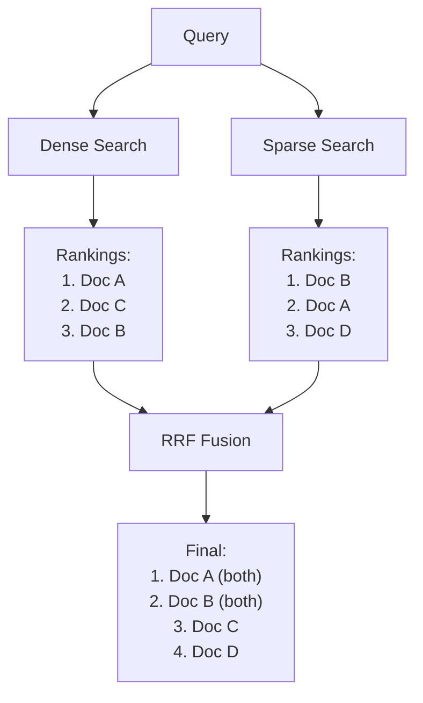

# Hybrid Search

## Introduction

Vector search excels at semantic similarity, but sometimes you need exact keyword matching too. Hybrid search combines dense vectors (semantic) with sparse vectors (keyword) to get the best of both worlds.

This lesson covers how hybrid search works, when to use it, and implementation strategies across different platforms.

### What We'll Cover

- Dense vs sparse search trade-offs
- Reciprocal Rank Fusion (RRF)
- OpenAI hybrid search configuration
- Pinecone hybrid indexes
- Weighting strategies

### Prerequisites

- Understanding of embeddings and vector search
- Familiarity with BM25 or TF-IDF concepts
- Basic search terminology

---

## Why Hybrid Search?

| Search Type | Strength | Weakness |
|-------------|----------|----------|
| **Dense (Vector)** | Semantic understanding, synonyms, concepts | Misses exact terms, new jargon |
| **Sparse (BM25)** | Exact matches, keywords, acronyms | No semantic understanding |
| **Hybrid** | Both semantic and keyword matching | Complexity, tuning needed |

### When Dense Search Fails

```python
# Query: "AWS S3 bucket configuration"

# Dense search might return:
# - "Cloud storage setup guide" (semantically similar)
# - "Object storage configuration" (conceptually related)

# But misses the exact match:
# - "Configure your AWS S3 bucket..." (contains exact keywords)
```

### When Sparse Search Fails

```python
# Query: "How to fix slow database queries"

# BM25 search might return:
# - "Database query optimization" (partial match)

# But misses:
# - "Improving SELECT statement performance" (semantically relevant, different words)
```

---

## Reciprocal Rank Fusion (RRF)

RRF combines rankings from multiple search methods:

$$RRF(d) = \sum_{r \in R} \frac{1}{k + rank_r(d)}$$

Where:
- $d$ = document
- $R$ = set of rankings (dense, sparse)
- $rank_r(d)$ = position of document in ranking $r$
- $k$ = constant (typically 60)



### RRF Implementation

```python
from collections import defaultdict

def reciprocal_rank_fusion(
    rankings: list[list[str]],
    k: int = 60
) -> list[tuple[str, float]]:
    """
    Combine multiple rankings using RRF.
    
    Args:
        rankings: List of ranked document ID lists
        k: RRF constant (default 60)
        
    Returns:
        Fused ranking with scores
    """
    scores = defaultdict(float)
    
    for ranking in rankings:
        for rank, doc_id in enumerate(ranking, start=1):
            scores[doc_id] += 1 / (k + rank)
    
    # Sort by score descending
    fused = sorted(scores.items(), key=lambda x: x[1], reverse=True)
    
    return fused

# Example usage
dense_ranking = ["doc_a", "doc_c", "doc_b", "doc_e"]
sparse_ranking = ["doc_b", "doc_a", "doc_d", "doc_f"]

combined = reciprocal_rank_fusion([dense_ranking, sparse_ranking])

for doc_id, score in combined[:5]:
    print(f"{doc_id}: {score:.4f}")
```

**Output:**
```
doc_a: 0.0323
doc_b: 0.0323
doc_c: 0.0161
doc_d: 0.0161
doc_e: 0.0156
```

---

## OpenAI Hybrid Search

OpenAI's vector store search supports hybrid search through ranking options:

```python
from openai import OpenAI

client = OpenAI()

def hybrid_search(
    vector_store_id: str,
    query: str,
    embedding_weight: float = 0.7,
    text_weight: float = 0.3,
    max_results: int = 10
) -> list[dict]:
    """
    Hybrid search using OpenAI vector stores.
    
    Args:
        vector_store_id: Vector store identifier
        query: Search query
        embedding_weight: Weight for semantic search (0-1)
        text_weight: Weight for keyword search (0-1)
        max_results: Number of results
        
    Note:
        embedding_weight + text_weight should equal 1.0
    """
    results = client.vector_stores.search(
        vector_store_id=vector_store_id,
        query=query,
        max_num_results=max_results,
        ranking_options={
            "ranker": "auto",
            "score_threshold": 0.5,
            "hybrid_search": {
                "embedding_weight": embedding_weight,
                "text_weight": text_weight
            }
        }
    )
    
    return [
        {
            "file_id": r.file_id,
            "score": r.score,
            "content": [c.text for c in r.content]
        }
        for r in results.data
    ]
```

### Weight Configuration

| Weight Setting | Behavior | Use Case |
|----------------|----------|----------|
| `embedding_weight=1.0, text_weight=0.0` | Pure semantic | Natural language queries |
| `embedding_weight=0.7, text_weight=0.3` | Mostly semantic | General search (default) |
| `embedding_weight=0.5, text_weight=0.5` | Balanced | Mixed queries |
| `embedding_weight=0.3, text_weight=0.7` | Mostly keyword | Technical docs, code |
| `embedding_weight=0.0, text_weight=1.0` | Pure keyword | Exact term matching |

```python
def adaptive_hybrid_search(
    vector_store_id: str,
    query: str,
    max_results: int = 10
) -> list[dict]:
    """
    Automatically adjust weights based on query type.
    """
    # Heuristics for query type
    has_technical_terms = any(
        term in query.lower() 
        for term in ["api", "sdk", "json", "http", "sql", "aws", "gcp"]
    )
    
    has_quotes = '"' in query or "'" in query
    
    is_question = query.strip().endswith("?")
    
    # Adjust weights
    if has_quotes:
        # Exact phrase match needed
        embedding_weight = 0.3
        text_weight = 0.7
    elif has_technical_terms:
        # Technical terms need keyword matching
        embedding_weight = 0.5
        text_weight = 0.5
    elif is_question:
        # Questions benefit from semantic understanding
        embedding_weight = 0.8
        text_weight = 0.2
    else:
        # Default balanced approach
        embedding_weight = 0.7
        text_weight = 0.3
    
    return hybrid_search(
        vector_store_id,
        query,
        embedding_weight=embedding_weight,
        text_weight=text_weight,
        max_results=max_results
    )
```

---

## Pinecone Hybrid Search

Pinecone supports two hybrid search approaches:

### Approach 1: Single Hybrid Index

Using dotproduct metric with both dense and sparse vectors:

```python
from pinecone import Pinecone
from pinecone_text.sparse import BM25Encoder

# Initialize
pc = Pinecone(api_key="YOUR_API_KEY")

# Create hybrid index (dotproduct required for hybrid)
pc.create_index(
    name="hybrid-search",
    dimension=1536,
    metric="dotproduct",
    spec={
        "pod": {
            "environment": "us-west1-gcp",
            "pod_type": "p1.x1"
        }
    }
)

index = pc.Index("hybrid-search")

# Train BM25 encoder on your corpus
bm25 = BM25Encoder()
bm25.fit(corpus_texts)

def upsert_hybrid(
    index,
    texts: list[str],
    ids: list[str],
    dense_embeddings: list[list[float]],
    bm25_encoder: BM25Encoder
) -> None:
    """
    Upsert documents with both dense and sparse vectors.
    """
    vectors = []
    
    for id_, text, dense in zip(ids, texts, dense_embeddings):
        sparse = bm25_encoder.encode_documents([text])[0]
        
        vectors.append({
            "id": id_,
            "values": dense,
            "sparse_values": {
                "indices": sparse["indices"],
                "values": sparse["values"]
            },
            "metadata": {"text": text}
        })
    
    index.upsert(vectors=vectors)
```

### Querying with Alpha Weighting

```python
def pinecone_hybrid_search(
    index,
    query: str,
    dense_embedding: list[float],
    bm25_encoder: BM25Encoder,
    alpha: float = 0.7,
    top_k: int = 10
) -> list[dict]:
    """
    Hybrid search with alpha weighting.
    
    Args:
        alpha: 1.0 = pure dense, 0.0 = pure sparse
    """
    # Encode query for sparse search
    sparse_query = bm25_encoder.encode_queries([query])[0]
    
    # Scale vectors by alpha
    scaled_dense = [v * alpha for v in dense_embedding]
    scaled_sparse = {
        "indices": sparse_query["indices"],
        "values": [v * (1 - alpha) for v in sparse_query["values"]]
    }
    
    results = index.query(
        vector=scaled_dense,
        sparse_vector=scaled_sparse,
        top_k=top_k,
        include_metadata=True
    )
    
    return [
        {
            "id": match.id,
            "score": match.score,
            "text": match.metadata.get("text", "")
        }
        for match in results.matches
    ]
```

### Approach 2: Separate Indexes + RRF

For more control, use separate dense and sparse indexes:

```python
def hybrid_search_separate_indexes(
    dense_index,
    sparse_index,
    query: str,
    dense_embedding: list[float],
    sparse_embedding: dict,
    k: int = 10,
    dense_weight: float = 0.7
) -> list[dict]:
    """
    Query separate indexes and combine with RRF.
    """
    # Query both indexes
    dense_results = dense_index.query(
        vector=dense_embedding,
        top_k=k * 2  # Fetch more for fusion
    )
    
    sparse_results = sparse_index.query(
        sparse_vector=sparse_embedding,
        top_k=k * 2
    )
    
    # Extract rankings
    dense_ranking = [m.id for m in dense_results.matches]
    sparse_ranking = [m.id for m in sparse_results.matches]
    
    # Weighted RRF
    fused = weighted_rrf(
        [dense_ranking, sparse_ranking],
        weights=[dense_weight, 1 - dense_weight]
    )
    
    return fused[:k]

def weighted_rrf(
    rankings: list[list[str]],
    weights: list[float],
    k: int = 60
) -> list[tuple[str, float]]:
    """
    RRF with per-ranking weights.
    """
    scores = defaultdict(float)
    
    for ranking, weight in zip(rankings, weights):
        for rank, doc_id in enumerate(ranking, start=1):
            scores[doc_id] += weight * (1 / (k + rank))
    
    return sorted(scores.items(), key=lambda x: x[1], reverse=True)
```

---

## BM25 Implementation

For custom sparse search without external libraries:

```python
import math
from collections import Counter

class BM25:
    """
    BM25 ranking function for sparse retrieval.
    """
    
    def __init__(
        self,
        k1: float = 1.5,
        b: float = 0.75
    ):
        self.k1 = k1
        self.b = b
        self.doc_lengths = []
        self.avg_doc_length = 0
        self.doc_term_freqs = []
        self.idf_cache = {}
        self.corpus_size = 0
    
    def fit(self, documents: list[list[str]]) -> None:
        """
        Fit BM25 on tokenized documents.
        
        Args:
            documents: List of tokenized documents
        """
        self.corpus_size = len(documents)
        
        # Document frequencies (how many docs contain each term)
        doc_freqs = Counter()
        
        for doc in documents:
            self.doc_lengths.append(len(doc))
            term_freqs = Counter(doc)
            self.doc_term_freqs.append(term_freqs)
            
            # Count unique terms per document
            doc_freqs.update(set(doc))
        
        self.avg_doc_length = sum(self.doc_lengths) / len(self.doc_lengths)
        
        # Pre-compute IDF scores
        for term, df in doc_freqs.items():
            idf = math.log(
                (self.corpus_size - df + 0.5) / (df + 0.5) + 1
            )
            self.idf_cache[term] = idf
    
    def score(
        self,
        query_terms: list[str],
        doc_idx: int
    ) -> float:
        """
        Calculate BM25 score for a document.
        """
        score = 0
        doc_length = self.doc_lengths[doc_idx]
        term_freqs = self.doc_term_freqs[doc_idx]
        
        for term in query_terms:
            if term not in term_freqs:
                continue
            
            tf = term_freqs[term]
            idf = self.idf_cache.get(term, 0)
            
            # BM25 term score
            numerator = tf * (self.k1 + 1)
            denominator = tf + self.k1 * (
                1 - self.b + self.b * (doc_length / self.avg_doc_length)
            )
            
            score += idf * (numerator / denominator)
        
        return score
    
    def search(
        self,
        query_terms: list[str],
        top_k: int = 10
    ) -> list[tuple[int, float]]:
        """
        Search all documents and return top-k.
        """
        scores = []
        
        for idx in range(self.corpus_size):
            score = self.score(query_terms, idx)
            if score > 0:
                scores.append((idx, score))
        
        scores.sort(key=lambda x: x[1], reverse=True)
        return scores[:top_k]

# Usage
documents = [
    ["machine", "learning", "best", "practices"],
    ["deep", "learning", "neural", "networks"],
    ["machine", "learning", "tutorial", "python"],
    # ...
]

bm25 = BM25()
bm25.fit(documents)

query = ["machine", "learning"]
results = bm25.search(query, top_k=5)

for doc_idx, score in results:
    print(f"Doc {doc_idx}: {score:.4f}")
```

---

## Complete Hybrid Search Pipeline

```python
from openai import OpenAI
import numpy as np

class HybridSearcher:
    """
    Complete hybrid search pipeline with RRF fusion.
    """
    
    def __init__(
        self,
        vector_store_id: str,
        documents: list[dict]  # [{id, text}]
    ):
        self.client = OpenAI()
        self.vector_store_id = vector_store_id
        
        # Build BM25 index
        self.doc_ids = [d["id"] for d in documents]
        tokenized = [self._tokenize(d["text"]) for d in documents]
        
        self.bm25 = BM25()
        self.bm25.fit(tokenized)
    
    def _tokenize(self, text: str) -> list[str]:
        """Simple tokenization."""
        import re
        return re.findall(r'\w+', text.lower())
    
    def search(
        self,
        query: str,
        k: int = 10,
        alpha: float = 0.7
    ) -> list[dict]:
        """
        Hybrid search with RRF fusion.
        
        Args:
            query: Search query
            k: Number of results
            alpha: Weight for dense search (1-alpha for sparse)
        """
        fetch_k = k * 3  # Fetch more for fusion
        
        # Dense search
        dense_results = self._dense_search(query, fetch_k)
        dense_ranking = [r["id"] for r in dense_results]
        
        # Sparse search
        query_terms = self._tokenize(query)
        sparse_results = self.bm25.search(query_terms, fetch_k)
        sparse_ranking = [self.doc_ids[idx] for idx, _ in sparse_results]
        
        # Fuse with weighted RRF
        fused = self._weighted_rrf(
            [dense_ranking, sparse_ranking],
            [alpha, 1 - alpha]
        )
        
        # Build final results
        id_to_dense = {r["id"]: r for r in dense_results}
        
        results = []
        for doc_id, rrf_score in fused[:k]:
            result = {
                "id": doc_id,
                "rrf_score": rrf_score,
                "dense_score": id_to_dense.get(doc_id, {}).get("score", 0)
            }
            results.append(result)
        
        return results
    
    def _dense_search(self, query: str, k: int) -> list[dict]:
        """Vector store search."""
        results = self.client.vector_stores.search(
            vector_store_id=self.vector_store_id,
            query=query,
            max_num_results=k
        )
        
        return [
            {"id": r.file_id, "score": r.score}
            for r in results.data
        ]
    
    def _weighted_rrf(
        self,
        rankings: list[list[str]],
        weights: list[float],
        k: int = 60
    ) -> list[tuple[str, float]]:
        """Weighted reciprocal rank fusion."""
        from collections import defaultdict
        
        scores = defaultdict(float)
        
        for ranking, weight in zip(rankings, weights):
            for rank, doc_id in enumerate(ranking, start=1):
                scores[doc_id] += weight * (1 / (k + rank))
        
        return sorted(scores.items(), key=lambda x: x[1], reverse=True)
```

---

## Hands-on Exercise

### Your Task

Build a hybrid search system that:
1. Uses both vector search and BM25
2. Implements RRF fusion with configurable weights
3. Allows switching between pure dense, pure sparse, and hybrid modes

### Requirements

```python
class HybridRetriever:
    def search(
        self,
        query: str,
        mode: str = "hybrid",  # "dense", "sparse", "hybrid"
        k: int = 10,
        dense_weight: float = 0.7
    ) -> list[dict]:
        pass
```

<details>
<summary>💡 Hints</summary>

- For "dense" mode, use only vector search
- For "sparse" mode, use only BM25
- For "hybrid", combine with RRF
- Consider caching BM25 index

</details>

<details>
<summary>✅ Solution</summary>

```python
from openai import OpenAI
from collections import defaultdict
import re

class HybridRetriever:
    def __init__(self, vector_store_id: str, documents: list[dict]):
        self.client = OpenAI()
        self.vector_store_id = vector_store_id
        self.documents = {d["id"]: d for d in documents}
        
        # Build BM25 index
        self.doc_ids = [d["id"] for d in documents]
        tokenized = [self._tokenize(d["text"]) for d in documents]
        
        self.bm25 = BM25()
        self.bm25.fit(tokenized)
    
    def _tokenize(self, text: str) -> list[str]:
        return re.findall(r'\w+', text.lower())
    
    def search(
        self,
        query: str,
        mode: str = "hybrid",
        k: int = 10,
        dense_weight: float = 0.7
    ) -> list[dict]:
        if mode == "dense":
            return self._dense_search(query, k)
        
        elif mode == "sparse":
            return self._sparse_search(query, k)
        
        elif mode == "hybrid":
            return self._hybrid_search(query, k, dense_weight)
        
        else:
            raise ValueError(f"Unknown mode: {mode}")
    
    def _dense_search(self, query: str, k: int) -> list[dict]:
        results = self.client.vector_stores.search(
            vector_store_id=self.vector_store_id,
            query=query,
            max_num_results=k
        )
        
        return [
            {
                "id": r.file_id,
                "score": r.score,
                "method": "dense"
            }
            for r in results.data
        ]
    
    def _sparse_search(self, query: str, k: int) -> list[dict]:
        query_terms = self._tokenize(query)
        results = self.bm25.search(query_terms, k)
        
        return [
            {
                "id": self.doc_ids[idx],
                "score": score,
                "method": "sparse"
            }
            for idx, score in results
        ]
    
    def _hybrid_search(
        self,
        query: str,
        k: int,
        dense_weight: float
    ) -> list[dict]:
        fetch_k = k * 3
        
        # Get both rankings
        dense = self._dense_search(query, fetch_k)
        sparse = self._sparse_search(query, fetch_k)
        
        dense_ranking = [r["id"] for r in dense]
        sparse_ranking = [r["id"] for r in sparse]
        
        # RRF fusion
        scores = defaultdict(float)
        
        for rank, doc_id in enumerate(dense_ranking, start=1):
            scores[doc_id] += dense_weight * (1 / (60 + rank))
        
        for rank, doc_id in enumerate(sparse_ranking, start=1):
            scores[doc_id] += (1 - dense_weight) * (1 / (60 + rank))
        
        fused = sorted(scores.items(), key=lambda x: x[1], reverse=True)
        
        # Build results
        dense_scores = {r["id"]: r["score"] for r in dense}
        sparse_scores = {r["id"]: r["score"] for r in sparse}
        
        return [
            {
                "id": doc_id,
                "rrf_score": rrf_score,
                "dense_score": dense_scores.get(doc_id, 0),
                "sparse_score": sparse_scores.get(doc_id, 0),
                "method": "hybrid"
            }
            for doc_id, rrf_score in fused[:k]
        ]

# Test
documents = [
    {"id": "doc1", "text": "Machine learning best practices guide"},
    {"id": "doc2", "text": "Deep learning neural networks tutorial"},
    # ...
]

retriever = HybridRetriever("vs_abc123", documents)

# Compare modes
dense_results = retriever.search("ML best practices", mode="dense")
sparse_results = retriever.search("ML best practices", mode="sparse")
hybrid_results = retriever.search("ML best practices", mode="hybrid")

print("Dense:", [r["id"] for r in dense_results])
print("Sparse:", [r["id"] for r in sparse_results])
print("Hybrid:", [r["id"] for r in hybrid_results])
```

</details>

---

## Summary

Hybrid search combines semantic and keyword matching:

✅ **RRF fusion** — Combines rankings from multiple sources
✅ **Weight tuning** — Balance dense vs sparse based on use case
✅ **OpenAI native support** — `hybrid_search` in ranking options
✅ **Pinecone hybrid indexes** — Single index with dotproduct metric
✅ **Adaptive weighting** — Adjust based on query characteristics

**Next:** [Query Transformation](./04-query-transformation.md)

---

## Further Reading

- [OpenAI Vector Store Search](https://platform.openai.com/docs/guides/retrieval) - Hybrid search options
- [Pinecone Hybrid Search](https://docs.pinecone.io/guides/data/understanding-hybrid-search) - Implementation guide
- [RRF Paper](https://plg.uwaterloo.ca/~gvcormac/cormacksigir09-rrf.pdf) - Academic foundation

<!--
Sources Consulted:
- OpenAI retrieval and vector store documentation
- Pinecone hybrid search documentation
- Cormack et al. (2009) RRF paper
-->
