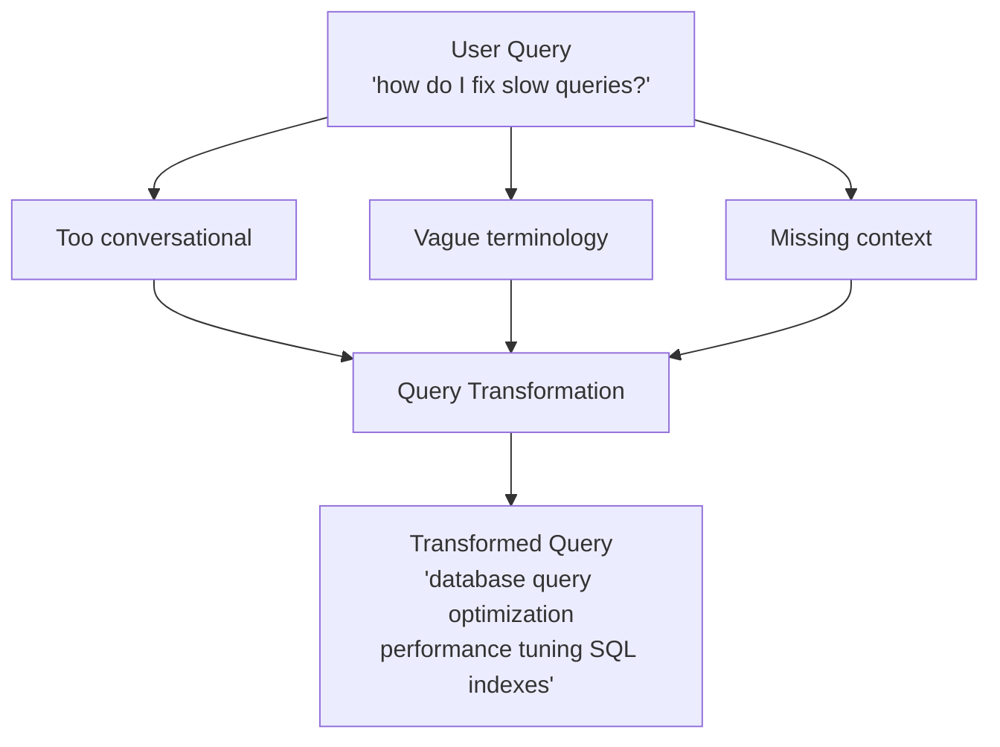
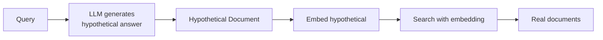

# Query Transformation

## Introduction

User queries are often ambiguous, incomplete, or poorly optimized for embedding search. Query transformation techniques rewrite, expand, or decompose queries to improve retrieval quality.

This lesson covers three powerful techniques: query rewriting, HyDE (Hypothetical Document Embeddings), and multi-query generation.

### What We'll Cover

- Why raw queries often fail
- OpenAI's built-in query rewriting
- HyDE: answering before searching
- Multi-query decomposition
- Combining techniques for complex queries

### Prerequisites

- Understanding of embeddings and similarity search
- Familiarity with LLM prompting
- Basic RAG concepts

---

## The Query Problem

User queries differ from document text in important ways:

| Query Style | Problem | Example |
|-------------|---------|---------|
| **Too short** | Missing context | "python errors" |
| **Conversational** | Doesn't match document style | "how do I fix this?" |
| **Multi-part** | Needs decomposition | "compare X and Y, then explain Z" |
| **Wrong vocabulary** | Doesn't match document terms | "make it faster" vs "optimize" |



---

## OpenAI Query Rewriting

OpenAI's vector store search includes automatic query rewriting:

```python
from openai import OpenAI

client = OpenAI()

def search_with_rewriting(
    vector_store_id: str,
    query: str,
    max_results: int = 10
) -> list[dict]:
    """
    Search with automatic query rewriting.
    
    OpenAI rewrites the query to optimize it for embedding search.
    """
    results = client.vector_stores.search(
        vector_store_id=vector_store_id,
        query=query,
        max_num_results=max_results,
        rewrite_query=True  # Enable automatic rewriting
    )
    
    return [
        {
            "file_id": r.file_id,
            "score": r.score,
            "content": [c.text for c in r.content]
        }
        for r in results.data
    ]
```

> **Note:** `rewrite_query=True` optimizes conversational queries for semantic search. The original query semantics are preserved while improving retrieval.

### When to Use

| Enable Rewriting | When |
|-----------------|------|
| ✅ Yes | Conversational queries, Q&A interfaces |
| ✅ Yes | Queries with pronouns ("it", "this") |
| ❌ No | Exact keyword search needed |
| ❌ No | Already optimized queries |

---

## Custom Query Rewriting

For more control, implement your own rewriting:

```python
from openai import OpenAI

client = OpenAI()

def rewrite_query(
    query: str,
    context: str = None
) -> str:
    """
    Rewrite a query to improve retrieval.
    
    Args:
        query: Original user query
        context: Optional conversation context
    """
    system_prompt = """You are a query optimization assistant.
    
Rewrite the user's query to be:
1. Self-contained (no pronouns without antecedents)
2. Specific and detailed
3. Using terminology likely to appear in technical documents
4. Optimized for semantic similarity search

Return ONLY the rewritten query, nothing else."""

    messages = [{"role": "system", "content": system_prompt}]
    
    if context:
        messages.append({
            "role": "user",
            "content": f"Context: {context}\n\nQuery: {query}"
        })
    else:
        messages.append({"role": "user", "content": query})
    
    response = client.chat.completions.create(
        model="gpt-4o-mini",
        messages=messages,
        temperature=0,
        max_tokens=200
    )
    
    return response.choices[0].message.content.strip()

# Examples
original = "how do I fix this?"
context = "I'm getting timeout errors in my API calls"
rewritten = rewrite_query(original, context)
print(f"Rewritten: {rewritten}")
# "How to resolve API timeout errors and improve request reliability"
```

---

## HyDE: Hypothetical Document Embeddings

HyDE generates a hypothetical answer first, then uses that answer to search. This bridges the gap between question-style queries and document-style content.



### HyDE Implementation

```python
from openai import OpenAI
import numpy as np

client = OpenAI()

def hyde_search(
    vector_store_id: str,
    query: str,
    max_results: int = 10
) -> list[dict]:
    """
    Search using Hypothetical Document Embeddings (HyDE).
    
    1. Generate a hypothetical answer
    2. Embed the hypothetical answer
    3. Search using that embedding
    """
    # Step 1: Generate hypothetical document
    hypothetical = generate_hypothetical_document(query)
    
    # Step 2: Create combined query
    # Use hypothetical as search query for semantic match
    combined_query = f"{query}\n\n{hypothetical}"
    
    # Step 3: Search with hypothetical
    results = client.vector_stores.search(
        vector_store_id=vector_store_id,
        query=combined_query,
        max_num_results=max_results
    )
    
    return [
        {
            "file_id": r.file_id,
            "score": r.score,
            "content": [c.text for c in r.content],
            "hypothetical_used": hypothetical[:100] + "..."
        }
        for r in results.data
    ]

def generate_hypothetical_document(
    query: str,
    doc_style: str = "technical documentation"
) -> str:
    """
    Generate a hypothetical document that would answer the query.
    """
    response = client.chat.completions.create(
        model="gpt-4o-mini",
        messages=[
            {
                "role": "system",
                "content": f"""Write a short passage (2-3 paragraphs) that would appear in {doc_style} to answer the following question. 

Write as if you're an expert author of this documentation. Be specific and technical. Do NOT say "here is" or "this document explains" - just write the content directly."""
            },
            {
                "role": "user",
                "content": query
            }
        ],
        temperature=0.7,
        max_tokens=300
    )
    
    return response.choices[0].message.content
```

### When HyDE Helps

| Scenario | Why HyDE Works |
|----------|----------------|
| Questions vs statements | Answers match document style |
| Short queries | Hypothetical adds detail |
| Domain-specific | LLM knows terminology |
| Conceptual questions | Bridges to concrete examples |

### When HyDE Hurts

| Scenario | Why HyDE Fails |
|----------|----------------|
| Factual lookup | Hypothetical may hallucinate |
| Recent information | LLM knowledge cutoff |
| Exact phrase needed | Hypothetical changes wording |
| Low-latency required | Extra LLM call |

```python
def should_use_hyde(query: str) -> bool:
    """
    Heuristic for when HyDE is beneficial.
    """
    # Questions benefit from HyDE
    if query.strip().endswith("?"):
        return True
    
    # Short queries need expansion
    if len(query.split()) < 5:
        return True
    
    # Conceptual queries
    conceptual_patterns = ["how does", "what is", "explain", "why"]
    if any(p in query.lower() for p in conceptual_patterns):
        return True
    
    # Exact lookups don't need HyDE
    if '"' in query:  # Quoted phrases
        return False
    
    return False
```

---

## Multi-Query Generation

Break complex queries into multiple focused sub-queries:

```python
from openai import OpenAI
import json

client = OpenAI()

def generate_multi_query(
    query: str,
    num_queries: int = 3
) -> list[str]:
    """
    Generate multiple query variations for broader retrieval.
    
    Args:
        query: Original query
        num_queries: Number of variations to generate
    """
    response = client.chat.completions.create(
        model="gpt-4o-mini",
        messages=[
            {
                "role": "system",
                "content": f"""Generate {num_queries} different search queries that would help answer the user's question.

Each query should:
1. Focus on a different aspect of the question
2. Use different vocabulary/phrasing
3. Be specific and search-optimized

Return as a JSON array of strings."""
            },
            {
                "role": "user",
                "content": query
            }
        ],
        temperature=0.7,
        max_tokens=200,
        response_format={"type": "json_object"}
    )
    
    result = json.loads(response.choices[0].message.content)
    return result.get("queries", [query])

def multi_query_search(
    vector_store_id: str,
    query: str,
    num_queries: int = 3,
    results_per_query: int = 5,
    final_k: int = 10
) -> list[dict]:
    """
    Search with multiple query variations.
    """
    # Generate query variations
    queries = generate_multi_query(query, num_queries)
    queries.insert(0, query)  # Include original
    
    # Search with each query
    all_results = {}
    
    for q in queries:
        results = client.vector_stores.search(
            vector_store_id=vector_store_id,
            query=q,
            max_num_results=results_per_query
        )
        
        for r in results.data:
            if r.file_id not in all_results:
                all_results[r.file_id] = {
                    "file_id": r.file_id,
                    "content": [c.text for c in r.content],
                    "max_score": r.score,
                    "query_hits": 1,
                    "queries": [q]
                }
            else:
                all_results[r.file_id]["max_score"] = max(
                    all_results[r.file_id]["max_score"],
                    r.score
                )
                all_results[r.file_id]["query_hits"] += 1
                all_results[r.file_id]["queries"].append(q)
    
    # Rank by query hits, then by score
    ranked = sorted(
        all_results.values(),
        key=lambda x: (x["query_hits"], x["max_score"]),
        reverse=True
    )
    
    return ranked[:final_k]
```

### Query Decomposition

For complex questions with multiple parts:

```python
def decompose_query(query: str) -> list[dict]:
    """
    Decompose a complex query into sub-questions.
    
    Returns list of {sub_query, purpose}
    """
    response = client.chat.completions.create(
        model="gpt-4o-mini",
        messages=[
            {
                "role": "system",
                "content": """Analyze the user's question and break it into simpler sub-questions.

For each sub-question, identify:
1. The specific sub-question to search for
2. Why this sub-question is needed to answer the original

Return as JSON: {"sub_queries": [{"query": "...", "purpose": "..."}]}"""
            },
            {
                "role": "user",
                "content": query
            }
        ],
        temperature=0,
        response_format={"type": "json_object"}
    )
    
    result = json.loads(response.choices[0].message.content)
    return result.get("sub_queries", [{"query": query, "purpose": "original"}])

# Example
query = "Compare Python and JavaScript for machine learning, and explain which frameworks are best for each"

sub_queries = decompose_query(query)
# [
#   {"query": "Python machine learning frameworks", "purpose": "Get Python ML options"},
#   {"query": "JavaScript machine learning libraries", "purpose": "Get JS ML options"},
#   {"query": "Python vs JavaScript performance comparison", "purpose": "Compare the languages"}
# ]
```

---

## Combining Techniques

Use multiple transformation techniques together:

```python
class QueryTransformer:
    """
    Pipeline for query transformation techniques.
    """
    
    def __init__(self):
        self.client = OpenAI()
    
    def transform(
        self,
        query: str,
        context: str = None,
        use_rewrite: bool = True,
        use_hyde: bool = False,
        use_multi_query: bool = False
    ) -> dict:
        """
        Apply transformation pipeline.
        
        Returns:
            {
                "original": str,
                "rewritten": str (if enabled),
                "hypothetical": str (if enabled),
                "multi_queries": list (if enabled),
                "final_queries": list  # What to search with
            }
        """
        result = {
            "original": query,
            "final_queries": [query]
        }
        
        # Step 1: Rewrite if enabled
        working_query = query
        if use_rewrite:
            working_query = self._rewrite(query, context)
            result["rewritten"] = working_query
            result["final_queries"] = [working_query]
        
        # Step 2: Generate hypothetical if enabled
        if use_hyde:
            hypothetical = self._generate_hypothetical(working_query)
            result["hypothetical"] = hypothetical
            result["final_queries"].append(hypothetical)
        
        # Step 3: Generate multi-query if enabled
        if use_multi_query:
            multi = self._generate_multi(working_query)
            result["multi_queries"] = multi
            result["final_queries"].extend(multi)
        
        return result
    
    def _rewrite(self, query: str, context: str = None) -> str:
        prompt = "Rewrite this query to be more specific and search-optimized."
        if context:
            prompt += f"\n\nConversation context: {context}"
        
        response = self.client.chat.completions.create(
            model="gpt-4o-mini",
            messages=[
                {"role": "system", "content": prompt},
                {"role": "user", "content": query}
            ],
            temperature=0,
            max_tokens=150
        )
        return response.choices[0].message.content.strip()
    
    def _generate_hypothetical(self, query: str) -> str:
        response = self.client.chat.completions.create(
            model="gpt-4o-mini",
            messages=[
                {
                    "role": "system",
                    "content": "Write a 2-paragraph technical document excerpt that would answer this question. Write directly, no meta-commentary."
                },
                {"role": "user", "content": query}
            ],
            temperature=0.7,
            max_tokens=250
        )
        return response.choices[0].message.content
    
    def _generate_multi(self, query: str, n: int = 3) -> list[str]:
        response = self.client.chat.completions.create(
            model="gpt-4o-mini",
            messages=[
                {
                    "role": "system",
                    "content": f"Generate {n} alternative phrasings of this query. Return as JSON: {{\"queries\": [...]}}."
                },
                {"role": "user", "content": query}
            ],
            temperature=0.7,
            response_format={"type": "json_object"}
        )
        result = json.loads(response.choices[0].message.content)
        return result.get("queries", [])

# Usage
transformer = QueryTransformer()

# Complex query with all techniques
result = transformer.transform(
    query="how to make my API faster",
    context="We're building a REST API with Python Flask",
    use_rewrite=True,
    use_hyde=True,
    use_multi_query=True
)

print("Original:", result["original"])
print("Rewritten:", result.get("rewritten"))
print("Hypothetical:", result.get("hypothetical", "")[:100], "...")
print("Multi-queries:", result.get("multi_queries"))
print("Total search queries:", len(result["final_queries"]))
```

---

## Adaptive Query Transformation

Choose techniques based on query characteristics:

```python
def adaptive_transform(
    query: str,
    context: str = None
) -> dict:
    """
    Automatically select transformation techniques.
    """
    transformer = QueryTransformer()
    
    # Analyze query characteristics
    is_question = query.strip().endswith("?")
    is_short = len(query.split()) < 5
    is_complex = any(w in query.lower() for w in ["and", "compare", "versus", "both"])
    has_context_dependency = any(w in query.lower() for w in ["it", "this", "that", "they"])
    
    # Decide on techniques
    use_rewrite = has_context_dependency or is_short
    use_hyde = is_question and not is_complex
    use_multi_query = is_complex
    
    return transformer.transform(
        query=query,
        context=context,
        use_rewrite=use_rewrite,
        use_hyde=use_hyde,
        use_multi_query=use_multi_query
    )

# Examples
# Short question → rewrite + HyDE
result1 = adaptive_transform("fix slow queries?")

# Complex comparison → rewrite + multi-query
result2 = adaptive_transform("compare REST and GraphQL for mobile apps")

# Context-dependent → rewrite only
result3 = adaptive_transform("how do I implement this?", context="We discussed OAuth2 earlier")
```

---

## Hands-on Exercise

### Your Task

Build a `SmartQueryProcessor` that:
1. Analyzes query type (question, comparison, lookup)
2. Applies appropriate transformations
3. Returns optimized queries for search

### Requirements

```python
class SmartQueryProcessor:
    def process(
        self,
        query: str,
        context: str = None
    ) -> dict:
        """
        Returns:
        {
            "query_type": "question" | "comparison" | "lookup" | "complex",
            "transformations_applied": list[str],
            "search_queries": list[str]
        }
        """
        pass
```

<details>
<summary>💡 Hints</summary>

- Classify query type first
- Map query types to transformation strategies
- Questions → HyDE
- Comparisons → Multi-query
- Lookups → Simple rewrite

</details>

<details>
<summary>✅ Solution</summary>

```python
from openai import OpenAI
import json
import re

class SmartQueryProcessor:
    def __init__(self):
        self.client = OpenAI()
    
    def process(
        self,
        query: str,
        context: str = None
    ) -> dict:
        # Step 1: Classify query type
        query_type = self._classify_query(query)
        
        # Step 2: Apply transformations based on type
        transformations = []
        search_queries = []
        
        if query_type == "question":
            # Use HyDE for questions
            hypothetical = self._generate_hyde(query)
            transformations.append("hyde")
            search_queries.append(query)
            search_queries.append(hypothetical)
            
        elif query_type == "comparison":
            # Use multi-query for comparisons
            sub_queries = self._generate_multi_query(query)
            transformations.append("multi_query")
            search_queries.extend(sub_queries)
            
        elif query_type == "lookup":
            # Simple rewrite for lookups
            if context or len(query.split()) < 4:
                rewritten = self._rewrite(query, context)
                transformations.append("rewrite")
                search_queries.append(rewritten)
            else:
                search_queries.append(query)
                
        else:  # complex
            # All techniques for complex queries
            rewritten = self._rewrite(query, context)
            transformations.append("rewrite")
            
            sub_queries = self._generate_multi_query(rewritten)
            transformations.append("multi_query")
            
            search_queries.append(rewritten)
            search_queries.extend(sub_queries)
        
        return {
            "query_type": query_type,
            "transformations_applied": transformations,
            "search_queries": search_queries
        }
    
    def _classify_query(self, query: str) -> str:
        q = query.lower().strip()
        
        # Check for comparison
        comparison_words = ["compare", "versus", " vs ", "difference between", "or better"]
        if any(w in q for w in comparison_words):
            return "comparison"
        
        # Check for question
        if q.endswith("?") or q.startswith(("how", "what", "why", "when", "where", "who")):
            return "question"
        
        # Check for complex (multiple parts)
        if " and " in q and len(q.split()) > 10:
            return "complex"
        
        # Default to lookup
        return "lookup"
    
    def _generate_hyde(self, query: str) -> str:
        response = self.client.chat.completions.create(
            model="gpt-4o-mini",
            messages=[
                {
                    "role": "system",
                    "content": "Write a 2-paragraph technical document that answers this question. Write directly without meta-commentary."
                },
                {"role": "user", "content": query}
            ],
            temperature=0.7,
            max_tokens=250
        )
        return response.choices[0].message.content
    
    def _generate_multi_query(self, query: str, n: int = 3) -> list[str]:
        response = self.client.chat.completions.create(
            model="gpt-4o-mini",
            messages=[
                {
                    "role": "system",
                    "content": f"Generate {n} search queries to help answer this. Return JSON: {{\"queries\": [...]}}."
                },
                {"role": "user", "content": query}
            ],
            temperature=0.7,
            response_format={"type": "json_object"}
        )
        result = json.loads(response.choices[0].message.content)
        return result.get("queries", [query])
    
    def _rewrite(self, query: str, context: str = None) -> str:
        msg = query
        if context:
            msg = f"Context: {context}\n\nQuery: {query}"
        
        response = self.client.chat.completions.create(
            model="gpt-4o-mini",
            messages=[
                {
                    "role": "system",
                    "content": "Rewrite this query to be specific and search-optimized. Return only the rewritten query."
                },
                {"role": "user", "content": msg}
            ],
            temperature=0,
            max_tokens=100
        )
        return response.choices[0].message.content.strip()

# Test
processor = SmartQueryProcessor()

# Question → HyDE
r1 = processor.process("How does garbage collection work in Python?")
print("Question:", r1)

# Comparison → Multi-query
r2 = processor.process("Compare REST vs GraphQL for mobile apps")
print("Comparison:", r2)

# Lookup → Rewrite
r3 = processor.process("python list methods")
print("Lookup:", r3)
```

</details>

---

## Summary

Query transformation improves retrieval by bridging the gap between user queries and document content:

✅ **Query rewriting** — Optimize for embedding search
✅ **HyDE** — Answer first, then search with the answer
✅ **Multi-query** — Break complex questions into focused searches
✅ **Decomposition** — Handle multi-part queries
✅ **Adaptive selection** — Choose techniques based on query type

**Next:** [Advanced Retrieval Techniques](./05-advanced-retrieval.md)

---

## Further Reading

- [OpenAI Retrieval Guide](https://platform.openai.com/docs/guides/retrieval) - Built-in query rewriting
- [HyDE Paper](https://arxiv.org/abs/2212.10496) - Hypothetical Document Embeddings research
- [Query Expansion Techniques](https://en.wikipedia.org/wiki/Query_expansion) - Broader context

<!--
Sources Consulted:
- OpenAI retrieval and vector store documentation (rewrite_query parameter)
- Gao et al. (2022) HyDE paper
- Query transformation best practices from RAG literature
-->
